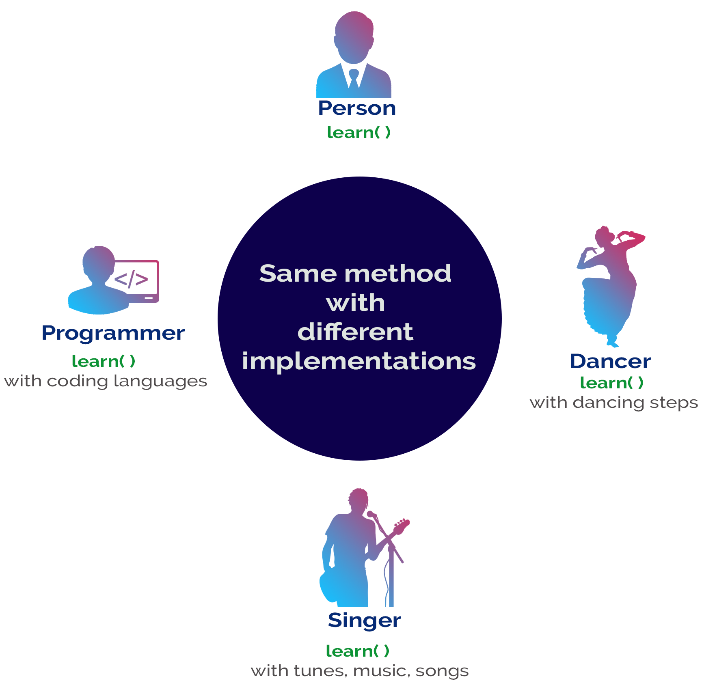
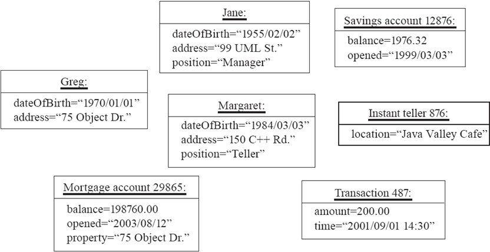

<!-- _backgroundColor: aquq -->

<!-- _color: orange -->

<!-- paginate: false -->

## CE204 Object-Oriented Programming

### Week-1 (Software Engineering and OOP with Java -I)

#### Spring Semester, 2021-2022

Download [DOC-PDF](ce204-week-1.en.md_doc.pdf), [DOC-DOCX](ce204-week-1.en.md_word.docx), [SLIDE](ce204-week-1.en.md_slide.pdf), [PPTX](ce204-week-1.en.md_slide.pptx),

<iframe width=700, height=500 frameBorder=0 src="../ce204-week-1.en.md_slide.html"></iframe>

---

<!-- paginate: true -->

### Brief Description of Course and Rules

We will first talk about, 

1. Course Plan and Communication

2. Grading System, Homeworks, and Exams

please read the syllabus carefully. 

----

### Course Growth Track

- OOP with Java 
- UML
- PlantUML + UMPLE + UML 
- PlantUML + UMPLE + UML + Java
- Design Patterns + UML + Java + UMPLE

----

### Outline (1)

- Software and Software Engineering
- Object Orientation and Review
- OOP with Java Intro
- Basing Software Development on Reusable Technology

---

### Outline (2)

- Java Classes
- Java Objects
- Java Methods
- Java Inheritance
- Java Access Modifiers
- This and InstanceOf Keywords

---

## **Software and Software Engineering**

---

### Software

- Computer Software is the product that software engineers design and build.  

- It encompasses 
  
  - **programs** that execute within a computer of any size and 
    architecture,  
  
  - **documents** that encompass hard-copy and virtual forms, 
  
  - **data**  that combine numbers and text but also includes representations of pictorial, video, and audio information. 

---

### The Nature of Software... (1)

- **Software is intangible**
  Hard to understand development effort

- **Software is easy to reproduce**
  
  - Cost is in its development
    - in other engineering products, manufacturing is the costly stage

- **The industry is labor-intensive**
  
  - Hard to automate

- **Untrained people can hack something together**
  
  - Quality problems are hard to notice

---

### The Nature of Software... (2)

- **Software is easy to modify**
  
  - People make changes without fully understanding it

- **Software does not "wear out"**
  
  - It deteriorates by having its design changed:
    - erroneously, or
    - in ways that were not anticipated, thus making it complex

- **Conclusions**
  
  - Much software has poor design and is getting worse
  - We have to learn to ‘engineer’ software

---

### Some types of Software

- **Real time embedded software**
  - E.g. control and monitoring systems
  - Must react immediately
  - Safety often a concern
- **Data processing software**
  - Used to run businesses
  - Accuracy and security of data are key
- **Game software**
- **Mobile device software**
- **Web-based software**
- *Etc.*

---

### Single Chance

Most of the clients use applications to ease their tasks to make money. For this reason, you do not have a chance to try your application development in real system. Before this deployment you have to use

- Theory

- Experimentation

- Guesses

- Feedback

----

Lets talk about.

## **The Project Construction Cycle - The Tree Swing Example**

---

### 1-How the customer explained it


---

### 2-How the project leader understood it.


---

### 3- How the analyst designed it


---

### 4-How the programmer wrote it


---

### 5-What the beta testers received


---

### 6-How the business consultant described it


---

### 7- How the project was documented


---

### 8-What operations installed


---

### 9-How the customer was billed


---

### 10-How it was supported


---

### 11-What marketing advertised


---

### 12-What the customer really needed


---

### 13-The disaster recover plan


---

### 14- What the digg effect can do to your site


---

### 15- (Finally) When it was delivered


---

## Need  for a good programming method

- **Common problems** 
  
  - Why does it take so long? 
  
  - Why are development costs so high? 
  
  - Why can’t find all faults before delivery? 
  
  - Why can’t we measure development?

*NIST* reported that even though 50 percent of software development budgets go to testing, flaws in software still cost the U.S. economy $59.5 billion annually.*

[Updated NIST Software Uses Combination Testing to Catch Bugs Fast and Easy | NIST](https://www.nist.gov/news-events/news/2010/11/updated-nist-software-uses-combination-testing-catch-bugs-fast-and-easy)

---

## What is Software Engineering? (1)

- The process of **solving customers' problems** by the 
  - systematic development and evolution of large,
  - high-quality software systems within 
    - cost, 
    - time and 
    - other constraints

---

## What is Software Engineering? (2)

- **Solving customers’ problems**
  - The goal
    - Sometimes the solution is to **buy**, not build
    - Adding unnecessary features often makes software worse
    - Software engineers must communicate effectively to identify and understand the problem

---

## What is Software Engineering? (3)

- **Systematic development and evolution**
  - An engineering process involves applying *well understood techniques* in a organized and *disciplined* way
  - Many well-accepted practices have been formally standardized
    - e.g. by the IEEE or ISO 
  - Most development work is evolution 

---

## What is Software Engineering? (4)

- **Large, high quality software systems**
  - Software engineering techniques are needed because large systems *cannot be completely understood* by one person
  - Teamwork and co-ordination are required
  - *Key challenge:* Dividing up the work and ensuring that the parts of the system work properly together
  - The end-product must be of sufficient quality 

---

## What is Software Engineering? (5)

- **Cost, time and other constraints**
  - Finite resources
  - The benefit must outweigh the cost
  - Others are competing to do the job cheaper and faster
  - Inaccurate estimates of cost and time have caused many project failures

---

## The Software Engineering Profession

- **The term Software Engineering was coined in 1968**
  
  - People began to realize that the principles of engineering should be applied to software development

- **Engineering is a licensed profession**
  
  - In order to protect the public
  - Engineers design artifacts following well accepted practices which involve the application of science, mathematics and economics
  - Ethical practice is also a key tenet of the profession

- **In many countries, much software engineering does not require an engineering licence, but is still engineering**

---

## Software Engineering Code of Ethics

- ***Software engineers shall***
  - Act consistently with **public interest**
  - Act in the **best interests of their clients**
  - Develop and maintain with the **highest standards** possible
  - Maintain **integrity and independence**
  - Promote an **ethical** approach in **management**
  - Advance the integrity and **reputation of the profession**
  - Be fair and **supportive to colleagues**
  - Participate in **lifelong learning**

---

## Software Quality

- **Usability**
  - Users can learn it and fast and get their job done easily
- **Efficiency**
  - It doesn’t waste resources such as CPU time and memory
- **Reliability**
  - It does what it is required to do without failing
- **Maintainability**
  - It can be easily changed
- **Reusability**
  - Its parts can be used in other projects, so reprogramming is not needed

---

## Software Quality and Stakeholders


 ---

## Software Quality and Stakeholders

- **Customer (those who pay):**
  - solves problems at an acceptable cost in terms of money paid and resources used
- **User**
  - easy to learn; efficient to use; helps get work done
- **Developer**
  - easy to design; easy to maintain; easy to reuse its parts
- **Development manager**
  - sells more and pleases customers while costing less to develop and maintain

---

## Software Quality Metrics – User

- A program must do its **job correctly**. It must be useful and - usable 
- A program must **run** as **fast** as necessary (Real-time constraints) 
- A program must not **waste system resources**(processor time, - memory, disk capacity, network capacity) too much 
- It must be **reliable** 
- It must be easily **updated** 
- A good software must have sufficient documentation (users manual) 

---

## Software Quality Metrics – SW Developer

- Source code must be **readable and understandable** 
- It must be **easy** to **maintain** and **update** the program 
- A program must consist of **independent modules** 
- An **error** may not affect other parts of a program (Locality of errors) 
- Modules of the program must be **reusable** in other projects 
- A software project must meet its **deadline**
- Good software must have **sufficient documentation**

---

## Software Quality Metrics - OOP

- OOP techniques ensure high-quality programs 
- While designing and coding a program, these quality metrics must always be considered 

---

## Software Quality: **Conflicts and Objectives**

- **The different qualities can conflict**
  
  - Increasing efficiency can reduce maintainability or reusability
  - Increasing usability can reduce efficiency

- **Setting objectives for quality is a key engineering activity**
  
  - You then design to meet the objectives
  - Avoids "over-engineering" which wastes money

---

## Software Engineering Projects

- **Most projects are evolutionary or maintenance projects, involving work on legacy systems**
  - *Corrective* projects: fixing defects
  - *Adaptive* projects: changing the system in response to changes in
    - Operating system
    - Database
    - Rules and regulations
  - *Enhancement* projects: adding new features for users
  - *Reengineering* or  *perfective* projects: changing the system internally so it is more maintainable

---

## Software Engineering Projects Start Points

| Green Field Development                   | Brownfield Development               |
| ----------------------------------------- | ------------------------------------ |
| Start afresh                              | Build on existing code               |
| Choose your technology                    | Technology already chosen            |
| Use your best ideas, patterns, techniques | Understand previous developers' code |
| Learn from mistakes                       | Live with mistakes                   |

---

## Software Engineering Projects Start Points

|                                                       | Requirements must be determined | Clients have produced requirements |
| ----------------------------------------------------- | ------------------------------- | ---------------------------------- |
| **New development, Green Field Project**              | A                               | B                                  |
| **Evolution of Existing System, Brown Field Project** | C                               | D                                  |

---

## Activities Common to Software Projects

- Requirements and specification
  - Includes
    - Domain analysis
    - Defining the problem
    - Requirements gathering
      - Obtaining input from as many sources as possible
    - Requirements analysis
      - Organizing the information
    - Requirements specification
      - Writing detailed instructions about how the software should behave

---

## Activities Common to Software Projects

- **Design**
  - Deciding how the requirements should be implemented, using the available technology
  - Includes:
    - Systems engineering: Deciding what should be in hardware and what in software
    - Software architecture: Dividing the system into subsystems and deciding how the subsystems will interact
    - Detailed design of the internals of a subsystem
    - User interface design
    - Design of databases

---

## Activities Common to Software Projects

- **Modeling**
  - Creating representations of the domain or the software
    - Use case modeling
    - Structural modeling
    - Dynamic and behavioural modeling
- **Programming**
- **Quality assurance**
  - Reviews and inspections
  - Testing
- **Deployment**
- **Managing the process**

---

## Software Projects Development Team


---

## Software Life Cycle

- Requirements Phase 
- Specification Phase 
- Design Phase 
- Implementation Phase 
- Integration Phase 
- Maintenance Phase 
- Retirement Phase 

---

### Requirements Phase

- Defining constraints   
  - Functions 
  - Due dates 
  - Costs 
  - Reliability 
  - Size 
- Types 
  - Functional 
  - Non-Functional 

---

### Specification Phase

- Documentation of requirements   
  - Inputs & Outputs 
  - Formal 
  - Understandable for user & developer 
  - Usually functional requirements (what to do) 
  - Base for testing & maintenance 
- The contract between customer & developer

---

### Design Phase

- Defining Internal structure (how to do) 
- Has some levels (or types of docs) 
  - Architectural design 
  - Detailed design 
- Important 
  - To backtrack the aims of decisions 
  - To easily maintain 

---

### Implementation and Integration Phases

- Implementation phase: Simply coding 
  - Unit tests 
    - For verification 
- Combining modules 
- System tests 
  - For validation 
- Quality tests

---

### Maintenance Phase

- Corrective 

- Enhancement 
  
  - Perfective 
  - Adaptive 

- Usually maintainers are not the same people with developers. 

- The only input is (in general) the source code of the software 

---

### Retirement Phase

- When the cost of maintenance is not effective. 
  - Changes are so drastic, that the software should be redesigned. 
- So many changes may have been made. 
- The update frequency of docs is not enough. 
- The hardware (or OS) will be changed.

---

### Software Development Process


---

### Software Development Process

- **Analysis**: Understanding requirements. They may change during (or after) development of the system! Building the programming team. 
- **Design**: Identifying the key concepts involved in a solution and creation of the models. 
  - This stage has a strong effect on the quality of the software. Therefore, before the coding, verification of the created model must be done. 
  - Design process is connected with the programming scheme. Here, our design style is object-oriented. 

---

### Software Development Process

- **Coding**: The solution (model) is expressed in a program. 
  In this course we will use Java. 
- Documentation: Each phase of a software project must be clearly explained. A users manual should also be written. 
- **Test**: the behavior of the program for possible inputs must be examined. 

These steps are important design principles and design patterns, which help us developing high-quality software. The Unified Modeling Language (UML) is useful to express the model. 

---

## Unified Process (UP)

- The UP promotes several best practices. 
  - Iterative 
  - Incremental 
  - Risk-driven

---

### Unified Process (UP)


---

### Unified Process (UP)


---

## **Object Orientation** Part-1

---

### OOP Concepts in Java

OOP stands for Object-Oriented Programming. OOP is a programming paradigm in which every program is follows the concept of object. In other words, OOP is a way of writing programs based on the object concept.

The object-oriented programming paradigm has the following core concepts.

- Encapsulation
- Inheritance
- Polymorphism
- Abstraction

The popular object-oriented programming languages are Smalltalk, C++, Java, PHP, C#, Python, etc.

---

### Encapsulation

Encapsulation is the process of combining data and code into a single unit (object / class). In OOP, every object is associated with its data and code. In programming, data is defined as variables and code is defined as methods. The java programming language uses the class concept to implement encapsulation.

---

### Encapsulation


---

### Inheritance

Inheritance is the process of acquiring properties and behaviors from one object to another object or one class to another class. In inheritance, we derive a new class from the existing class. Here, the new class acquires the properties and behaviors from the existing class. In the inheritance concept, the class which provides properties is called as parent class and the class which recieves the properties is called as child class. The parent class is also known as base class or supre class. The child class is also known as derived class or sub class.

In the inheritance, the properties and behaviors of base class extended to its derived class, but the base class never receive properties or behaviors from its derived class.

In java programming language the keyword extends is used to implement inheritance.

---

### Inheritance


---

### Polymorphism

Polymorphism is the process of defining same method with different implementation. That means creating multiple methods with different behaviors.

The java uses method overloading and method overriding to implement polymorphism.

Method overloading - multiple methods with same name but different parameters.

Method overriding - multiple methods with same name and same parameters.

---

### Polymorphism



---

### Abstraction

Abstraction is hiding the internal details and showing only esential functionality. In the abstraction concept, we do not show the actual implemention to the end user, instead we provide only esential things. For example, if we want to drive a car, we does not need to know about the internal functionality like how wheel system works? how brake system works? how music system works? etc.

---

### Abstraction


---

### Why Object Technology

- Expectations are, 

- Reducing the effort, complexity, and cost of development and maintenance of software systems. 

- Reducing the time to adapt an existing system (quicker reaction to changes in the business environment): Flexibility, reusability. 

- Increasing the reliability of the system. 

---

### What is Programming?

- A programming language provides a way to express concepts.  
- Program development involves creating models of real world - situations and building computer programs based on these models. 
- Computer programs describe the method of implementing the model. 
- Computer programs may contain computer world representations of the things that constitute the solutions of real world problems.

---

### What is Programming?

If successful, this medium of expression (the object-oriented way) will be significantly easier, more flexible, and efficient than the alternatives as problems grow larger and more complex


---

### Why JAVA

- Java supports writing high quality programs (pure OO) 
- Provides an easy-to-use language 
- Provides an interpreted environment for 
  - Improved development speed 
  - Code portability 
- Simple 
- Architecture Neutral and Portable 
- Robust and Secure 
- High Performance 

---

### Why JAVA

- Write less code 
  - can be four times smaller than the same program written in C++ 
- Write better code 
  - encourages good coding practices, garbage collection for  avoiding memory leaks, wide-ranging, easily extendible API 
- Avoid platform dependencies 
- Write once, run anywhere 
- Gained popularity in gadgets such as 
  - PDAs, cell phones etc. 

---

### Learning JAVA

- Many syntax and grammar rules 
- Learning how to write “good programs” 
- Focusing on concepts and not get lost in language-technical - details 
- Paying attention to design techniques rather than details 
- Building an effective programming scheme 
- Practicing, practicing and practicing! 
- Consequently, new and better ways of building systems 

---

### Java Buzz Words

- Simple
- Secure
- Portable
- Object-oriented
- Robust
- Architecture-neutral (or) Platform Independent
- Multi-threaded
- Interpreted
- High performance
- Distributed
- Dynamic

---

#### Simple

Java programming language is very simple and easy to learn, understand, and code. Most of the syntaxes in java follow basic programming language C and object-oriented programming concepts are similar to C++. In a java programming language, many complicated features like pointers, operator overloading, structures, unions, etc. have been removed. One of the most useful features is the garbage collector it makes java more simple.

---

#### Secure

Java is said to be more secure programming language because it does not have pointers concept, java provides a feature "applet" which can be embedded into a web application. The applet in java does not allow access to other parts of the computer, which keeps away from harmful programs like viruses and unauthorized access.

---

#### Portable

Portability is one of the core features of java which enables the java programs to run on any computer or operating system. For example, an applet developed using java runs on a wide variety of CPUs, operating systems, and browsers connected to the Internet.

---

#### Object-oriented

Java is said to be a pure object-oriented programming language. In java, everything is an object. It supports all the features of the object-oriented programming paradigm. The primitive data types java also implemented as objects using wrapper classes, but still, it allows primitive data types to archive high-performance.

---

#### Robust

Java is more robust because the java code can be executed on a variety of environments, java has a strong memory management mechanism (garbage collector), java is a strictly typed language, it has a strong set of exception handling mechanism, and many more.

---

#### Architecture-neutral (or) Platform Independent

Java has invented to archive "write once; run anywhere, any time, forever". The java provides JVM (Java Virtual Machine) to to archive architectural-neutral or platform-independent. The JVM allows the java program created using one operating system can be executed on any other operating system.

---

#### Multi-threaded

Java supports multi-threading programming, which allows us to write programs that do multiple operations simultaneously.

---

#### Interpreted

Java enables the creation of cross-platform programs by compiling into an intermediate representation called Java bytecode. The byte code is interpreted to any machine code so that it runs on the native machine.

---

#### High performance

Java provides high performance with the help of features like JVM, interpretation, and its simplicity.

---

#### Distributed

Java programming language supports TCP/IP protocols which enable the java to support the distributed environment of the Internet. Java also supports Remote Method Invocation (RMI), this feature enables a program to invoke methods across a network.

---

#### Dynamic

Java is said to be dynamic because the java byte code may be dynamically updated on a running system and it has a dynamic memory allocation and deallocation (objects and garbage collector).

---

### The Basics of Java

History

- The first object oriented programming language was Simula-67 
  - designed to allow programmers to write simulation programs 
- In the early 1980’s, Smalltalk was developed at Xerox PARC 
  - New syntax, large open-source library of reusable code, bytecode, platform independence, garbage collection.

---

### The Basics of Java

- late 1980’s, C++ was developed by B. Stroustrup, 
  - Recognized the advantages of OO but also recognized that there were tremendous numbers of C programmers
- In 1991, engineers at Sun Microsystems started a project to design a language that could be used in consumer ‘smart devices’: Oak 
  - When the Internet gained popularity, Sun saw an opportunity to exploit the technology. 
  - The new language, renamed Java, was formally presented in 1995 at the SunWorld ’95 conference.

---

### Java documentation

- Looking up classes and methods is an essential skill
  - Looking up unknown classes and methods will get you a long way towards understanding code
- Java documentation can be automatically generated by a program called Javadoc
  - Documentation is generated from the code and its comments
  - You should format your comments as shown in some of the book’s examples
    - These may include embeded html

---

### Characters and Strings

- Character is a class representing Unicode characters 
  - More than a byte each
  - Represent any world language
- char is a primitive data type containing a Unicode character
- `String` is a class containing collections of characters
- \+ is the operator used to concatenate strings

---

### Arrays and Collections

- Arrays are of fixed size and lack methods to manipulate them
- ArrayList is the most widely used class to hold a collection of other objects
  - More powerful than arrays, but less efficient
- Iterators are used to access members of Vectors
  - Enumerations were formally used, but were more complex

``` Java linenums="1" hl_lines="2 3 5"
a = new ArrayList();
Iterator i = a.iterator();
while(i.hasNext())
{
   aMethod(i.next());
}
```

---

### Casting

- Java is very strict about types
  - If variable v is declared to have type X, you can only invoke operations on v that are defined in X or its *superclasses*
    - Even though an instance of a subclass of X may be actually stored in the variable
  - If you know an instance of a subclass is stored, then you can cast the variable to the subclass
    - E.g. if I know a Vector contains instances of String, I can get the next element of its Iterator using:
        `(String)i.next();`
    - To avoid casting you could also have used templates::
        `a = ArrayList<String>; i=a.iterator(); i.next()`

---

### Exceptions

- **Anything that can go wrong should result in the raising of an Exception**
  - Exception is a class with many subclasses for specific things that can go wrong
- **Use a try - catch block to trap an exception**

``` Java linenums="1"
try
{
   // some code
}
catch (ArithmeticException e)
{
  // code to handle division by zero
}
```

---

### Interfaces

- **Like abstract classes, but cannot have executable statements**
  - Define a set of operations that make sense in several classes
  - Abstract Data Types
- **A class can implement any number of interfaces**
  - It must have concrete methods for the operations
- **You can declare the type of a variable to be an interface**
  - This is just like declaring the type to be an abstract class
- **Important interfaces in Java’s library include**
  - Runnable, Collection, Iterator, Comparable, Cloneable

---

### Packages and importing

- **A package combines related classes into subsystems**
  - All the classes in a particular directory
- **Classes in different packages can have the same name**
  - Although not recommended
- **Importing a package is done as follows:**
  - `import finance.banking.accounts.*;`

---

### Access control

- **Applies to methods and variables**
  - *public*
    - Any class can access
  - *protected*
    - Only code in the package, or subclasses can access
  - *(blank)*
    - Only code in the package can access
  - *private*
    - Only code written in the class can access
    - Inheritance still occurs!

---

### Threads and concurrency

- **Thread**:
  - Sequence of executing statements that can be running concurrently with other threads
- **To create a thread in Java**:
  - Create a class implementing Runnable or extending Thread
  - Implement the run method as a loop that does something for a period of time
  - Create an instance of this class
  - Invoke the start operation, which calls run

---

### Programming Style Guidelines

- **Remember that programs are for people to read**
  - Always choose the simpler alternative
  - Reject clever code that is hard to understand
  - Shorter code is not necessarily better
- **Choose good names**
  - Make them highly descriptive
  - Do not worry about using long names

---

### Programming style

- **Comment extensively**
  - Comment whatever is non-obvious
  - Do not comment the obvious
  - Comments should be 25-50% of the code
- **Organize class elements consistently**
  - Variables, constructors, public methods then private methods
- **Be consistent regarding layout of code**

---

### Programming style

- Avoid duplication of code
  - Do not "clone" if possible
    - Create a new method and call it
    - Cloning results in two copies that may both have bugs
      - When one copy of the bug is fixed, the other may be forgotten

---

### Programming style

- Adhere to good object oriented principles
  - E.g. the ‘isa rule’
- Prefer **private** as opposed to **public**
- Do not mix user interface code with non-user interface code
  - Interact with the user in separate classes
    - This makes non-UI classes more reusable

---

### Difficulties and Risks in Programming

- **Language evolution and deprecated features**: 
  - Java is evolving, so some features are ‘deprecated’ at every release
- **Efficiency can be a concern in some object oriented systems** 
  - Java can be less efficient than other languages
    - VM-based
    - Dynamic binding

---

### C++ vs Java

| Comparison Index     | C++                                        | Java                                                                                                                                 |
| -------------------- | ------------------------------------------ | ------------------------------------------------------------------------------------------------------------------------------------ |
| Platform-independent | C++ is platform-dependent.                 | Java is platform-independent.                                                                                                        |
| Mainly used for      | C++ is mainly used for system programming. | Java is mainly used for application programming. It is widely used in Windows-based, web-based, enterprise, and mobile applications. |

---

### C++ vs Java

| Comparison Index     | C++                                | Java                                                                                                     |
| -------------------- | ---------------------------------- | -------------------------------------------------------------------------------------------------------- |
| Multiple inheritance | C++ supports multiple inheritance. | Java doesn't support multiple inheritance through class. It can be achieved by using interfaces in java. |
| Operator Overloading | C++ supports operator overloading. | Java doesn't support operator overloading.                                                               |

---

### C++ vs Java

| Comparison Index         | C++                                                                                                                                            | Java                                                                                                                                                                                                                                         |
| ------------------------ | ---------------------------------------------------------------------------------------------------------------------------------------------- | -------------------------------------------------------------------------------------------------------------------------------------------------------------------------------------------------------------------------------------------- |
| Goto                     | C++ supports the goto statement.                                                                                                               | Java doesn't support the goto statement.                                                                                                                                                                                                     |
| Compiler and Interpreter | C++ uses compiler only. C++ is compiled and run using the compiler which converts source code into machine code so, C++ is platform dependent. | Java uses both compiler and interpreter. Java source code is converted into bytecode at compilation time. The interpreter executes this bytecode at runtime and produces output. Java is interpreted that is why it is platform-independent. |

---

### C++ vs Java

| Comparison Index | C++                                                                                                           | Java                                                                                                                                                                                            |
| ---------------- | ------------------------------------------------------------------------------------------------------------- | ----------------------------------------------------------------------------------------------------------------------------------------------------------------------------------------------- |
| Pointers         | C++ supports pointers. You can write a pointer program in C++.                                                | Java supports pointer internally. However, you can't write the pointer program in java. It means java has restricted pointer support in java.                                                   |
| Design Goal      | C++ was designed for systems and applications programming. It was an extension of the C programming language. | Java was designed and created as an interpreter for printing systems but later extended as a support network computing. It was designed to be easy to use and accessible to a broader audience. |

---

### C++ vs Java

| Comparison Index    | C++                                                                                                   | Java                                        |
| ------------------- | ----------------------------------------------------------------------------------------------------- | ------------------------------------------- |
| Structure and Union | C++ supports structures and unions.                                                                   | Java doesn't support structures and unions. |
| Thread Support      | C++ doesn't have built-in support for threads. It relies on third-party libraries for thread support. | Java has built-in thread support.           |

---

### C++ vs Java

| Comparison Index      | C++                                                                                       | Java                                                                                                                                       |
| --------------------- | ----------------------------------------------------------------------------------------- | ------------------------------------------------------------------------------------------------------------------------------------------ |
| Documentation comment | C++ doesn't support documentation comments.                                               | Java supports documentation comment (/** ... */) to create documentation for java source code.                                             |
| Virtual Keyword       | C++ supports virtual keyword so that we can decide whether or not to override a function. | Java has no virtual keyword. We can override all non-static methods by default. In other words, non-static methods are virtual by default. |

---

### C++ vs Java

| Comparison Index         | C++                                        | Java                                                                                                                                                                    |
| ------------------------ | ------------------------------------------ | ----------------------------------------------------------------------------------------------------------------------------------------------------------------------- |
| unsigned right shift >>> | C++ doesn't support >>> operator.          | Java supports unsigned right shift >>> operator that fills zero at the top for the negative numbers. For positive numbers, it works same like >> operator.              |
| Inheritance Tree         | C++ always creates a new inheritance tree. | Java always uses a single inheritance tree because all classes are the child of the Object class in Java. The Object class is the root of the inheritance tree in java. |

---

### C++ vs Java

| Comparison Index | C++                                                                                                      | Java                                                                                                                                                                                           |
| ---------------- | -------------------------------------------------------------------------------------------------------- | ---------------------------------------------------------------------------------------------------------------------------------------------------------------------------------------------- |
| Hardware         | C++ is nearer to hardware.                                                                               | Java is not so interactive with hardware.                                                                                                                                                      |
| Object-oriented  | C++ is an object-oriented language. However, in the C language, a single root hierarchy is not possible. | Java is also an object-oriented language. However, everything (except fundamental types) is an object in Java. It is a single root hierarchy as everything gets derived from java.lang.Object. |

---

## **Object Orientation** Part-2

---

### Procedural Programming

- Pascal, C, Basic, Fortran and similar traditional languages are procedural
  - Each statement tells the computer to do something
- The emphasis is on doing things 
  - Functions 
- A program is divided into functions 
  - Each function has a clearly defined purpose and interface

---

### Procedural Programming


---

### Problems with Procedural Programming

- **Data Is undervalued** 
- Data is, after all, the reason for a program’s existence. The  important parts of a program **are not functions** that display  the data or functions that checks for correct input; they are  **data** 
- Procedural programs don’t model the real world very well. 
  **The real world does not consist of functions** 
- **Global data** can be **corrupted** by functions that have no business changing it  
- To add new data items, all the functions that access data must  be modified so that they can also access these new items 
- Creating **new** data types is **difficult** 

---

### Besides

- It is also possible to write good programs by using procedural programming (C programs).  
- But object-oriented programming offers programmers many advantages, enables them to write high-quality programs

---

### Object-Oriented Programming

The fundamental idea behind object-oriented programming:  

- The **real world** consists of objects. Computer programs may contain computer world representations of the things (objects) that constitute the solutions of real world problems.  
- Real world objects have two parts:  
  - **Properties** (or state: characteristics that can change),  
  - **Behavior** (or abilities: things they can do). 
- To solve a programming problem in an object-oriented language,the programmer no longer asks how the problem will be divided into functions, but **how it will be divided into objects**.  
- The emphasis is on **data** 

---

### Object-Oriented Programming

- **What kinds of things become objects in object-oriented programs?** 
  - **Human entities**: Employees, customers, salespeople,worker, manager 
  - **Graphics program**: Point, line, square, circle, ... 
  - **Mathematics**: Complex numbers, matrix 
  - **Computer user environment**: Windows, menus, buttons 
  - **Data-storage constructs**: Customized arrays, stacks, linked lists 

---

### OOP: Encapsulation and Data Hiding

- Thinking in terms of objects rather than functions 
- Close match between **objects** in the **programming** sense and  **objects in the real world** 
- Both data and the functions that operate on that data are combined into a single program entity 
- **Data** represent the **properties** (state), and **functions** represent the **behavior** of an object. Data and its functions are said to be **encapsulated** into a single entity 
- An object’s functions, called member functions in Java typically provide the only way to access its data. The data is **hidden**, so it is safe from accidental alteration. 

---

### OOP: Encapsulation and Data Hiding

- **Encapsulation** and **data hiding** are key terms in the 
  description of object-oriented languages. 
- If you want to modify the data in an object, you know exactly what functions to interact with it 
  - The member functions in the object. 
  - No other functions can access the data: This simplifies writing, debugging, and maintaining the program. 

---

### Example: A Point on the plane

- A Point on a plane has two properties; x-y coordinates. 
- Abilities (behavior) of a Point are, moving on the plane, appearing on the screen and disappearing.  
- A model for 2 dimensional points with the following parts: 
  - Two integer variables `(x,y)` to represent x and y  coordinates 
  - A function to move the point: `move` 
  - A function to print the point on the screen: `print` 
  - A function to hide the point: `hide` 

---

### Example: A Point on the plane

- Once the **model** has been built and tested, it is  possible to create many **objects of this model**, in the  main program. 

``` Java linenums="1"
Point pointOne = new Point(67, 89); 
Point pointTwo = new Point(12, 34); 

public class Point { 
    public int x = 0; 
    public int y = 0; 
    public Point(int a, int b) { 
    x = a; 
    y = b; 
    } 
} 
```

---

### Object Model

A Java program typically consists of a number of  objects that communicate with each other by calling  one another’s member functions.


---

### OOP vs. Procedural Programming

- Procedural languages still require you to think in terms of the **structure of the computer** rather than the **structure of the problem** you are trying to solve. 
- The programmer must establish the association between the **machine model** and the **model of the problem** that is actually being solved. 
- The effort required to perform this mapping produces programs that are **difficult to write** and **expensive to maintain**. Because the real world thing and their models on the computer are quite different

---

### Example: Procedural Programming

- Real world thing: **student** 
- Computer model: `char *, int, float` 
- It is said that the *C* language is **closer to the computer than the problem**. 

---

### OOP vs. Procedural Programming

- The OO approach provides tools for the programmer to **represent elements** in the problem space
- **Objects** are both in the problem space and the solution 
- The OO programs are easy to update by adding **new types of objects** 
- OOP allows you to describe the problem in terms of the problem, rather than in terms of the computer where the solution will run. 

---

### OOP vs. Procedural Programming

Benefits of the object-oriented programming: 

- Readability 
- Understandability 
- Low probability of errors 
- Maintenance 
- Reusability 
- Teamwork 

---

### OOP vs. Procedural Programming

- **Procedural paradigm:**
  
  - Software is organized around the notion of procedures 
  - Procedural abstraction
    - Works as long as the data is simple

- **Adding data abstractions groups together the pieces of data that describe some entity**
  
  - Helps reduce the system’s complexity. 
    - Such as Records and structures

- **Object oriented paradigm:**
  
  - Organizing procedural abstractions in the context of data abstractions

--- 

### Object Oriented paradigm

- **All computations are performed in the context of objects.** 
  - The objects are instances of classes, which:
    - are data abstractions
    - contain procedural abstractions that operate on the objects
  - A running program can be seen as a collection of objects collaborating to perform a given task 

---

### A View of the Two paradigms


---

### Classes and Objects

**Object**

- A chunk of structured data in a running software system 
- Has properties
  - Represent its state
- Has behaviour
  - How it acts and reacts
  - May simulate the behaviour of an object in the real world

---

### Objects: Shown as a UML instance diagram



---

### Classes

**A class:**

- A unit of abstraction in an object oriented (OO) program 
- Represents similar objects
  - Its instances
- A kind of software module
  - Describes its instances’ structure (properties)
  - Contains methods to implement their behaviour

---

<style scoped>section{ font-size: 25px; }</style>

### Is Something a Class or an Instance?

- Something should be a class if it could have instances

- Something should be an instance if it is clearly a single member of the set defined by a class  

- **Film**
  
  - Class; instances are individual films.

- **Reel of Film:**
  
  - Class; instances are physical reels

- **Film reel with serial number SW19876**
  
  - Instance of ReelOfFilm

---

<style scoped>section{ font-size: 25px; }</style>

### Is Something a Class or an Instance?

- **Science Fiction**
  - Instance of the class Genre.
- **Science Fiction Film**
  - Class; instances include ‘Star Wars’
- **Showing of ‘Star Wars’ in the Phoenix Cinema at 7 p.m.:**
  - Instance of ShowingOfFilm

---

### Naming classes

- Use capital letters
  - E.g. `BankAccount` not `bankAccount`
- Use *singular nouns*
- Use the right level of generality
  - E.g. `Municipality`, not `City`
- Make sure the name has only **one** meaning
  - E.g. "bus" has several meanings

---

### Instance Variables

- **Variables defined inside a class corresponding to data present in each instance**
  - Also called *fields* or *member variables*
  - Attributes
    - Simple data
    - E.g. `name`, `dateOfBirth`
  - Associations
    - Relationships to other important classes
    - E.g. `supervisor`, `coursesTaken`

---

### Variables vs. Objects

- **A variable**
  - Refers to an object 
  - May refer to different objects at different points in time
- **An object can be referred to by several different variables at the same time**
- **Type of a variable**
  - Determines what classes of objects it may contain 

---

### Class variables

- **A class variable’s value is shared by all instances of a class.**
  - Also called a *static* variable
  - If one instance sets the value of a class variable, then all the other instances see the same changed value. 
  - Class variables are useful for:
    - Default or ‘constant’ values (e.g. PI)
    - Lookup tables and similar structures

**Caution**: do not over-use class variables 

---

### Methods, Operations and Polymorphism

- **Operation**
  - A higher-level procedural abstraction that specifies a type of behaviour
  - Independent of any code which implements that behaviour
    - E.g. calculating area (in general)

---

### Methods, Operations and Polymorphism

- **Method**
  - A procedural abstraction used to implement the behaviour of a class
  - Several different classes can have methods with the same name
    - They implement the same abstract operation in ways suitable to each class 
    - E.g. calculating area in a rectangle is done differently from in a circle

---

### Polymorphism

- **A property of object oriented software by which an abstract operation may be performed in different ways in different classes.**
  - Requires that there be *multiple methods* of *the same name*
  - The choice of which one to execute depends on the object that is in a variable
  - Reduces the need for programmers to code many `if-else` or `switch` statements

---

### Organizing Classes into Inheritance Hierarchies

- **Superclasses**
  - Contain features common to a set of subclasses
- **Inheritance hierarchies**
  - Show the relationships among superclasses and subclasses
  - A triangle shows a *generalization*
- **Inheritance**
  - The implicit possession by all subclasses of features defined in its superclasses

---

### An Example Inheritance Hierarchy


- **Inheritance**
  - The *implicit* possession by all subclasses of features defined in its superclasses

---

### The Is-a Rule

- **Always check generalizations to ensure they obey the isa rule**
  - "A checking account **is an** account"
  - "A village **is a** municipality"
- **Should 'Province' be a subclass of 'Country'?**
  - No, it violates the is-a rule
  - "A province **is a** country" is invalid!

---

### A possible inheritance hierarchy of mathematical objects


---

### Make Sure all Inherited Features Make Sense in Subclasses


---

### Inheritance, Polymorphism and Variables


---

### Some Operations in the Shape Example


---

### Abstract Classes and Methods

- **An operation should be declared to exist at the highest class in the hierarchy where it makes sense**
  - The *operation* may be *abstract* (lacking implementation) at that level
  - If so, the class also *must* be abstract
    - No instances can be created
    - The opposite of an abstract class is a *concrete* class
  - If a superclass has an abstract operation then its subclasses at some level must have a concrete method for the operation
    - Leaf classes must have or inherit concrete methods for all operations
    - Leaf classes must be concrete

---

### Overriding

- A method would be inherited, but a subclass contains a new version instead
  - For extension
    - E.g. `SavingsAccount` might charge an extra fee following every debit
  - For optimization
    - E.g. The `getPerimeterLength` method in `Circle` is much simpler than the one in `Ellipse`
  - For restriction (best to avoid)
    - E.g. `scale(x,y)` would not work in `Circle`

---

### How a decision is made about which method to run

- If there is a concrete method for the operation in the current class, run that method.
- Otherwise, check in the immediate superclass to see if there is a method there; if so, run it.
- Repeat step 2, looking in successively higher superclasses until a concrete method is found and run.
- If no method is found, then there is an error
  In Java and C++ the program would not have compiled
  - In Java and C++ the program would not have compiled

---

### Dynamic binding

- **Occurs when decision about which method to run can only be made at run time**
  - Needed when:
    - A variable is declared to have a superclass as its type, and
    - There is more than one possible polymorphic method that could be run among the type of the variable and its subclasses

---

### Key Terminology

- Abstraction
  - Object $\Longrightarrow$ something in the world
  - Class $\Longrightarrow$ objects
  - Superclass $\Longrightarrow$ subclasses
  - Operation $\Longrightarrow$ methods
  - Attributes and associations $\Longrightarrow$ instance variables
- Modularity
  - Code is divided into classes, and classes into methods
- Encapsulation
  - Details can be hidden in classes
  - This gives rise to *information hiding*: 
    - Programmers do not need to know all the details of a class 

--- 

## **Basing Software Development on Reusable Technology**

---

### Building on the Experience of Others

Software engineers should avoid re-developing software already developed

- Types of reuse:
  - Reuse of <span style="color:red;">expertise</span> 
  - Reuse of <span style="color:red;">standard designs</span> and algorithms 
  - Reuse of <span style="color:red;">libraries</span> of classes or procedures 
  - Reuse of powerful <span style="color:red;">commands</span> built into languages and operating systems 
  - Reuse of <span style="color:red;">frameworks</span>
  - Reuse of complete <span style="color:red;">applications</span> 

---

### Frameworks: Reusable Subsystems

- **A *framework* is reusable software that implements a generic solution to a generalized problem.** 
  - It provides common facilities applicable to different application programs.
    **- *Principle*: Applications that do different, but related, things tend to have similar designs**

---

### Frameworks to promote reuse

- **A framework is intrinsically incomplete**
  - Certain classes or methods are used by the framework, but are missing (<span style="color:red;">*slots*</span>)
  - Some functionality is optional
    - Allowance is made for developer to provide it (<span style="color:red;">*hooks*</span> or <span style="color:red;">*extension points*</span>) 
  - Developers use the services that the framework provides
    - Taken together the services are called the Application Program Interface (<span style="color:red;">*API*</span>)

---

### Object-oriented frameworks

- **In the object oriented paradigm, a framework is composed of a library of classes.** 
  
  - The API is defined by the set of all <span style="color:red;">public methods</span> of these classes.
  - Some of the classes will normally be abstract and there are often many Interfaces 

- **Example:** 
  
  - A framework for payroll management
  - A framework for frequent buyer clubs
  - A framework for university registration
  - A framework for e-commerce web sites

---

### Frameworks and product lines

- A product line (or product family) is a set of products built on a common base of technology.
  - The various products in the product line have different features to satisfy <span style="color:red;">different markets</span>
  - The software <span style="color:red;">common to all products</span> in included in a framework
  - Each product is produced by <span style="color:red;">filling the available hooks and slots</span>
    - E.g. software products offering "demo", "lite" or "pro" versions

---

### Types of frameworks

- A *horizontal* framework provides general application facilities that a large number of applications can use 
- A *vertical* framework (*application framework*) is more ‘complete’ but still needs some slots to be filled to adapt it to specific application needs


---

### The Client-Server Architecture

- **A distributed system is a system in which:** 
  - computations are performed by *separate* programs
  - … normally running on separate pieces of hardware
  - … that *co-operate* to perform the task of the system.
- **Server:**
  - A program that *provides a service* for other programs that connect to it using a communication channel
- **Client** 
  - A program that accesses a server (or several servers) to *obtain services*
  - A server may be accessed by many clients simultaneously  

---

### Example of client-server systems


---

### Activities of a server

- Initializes itself
- Starts listening for clients 
- Handles the following types of events originating from clients 
  - accepts connections 
  - responds to messages 
  - handles client disconnection 
- May stop listening
- Must cleanly terminate


---

### Activities of a client

- Initializes itself
- Initiates a connection
- Sends messages 
- Handles the following types of events originating from the server 
  - responds to messages 
  - handles server disconnection 
- Must cleanly terminate 


---

### Threads in a client-server system


---

### Thin- versus fat-client systems

- **Thin-client system (a)**
  - Client is made as small as possible 
  - Most of the work is done in the server. 
  - Client easy to download over the network 
- **Fat-client system (b)**
  - As much work as possible is delegated to the clients. 
  - Server can handle more clients   


---

### Communications protocols

- The messages the client sends to the server form a language.
  - The server has to be programmed to understand that language. 
- The messages the server sends to the client also form a language.
  - The client has to be programmed to understand that language. 
- When a client and server are communicating, they are in effect having a conversation using these two languages
- The two languages and the rules of the conversation, taken together, are called the protocol 

---

### Tasks to perform to develop client-server applications

- Design the <span style="color:red;">primary work to be performed</span> by both client and server 
- Design <span style="color:red;">how the work will be distributed</span> 
- Design the <span style="color:red;">details of the set of messages</span> that will be sent
- Design the mechanism for 
  - Initializing
  - Handling connections
  - Sending and receiving messages
  - Terminating 

---

### Advantages of client-server systems

- The work can be *distributed* among different machines 
- The clients can access the server’s functionality from a *distance* 
- The client and server can be designed separately
- They can both be *simpler*
- There is a choice about where to keep data:
  - All the *data can be kept centrally* at the server 
  - Data *can be distributed* among many different clients or servers
- The server can be accessed *simultaneously* by many clients 
- *Competing clients can be written* to communicate with the same server, and vice-versa 

---

### Technology Needed to Build Client-Server Systems

- Internet Protocol (IP)
  - Route messages from one computer to another 
  - Long messages are normally split up into small pieces  
- Transmission Control Protocol (TCP)
  - Handles connections between two computers
  - Computers can then exchange many IP messages over a connection
  - Assures that the messages have been satisfactorily received
- A host has an IP address and a host name
  - Several servers can run on the same host. 
  - Each server is identified by a port number (0 to 65535). 
  - To initiate communication with a server, a client must know both the host name and the port number

---

### Establishing a connection in Java

- The `java.net` package
  - Permits the creation of a TCP/IP connection between two applications
- Before a connection can be established, the server must start listening to one of the ports:

``` Java linenums="1"
  ServerSocket serverSocket = new ServerSocket(port);
  Socket clientSocket = serverSocket.accept();
```

- For a client to connect to a server:

``` Java linenums="1"
  Socket clientSocket= new Socket(host, port);
```

---

### Exchanging information in Java

- Each program uses an instance of 
  - InputStream to receive messages from the other program
  - OutputStream to send messages to the other program
  - These are found in package java.io

``` Java linenums="1"
output = clientSocket.getOutputStream();
```

``` Java linenums="1"
input = clientSocket.getInputStream();
```

---

### Sending and receiving messages

- without any filters (raw bytes)

``` Java linenums="1"
output.write(msg);
msg = input.read();
```

- or using DataInputStream / DataOutputStream filters

``` Java linenums="1"
output.writeDouble(msg);
msg = input.readDouble();
```

- or using ObjectInputStream / ObjectOutputStream filters

``` Java linenums="1"
output.writeObject(msg);
msg = input.readObject();
```

---

### The Object Client-Server Framework (OCSF)


---

### Using OCSF

- **Software engineers using OCSF never modify its three classes**

- **They:**
  
  - Create subclasses of the abstract classes in the framework 
  - Call public methods that are provided by the framework
  - Override certain slot and hook methods (explicitly designed to be overridden)  

---

### The Client Side

- Consists of a single class: AbstractClient
  - Must be subclassed
    - Any subclass must provide an implementation for handleMessageFromServer 
      - Takes appropriate action when a message is received from a server
- Implements the Runnable interface
  - Has a run method which
    - Contains a loop that executes for the lifetime of the thread 

---

### The public interface of AbstractClient

- **Controlling methods:**
  - openConnection 
  - closeConnection 
  - sendToServer 
- **Accessing methods:**
  - isConnected 
  - getHost 
  - setHost 
  - getPort 
  - setPort 
  - getInetAddress 

---

### The callback methods of AbstractClient

- **Methods that may be overridden:**
  
  - connectionEstablished 
  - connectionClosed 

- **Method that must be implemented:**
  
  - handleMessageFromServer 

---

### Using AbstractClient

- Create a subclass of **AbstractClient** 
- Implement **handleMessageFromServer** slot method 
- Write code that:
  - Creates an instance of the new subclass 
  - Calls **openConnection** 
  - Sends messages to the server using the **sendToServer** service method 
- Implement the **connectionClosed** callback 
- Implement the **connectionException** callback 

---

### Internals of AbstractClient

- Instance variables:
  - A **Socket** which keeps all the information about the connection to the server 
  - Two streams, an **ObjectOutputStream** and an **ObjectInputStream** 
  - A **Thread** that runs using **AbstractClient’s** run method 
  - Two variables storing the host and port of the server 

---

### The Server Side

- Two classes:
  - One for the thread which listens for new connections (**AbstractServer**)
  - One for the threads that handle the connections to clients (**ConnectionToClient**)

---

### The public interface of AbstractServer

- **Controlling methods:**
  - listen 
  - stopListening 
  - close 
  - sendToAllClients 
- **Accessing methods:**
  - isListening 
  - getClientConnections 
  - getPort 
  - setPort
  - setBacklog

---

### The callback methods of AbstractServer

- **Methods that may be overridden:**
  - serverStarted 
  - clientConnected 
  - clientDisconnected
  - clientException
  - serverStopped
  - listeningException 
  - serverClosed
- **Method that must be implemented:**
  - handleMessageFromClient 

---

### The public interface of ConnectionToClient

- **Controlling methods:**
  
  - sendToClient 
  - close 

- **Accessing methods:**
  
  - getInetAddress
  - setInfo 
  - getInfo 

---

### Using AbstractServer and ConnectionToClient

- Create a subclass of **AbstractServer**  
- Implement the slot method **handleMessageFromClient** 
- Write code that:
  - Creates an instance of the subclass of **AbstractServer** 
  - Calls the **listen** method
  - Sends messages to clients, using:
    - the **getClientConnections** and  **sendToClient** service methods
    - or **sendToAllClients** 
- Implement one or more of the other callback methods

---

### Internals of AbstractServer and ConnectionToClient

- The **setInfo** and **getInfo** methods make use of a Java class called **HashMap** 
- Many methods in the server side are **synchronized**
- The collection of instances of **ConnectionToClient** is stored using a special class called **ThreadGroup**
- The server must pause from listening every *500ms* to see if the **stopListening** method has been called
  - if not, then it resumes listening immediately

---

### An Instant Messaging Application: SimpleChat

- ClientConsole can eventually be replaced by  ClientGUI 


---

### The server

- **EchoServer** is a subclass of **AbstractServer** 
  - The **main** method creates a new instance and starts it
    - It listens for clients and handles connections until the server is stopped 
- The three callback methods just print out a message to the user
  - **handleMessageFromClient**, **serverStarted** and **serverStopped** 
- The slot method **handleMessageFromClient** calls **sendToAllClients**
  - This echoes any messages

---

### Key code in  EchoServer

``` Java linenums="1"
public void handleMessageFromClient 
  (Object msg, ConnectionToClient client)
{
   System.out.println( 
     "Message received: "
     + msg + " from " + client);
   this.sendToAllClients(msg);
}
```

---

### The client

- **When the client program starts, it creates instances of two classes:**
  - **ChatClient** 
    - A subclass of AbstractClient 
    - Overrides handleMessageFromServer 
      - This calls the display method of the user interface
  - **ClientConsole**
    - User interface class that implements the interface **ChatIF**
      - Hence implements **display** which outputs to the console
    - Accepts user input by calling **accept** in its **run** method
    - Sends all user input to the **ChatClient** by calling its **handleMessageFromClientUI** 
      - This, in turn, calls **sendToServer**

---

### Key code in ChatClient

``` Java linenums="1"
public void handleMessageFromClientUI(
  String message)
{
  try
  {
    sendToServer(message);
  }
  catch(IOException e)
  {
    clientUI.display (
       "Could not send message. " +
       "Terminating client.");
    quit();
  }
}
```

---

### Key code in ChatClient

``` Java linenums="1"
public void handleMessageFromServer(Object msg) 
{
  clientUI.display(msg.toString());
}
```

---

### Risks when reusing technology

- **Poor quality reusable components**
  - Ensure that the developers of the reusable technology: 
    - follow good software engineering practices
    - are willing to provide active support
- **Compatibility not maintained**
  - Avoid obscure features 
  - Only re-use technology that others are also re-using 

---

### Risks when developing reusable technology

- **Investment uncertainty**
  - Plan the development of the reusable technology, just as if it was a product for a client 
- **The "not invented here syndrome"**
  - Build confidence in the reusable technology by:
    - Guaranteeing support
    - Ensuring it is of high quality
    - Responding to the needs of its users

---

### Risks when developing reusable technology

- **Competition** 
  - The reusable technology must be as useful and as high quality as possible   
- **Divergence** (tendency of various groups to change technology in different ways)
  - Design it to be general enough, test it and review it in advance  

---

### Risks when adopting a client-server approach

- **Security**
  - Security is a big problem with no perfect solutions: consider the use of encryption, firewalls, ...
- **Need for adaptive maintenance**
  - Ensure that all software is forward and backward compatible with other versions of clients and servers

---

## **Java Classes and Objects**

---

### Java Classes

Java is an object-oriented programming language, so everything in java program must be based on the object concept. In a java programming language, the class concept defines the skeleton of an object.

---

### Java Classes

The java class is a template of an object. The class defines the blueprint of an object. Every class in java forms a new data type. Once a class got created, we can generate as many objects as we want. Every class defines the properties and behaviors of an object. All the objects of a class have the same properties and behaviors that were defined in the class.

---

### Java Classes

Every class of java programming language has the following characteristics.

- **Identity** - It is the name given to the class.
- **State** - Represents data values that are associated with an object.
- **Behavior** - Represents actions can be performed by an object.

---

### Java Classes


---

### Creating a Class

In java, we use the keyword class to create a class. A class in java contains properties as variables and behaviors as methods. Following is the syntax of class in the java.

``` Java linenums="1"
class <ClassName>{
    data members declaration;
    methods defination;
}
```

Here, fields (variables) and methods represent the state and behavior of the object respectively.

- fields are used to store data
- methods are used to perform some operations

---

### Creating a Class

- A class is a blueprint for the object. Before we create an object, we first need to define the class.

- We can think of the class as a sketch (prototype) of a house. It contains all the details about the floors, doors, windows, etc. Based on these descriptions we build the house. House is the object.

- Since many houses can be made from the same description, we can create many objects from a class.

---

### Creating a Class

- The ClassName must begin with an alphabet, and the Upper-case letter is preferred.

- The ClassName must follow all naming rules.

---

### Creating a Class

``` Java linenums="1"
class Bicycle {

  // state or field
  private int gear = 5;

  // behavior or method
  public void braking() {
    System.out.println("Working of Braking");
  }
}
```

In the above example, we have created a class named Bicycle. It contains a field named gear and a method named braking().

---

### Creating a Class

Here, Bicycle is a prototype. Now, we can create any number of bicycles using the prototype. And, all the bicycles will share the fields and methods of the prototype.

---

### Creating an Object

In java, an object is an instance of a class. When an object of a class is created, the class is said to be instantiated. All the objects that are created using a single class have the same properties and methods. But the value of properties is different for every object. Following is the syntax of class in the java.

``` Java linenums="1"
<ClassName> <objectName> = new <ClassName>( );
```

---

### Creating an Object

- The objectName must begin with an alphabet, and a Lower-case letter is preferred.

- The objectName must follow all naming rules.

---

### Creating an Object

An object is called an instance of a class. For example, suppose Bicycle is a class then MountainBicycle, SportsBicycle, TouringBicycle, etc can be considered as objects of the class.

``` Java linenums="1"
className object = new className();

// for Bicycle class
Bicycle sportsBicycle = new Bicycle();

Bicycle touringBicycle = new Bicycle();
```

We have used the new keyword along with the constructor of the class to create an object. Constructors are similar to methods and have the same name as the class. For example, Bicycle() is the constructor of the Bicycle class. 

---

### Creating an Object

Here, sportsBicycle and touringBicycle are the names of objects. We can use them to access fields and methods of the class.

---

### Access Members of a Class

sportsBicycle.gear - access the field gear
sportsBicycle.braking() - access the method braking()

``` Java linenums="1"
class Bicycle {

  // field of class
  int gear = 5;

  // method of class
  void braking() {
    ...
  }
}

// create object
Bicycle sportsBicycle = new Bicycle();

// access field and method
sportsBicycle.gear;
sportsBicycle.braking();
```

---

### Example: Java Class and Objects

``` Java linenums="1"
class Lamp {

  // stores the value for light
  // true if light is on
  // false if light is off
  boolean isOn;

  // method to turn on the light
  void turnOn() {
    isOn = true;
    System.out.println("Light on? " + isOn);

  }

  // method to turnoff the light
  void turnOff() {
    isOn = false;
    System.out.println("Light on? " + isOn);
  }
}
```

---

### Example: Java Class and Objects

``` Java linenums="1"
class Main {
  public static void main(String[] args) {

    // create objects led and halogen
    Lamp led = new Lamp();
    Lamp halogen = new Lamp();

    // turn on the light by
    // calling method turnOn()
    led.turnOn();

    // turn off the light by
    // calling method turnOff()
    halogen.turnOff();
  }
}
```

---

### Example: Create objects inside the same class

Note that in the previous example, we have created objects inside another class and accessed the members from that class.

However, we can also create objects inside the same class.

---

### Example: Create objects inside the same class

``` Java linenums="1"
class Lamp {

  // stores the value for light
  // true if light is on
  // false if light is off
  boolean isOn;

  // method to turn on the light
  void turnOn() {
    isOn = true;
    System.out.println("Light on? " + isOn);

  }

  public static void main(String[] args) {

    // create an object of Lamp
    Lamp led = new Lamp();

    // access method using object
    led.turnOn();
  }
}
```

---

## **Java Methods**

---

### Java Methods

A method is a block of statements under a name that gets executes only when it is called. Every method is used to perform a specific task. The major advantage of methods is code re-usability (define the code once, and use it many times).

---

### Java Methods

In a java programming language, a method defined as a behavior of an object. That means, every method in java must belong to a class.

Every method in java must be declared inside a class.

---

### Java Methods

Every method declaration has the following characteristics.

- **returnType** - Specifies the data type of a return value.
- **name** - Specifies a unique name to identify it.
- **parameters** - The data values it may accept or recieve.
- **{ }** - Defienes the block belongs to the method.

---

### Creating a method

A method is created inside the class and it may be created with any access specifier. However, specifying access specifier is optional.

Following is the syntax for creating methods in java.

``` Java linenums="1"
class <ClassName>{
    <accessSpecifier> <returnType> <methodName>( parameters ){
        ...
        block of statements;
        ...
    }
}
```

---

### Creating a method

``` Java linenums="1"
modifier static returnType nameOfMethod (parameter1, parameter2, ...) {
  // method body
}
```

**modifier** - It defines access types whether the method is public, private, and so on. 
**static** - If we use the static keyword, it can be accessed without creating objects.

---

### Creating a method

- The methodName must begin with an alphabet, and the Lower-case letter is preferred.

- The methodName must follow all naming rules.

- If you don't want to pass parameters, we ignore it.

- If a method defined with return type other than void, it must contain the return statement, otherwise, it may be ignored.

---

### Calling a method

In java, a method call precedes with the object name of the class to which it belongs and a dot operator. It may call directly if the method defined with the static modifier. Every method call must be made, as to the method name with parentheses (), and it must terminate with a semicolon.

``` Java linenums="1"
<objectName>.<methodName>( actualArguments );
```

---

### Calling a method

- The method call must pass the values to parameters if it has.

- If the method has a return type, we must provide the receiver.

---

### Calling a Method : Example

``` Java linenums="1"
import java.util.Scanner;
public class JavaMethodsExample {
    int sNo;
    String name;
    Scanner read = new Scanner(System.in);

    void readData() {
        System.out.print("Enter Serial Number: ");
        sNo = read.nextInt();
        System.out.print("Enter the Name: ");
        name = read.next();
    }

    static void showData(int sNo, String name) {
        System.out.println("Hello, " + name + "! your serial number is " + sNo);
    }
...
```

---

### Calling a Method : Example

``` Java linenums="1"
...
    public static void main(String[] args) {
        JavaMethodsExample obj = new JavaMethodsExample();
        obj.readData();   // method call using object
        showData(obj.sNo, obj.name);  // method call without using object
    }
}
```

---

### Variable arguments of a method

In java, a method can be defined with a variable number of arguments. That means creating a method that receives any number of arguments of the same data type.

``` Java linenums="1"
<returnType> <methodName>(dataType...parameterName);
```

---

### Variable arguments of a method : Example

``` Java linenums="1"
public class JavaMethodWithVariableArgs {

    void diaplay(int...list) {

        System.out.println("\nNumber of arguments: " + list.length);

        for(int i : list) {
            System.out.print(i + "\t");
        }

    }
...
```

---

### Variable arguments of a method : Example

``` Java linenums="1"
...
    public static void main(String[] args) {

        JavaMethodWithVariableArgs obj = new JavaMethodWithVariableArgs();

        obj.diaplay(1, 2);
        obj.diaplay(10, 20, 30, 40, 50);

    }

}
```

---

### Java Normal Method Example

``` Java linenums="1"
class Main {

  // create a method
  public int addNumbers(int a, int b) {
    int sum = a + b;
    // return value
    return sum;
  }

  public static void main(String[] args) {

    int num1 = 25;
    int num2 = 15;

    // create an object of Main
    Main obj = new Main();
    // calling method
    int result = obj.addNumbers(num1, num2);
    System.out.println("Sum is: " + result);
  }
}
```

---

### Java Static Method Example

``` Java linenums="1"
class Main {

// create a method
  public static int square(int num) {

    // return statement
    return num * num;
  }

  public static void main(String[] args) {
    int result;

    // call the method
    // store returned value to result
    result = square(10);

    System.out.println("Squared value of 10 is: " + result);
  }
}
```

---

### Java Method Parameters

``` Java linenums="1"
class Main {

  // method with no parameter
  public void display1() {
    System.out.println("Method without parameter");
  }

  // method with single parameter
  public void display2(int a) {
    System.out.println("Method with a single parameter: " + a);
  }

  public static void main(String[] args) {

    // create an object of Main
    Main obj = new Main();

    // calling method with no parameter
    obj.display1();

    // calling method with the single parameter
    obj.display2(24);
  }
}
```

---

## **Java Method Overloading**

---

### Java Method Overloading

two or more methods may have the same name if they differ in parameters (different number of parameters, different types of parameters, or both). These methods are called overloaded methods and this feature is called method overloading.

---

### Java Method Overloading

``` Java linenums="1"
void func() { ... }
void func(int a) { ... }
float func(double a) { ... }
float func(int a, float b) { ... }
```

**Note**: The return types of the above methods are not the same. It is because method overloading is not associated with return types. Overloaded methods may have the same or different return types, but they must differ in parameters.

---

### Why method overloading?

Suppose, you have to perform the addition of given numbers but there can be any number of arguments (let’s say either 2 or 3 arguments for simplicity).

In order to accomplish the task, you can create two methods sum2num(int, int) and sum3num(int, int, int) for two and three parameters respectively. However, other programmers, as well as you in the future may get confused as the behavior of both methods are the same but they differ by name.

The better way to accomplish this task is by overloading methods. And, depending upon the argument passed, one of the overloaded methods is called. This helps to increase the readability of the program.

---

### How to perform method overloading in Java?

- Overloading by changing the number of parameters

``` Java linenums="1"
class MethodOverloading {
    private static void display(int a){
        System.out.println("Arguments: " + a);
    }

    private static void display(int a, int b){
        System.out.println("Arguments: " + a + " and " + b);
    }

    public static void main(String[] args) {
        display(1);
        display(1, 4);
    }
}
```

---

### How to perform method overloading in Java?

- Method Overloading by changing the data type of parameters

``` Java linenums="1"
class MethodOverloading {

    // this method accepts int
    private static void display(int a){
        System.out.println("Got Integer data.");
    }

    // this method  accepts String object
    private static void display(String a){
        System.out.println("Got String object.");
    }

    public static void main(String[] args) {
        display(1);
        display("Hello");
    }
}
```

---

### Java Overloading Example

``` Java linenums="1"
class HelperService {

    private String formatNumber(int value) {
        return String.format("%d", value);
    }

    private String formatNumber(double value) {
        return String.format("%.3f", value);
    }

    private String formatNumber(String value) {
        return String.format("%.2f", Double.parseDouble(value));
    }

    public static void main(String[] args) {
        HelperService hs = new HelperService();
        System.out.println(hs.formatNumber(500));
        System.out.println(hs.formatNumber(89.9934));
        System.out.println(hs.formatNumber("550"));
    }
}
```

---

## **Java Constructor**

---

### Java Constructor

A constructor is a special method of a class that has the same name as the class name. The constructor gets executes automatically on object creation. It does not require the explicit method call. A constructor may have parameters and access specifiers too. In java, if you do not provide any constructor the compiler automatically creates a default constructor.

---

### Java Constructor

A constructor can not have return value.

``` Java linenums="1"
public class ConstructorExample {

    ConstructorExample() {
        System.out.println("Object created!");
    }
    public static void main(String[] args) {

        ConstructorExample obj1 = new ConstructorExample();
        ConstructorExample obj2 = new ConstructorExample();
    }

}
```

---

### Types of Constructor

In Java, constructors can be divided into 3 types:

- No-Arg Constructor
- Parameterized Constructor
- Default Constructor

---

### Java No-Arg Constructors

- Java private no-arg constructor

``` Java linenums="1"
class Main {

  int i;

  // constructor with no parameter
  private Main() {
    i = 5;
    System.out.println("Constructor is called");
  }

  public static void main(String[] args) {

    // calling the constructor without any parameter
    Main obj = new Main();
    System.out.println("Value of i: " + obj.i);
  }
}
```

---

### Java No-Arg Constructors

- Java public no-arg constructor

``` Java linenums="1"
class Company {
  String name;

  // public constructor
  public Company() {
    name = "My Company";
  }
}

class Main {
  public static void main(String[] args) {

    // object is created in another class
    Company obj = new Company();
    System.out.println("Company name = " + obj.name);
  }
}
```

---

### Java Parameterized Constructor

``` Java linenums="1"
class Main {

  String languages;

  // constructor accepting single value
  Main(String lang) {
    languages = lang;
    System.out.println(languages + " Programming Language");
  }

  public static void main(String[] args) {

    // call constructor by passing a single value
    Main obj1 = new Main("Java");
    Main obj2 = new Main("Python");
    Main obj3 = new Main("C");
  }
}
```

---

### Java Default Constructor

``` Java linenums="1"
class Main {

  int a;
  boolean b;

  public static void main(String[] args) {

    // A default constructor is called
    Main obj = new Main();

    System.out.println("Default Value:");
    System.out.println("a = " + obj.a);
    System.out.println("b = " + obj.b);
  }
}
```

---

### Java Default Values

The default constructor initializes any uninitialized instance variables with default values.

**Type**    $\Longrightarrow$ **Default Value**
*boolean*    $\Longrightarrow$ false
*byte*    $\Longrightarrow$ 0
*short*    $\Longrightarrow$ 0
*int* $\Longrightarrow$    0
*long*    $\Longrightarrow$ 0L
*char*    $\Longrightarrow$ \u0000
*float*    $\Longrightarrow$ 0.0f
*double*    $\Longrightarrow$ 0.0d
*object*    $\Longrightarrow$ Reference null

---

### Java Default Constructor Equivalent

``` Java linenums="1"
class Main {

  int a;
  boolean b;

  // a private constructor
  private Main() {
    a = 0;
    b = false;
  }

  public static void main(String[] args) {
    // call the constructor
    Main obj = new Main();

    System.out.println("Default Value:");
    System.out.println("a = " + obj.a);
    System.out.println("b = " + obj.b);
  }
}
```

---

### Constructors Overloading in Java

``` Java linenums="1"
class Main {

  String language;

  // constructor with no parameter
  Main() {
    this.language = "Java";
  }

  // constructor with a single parameter
  Main(String language) {
    this.language = language;
  }

  public void getName() {
    System.out.println("Programming Langauage: " + this.language);
  }
...
```

---

### Constructors Overloading in Java

``` Java linenums="1"
...
  public static void main(String[] args) {

    // call constructor with no parameter
    Main obj1 = new Main();

    // call constructor with a single parameter
    Main obj2 = new Main("Python");

    obj1.getName();
    obj2.getName();
  }
}
```

--- 

## **Java Inheritance**

--- 

### Inheritance Concept

- The inheritance is a very useful and powerful concept of object-oriented programming. 
- In java, using the inheritance concept, we can use the existing features of one class in another class. - The inheritance provides a greate advantage called code re-usability. 
- With the help of code re-usability, the commonly used code in an application need not be written again and again.

--- 

### Inheritance Concept


--- 

### Inheritance Concept

The inheritance is the process of acquiring the properties of one class to another class.

---

### Inheritance Basics

- In inheritance, we use the terms like 
  - parent class, 
  - child class, 
  - base class, 
  - derived class, 
  - superclass, and 
  - subclass.

---

### Inheritance Basics

- **The Parent class** is the class which provides features to another class. 
  
  - **The parent class** is also known as **Base class** or **Superclass**.

- **The Child class** is the class which receives features from another class. 
  
  - **The child class** is also known as the **Derived Class** or **Subclass**.

---

### Inheritance Basics

- In the inheritance, 
  - the child class acquires the features from its parent class. 
  - But the parent class never acquires the features from its child class.

---

### Inheritance Basics

There are five types of inheritances, and they are as follows.

- Simple Inheritance (or) Single Inheritance
- Multiple Inheritance
- Multi-Level Inheritance
- Hierarchical Inheritance
- Hybrid Inheritance

---

### Inheritance Basics

- Simple Inheritance (or) Single Inheritance


---

### Inheritance Basics

- Multiple Inheritance


---

### Inheritance Basics

- Multi-Level Inheritance


---

### Inheritance Basics

- Hierarchical Inheritance


---

### Inheritance Basics

- Hybrid Inheritance


---

### Inheritance Basics

- The java programming language does not support multiple inheritance type. 
- However, it provides an alternate with the concept of **interfaces**.

---

### Creating Child Class in java

- In java, we use the keyword **extends** to create a child class. 
  - The following syntax used to create a child class in java.

``` Java linenums="1"
  class <ChildClassName> extends <ParentClassName>{
    ...
    //Implementation of child class
    ...
  }
  ```

  - In a java programming language, a class extends only one class. 
    - Extending multiple classes is not allowed in java.

---

### Single Inheritance in Java Example-1
- In this type of inheritance, one child class derives from one parent class. 

``` Java linenums="1"
class ParentClass{
	int a;
	void setData(int a) {
		this.a = a;
	}
}
```

``` Java linenums="1"
class ChildClass extends ParentClass{
	void showData() {
		System.out.println("Value of a is " + a);
	}
}
```

---

### Single Inheritance in Java Example-1

``` Java linenums="1"
public class SingleInheritance {

	public static void main(String[] args) {

		ChildClass obj = new ChildClass();
		obj.setData(100);
		obj.showData();

	}
}
```

---

### Single Inheritance in Java Example-2


``` Java linenums="1"
class Animal {

  // field and method of the parent class
  String name;
  public void eat() {
    System.out.println("I can eat");
  }
}
```

``` Java linenums="1"
// inherit from Animal
class Dog extends Animal {

  // new method in subclass
  public void display() {
    System.out.println("My name is " + name);
  }
}
```

---

### Single Inheritance in Java Example-2


``` Java linenums="1"

class Main {
  public static void main(String[] args) {
    // create an object of the subclass
    Dog labrador = new Dog();
    // access field of superclass
    labrador.name = "Rohu";
    labrador.display();
    // call method of superclass
    // using object of subclass
    labrador.eat();
  }
}
```

---

### Single Inheritance in Java Example-2


---

### Single Inheritance / is-a relationship

- In Java, inheritance is an is-a relationship. That is, we use inheritance only if there exists an is-a relationship between two classes. For example,
  - Car is a Vehicle
  - Orange is a Fruit
  - Surgeon is a Doctor
  - Dog is an Animal
    - Here, Car can inherit from Vehicle, Orange can inherit from Fruit, and so on.

---

### Multi-level Inheritance in java

- In this type of inheritance, the child class derives from a class which already derived from another class

``` Java linenums="1"
class ParentClass{
	int a;
	void setData(int a) {
		this.a = a;
	}
}
```

---

### Multi-level Inheritance in java


``` Java linenums="1"
class ChildClass extends ParentClass{
	void showData() {
		System.out.println("Value of a is " + a);
	}
}
``` 

``` Java linenums="1"
class ChildChildClass extends ChildClass{
	void display() {
		System.out.println("Inside ChildChildClass!");
	}
}
``` 

---

### Multi-level Inheritance in java

``` Java linenums="1"
public class MultipleInheritance {

	public static void main(String[] args) {

		ChildChildClass obj = new ChildChildClass();
		obj.setData(100);
		obj.showData();
		obj.display();

	}
}
```

---

### Hierarchical Inheritance in java

- In this type of inheritance, two or more child classes derive from one parent class.

``` Java linenums="1"
class ParentClass{
	int a;
	void setData(int a) {
		this.a = a;
	}
}
```

---

### Hierarchical Inheritance in java


``` Java linenums="1"
class ChildClass extends ParentClass{
	void showData() {
		System.out.println("Inside ChildClass!");
		System.out.println("Value of a is " + a);
	}
}
```
``` Java linenums="1"
class ChildClassToo extends ParentClass{
	void display() {
		System.out.println("Inside ChildClassToo!");
		System.out.println("Value of a is " + a);
	}
}
```

---

### Hierarchical Inheritance in java

``` Java linenums="1"
public class HierarchicalInheritance {
	public static void main(String[] args) {
		ChildClass child_obj = new ChildClass();
		child_obj.setData(100);
		child_obj.showData();
        
		ChildClassToo childToo_obj = new ChildClassToo();
		childToo_obj.setData(200);
		childToo_obj.display();
	}
}
```

---

### Hybrid Inheritance in java

- The hybrid inheritance is the combination of more than one type of inheritance. 
  - We may use any combination as a 
    - single with multiple inheritances, 
    - multi-level with multiple inheritances, etc.,

---

## **Java Access Modifiers**

---

### Java Access Modifiers

- In Java, the access specifiers (also known as access modifiers) used to restrict 
  - the scope or 
  - accessibility of a 
    - class, 
    - constructor, 
    - variable, 
    - method or 
    - data member of class and interface. 

---

### Java Access Modifiers

There are four access specifiers, and their list is below.

- default (or) no modifier
- public
- protected
- private

---

### Java Access Modifiers

- In java, we can not employ all access specifiers on everything. The following table describes where we can apply the access specifiers.


---

### Java Access Modifiers

- Let's look at the following example java code, 
- which generates an error 
  - because a class does not allow private access specifier 
    - unless it is an inner class.

    ``` Java linenums="1"
    private class Sample{
    ...
    }
    ```

---

### Java Access Modifiers

- In java, the accessibility of the members of a class or interface depends on its access specifiers. The following table provides information about the visibility of both data members and methods.


---

### Java Access Modifiers

- The public members can be accessed everywhere.

- The private members can be accessed only inside the same class.

- The protected members are accessible to every child class (same package or other packages).

- The default members are accessible within the same package but not outside the package.

---

### Java Access Modifiers


``` Java linenums="1"
class ParentClass{
	int a = 10;
	public int b = 20;
	protected int c = 30;
	private int d = 40;
	
	void showData() {
		System.out.println("Inside ParentClass");
		System.out.println("a = " + a);
		System.out.println("b = " + b);
		System.out.println("c = " + c);
		System.out.println("d = " + d);
	}
}
```

---

### Java Access Modifiers


``` Java linenums="1"
class ChildClass extends ParentClass{
	
	void accessData() {
		System.out.println("Inside ChildClass");
		System.out.println("a = " + a);
		System.out.println("b = " + b);
		System.out.println("c = " + c);
		//System.out.println("d = " + d);	// private member can't be accessed
	}
	
}
```

---

### Java Access Modifiers


``` Java linenums="1"
public class AccessModifiersExample {

	public static void main(String[] args) {

		ChildClass obj = new ChildClass();
		obj.showData();
		obj.accessData();

	}

}
```

---

### Java Access Modifiers

- **Default Access Modifier**
  - Here, the Logger class has the default access modifier

``` Java linenums="1"
package defaultpackage;
class Logger {
    void message(){
        System.out.println("This is a message");
    }
}
``` 

- the class is visible to all the classes that belong to the defaultPackage package

- However, if we try to use the Logger class in another class outside of defaultPackage, we will get a compilation error.

---

### Java Access Modifiers

- **Private  Access Modifier**
  - When variables and methods are declared private, they cannot be accessed outside of the class

``` Java linenums="1"
class Data {
    // private variable
    private String name;
}
```

---

### Java Access Modifiers

- **Private  Access Modifier**

``` Java linenums="1"
public class Main {
    public static void main(String[] main){

        // create an object of Data
        Data d = new Data();

        // access private variable and field from another class
        d.name = "My App";
    }
}
```

---

### Java Access Modifiers

- **Private  Access Modifier**
  - When we run the program, we will get the following error

``` Bash
Main.java:18: error: name has private access in Data
        d.name = "My App";
         ^
```

---

### Java Access Modifiers

- **Private  Access Modifier**
  - if we need to access those private variables
    - we can use the getters and setters method

``` Java linenums="1"
class Data {
    private String name;

    // getter method
    public String getName() {
        return this.name;
    }
    // setter method
    public void setName(String name) {
        this.name= name;
    }
}
```

---

### Java Access Modifiers

- **Private  Access Modifier**

``` Java linenums="1"
public class Main {
    public static void main(String[] main){
        Data d = new Data();

        // access the private variable using the getter and setter
        d.setName("My App");
        System.out.println(d.getName());
    }
}
```

---

### Java Access Modifiers

- **Private  Access Modifier**

- We cannot declare classes and interfaces private in Java. 
  - However, the nested classes can be declared private.

---

### Java Access Modifiers

- **Protected Access Modifier**
  - When methods and data members are declared protected, 
    - we can access them within the **same package** 
    - as well as from **subclasses**.

---

### Java Access Modifiers

- **Protected Access Modifier**

``` Java linenums="1"
class Animal {
    // protected method
    protected void display() {
        System.out.println("I am an animal");
    }
}
```

``` Java linenums="1"
class Dog extends Animal {
    public static void main(String[] args) {

        // create an object of Dog class
        Dog dog = new Dog();
         // access protected method
        dog.display();
    }
}
```

---

### Java Access Modifiers

- **Protected Access Modifier** (Ex-2)

``` Java linenums="1"
class Animal {
  protected String name;

  protected void display() {
    System.out.println("I am an animal.");
  }
}
```

``` Java linenums="1"
class Dog extends Animal {

  public void getInfo() {
    System.out.println("My name is " + name);
  }
}
```

---

### Java Access Modifiers

- **Protected Access Modifier** (Ex-2)

``` Java linenums="1"
class Main {
  public static void main(String[] args) {

    // create an object of the subclass
    Dog labrador = new Dog();

    // access protected field and method
    // using the object of subclass
    labrador.name = "Rocky";
    labrador.display();

    labrador.getInfo();
  }
}
```

---

### Java Access Modifiers

- **Protected Access Modifier**

  - We cannot declare classes or interfaces protected in Java.

---

### Java Access Modifiers

- **Public Access Modifier**
  - When methods, variables, classes, and so on are declared public, 
    - then we can access them from anywhere.

``` Java linenums="1"
// Animal.java file
// public class
public class Animal {
    // public variable
    public int legCount;

    // public method
    public void display() {
        System.out.println("I am an animal.");
        System.out.println("I have " + legCount + " legs.");
    }
}
```

---

### Java Access Modifiers

- **Public Access Modifier**

``` Java linenums="1"
// Main.java
public class Main {
    public static void main( String[] args ) {
        // accessing the public class
        Animal animal = new Animal();

        // accessing the public variable
        animal.legCount = 4;
        // accessing the public method
        animal.display();
    }
}
```

---

## **Java Constructors in Inheritance**

---

### Java Constructors in Inheritance

- It is very important to understand how the constructors get executed in the inheritance concept.
- In the inheritance, the constructors never get inherited to any child class.
- In java, the default constructor of a parent class called automatically by the constructor of its child class. 
- That means when we create an object of the child class, 
- the parent class constructor executed, followed by the child class constructor executed.

---

### Java Constructors in Inheritance - Example

``` Java linenums="1"
class ParentClass{
	int a;
	ParentClass(){
		System.out.println("Inside ParentClass constructor!");
	}
}
```

``` Java linenums="1"
class ChildClass extends ParentClass{

	ChildClass(){
		System.out.println("Inside ChildClass constructor!!");		
	}
}
```

---

### Java Constructors in Inheritance - Example


``` Java linenums="1"
class ChildChildClass extends ChildClass{

	ChildChildClass(){
		System.out.println("Inside ChildChildClass constructor!!");		
	}	
}
```

``` Java linenums="1"
public class ConstructorInInheritance {

	public static void main(String[] args) {

		ChildChildClass obj = new ChildChildClass();
	}
}
```

---

### Java Constructors in Inheritance

- if the parent class contains both default and parameterized constructor, 
  - then only the default constructor called automatically 
    - by the child class constructor

---

### Java Constructors in Inheritance - Example

``` Java linenums="1"
class ParentClass{
	int a;
	ParentClass(int a){
		System.out.println("Inside ParentClass parameterized constructor!");
		this.a = a;
	}
	ParentClass(){
		System.out.println("Inside ParentClass default constructor!");
	}
}
```

---

### Java Constructors in Inheritance - Example


``` Java linenums="1"
class ChildClass extends ParentClass{
	ChildClass(){
		System.out.println("Inside ChildClass constructor!!");		
	}
}
```

``` Java linenums="1"
public class ConstructorInInheritance {
	public static void main(String[] args) {
		ChildClass obj = new ChildClass();
	}
}
```

---

### Java Constructors in Inheritance

- The parameterized constructor of parent class must be called explicitly using the super keyword.


---

### Method Overriding in Java Inheritance


``` Java linenums="1"
class Animal {

  // method in the superclass
  public void eat() {
    System.out.println("I can eat");
  }
}
```

---

### Method Overriding in Java Inheritance


``` Java linenums="1"
// Dog inherits Animal
class Dog extends Animal {

  // overriding the eat() method
  @Override
  public void eat() {
    System.out.println("I eat dog food");
  }

  // new method in subclass
  public void bark() {
    System.out.println("I can bark");
  }
}
```

---

### Method Overriding in Java Inheritance


``` Java linenums="1"
class Main {
  public static void main(String[] args) {

    // create an object of the subclass
    Dog labrador = new Dog();

    // call the eat() method
    labrador.eat();
    labrador.bark();
  }
}
```

---

### Method Overriding in Java Inheritance

- In the above example, the eat() method is present in both the superclass Animal and the subclass Dog.
- Here, we have created an object labrador of Dog.
- Now when we call eat() using the object labrador, the method inside Dog is called. This is because the method inside the derived class overrides the method inside the base class.


--- 

## **super Keyword in Java Inheritance**

--- 

### super Keyword in Java Inheritance

- the same method in the subclass overrides the method in superclass.

- In such a situation, the super keyword is used to call the method of the parent class from the method of the child class.

--- 

### super Keyword in Java Inheritance

``` Java linenums="1"
class Animal {

  // method in the superclass
  public void eat() {
    System.out.println("I can eat");
  }
}
```

--- 

### super Keyword in Java Inheritance

``` Java linenums="1"
// Dog inherits Animal
class Dog extends Animal {

  // overriding the eat() method
  @Override
  public void eat() {

    // call method of superclass
    super.eat();
    System.out.println("I eat dog food");
  }

  // new method in subclass
  public void bark() {
    System.out.println("I can bark");
  }
}
```

--- 

### super Keyword in Java Inheritance


``` Java linenums="1"
class Main {
  public static void main(String[] args) {

    // create an object of the subclass
    Dog labrador = new Dog();

    // call the eat() method
    labrador.eat();
    labrador.bark();
  }
}
```

---

## **Java this Keyword**

---

### Java this Keyword

- In Java, this keyword is used to refer to 
  - the current object 
    - inside a 
      - method or a 
      - constructor

---

### Java this Keyword


``` Java linenums="1"
class Main {
    int instVar;

    Main(int instVar){
        this.instVar = instVar;
        System.out.println("this reference = " + this);
    }

    public static void main(String[] args) {
        Main obj = new Main(8);
        System.out.println("object reference = " + obj);
    }
}
``` 

---

### Using this for Ambiguity Variable Names

- In Java, it is not allowed to declare two or more variables having the same name inside a scope (class scope or method scope). 
- However, instance variables and parameters may have the same name.

---

### Using this for Ambiguity Variable Names

WRONG 


``` Java linenums="1"
class Main {

    int age;
    Main(int age){
        age = age;
    }

    public static void main(String[] args) {
        Main obj = new Main(8);
        System.out.println("obj.age = " + obj.age);
    }
}
```

--- 

### Using this for Ambiguity Variable Names

CORRECT 

``` Java linenums="1"
class Main {

    int age;
    Main(int age){
        this.age = age;
    }

    public static void main(String[] args) {
        Main obj = new Main(8);
        System.out.println("obj.age = " + obj.age);
    }
}
```

---

### this with Getters and Setters
- Another common use of this keyword is in setters and getters methods of a class

``` Java linenums="1"
class Main {
   String name;

   // setter method
   void setName( String name ) {
       this.name = name;
   }

   // getter method
   String getName(){
       return this.name;
   }
   ...
``` 

---

### this with Getters and Setters


``` Java linenums="1"
...
   public static void main( String[] args ) {
       Main obj = new Main();

       // calling the setter and the getter method
       obj.setName("Toshiba");
       System.out.println("obj.name: "+obj.getName());
   }
}
```

---

### Using this in Constructor Overloading

- While working with constructor overloading, 
- we might have to invoke one constructor from another constructor. 
- In such a case, 
  - we cannot call the constructor explicitly. Instead, 
  - we have to use this keyword.

---

### Using this in Constructor Overloading

``` Java linenums="1"

class Complex {

    private int a, b;

    // constructor with 2 parameters
    private Complex( int i, int j ){
        this.a = i;
        this.b = j;
    }

    // constructor with single parameter
    private Complex(int i){
        // invokes the constructor with 2 parameters
        this(i, i); 
    }

    // constructor with no parameter
    private Complex(){
        // invokes the constructor with single parameter
        this(0);
    }
    ...
``` 

---

### Using this in Constructor Overloading

``` Java linenums="1"
    @Override
    public String toString(){
        return this.a + " + " + this.b + "i";
    }

    public static void main( String[] args ) {
  
        // creating object of Complex class
        // calls the constructor with 2 parameters
        Complex c1 = new Complex(2, 3); 
    
        // calls the constructor with a single parameter
        Complex c2 = new Complex(3);

        // calls the constructor with no parameters
        Complex c3 = new Complex();

        // print objects
        System.out.println(c1);
        System.out.println(c2);
        System.out.println(c3);
    }
}
```

---

### Using this in Constructor Overloading

- In the example, we have used this keyword,
  - to call the constructor `Complex(int i, int j)` from the constructor `Complex(int i)`
  - to call the constructor `Complex(int i)` from the constructor `Complex()`
- the line, `System.out.println(c1);` process, the toString() is called Since we override the toString() method inside our class, we get the output according to that method. 

---

### Using this in Constructor Overloading

- One of the huge advantages of this() is to reduce the amount of duplicate code. However, we should be always careful while using this().

- This is because calling constructor from another constructor adds overhead and it is a slow process. Another huge advantage of using this() is to reduce the amount of duplicate code.

---

### Using this in Constructor Overloading

- Invoking one constructor from another constructor is called explicit constructor invocation.


--- 

### Passing this as an Argument

- We can use this keyword to pass the current object as an argument to a method

``` Java linenums="1"
class ThisExample {
    // declare variables
    int x;
    int y;

    ThisExample(int x, int y) {
       // assign values of variables inside constructor
        this.x = x;
        this.y = y;

        // value of x and y before calling add()
        System.out.println("Before passing this to addTwo() method:");
        System.out.println("x = " + this.x + ", y = " + this.y);

        // call the add() method passing this as argument
        add(this);

        // value of x and y after calling add()
        System.out.println("After passing this to addTwo() method:");
        System.out.println("x = " + this.x + ", y = " + this.y);
    }

    void add(ThisExample o){
        o.x += 2;
        o.y += 2;
    }
}
```

--- 

### Passing this as an Argument

``` Java linenums="1"
class Main {
    public static void main( String[] args ) {
        ThisExample obj = new ThisExample(1, -2);
    }
}
```

--- 

### Passing this as an Argument

- In the example, inside the constructor `ThisExample()`, notice the line, `add(this);`
- Here, we are calling the `add()` method by passing this as an argument. 
- Since this keyword contains the reference to the object obj of the class, 
- we can change the value of `x` and `y` inside the `add()` method.

---

## **Java instanceof Operator**

---

### Java instanceof Operator

- The instanceof operator in Java is used to 
  - check whether an object is an instance of 
    - a particular class or not.
- Its syntax is

``` Java
objectName instanceOf className;
```

---

### Example: Java instanceof


``` Java linenums="1"
class Main {

  public static void main(String[] args) {

    // create a variable of string type
    String name = "My App";
    
    // checks if name is instance of String
    boolean result1 = name instanceof String;
    System.out.println("name is an instance of String: " + result1);

    // create an object of Main
    Main obj = new Main();

    // checks if obj is an instance of Main
    boolean result2 = obj instanceof Main;
    System.out.println("obj is an instance of Main: " + result2);
  }
}
```

---

### Example: Java instanceof

- In the example, we have created a variable name of the String type and an object obj of the Main class.

- Here, we have used the instanceof operator to check whether name and obj are instances of the String and Main class respectively. And, the operator returns true in both cases.

---

### Java instanceof during Inheritance

- We can use the instanceof operator to check if objects of the subclass is also an instance of the superclass.

---

### Java instanceof during Inheritance


``` Java linenums="1"
// Java Program to check if an object of the subclass
// is also an instance of the superclass

// superclass
class Animal {
}

// subclass
class Dog extends Animal {
}

class Main {
  public static void main(String[] args) {

    // create an object of the subclass
    Dog d1 = new Dog();

    // checks if d1 is an instance of the subclass
    System.out.println(d1 instanceof Dog);        // prints true

    // checks if d1 is an instance of the superclass
    System.out.println(d1 instanceof Animal);     // prints true
  }
}
```

---

### Java instanceof during Inheritance

- In the above example, we have created a subclass Dog that inherits from the superclass Animal. We have created an object d1 of the Dog class.

- Inside the print statement, notice the expression,

``` Java linenums="1"
d1 instanceof Animal
```

- Here, we are using the `instanceof` operator to check whether `d1` is also an instance of the superclass `Animal`

--- 

### Java instanceof in Interface

- The instanceof operator is also used to check whether an object of a class is 
  - also an instance of the interface implemented by the class

--- 

### Java instanceof in Interface

``` Java linenums="1"
// Java program to check if an object of a class is also
//  an instance of the interface implemented by the class

interface Animal {
}

class Dog implements Animal {
}
```

--- 

### Java instanceof in Interface


``` Java linenums="1"
class Main {
  public static void main(String[] args) {

    // create an object of the Dog class
    Dog d1 = new Dog();

    // checks if the object of Dog
    // is also an instance of Animal
    System.out.println(d1 instanceof Animal);  // returns true
  }
}
```

--- 

### Java instanceof in Interface

- In the example, the `Dog` class implements the `Animal` interface. Inside the print statement, notice the expression,

``` Java linenums="1"
d1 instanceof Animal
``` 

- Here, `d1` is an instance of `Dog` class. The instanceof operator checks 
  - if `d1` is also an instance of the interface `Animal`.

--- 

### Java instanceof in Interface

In Java, all the classes are inherited from the Object class. So, instances of all the classes are also an instance of the Object class.

In the previous example, if we check,

``` Java linenums="1"
d1 instanceof Object
``` 

The result will be `true`.

--- 

## References

- https://www.site.uottawa.ca/~tcl/seg2105/
- https://cruise.umple.org/index.shtml
- https://cruise.umple.org/umple/GettingStarted.html
- [Sanem Sarıel Associate Professor, PhD BT503 Application Development with Java (Kemerburgaz University 2013-2015)](https://web.itu.edu.tr/sariel/teaching.php)
- [How To Define The Project Scope The Foolproof Way](https://medium.com/@ayush_90732/how-to-define-the-project-scope-the-foolproof-way-782b239db2bc)

--- 

## References

- [BtechSmartClass Java OOP Concepts](http://www.btechsmartclass.com/java/java-oop-concepts.html)
- [BtechSmartClass-Java Buzz Words](http://www.btechsmartclass.com/java/java-buzz-words.html)
- [JavatPoint-Cpp vs Java](https://www.javatpoint.com/cpp-vs-java)
- [BtechSmartClass-Java Classes](http://www.btechsmartclass.com/java/java-classes.html)
- [Programiz-Class Objects](https://www.programiz.com/java-programming/class-objects)

--- 

## References

- [BtechSmartClass-Java-Methods-and-Classes](http://www.btechsmartclass.com/java/java-methods-and-classes.html)
- [Programiz-Methods](https://www.programiz.com/java-programming/methods)
- [Programiz-Method Overloading ](https://www.programiz.com/java-programming/method-overloading)
- [Programiz-Constructors](https://www.programiz.com/java-programming/constructors)
- [BtechSmartClass-Java inheritance basics](http://www.btechsmartclass.com/java/java-inheritance-basics.html)

--- 

## References

- [BtechSmartClass-Java access specifiers](http://www.btechsmartclass.com/java/java-access-specifiers.html)
- [Programiz-Access Modifiers](https://www.programiz.com/java-programming/access-modifiers)
- [BtechSmartClass-java constructors in inheritance](http://www.btechsmartclass.com/java/java-constructors-in-inheritance.html)
- [Programiz-Inheritance](https://www.programiz.com/java-programming/inheritance)
- [Programiz-this Keyword ](https://www.programiz.com/java-programming/this-keyword)
- [Programiz-instanceof](https://www.programiz.com/java-programming/instanceof)

---

$End-Of-Week-1-Module$
