<!-- _backgroundColor: aqua -->

<!-- _color: orange -->

<!-- paginate: false -->

## CEN206 Object-Oriented Programming

## Week-10 (Structural Design Patterns)

#### Spring Semester, 2025-2026

Download [DOC-PDF](ce204-week-10.en.md_doc.pdf), [DOC-DOCX](ce204-week-10.en.md_word.docx), [SLIDE](ce204-week-10.en.md_slide.pdf)

<iframe width=700, height=500 frameBorder=0 src="../ce204-week-10.en.md_slide.html"></iframe>

---

<!-- paginate: true -->

## Structural Design Patterns

### Weekly Outline

- **Module A:** Introduction to Structural Patterns
- **Module B:** Adapter Pattern
- **Module C:** Bridge Pattern
- **Module D:** Composite Pattern
- **Module E:** Decorator Pattern
- **Module F:** Facade Pattern
- **Module G:** Flyweight Pattern
- **Module H:** Proxy Pattern

---

# **Module A: Introduction to Structural Patterns**

---

## Module A: Outline

- What Are Structural Design Patterns?
- Classification of Structural Patterns
- Overview of the Seven Structural Patterns
- When to Use Structural Patterns
- Module Takeaway

---

## What Are Structural Design Patterns?

Structural design patterns explain how to **assemble objects and classes into larger structures**, while keeping these structures **flexible and efficient**.

They deal with:

- **Class composition**: How classes inherit from each other
- **Object composition**: How objects are composed to form larger structures
- **Interface simplification**: How complex subsystems are presented to clients
- **Memory optimization**: How shared state reduces resource consumption

Source: [refactoring.guru](https://refactoring.guru/design-patterns/structural-patterns)

---

## Why Structural Patterns Matter

- They help you build **scalable architectures** by defining clear relationships between components
- They promote **loose coupling** between interacting classes
- They enable **flexible composition** of objects at runtime
- They provide proven solutions for organizing **class hierarchies** and **object relationships**
- They reduce **code duplication** through composition over inheritance

---

## The Seven Structural Patterns

| Pattern | Purpose |
|---------|---------|
| **Adapter** | Makes incompatible interfaces work together |
| **Bridge** | Separates abstraction from implementation |
| **Composite** | Composes objects into tree structures |
| **Decorator** | Adds responsibilities dynamically |
| **Facade** | Simplifies complex subsystem interfaces |
| **Flyweight** | Shares state to support large numbers of objects |
| **Proxy** | Controls access to another object |

---

### Structural Patterns - Overview

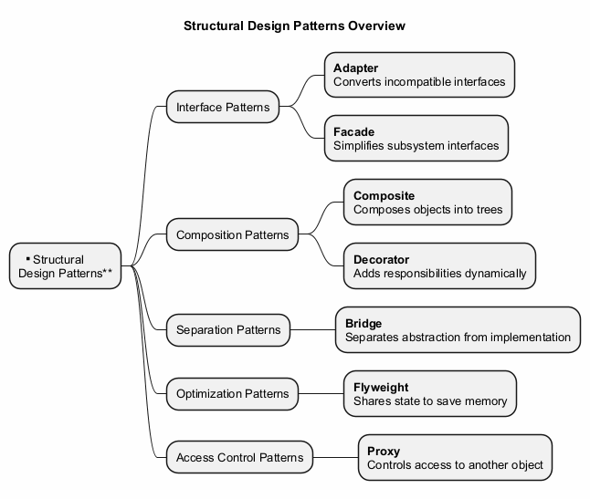

---

## Classification by Purpose

**Interface Patterns** - Deal with adapting or simplifying interfaces:
- Adapter, Facade

**Composition Patterns** - Deal with composing objects into structures:
- Composite, Decorator

**Separation Patterns** - Deal with separating concerns:
- Bridge

**Optimization Patterns** - Deal with resource management:
- Flyweight

**Access Control Patterns** - Deal with controlling object access:
- Proxy

---

## Module A: Takeaway

- Structural patterns address how classes and objects are **composed** to form larger structures
- They ensure that structures remain **flexible** and **efficient**
- There are **seven** structural patterns, each solving a distinct structural problem
- Understanding these patterns is essential for building **maintainable** object-oriented systems

---

# **Module B: Adapter Pattern**

---

## Module B: Outline

- Intent
- Problem
- Solution
- Real-World Analogy
- Structure (UML)
- Java Code Example
- Applicability
- How to Implement
- Pros and Cons
- Relations with Other Patterns
- Module Takeaway

---

## Adapter: Intent

**Adapter** is a structural design pattern that allows objects with **incompatible interfaces** to collaborate.

- Also known as: **Wrapper**
- Converts the interface of a class into another interface that clients expect
- Lets classes work together that could not otherwise because of incompatible interfaces

Source: [refactoring.guru](https://refactoring.guru/design-patterns/adapter)

---

## Adapter: Problem

Imagine you are creating a **stock market monitoring application**. The app downloads stock data from multiple sources in **XML format**.

At some point, you decide to improve the app by integrating a smart **third-party analytics library**. But there is a catch: the analytics library only works with data in **JSON format**.

You cannot use the analytics library "as is" because it expects data in a format that is incompatible with your app.

---

## Adapter: Problem (cont.)

You could change the library to work with XML, but:
- This might **break existing code** that relies on the library
- You might **not have access** to the library source code at all

This situation arises frequently when integrating **third-party** or **legacy** code.

---

## Adapter: Solution

You can create an **adapter** -- a special object that converts the interface of one object so that another object can understand it.

- The adapter **wraps** one of the objects to hide the complexity of conversion happening behind the scenes
- The wrapped object is not even aware of the adapter
- The adapter receives calls in one format and translates them into calls the wrapped object understands

---

## Adapter: Solution (cont.)

How adapters work:

1. The adapter gets an interface compatible with one of the existing objects
2. Using this interface, the existing object can safely call the adapter's methods
3. Upon receiving a call, the adapter passes the request to the second object, but in a format and order that the second object expects

Sometimes it is even possible to create a **two-way adapter** that can convert calls in both directions.

---

## Adapter: Real-World Analogy

When you travel from the US to Europe for the first time, you may get a surprise when trying to charge your laptop. The **power plug and socket** standards are different in different countries.

A **power plug adapter** solves this problem. It has the American-style socket on one end and the European-style plug on the other, acting as a translator between two incompatible interfaces.

---

## Adapter: Structure (Object Adapter)

The **Object Adapter** uses composition:

1. **Client** - A class that contains the existing business logic of the program
2. **Client Interface** - A protocol that other classes must follow to be able to collaborate with the client code
3. **Service** - Some useful class (usually third-party or legacy). The client cannot use this class directly because it has an incompatible interface
4. **Adapter** - A class that is able to work with both the client and the service. It implements the client interface while wrapping the service object

---

## Adapter: Structure (Class Adapter)

The **Class Adapter** uses multiple inheritance:

- The adapter inherits interfaces from **both** the client and the service classes simultaneously
- This approach is only possible in languages that support **multiple inheritance** (e.g., C++)
- No wrapping is needed; adaptation occurs within overridden methods
- The adapter overrides methods from both sides, translating between them

---

### Adapter - Class Diagram

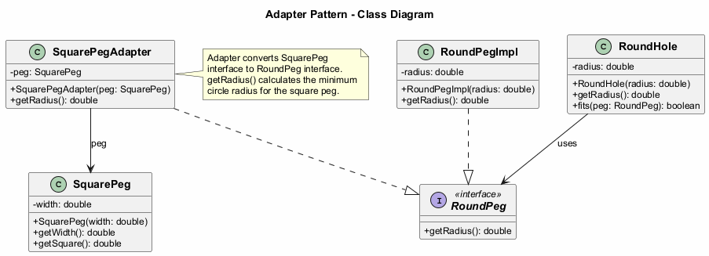

---

## Adapter: Java Code Example - Interfaces

```java
// The target interface that the client expects
public interface RoundPeg {
    double getRadius();
}

// Concrete implementation of round peg
public class RoundPegImpl implements RoundPeg {
    private double radius;

    public RoundPegImpl(double radius) {
        this.radius = radius;
    }

    @Override
    public double getRadius() {
        return radius;
    }
}
```

---

## Adapter: Java Code Example - Service

```java
// The incompatible class (service) that we want to adapt
public class SquarePeg {
    private double width;

    public SquarePeg(double width) {
        this.width = width;
    }

    public double getWidth() {
        return width;
    }

    public double getSquare() {
        return Math.pow(this.width, 2);
    }
}
```

---

## Adapter: Java Code Example - Adapter

```java
// The adapter makes SquarePeg compatible with RoundPeg
public class SquarePegAdapter implements RoundPeg {
    private SquarePeg peg;

    public SquarePegAdapter(SquarePeg peg) {
        this.peg = peg;
    }

    @Override
    public double getRadius() {
        // Calculate the minimum circle radius that can
        // fit this square peg
        return (Math.sqrt(Math.pow(peg.getWidth(), 2) * 2)) / 2;
    }
}
```

---

## Adapter: Java Code Example - Round Hole

```java
// The client class that works with RoundPeg interface
public class RoundHole {
    private double radius;

    public RoundHole(double radius) {
        this.radius = radius;
    }

    public double getRadius() {
        return radius;
    }

    public boolean fits(RoundPeg peg) {
        return this.getRadius() >= peg.getRadius();
    }
}
```

---

## Adapter: Java Code Example - Client

```java
public class AdapterDemo {
    public static void main(String[] args) {
        RoundHole hole = new RoundHole(5);
        RoundPegImpl roundPeg = new RoundPegImpl(5);
        System.out.println(hole.fits(roundPeg)); // true

        SquarePeg smallSquarePeg = new SquarePeg(5);
        SquarePeg largeSquarePeg = new SquarePeg(10);

        // hole.fits(smallSquarePeg); // Won't compile!

        // Use adapter to make square pegs compatible
        SquarePegAdapter smallAdapter =
            new SquarePegAdapter(smallSquarePeg);
        SquarePegAdapter largeAdapter =
            new SquarePegAdapter(largeSquarePeg);

        System.out.println(hole.fits(smallAdapter)); // true
        System.out.println(hole.fits(largeAdapter)); // false

        // Expected Output:
        // true
        // true
        // false
    }
}
```

---

### Adapter - Sequence Diagram

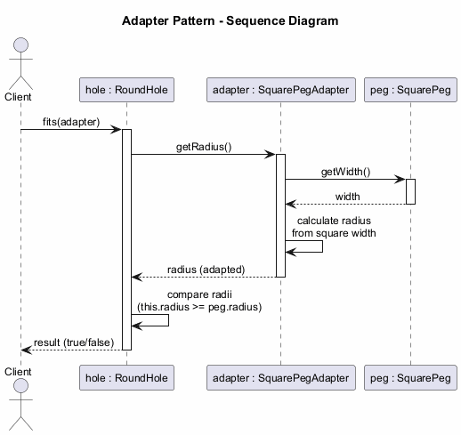

---

## Adapter: Applicability

Use the Adapter pattern when:

- You want to use an existing class, but its interface is **not compatible** with the rest of your code
- You want to create a **reusable class** that cooperates with unrelated or unforeseen classes that do not necessarily have compatible interfaces
- You need to use several existing subclasses, but it is impractical to adapt their interface by subclassing every one. An **object adapter** can adapt the interface of its parent class

---

## Adapter: Applicability (cont.)

- You need a **middle-layer class** to serve as a translator between your code and a legacy class, a third-party class, or any other class with a weird interface
- You want to **reuse existing subclasses** that lack some common functionality that cannot be added to the superclass

---

## Adapter: How to Implement

1. Make sure that you have at least two classes with **incompatible interfaces**: a useful service class and one or more client classes that would benefit from using the service class

2. Declare the **client interface** and describe how clients communicate with the service

3. Create the **adapter class** and make it follow the client interface. Leave all the methods empty for now

---

## Adapter: How to Implement (cont.)

4. Add a **field to the adapter** class to store a reference to the service object. The common practice is to initialize this field via the constructor, but sometimes it is more convenient to pass it to the adapter when calling its methods

5. One by one, **implement all methods** of the client interface in the adapter class. The adapter should delegate most of the real work to the service object, handling only the interface or data format conversion

6. Clients should use the adapter via the **client interface**. This lets you change or extend the adapters without affecting the client code

---

## Adapter: Pros and Cons

**Pros:**
- **Single Responsibility Principle**: You can separate the interface or data conversion code from the primary business logic of the program
- **Open/Closed Principle**: You can introduce new types of adapters into the program without breaking the existing client code, as long as they work with the adapters through the client interface

**Cons:**
- The overall complexity of the code increases because you need to introduce a set of new interfaces and classes. Sometimes it is simpler just to change the service class so that it matches the rest of your code

---

## Adapter: Relations with Other Patterns

- **Bridge** is usually designed up-front, letting you develop parts of an application independently. **Adapter** is commonly used with an existing app to make otherwise-incompatible classes work together
- **Adapter** changes the interface of an existing object, while **Decorator** enhances an object without changing its interface. Decorator supports recursive composition, which is not possible with Adapter
- **Adapter** provides a different interface to the wrapped object, **Proxy** provides it with the same interface, and **Decorator** provides it with an enhanced interface

---

## Adapter: Relations with Other Patterns (cont.)

- **Facade** defines a new interface for existing objects, whereas **Adapter** tries to make the existing interface usable. Adapter usually wraps just one object, while Facade works with an entire subsystem of objects
- **Bridge**, **State**, **Strategy** (and to some degree **Adapter**) have very similar structures. All these patterns are based on composition, which is delegating work to other objects. However, they all solve different problems

---

## Module B: Takeaway

- The Adapter pattern acts as a **bridge** between two incompatible interfaces
- It wraps an existing class with a new interface to make it compatible with client expectations
- Use it when you need to integrate **legacy** or **third-party** code with your system
- It follows the **Single Responsibility** and **Open/Closed** principles
- There are two variants: **Object Adapter** (composition) and **Class Adapter** (multiple inheritance)

---

# **Module C: Bridge Pattern**

---

## Module C: Outline

- Intent
- Problem
- Solution
- Real-World Analogy
- Structure (UML)
- Java Code Example
- Applicability
- How to Implement
- Pros and Cons
- Relations with Other Patterns
- Module Takeaway

---

## Bridge: Intent

**Bridge** is a structural design pattern that lets you split a large class or a set of closely related classes into **two separate hierarchies** -- abstraction and implementation -- which can be developed **independently** of each other.

Source: [refactoring.guru](https://refactoring.guru/design-patterns/bridge)

---

## Bridge: Problem

Say you have a geometric `Shape` class with a pair of subclasses: `Circle` and `Square`. You want to extend this class hierarchy to incorporate colors, so you plan to create `Red` and `Blue` shape subclasses.

However, since you already have two subclasses, you would need to create **four** class combinations such as `BlueCircle` and `RedSquare`.

---

## Bridge: Problem (cont.)

Adding new shape types and colors to the hierarchy will grow it **exponentially**. For example:
- Adding a **Triangle** shape would require 2 new subclasses (one for each color)
- Adding a **Green** color would require 3 new subclasses (one for each shape)

This problem occurs because we are trying to extend shape classes in **two independent dimensions**: by form and by color. This is a very common issue with class inheritance.

---

## Bridge: Solution

The Bridge pattern attempts to solve this problem by switching from **inheritance** to **object composition**. What this means is that you extract one of the dimensions into a separate class hierarchy, so that the original classes will reference an object of the new hierarchy, instead of having all of its state and behaviors within one class.

---

## Bridge: Solution (cont.)

Following this approach, we can extract the color-related code into its own class with two subclasses: `Red` and `Blue`. The `Shape` class then gets a reference field pointing to one of the color objects.

Now the shape can **delegate** any color-related work to the linked color object. That reference will act as a **bridge** between the `Shape` and `Color` classes.

From now on, adding new colors will not require changing the shape hierarchy, and vice versa.

---

## Bridge: Abstraction and Implementation

**Abstraction** (also called interface) is a high-level control layer for some entity. This layer is not supposed to do any real work on its own. It should delegate the work to the **implementation** layer (also called platform).

Note: these are not the same as interfaces or abstract classes from your programming language. They are general concepts.

- **Abstraction**: GUI layer of an app (e.g., remote control)
- **Implementation**: Operating system API, device-specific code (e.g., TV, Radio)

---

## Bridge: Real-World Analogy

Consider a **remote control** and a **device** (TV, Radio).

- The remote control is the **abstraction** -- it provides high-level controls (power, volume, channel)
- The device is the **implementation** -- it defines how these controls actually work
- You can pair different remotes with different devices
- You can create an advanced remote with extra buttons without changing the device classes

---

## Bridge: Structure

1. **Abstraction** -- Provides high-level control logic. Relies on the implementation object to do the actual low-level work
2. **Implementation** -- Declares the interface that is common for all concrete implementations. An abstraction can only communicate with an implementation object via methods declared here
3. **Concrete Implementations** -- Contain platform-specific code
4. **Refined Abstractions** -- Provide variants of control logic. Like their parent, they work with different implementations via the general implementation interface
5. **Client** -- Links an abstraction object with one of the implementation objects

---

### Bridge - Class Diagram

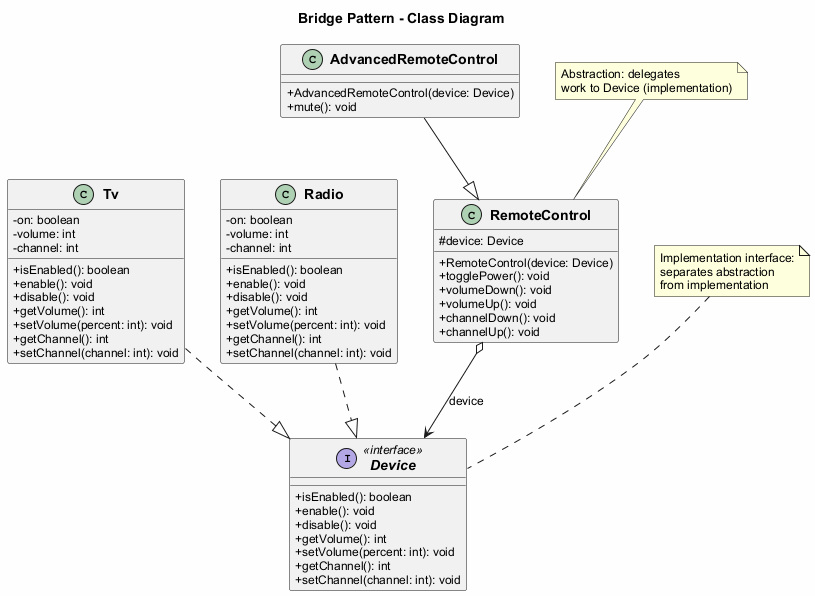

---

## Bridge: Java Code Example - Implementation Interface

```java
// The implementation interface declares methods common to all
// concrete implementation classes. It does not have to match the
// abstraction's interface.
public interface Device {
    boolean isEnabled();
    void enable();
    void disable();
    int getVolume();
    void setVolume(int percent);
    int getChannel();
    void setChannel(int channel);
}
```

---

## Bridge: Java Code Example - Concrete Implementations

```java
public class Tv implements Device {
    private boolean on = false;
    private int volume = 30;
    private int channel = 1;

    @Override
    public boolean isEnabled() { return on; }
    @Override
    public void enable() { on = true; }
    @Override
    public void disable() { on = false; }
    @Override
    public int getVolume() { return volume; }
    @Override
    public void setVolume(int percent) {
        this.volume = Math.max(0, Math.min(100, percent));
    }
    @Override
    public int getChannel() { return channel; }
    @Override
    public void setChannel(int channel) {
        this.channel = channel;
    }
}
```

---

## Bridge: Java Code Example - Concrete Implementations (cont.)

```java
public class Radio implements Device {
    private boolean on = false;
    private int volume = 20;
    private int channel = 1;

    @Override
    public boolean isEnabled() { return on; }
    @Override
    public void enable() { on = true; }
    @Override
    public void disable() { on = false; }
    @Override
    public int getVolume() { return volume; }
    @Override
    public void setVolume(int percent) {
        this.volume = Math.max(0, Math.min(100, percent));
    }
    @Override
    public int getChannel() { return channel; }
    @Override
    public void setChannel(int channel) {
        this.channel = channel;
    }
}
```

---

## Bridge: Java Code Example - Abstraction

```java
// The abstraction defines the interface for the "control" part
// of the two class hierarchies. It maintains a reference to an
// object of the implementation hierarchy and delegates all of
// the real work to this object.
public class RemoteControl {
    protected Device device;

    public RemoteControl(Device device) {
        this.device = device;
    }

    public void togglePower() {
        if (device.isEnabled()) {
            device.disable();
        } else {
            device.enable();
        }
    }

    public void volumeDown() {
        device.setVolume(device.getVolume() - 10);
    }

    public void volumeUp() {
        device.setVolume(device.getVolume() + 10);
    }

    public void channelDown() {
        device.setChannel(device.getChannel() - 1);
    }

    public void channelUp() {
        device.setChannel(device.getChannel() + 1);
    }
}
```

---

## Bridge: Java Code Example - Refined Abstraction

```java
// You can extend the abstraction hierarchy independently
// from device classes.
public class AdvancedRemoteControl extends RemoteControl {
    public AdvancedRemoteControl(Device device) {
        super(device);
    }

    public void mute() {
        device.setVolume(0);
    }
}
```

---

## Bridge: Java Code Example - Client

```java
public class BridgeDemo {
    public static void main(String[] args) {
        // Pair a basic remote with a TV
        Device tv = new Tv();
        RemoteControl remote = new RemoteControl(tv);
        remote.togglePower();
        remote.volumeUp();
        System.out.println("TV Volume: " + tv.getVolume());

        // Pair an advanced remote with a Radio
        Device radio = new Radio();
        AdvancedRemoteControl advancedRemote =
            new AdvancedRemoteControl(radio);
        advancedRemote.togglePower();
        advancedRemote.mute();
        System.out.println("Radio Volume: " +
            radio.getVolume()); // 0

        // Expected Output:
        // TV Volume: 10
        // Radio Volume: 0
    }
}
```

---

### Bridge - Sequence Diagram

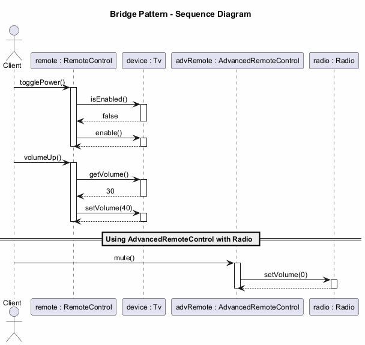

---

## Bridge: Applicability

Use the Bridge pattern when:

- You want to divide and organize a **monolithic class** that has several variants of some functionality (e.g., if the class can work with various database servers)
- You need to extend a class in several **orthogonal (independent) dimensions**
- You need to be able to **switch implementations at runtime**

---

## Bridge: Applicability (cont.)

**Monolithic class refactoring**: The bigger a class becomes, the harder it is to figure out how it works and the longer it takes to make a change. Bridge lets you split the monolithic class into several class hierarchies, each changeable independently.

**Orthogonal dimensions**: Extract a separate class hierarchy for each dimension. The original class delegates related work to objects belonging to those hierarchies instead of doing everything on its own.

**Runtime switching**: Although it is optional, the Bridge pattern lets you replace the implementation object inside the abstraction at runtime. This is as easy as assigning a new value to a field.

---

## Bridge: How to Implement

1. Identify the **orthogonal dimensions** in your classes. These independent concepts could be: abstraction/platform, domain/infrastructure, front-end/back-end, or interface/implementation

2. See what operations the **client needs** and define them in the base abstraction class

3. Determine the operations available on **all platforms**. Declare the ones that the abstraction needs in the general implementation interface

---

## Bridge: How to Implement (cont.)

4. For all platforms in your domain, create **concrete implementation classes**, but make sure they all follow the implementation interface

5. Inside the abstraction class, add a **reference field** for the implementation type. The abstraction delegates most of the work to the implementation object that is referenced in that field

6. If you have several variants of **high-level logic**, create **refined abstractions** for each variant by extending the base abstraction class

7. The **client code** should pass an implementation object to the abstraction's constructor to associate one with the other. After that, the client can forget about the implementation and work only with the abstraction object

---

## Bridge: Pros and Cons

**Pros:**
- You can create **platform-independent** classes and apps
- The client code works with high-level abstractions and is **not exposed to the platform details**
- **Open/Closed Principle**: You can introduce new abstractions and implementations independently of each other
- **Single Responsibility Principle**: You can focus on high-level logic in the abstraction and on platform details in the implementation

**Cons:**
- You might make the code **more complicated** by applying the pattern to a highly cohesive class

---

## Bridge: Relations with Other Patterns

- **Bridge** is usually designed up-front, letting you develop parts of an application independently. On the other hand, **Adapter** is commonly used with an existing application to make otherwise-incompatible classes work together
- **Bridge**, **State**, **Strategy** (and to some degree **Adapter**) have very similar structures. All these patterns are based on composition. However, they all solve different problems
- You can use **Abstract Factory** along with **Bridge**. This pairing is useful when some abstractions defined by Bridge can only work with specific implementations
- You can combine **Builder** with **Bridge**: the director class plays the role of the abstraction, while different builders act as implementations

---

## Module C: Takeaway

- The Bridge pattern **separates abstraction from implementation** so both can vary independently
- It solves the problem of **combinatorial explosion** in class hierarchies
- It uses **composition** instead of inheritance to combine different dimensions
- It follows the **Open/Closed** and **Single Responsibility** principles
- Design it **up-front** rather than retrofitting (that is what Adapter is for)

---

# **Module D: Composite Pattern**

---

## Module D: Outline

- Intent
- Problem
- Solution
- Real-World Analogy
- Structure (UML)
- Java Code Example
- Applicability
- How to Implement
- Pros and Cons
- Relations with Other Patterns
- Module Takeaway

---

## Composite: Intent

**Composite** is a structural design pattern that lets you compose objects into **tree structures** and then work with these structures as if they were **individual objects**.

- Also known as: **Object Tree**

Source: [refactoring.guru](https://refactoring.guru/design-patterns/composite)

---

## Composite: Problem

Using the Composite pattern makes sense only when the core model of your app can be represented as a **tree**.

For example, imagine that you have two types of objects: `Products` and `Boxes`. A `Box` can contain several `Products` as well as a number of smaller `Boxes`. These little `Boxes` can also hold some `Products` or even smaller `Boxes`, and so on.

---

## Composite: Problem (cont.)

Say you decide to create an ordering system using these classes. Orders could contain simple products without any wrapping, as well as boxes stuffed with products and other boxes.

How would you determine the **total price** of such an order?

You could try a direct approach: unwrap all the boxes, go over all the products and then calculate the total. But this requires knowing the specific classes and nesting structure in advance, making the code tightly coupled to the structure.

---

## Composite: Solution

The Composite pattern suggests that you work with `Products` and `Boxes` through a **common interface** which declares a method for calculating the total price.

- For a **product**, it would simply return the product's price
- For a **box**, it would go over each item the box contains, ask its price, and then return a total for this box

The greatest benefit is that you do not need to care about the concrete classes of objects that compose the tree. You can treat them all the same via the common interface.

---

## Composite: Solution (cont.)

When you call a method, the objects themselves pass the request down the tree. You can **run a behavior recursively over all components** of an object tree.

This approach works because:
- A product returns its price directly
- A box iterates over its contents, calling the price method on each item
- If an item is another box, that box also iterates over its contents, and so on
- The result is that the entire tree structure is traversed automatically

---

## Composite: Real-World Analogy

**Armies** of most countries are structured as hierarchies. An army consists of several divisions; a division is a set of brigades, and a brigade consists of platoons, which can be broken down into squads. Finally, a squad is a small group of real soldiers.

**Orders** are given at the top of the hierarchy and passed down onto each level until every soldier knows what needs to be done. This mirrors how the Composite pattern delegates work through the tree.

---

## Composite: Structure

1. **Component** -- The interface that describes operations common to both simple and complex elements of the tree
2. **Leaf** -- A basic element of a tree that does not have sub-elements. Usually, leaf components end up doing most of the real work, since they have no one to delegate the work to
3. **Container (Composite)** -- An element that has sub-elements: leaves or other containers. A container does not know the concrete classes of its children. It works with all sub-elements only via the component interface
4. **Client** -- Works with all elements through the component interface. As a result, the client can work in the same way with both simple and complex elements of the tree

---

### Composite - Class Diagram

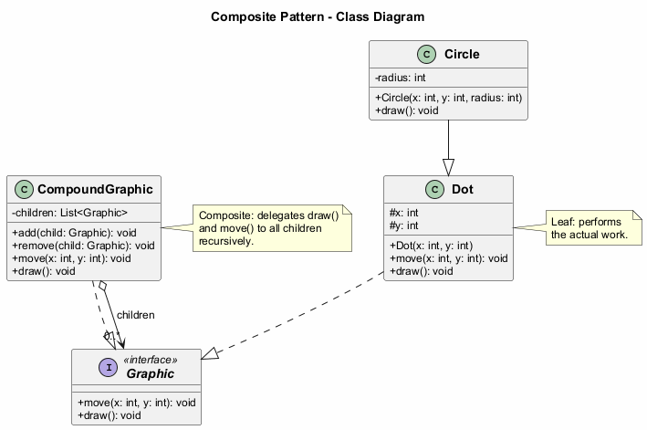

---

## Composite: Java Code Example - Component

```java
// The component interface declares common operations for
// both simple and complex objects of a composition.
public interface Graphic {
    void move(int x, int y);
    void draw();
}
```

---

## Composite: Java Code Example - Leaves

```java
// Leaf classes represent end objects of a composition.
// A leaf object cannot have any sub-objects.
public class Dot implements Graphic {
    protected int x, y;

    public Dot(int x, int y) {
        this.x = x;
        this.y = y;
    }

    @Override
    public void move(int x, int y) {
        this.x += x;
        this.y += y;
    }

    @Override
    public void draw() {
        System.out.println("Draw dot at (" + x + ", " + y + ")");
    }
}
```

---

## Composite: Java Code Example - Leaves (cont.)

```java
public class Circle extends Dot {
    private int radius;

    public Circle(int x, int y, int radius) {
        super(x, y);
        this.radius = radius;
    }

    @Override
    public void draw() {
        System.out.println("Draw circle at (" + x + ", " + y
            + ") with radius " + radius);
    }
}
```

---

## Composite: Java Code Example - Composite

```java
import java.util.ArrayList;
import java.util.List;

// The Composite class represents complex components that may
// have children. It delegates work to its children and then
// aggregates the result.
public class CompoundGraphic implements Graphic {
    private List<Graphic> children = new ArrayList<>();

    public void add(Graphic child) {
        children.add(child);
    }

    public void remove(Graphic child) {
        children.remove(child);
    }

    @Override
    public void move(int x, int y) {
        for (Graphic child : children) {
            child.move(x, y);
        }
    }

    @Override
    public void draw() {
        System.out.println("---- CompoundGraphic ----");
        for (Graphic child : children) {
            child.draw();
        }
        System.out.println("---- End Compound ----");
    }
}
```

---

## Composite: Java Code Example - Client

```java
public class CompositeDemo {
    public static void main(String[] args) {
        // Create simple components
        Dot dot1 = new Dot(1, 2);
        Dot dot2 = new Dot(3, 4);
        Circle circle = new Circle(5, 6, 10);

        // Create a composite and add components
        CompoundGraphic group1 = new CompoundGraphic();
        group1.add(dot1);
        group1.add(circle);

        // Create another composite containing the first
        CompoundGraphic group2 = new CompoundGraphic();
        group2.add(dot2);
        group2.add(group1); // Nesting composites

        // Draw the entire tree
        group2.draw();

        // Move all elements
        group2.move(10, 10);
        group2.draw();

        // Expected Output:
        // ---- Begin Compound ----
        // Drawing Dot at (3, 4)
        // ---- Begin Compound ----
        // Drawing Dot at (1, 2)
        // Drawing Circle at (5, 6) with radius 10
        // ---- End Compound ----
        // ---- End Compound ----
        // ---- Begin Compound ----
        // Drawing Dot at (13, 14)
        // ---- Begin Compound ----
        // Drawing Dot at (11, 12)
        // Drawing Circle at (15, 16) with radius 10
        // ---- End Compound ----
        // ---- End Compound ----
    }
}
```

---

### Composite - Sequence Diagram

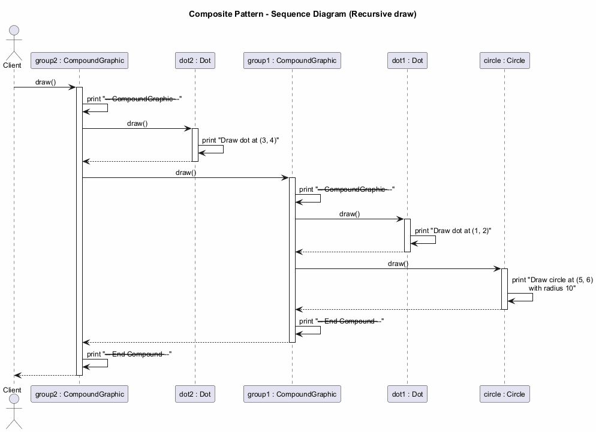

---

## Composite: Applicability

Use the Composite pattern when:

- You have to implement a **tree-like object structure**. The Composite pattern provides you with two basic element types that share a common interface: simple leaves and complex containers
- You want the client code to treat both simple and complex elements **uniformly**. All elements defined by the Composite pattern share a common interface, so the client does not need to worry about the concrete class of the objects it works with

---

## Composite: How to Implement

1. Make sure that the core model of your app can be represented as a **tree structure**. Try to break it down into simple elements and containers. Remember that containers must be able to contain both simple elements and other containers

2. Declare the **component interface** with a list of methods that make sense for both simple and complex components

3. Create a **leaf class** to represent simple elements. A program may have multiple different leaf classes

---

## Composite: How to Implement (cont.)

4. Create a **container class** to represent complex elements. In this class, provide an array field for storing references to sub-elements. The array must be able to store both leaves and containers, so make sure it is declared with the component interface type

5. When implementing the methods of the container, remember that a container is supposed to **delegate most of the work to sub-elements**

6. Finally, define the methods for **adding and removing** child elements in the container. Keep in mind that these operations can be declared in the component interface, which would violate the Interface Segregation Principle but would let the client treat all elements equally

---

## Composite: Pros and Cons

**Pros:**
- You can work with complex tree structures more conveniently: use **polymorphism and recursion** to your advantage
- **Open/Closed Principle**: You can introduce new element types into the app without breaking the existing code, which now works with the object tree

**Cons:**
- It might be difficult to provide a **common interface** for classes whose functionality differs too much. In certain scenarios, you would need to overgeneralize the component interface, making it harder to comprehend

---

## Composite: Relations with Other Patterns

- You can use **Builder** when creating complex Composite trees because you can program its construction steps to work recursively
- **Chain of Responsibility** is often used in conjunction with Composite. When a leaf component gets a request, it can pass it through the chain of all parent components down to the root of the object tree
- You can use **Iterators** to traverse Composite trees
- You can use **Visitor** to execute an operation over an entire Composite tree

---

## Composite: Relations with Other Patterns (cont.)

- You can implement shared leaf nodes of the Composite tree as **Flyweights** to save RAM
- **Composite** and **Decorator** have similar structure diagrams since both rely on recursive composition. However, a Decorator is like a Composite that has only one child component. Decorator adds additional responsibilities to the wrapped object, while Composite just "sums up" its children's results
- Designs that make heavy use of Composite and Decorator can often benefit from using **Prototype**. Applying the pattern lets you clone complex structures instead of re-constructing them from scratch

---

## Module D: Takeaway

- The Composite pattern lets you compose objects into **tree structures** and treat them uniformly
- It uses a **common interface** for both simple (leaf) and complex (composite) elements
- The pattern enables **recursive composition** where containers can hold both leaves and other containers
- It is ideal for representing **part-whole hierarchies**
- It follows the **Open/Closed Principle** by allowing new element types without modifying existing code

---

# **Module E: Decorator Pattern**

---

## Module E: Outline

- Intent
- Problem
- Solution
- Real-World Analogy
- Structure (UML)
- Java Code Example
- Applicability
- How to Implement
- Pros and Cons
- Relations with Other Patterns
- Module Takeaway

---

## Decorator: Intent

**Decorator** is a structural design pattern that lets you attach **new behaviors** to objects by placing these objects inside special **wrapper objects** that contain the behaviors.

- Also known as: **Wrapper**

Source: [refactoring.guru](https://refactoring.guru/design-patterns/decorator)

---

## Decorator: Problem

Imagine that you are working on a **notification library** which lets other programs notify their users about important events.

The initial version of the library was based on the `Notifier` class that had only a few fields, a constructor, and a single `send` method. The method could accept a message argument from a client and send the message to a list of emails.

---

## Decorator: Problem (cont.)

At some point, you realize that users of the library expect more than just email notifications. Many of them would like to receive an **SMS** about critical issues. Others would like to be notified on **Facebook**. And the corporate users would love to get **Slack** notifications.

How hard can that be? You extend the `Notifier` class and put the additional notification methods into new subclasses. Now the client is supposed to instantiate the desired notification class and use it for all further notifications.

---

## Decorator: Problem (cont.)

But then someone asks: "Why can't you use **several notification types at once**?" For example, if your house is on fire, you would probably want to be informed through every channel.

You try to address that by creating special subclasses for every combination. But it quickly becomes apparent that this approach bloats the code immensely -- **combinatorial explosion** of subclasses makes the codebase unmaintainable.

---

## Decorator: Solution

When you need to alter an object's behavior, the first thing that comes to mind is extending a class. However, inheritance has several serious caveats:

- Inheritance is **static** -- you cannot alter the behavior of an existing object at runtime
- Subclasses can have just **one parent class** (in most languages)

One of the alternatives is to use **Composition/Aggregation** instead of Inheritance.

---

## Decorator: Solution (cont.)

A **wrapper** is an object that can be linked with some **target** object. The wrapper contains the same set of methods as the target and delegates all requests it receives to the target. However, the wrapper may alter the result by doing something either **before or after** it passes the request to the target.

When does a simple wrapper become a real decorator? The wrapper implements the **same interface** as the wrapped object. That is why from the client's perspective these objects are identical.

---

## Decorator: Solution (cont.)

Multiple wrappers can be **stacked** around a single object, combining all their behaviors:

```
Encryption(Compression(FileDataSource))
```

The client can wrap the object with any decorators that follow the same interface. All wrappers combine their behaviors without creating new subclasses.

---

## Decorator: Real-World Analogy

**Wearing clothes** is an example of using decorators. When you are cold, you wrap yourself in a sweater. If you are still cold, you can wear a jacket on top. If it is raining, you can put on a raincoat.

All of these garments **extend** your basic behavior but are not part of you, and you can easily **take off** any piece of clothing whenever you do not need it.

---

## Decorator: Structure

1. **Component** -- Declares the common interface for both wrappers and wrapped objects
2. **Concrete Component** -- A class of objects being wrapped. It defines basic behavior, which can be altered by decorators
3. **Base Decorator** -- A class that has a field for referencing a wrapped object. The field's type should be declared as the component interface so it can contain both concrete components and decorators. The base decorator delegates all operations to the wrapped object
4. **Concrete Decorators** -- Define extra behaviors that can be added to components dynamically. They override methods of the base decorator and execute their behavior either before or after calling the parent method
5. **Client** -- Can wrap components in multiple layers of decorators, as long as it works with all objects via the component interface

---

### Decorator - Class Diagram

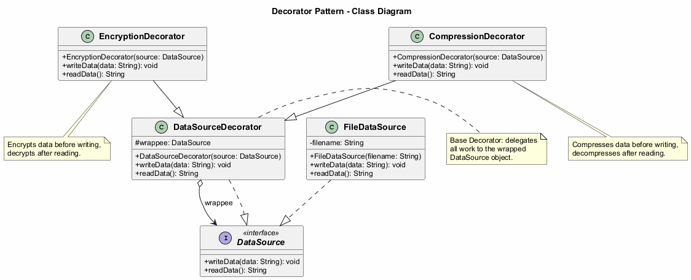

---

## Decorator: Java Code Example - Component Interface

```java
// The component interface defines operations that can be
// altered by decorators.
public interface DataSource {
    void writeData(String data);
    String readData();
}
```

---

## Decorator: Java Code Example - Concrete Component

```java
import java.io.*;

// Concrete components provide default implementations
// of the operations.
public class FileDataSource implements DataSource {
    private String filename;

    public FileDataSource(String filename) {
        this.filename = filename;
    }

    @Override
    public void writeData(String data) {
        try (FileWriter writer = new FileWriter(filename)) {
            writer.write(data);
        } catch (IOException e) {
            e.printStackTrace();
        }
    }

    @Override
    public String readData() {
        try (BufferedReader reader =
                new BufferedReader(new FileReader(filename))) {
            StringBuilder sb = new StringBuilder();
            String line;
            while ((line = reader.readLine()) != null) {
                sb.append(line);
            }
            return sb.toString();
        } catch (IOException e) {
            return "";
        }
    }
}
```

---

## Decorator: Java Code Example - Base Decorator

```java
// The base decorator class follows the same interface as
// the other components. The primary purpose of this class
// is to define the wrapping interface for all concrete
// decorators. The default implementation of the wrapping
// code might include a field for storing a wrapped
// component and the means to initialize it.
public class DataSourceDecorator implements DataSource {
    protected DataSource wrappee;

    public DataSourceDecorator(DataSource source) {
        this.wrappee = source;
    }

    @Override
    public void writeData(String data) {
        wrappee.writeData(data);
    }

    @Override
    public String readData() {
        return wrappee.readData();
    }
}
```

---

## Decorator: Java Code Example - Concrete Decorators

```java
import java.util.Base64;

// Concrete decorators must call methods on the wrapped
// object, but may add something of their own to the result.
public class EncryptionDecorator extends DataSourceDecorator {
    public EncryptionDecorator(DataSource source) {
        super(source);
    }

    @Override
    public void writeData(String data) {
        // Encrypt data before writing
        String encrypted = Base64.getEncoder()
            .encodeToString(data.getBytes());
        super.writeData(encrypted);
    }

    @Override
    public String readData() {
        // Decrypt data after reading
        String data = super.readData();
        return new String(Base64.getDecoder().decode(data));
    }
}
```

---

## Decorator: Java Code Example - Concrete Decorators (cont.)

```java
import java.io.ByteArrayOutputStream;
import java.util.zip.*;

public class CompressionDecorator extends DataSourceDecorator {
    public CompressionDecorator(DataSource source) {
        super(source);
    }

    @Override
    public void writeData(String data) {
        // Compress data before writing
        String compressed = compress(data);
        super.writeData(compressed);
    }

    @Override
    public String readData() {
        // Decompress data after reading
        String data = super.readData();
        return decompress(data);
    }

    private String compress(String data) {
        // Compression logic here
        return data; // Simplified
    }

    private String decompress(String data) {
        // Decompression logic here
        return data; // Simplified
    }
}
```

---

## Decorator: Java Code Example - Client

```java
public class DecoratorDemo {
    public static void main(String[] args) {
        String salaryRecords =
            "Name,Salary\nJohn Smith,100000\nSteven Jobs,912000";

        // Simple writing without any decorators
        DataSource source = new FileDataSource("output.txt");
        source.writeData(salaryRecords);

        // Writing with encryption
        DataSource encrypted = new EncryptionDecorator(
            new FileDataSource("encrypted.txt"));
        encrypted.writeData(salaryRecords);

        // Writing with compression AND encryption
        // Note how decorators are stacked
        DataSource compressedAndEncrypted =
            new EncryptionDecorator(
                new CompressionDecorator(
                    new FileDataSource("compressed.txt")));
        compressedAndEncrypted.writeData(salaryRecords);

        // Reading decrypts and decompresses automatically
        System.out.println(compressedAndEncrypted.readData());

        // Expected Output:
        // Name,Salary
        // John Smith,100000
        // Steven Jobs,912000
    }
}
```

---

### Decorator - Sequence Diagram

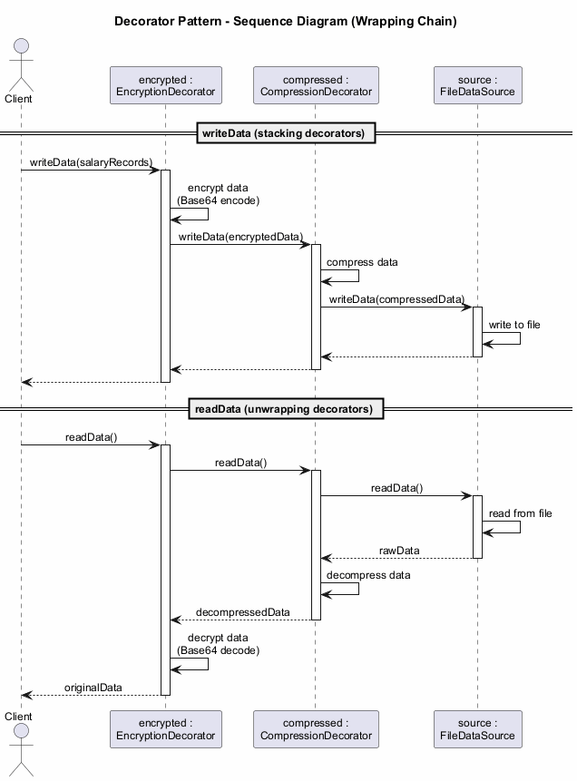

---

## Decorator: Applicability

Use the Decorator pattern when:

- You need to be able to assign **extra behaviors to objects at runtime** without breaking the code that uses these objects
- It is awkward or not possible to extend an object's behavior using **inheritance** (e.g., `final` classes)
- You need to **combine several behaviors** by wrapping an object in multiple decorators

---

## Decorator: Applicability (cont.)

The Decorator lets you structure your business logic into **layers**, create a decorator for each layer, and compose objects with various combinations of this logic at runtime. The client code can treat all these objects in the same way, since they all follow a common interface.

---

## Decorator: How to Implement

1. Make sure your business domain can be represented as a **primary component** with multiple optional layers over it

2. Figure out what methods are common to both the primary component and the optional layers. Create a **component interface** and declare those methods there

3. Create a **concrete component** class and define the base behavior in it

---

## Decorator: How to Implement (cont.)

4. Create a **base decorator** class. It should have a field for storing a reference to a wrapped object. The field should be declared with the component interface type to allow linking to concrete components as well as decorators. The base decorator must delegate all work to the wrapped object

5. Make sure all classes implement the **component interface**

6. Create **concrete decorators** by extending them from the base decorator. A concrete decorator must execute its behavior before or after the call to the parent method (which always delegates to the wrapped object)

7. The **client code** must be responsible for creating decorators and composing them in the way the client needs

---

## Decorator: Pros and Cons

**Pros:**
- You can extend an object's behavior **without making a new subclass**
- You can add or remove responsibilities from an object **at runtime**
- You can **combine** several behaviors by wrapping an object into multiple decorators
- **Single Responsibility Principle**: You can divide a monolithic class that implements many possible variants of behavior into several smaller classes

**Cons:**
- It is hard to **remove a specific wrapper** from the wrappers stack
- It is hard to implement a decorator in such a way that its behavior does **not depend on the order** in the decorators stack
- The initial **configuration code** of layers might look pretty ugly

---

## Decorator: Relations with Other Patterns

- **Adapter** provides a completely different interface for accessing an existing object. With Decorator, the interface either stays the same or gets extended. In addition, Decorator supports recursive composition, which is not possible when you use Adapter
- **Adapter** changes the interface of an existing object, while **Decorator** enhances an object without changing its interface
- **Proxy** usually manages the full lifecycle of its service object on its own, whereas the composition of **Decorators** is always controlled by the client

---

## Decorator: Relations with Other Patterns (cont.)

- **Chain of Responsibility** and **Decorator** have very similar class structures. Both patterns rely on recursive composition to pass execution through a series of objects. However, there are several crucial differences. CoR handlers can execute arbitrary operations independently of each other. They can also stop passing the request further at any point. Decorators extend the object's behavior while keeping it consistent with the base interface
- **Composite** and **Decorator** have similar structure diagrams since both rely on recursive composition. A Decorator is like a Composite that has only one child component. Decorator adds additional responsibilities to the wrapped object, while Composite just "sums up" its children's results
- **Strategy** lets you change the insides of an object, while **Decorator** lets you change the skin

---

## Module E: Takeaway

- The Decorator pattern allows adding behavior to objects **dynamically** through wrapping
- It avoids the **combinatorial explosion** of subclasses caused by inheritance
- Multiple decorators can be **stacked** to combine behaviors
- It follows the **Single Responsibility** and **Open/Closed** principles
- Prefer composition over inheritance when behaviors need to be added **at runtime**

---

# **Module F: Facade Pattern**

---

## Module F: Outline

- Intent
- Problem
- Solution
- Real-World Analogy
- Structure (UML)
- Java Code Example
- Applicability
- How to Implement
- Pros and Cons
- Relations with Other Patterns
- Module Takeaway

---

## Facade: Intent

**Facade** is a structural design pattern that provides a **simplified interface** to a library, a framework, or any other complex set of classes.

Source: [refactoring.guru](https://refactoring.guru/design-patterns/facade)

---

## Facade: Problem

Imagine that you must make your code work with a broad set of objects that belong to a sophisticated library or framework. Ordinarily, you would need to **initialize all of those objects**, keep track of **dependencies**, execute methods in the **correct order**, and so on.

As a result, the business logic of your classes would become **tightly coupled** to the implementation details of third-party classes, making it hard to comprehend and maintain.

---

## Facade: Solution

A facade is a class that provides a **simple interface** to a complex subsystem which contains lots of moving parts. A facade might provide limited functionality in comparison to working with the subsystem directly. However, it includes only those features that **clients really care about**.

Having a facade is handy when you need to integrate your app with a sophisticated library that has dozens of features, but you just need a tiny bit of its functionality.

---

## Facade: Solution (cont.)

For instance, an app that uploads short funny videos with cats to social media could potentially use a professional video conversion library. However, all that it really needs is a class with the single method `encode(filename, format)`.

After creating such a class and connecting it with the video conversion library, you will have your first **facade**.

---

## Facade: Real-World Analogy

When you call a shop to place a phone order, an **operator** is your facade to all services and departments of the shop. The operator provides you with a simple voice interface to the ordering system, payment gateways, and various delivery services.

You do not need to navigate through the shop's internal systems yourself -- the operator handles everything through a simple interface.

---

## Facade: Structure

1. **Facade** -- Provides convenient access to a particular part of the subsystem's functionality. It knows where to direct the client's request and how to operate all the moving parts

2. **Additional Facade** -- Can be created to prevent polluting a single facade with unrelated features that would make it yet another complex structure. Additional facades can be used by both clients and other facades

3. **Complex Subsystem** -- Consists of dozens of various objects. To make them all do something meaningful, you have to dive deep into the subsystem's implementation details. Subsystem classes are not aware of the facade's existence

4. **Client** -- Uses the facade instead of calling the subsystem objects directly

---

### Facade - Class Diagram

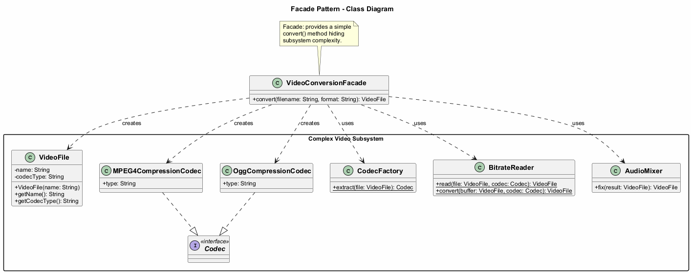

---

## Facade: Java Code Example - Subsystem Classes

```java
// These are some of the classes of a complex third-party
// video conversion framework.
public class VideoFile {
    private String name;
    private String codecType;

    public VideoFile(String name) {
        this.name = name;
        this.codecType = name.substring(
            name.indexOf(".") + 1);
    }

    public String getName() { return name; }
    public String getCodecType() { return codecType; }
}

public interface Codec { }

public class MPEG4CompressionCodec implements Codec {
    public String type = "mp4";
}

public class OggCompressionCodec implements Codec {
    public String type = "ogg";
}
```

---

## Facade: Java Code Example - Subsystem Classes (cont.)

```java
public class CodecFactory {
    public static Codec extract(VideoFile file) {
        String type = file.getCodecType();
        if (type.equals("mp4")) {
            System.out.println("CodecFactory: extracting " +
                "MPEG4 audio...");
            return new MPEG4CompressionCodec();
        } else {
            System.out.println("CodecFactory: extracting " +
                "Ogg audio...");
            return new OggCompressionCodec();
        }
    }
}

public class BitrateReader {
    public static VideoFile read(VideoFile file, Codec codec) {
        System.out.println("BitrateReader: reading file...");
        return file;
    }

    public static VideoFile convert(VideoFile buffer,
                                     Codec codec) {
        System.out.println("BitrateReader: writing file...");
        return buffer;
    }
}

public class AudioMixer {
    public VideoFile fix(VideoFile result) {
        System.out.println("AudioMixer: fixing audio...");
        return result;
    }
}
```

---

## Facade: Java Code Example - Facade Class

```java
// The Facade class provides a simple interface to the
// complex logic of one or several subsystems. The Facade
// delegates the client requests to the appropriate objects
// within the subsystem and is also responsible for managing
// their lifecycle.
public class VideoConversionFacade {

    public VideoFile convert(String filename, String format) {
        System.out.println("VideoConversionFacade: " +
            "conversion started.");
        VideoFile file = new VideoFile(filename);
        Codec sourceCodec = CodecFactory.extract(file);

        Codec destinationCodec;
        if (format.equals("mp4")) {
            destinationCodec = new MPEG4CompressionCodec();
        } else {
            destinationCodec = new OggCompressionCodec();
        }

        VideoFile buffer = BitrateReader.read(file,
            sourceCodec);
        VideoFile result = BitrateReader.convert(buffer,
            destinationCodec);
        result = new AudioMixer().fix(result);

        System.out.println("VideoConversionFacade: " +
            "conversion completed.");
        return result;
    }
}
```

---

## Facade: Java Code Example - Client

```java
// The client code does not depend on any subsystem classes.
// Any changes to the subsystem's code will not affect the
// client code. You would only need to update the Facade.
public class FacadeDemo {
    public static void main(String[] args) {
        VideoConversionFacade converter =
            new VideoConversionFacade();

        VideoFile mp4Video = converter.convert(
            "funny-cats-video.ogg", "mp4");

        System.out.println("Converted: " +
            mp4Video.getName());

        // The client only interacts with the simple facade
        // interface, without knowing about dozens of
        // subsystem classes.

        // Expected Output:
        // VideoConversionFacade: conversion started.
        // VideoConversionFacade: conversion completed.
        // Converted: funny-cats-video.mp4
    }
}
```

---

### Facade - Sequence Diagram

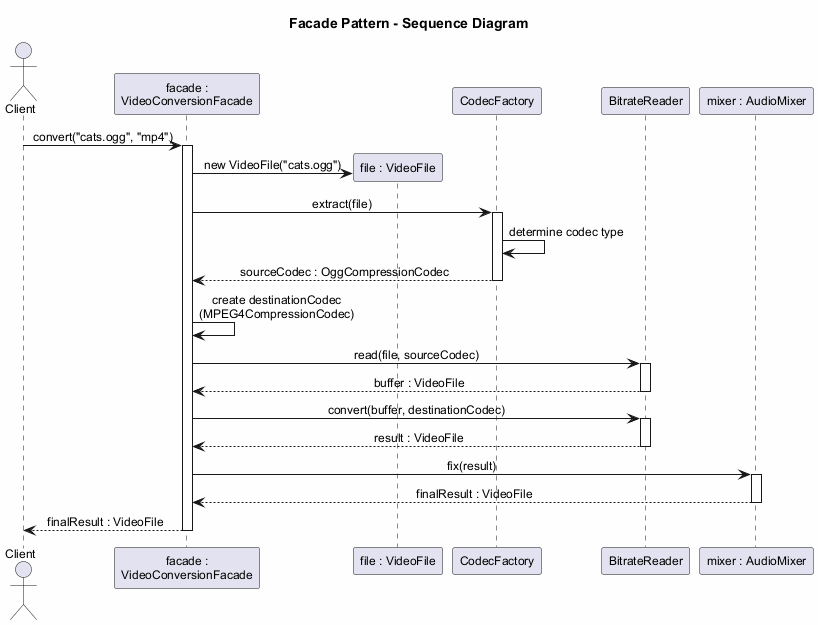

---

## Facade: Applicability

Use the Facade pattern when:

- You need to have a **limited but straightforward interface** to a complex subsystem. Often, subsystems get more complex over time. Even applying design patterns typically leads to creating more classes. A subsystem may become more flexible and easier to reuse in various contexts, but the amount of configuration and boilerplate code it demands from a client grows ever larger. The Facade attempts to provide a shortcut to the most-used features of the subsystem

---

## Facade: Applicability (cont.)

- You want to **structure a subsystem into layers**. Create facades to define entry points to each level of a subsystem. You can reduce coupling between multiple subsystems by requiring them to communicate only through facades. This approach is similar to the Mediator pattern

---

## Facade: How to Implement

1. Check whether it is possible to provide a **simpler interface** than what an existing subsystem already provides. You are on the right track if this interface makes the client code independent from many of the subsystem's classes

2. Declare and implement this interface in a new **facade class**. The facade should redirect the calls from the client code to appropriate objects of the subsystem. The facade should be responsible for initializing the subsystem and managing its further life cycle unless the client code already does this

---

## Facade: How to Implement (cont.)

3. To get the full benefit from the pattern, make all the client code communicate with the subsystem **only via the facade**. Now the client code is protected from any changes in the subsystem code. For example, when a subsystem gets upgraded to a new version, you will only need to modify the code in the facade

4. If the facade becomes **too big**, consider extracting part of its behavior to a new, refined facade class

---

## Facade: Pros and Cons

**Pros:**
- You can **isolate** your code from the complexity of a subsystem
- You provide a **simple** interface to a complex system
- You promote **loose coupling** between the client and the subsystem

**Cons:**
- A facade can become a **god object** coupled to all classes of an app

---

## Facade: Relations with Other Patterns

- **Facade** defines a new interface for existing objects, whereas **Adapter** tries to make the existing interface usable. Adapter usually wraps just one object, while Facade works with an entire subsystem of objects
- **Abstract Factory** can serve as an alternative to **Facade** when you only want to hide the way the subsystem objects are created from the client code
- **Flyweight** shows how to make lots of little objects, whereas **Facade** shows how to make a single object that represents an entire subsystem

---

## Facade: Relations with Other Patterns (cont.)

- **Facade** and **Mediator** have similar jobs: they try to organize collaboration between lots of tightly coupled classes. Facade defines a simplified interface to a subsystem of objects, but it does not introduce any new functionality. The subsystem itself is unaware of the facade. Mediator centralizes communication between components of the system. The components only know about the mediator object
- A **Facade** class can often be transformed into a **Singleton** since a single facade object is sufficient in most cases
- **Facade** is similar to **Proxy** in that both buffer a complex entity and initialize it on its own. Unlike Facade, Proxy has the same interface as its service object, which makes them interchangeable

---

## Module F: Takeaway

- The Facade pattern provides a **simplified interface** to a complex subsystem
- It does **not add new functionality** but makes existing functionality easier to access
- It promotes **loose coupling** between client code and subsystem classes
- It is useful when integrating with **complex libraries** or **legacy systems**
- Be careful not to let the facade become a **god object**

---

# **Module G: Flyweight Pattern**

---

## Module G: Outline

- Intent
- Problem
- Solution
- Intrinsic vs. Extrinsic State
- Real-World Analogy
- Structure (UML)
- Java Code Example
- Applicability
- How to Implement
- Pros and Cons
- Relations with Other Patterns
- Module Takeaway

---

## Flyweight: Intent

**Flyweight** is a structural design pattern that lets you fit more objects into the available amount of **RAM** by sharing common parts of state between multiple objects instead of keeping all of the data in each object.

- Also known as: **Cache**

Source: [refactoring.guru](https://refactoring.guru/design-patterns/flyweight)

---

## Flyweight: Problem

To have some fun after long working hours, you decide to create a simple video game: players would be moving around a map and shooting each other. You implement a realistic **particle system** as one of its features. Vast quantities of bullets, missiles, and shrapnel from explosions should fly all over the map and deliver a thrilling experience.

Upon finishing, you push the last commit, build the game and send it to a friend for testing. Although the game runs flawlessly on your machine, your friend was not able to play for long. On his computer, the game kept **crashing** after a few minutes of gameplay.

---

## Flyweight: Problem (cont.)

After spending several hours digging through debug logs, you discover that the game crashed because of an **insufficient amount of RAM**. It turns out that your friend's computer is much less powerful than yours, and that is why the problem appeared so quickly on his machine.

The actual problem was related to the particle system. Each particle, such as a bullet, a missile or a piece of shrapnel, was represented by a separate object containing plenty of data. At some point, when the carnage on a player's screen reached its climax, newly created particles no longer fit into the remaining RAM, so the program crashed.

---

## Flyweight: Problem (cont.)

Each particle object contains:
- **Color** (same for all bullets)
- **Sprite/texture** (same for all bullets)
- **Coordinates** (unique per particle)
- **Direction vector** (unique per particle)
- **Speed** (unique per particle)

The color and sprite data is **duplicated** across thousands of particles, wasting enormous amounts of memory.

---

## Flyweight: Solution - Intrinsic vs. Extrinsic State

The Flyweight pattern suggests that you stop storing the **extrinsic state** inside the object. Instead, you should pass this state to specific methods which rely on it. Only the **intrinsic state** stays within the object, letting you reuse it in different contexts.

**Intrinsic State** -- The constant data of an object. Other objects can only read it, not change it. This data lives within the flyweight object and remains **immutable** after creation.
- Examples: color, sprite, texture

**Extrinsic State** -- Contextual data, unique to each object instance, that changes.
- Examples: coordinates, direction, speed

---

## Flyweight: Solution (cont.)

As a result, you would need **fewer** of these objects since they only differ in the intrinsic state, which has much fewer variations than the extrinsic.

In the particle example, instead of thousands of particle objects with duplicated data, you would have only **three flyweight objects** (bullet, missile, shrapnel), each referenced by many context objects containing unique positional and movement data.

---

## Flyweight: Immutability and Factory

**Immutability Requirement:**
- Since the same flyweight object can be used in different contexts, you must make sure that its state **cannot be modified**
- A flyweight should initialize its state just once, via **constructor parameters**
- It should not expose any setters or public fields to other objects

**Factory Pattern Integration:**
- To simplify access to various flyweights, create a **factory method** that manages a pool of existing flyweight objects
- The factory accepts the intrinsic state of the desired flyweight, searches for an existing flyweight matching this state, and returns it if found. If not, it creates a new flyweight and adds it to the pool

---

## Flyweight: Structure

1. **Flyweight** -- Contains the portion of the original object's state that can be shared between multiple objects (intrinsic state). The same flyweight object can be used in many different contexts. The state stored inside a flyweight is called intrinsic. The state passed to the flyweight's methods is called extrinsic

2. **Context** -- Contains the extrinsic state, unique across all original objects. When a context is paired with one of the flyweight objects, it represents the full state of the original object

3. **Flyweight Factory** -- Manages a pool of existing flyweights. With the factory, clients do not create flyweights directly. Instead, they call the factory, passing bits of the intrinsic state of the desired flyweight. The factory looks over previously created flyweights and either returns an existing one or creates a new one

4. **Client** -- Calculates or stores the extrinsic state of flyweights. From the client's perspective, a flyweight is a template object which can be configured at runtime by passing some contextual data into parameters of its methods

---

### Flyweight - Class Diagram

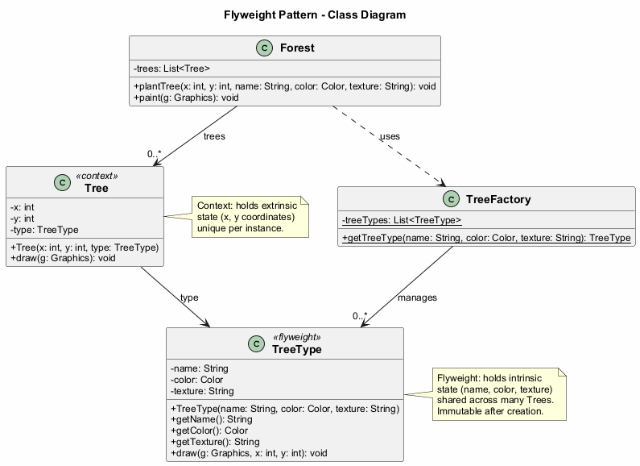

---

## Flyweight: Java Code Example - Flyweight Class

```java
import java.awt.*;

// The flyweight class contains a portion of the state of a
// tree. These fields store values that are unique for each
// particular tree type. You will not find here the tree
// coordinates. But the texture and colors shared between
// many trees are here. Since this data is usually BIG, you
// would waste a lot of memory by keeping it in each tree
// object. Instead, we extract texture, color, and other
// repeating data into a separate object (TreeType).
public class TreeType {
    private String name;
    private Color color;
    private String texture;

    public TreeType(String name, Color color, String texture) {
        this.name = name;
        this.color = color;
        this.texture = texture;
    }

    public String getName() { return name; }
    public Color getColor() { return color; }
    public String getTexture() { return texture; }

    public void draw(Graphics g, int x, int y) {
        // Draw the tree on canvas at position (x, y)
        g.setColor(Color.BLACK);
        g.fillRect(x - 1, y, 3, 5);
        g.setColor(color);
        g.fillOval(x - 5, y - 10, 10, 10);
    }
}
```

---

## Flyweight: Java Code Example - Flyweight Factory

```java
import java.awt.*;
import java.util.ArrayList;
import java.util.List;

// The flyweight factory decides whether to reuse existing
// flyweight or to create a new object.
public class TreeFactory {
    private static List<TreeType> treeTypes = new ArrayList<>();

    public static TreeType getTreeType(String name,
                                        Color color,
                                        String texture) {
        for (TreeType type : treeTypes) {
            if (type.getName().equals(name) &&
                type.getColor().equals(color) &&
                type.getTexture().equals(texture)) {
                return type;
            }
        }
        TreeType type = new TreeType(name, color, texture);
        treeTypes.add(type);
        return type;
    }
}
```

---

## Flyweight: Java Code Example - Context Class

```java
import java.awt.*;

// The context object contains the extrinsic part of the
// tree state. An application can create billions of these
// since they are pretty small: just two integer coordinates
// and one reference field.
public class Tree {
    private int x;
    private int y;
    private TreeType type;

    public Tree(int x, int y, TreeType type) {
        this.x = x;
        this.y = y;
        this.type = type;
    }

    public void draw(Graphics g) {
        type.draw(g, x, y);
    }
}
```

---

## Flyweight: Java Code Example - Client (Forest)

```java
import java.awt.*;
import java.util.ArrayList;
import java.util.List;
import javax.swing.*;

public class Forest extends JFrame {
    private List<Tree> trees = new ArrayList<>();

    public void plantTree(int x, int y, String name,
                          Color color, String texture) {
        TreeType type = TreeFactory.getTreeType(
            name, color, texture);
        Tree tree = new Tree(x, y, type);
        trees.add(tree);
    }

    @Override
    public void paint(Graphics g) {
        for (Tree tree : trees) {
            tree.draw(g);
        }
    }

    public static void main(String[] args) {
        Forest forest = new Forest();
        // Plant 1,000,000 trees but only a few TreeType
        // flyweight objects are created
        for (int i = 0; i < 1000000; i++) {
            forest.plantTree(
                (int) (Math.random() * 800),
                (int) (Math.random() * 600),
                "Summer Oak",
                Color.GREEN,
                "oak_texture");
        }
        forest.setSize(800, 600);
        forest.setVisible(true);

        // Expected Output:
        // A Swing window (800x600) displaying 1,000,000 trees
        // rendered using only a few shared TreeType flyweight objects.
        // Memory usage is significantly reduced compared to
        // storing full data for each tree individually.
    }
}
```

---

### Flyweight - Sequence Diagram

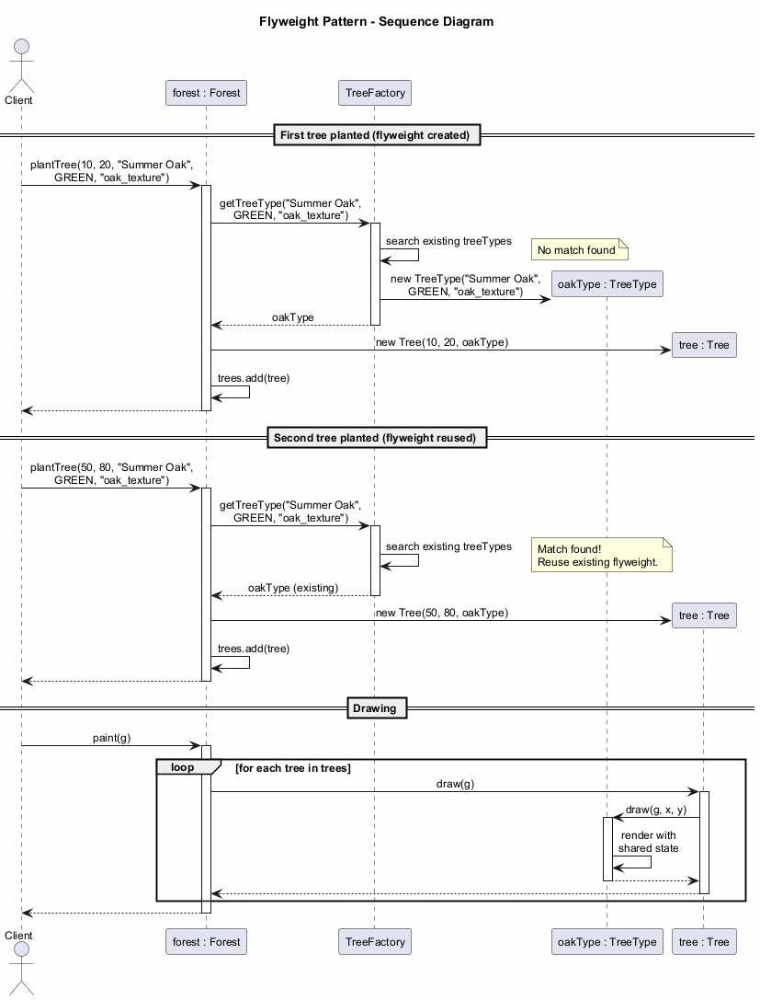

---

## Flyweight: Applicability

Use the Flyweight pattern **only** when your program must support a huge number of objects which barely fit into available RAM.

The benefit of applying the pattern depends heavily on how and where it is used. It is most useful when:

- An application needs to spawn a **massive number** of similar objects
- This drains all available RAM on a target device
- The objects contain **duplicate state** which can be extracted and shared between multiple objects

---

## Flyweight: Applicability (cont.)

**Important:** The Flyweight pattern is merely an **optimization**. Before applying it, make sure your program does have the RAM consumption problem related to having a massive number of similar objects in memory at the same time. Make sure that this problem cannot be solved in any other meaningful way.

---

## Flyweight: How to Implement

1. Divide fields of a class that will become a flyweight into two parts:
   - The **intrinsic state**: fields that contain unchanging data duplicated across many objects
   - The **extrinsic state**: fields that contain contextual data unique to each object

2. Leave the fields that represent the **intrinsic state** in the class, but make sure they are immutable. They should take their initial values only inside the **constructor**

---

## Flyweight: How to Implement (cont.)

3. Go over methods that use fields of the **extrinsic state**. For each field used in the method, introduce a new **parameter** and use it instead of the field

4. Optionally, create a **factory class** to manage the pool of flyweights. It should check for an existing flyweight before creating a new one. Once the factory is in place, clients must only request flyweights through it, passing the intrinsic state to the factory

5. The client must store or calculate values of the **extrinsic state** (context) to be able to call methods of flyweight objects. For convenience, the extrinsic state along with the flyweight-referencing field may be moved to a separate **context class**

---

## Flyweight: Pros and Cons

**Pros:**
- You can save lots of **RAM**, assuming your program has tons of similar objects
- Reduced memory footprint through state sharing

**Cons:**
- You might be trading **RAM over CPU cycles** when some of the context data needs to be recalculated each time somebody calls a flyweight method
- The code becomes much **more complicated**. New team members will always be wondering why the state of an entity was separated in such a way
- **Thread safety** issues may arise from shared mutable references if not properly synchronized

---

## Flyweight: Relations with Other Patterns

- You can implement shared leaf nodes of the **Composite** tree as **Flyweights** to save RAM
- **Flyweight** shows how to make lots of little objects, whereas **Facade** shows how to make a single object that represents an entire subsystem
- **Flyweight** would resemble **Singleton** if you somehow managed to reduce all shared states of the objects to just one flyweight object. But there are two fundamental differences:
  - There should be only one Singleton instance, whereas a Flyweight class can have **multiple instances** with different intrinsic states
  - The Singleton object can be **mutable**. Flyweight objects are **immutable**

---

## Module G: Takeaway

- The Flyweight pattern **shares common state** between many objects to save memory
- Distinguish between **intrinsic** (shared, immutable) and **extrinsic** (unique, contextual) state
- Use a **factory** to manage the pool of flyweight objects
- Apply it only when you genuinely have a **memory problem** with many similar objects
- It is an **optimization pattern** -- do not use it prematurely

---

# **Module H: Proxy Pattern**

---

## Module H: Outline

- Intent
- Problem
- Solution
- Real-World Analogy
- Structure (UML)
- Types of Proxies
- Java Code Example
- Applicability
- How to Implement
- Pros and Cons
- Relations with Other Patterns
- Module Takeaway

---

## Proxy: Intent

**Proxy** is a structural design pattern that lets you provide a **substitute or placeholder** for another object. A proxy controls access to the original object, allowing you to perform something either before or after the request gets through to the original object.

Source: [refactoring.guru](https://refactoring.guru/design-patterns/proxy)

---

## Proxy: Problem

Why would you want to control access to an object? Here is an example: you have a massive object that consumes a vast amount of system resources. You need it from time to time, but not always.

You could implement **lazy initialization**: create this object only when it is actually needed. All of the object's clients would need to execute some deferred initialization code. Unfortunately, this would probably cause a lot of **code duplication**.

---

## Proxy: Problem (cont.)

In an ideal world, we would want to put this code directly into our object's class, but that is not always possible. For instance, the class may be part of a closed **third-party library**.

We need a way to control access to the object without modifying the object's class or duplicating initialization logic across all clients.

---

## Proxy: Solution

The Proxy pattern suggests that you create a new proxy class with the **same interface** as an original service object. Then you update your app so that it passes the proxy object to all of the original object's clients.

Upon receiving a request from a client, the proxy creates a real service object and **delegates** all the work to it.

---

## Proxy: Solution (cont.)

But what is the benefit? If you need to execute something either before or after the primary logic of the class, the proxy lets you do this **without changing that class**. Since the proxy implements the same interface as the original class, it can be passed to any client that expects a real service object.

The proxy can handle:
- **Lazy initialization** of the real object
- **Caching** of results
- **Access control** and authorization
- **Logging** of requests
- **Resource management** and cleanup

---

## Proxy: Real-World Analogy

A **credit card** is a proxy for a bank account, which is a proxy for a bundle of cash. Both implement the same interface: they can be used to make a payment.

A consumer feels great because there is no need to carry loads of cash around. A shop owner is also happy since the income from a transaction gets added electronically to the shop's bank account without the risk of losing the deposit or getting robbed on the way to the bank.

---

## Proxy: Structure

1. **Service Interface** -- Declares the interface of the Service. The proxy must follow this interface to be able to disguise itself as a service object

2. **Service** -- A class that provides some useful business logic

3. **Proxy** -- The proxy class has a reference field that points to a service object. After the proxy finishes its processing (e.g., lazy initialization, logging, access control, caching, etc.), it passes the request to the service object. Usually, proxies manage the full lifecycle of their service objects

4. **Client** -- Should work with both services and proxies via the same interface. This way you can pass a proxy into any code that expects a service object

---

### Proxy - Class Diagram

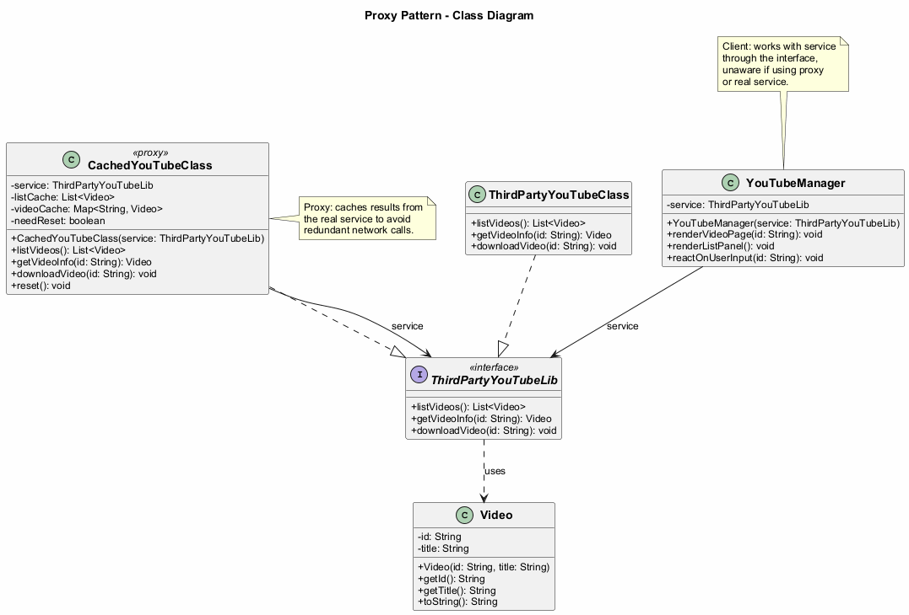

---

## Proxy: Types of Proxies

- **Virtual Proxy (Lazy Initialization)** -- Delays the creation of a heavyweight service object until it is actually needed
- **Protection Proxy (Access Control)** -- Only passes requests to the service object if the client's credentials meet certain criteria
- **Remote Proxy** -- The proxy passes the client request over the network, handling all of the details of working with the network
- **Logging Proxy** -- The proxy can log each request before passing it to the service
- **Caching Proxy** -- The proxy caches results of client requests and manages the life cycle of this cache, especially if results are quite large
- **Smart Reference** -- The proxy can track whether the client has obtained a reference to the service object and dismiss the service when no clients use it

---

## Proxy: Java Code Example - Service Interface

```java
import java.util.List;

// The interface of a remote service.
public interface ThirdPartyYouTubeLib {
    List<Video> listVideos();
    Video getVideoInfo(String id);
    void downloadVideo(String id);
}
```

---

## Proxy: Java Code Example - Video Class

```java
public class Video {
    private String id;
    private String title;

    public Video(String id, String title) {
        this.id = id;
        this.title = title;
    }

    public String getId() { return id; }
    public String getTitle() { return title; }

    @Override
    public String toString() {
        return "Video{id='" + id + "', title='" +
            title + "'}";
    }
}
```

---

## Proxy: Java Code Example - Service

```java
import java.util.*;

// The concrete implementation of a service connector.
// Methods of this class can request information from
// YouTube. The speed of the request depends on a user's
// internet connection as well as YouTube's. The
// application will slow down if a lot of requests are
// fired at the same time, even if they all request the
// same information.
public class ThirdPartyYouTubeClass
        implements ThirdPartyYouTubeLib {

    @Override
    public List<Video> listVideos() {
        // Send an API request to YouTube.
        System.out.println("Downloading video list from " +
            "YouTube API...");
        return new ArrayList<>(); // Simplified
    }

    @Override
    public Video getVideoInfo(String id) {
        // Get metadata about some video.
        System.out.println("Downloading info for video: " +
            id);
        return new Video(id, "Sample Video");
    }

    @Override
    public void downloadVideo(String id) {
        // Download a video file from YouTube.
        System.out.println("Downloading video file: " + id);
    }
}
```

---

## Proxy: Java Code Example - Proxy (Caching)

```java
import java.util.*;

// To save some bandwidth, we can cache request results
// and keep them for some time. But it may be impossible
// to put such code directly into the service class. For
// example, it could have been provided as part of a
// third party library and/or defined as final.
public class CachedYouTubeClass
        implements ThirdPartyYouTubeLib {

    private ThirdPartyYouTubeLib service;
    private List<Video> listCache = null;
    private Map<String, Video> videoCache = new HashMap<>();
    private boolean needReset = false;

    public CachedYouTubeClass(ThirdPartyYouTubeLib service) {
        this.service = service;
    }

    @Override
    public List<Video> listVideos() {
        if (listCache == null || needReset) {
            listCache = service.listVideos();
            needReset = false;
        }
        return listCache;
    }

    @Override
    public Video getVideoInfo(String id) {
        if (!videoCache.containsKey(id) || needReset) {
            videoCache.put(id, service.getVideoInfo(id));
        }
        return videoCache.get(id);
    }

    @Override
    public void downloadVideo(String id) {
        service.downloadVideo(id);
    }

    public void reset() {
        needReset = true;
    }
}
```

---

## Proxy: Java Code Example - Manager Class

```java
import java.util.List;

// The GUI class, which used to work directly with a
// service object, stays unchanged as long as it works
// with the service object through an interface. We can
// safely pass a proxy object instead of a real service
// object since they both implement the same interface.
public class YouTubeManager {
    private ThirdPartyYouTubeLib service;

    public YouTubeManager(ThirdPartyYouTubeLib service) {
        this.service = service;
    }

    public void renderVideoPage(String id) {
        Video info = service.getVideoInfo(id);
        System.out.println("Rendering video page: " +
            info.getTitle());
    }

    public void renderListPanel() {
        List<Video> list = service.listVideos();
        System.out.println("Rendering video list: " +
            list.size() + " videos");
    }

    public void reactOnUserInput(String id) {
        renderListPanel();
        renderVideoPage(id);
    }
}
```

---

## Proxy: Java Code Example - Client

```java
public class ProxyDemo {
    public static void main(String[] args) {
        // Create the real service
        ThirdPartyYouTubeLib youtubeService =
            new ThirdPartyYouTubeClass();

        // Create the caching proxy
        ThirdPartyYouTubeLib youtubeProxy =
            new CachedYouTubeClass(youtubeService);

        // The manager works through the interface,
        // so it does not know if it is using the real
        // service or the proxy
        YouTubeManager manager =
            new YouTubeManager(youtubeProxy);

        // First call - fetches from the real service
        manager.reactOnUserInput("video123");

        // Second call - uses cached data
        manager.reactOnUserInput("video123");

        // Expected Output:
        // Rendering video list: ... videos
        // Rendering video page: video123
        // Rendering video list: ... videos  (served from cache)
        // Rendering video page: video123    (served from cache)
    }
}
```

---

### Proxy - Sequence Diagram

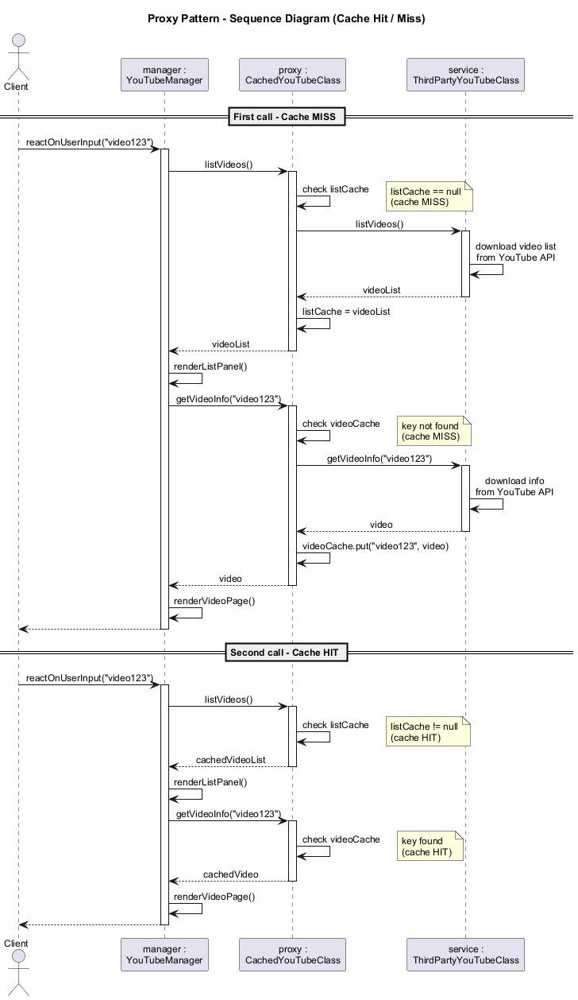

---

## Proxy: Applicability

There are dozens of ways to utilize the Proxy pattern. Here are the most common:

- **Lazy initialization (virtual proxy)**: When you have a heavyweight service object that wastes system resources by being always up, even though you only need it from time to time. Instead of creating the object when the app launches, you can delay the object's initialization to a time when it is actually needed

---

## Proxy: Applicability (cont.)

- **Access control (protection proxy)**: When you want only specific clients to be able to use the service object; for instance, when your objects are crucial parts of an operating system and clients are various launched applications (including malicious ones)

- **Local execution of a remote service (remote proxy)**: When the service object is located on a remote server. In this case, the proxy passes the client request over the network, handling all of the nasty details of working with the network

---

## Proxy: Applicability (cont.)

- **Logging requests (logging proxy)**: When you want to keep a history of requests to the service object. The proxy can log each request before passing it to the service

- **Caching request results (caching proxy)**: When you need to cache results of client requests and manage the life cycle of this cache, especially if results are quite large. The proxy can implement caching for recurring requests that always yield the same results

- **Smart reference**: When you need to be able to dismiss a heavyweight object once there are no clients that use it. The proxy can keep track of clients that obtained a reference to the service object or its results. From time to time, the proxy may go over the clients and check whether they are still active. If the client list gets empty, the proxy might dismiss the service object and free the underlying system resources

---

## Proxy: How to Implement

1. If there is no pre-existing **service interface**, create one to make proxy and service objects interchangeable. Extracting the interface from the service class is not always possible, because you would need to change all of the service's clients to use that interface. An alternative is to make the proxy a **subclass** of the service class

2. Create the **proxy class**. It should have a field for storing a reference to the service. Usually, proxies create and manage the whole life cycle of their services. On rare occasions, a service is passed to the proxy via a constructor by the client

---

## Proxy: How to Implement (cont.)

3. Implement the **proxy methods** according to their purposes. In most cases, after doing some work, the proxy should delegate the work to the service object

4. Consider introducing a **creation method** that decides whether the client gets a proxy or a real service. This can be a simple static method in the proxy class or a full-blown factory method

5. Consider implementing **lazy initialization** for the service object

---

## Proxy: Pros and Cons

**Pros:**
- You can control the service object **without clients knowing** about it
- You can manage the **lifecycle** of the service object when clients do not care about it
- The proxy works even if the **service object is not ready** or is not available
- **Open/Closed Principle**: You can introduce new proxies without changing the service or clients

**Cons:**
- The code may become **more complicated** since you need to introduce a lot of new classes
- The response from the service might get **delayed**

---

## Proxy: Relations with Other Patterns

- **Adapter** provides a different interface to the wrapped object, **Proxy** provides it with the same interface, and **Decorator** provides it with an enhanced interface
- **Facade** is similar to **Proxy** in that both buffer a complex entity and initialize it on its own. Unlike Facade, Proxy has the same interface as its service object, which makes them interchangeable
- **Decorator** and **Proxy** have similar structures, but very different intents. Both patterns are built on the composition principle, where one object is supposed to delegate some of the work to another. The difference is that a Proxy usually manages the lifecycle of its service object on its own, whereas the composition of Decorators is always controlled by the client

---

## Module H: Takeaway

- The Proxy pattern provides a **substitute or placeholder** for another object
- It controls access and adds behavior **without modifying** the original service
- There are many types: **virtual, protection, remote, logging, caching, smart reference**
- It follows the **Open/Closed Principle** by allowing new proxies without changing existing code
- It is similar to Decorator in structure but different in **intent and lifecycle management**

---

## Summary: Structural Design Patterns Comparison

| Pattern | Key Idea | Typical Use |
|---------|----------|-------------|
| **Adapter** | Convert interface | Legacy/third-party integration |
| **Bridge** | Separate abstraction/impl | Multi-dimensional hierarchies |
| **Composite** | Tree structure | Part-whole hierarchies |
| **Decorator** | Add behavior dynamically | Layered behaviors |
| **Facade** | Simplify interface | Complex subsystem access |
| **Flyweight** | Share state | Memory optimization |
| **Proxy** | Control access | Lazy init, caching, security |

---

## Structural Patterns: Key Relationships

- **Adapter** vs **Bridge**: Adapter retrofits, Bridge designs up-front
- **Composite** vs **Decorator**: Both use recursive composition, but for different purposes
- **Decorator** vs **Proxy**: Similar structures, different lifecycle management
- **Facade** vs **Adapter**: Facade simplifies a subsystem, Adapter wraps a single object
- **Flyweight** vs **Singleton**: Flyweight has multiple shared instances, Singleton has one mutable instance
- **Facade** vs **Mediator**: Both organize collaboration, but Facade does not add functionality

---

## References

- Gamma, E., Helm, R., Johnson, R., & Vlissides, J. (1994). *Design Patterns: Elements of Reusable Object-Oriented Software*. Addison-Wesley.
- Freeman, E., & Robson, E. (2020). *Head First Design Patterns: Building Extensible and Maintainable Object-Oriented Software* (2nd ed.). O'Reilly Media.
- Refactoring.Guru. *Structural Design Patterns*. [https://refactoring.guru/design-patterns/structural-patterns](https://refactoring.guru/design-patterns/structural-patterns)
- Refactoring.Guru. *Adapter*. [https://refactoring.guru/design-patterns/adapter](https://refactoring.guru/design-patterns/adapter)
- Refactoring.Guru. *Bridge*. [https://refactoring.guru/design-patterns/bridge](https://refactoring.guru/design-patterns/bridge)
- Refactoring.Guru. *Composite*. [https://refactoring.guru/design-patterns/composite](https://refactoring.guru/design-patterns/composite)

---

## References (cont.)

- Refactoring.Guru. *Decorator*. [https://refactoring.guru/design-patterns/decorator](https://refactoring.guru/design-patterns/decorator)
- Refactoring.Guru. *Facade*. [https://refactoring.guru/design-patterns/facade](https://refactoring.guru/design-patterns/facade)
- Refactoring.Guru. *Flyweight*. [https://refactoring.guru/design-patterns/flyweight](https://refactoring.guru/design-patterns/flyweight)
- Refactoring.Guru. *Proxy*. [https://refactoring.guru/design-patterns/proxy](https://refactoring.guru/design-patterns/proxy)
- Bloch, J. (2018). *Effective Java* (3rd ed.). Addison-Wesley.

---

<!-- paginate: false -->

## Thank You

### Questions?

**CEN206 Object-Oriented Programming**
**Week-10: Structural Design Patterns**
Spring Semester, 2025-2026

Asst. Prof. Dr. Ugur CORUH

---

$End-Of-Week-10-Module$
