<!-- _backgroundColor: aqua -->

<!-- _color: orange -->

<!-- paginate: false -->

## CEN206 Nesne Yonelimli Programlama

## Hafta-11 (Davranissal Tasarim Desenleri)

#### Bahar Donemi, 2025-2026

Indir [DOC-PDF](ce204-week-11.tr.md_doc.pdf), [DOC-DOCX](ce204-week-11.tr.md_word.docx), [SLIDE](ce204-week-11.tr.md_slide.pdf)

<iframe width=700, height=500 frameBorder=0 src="../ce204-week-11.tr.md_slide.html"></iframe>

---

<!-- paginate: true -->

## Davranissal Tasarim Desenleri

### Haftalik Icerik

- **Modul A:** Davranissal Desenlere Giris
- **Modul B:** Sorumluluk Zinciri (Chain of Responsibility) Deseni
- **Modul C:** Komut (Command) Deseni
- **Modul D:** Yineleyici (Iterator) Deseni
- **Modul E:** Arabulucu (Mediator) Deseni
- **Modul F:** Hatira (Memento) Deseni
- **Modul G:** Gozlemci (Observer) Deseni
- **Modul H:** Durum (State) Deseni
- **Modul I:** Strateji (Strategy) Deseni
- **Modul J:** Sablon Yontem (Template Method) Deseni
- **Modul K:** Ziyaretci (Visitor) Deseni

---

<!-- _backgroundColor: aqua -->

<!-- _color: orange -->

# Modul A: Davranissal Desenlere Giris

---

## Modul A: Icerik

- Davranissal Tasarim Desenleri Nedir?
- Neden Onemliler?
- 10 Davranissal Desenin Genel Bakisi
- Siniflandirma ve Iliskiler

---

## Davranissal Tasarim Desenleri Nedir?

Davranissal tasarim desenleri, **algoritmalar** ve nesneler arasindaki **sorumluluk dagitimi** ile ilgilenir.

Yalnizca nesne veya sinif desenlerini degil, ayni zamanda aralarindaki **iletisim desenlerini** de tanimlarlar. Bu desenler, calisma zamaninda takip edilmesi zor olan karmasik kontrol akisini karakterize eder.

Odak noktanizi kontrol akisindan uzaklastirarak nesnelerin birbirine nasil baglandigina konsantre olmanizi saglarlar.

Kaynak: [refactoring.guru](https://refactoring.guru/design-patterns/behavioral-patterns)

---

## Davranissal Desenler Neden Onemlidir?

- Nesne yonelimli sistemlerdeki **karmasik kontrol akislarini** yonetmeye yardimci olurlar
- Nesneler arasinda net **iletisim protokolleri** tanimlarlar
- Isbirligi yapan nesneler arasinda **gevsek baglanti** saglarlar
- Mevcut kodu degistirmeden **yeni davranislar eklemeyi** kolaylastirirlar
- **Degisen davranisi** kararli arayuzlerin arkasina kapsullerler

---

## 10 Davranissal Tasarim Deseni

| Desen | Amac |
|-------|------|
| **Sorumluluk Zinciri (Chain of Responsibility)** | Istekleri bir isleyici zinciri boyunca iletme |
| **Komut (Command)** | Istekleri bagimsiz nesnelere donusturme |
| **Yineleyici (Iterator)** | Koleksiyonlari ic yapilarini aciga cikarmadan gezme |
| **Arabulucu (Mediator)** | Nesneler arasindaki kaotik bagimliliklari azaltma |
| **Hatira (Memento)** | Onceki durumlari kaydetme ve geri yukleme |

---

## 10 Davranissal Tasarim Deseni (devam)

| Desen | Amac |
|-------|------|
| **Gozlemci (Observer)** | Birden fazla nesneyi durum degisiklikleri hakkinda bilgilendirme |
| **Durum (State)** | Ic durum degistiginde davranisi degistirme |
| **Strateji (Strategy)** | Degistirilebilir algoritma aileleri tanimlama |
| **Sablon Yontem (Template Method)** | Algoritma iskeleti tanimlama, adimlari alt siniflara birakma |
| **Ziyaretci (Visitor)** | Algoritmalari uzerinde calistiklari nesnelerden ayirma |

Kaynak: [refactoring.guru](https://refactoring.guru/design-patterns/behavioral-patterns)

---

## Davranissal Desenlerin Siniflandirilmasi

**Sinif tabanli desenler** davranisi dagitmak icin kalitim kullanir:
- Sablon Yontem (Template Method)

**Nesne tabanli desenler** nesne bilesimi kullanir:
- Sorumluluk Zinciri, Komut, Yineleyici, Arabulucu, Hatira, Gozlemci, Durum, Strateji, Ziyaretci

---

## Davranissal Desenler Arasindaki Iliskiler

- **Sorumluluk Zinciri, Komut, Arabulucu, Gozlemci** desenleri, istek gondericileri ve alicilari baglamanin farkli yollarini ele alir
- **Komut ve Hatira** genellikle geri alma islevi icin birlikte calisir
- **Yineleyici ve Ziyaretci** karmasik yapilari gezmek icin birlesir
- **Durum ve Strateji** benzer yapiya sahiptir ancak amac bakimindan farklidir
- **Sablon Yontem ve Strateji** sinif ve nesne alternatiflerini temsil eder

---

## Davranissal Desenler Genel Bakis Diyagrami

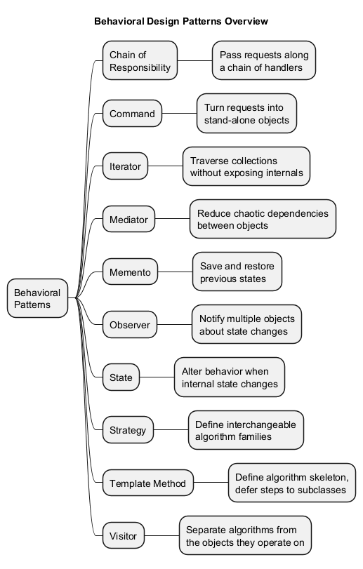

---

## Modul A: Ozet

Davranissal desenler, nesnelerin nasil **iletisim kurduguna** ve **sorumluluk dagittigina** odaklanir. Davranislarin mevcut kodu degistirmeden degistirilebildigi veya genisletilebildigi esnek, bakimi kolay sistemler olusturmak icin gereklidirler. Izleyen modullerde, 10 davranissal desenin her birini ayrintili olarak inceleyecegiz.

---

<!-- _backgroundColor: aqua -->

<!-- _color: orange -->

# Modul B: Sorumluluk Zinciri (Chain of Responsibility) Deseni

---

## Modul B: Icerik

- Amac
- Problem
- Cozum
- Gercek Dunya Analojisi
- Yapi
- Java Sozde Kod Ornegi
- Uygulanabilirlik
- Nasil Uygulanir
- Avantajlar ve Dezavantajlar
- Diger Desenlerle Iliskileri

---

## Sorumluluk Zinciri: Amac

**Sorumluluk Zinciri (Chain of Responsibility)**, istekleri bir isleyici zinciri boyunca iletmenizi saglayan davranissal bir tasarim desenidir. Bir istek aldiginda, her isleyici istegi islemeye ya da zincirdeki bir sonraki isleyiciye iletmeye karar verir.

Diger adlari: **CoR**, **Komut Zinciri**

Kaynak: [refactoring.guru](https://refactoring.guru/design-patterns/chain-of-responsibility)

---

## Sorumluluk Zinciri: Problem

Bir cevrimici siparis sistemi uzerinde calistiginizi hayal edin. Erisimi kisitlamak istiyorsunuz, boylece yalnizca kimlik dogrulanmis kullanicilar siparis olusturabilir. Ayrica yonetici izinlerine sahip kullanicilar tum siparislere tam erisime sahip olmalidir.

Biraz planlama yapildiktan sonra, bu kontrollerin sirayla yapilmasi gerektigini fark edersiniz:

1. **Kimlik Dogrulama** -- Kullanici oturum acmis mi?
2. **Yetkilendirme** -- Kullanicinin izinleri var mi?
3. **Dogrulama** -- Veri gecerli mi?
4. **Onbellekleme** -- Sonuc zaten onbellekte mi?

---

## Sorumluluk Zinciri: Problem (devam)

Zamanla daha fazla sirali kontrol eklersiniz:

- Kaba kuvvet sifre saldirilarini onlemek icin **hiz sinirlandirma**
- Isteklerdeki ham verileri filtrelemek icin **temizleme**
- **Siteler arasi betik calistirma** korumasi

Zaten karmasik gorunen kontrol kodlari, her yeni ozellik eklediginizde daha da sisti. Bir kontrolu degistirmek bazen digerlerini etkiliyordu. Kontrolleri diger bilesenlerde yeniden kullanmak kod tekrarina yol aciyordu.

---

## Sorumluluk Zinciri: Cozum

Sorumluluk Zinciri deseni, isleyicileri bir zincire baglamanizi onerir. Her isleyicinin bir sonraki isleyiciye referans depolayan bir alani vardir. Bir istegi islemenin yani sira, isleyiciler istegi zincir boyunca daha ileriye iletir.

Istek, tum isleyiciler onu isleme firsati bulana kadar zincir boyunca ilerler. Bir isleyici, istegi zincirde daha ileri **iletmemeye** karar verebilir ve boylece daha fazla islemi etkin bir sekilde durdurabilir.

---

## Sorumluluk Zinciri: Cozum (devam)

Biraz farkli bir yaklasim daha vardir; bir istek aldiginda, isleyici onu **isleyip isleyemeyecegine** karar verir. Isleyebilirse, istegi daha ileri iletmez. Dolayisiyla istegi ya yalnizca bir isleyici isler ya da hicbiri islemez.

Bu yaklasim, grafik kullanici arayuzundeki ogeler yiginindaki olaylarla ugrasilirken cok yaygindir. Ornegin, bir kullanici bir dugmeye tikladiginda, olay dugmeden baslayarak, kapsayicilari boyunca ilerleyerek ve uygulama penceresiyle biten GUI ogeleri zinciri boyunca yayilir.

---

## Sorumluluk Zinciri: Gercek Dunya Analojisi

Bilgisayariniza yeni bir donanim parcasi satin alip kurdunuz. Teknik destegi ariyorsunuz:

1. **Otomatik sistem** birkac standart cozum onerir -- hicbiri ise yaramaz.
2. Bir **insan operatoru** betiklestirilmis sorun giderme adimlarini dener -- hala cozulmez.
3. Operator cagrinizi sorunu nihayetinde cozen bir **muhendise** **yonlendirir**.

Her kademe ya sorunu cozer ya da bir sonraki, daha yetenekli kademeye yonlendirir.

---

## Sorumluluk Zinciri: Yapi

Yapi asagidaki katilimcilardan olusur:

1. **Isleyici (Handler)** (arayuz): Istekleri isleme arayuzunu bildirir. Genellikle istekleri islemek icin tek bir yontem ve bazen bir sonraki isleyiciyi ayarlamak icin baska bir yontem icerir.

2. **Temel Isleyici (Base Handler)** (soyut sinif): Tum isleyicilere ortak olan kalip kodu koyabileceginiz istege bagli sinif. Genellikle bir sonraki isleyiciye referans depolar ve varsayilan zincirleme davranisini uygular.

---

## Sorumluluk Zinciri: Yapi (devam)

3. **Somut Isleyiciler (Concrete Handlers)**: Istekleri islemek icin gercek kodu icerir. Bir istek aldiginda, her isleyici onu islemeye ve zincir boyunca iletmeye karar vermelidir. Isleyiciler genellikle bagimsizdir ve degismezdir, tum gerekli verileri yapilandirici araciligiyla alir.

4. **Istemci (Client)**: Zincirleri yalnizca bir kez olusturabilir veya dinamik olarak olusturabilir. Bir istek zincirdeki herhangi bir isleyiciye gonderilebilir -- ilki olmak zorunda degildir.

---

## Sorumluluk Zinciri: Yapi Diyagrami

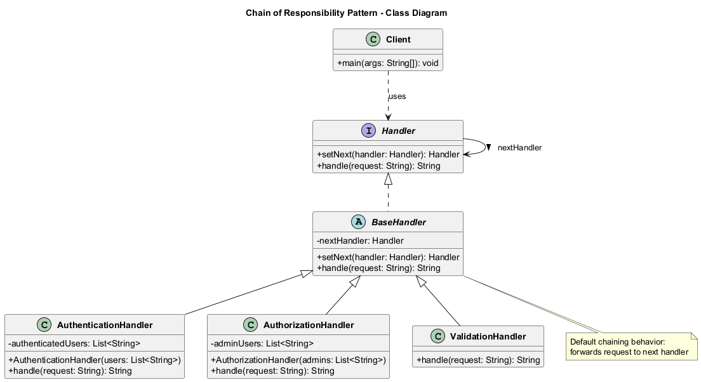

---

## Sorumluluk Zinciri: Java Sozde Kod

```java
// Handler interface
interface Handler {
    Handler setNext(Handler handler);
    String handle(String request);
}
```

---

## Sorumluluk Zinciri: Java Sozde Kod (devam)

```java
// Base handler with default chaining behavior
abstract class BaseHandler implements Handler {
    private Handler nextHandler;

    @Override
    public Handler setNext(Handler handler) {
        this.nextHandler = handler;
        // Returning handler allows chaining:
        // monkey.setNext(squirrel).setNext(dog);
        return handler;
    }

    @Override
    public String handle(String request) {
        if (this.nextHandler != null) {
            return this.nextHandler.handle(request);
        }
        return null;
    }
}
```

---

## Sorumluluk Zinciri: Java Sozde Kod (devam)

```java
// Concrete handler: Authentication
class AuthenticationHandler extends BaseHandler {
    private List<String> authenticatedUsers;

    public AuthenticationHandler(List<String> users) {
        this.authenticatedUsers = users;
    }

    @Override
    public String handle(String request) {
        if (!authenticatedUsers.contains(request)) {
            return "AuthenticationHandler: "
                + request + " is NOT authenticated.";
        }
        System.out.println("AuthenticationHandler: "
            + request + " is authenticated.");
        return super.handle(request);
    }
}
```

---

## Sorumluluk Zinciri: Java Sozde Kod (devam)

```java
// Concrete handler: Authorization
class AuthorizationHandler extends BaseHandler {
    private List<String> adminUsers;

    public AuthorizationHandler(List<String> admins) {
        this.adminUsers = admins;
    }

    @Override
    public String handle(String request) {
        if (!adminUsers.contains(request)) {
            return "AuthorizationHandler: "
                + request + " is NOT authorized.";
        }
        System.out.println("AuthorizationHandler: "
            + request + " is authorized.");
        return super.handle(request);
    }
}
```

---

## Sorumluluk Zinciri: Java Sozde Kod (devam)

```java
// Concrete handler: Validation
class ValidationHandler extends BaseHandler {
    @Override
    public String handle(String request) {
        if (request == null || request.isEmpty()) {
            return "ValidationHandler: "
                + "Request is invalid.";
        }
        System.out.println("ValidationHandler: "
            + request + " is valid.");
        return super.handle(request);
    }
}
```

---

## Sorumluluk Zinciri: Java Sozde Kod (devam)

```java
// Client code
public class ChainOfResponsibilityDemo {
    public static void main(String[] args) {
        // Build the chain
        Handler auth = new AuthenticationHandler(
            Arrays.asList("alice", "bob", "charlie"));
        Handler authz = new AuthorizationHandler(
            Arrays.asList("alice", "charlie"));
        Handler validation = new ValidationHandler();

        auth.setNext(authz).setNext(validation);

        // Send requests through the chain
        for (String user : Arrays.asList(
                "alice", "bob", "dave")) {
            String result = auth.handle(user);
            if (result != null) {
                System.out.println(result);
            } else {
                System.out.println(user
                    + ": Request passed all checks.");
            }
        }
    }
}
```

---

## Sorumluluk Zinciri: Sira Diyagrami

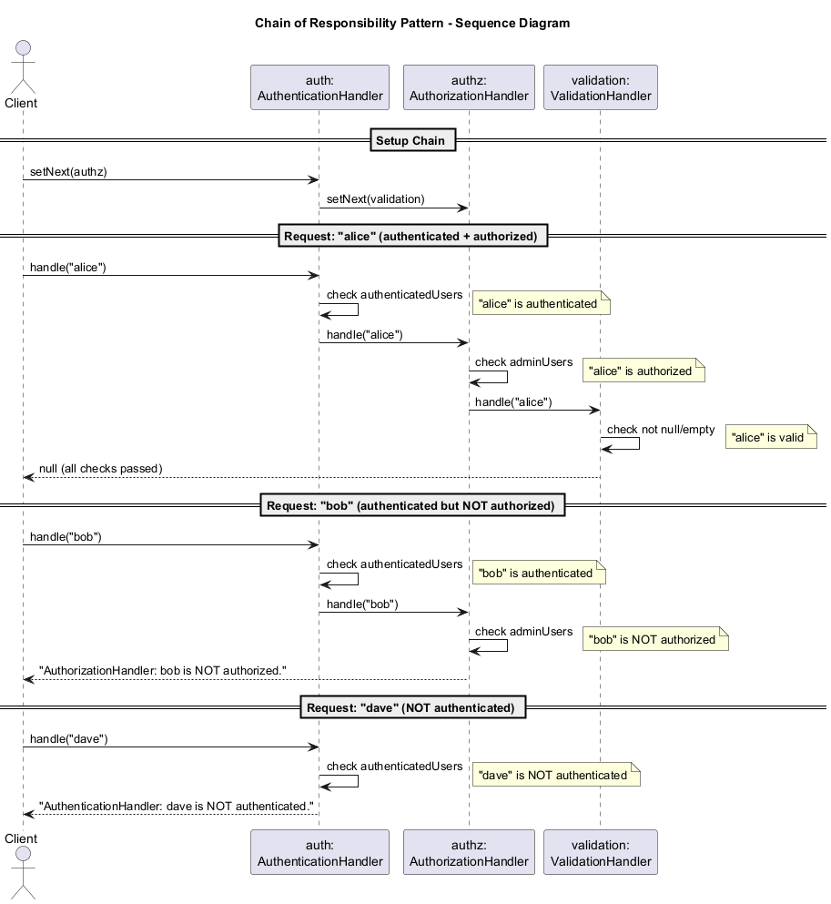

---

## Sorumluluk Zinciri: Uygulanabilirlik

Sorumluluk Zinciri desenini su durumlarda kullanin:

- Programinizin farkli turde istekleri cesitli sekillerde islemesi bekleniyor, ancak **isteklerin tam turleri** ve siralari **onceden bilinmiyor**.

- Belirli bir sirada **birden fazla isleyiciyi calistirmak** gereklidir.

- Isleyici kumesi ve siralarinin **calisma zamaninda degismesi** gerekmektedir. Isleyici siniflari icindeki referans alani icin setter saglarsaniz, isleyicileri dinamik olarak ekleyebilir, kaldirabilir veya yeniden siralayabilirsiniz.

---

## Sorumluluk Zinciri: Nasil Uygulanir

1. Isleyici arayuzunu bildirin ve istekleri islemek icin bir yontemin imzasini tanimlayin.
2. Somut isleyicilerdeki yinelenen kalip kodu ortadan kaldirmak icin, isleyici arayuzunden turetilmis bir **soyut temel isleyici** sinifi olusturun. Bir sonraki isleyiciye referans depolamak icin bir alan ekleyin ve varsayilan iletme davranisini uygulayin.
3. **Somut isleyici** alt siniflari olusturun ve isleme yontemlerini uygulayin. Her isleyici iki karar vermelidir:
   - Istegi isleyip islemeyecegi
   - Istegi zincir boyunca iletip iletmeyecegi

---

## Sorumluluk Zinciri: Nasil Uygulanir (devam)

4. **Istemci** zincirleri kendi basina olusturabilir veya diger nesnelerden onceden olusturulmus zincirleri alabilir. Ikinci durumda, yapilandirma veya ortam ayarlarina gore zincirler olusturmak icin bazi fabrika siniflari uygulamalisiniz.
5. Istemci zincirdeki herhangi bir isleyiciyi tetikleyebilir, yalnizca ilkini degil. Istek, bir isleyici onu daha ileri iletmeyi reddedene veya zincirin sonuna ulasana kadar zincir boyunca iletilecektir.
6. Zincirin dinamik dogasi nedeniyle, istemci su senaryolari ele almaya hazir olmalidir:
   - Zincir **tek bir halkadan** olusabilir
   - Bazi istekler zincirin **sonuna ulasamayabilir**
   - Digerleri zincirin sonuna **islenmeden** ulasabilir

---

## Sorumluluk Zinciri: Avantajlar ve Dezavantajlar

**Avantajlar:**

- Istek isleme **sirasini kontrol** edebilirsiniz
- **Tek Sorumluluk Ilkesi:** Islemleri cagiran siniflari, islemleri gerceklestiren siniflardan ayirabilirsiniz
- **Acik/Kapali Ilkesi:** Mevcut istemci kodunu bozmadan uygulamaya yeni isleyiciler ekleyebilirsiniz

**Dezavantajlar:**

- Hicbir isleyici islemezse bazi istekler **islenmeden** kalabilir

---

## Sorumluluk Zinciri: Diger Desenlerle Iliskileri

- **Sorumluluk Zinciri, Komut, Arabulucu ve Gozlemci** desenleri, gonderici ve alicilari baglamanin alternatif yollaridir. SZ, bir istegi dinamik bir zincir boyunca sirali olarak iletir.
- **SZ ve Bilesik (Composite):** Yaprak bilesenler, istekleri tum ust bilesenler zinciri boyunca nesne agacinin kokune kadar iletebilir.
- **SZ ve Dekorator (Decorator):** Yapida cok benzerler. Her ikisi de bir dizi nesne uzerinden yurutmeyi iletmek icin ozyinelemeli bilesime dayanir. Ancak SZ isleyicileri birbirinden bagimsiz olarak keyfi islemler yurutebilir ve istegi herhangi bir noktada iletmeyi durdurabilir. Dekoratorler ise temel arayuzu tutarli tutarak davranisi genisletir.

---

## Modul B: Ozet

**Sorumluluk Zinciri (Chain of Responsibility)** deseni, birden fazla nesneye bir istegi isleme firsati vererek gondericileri alicilardan ayirir. Istek, bir nesne isleyene veya zincir sonlana kadar zincir boyunca iletilir.

---

<!-- _backgroundColor: aqua -->

<!-- _color: orange -->

# Modul C: Komut (Command) Deseni

---

## Modul C: Icerik

- Amac
- Problem
- Cozum
- Gercek Dunya Analojisi
- Yapi
- Java Sozde Kod Ornegi
- Uygulanabilirlik
- Nasil Uygulanir
- Avantajlar ve Dezavantajlar
- Diger Desenlerle Iliskileri

---

## Komut: Amac

**Komut (Command)**, bir istegi, istek hakkindaki tum bilgileri iceren bagimsiz bir nesneye donusturen davranissal bir tasarim desenidir. Bu donusum, istekleri yontem argumanlari olarak iletmenize, bir istegin yurutulmesini geciktirmenize veya siraya koymaniza ve geri alinabilir islemleri desteklemenize olanak tanir.

Diger adlari: **Eylem (Action)**, **Islem (Transaction)**

Kaynak: [refactoring.guru](https://refactoring.guru/design-patterns/command)

---

## Komut: Problem

Yeni bir metin duzenleyici uygulamasi uzerinde calistiginizi hayal edin. Mevcut goreviniz, cesitli islemler icin bir grup dugme iceren bir arac cubugu olusturmaktir. Arac cubugundan dugmeler ve iletisim kutularindaki genel dugmeler icin kullanilabilecek bir `Button` sinifi olusturdunuz.

Bu dugmelerin hepsi benzer gorunse de, farkli seyler yapmalari gerekiyor. Bu dugmelerin cesitli tiklama isleyicileri icin kodu nereye koyarsiniz?

---

## Komut: Problem (devam)

En basit cozum, dugmenin kullanildigi her yer icin tonlarca alt sinif olusturmaktir. Bu alt siniflar, bir dugmeye tiklandiginda calistirilacak kodu icerir.

Bu yaklasimdaki sorunlar:

- Temel `Button` sinifini her degistirdiginizde bozulan **cok sayida alt sinif** olur
- GUI kodu, degisken is mantigi koduna **bagimli** hale gelir
- Bazi islemler (ornegin Kopyala/Yapistir) **birden fazla yerden** (dugmeler, menuler, klavye kisayollari) cagrilmalidir, bu da **kod tekrarina** yol acar

---

## Komut: Cozum

Iyi yazilim tasarimi genellikle **kaygilarin ayrilmasi ilkesine** dayanir. Komut deseni, GUI nesnelerinin istekleri dogrudan gondermemesi gerektigini onerir. Bunun yerine, tum istek ayrintilarini, bu istegi tetikleyen tek bir yonteme sahip ayri bir **komut** sinifina cikarirsiniz.

Komut nesneleri, cesitli GUI ve is mantigi nesneleri arasinda baglanti gorevi gorur. GUI nesnesinin, hangi is mantigi nesnesinin istegi alacagini ve nasil isleyecegini bilmesine gerek yoktur.

---

## Komut: Cozum (devam)

Sonraki adim, komutlarinizi **ayni arayuzu** uygulatmaktir. Genellikle parametre almayan tek bir yurutme yontemine sahiptir. Bu arayuz, cesitli komutlari somut siniflara baglantili olmadan ayni istek gonderen ile kullanmaniza olanak tanir.

Bir bonus olarak, artik gondericiye baglanan komut nesnelerini degistirebilir, boylece gondericinin davranisini calisma zamaninda etkili bir sekilde degistirebilirsiniz.

---

## Komut: Gercek Dunya Analojisi

Sehirde uzun bir yuruyusten sonra guzel bir restorana gelip pencere kenarindaki masaya oturursunuz. Dost canli bir garson yaklasir ve **siparisninizi** hizla alir, bir kagida yazar.

Garson mutfaga gider ve siparisi duvara yapistirir. Bir sure sonra siparis, onu okuyup yemegi buna gore pisiren **sefin** eline gecer.

Sef yemegi siparisble birlikte bir tepsiye koyar. Garson tepsiyi bulur, her seyin istediginiz gibi oldugundan emin olmak icin siparisi kontrol eder ve her seyi masaniza getirir.

Kagit siparis bir **komut** gorevi gorur -- sef hazir olana kadar bir kuyrukta kalir.

---

## Komut: Yapi

Komut deseninin bes temel katilimcisi vardir:

1. **Gonderici (Invoker)**: Istekleri baslatmaktan sorumludur. Bir komut nesnesine referans depolamak icin bir alana sahiptir. Istegi dogrudan aliciya gondermek yerine bu komutu tetikler.

2. **Komut Arayuzu (Command Interface)**: Genellikle komutu yurutmek icin yalnizca tek bir yontem bildirir.

---

## Komut: Yapi (devam)

3. **Somut Komutlar (Concrete Commands)**: Cesitli istek turlerini uygular. Somut bir komutun isi kendi basina yapmasi beklenmez, bunun yerine cagiyi is mantigi nesnelerinden birine (alici) iletmelidir. Alici nesnesi uzerinde bir yontem calistirmak icin gereken parametreler, somut komutta alan olarak bildirilebilir.

4. **Alici (Receiver)**: Bazi is mantigi icerir. Neredeyse herhangi bir nesne alici olarak gorev yapabilir. Cogu komut yalnizca bir istegin aliciya nasil iletildiginin ayrintilarini ele alir.

5. **Istemci (Client)**: Somut komut nesnelerini olusturur ve yapilandirir. Istemci, bir alici ornegi de dahil olmak uzere tum istek parametrelerini komut yapilandiricisindan gecirmelidir.

---

## Komut: Yapi Diyagrami

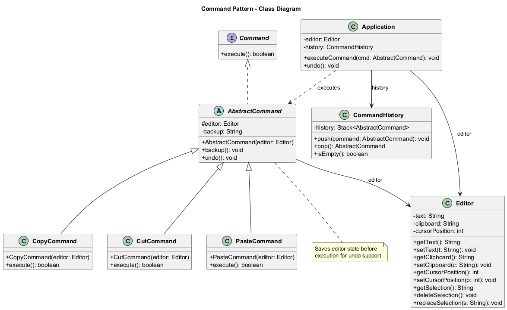

---

## Komut: Java Sozde Kod

```java
// Command interface
interface Command {
    boolean execute();
}
```

---

## Komut: Java Sozde Kod (devam)

```java
// Receiver: the actual text editor
class Editor {
    private String text = "";
    private String clipboard = "";
    private int cursorPosition = 0;

    public String getText() { return text; }
    public void setText(String t) { this.text = t; }
    public String getClipboard() { return clipboard; }
    public void setClipboard(String c) {
        clipboard = c;
    }
    public int getCursorPosition() {
        return cursorPosition;
    }
    public void setCursorPosition(int p) {
        cursorPosition = p;
    }

    public String getSelection() {
        // Simplified: returns part of text
        return text.substring(
            Math.min(cursorPosition, text.length()));
    }

    public void deleteSelection() {
        text = text.substring(0, cursorPosition);
    }

    public void replaceSelection(String s) {
        text = text.substring(0, cursorPosition) + s;
    }
}
```

---

## Komut: Java Sozde Kod (devam)

```java
// Abstract command with undo support
abstract class AbstractCommand implements Command {
    protected Editor editor;
    private String backup;

    public AbstractCommand(Editor editor) {
        this.editor = editor;
    }

    // Save editor state before execution
    public void backup() {
        this.backup = editor.getText();
    }

    // Restore editor state
    public void undo() {
        editor.setText(backup);
    }
}
```

---

## Komut: Java Sozde Kod (devam)

```java
// Concrete Command: Copy
class CopyCommand extends AbstractCommand {
    public CopyCommand(Editor editor) {
        super(editor);
    }

    @Override
    public boolean execute() {
        editor.setClipboard(editor.getSelection());
        // Copy does not change state,
        // so no undo needed
        return false;
    }
}
```

---

## Komut: Java Sozde Kod (devam)

```java
// Concrete Command: Cut
class CutCommand extends AbstractCommand {
    public CutCommand(Editor editor) {
        super(editor);
    }

    @Override
    public boolean execute() {
        backup();
        editor.setClipboard(editor.getSelection());
        editor.deleteSelection();
        return true;
    }
}
```

---

## Komut: Java Sozde Kod (devam)

```java
// Concrete Command: Paste
class PasteCommand extends AbstractCommand {
    public PasteCommand(Editor editor) {
        super(editor);
    }

    @Override
    public boolean execute() {
        backup();
        editor.replaceSelection(
            editor.getClipboard());
        return true;
    }
}
```

---

## Komut: Java Sozde Kod (devam)

```java
// Command History for undo support
class CommandHistory {
    private Stack<AbstractCommand> history
        = new Stack<>();

    public void push(AbstractCommand command) {
        history.push(command);
    }

    public AbstractCommand pop() {
        return history.pop();
    }

    public boolean isEmpty() {
        return history.isEmpty();
    }
}
```

---

## Komut: Java Sozde Kod (devam)

```java
// Invoker: Application
class Application {
    private Editor editor = new Editor();
    private CommandHistory history
        = new CommandHistory();

    public void executeCommand(
            AbstractCommand cmd) {
        if (cmd.execute()) {
            // Only save commands that modify state
            history.push(cmd);
        }
    }

    public void undo() {
        if (!history.isEmpty()) {
            AbstractCommand cmd = history.pop();
            cmd.undo();
        }
    }

    public static void main(String[] args) {
        Application app = new Application();
        app.editor.setText("Hello, World!");
        app.editor.setCursorPosition(5);

        // Execute cut (modifies state -> saved)
        app.executeCommand(
            new CutCommand(app.editor));
        System.out.println("After cut: "
            + app.editor.getText());

        // Undo
        app.undo();
        System.out.println("After undo: "
            + app.editor.getText());
    }
}
```

---

## Komut: Sira Diyagrami

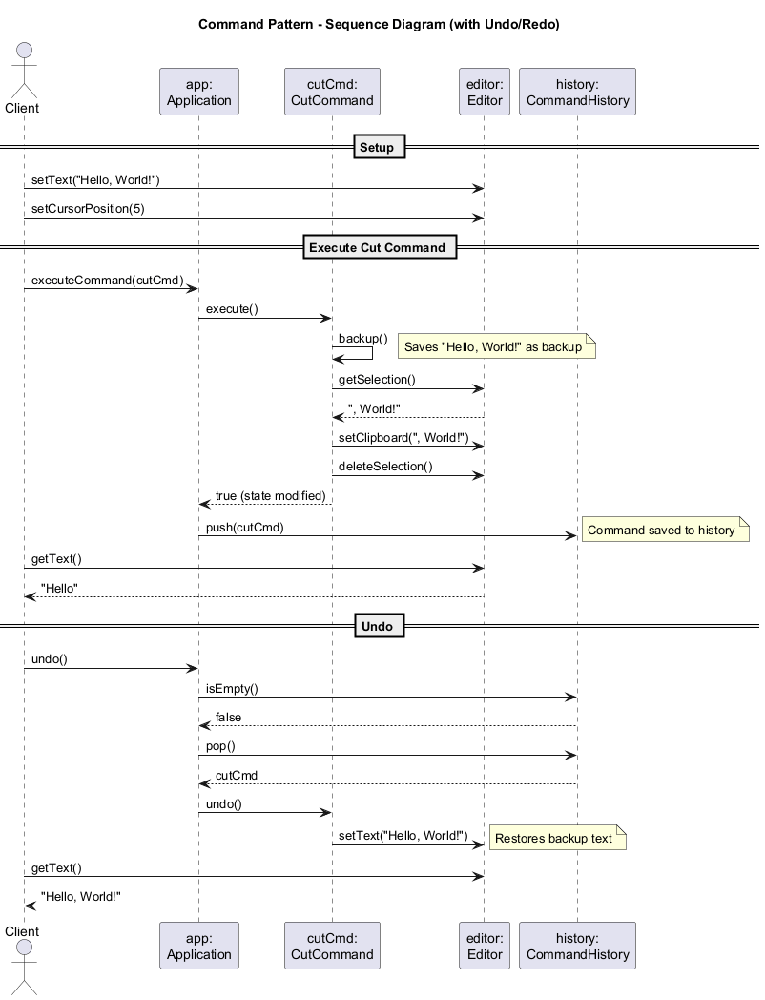

---

## Komut: Uygulanabilirlik

Komut desenini su durumlarda kullanin:

- **Nesneleri islemlerle parametrelendirmek.** Komut deseni, belirli bir yontem cagrisini bagimsiz bir nesneye donusturebilir. Komutlari yontem argumanlari olarak iletebilir, diger nesnelerin icinde depolayabilir, calisma zamaninda baglantili komutlari degistirebilirsiniz, vb.

- **Islemleri siraya koymak, yurutmelerini zamanlamak veya uzaktan yurutmek.** Komutlari seriletirebilir, ag uzerinden gonderebilir ve farkli bir makinede yurutebilirsiniz.

- **Geri alinabilir islemler uygulamak.** En yaygin kullanim. Geri almayi uygulamak icin, onceki durumu geri yukleme olanagi ile bir komut gecmisi tutmaniz gerekir.

---

## Komut: Nasil Uygulanir

1. Tek bir yurutme yontemi ile **komut arayuzunu** bildirin.
2. Istekleri, komut arayuzunu uygulayan **somut komut sinifarina** cikarmayi baslayin. Her sinif, istek argumanlari ve alici nesneye referans depolamak icin alanlara sahip olmalidir.
3. **Gonderici** (invoker) olarak gorev yapacak siniflari belirleyin. Komutlari depolamak icin alanlar ekleyin. Gondericiler komutlarla yalnizca komut arayuzu araciligiyla iletisim kurmalidir.
4. Gondericileri, istegi dogrudan aliciya gondermek yerine **komutu yuruterek** degistirin.
5. **Istemci** nesneleri su sirada baslatmalidir: alicilar, komutlar (alici referanslariyla), gondericiler (komut referanslariyla).

---

## Komut: Avantajlar ve Dezavantajlar

**Avantajlar:**

- **Tek Sorumluluk Ilkesi:** Islemleri cagiran siniflari, islemleri gerceklestiren siniflardan ayirir
- **Acik/Kapali Ilkesi:** Mevcut istemci kodunu degistirmeden yeni komutlar eklenebilir
- **Geri al/yinele** islevselligini uygulama
- Islemlerin **ertelenmis yurutulmesini** uygulama
- Basit komutlar kumesini **karmasik** bir komutta (makro komutlar) birlestirme

**Dezavantajlar:**

- Gondericiler ve alicilar arasina tamamen yeni bir katman eklediginiz icin kod **daha karmasik** hale gelebilir

---

## Komut: Diger Desenlerle Iliskileri

- **Sorumluluk Zinciri, Komut, Arabulucu, Gozlemci** desenleri gonderici-alici baglantilarini farkli sekilde ele alir. Komut, tek yonlu baglantilar kurar.
- **Komut + Hatira:** Geri alma destegi icin yurutmeden once komut durumunu kaydetmek icin Hatira kullanin.
- **Komut ve Strateji:** Her ikisi de nesneleri parametrelendrir, ancak Komut islemleri nesnelere donusturur (ertelenmis yurutme, kuyruga alma, gecmis icin), Strateji ise ayni seyi yapmanin farkli yollarini tanimlar.
- **Prototip (Prototype)** komutlarin kopyalarini gecmise kaydetmeniz gerektiginde yardimci olur.
- **Ziyaretci (Visitor)** farkli siniflardaki nesneler uzerinde islem yurutebilen, Komutun guclu bir surumu olarak dusunulebilir.

---

## Modul C: Ozet

**Komut (Command)** deseni, bir istegi nesne olarak kapsulleyerek istemcileri parametrelendirmenize, istekleri siraya koymaniza, kaydetmenize ve geri alinabilir islemleri desteklemenize olanak tanir. Islemi cagiran nesneyi gerceklestiren nesneden ayirir.

---

<!-- _backgroundColor: aqua -->

<!-- _color: orange -->

# Modul D: Yineleyici (Iterator) Deseni

---

## Modul D: Icerik

- Amac
- Problem
- Cozum
- Gercek Dunya Analojisi
- Yapi
- Java Sozde Kod Ornegi
- Uygulanabilirlik
- Nasil Uygulanir
- Avantajlar ve Dezavantajlar
- Diger Desenlerle Iliskileri

---

## Yineleyici: Amac

**Yineleyici (Iterator)**, bir koleksiyonun elemanlarini, altindaki temsili (liste, yigin, agac, vb.) aciga cikarmadan gezmenizi saglayan davranissal bir tasarim desenidir.

Kaynak: [refactoring.guru](https://refactoring.guru/design-patterns/iterator)

---

## Yineleyici: Problem

Koleksiyonlar, programlamada en cok kullanilan veri turlerinden biridir. Bir koleksiyon, bir grup nesne icin yalnizca bir kapsayicidir.

Cogu koleksiyon elemanlarini basit listelerde depolar. Ancak bazilari yiginlara, agaclara, grafiklere ve diger karmasik veri yapilarini temel alir.

Bir koleksiyon nasil yapilandirilmis olursa olsun, diger kodlarin bu elemanlari kullanabilmesi icin **elemanlarini erislirmeyi** saglayan bir yol sunmalidir. Ayni elemanlara tekrar tekrar erismeden her bir eleman uzerinden gecmenin bir yolu olmalidir.

---

## Yineleyici: Problem (devam)

Koleksiyonunuz bir listeye dayaliysa bu kolay bir is gibi gorunebilir. Tum elemanlar uzerinde dongu yapmaniz yeterlidir. Ancak bir agac gibi karmasik bir veri yapisinin elemanlarini nasil **sirali olarak gezersiniz**?

Ornegin, bir gun agacin **oncelik derinlik** gezintisine ihtiyaciniz olabilir. Ertesi gun **genislik oncelikli** gezintiye ihtiyaciniz olabilir. Ve sonraki hafta **rastgele erisim** ihtiyaciniz olabilir.

Koleksiyona daha fazla gezinti algoritmasi eklemek, onun **birincil sorumlulusunu** giderek **bulaniklastirir**: verimli veri depolama.

---

## Yineleyici: Cozum

Yineleyici deseninin ana fikri, bir koleksiyonun gezinti davranisini **yineleyici** adli ayri bir nesneye cikarmaktir.

Algoritmanin kendisini uygulamanin yani sira, bir yineleyici nesnesi mevcut konum ve sonuna kadar kac eleman kaldigini gibi tum gezinti ayrintilarini kapsullar.

Birden fazla yineleyici, birbirinden bagimsiz olarak **ayni koleksiyon** uzerinde ayni anda gezinebilir.

---

## Yineleyici: Cozum (devam)

Genellikle yineleyiciler, koleksiyonun elemanlarini getirmek icin tek bir birincil yontem saglar. Istemci, yineleyici hicbir sey dondurmeyene kadar bu yontemi calistirmaya devam edebilir, bu da yineleyicinin tum elemanlari gezdigi anlamina gelir.

Tum yineleyiciler **ayni arayuzu** uygulamalidir. Bu, istemci kodunu, uygun bir yineleyici oldugu surece herhangi bir koleksiyon turu veya herhangi bir gezinti algoritmasiyla uyumlu hale getirir.

Bir koleksiyonu gezmek icin ozel bir yola ihtiyaciniz varsa, koleksiyonu veya istemciyi degistirmek zorunda kalmadan yalnizca **yeni bir yineleyici sinifi** olusturursunuz.

---

## Yineleyici: Gercek Dunya Analojisi

Birkac gunlugune Roma'yi ziyaret etmeyi ve tum turistik yerlerini ve cazibe merkezlerini gormeyi planliyorsunuz. Ancak oraya vardiginizda, Kolezyum'u bile bulamadan daireler cizerek cok zaman harcayabilirsiniz.

Ote yandan, akilli telefonunuz icin bir **sanal rehber uygulamasi** satin alip navigasyon icin kullanabilirsiniz. Ya da sehri taniyan bir **yerel rehber** tutabilirsiniz.

Her uc secenek de -- rastgele yuruyus, akilli telefon navigatoru ve insan rehber -- Roma'daki genis turistik yerler ve cazibe merkezleri koleksiyonu uzerinde **yineleyici** gorevi gorur.

---

## Yineleyici: Yapi

Yapi asagidaki katilimcilardan olusur:

1. **Yineleyici Arayuzu (Iterator Interface)**: Bir koleksiyonu gezmek icin gereken islemleri bildirir: sonraki elemani getirme, mevcut konumu alma, yinelemeyi yeniden baslattma, vb.

2. **Somut Yineleyiciler (Concrete Iterators)**: Bir koleksiyonu gezmek icin belirli algoritmalar uygular. Yineleyici nesnesi, gezinti ilerlemesini kendi basina takip etmelidir. Bu, birden fazla yineleyicinin ayni koleksiyonu bagimsiz olarak gezmesine olanak tanir.

---

## Yineleyici: Yapi (devam)

3. **Koleksiyon Arayuzu (Iterable)**: Koleksiyonla uyumlu yineleyiciler almak icin bir veya daha fazla yontem bildirir. Donus turu, yineleyici arayuzu olarak bildirilmelidir.

4. **Somut Koleksiyonlar (Concrete Collections)**: Istemci her istediginde belirli bir somut yineleyici sinifinin yeni orneklerini dondurur. Koleksiyonun geri kalan kodu ayni sinifta olmalidir.

5. **Istemci (Client)**: Hem koleksiyonlarla hem de yineleyicilerle arayuzleri araciligiyla calisir, bu nedenle somut siniflara baglanmaz ve ayni istemci koduyla cesitli koleksiyonlari ve yineleyicileri kullanmaya olanak tanir.

---

## Yineleyici: Yapi Diyagrami

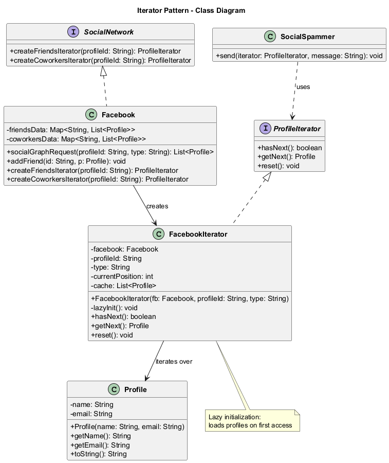

---

## Yineleyici: Java Sozde Kod

```java
// Iterator interface
interface ProfileIterator {
    boolean hasNext();
    Profile getNext();
    void reset();
}
```

---

## Yineleyici: Java Sozde Kod (devam)

```java
// Profile class
class Profile {
    private String name;
    private String email;

    public Profile(String name, String email) {
        this.name = name;
        this.email = email;
    }

    public String getName() { return name; }
    public String getEmail() { return email; }

    @Override
    public String toString() {
        return name + " <" + email + ">";
    }
}
```

---

## Yineleyici: Java Sozde Kod (devam)

```java
// Collection interface
interface SocialNetwork {
    ProfileIterator createFriendsIterator(
        String profileId);
    ProfileIterator createCoworkersIterator(
        String profileId);
}
```

---

## Yineleyici: Java Sozde Kod (devam)

```java
// Concrete iterator for Facebook friends
class FacebookIterator implements ProfileIterator {
    private Facebook facebook;
    private String profileId;
    private String type;
    private int currentPosition = 0;
    private List<Profile> cache;

    public FacebookIterator(Facebook fb,
            String profileId, String type) {
        this.facebook = fb;
        this.profileId = profileId;
        this.type = type;
    }

    private void lazyInit() {
        if (cache == null) {
            cache = facebook.socialGraphRequest(
                profileId, type);
        }
    }

    @Override
    public boolean hasNext() {
        lazyInit();
        return currentPosition < cache.size();
    }

    @Override
    public Profile getNext() {
        if (hasNext()) {
            return cache.get(currentPosition++);
        }
        return null;
    }

    @Override
    public void reset() { currentPosition = 0; }
}
```

---

## Yineleyici: Java Sozde Kod (devam)

```java
// Concrete collection
class Facebook implements SocialNetwork {
    private Map<String, List<Profile>> friendsData
        = new HashMap<>();
    private Map<String, List<Profile>> coworkersData
        = new HashMap<>();

    // Simulated social graph request
    public List<Profile> socialGraphRequest(
            String profileId, String type) {
        if ("friends".equals(type)) {
            return friendsData.getOrDefault(
                profileId, new ArrayList<>());
        }
        return coworkersData.getOrDefault(
            profileId, new ArrayList<>());
    }

    public void addFriend(String id, Profile p) {
        friendsData.computeIfAbsent(
            id, k -> new ArrayList<>()).add(p);
    }

    @Override
    public ProfileIterator createFriendsIterator(
            String profileId) {
        return new FacebookIterator(
            this, profileId, "friends");
    }

    @Override
    public ProfileIterator createCoworkersIterator(
            String profileId) {
        return new FacebookIterator(
            this, profileId, "coworkers");
    }
}
```

---

## Yineleyici: Java Sozde Kod (devam)

```java
// Client code: SocialSpammer
class SocialSpammer {
    public void send(ProfileIterator iterator,
                     String message) {
        while (iterator.hasNext()) {
            Profile profile = iterator.getNext();
            System.out.println("Sending '"
                + message + "' to "
                + profile.toString());
        }
    }
}

// Usage
public class IteratorDemo {
    public static void main(String[] args) {
        Facebook facebook = new Facebook();
        facebook.addFriend("user1",
            new Profile("Alice", "alice@mail.com"));
        facebook.addFriend("user1",
            new Profile("Bob", "bob@mail.com"));

        ProfileIterator iterator =
            facebook.createFriendsIterator("user1");

        SocialSpammer spammer = new SocialSpammer();
        spammer.send(iterator,
            "Check out our new product!");
    }
}
```

---

## Yineleyici: Sira Diyagrami

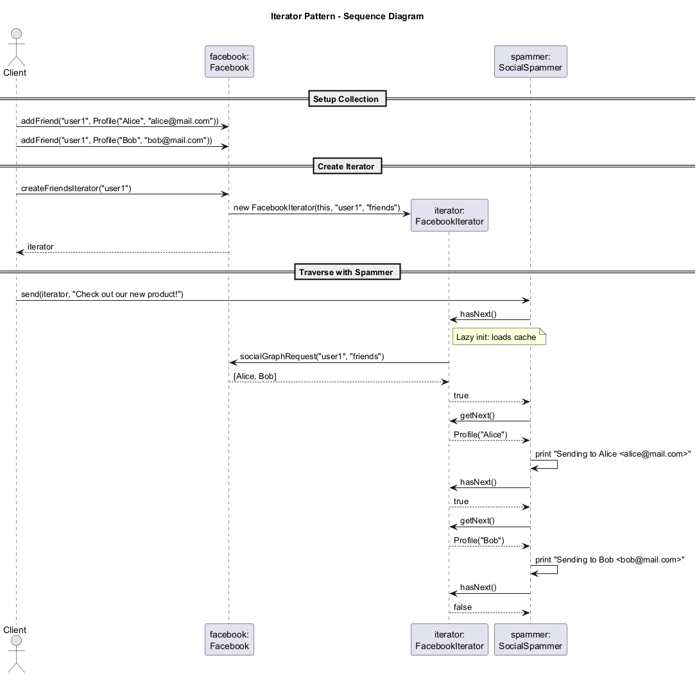

---

## Yineleyici: Uygulanabilirlik

Yineleyici desenini su durumlarda kullanin:

- Koleksiyonunuzun altinda karmasik bir veri yapisi var, ancak **karmasikligini istemcilerden gizlemek** istiyorsunuz (kolaylik veya guvenlik nedenleriyle).
- Uygulamaniz genelinde gezinti kodu **tekrarini azaltmak** istiyorsunuz.
- Kodunuzun **farkli veri yapilarini gezebilmesini** istiyorsunuz veya bu yapilarin turleri onceden bilinmiyorsa.
- Ayni koleksiyon uzerinde **birden fazla es zamanli gezintiyi** desteklemeniz gerekiyor.

---

## Yineleyici: Nasil Uygulanir

1. **Yineleyici arayuzunu** bildirin. En azindan, sonraki elemani getirmek icin bir yonteme sahip olmalidir. Ancak kolaylik icin birkac baska yontem de ekleyebilirsiniz.
2. **Koleksiyon arayuzunu** bildirin ve yineleyici getirmek icin bir yontem tanimlayin. Donus turu, yineleyici arayuzunkiyle esit olmalidir.
3. Yineleyicilerle gezilebilir olmasini istediginiz koleksiyonlar icin **somut yineleyici** siniflari uygulayin.
4. Koleksiyon siniflarinizda **koleksiyon arayuzunu** uygulayin. Ana fikir, istemciye belirli bir koleksiyon sinifi icin ozellestirilmis yineleyiciler olusturmak icin bir kisayol saglamaktir.
5. Tum koleksiyon gezinti kodunu yineleyicilerin kullanimiyla degistirmek icin **istemci kodunu** gozden gecirin.

---

## Yineleyici: Avantajlar ve Dezavantajlar

**Avantajlar:**

- **Tek Sorumluluk Ilkesi:** Hacimli gezinti algoritmalarini ayri siniflara cikararak istemci kodunu ve koleksiyonlari temizleyebilirsiniz
- **Acik/Kapali Ilkesi:** Yeni koleksiyon ve yineleyici turleri uygulayabilir ve hicbir seyi bozmadan mevcut koda iletebilirsiniz
- Her yineleyici nesnesi kendi yineleme durumunu icerdiginden, **ayni koleksiyon uzerinde paralel** yineleme yapabilirsiniz
- Ayni nedenle, bir yinelemeyi **erteleyebilir** ve gerektiginde devam edebilirsiniz

**Dezavantajlar:**

- Uygulamaniz yalnizca basit koleksiyonlarla calisiyorsa deseni uygulamak **asiri** olabilir
- Bir yineleyici kullanmak, bazi ozellestirilmis koleksiyonlarin elemanlarina dogrudan erismekten **daha az verimli** olabilir

---

## Yineleyici: Diger Desenlerle Iliskileri

- **Bilesik (Composite)** agaclarini gezmek icin **Yineleyiciler** kullanabilirsiniz.
- Koleksiyon alt siniflarinin koleksiyonlarla uyumlu farkli turde yineleyiciler dondurmesini saglamak icin **Yineleyici** ile birlikte **Fabrika Yontemi (Factory Method)** kullanabilirsiniz.
- Mevcut yineleme durumunu yakalamak ve gerekirse geri almak icin **Yineleyici** ile birlikte **Hatira (Memento)** kullanabilirsiniz.
- Karmasik bir veri yapisini gezmek ve tumunun farkli siniflari olsa bile elemanlari uzerinde bazi islemler yurutmek icin **Yineleyici** ile birlikte **Ziyaretci (Visitor)** kullanabilirsiniz.

---

## Modul D: Ozet

**Yineleyici (Iterator)** deseni, bir toplam nesnenin elemanlarini, altindaki temsili aciga cikarmadan sirali olarak erismek icin bir yol saglar. Gezinti mantisini ozel yineleyici nesnelerine cikararak Tek Sorumluluk Ilkesini tesvik eder.

---

<!-- _backgroundColor: aqua -->

<!-- _color: orange -->

# Modul E: Arabulucu (Mediator) Deseni

---

## Modul E: Icerik

- Amac
- Problem
- Cozum
- Gercek Dunya Analojisi
- Yapi
- Java Sozde Kod Ornegi
- Uygulanabilirlik
- Nasil Uygulanir
- Avantajlar ve Dezavantajlar
- Diger Desenlerle Iliskileri

---

## Arabulucu: Amac

**Arabulucu (Mediator)**, nesneler arasindaki kaotik bagimliliklari azaltmanizi saglayan davranissal bir tasarim desenidir. Desen, nesneler arasindaki dogrudan iletisimi kisitlar ve onlari yalnizca bir arabulucu nesnesi araciligiyla isbirligi yapmaya zorlar.

Diger adlari: **Araci (Intermediary)**, **Denetleyici (Controller)**

Kaynak: [refactoring.guru](https://refactoring.guru/design-patterns/mediator)

---

## Arabulucu: Problem

Musteri profilleri olusturmak ve duzenlemek icin bir iletisim kutusu olusturdunuzu varsayin. Metin alanlari, onay kutulari, dugmeler vb. gibi cesitli form kontrollerinden olusur.

Form elemanlarindan bazilari digerleryle etkilesime girebilir. Ornegin, "Bir kopegim var" onay kutusunu secmek, kopegin adini girmek icin gizli bir metin alanini ortaya cikarabilir. Baska bir ornek, verileri kaydetmeden once tum alanlarin degerlerini dogrulamasi gereken gonder dugmesidir.

---

## Arabulucu: Problem (devam)

Bu mantigi dogrudan form elemanlarinin koduna uygulayarak, bu elemanlarin siniflarini uygulamanin diger formlarinda **yeniden kullanmayi cok zorlastirirsiniz**. Ornegin, kopegin metin alanina baglandigi icin o onay kutusu sinifini baska bir formda kullanamazsiniz.

Forma ne kadar cok eleman eklerseniz, bagimliliklar o kadar **karmasik** hale gelir. Bir elemani degistirmek diger bircogunu etkileyebilir.

---

## Arabulucu: Cozum

Arabulucu deseni, birbirinden bagimsiz hale getirmek istediginiz bilesenler arasindaki tum dogrudan iletisimi durdurmanizi onerir. Bunun yerine, bu bilesenler cagrilari uygun bilesenlere yonlendiren ozel bir **arabulucu nesnesi** cagirarak dolayli yoldan isbirligi yapmalidir.

Sonuc olarak, bilesenler duzinelerce meslektaslarina baglanmak yerine yalnizca tek bir arabulucu sinifina bagimli olur.

---

## Arabulucu: Cozum (devam)

En onemli degisiklik, gercek form elemanlarinda olur. Iletisim kutusu ornegimizde, **iletisim kutusu sinifinin kendisi** arabulucu olarak gorev yapabilir. Buyuk olasilikla, iletisim kutusu sinifi tum alt elemanlarinin zaten farkindadir, bu nedenle yeni bagimliliklar bile eklemeniz gerekmeyebilir.

Her bilesen, arabulucuya bir referans depolamali ve diger bilesenleri dogrudan cagirmak yerine olaylar hakkinda arabulucuyu bilgilendirmelidir. Arabulucu daha sonra hangi bilesenin olayi islemesi gerektigini belirler ve cagiyi buna gore yonlendirir.

---

## Arabulucu: Gercek Dunya Analojisi

Havalimaninin kontrol alanina yaklasan veya ayrilanan ucaklarin pilotlari birbirleriyle dogrudan iletisim kurmaz. Bunun yerine, pistin yakinindaki yuksek bir kulede oturan bir **hava trafik kontroloruyle** konusurlar.

Hava trafik kontroloru olmasaydi, her pilotun havalimani yakinindaki diger tum ucaklardan haberdar olmasi ve duzinelerce baska pilottan olusan bir komiteyle inis onceliklerini tartismasi gerekirdi. Bu muhtemelen ucak kaza istatistiklerini buyuk olcude artirirdi.

Kulenin tum ucusu kontrol etmesi gerekmez. Yalnizca terminal bolgesindeki kisitlamalari uygulamak icin vardir, cunku oradaki ilgili aktor sayisi cok fazladir.

---

## Arabulucu: Yapi

Yapi asagidaki katilimcilardan olusur:

1. **Bilesenler (Components)**: Bazi is mantigi iceren cesitli siniflar. Her bilesen, arabulucu arayuzu turuyle bildirilen arabulucuya bir referansa sahiptir. Bilesen, arabulucunun gercek sinifinin farkinda degildir.

2. **Arabulucu Arayuzu (Mediator Interface)**: Bilesenlerle iletisim yontemlerini bildirir, genellikle yalnizca tek bir bildirim yontemini icerir.

---

## Arabulucu: Yapi (devam)

3. **Somut Arabulucular (Concrete Mediators)**: Cesitli bilesenler arasindaki iliskileri kapsullerler. Somut arabulucular genellikle yonettikleri tum bilesenlere referanslar tutarlar ve bazen yasam dongulerini bile yonetirler.

4. **Iletisim Kurali**: Bilesenler diger bilesenlerden haberdar olmamalidir. Bir bilesen icinde veya bilesene onemli bir sey olursa, yalnizca arabulucuyu bilgilendirmelidir. Arabulucu bildirimi aldiginda, gondericyi kolayca belirleyebilir ve buna karsilik hangi bilesenin tetiklenmesi gerektigine karar vermek icin bu yeterli olabilir.

---

## Arabulucu: Yapi Diyagrami

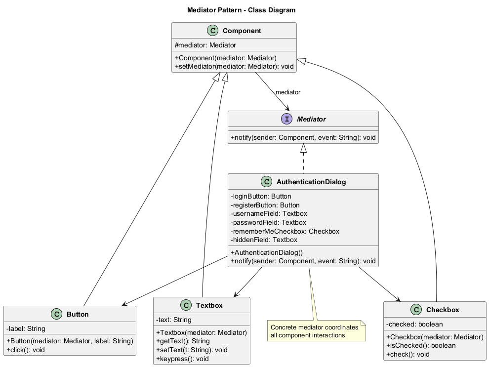

---

## Arabulucu: Java Sozde Kod

```java
// Mediator interface
interface Mediator {
    void notify(Component sender, String event);
}
```

---

## Arabulucu: Java Sozde Kod (devam)

```java
// Base component
class Component {
    protected Mediator mediator;

    public Component(Mediator mediator) {
        this.mediator = mediator;
    }

    public void setMediator(Mediator mediator) {
        this.mediator = mediator;
    }
}
```

---

## Arabulucu: Java Sozde Kod (devam)

```java
// Concrete component: Button
class Button extends Component {
    private String label;

    public Button(Mediator mediator, String label) {
        super(mediator);
        this.label = label;
    }

    public void click() {
        System.out.println("Button '" + label
            + "' clicked.");
        mediator.notify(this, "click");
    }
}

// Concrete component: Textbox
class Textbox extends Component {
    private String text = "";

    public Textbox(Mediator mediator) {
        super(mediator);
    }

    public String getText() { return text; }
    public void setText(String t) { this.text = t; }

    public void keypress() {
        mediator.notify(this, "keypress");
    }
}
```

---

## Arabulucu: Java Sozde Kod (devam)

```java
// Concrete component: Checkbox
class Checkbox extends Component {
    private boolean checked = false;

    public Checkbox(Mediator mediator) {
        super(mediator);
    }

    public boolean isChecked() { return checked; }

    public void check() {
        checked = !checked;
        System.out.println("Checkbox is now "
            + (checked ? "checked" : "unchecked"));
        mediator.notify(this, "check");
    }
}
```

---

## Arabulucu: Java Sozde Kod (devam)

```java
// Concrete mediator: AuthenticationDialog
class AuthenticationDialog implements Mediator {
    private Button loginButton;
    private Button registerButton;
    private Textbox usernameField;
    private Textbox passwordField;
    private Checkbox rememberMeCheckbox;
    private Textbox hiddenField;

    public AuthenticationDialog() {
        loginButton =
            new Button(this, "Login");
        registerButton =
            new Button(this, "Register");
        usernameField = new Textbox(this);
        passwordField = new Textbox(this);
        rememberMeCheckbox = new Checkbox(this);
        hiddenField = new Textbox(this);
    }

    @Override
    public void notify(Component sender,
                       String event) {
        if (sender == loginButton
                && "click".equals(event)) {
            System.out.println(
                "Mediator: Validating"
                + " credentials...");
        } else if (sender == rememberMeCheckbox
                && "check".equals(event)) {
            boolean show =
                rememberMeCheckbox.isChecked();
            System.out.println("Mediator: "
                + (show ? "Showing" : "Hiding")
                + " hidden field.");
        }
    }
}
```

---

## Arabulucu: Java Sozde Kod (devam)

```java
// Client code
public class MediatorDemo {
    public static void main(String[] args) {
        AuthenticationDialog dialog =
            new AuthenticationDialog();

        // Simulate user interactions
        dialog.rememberMeCheckbox.check();
        dialog.loginButton.click();
    }
}
```

**Cikti:**

```
Checkbox is now checked
Mediator: Showing hidden field.
Button 'Login' clicked.
Mediator: Validating credentials...
```

---

## Arabulucu: Sira Diyagrami

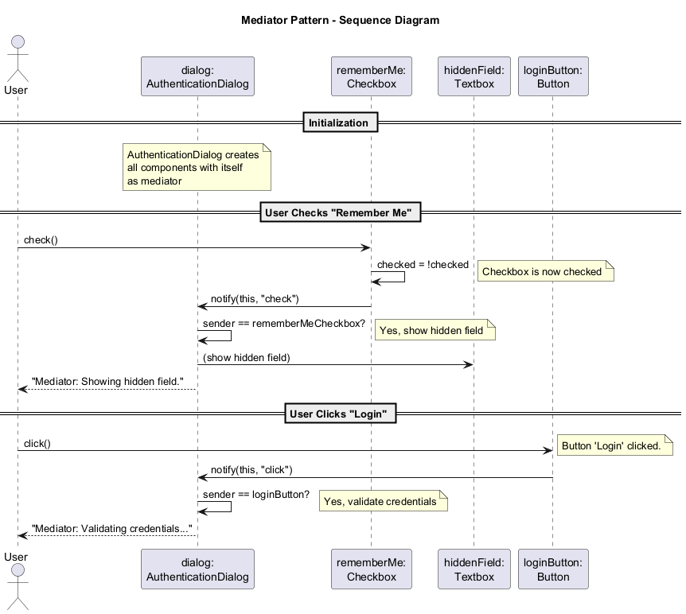

---

## Arabulucu: Uygulanabilirlik

Arabulucu desenini su durumlarda kullanin:

- Bazi siniflari degistirmek zordur cunku bir suru baska sinifa **sikica baglidirlar**.
- Bir **bileseni yeniden kullanamazsiniz** cunku diger bilesenlere cok bagimlidir.
- Cesitli baglamlarda bazi temel davranislari yeniden kullanmak icin kendinizi tonlarca **bilesen alt sinifi** olustururken bulursunuz.

---

## Arabulucu: Nasil Uygulanir

1. Daha bagimsiz olmasindan fayda gorecek bir **sikica bagli siniflar** grubu belirleyin.
2. **Arabulucu arayuzunu** bildirin ve arabulucular ile cesitli bilesenler arasindaki istenen iletisim protokolunu tanimlayim.
3. **Somut arabulucu** sinifini uygulayin. Tum bilesenlere referanslari arabulucu icinde depolamayi dusunun.
4. Daha da ileri gidebilir ve arabulucuyu bilesen nesnelerinin **olusturulmasindan ve yok edilmesinden** sorumlu hale getirebilirsiniz.
5. Bilesenler arabulucu nesnesine bir referans depolamalidir. Baglanti genellikle **bilesenin yapilandiricisinda** kurulur.
6. Bilesenlerin kodunu, diger bilesenlerdeki yontemler yerine **arabulucunun bildirim yontemini** cagirdiklari sekilde degistirin.

---

## Arabulucu: Avantajlar ve Dezavantajlar

**Avantajlar:**

- **Tek Sorumluluk Ilkesi:** Cesitli bilesenler arasindaki iletisimi tek bir yere cikararak anlamayi ve bakimi kolaylastirabilirsiniz
- **Acik/Kapali Ilkesi:** Gercek bilesenleri degistirmek zorunda kalmadan yeni arabulucular ekleyebilirsiniz
- Bir programin cesitli bilesenleri arasindaki **baglantiyi azaltabilirsiniz**
- **Bilesenleri tek tek** daha kolay yeniden kullanabilirsiniz

**Dezavantajlar:**

- Zamanla bir arabulucu, bir **Tanri Nesnesine (God Object)** donusebilir -- cok fazla bilen veya cok fazla is yapan bir nesne

---

## Arabulucu: Diger Desenlerle Iliskileri

- **Sorumluluk Zinciri, Komut, Arabulucu ve Gozlemci** desenleri, gonderici ve alicilari baglamanin cesitli yollarini ele alir. Arabulucu, gonderici ve alicilar arasindaki dogrudan baglantilar ortadan kaldirir ve onlari dolayli yoldan iletisim kurmaya zorlar.
- **Cephe (Facade) ve Arabulucu:** Cephe bir alt sisteme basitlestirilmis bir arayuz tanimlar; yeni islevsellik eklemez ve alt sistem nesneleri cepheden haberdar degildir. Arabulucu, bilesenler arasindaki iletisimi merkezllestirir.
- **Arabulucu ve Gozlemci:** Ayrimi genellikle incedir. Arabulucu, merkezi bir nesne araciligiyla karsilikli bagimliliklari ortadan kaldirir. Gozlemci, dinamik tek yonlu abonelik baglantilari kurmaya olanak tanir. Arabulucu, arabulucunun yayinci ve bilesenlerin abone olarak gorev yaptigi Gozlemci kullanilarak uygulanabilir.

---

## Modul E: Ozet

**Arabulucu (Mediator)** deseni, bir nesne kumesinin nasil etkilestigini kapsulleyen bir nesne tanimlar. Nesnelerin birbirine acikca referans vermesini engelleyerek gevsek baglantiyi tesvik eder ve etkilesimlerini bagimsiz olarak degistirmenize olanak tanir.

---

<!-- _backgroundColor: aqua -->

<!-- _color: orange -->

# Modul F: Hatira (Memento) Deseni

---

## Modul F: Icerik

- Amac
- Problem
- Cozum
- Gercek Dunya Analojisi
- Yapi
- Java Sozde Kod Ornegi
- Uygulanabilirlik
- Nasil Uygulanir
- Avantajlar ve Dezavantajlar
- Diger Desenlerle Iliskileri

---

## Hatira: Amac

**Hatira (Memento)**, bir nesnenin onceki durumunu, uygulamasinin ayrintilarini aciga cikarmadan kaydetmenize ve geri yuklemenize olanak taniyan davranissal bir tasarim desenidir.

Diger adi: **Anlik Goruntu (Snapshot)**

Kaynak: [refactoring.guru](https://refactoring.guru/design-patterns/memento)

---

## Hatira: Problem

Bir metin duzenleyici uygulamasi olusturdugununuzu hayal edin. Basit metin duzenlemeye ek olarak, duzenleyiciniz metni bicimlendirebilir, satir ici resimler ekleyebilir, vb.

Bir noktada, kullanicilarin metin uzerinde gerceklestirilen herhangi bir islemi **geri almasina** izin vermeye karar verdiniz. Bu ozellik o kadar yaygin hale geldi ki insanlar her uygulamada bunu bekliyorlar.

Uygulama icin dogrudan yaklasimi sectiniz: herhangi bir islem gerceklestirmeden once, uygulama **tum nesnelerin durumunu** kaydeder ve bir depolama alanina kaydeder. Daha sonra, bir kullanici bir islemi geri almaya karar verdiginde, uygulama en son anlik goruntuyu getirir ve durumu geri yuklemek icin kullanir.

---

## Hatira: Problem (devam)

Nesnenin durumunun anlik goruntusunu tam olarak nasil uretirsiniz? Muhtemelen bir nesnedeki tum alanlari gozden gecirmeniz ve degerlerini depolama alanina kopyalamaniz gerekir. Ancak bu, yalnizca nesnenin icerigine oldukca **gevsetilmis erisim kisitlamalari** varsa ise yarar. Ne yazik ki, cogu gercek nesne digerlerinin iclerine bu kadar kolayca bakmasina izin vermez ve tum onemli verileri **ozel alanlarda** gizler.

Ozel alanlari dogrudan kopyalamaya calismak ya kapsullemeyi bozar ya da anlik goruntu mantisini nesnenin ic yapisina baglar, bu da kodu kirilgan hale getirir.

---

## Hatira: Cozum

Hatira deseni, durum anlik goruntuleri olusturmayi, durumun gercek sahibi olan **kaynak (originator)** nesnesine devreder. Dolayisiyla, diger nesnelerin duzenleyicinin durumunu "disaridan" kopyalamaya calismasinin yerine, duzenleyici sinifi kendi durumuna tam erisime sahip oldugundan anlik goruntuyu kendisi yapabilir.

Desen, nesnenin durumunun kopyasini **hatira (memento)** adli ozel bir nesnede depolamayi onerir. Hatiranin icerigi, onu ureten nesne disinda baska hicbir nesneye erisilebilir degildir.

---

## Hatira: Cozum (devam)

Diger nesneler hatiralarla, anlik gorunturun meta verilerini (olusturma zamani, islem adi, vb.) getirmeye olanak taniyan ancak anlik goruntunun icindeki orijinal nesnenin durumunu getirmeyen **sinirli bir arayuz** kullanarak iletisim kurmalidir.

Bir **bakim gorevlisi (caretaker)** nesnesi (ornegin komut gecmisi) kaynagin durumunun "ne zaman" ve "neden" yakalanacagini ve durumun ne zaman geri yuklenmesi gerektigini bilir. Bakim gorevlisi bir hatira yigini depolayabilir ve zamanda geriye yolculuk etme zamani geldiginde, en ustteki hatirayi getirir ve kaynagin geri yukleme yontemine iletir.

---

## Hatira: Gercek Dunya Analojisi

**Bir oyunu kaydetmeyi** dusunun. Oyun (kaynak), karmasik bir ic duruma sahiptir: mevcut seviye, karakter konumlari, envanter, saglik puanlari, vb.

Tehlikeli bir patron dovusunden once **oyunu kaydedersiniz** (bir hatira olusturursunuz). Kayit dosyasi tum ilgili oyun durumunu depolar. Basarisiz olursaniz, **kaydi yukleyebilir** (hatiradan geri yukleyebilir) ve tekrar deneyebilirsiniz.

Kayit dosyasi hatiradir. Oyuncu (veya oyun menusu) bakim gorevlisi olarak gorev yapar.

---

## Hatira: Yapi

Klasik uygulama ic ice siniflar kullanir:

1. **Kaynak (Originator)**: Kendi durumunun anlik goruntusunu uretebilir ve gerektiginde anlik goruntulerden durumunu geri yukleyebilir.

2. **Hatira (Memento)**: Kaynagin durumunun anlik goruntusu olarak gorev yapan bir deger nesnesi. Hatirayi degismez yapmak ve verileri yalnizca bir kez, yapilandirici araciligiyla gecirmek yaygin bir uygulamadir.

---

## Hatira: Yapi (devam)

3. **Bakim Gorevlisi (Caretaker)**: Yalnizca kaynagin durumunu "ne zaman" ve "neden" yakalayacagini degil, ayni zamanda durumun ne zaman geri yuklenmesi gerektigini de bilir. Bir bakim gorevlisi, bir hatira yigini depolayarak kaynagin gecmisini takip edebilir. Kaynagin zamanda geriye yolculuk etmesi gerektiginde, bakim gorevlisi yigindan en ustteki hatirayi getirir ve kaynagin geri yukleme yontemine iletir.

4. Ic ice sinif uygulamasinda, **Hatira sinifi Kaynagin icinde ic ice yerlestirilir**. Bu, kaynagin, ozel olarak bildirilen alanlara ve yontemlere ragmen hatiranin alanlarini ve yontemlerini erismesine olanak tanir.

---

## Hatira: Yapi Diyagrami

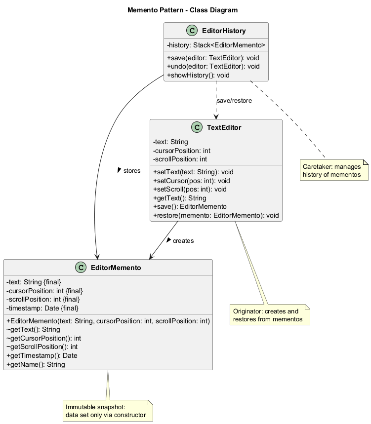

---

## Hatira: Java Sozde Kod

```java
// Memento: stores editor state
class EditorMemento {
    private final String text;
    private final int cursorPosition;
    private final int scrollPosition;
    private final Date timestamp;

    public EditorMemento(String text,
            int cursorPosition,
            int scrollPosition) {
        this.text = text;
        this.cursorPosition = cursorPosition;
        this.scrollPosition = scrollPosition;
        this.timestamp = new Date();
    }

    // Only originator can access these
    String getText() { return text; }
    int getCursorPosition() {
        return cursorPosition;
    }
    int getScrollPosition() {
        return scrollPosition;
    }

    // Public metadata
    public Date getTimestamp() { return timestamp; }
    public String getName() {
        return timestamp + " / "
            + text.substring(0,
                Math.min(10, text.length()))
            + "...";
    }
}
```

---

## Hatira: Java Sozde Kod (devam)

```java
// Originator: the text editor
class TextEditor {
    private String text;
    private int cursorPosition;
    private int scrollPosition;

    public void setText(String text) {
        this.text = text;
    }

    public void setCursor(int pos) {
        this.cursorPosition = pos;
    }

    public void setScroll(int pos) {
        this.scrollPosition = pos;
    }

    public String getText() { return text; }

    // Create snapshot
    public EditorMemento save() {
        return new EditorMemento(
            text, cursorPosition, scrollPosition);
    }

    // Restore from snapshot
    public void restore(EditorMemento memento) {
        this.text = memento.getText();
        this.cursorPosition =
            memento.getCursorPosition();
        this.scrollPosition =
            memento.getScrollPosition();
    }
}
```

---

## Hatira: Java Sozde Kod (devam)

```java
// Caretaker: manages history
class EditorHistory {
    private Stack<EditorMemento> history
        = new Stack<>();

    public void save(TextEditor editor) {
        history.push(editor.save());
    }

    public void undo(TextEditor editor) {
        if (!history.isEmpty()) {
            EditorMemento memento = history.pop();
            editor.restore(memento);
            System.out.println("Restored to: "
                + memento.getName());
        }
    }

    public void showHistory() {
        System.out.println("History ("
            + history.size() + " states):");
        for (EditorMemento m : history) {
            System.out.println(
                "  - " + m.getName());
        }
    }
}
```

---

## Hatira: Java Sozde Kod (devam)

```java
// Client code
public class MementoDemo {
    public static void main(String[] args) {
        TextEditor editor = new TextEditor();
        EditorHistory history = new EditorHistory();

        editor.setText("Hello");
        editor.setCursor(5);
        history.save(editor);

        editor.setText("Hello, World!");
        editor.setCursor(13);
        history.save(editor);

        editor.setText("Hello, World! Bye!");
        editor.setCursor(18);

        System.out.println("Current: "
            + editor.getText());
        history.showHistory();

        // Undo
        history.undo(editor);
        System.out.println("After undo: "
            + editor.getText());

        history.undo(editor);
        System.out.println("After 2nd undo: "
            + editor.getText());
    }
}
```

---

## Hatira: Sira Diyagrami

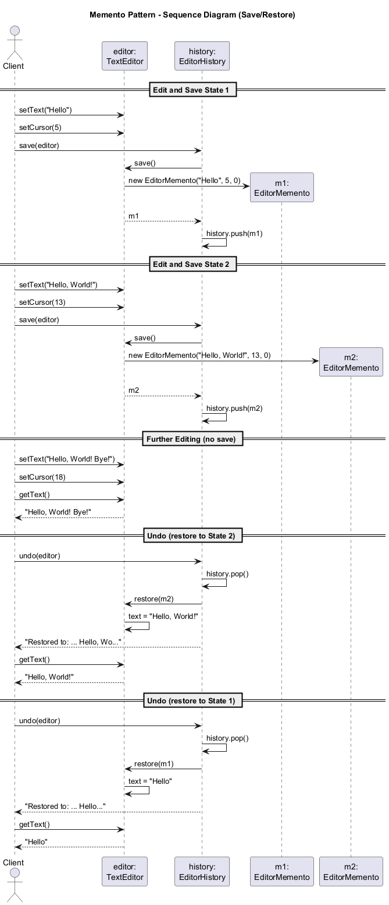

---

## Hatira: Uygulanabilirlik

Hatira desenini su durumlarda kullanin:

- Onceki bir duruma geri yukleyebilmek icin **nesnenin durumunun anlik goruntusunu** uretmek istiyorsunuz.
- Nesnenin alanlarina/getter/setter'larina dogrudan erisim **kapsullemeyi ihlal ediyorsa**. Hatira, nesnenin kendisini durumunun bir anlik goruntusunu olusturmaktan sorumlu kilar.
- **Geri al/yinele**, **islem geri alma** veya **kontrol noktasi** islevselligini uygulamaniz gerekiyor.

---

## Hatira: Nasil Uygulanir

1. Hangi sinifin **kaynak** rolunu oynayacagini belirleyin.
2. **Hatira sinifini** olusturun. Kaynak sinifinin icinde bildirilen alanlari yansitan bir alan kumesini tek tek bildirin.
3. Hatira sinifini **degismez** yapin. Bir hatira verileri yalnizca bir kez, yapilandirici araciligiyla kabul etmelidir. Sinifin setter'i olmamalidir.
4. Diliniz **ic ice siniflari** destekliyorsa, hatirayi kaynagin icine yerlestirin. Desteklemiyorsa, hatira sinifindan bos bir arayuz cikartin ve baskalarinin onu kullanmasini saglayin.
5. Kaynak sinifina hatira uretmek icin bir yontem ekleyin.
6. Kaynak sinifina kaynagin durumunu geri yuklemek icin bir yontem ekleyin.
7. **Bakim gorevlisi** kaynaktan yeni hatiralar ne zaman isteyecegini, onlari nasil depolayacagini ve kaynagin belirli bir hatira ile ne zaman geri yuklenecegini bilmelidir.

---

## Hatira: Avantajlar ve Dezavantajlar

**Avantajlar:**

- Nesnenin durumunun anlik goruntusunu **kapsullemeyi ihlal etmeden** uretebilirsiniz
- Bakim gorevlisinin kaynagin durumunun **gecmisini tutmasina** izin vererek kaynagin kodunu basitlestirebilirsiniz

**Dezavantajlar:**

- Istemciler cok sik hatira olusturursa uygulama **cok fazla RAM** tuketebilir
- **Bakim gorevlileri** eskimis hatiralari yok edebilmek icin kaynagin yasam dongusunu takip etmelidir
- Cogu dinamik programlama dili (PHP, Python, JavaScript) hatiranin icindeki durumun **dokunulmadan kalacagini** garanti edemez

---

## Hatira: Diger Desenlerle Iliskileri

- Geri almayi uygulamak icin **Komut ve Hatira** desenlerini birlikte kullanabilirsiniz. Komutlar hedef nesne uzerinde cesitli islemler gerceklestirmekten sorumludur, hatiralar ise bir komut yurutulmeden hemen once nesnenin durumunu kaydeder.
- Mevcut yineleme durumunu yakalamak ve gerekirse geri almak icin **Yineleyici ile birlikte Hatira** kullanabilirsiniz.
- Bazen **Prototip (Prototype)**, Hatira icin daha basit bir alternatif olabilir. Bu, gecmiste durumunu depolamak istediginiz nesne oldukca basitse ve dis kaynaklara baglantilari yoksa ise yarar.

---

## Modul F: Ozet

**Hatira (Memento)** deseni, bir nesnenin ic durumunu yakalar ve disaridandir, boylece nesne daha sonra o duruma geri yuklenebilir -- tamami kapsullemeyi ihlal etmeden.

---

<!-- _backgroundColor: aqua -->

<!-- _color: orange -->

# Modul G: Gozlemci (Observer) Deseni

---

## Modul G: Icerik

- Amac
- Problem
- Cozum
- Gercek Dunya Analojisi
- Yapi
- Java Sozde Kod Ornegi
- Uygulanabilirlik
- Nasil Uygulanir
- Avantajlar ve Dezavantajlar
- Diger Desenlerle Iliskileri

---

## Gozlemci: Amac

**Gozlemci (Observer)**, gozlemledikleri nesnede meydana gelen herhangi bir olay hakkinda birden fazla nesneyi bilgilendirmek icin bir abonelik mekanizmasi tanimlamamaniza olanak taniyan davranissal bir tasarim desenidir.

Diger adlari: **Olay-Abonesi (Event-Subscriber)**, **Dinleyici (Listener)**

Kaynak: [refactoring.guru](https://refactoring.guru/design-patterns/observer)

---

## Gozlemci: Problem

Iki tur nesneniz oldugunu hayal edin: bir `Musteri` ve bir `Magaza`. Musteri, yakinda magazada satisa sunulmasi gereken belirli bir urun markasityla cok ilgileniyor.

Musteri her gun magazayi ziyaret edip urun mevcudiyetini kontrol edebilir. Ancak urun hala yoldayken, bu gezilerin cogu **anlamsiz** olacaktir.

Ote yandan, magaza her yeni urun mevcut oldugunda tum musterilere tonlarca e-posta gonderebilir. Bu, bazi musterileri sonsuz gezilerden **kurtarir** ancak yeni urunlerle ilgilenmeyen **diger musterileri rahatsiz eder**.

---

## Gozlemci: Cozum

Ilginc bir duruma sahip nesneye genellikle **konu (subject)** (yayinci) denir. Yayincinin durumundaki degisiklikleri takip etmek isteyen diger tum nesnelere **aboneler** denir.

Gozlemci deseni, yayinci sinifina bir **abonelik mekanizmasi** eklemenizi onerir, boylece bireysel nesneler bir olay akisina abone olabilir veya abonelikten cikabilir.

---

## Gozlemci: Cozum (devam)

Gercekte bu mekanizma sunlardan olusur:

1. Abone nesnelerine referanslarin bir listesini depolamak icin bir **dizi alani**
2. Aboneleri bu listeye eklemeye ve listeden cikarmaya olanak taniyan birkac **genel yontem**
3. Aboneler listesini gezen ve onlarin belirli bildirim yontemini cagiran bir **bildirim yontemi**

Artik yayinciya onemli bir olay oldugunda, abonelerini gezer ve nesneleri uzerindeki belirli bildirim yontemini cagirir.

---

## Gozlemci: Cozum (devam)

Tum abonelerin **ayni arayuzu** uygulamasi ve yayincinin onlarla yalnizca bu arayuz araciligiyla iletisim kurmasi cok onemlidir. Bu arayuz, yayincinin bildirimle birlikte bazi baglamsal verileri iletmek icin kullanabilecegi bir parametre kumesiyle birlikte bildirim yontemini bildirmelidir.

Uygulamanizda birden fazla farkli yayinci turu varsa, hepsinin ayni arayuzu izlemesini saglayabilir ve abonelerin tek bir abonelikle tumunu gozlemlemesine olanak taniyabilirsiniz.

---

## Gozlemci: Gercek Dunya Analojisi

Bir gazeteye veya dergiye abone olursaniz, artik bir sonraki sayinin mevcut olup olmadigini kontrol etmek icin magazaya gitmeniz gerekmez. Bunun yerine, **yayinci** yayinlandiktan hemen sonra yeni sayilari dogrudan posta kutunuza gonderir.

Yayinci bir aboneler listesi tutar ve hangi dergilere ilgi duydularini bilir. Aboneler, yayincinin kendilerine yeni dergi sayilari gondermesini durdurmak istediklerinde istedikleri zaman listeden ayrilabilirler.

---

## Gozlemci: Yapi

Yapi asagidaki katilimcilardan olusur:

1. **Yayinci (Publisher/Subject)**: Diger nesneleri ilgilendiren olaylar yayinlar. Bu olaylar yayinci durumunu degistirdiginde veya bazi davranislari yuruttugundu meydana gelir. Yayincilar, yeni abonelerin katilmasina ve mevcut abonelerin ayrilmasina olanak taniyan bir abonelik altyapisi icerir.

2. **Abone Arayuzu (Subscriber Interface)**: Bildirim arayuzunu bildirir. Cogu durumda, tek bir `update` yonteminden olusur. Yontem, yayincinin guncellamayle birlikte bazi olay ayrintilarini iletmesine olanak taniyan birkac parametreye sahip olabilir.

---

## Gozlemci: Yapi (devam)

3. **Somut Aboneler (Concrete Subscribers)**: Yayinci tarafindan verilen bildirimlere yanit olarak bazi eylemler gerceklestirirler. Bu siniflarin tumunun ayni arayuzu uygulamasi gerekir, boylece yayinci somut siniflara baglanmaz.

4. **Istemci (Client)**: Yayinci ve abone nesnelerini ayri ayri olusturur ve ardindan aboneleri yayinci guncellemeleri icin kaydeder.

Genellikle aboneler, guncellemeyi dogru bir sekilde islemek icin bazi baglamsal bilgilere ihtiyac duyarlar. Bu nedenle yayincilar genellikle bildirim yonteminin argumanlari olarak bazi baglam verileri iletirler.

---

## Gozlemci: Yapi Diyagrami

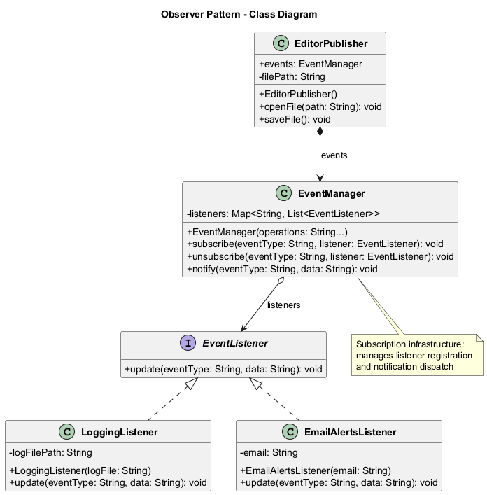

---

## Gozlemci: Java Sozde Kod

```java
// Subscriber interface
interface EventListener {
    void update(String eventType, String data);
}
```

---

## Gozlemci: Java Sozde Kod (devam)

```java
// Event manager (subscription infrastructure)
class EventManager {
    private Map<String, List<EventListener>> listeners
        = new HashMap<>();

    public EventManager(String... operations) {
        for (String op : operations) {
            listeners.put(op, new ArrayList<>());
        }
    }

    public void subscribe(String eventType,
                           EventListener listener) {
        listeners.get(eventType).add(listener);
    }

    public void unsubscribe(String eventType,
                             EventListener listener) {
        listeners.get(eventType).remove(listener);
    }

    public void notify(String eventType,
                       String data) {
        for (EventListener listener :
                listeners.get(eventType)) {
            listener.update(eventType, data);
        }
    }
}
```

---

## Gozlemci: Java Sozde Kod (devam)

```java
// Publisher: Editor
class EditorPublisher {
    public EventManager events;
    private String filePath;

    public EditorPublisher() {
        this.events = new EventManager(
            "open", "save", "close");
    }

    public void openFile(String path) {
        this.filePath = path;
        System.out.println(
            "Editor: opened file " + path);
        events.notify("open", path);
    }

    public void saveFile() {
        System.out.println(
            "Editor: saved file " + filePath);
        events.notify("save", filePath);
    }
}
```

---

## Gozlemci: Java Sozde Kod (devam)

```java
// Concrete subscriber: Logging
class LoggingListener implements EventListener {
    private String logFilePath;

    public LoggingListener(String logFile) {
        this.logFilePath = logFile;
    }

    @Override
    public void update(String eventType,
                       String data) {
        System.out.println("LoggingListener: "
            + "Writing to log " + logFilePath
            + ": Event '" + eventType
            + "' with data '" + data + "'");
    }
}
```

---

## Gozlemci: Java Sozde Kod (devam)

```java
// Concrete subscriber: Email alerts
class EmailAlertsListener
        implements EventListener {
    private String email;

    public EmailAlertsListener(String email) {
        this.email = email;
    }

    @Override
    public void update(String eventType,
                       String data) {
        System.out.println("EmailAlertsListener: "
            + "Sending email to " + email
            + ": Event '" + eventType
            + "' with data '" + data + "'");
    }
}
```

---

## Gozlemci: Java Sozde Kod (devam)

```java
// Client code
public class ObserverDemo {
    public static void main(String[] args) {
        EditorPublisher editor =
            new EditorPublisher();

        LoggingListener logger =
            new LoggingListener(
                "/var/log/app.log");
        EmailAlertsListener emailAlert =
            new EmailAlertsListener(
                "admin@site.com");

        editor.events.subscribe("open", logger);
        editor.events.subscribe("save", emailAlert);
        editor.events.subscribe("save", logger);

        editor.openFile("/home/user/doc.txt");
        editor.saveFile();
    }
}
```

---

## Gozlemci: Java Sozde Kod Ciktisi

```
Editor: opened file /home/user/doc.txt
LoggingListener: Writing to log /var/log/app.log:
    Event 'open' with data '/home/user/doc.txt'
Editor: saved file /home/user/doc.txt
EmailAlertsListener: Sending email to admin@site.com:
    Event 'save' with data '/home/user/doc.txt'
LoggingListener: Writing to log /var/log/app.log:
    Event 'save' with data '/home/user/doc.txt'
```

---

## Gozlemci: Sira Diyagrami

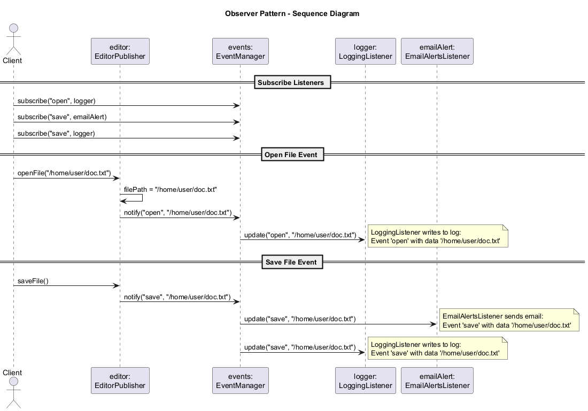

---

## Gozlemci: Uygulanabilirlik

Gozlemci desenini su durumlarda kullanin:

- Bir nesnenin durumundaki degisiklikler **diger nesnelerin** degistirilmesini gerektirebilir ve gercek nesne kumesi **onceden bilinmiyor** veya dinamik olarak degisiyor.
- Uygulamanzdaki bazi nesnelerin digerlerini gozlemlemesi gerekiyor, ancak yalnizca **sinirli bir sure icin** veya **belirli durumlarda**.
- Yayinciyi abonelerinden **ayirmaniz** gerekiyor, boylece bagimsiz olarak gelistirilebilir, test edilebilir ve bakimi yapilabilir.

---

## Gozlemci: Nasil Uygulanir

1. Is mantiginizi gozden gecirin ve iki parcaya ayirmayi deneyin: diger koddan bagimsiz **cekirdek islevsellik** (yayinci) ve geri kalan abone siniflari olarak gorev yapacak **kalan kisim**.
2. **Abone arayuzunu** bildirin. En azindan, tek bir `update` yontemini bildirmelidir.
3. **Yayinci arayuzunu** bildirin ve listeden bir abone nesnesi ekleme ve cikrma icin bir cift yontem tanimlayin.
4. Gercek abonelik listesini ve abonelik yontemlerinin uygulanmasini nereye koyacaginiza karar verin. Genellikle bu kod tum yayincilar icin ayni gorunur, bu nedenle bir **soyut sinif olusturun veya bilesim kullanin**.
5. **Somut yayinci** siniflari olusturun. Yayincinin icinde onemli bir sey her oldugunda, tum abonelerini bilgilendirmelidir.
6. Somut abone siniflarinda **guncelleme bildirim yontemlerini** uygulayin.
7. **Istemci** tum gerekli aboneleri olusturmali ve uygun yayincilara kaydetmelidir.

---

## Gozlemci: Avantajlar ve Dezavantajlar

**Avantajlar:**

- **Acik/Kapali Ilkesi:** Yayincinin kodunu degistirmek zorunda kalmadan yeni abone siniflari ekleyebilirsiniz (ve bir yayinci arayuzu varsa tam tersi de)
- **Calisma zamaninda** nesneler arasinda iliskiler kurabilirsiniz
- Yayincilar somut abone uygulamlarindan **ayrilmistir**

**Dezavantajlar:**

- Aboneler **rastgele sirada** bilgilendirilir (garantili siralama yoktur)
- Duzgun yonetilmezse **bellek sizintilarina** yol acabilir (abonelikten cikmayi unutan aboneler)

---

## Gozlemci: Diger Desenlerle Iliskileri

- **Sorumluluk Zinciri, Komut, Arabulucu ve Gozlemci** desenleri, gonderici ve alicilari baglamanin cesitli yollaridir:
  - **SZ** bir zincir boyunca sirali olarak iletir
  - **Komut** tek yonlu baglantilar kurar
  - **Arabulucu** merkezi bir nesne araciligiyla dogrudan baglantilar ortadan kaldirir
  - **Gozlemci** alicilarin dinamik olarak abone olmasina/abonelikten cikmasina olanak tanir
- **Gozlemci ve Arabulucu:** Arabulucu karsilikli bagimliliklari ortadan kaldirir; Gozlemci dinamik tek yonlu baglantilar olusturur. Arabulucunun yayinci ve bilesenlerin abone olarak gorev yaptigi Gozlemci kullanilarak Arabulucu uygulanabilir.

---

## Modul G: Ozet

**Gozlemci (Observer)** deseni, nesneler arasinda birden-coga bagimlilik tanimlar, boylece bir nesne durumunu degistirdiginde tum bagimlilari bilgilendirilir ve otomatik olarak guncellenir. Olay gudumlu programlamanin temelidir.

---

<!-- _backgroundColor: aqua -->

<!-- _color: orange -->

# Modul H: Durum (State) Deseni

---

## Modul H: Icerik

- Amac
- Problem
- Cozum
- Gercek Dunya Analojisi
- Yapi
- Java Sozde Kod Ornegi
- Uygulanabilirlik
- Nasil Uygulanir
- Avantajlar ve Dezavantajlar
- Diger Desenlerle Iliskileri

---

## Durum: Amac

**Durum (State)**, bir nesnenin ic durumu degistiginde davranisini degistirmesine olanak taniyan davranissal bir tasarim desenidir. Nesne sinifini degistirmis gibi gorunur.

Kaynak: [refactoring.guru](https://refactoring.guru/design-patterns/state)

---

## Durum: Problem

Durum deseni, **Sonlu Durum Makinesi** kavramiyla yakindan iliskilidir.

Ana fikir, herhangi bir anda, bir programin icinde bulunabilecegi **sinirli sayida durum** olduudur. Her benzersiz durumda, program farkli davranir ve program bir durumdan digerine **aninda gecirilebilir**.

Ancak mevcut duruma bagli olarak, program belirli diger durumlara gecebilir veya gecemeyebilir. **Gecisler** olarak adlandirilan bu gecis kurallari da sonlu ve onceden belirlenmistir.

---

## Durum: Problem (devam)

Bir `Belge` sinifini hayal edin. Bir belge uc durumdan birinde olabilir: `Taslak`, `Denetleme` ve `Yayinlanmis`. Belgenin `yayinla` yontemi her durumda biraz farkli calisir:

- **Taslak** durumunda, belgeyi **Denetleme** durumuna tasir
- **Denetleme** durumunda, belgeyi **Yayinlanmis** yapar, ancak yalnizca mevcut kullanici bir yoneticiyse
- **Yayinlanmis** durumunda, **hicbir sey** yapmaz

---

## Durum: Problem (devam)

Kosullara dayali bir durum makinesinin en buyuk zayifligi, daha fazla durum ve duruma bagli davranislar eklemeye basladigimizda kendini gosterir. Cogu yontem, mevcut duruma gore uygun davranisi secen **devasa kosullar** icerecektir.

Boyle bir kod **bakimi cok zordur** cunku gecis mantisindaki herhangi bir degisiklik, her yontemdeki durum kosullarini degistirmeyi gerektirebilir. Proje gelistikce sorun buyume egilimindedir.

---

## Durum: Cozum

Durum deseni, bir nesnenin tum olasi durumlari icin **yeni siniflar olusturmanizi** ve duruma ozgu tum davranislari bu siniflara cikarmanizi onerir.

Tum davranislari kendi basina uygulamak yerine, **baglam (context)** olarak adlandirilan orijinal nesne, mevcut durumunu temsil eden durum nesnelerinden birine bir referans depolar ve **durumla ilgili tum isi** o nesneye devreder.

Baglami baska bir duruma gecirmek icin, aktif durum nesnesini yeni durumu temsil eden baska bir nesneyle degistirin. Bu, yalnizca tum durum siniflari **ayni arayuzu** izlediginde ve baglaim kendisi bu nesnelerle o arayuz araciligiyla calistiginda mumkundur.

---

## Durum: Cozum (devam)

Bu yapi **Strateji** desenine benzer gorunebilir, ancak onemli bir fark vardir:

Durum deseninde, belirli durumlar birbirlerinin **farkinda olabilir** ve bir durumdan digerine gecisleri baslattabilir, oysa stratejiler neredeyse **hicbir zaman** birbirlerini bilmezler.

---

## Durum: Gercek Dunya Analojisi

Akilli telefonunuzdaki dugmeler ve anahtarlar, cihazin mevcut durumuna bagli olarak farkli davranir:

- Telefon **kilit acikken**, dugmelere basmak cesitli islevlerin yurutulmesine yol acar
- Telefon **kilitliyken**, herhangi bir dugmeye basmak kilit acma ekranina yonlendirir
- Telefonun **sarji dusukken**, herhangi bir dugmeye basmak sarj ekranini gosterir

---

## Durum: Yapi

Yapi asagidaki katilimcilardan olusur:

1. **Baglam (Context)**: Somut durum nesnelerinden birine referans depolar ve duruma ozgu tum isi ona devreder. Baglam, durum nesnesiyle durum arayuzu araciligiyla iletisim kurar. Baglam, yeni bir durum nesnesi iletmek icin bir setter sunar.

2. **Durum Arayuzu (State Interface)**: Duruma ozgu yontemleri bildirir. Bu yontemler tum somut durumlar icin anlamli olmalidir cunku bazi durumlarinizin hicbir zaman cagrilmayacak gereksiz yontemere sahip olmasini istemezsiniz.

---

## Durum: Yapi (devam)

3. **Somut Durumlar (Concrete States)**: Duruma ozgu yontemler icin kendi uygulamalarini saglar. Birden fazla durum arasinda benzer kodun tekrarlanmasini onlemek icin ara soyut siniflar saglayabilirsiniz.

4. **Durum Gecisleri (State Transitions)**: Hem baglam hem de somut durum siniflari, baglamin bir sonraki durumunu ayarlayabilir ve baglama bagli durum nesnesini degistirerek gercek durum gecisini gerceklestirebilir.

---

## Durum: Yapi Diyagrami

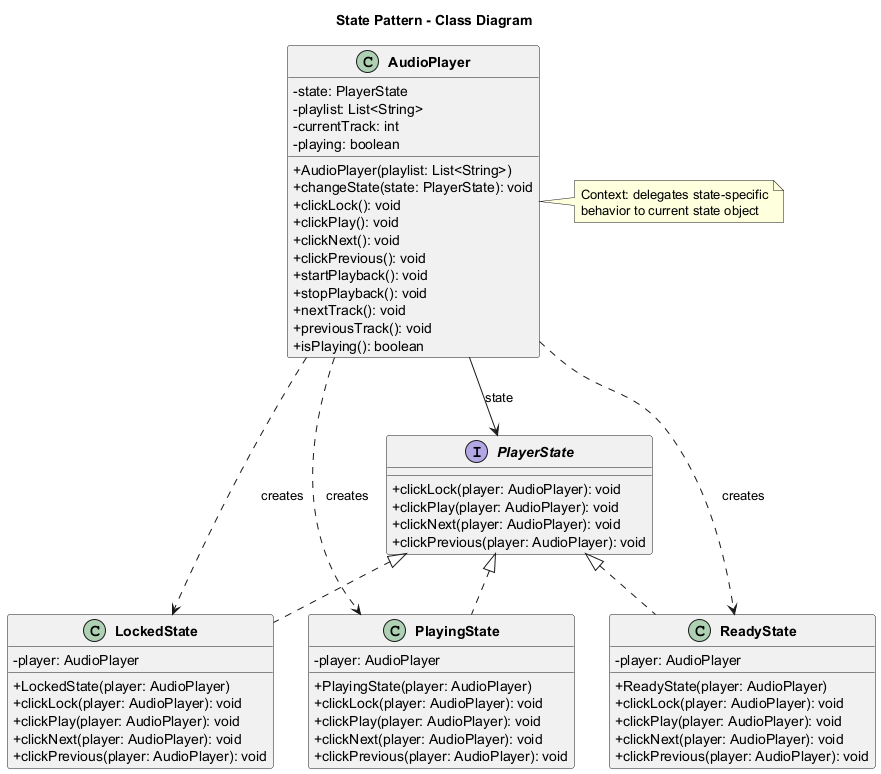

---

## Durum: Java Sozde Kod

```java
// State interface
interface PlayerState {
    void clickLock(AudioPlayer player);
    void clickPlay(AudioPlayer player);
    void clickNext(AudioPlayer player);
    void clickPrevious(AudioPlayer player);
}
```

---

## Durum: Java Sozde Kod (devam)

```java
// Context: Audio Player
class AudioPlayer {
    private PlayerState state;
    private List<String> playlist;
    private int currentTrack = 0;
    private boolean playing = false;

    public AudioPlayer(List<String> playlist) {
        this.playlist = playlist;
        this.state = new ReadyState(this);
    }

    public void changeState(PlayerState state) {
        this.state = state;
    }

    // Delegate to state
    public void clickLock() {
        state.clickLock(this);
    }
    public void clickPlay() {
        state.clickPlay(this);
    }
    public void clickNext() {
        state.clickNext(this);
    }
    public void clickPrevious() {
        state.clickPrevious(this);
    }

    // Player methods
    public void startPlayback() {
        playing = true;
        System.out.println("Playing: "
            + playlist.get(currentTrack));
    }

    public void stopPlayback() {
        playing = false;
        System.out.println("Playback stopped.");
    }

    public void nextTrack() {
        currentTrack = (currentTrack + 1)
            % playlist.size();
        System.out.println("Next: "
            + playlist.get(currentTrack));
    }

    public void previousTrack() {
        currentTrack = (currentTrack - 1
            + playlist.size()) % playlist.size();
        System.out.println("Previous: "
            + playlist.get(currentTrack));
    }

    public boolean isPlaying() {
        return playing;
    }
}
```

---

## Durum: Java Sozde Kod (devam)

```java
// Concrete State: Locked
class LockedState implements PlayerState {
    private AudioPlayer player;

    public LockedState(AudioPlayer player) {
        this.player = player;
    }

    @Override
    public void clickLock(AudioPlayer player) {
        if (player.isPlaying()) {
            player.changeState(
                new PlayingState(player));
        } else {
            player.changeState(
                new ReadyState(player));
        }
        System.out.println("Player unlocked.");
    }

    @Override
    public void clickPlay(AudioPlayer player) {
        System.out.println("Player is locked.");
    }

    @Override
    public void clickNext(AudioPlayer player) {
        System.out.println("Player is locked.");
    }

    @Override
    public void clickPrevious(
            AudioPlayer player) {
        System.out.println("Player is locked.");
    }
}
```

---

## Durum: Java Sozde Kod (devam)

```java
// Concrete State: Ready
class ReadyState implements PlayerState {
    private AudioPlayer player;

    public ReadyState(AudioPlayer player) {
        this.player = player;
    }

    @Override
    public void clickLock(AudioPlayer player) {
        player.changeState(
            new LockedState(player));
        System.out.println("Player locked.");
    }

    @Override
    public void clickPlay(AudioPlayer player) {
        player.startPlayback();
        player.changeState(
            new PlayingState(player));
    }

    @Override
    public void clickNext(AudioPlayer player) {
        player.nextTrack();
    }

    @Override
    public void clickPrevious(
            AudioPlayer player) {
        player.previousTrack();
    }
}
```

---

## Durum: Java Sozde Kod (devam)

```java
// Concrete State: Playing
class PlayingState implements PlayerState {
    private AudioPlayer player;

    public PlayingState(AudioPlayer player) {
        this.player = player;
    }

    @Override
    public void clickLock(AudioPlayer player) {
        player.changeState(
            new LockedState(player));
        System.out.println("Player locked.");
    }

    @Override
    public void clickPlay(AudioPlayer player) {
        player.stopPlayback();
        player.changeState(
            new ReadyState(player));
    }

    @Override
    public void clickNext(AudioPlayer player) {
        player.nextTrack();
    }

    @Override
    public void clickPrevious(
            AudioPlayer player) {
        player.previousTrack();
    }
}
```

---

## Durum: Java Sozde Kod (devam)

```java
// Client code
public class StateDemo {
    public static void main(String[] args) {
        AudioPlayer player = new AudioPlayer(
            Arrays.asList(
                "Track 1", "Track 2", "Track 3"));

        // Ready state -> play
        player.clickPlay();
        // Playing state -> next
        player.clickNext();
        // Playing state -> lock
        player.clickLock();
        // Locked state -> try play
        player.clickPlay();
        // Locked state -> unlock
        player.clickLock();
    }
}
```

**Cikti:**

```
Playing: Track 1
Next: Track 2
Player locked.
Player is locked.
Player unlocked.
```

---

## Durum: Sira Diyagrami

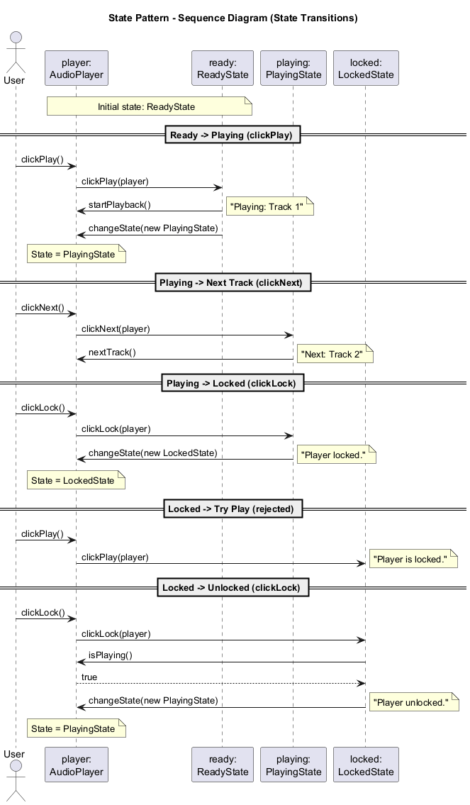

---

## Durum: Uygulanabilirlik

Durum desenini su durumlarda kullanin:

- Mevcut durumuna bagli olarak farkli davranan bir nesneniz var, **durum sayisi cok fazla** ve duruma ozgu kod sik degisiyor.

- Sinifin **mevcut alan degerlerine** gore nasil davrandigini degistiren buyuk kosullarla kirletilmis bir sinfifiniz var.

- Kosul tabanli bir durum makinesinin benzer durumlari ve gecisleri boyunca cok fazla **tekrar eden kodunuz** var.

---

## Durum: Nasil Uygulanir

1. Hangi sinifin **baglam** olarak gorev yapacagina karar verin. Duruma bagli koda sahip mevcut bir sinif veya yeni bir sinif olabilir.
2. **Durum arayuzunu** bildirin. Baglamda bildirilen tum yontemleri yansitsa da, yalnizca duruma ozgu davranis icerebilecek olanlari hedefleyin.
3. Her gercek durum icin durum arayuzunden turetilen bir sinif olusturun. Baglamdaki yontemleri gozden gecirin ve **o durumla ilgili tum kodu** yeni olusturulan sinifa cikartin.
4. Baglam sinifinda, **durum arayuzu** turunde bir referans alani ve o alanin degerini gecersiz kilmaniza olanak taniyan bir genel setter ekleyin.
5. Baglamdaki yontemi tekrar gozden gecirin ve **bos durum kosullarini** durum nesnesinin karsilik gelen yontemlerine yapilan cagrilarla degistirin.
6. Baglamin durumunu degistirmek icin durum siniflarindan birinin bir orengini olusturun ve **baglama iletin**.

---

## Durum: Avantajlar ve Dezavantajlar

**Avantajlar:**

- **Tek Sorumluluk Ilkesi:** Belirli durumlarla ilgili kodu ayri siniflarda duzenleyin
- **Acik/Kapali Ilkesi:** Mevcut durum siniflarini veya baglami degistirmeden yeni durumlar ekleyin
- **Hacimli durum makinesi kosullarini ortadan kaldirarak** baglamin kodunu basitlestirin

**Dezavantajlar:**

- Bir durum makinesinin yalnizca birkac durumu varsa veya nadiren degisiyorsa deseni uygulamak **asiri** olabilir

---

## Durum: Diger Desenlerle Iliskileri

- **Kopru (Bridge), Durum, Strateji (ve bir olcude Adaptator)** desenleri cok benzer yapilara sahiptir. Tumuu bilesime dayanir. Ancak hepsi farkli sorunlari cozer.
- **Durum ve Strateji:** Durum, Stratejinin bir uzantisi olarak dusunulebilir. Her iki desen de bilesime dayanir. Ancak Durumda, somut durumlar birbirlerinin **farkinda olabilir** ve gecisleri baslatabilir, oysa stratejiler **tamamen bagimsizdir**.
- **Durum ve Sonlu Durum Makinesi:** Durum, bir sinif icinde sonlu durum makineleri uygulayan buyuk switch/case ifadelerinin veya if/else zincirlerinin bir alternatifidir.

---

## Modul H: Ozet

**Durum (State)** deseni, bir nesnenin ic durumu degistiginde davranisini degistirmesine olanak tanir, sanki nesne sinifini degistirmis gibi. Karmasik kosullu mantigi polimorfik durum nesneleriyle degistirir.

---

<!-- _backgroundColor: aqua -->

<!-- _color: orange -->

# Modul I: Strateji (Strategy) Deseni

---

## Modul I: Icerik

- Amac
- Problem
- Cozum
- Gercek Dunya Analojisi
- Yapi
- Java Sozde Kod Ornegi
- Uygulanabilirlik
- Nasil Uygulanir
- Avantajlar ve Dezavantajlar
- Diger Desenlerle Iliskileri

---

## Strateji: Amac

**Strateji (Strategy)**, bir algoritma ailesi tanimlamamaniza, her birini ayri bir sinifa koymaniza ve nesnelerini degistirilebilir hale getirmenize olanak taniyan davranissal bir tasarim desenidir.

Kaynak: [refactoring.guru](https://refactoring.guru/design-patterns/strategy)

---

## Strateji: Problem

Bir gun sıradan gezginler icin bir navigasyon uygulamasi olusturmaya karar verdiniz. Uygulama, kullanicilarin herhangi bir sehirde hizla yonlerini bulmalirina yardimci olan guzel bir harita etrafinda merkezlenmisti.

Uygulama icin en cok talep edilen ozelliklerden biri otomatik **rota planlama** idi. Bir kullanici bir adres girebilmeli ve haritada o hedefe giden en hizli rotayi gorebilmelidir.

---

## Strateji: Problem (devam)

Uygulamanin ilk surumu yalnizca **karayollari** uzerinden arac yolculugu icin rotalar olusturabiliyordu. Sonra **yuruyus** rotalari eklediniz. Ardindan **toplu tasima** rotasi. Ve burada durmadi -- daha sonra **bisikletciler** icin rotalar eklemeyi planladiniz.

Is perspektifinden uygulama bir basariydi. Ancak teknik kisim cok fazla bas agrisi yaratti. Her yeni rota algoritmasi eklediginizde, navigatorun ana sinifi **iki katina cikti**. Bir algoritmadaki herhangi bir degisiklik tum sinifi etkileyerek, zaten calisan kodda bir hata olusturma sansini artirdi.

---

## Strateji: Cozum

Strateji deseni, belirli bir seyi bircok farkli sekilde yapan bir sinifi alip **tum bu algoritmalari strateji adli ayri siniflara cikarmanizi** onerir.

**Baglam (context)** olarak adlandirilan orijinal sinif, stratejilerden birine referans depolamak icin bir alana sahip olmalidir. Baglam, isi kendi basina yurutmek yerine bagli strateji nesnesine devreder.

Baglam uygun bir algoritma secmekten sorumlu degildir. Bunun yerine **istemci** istenen stratejiyi baglama iletir.

---

## Strateji: Cozum (devam)

Aslinda, baglam stratejiler hakkinda fazla bir sey bilmez. Tum stratejilerle ayni genel **arayuz** araciligiyla calisir ve yalnizca secilen stratejinin icinde kapsullenen algoritmayi tetiklemek icin tek bir yontem sunar.

Bu sekilde baglam somut stratejilerden bagimsiz hale gelir, boylece baglaamin veya diger stratejilerin kodunu **degistirmeden** yeni algoritmalar ekleyebilir veya mevcut olanlari degistirebilirsiniz.

---

## Strateji: Gercek Dunya Analojisi

Havalimalina gitmeniz gerektigini hayal edin. Bir **otobus** yakalayabilir, bir **taksi** cagirabailir veya **bisikletinize** binebilirsiniz. Bunlar ulasim stratejilerinizdir.

Butce, zaman kisitlamalari veya kisisel tercih gibi faktorlere bagli olarak stratejilerden birini secebilirsiniz. Her strateji sizi ayni hedefe ancak farkli bir sekilde ulastirir.

---

## Strateji: Yapi

Yapi asagidaki katilimcilardan olusur:

1. **Baglam (Context)**: Somut stratejilerden birine referans tutar ve bu nesneyle yalnizca strateji arayuzu araciligiyla iletisim kurar.

2. **Strateji Arayuzu (Strategy Interface)**: Tum somut stratejilere ortaktir. Baglaamin bir strateji yurutmek icin kullandigi bir yontem bildirir.

3. **Somut Stratejiler (Concrete Strategies)**: Baglaamin kullandigi bir algoritmanin farkli varyasyonlarini uygular.

---

## Strateji: Yapi (devam)

4. **Yurutme Akisi**: Baglam, algoritmasi calistirmasi gerektiginde bagli strateji nesnesi uzerindeki yurutme yontemini cagirir. Baglam hangi tur stratejiyle calistigini veya algoritmanin nasil yurutuldigunu bilmez.

5. **Istemci (Client)**: Belirli bir strateji nesnesi olusturur ve baglama iletir. Baglam, istemcilerin calisma zamaninda baglamla iliskili stratejiyi degistirmesine olanak taniyan bir setter sunar.

---

## Strateji: Yapi Diyagrami

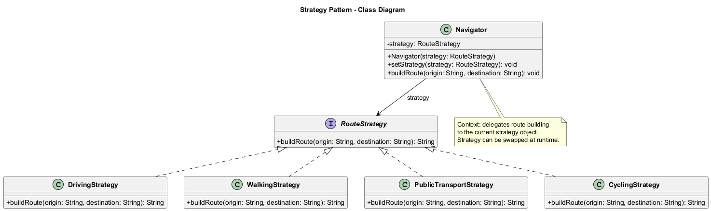

---

## Strateji: Java Sozde Kod

```java
// Strategy interface
interface RouteStrategy {
    String buildRoute(String origin,
                      String destination);
}
```

---

## Strateji: Java Sozde Kod (devam)

```java
// Concrete Strategy: Driving
class DrivingStrategy implements RouteStrategy {
    @Override
    public String buildRoute(String origin,
                             String destination) {
        return "Driving route from " + origin
            + " to " + destination
            + ": Take highway, 25 min, 15 km";
    }
}

// Concrete Strategy: Walking
class WalkingStrategy implements RouteStrategy {
    @Override
    public String buildRoute(String origin,
                             String destination) {
        return "Walking route from " + origin
            + " to " + destination
            + ": Through park, 45 min, 3 km";
    }
}

// Concrete Strategy: Public Transport
class PublicTransportStrategy
        implements RouteStrategy {
    @Override
    public String buildRoute(String origin,
                             String destination) {
        return "Transit route from " + origin
            + " to " + destination
            + ": Bus 42 then Metro, 35 min";
    }
}
```

---

## Strateji: Java Sozde Kod (devam)

```java
// Concrete Strategy: Cycling
class CyclingStrategy implements RouteStrategy {
    @Override
    public String buildRoute(String origin,
                             String destination) {
        return "Cycling route from " + origin
            + " to " + destination
            + ": Bike lane, 20 min, 8 km";
    }
}
```

---

## Strateji: Java Sozde Kod (devam)

```java
// Context: Navigator
class Navigator {
    private RouteStrategy strategy;

    public Navigator(RouteStrategy strategy) {
        this.strategy = strategy;
    }

    public void setStrategy(
            RouteStrategy strategy) {
        this.strategy = strategy;
    }

    public void buildRoute(String origin,
                           String destination) {
        String route = strategy.buildRoute(
            origin, destination);
        System.out.println(route);
    }
}
```

---

## Strateji: Java Sozde Kod (devam)

```java
// Client code
public class StrategyDemo {
    public static void main(String[] args) {
        Navigator navigator;

        // Use driving strategy
        navigator = new Navigator(
            new DrivingStrategy());
        navigator.buildRoute("Home", "Airport");

        // Switch to walking strategy
        navigator.setStrategy(
            new WalkingStrategy());
        navigator.buildRoute("Home", "Park");

        // Switch to public transport
        navigator.setStrategy(
            new PublicTransportStrategy());
        navigator.buildRoute("Home", "Office");

        // Switch to cycling
        navigator.setStrategy(
            new CyclingStrategy());
        navigator.buildRoute("Home", "Gym");
    }
}
```

**Cikti:**

```
Driving route from Home to Airport: ...
Walking route from Home to Park: ...
Transit route from Home to Office: ...
Cycling route from Home to Gym: ...
```

---

## Strateji: Sira Diyagrami

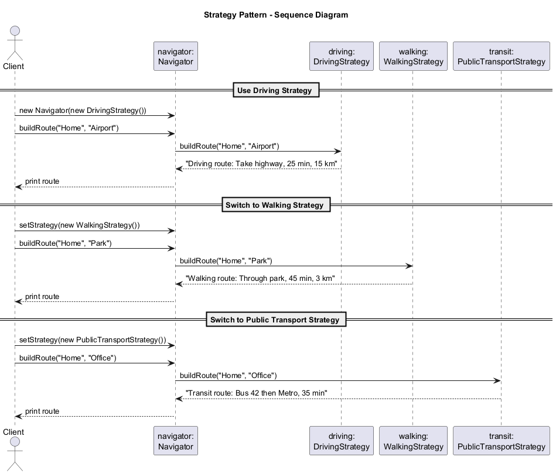

---

## Strateji: Uygulanabilirlik

Strateji desenini su durumlarda kullanin:

- Bir nesne icinde **bir algoritmanin farkli varyantlarini** kullanmak ve calisma zamaninda bir algoritmadan digerine gecis yapmak istiyorsunuz.
- Yalnizca bazi **davranislari yurutme sekilleri** bakimindan farklilik gosteren cok sayida benzer siniffiniz var.
- Bir sinifin **is mantisini**, o mantigin baglaminda o kadar onemli olmayan algoritmalarin uygulama ayrintilarindan **ayirmak** istiyorsunuz.
- Siniffinizin ayni algoritmanin farkli varyantlari arasinda gecis yapan devasa bir **kosul operatoru** var.

---

## Strateji: Nasil Uygulanir

1. Baglam sinifinda, sik degisikliklere yatkin bir **algoritmayi** belirleyin. Ayni zamanda calisma zamaninda ayni algoritmanin bir varyantini secip yurutuken devasa bir kosul da olabilir.
2. Algoritmanin tum varyantlarina ortak **strateji arayuzunu** bildirin.
3. Tum algoritmalari tek tek kendi siniflatina cikarin. Hepsi **strateji arayuzunu** uygulamalidir.
4. Baglam sinifinda, bir strateji nesnesine referans depolamak icin bir **alan** ekleyin. O alanin degerlerini degistirmek icin bir setter saglayin. Baglam, strateji nesnesiyle yalnizca strateji arayuzu araciligiyla calismaalidir.
5. Baglaamin **istemcileri**, baglaamin birincil isini gerceklestirmesini bekledikleri sekilde eslesenn uygun bir stratejiyle iliskilendirmelidir.

---

## Strateji: Avantajlar ve Dezavantajlar

**Avantajlar:**

- Bir nesne icinde kullanilan **algoritmalari** calisma zamaninda degistirebilirsiniz
- Bir algoritmanin **uygulama ayrintilarini** onu kullanan koddan ayirabilirsiniz
- **Kalitimi bilesimle degistirebilirsiniz**
- **Acik/Kapali Ilkesi:** Baglami degistirmek zorunda kalmadan yeni stratejiler ekleyebilirsiniz

**Dezavantajlar:**

- Yalnizca **bir cift algorittmaniz** varsa ve nadiren degisiyorsa, programi fazla karmasiklastirmanin gercek bir nedeni yoktur
- **Istemciler** uygun olanini secebilmek icin stratejiler arasindaki farklarin farkinda olmalidir
- Bircok modern programlama dili, bir algoritmanin farkli versiyonlarini bir dizi **anonim fonksiyon** icinde uygulamaniza olanak taniyan fonksiyonel tur destegine sahiptir, bu da deseni bir olcude gereksiz kilar

---

## Strateji: Diger Desenlerle Iliskileri

- **Kopru (Bridge), Durum, Strateji (ve bir olcude Adaptator)** desenleri bilesime dayali cok benzer yapilara sahiptir, ancak farkli sorunlari cozerler.
- **Komut ve Strateji:** Her ikisi de nesneleri parametrelendrir. Komut herhangi bir islemi bir nesneye donusturur (ertelenmmis yurutme, kuyruga alma, islem gecmisi icin). Strateji ayni seyi yapmanin farkli yollarini tanimlar ve tek bir baglam sinifi icinde algoritmalari degistirmenize olanak tanir.
- **Dekorator ve Strateji:** Dekorator bir nesnenin disini degistirmenize olanak tanir (dis gorunus). Strateji icini degistirmenize olanak tanir (ic davranis).
- **Sablon Yontem ve Strateji:** Sablon Yontem sinif duzeyinde kalitima dayanir (statik). Strateji nesne duzeyinde bilesime dayanir (dinamik, calisma zamani gecisi).
- **Durum ve Strateji:** Durum, Stratejinin bir uzantisi olarak dusunulebilir. Durumda, somut durumlar birbirlerinin farkinda olabilir. Stratejide, uygulamalar tamamen bagimsizdir.

---

## Modul I: Ozet

**Strateji (Strategy)** deseni, bir algoritma ailesi tanimlar, her birini kapsulller ve degistirilebilir hale getirir. Algoritmanin onu kullanan istemcilerden bagimsiz olarak degismesine olanak tanir ve kalitim yerine bilesimi tesvik eder.

---

<!-- _backgroundColor: aqua -->

<!-- _color: orange -->

# Modul J: Sablon Yontem (Template Method) Deseni

---

## Modul J: Icerik

- Amac
- Problem
- Cozum
- Gercek Dunya Analojisi
- Yapi
- Java Sozde Kod Ornegi
- Uygulanabilirlik
- Nasil Uygulanir
- Avantajlar ve Dezavantajlar
- Diger Desenlerle Iliskileri

---

## Sablon Yontem: Amac

**Sablon Yontem (Template Method)**, ust sinifta bir algoritmanin iskeletini tanimlayan ancak alt siniflarin algoritmanin yapisini degistirmeden belirli adimlarini gecersiz kilmasina olanak taniyan davranissal bir tasarim desenidir.

Kaynak: [refactoring.guru](https://refactoring.guru/design-patterns/template-method)

---

## Sablon Yontem: Problem

Kurumsal belgeleri analiz eden bir veri madenciligi uygulamasi olusturdugununuzu hayal edin. Kullanicilar uygulamaya cesitli formatlarda (PDF, DOC, CSV) belgeler besler ve uygulama bu belgelerden tek tip bir formatta anlamli veriler cikarmaya calisir.

Uygulamanin ilk surumu yalnizca DOC dosyalariyla calisabiliyordu. Sonraki surumde CSV dosyalarini destekleyebildi. Bir ay sonra PDF dosyalarindan veri cikarmayi "ogrettiniz".

---

## Sablon Yontem: Problem (devam)

Bir noktada, her uc sinifin da **cok sayida benzer koda** sahip oldugunu fark ettiniz. Cesitli veri formatlariyla ilgilenme kodu tum siniflarda tamamen farkliyken, veri isleme ve analiz kodu neredeyse ayniydi.

Algoritma yapisini bozmadan kod tekrarindan kurtulmak guzel olurdu. Ayrica bu siniflari kullanan **istemci koduyla** ilgili baska bir sorun daha vardi. Isleme nesnesinin sinifina bagli olarak uygun bir eylem plani secen cok sayida kosul iceriyordu.

---

## Sablon Yontem: Cozum

Sablon Yontem deseni, bir algoritmayi bir dizi adima ayirmanizi, bu adimlari yontemlere donusturmenizi ve bu yontemlere yapilan bir dizi cagiyi tek bir **sablon yontemi** icine koymanizi onerir.

Adimlar ya `abstract` olabilir (her alt sinif kendi uygulamasini saglamalidir) ya da bir **varsayilan uygulamaya** sahip olabilir.

---

## Sablon Yontem: Cozum (devam)

Algoritmayil kullanmak icin istemcinin kendi alt sinifini saglamasi, tum soyut adimlari uygulamasi ve gerekirse istege bagli olanlarin bazilarin gecersiz kilmasi (ancak sablon yonteminin kendisini degil) beklenir.

**Kancalar (hooks)** adinda baska bir adim turu daha vardir. Bir kanca, bos bir govdeye sahip istege bagli bir adimdir. Bir sablon yontemi, bir kanca gecersiz kilinmasa bile calisir. Genellikle kancalar, algoritmalarin kritik adimlarindan once ve sonra yerlestirilir ve alt siniflara ek genisletme noktalari saglar.

---

## Sablon Yontem: Gercek Dunya Analojisi

Sablon yontemi yaklasimi **toplu konut insaatinda** kullanilabilir. Standart bir ev insa etmek icin mimari plan, potansiyel ev sahibinin ortaya cikan evin bazi ayrintilarin ayarlamasina olanak taniyan birkac genisletme noktasi icerebilir.

Temel atma, iskelet olusturma, duvar insa etme, sihhi tesisat ve elektrik tesisati kurma gibi her insaat adimi, ortaya cikan evi digerlerinden biraz farkli kilmak icin hafifce degistirilebilir. Ancak genel yapi ve insaat sirasi ayni kalir.

---

## Sablon Yontem: Yapi

Yapi asagidaki katilimcilardan olusur:

1. **Soyut Sinif (Abstract Class)**: Bir algoritmanin adimlari olarak gorev yapan yontemleri ve bu yontemleri belirli bir sirada cagiran gercek sablon yontemini bildirir. Adimlar ya `abstract` olarak bildirilebilir ya da bir varsayilan uygulamaya sahip olabilir.

2. **Somut Siniflar (Concrete Classes)**: Tum adimlari gecersiz kilabilir, ancak **sablon yonteminin kendisini degil**. Somut siniflar soyut adimlar icin uygulamalar saglar ve istege bagli olarak varsayilan uygulamalari olan bazi adimlari gecersiz kilabilir.

---

## Sablon Yontem: Yapi (devam)

Adim turleri:

- **Soyut adimlar** (her alt sinif tarafindan uygulanmalidir)
- **Istege bagli adimlar** (varsayilan uygulamaya sahiptir ancak gecersiz kilinabilir)
- **Kancalar** (bos govdeye sahip istege bagli adimlar, kritik algoritma adimlarindan once/sonra yerlestirilir)

---

## Sablon Yontem: Yapi Diyagrami

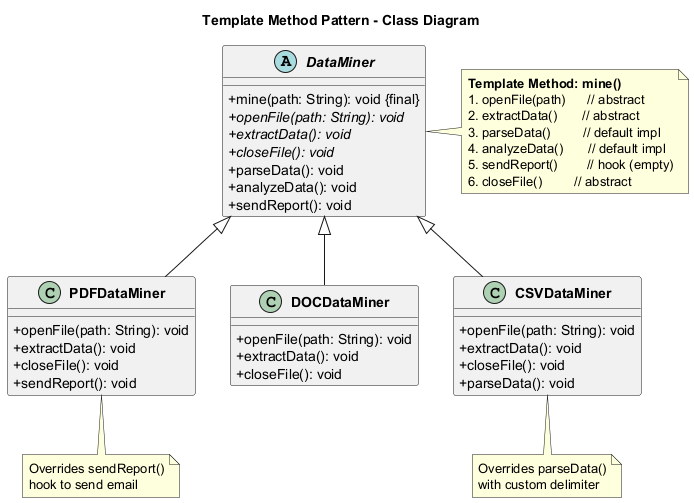

---

## Sablon Yontem: Java Sozde Kod

```java
// Abstract class with template method
abstract class DataMiner {

    // Template method - defines algorithm skeleton
    // This method should NOT be overridden!
    public final void mine(String path) {
        openFile(path);
        extractData();
        parseData();
        analyzeData();
        sendReport();
        closeFile();
    }

    // Abstract steps - must be implemented
    abstract void openFile(String path);
    abstract void extractData();
    abstract void closeFile();

    // Default implementation steps
    void parseData() {
        System.out.println("Parsing raw data"
            + " into structured format...");
    }

    void analyzeData() {
        System.out.println("Analyzing data"
            + " for patterns...");
    }

    // Hook - optional step with
    // default (empty) body
    void sendReport() {
        // Subclasses may override this
    }
}
```

---

## Sablon Yontem: Java Sozde Kod (devam)

```java
// Concrete class: PDF Data Miner
class PDFDataMiner extends DataMiner {
    @Override
    void openFile(String path) {
        System.out.println(
            "Opening PDF file: " + path);
    }

    @Override
    void extractData() {
        System.out.println("Extracting data"
            + " from PDF using PDF parser...");
    }

    @Override
    void closeFile() {
        System.out.println("Closing PDF file.");
    }

    @Override
    void sendReport() {
        System.out.println("Sending PDF"
            + " mining report via email...");
    }
}
```

---

## Sablon Yontem: Java Sozde Kod (devam)

```java
// Concrete class: DOC Data Miner
class DOCDataMiner extends DataMiner {
    @Override
    void openFile(String path) {
        System.out.println(
            "Opening DOC file: " + path);
    }

    @Override
    void extractData() {
        System.out.println("Extracting data"
            + " from DOC using Word API...");
    }

    @Override
    void closeFile() {
        System.out.println("Closing DOC file.");
    }
}
```

---

## Sablon Yontem: Java Sozde Kod (devam)

```java
// Concrete class: CSV Data Miner
class CSVDataMiner extends DataMiner {
    @Override
    void openFile(String path) {
        System.out.println(
            "Opening CSV file: " + path);
    }

    @Override
    void extractData() {
        System.out.println("Extracting data"
            + " from CSV line by line...");
    }

    @Override
    void closeFile() {
        System.out.println("Closing CSV file.");
    }

    @Override
    void parseData() {
        System.out.println("Parsing CSV data"
            + " with custom delimiter"
            + " handler...");
    }
}
```

---

## Sablon Yontem: Java Sozde Kod (devam)

```java
// Game AI example
abstract class GameAI {
    // Template method
    public final void turn() {
        collectResources();
        buildStructures();
        buildUnits();
        attack();
    }

    // Default implementation
    void collectResources() {
        System.out.println(
            "Collecting resources"
            + " from controlled buildings...");
    }

    abstract void buildStructures();
    abstract void buildUnits();

    void attack() {
        System.out.println(
            "Sending all units"
            + " to the closest enemy...");
    }
}
```

---

## Sablon Yontem: Java Sozde Kod (devam)

```java
class OrcsAI extends GameAI {
    @Override
    void buildStructures() {
        System.out.println("Building: Barracks,"
            + " War Camp, Stronghold");
    }

    @Override
    void buildUnits() {
        System.out.println("Training: Grunts,"
            + " Raiders, Wyverns");
    }

    @Override
    void attack() {
        System.out.println("Orcs: Charging with"
            + " berserker rage!");
    }
}

class MonstersAI extends GameAI {
    @Override
    void buildStructures() {
        // Monsters don't build
    }

    @Override
    void buildUnits() {
        // Monsters don't train units
    }

    @Override
    void collectResources() {
        // Monsters don't collect resources
    }

    @Override
    void attack() {
        System.out.println("Monsters: Swarming"
            + " the nearest village!");
    }
}
```

---

## Sablon Yontem: Java Sozde Kod (devam)

```java
// Client code
public class TemplateMethodDemo {
    public static void main(String[] args) {
        System.out.println("=== PDF Mining ===");
        DataMiner pdfMiner = new PDFDataMiner();
        pdfMiner.mine("/data/report.pdf");

        System.out.println(
            "\n=== DOC Mining ===");
        DataMiner docMiner = new DOCDataMiner();
        docMiner.mine("/data/report.doc");

        System.out.println(
            "\n=== CSV Mining ===");
        DataMiner csvMiner = new CSVDataMiner();
        csvMiner.mine("/data/report.csv");

        System.out.println(
            "\n=== Game AI ===");
        GameAI orc = new OrcsAI();
        orc.turn();

        GameAI monster = new MonstersAI();
        monster.turn();
    }
}
```

---

## Sablon Yontem: Sira Diyagrami

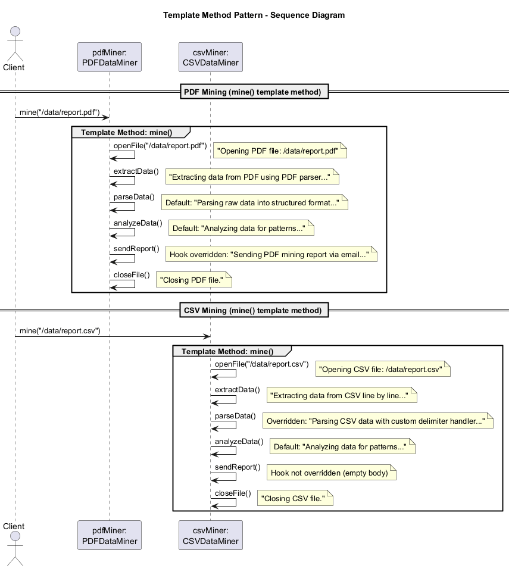

---

## Sablon Yontem: Uygulanabilirlik

Sablon Yontem desenini su durumlarda kullanin:

- Istemcilerin yalnizca bir algoritmanin **belirli adimlarini** genisletmesine izin vermek istiyorsunuz, tum algoritmayi veya yapisini degil.
- **Neredeyse ayni algoritmalara** sahip birkac sinififiniz var ve yalnizca kucuk farkliliklar gosteriyor. Algoritma degistiginde tum siniflari degistirmeniz gerekebilir.
- Ortak davranisi bir ust sinifa cekerek **kod tekrarini ortadan kaldirmak** istiyorsunuz.

---

## Sablon Yontem: Nasil Uygulanir

1. Hedef algoritmayi adimlara ayirip ayiramayacaginizi gormek icin **analiz edin**. Hangi adimlarin tum alt siniflar icin ortak oldugunu ve hangilerinin her zaman benzersiz olacagini dusunun.
2. **Soyut temel sinif** olusturun ve sablon yontemini ve algoritmanin adimlarini temsil eden bir dizi soyut yontem bildirin. Karsilik gelen adimlari yuruterek sablon yonteminde algoritmanin yapisini ana hatlariyla belirtin. Alt siniflarin onu gecersiz kilmasini onlemek icin sablon yontemini `final` yapmay dusunun.
3. Tum adimlarin soyut olmasi sorun degildir. Ancak bazi adimlar bir **varsayilan uygulamaya** sahip olmaktan fayda gorebilir. Alt siniflar bu yontemleri uygulamak zorunda degildir.
4. Algoritmanin kritik adimlari arasina **kancalar** eklemeyi dusunun.
5. Algoritmanin her varyasyonu icin yeni bir **somut alt sinif** olusturun. Tum soyut adimlari uygulamalidir, ancak istege bagli olanlarin bazilarin da gecersiz kilabilir.

---

## Sablon Yontem: Avantajlar ve Dezavantajlar

**Avantajlar:**

- Istemcilerin buyuk bir algoritmanin yalnizca **belirli kisimlarini gecersiz kilmasina** izin vererek, diger kisimlarda meydana gelen degisikliklerden daha az etkilenmelerini saglayabilirsiniz
- **Tekrar eden kodu** bir ust sinifa cekebilirsiniz

**Dezavantajlar:**

- Bazi istemciler bir algoritmanin **saglanan iskeleti** tarafindan sinirlanabilir
- Bir alt sinif araciligiyla varsayilan adim uygulamasini bastirar **Liskov Ikame Ilkesini** ihlal edebilirsiniz
- Sablon yontemleri ne kadar fazla adima sahip olursa **bakimi o kadar zorlasma** egilimindedir

---

## Sablon Yontem: Diger Desenlerle Iliskileri

- **Fabrika Yontemi (Factory Method)** Sablon Yontemin bir uzmanlasmasidir. Ayni zamanda, bir Fabrika Yontemi buyuk bir Sablon Yontem icinde bir adim olarak gorev yapabilir.
- **Sablon Yontem ve Strateji:** Sablon Yontem **kalitima** dayanir: alt siniflarda bu parcalari genisleterek bir algoritmanin parcalarini degistirmenize olanak tanir. Strateji **bilesime** dayanir: nesneye farkli stratejiler saglayarak nesnenin davranisinin parcalarini degistirebilirsiniz. Sablon Yontem sinif duzeyinde calisir, bu nedenle statiktir. Strateji nesne duzeyinde calisir ve calisma zamaninda davranislari degistirmenize olanak tanir.

---

## Modul J: Ozet

**Sablon Yontem (Template Method)** deseni, bir islemdeki algoritmanin iskeletini tanimlar ve bazi adimlari alt siniflara erteler. Alt siniflarin algoritmanin yapisini degistirmeden algoritmanin belirli adimlarini yeniden tanimlamasina olanak tanir ve kalitim yoluyla kod yeniden kullanimini tesvik eder.

---

<!-- _backgroundColor: aqua -->

<!-- _color: orange -->

# Modul K: Ziyaretci (Visitor) Deseni

---

## Modul K: Icerik

- Amac
- Problem
- Cozum
- Gercek Dunya Analojisi
- Yapi
- Java Sozde Kod Ornegi
- Uygulanabilirlik
- Nasil Uygulanir
- Avantajlar ve Dezavantajlar
- Diger Desenlerle Iliskileri

---

## Ziyaretci: Amac

**Ziyaretci (Visitor)**, algoritmalari uzerinde calistiklari nesnelerden ayirmaniza olanak taniyan davranissal bir tasarim desenidir.

Kaynak: [refactoring.guru](https://refactoring.guru/design-patterns/visitor)

---

## Ziyaretci: Problem

Ekibinizin devasa bir grafik olarak yapilahdirilmis cografi bilgilerle calisan bir uygulama gelistirdigini hayal edin. Grafigin her dugumu bir sehir, bir sanayi bolgesi, bir turistik mekan vb. gibi karmasik bir varlik temsil edebilir.

Bir noktada, **grafigi XML formatina disari aktarmayi** uygulama gorevi aldiniz. Is oldukca basit gorunuyordu. Her dugum sinifina bir disari aktarma yontemi eklemeyi planladiniz.

---

## Ziyaretci: Problem (devam)

Ancak sistem mimari, mevcut dugum siniflarini degistirmenize izin vermeyi reddetti. Kodun zaten uretimde oldugunu ve degisikliklerinizdeki potansiyel bir hata nedeniyle onu bozma riskini almak isteedigini soyledi.

Ayrica, **XML disari aktarma kodunun dugum siniflarinin icinde** olmasinin mantikli olup olmadigini sorguladi. Bu siniflarin birincil isi cografi verilerle calismakti. XML disari aktarma davranisi orada yabanci gorunurdu.

Reddin bir baska nedeni daha vardi. Bu ozellik uygulandiktan sonra pazarlamadan birinin sizden farkli bir formata disari aktarma veya baska garip seyler saglamamanizi isteyecegi cok olasiydi ve bu degerli dugum siniflarinda surekli degisikliklere yol acacakti.

---

## Ziyaretci: Cozum

Ziyaretci deseni, yeni davranisi mevcut siniflara entegre etmeye calismak yerine **ziyaretci** adli ayri bir sinifa yerlestirmenizi onerir. Davranisi gerceklestirmesi gereken orijinal nesne artik ziyaretcinin yontemlerinden birine arguman olarak iletilir ve yontemin nesne icindeki tum gerekli verilere erisimini saglar.

---

## Ziyaretci: Cozum (devam)

Simdi davranis farkli siniflarin nesneleri uzerinde yurutulebilir. Ziyaretci sinifi, her biri farkli turlerde arguman alan bir dizi yontem tanimlayabilir:

```
visitor.visit(city)
visitor.visit(industry)
visitor.visit(sightseeing)
```

Ancak ozellikle tum grafikle ugrasirken bu yontemleri tam olarak nasil cagiririz? Bu yontemler **farkli imzalara** sahiptir, bu nedenle polimorfizmi dogrudan kullanamaziz.

---

## Ziyaretci: Cozum -- Cift Dagitim

Ziyaretci deseni, **Cift Dagitim (Double Dispatch)** adli bir teknik kullanir. Istemcinin cagrilacak yontemin uygun surumunu secmesine izin vermek yerine, bu secimi ziyaretciye arguman olarak ilettigimiz nesnelere devrediyoruz:

```java
// Each element "accepts" the visitor
// and calls the appropriate visitor method
foreach (Node node : graph)
    node.accept(exportVisitor)

// Inside each concrete element:
class City {
    void accept(Visitor v) {
        v.visitCity(this);
    }
}
```

Nesne kendi sinifini bildigi icin, ziyaretci uzerinde uygun yontemi kendisi secebilir.

---

## Ziyaretci: Gercek Dunya Analojisi

Yeni musteriler edinmeye hevesli deneyimli bir **sigorta acentsini** hayal edin. Bir mahalledeki her binayi ziyaret edebilir ve karsilastigi herkese sigorta satmaya calisabilir:

- Bir **konut binasina**, saglik sigortasi satar
- Bir **bankaya**, hirsizlik sigortasi satar
- Bir **kahve dukkani**, yangin ve sel sigortasi satar

Acente ziyaretciyi, binalar ise elemanlari temsil eder. Acente satis konusmasini (algoritma) ziyaret ettigi bina turune (eleman) gore uyarlar.

---

## Ziyaretci: Yapi

Yapi asagidaki katilimcilardan olusur:

1. **Ziyaretci Arayuzu (Visitor Interface)**: Bir nesne yapisinin somut elemanlarini arguman olarak alabilen bir dizi ziyaret yontemi bildirir. Bu yontemler, dil asiri yuklemeyi destekliyorsa ayni adlara sahip olabilir, ancak parametre turleri farkli olmalidir.

2. **Somut Ziyaretciler (Concrete Visitors)**: Farkli somut eleman siniflari icin uyarlanmis ayni davranislarin birkac versiyonunu uygular.

---

## Ziyaretci: Yapi (devam)

3. **Eleman Arayuzu (Element Interface)**: Ziyaretcileri "kabul etmek" icin bir yontem bildirir. Bu yontem, ziyaretci arayuzu turuyle bildirilen bir parametreye sahip olmalidir.

4. **Somut Elemanlar (Concrete Elements)**: Kabul yontemini uygulamalidir. Bu yontemin amaci, cagiyi mevcut eleman sinifina karsilik gelen uygun ziyaretcinin yontemine yonlendirmektir.

5. **Istemci (Client)**: Genellikle bir koleksiyonu veya baska bir karmasik nesneyi temsil eder. Istemci, ziyaretci nesneleri olusturur ve bunlari `accept` yontemi araciligiyla elemanlara iletir.

---

## Ziyaretci: Yapi Diyagrami

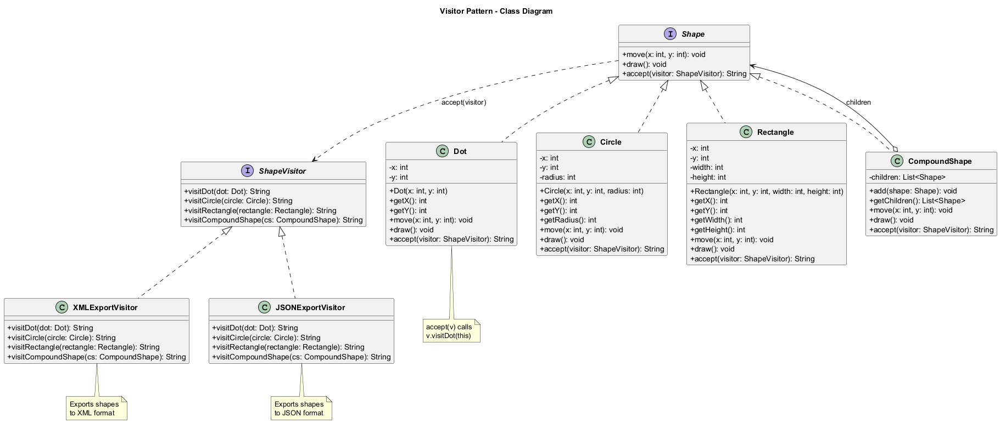

---

## Ziyaretci: Java Sozde Kod

```java
// Visitor interface
interface ShapeVisitor {
    String visitDot(Dot dot);
    String visitCircle(Circle circle);
    String visitRectangle(
        Rectangle rectangle);
    String visitCompoundShape(
        CompoundShape compoundShape);
}
```

---

## Ziyaretci: Java Sozde Kod (devam)

```java
// Element interface
interface Shape {
    void move(int x, int y);
    void draw();
    String accept(ShapeVisitor visitor);
}
```

---

## Ziyaretci: Java Sozde Kod (devam)

```java
// Concrete Element: Dot
class Dot implements Shape {
    private int x, y;

    public Dot(int x, int y) {
        this.x = x;
        this.y = y;
    }

    public int getX() { return x; }
    public int getY() { return y; }

    @Override
    public void move(int x, int y) {
        this.x += x;
        this.y += y;
    }

    @Override
    public void draw() {
        System.out.println("Drawing dot at ("
            + x + "," + y + ")");
    }

    @Override
    public String accept(ShapeVisitor visitor) {
        return visitor.visitDot(this);
    }
}
```

---

## Ziyaretci: Java Sozde Kod (devam)

```java
// Concrete Element: Circle
class Circle implements Shape {
    private int x, y, radius;

    public Circle(int x, int y, int radius) {
        this.x = x;
        this.y = y;
        this.radius = radius;
    }

    public int getX() { return x; }
    public int getY() { return y; }
    public int getRadius() { return radius; }

    @Override
    public void move(int x, int y) {
        this.x += x;
        this.y += y;
    }

    @Override
    public void draw() {
        System.out.println(
            "Drawing circle at ("
            + x + "," + y + ") r=" + radius);
    }

    @Override
    public String accept(ShapeVisitor visitor) {
        return visitor.visitCircle(this);
    }
}
```

---

## Ziyaretci: Java Sozde Kod (devam)

```java
// Concrete Element: Rectangle
class Rectangle implements Shape {
    private int x, y, width, height;

    public Rectangle(int x, int y,
                     int width, int height) {
        this.x = x;
        this.y = y;
        this.width = width;
        this.height = height;
    }

    public int getX() { return x; }
    public int getY() { return y; }
    public int getWidth() { return width; }
    public int getHeight() { return height; }

    @Override
    public void move(int x, int y) {
        this.x += x;
        this.y += y;
    }

    @Override
    public void draw() {
        System.out.println(
            "Drawing rectangle at ("
            + x + "," + y + ") "
            + width + "x" + height);
    }

    @Override
    public String accept(ShapeVisitor visitor) {
        return visitor.visitRectangle(this);
    }
}
```

---

## Ziyaretci: Java Sozde Kod (devam)

```java
// Concrete Element: Compound Shape
class CompoundShape implements Shape {
    private List<Shape> children
        = new ArrayList<>();

    public void add(Shape shape) {
        children.add(shape);
    }

    public List<Shape> getChildren() {
        return children;
    }

    @Override
    public void move(int x, int y) {
        for (Shape child : children) {
            child.move(x, y);
        }
    }

    @Override
    public void draw() {
        System.out.println(
            "Drawing compound shape:");
        for (Shape child : children) {
            child.draw();
        }
    }

    @Override
    public String accept(ShapeVisitor visitor) {
        return visitor.visitCompoundShape(this);
    }
}
```

---

## Ziyaretci: Java Sozde Kod (devam)

```java
// Concrete Visitor: XML Export
class XMLExportVisitor
        implements ShapeVisitor {
    @Override
    public String visitDot(Dot dot) {
        return "<dot>\n"
            + "  <x>" + dot.getX() + "</x>\n"
            + "  <y>" + dot.getY() + "</y>\n"
            + "</dot>\n";
    }

    @Override
    public String visitCircle(Circle circle) {
        return "<circle>\n"
            + "  <x>" + circle.getX() + "</x>\n"
            + "  <y>" + circle.getY() + "</y>\n"
            + "  <radius>" + circle.getRadius()
            + "</radius>\n"
            + "</circle>\n";
    }

    @Override
    public String visitRectangle(
            Rectangle rect) {
        return "<rectangle>\n"
            + "  <x>" + rect.getX() + "</x>\n"
            + "  <y>" + rect.getY() + "</y>\n"
            + "  <width>" + rect.getWidth()
            + "</width>\n"
            + "  <height>" + rect.getHeight()
            + "</height>\n"
            + "</rectangle>\n";
    }

    @Override
    public String visitCompoundShape(
            CompoundShape cs) {
        StringBuilder sb = new StringBuilder();
        sb.append("<compound>\n");
        for (Shape child : cs.getChildren()) {
            sb.append(child.accept(this));
        }
        sb.append("</compound>\n");
        return sb.toString();
    }
}
```

---

## Ziyaretci: Java Sozde Kod (devam)

```java
// Concrete Visitor: JSON Export
class JSONExportVisitor
        implements ShapeVisitor {
    @Override
    public String visitDot(Dot dot) {
        return "{\"type\":\"dot\","
            + "\"x\":" + dot.getX()
            + ",\"y\":" + dot.getY() + "}";
    }

    @Override
    public String visitCircle(Circle circle) {
        return "{\"type\":\"circle\","
            + "\"x\":" + circle.getX()
            + ",\"y\":" + circle.getY()
            + ",\"radius\":"
            + circle.getRadius() + "}";
    }

    @Override
    public String visitRectangle(
            Rectangle rect) {
        return "{\"type\":\"rectangle\","
            + "\"x\":" + rect.getX()
            + ",\"y\":" + rect.getY()
            + ",\"width\":" + rect.getWidth()
            + ",\"height\":"
            + rect.getHeight() + "}";
    }

    @Override
    public String visitCompoundShape(
            CompoundShape cs) {
        StringBuilder sb = new StringBuilder();
        sb.append("{\"type\":\"compound\","
            + "\"children\":[");
        List<Shape> children = cs.getChildren();
        for (int i = 0;
                i < children.size(); i++) {
            sb.append(
                children.get(i).accept(this));
            if (i < children.size() - 1)
                sb.append(",");
        }
        sb.append("]}");
        return sb.toString();
    }
}
```

---

## Ziyaretci: Java Sozde Kod (devam)

```java
// Client code
public class VisitorDemo {
    public static void main(String[] args) {
        // Build shape structure
        CompoundShape allShapes =
            new CompoundShape();
        allShapes.add(new Dot(1, 2));
        allShapes.add(new Circle(5, 5, 10));
        allShapes.add(
            new Rectangle(10, 10, 100, 50));

        CompoundShape nested =
            new CompoundShape();
        nested.add(new Dot(20, 30));
        nested.add(new Circle(25, 25, 5));
        allShapes.add(nested);

        // Export to XML
        XMLExportVisitor xmlExporter =
            new XMLExportVisitor();
        System.out.println("XML Export:");
        System.out.println(
            allShapes.accept(xmlExporter));

        // Export to JSON
        JSONExportVisitor jsonExporter =
            new JSONExportVisitor();
        System.out.println("\nJSON Export:");
        System.out.println(
            allShapes.accept(jsonExporter));
    }
}
```

---

## Ziyaretci: Sira Diyagrami

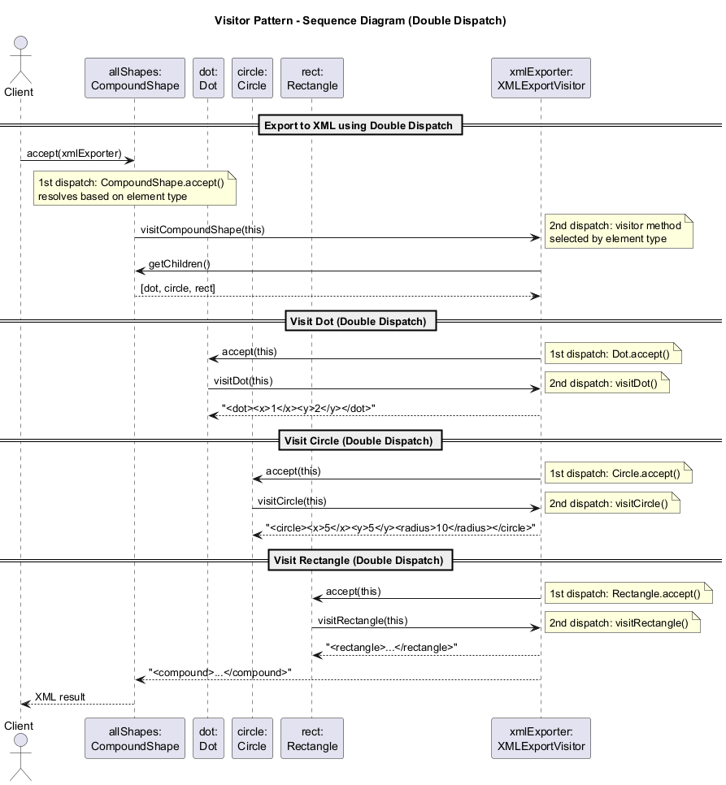

---

## Ziyaretci: Uygulanabilirlik

Ziyaretci desenini su durumlarda kullanin:

- **Farkli siniflara** sahip bir **karmasik nesne yapisinin** (ornegin bir nesne agaci) tum elemanlari uzerinde bir islem gerceklestirmeniz gerekiyor.
- Yardimci davranislarin **is mantisini temizlemek** istiyorsunuz. Desen, uygulamanizin birincil siniflarini tum diger davranislari bir dizi ziyaretci sinifina cikararak ana islerine daha fazla odaklanmalarini saglar.
- Bir davranis yalnizca bir sinif hiyerarsisinin bazi siniflarinda mantikli, **digelerinde degil**. Bu davranisi ayri bir ziyaretci sinifina cikarabilir ve yalnizca ilgili siniflarin nesnelerini kabul eden ziyaret yontemlerini uygulayabilir, geri kalanlari bos birakabilirsiniz.

---

## Ziyaretci: Nasil Uygulanir

1. Programda var olan her somut eleman sinifi icin bir dizi "ziyaret" yontemiyle **ziyaretci arayuzunu** bildirin.
2. **Eleman arayuzunu** bildirin. Mevcut bir eleman sinif hiyerarsiniz varsa, hiyerarsinin temel sinifina soyut "kabul" yontemini ekleyin.
3. Tum somut eleman siniflarinda **kabul yontemlerini** uygulayin. Bu yontemler, mevcut eleman sinifiyla eslesen gelen ziyaretci nesnesindeki bir ziyaret yontemine cagiyi yalnizca yonlendirmelidir.
4. Eleman siniflari ziyaretcilerle yalnizca ziyaretci arayuzu araciligiyla calismalindir. Ancak ziyaretciler, ziyaret yontemlerinin parametre turleri olarak referans alinan **tum somut eleman siniflarinin farkinda** olmalidir.

---

## Ziyaretci: Nasil Uygulanir (devam)

5. Eleman hiyerarsisinin icine koyulamayan her davranis icin yeni bir **somut ziyaretci sinifi** olusturun ve tum ziyaret yontemlerini uygulayin.
6. Ziyaretcinin eleman sinifinin bazi **ozel uyelerine erisime** ihtiyac duydugu bir durumla karsilasabilirsiniz. Bu durumda, bu alanlari veya yontemleri herkese acik hale getirebilir (elemanin kapsullemesini ihlal ederek) veya ziyaretci sinifini eleman sinifinin icine yerlestirebilirsiniz (diliniz ic ice siniflari destekliyorsa).
7. **Istemci** ziyaretci nesneleri olusturmali ve bunlari "kabul" yontemleri araciligiyla elemanlara iletmelidir.

---

## Ziyaretci: Avantajlar ve Dezavantajlar

**Avantajlar:**

- **Acik/Kapali Ilkesi:** Bu siniflari degistirmeden farkli siniflarin nesneleriyle calisabilen yeni bir davranis ekleyebilirsiniz
- **Tek Sorumluluk Ilkesi:** Ayni davranissin birden fazla surumunu ayni sinifa tasiyabilirsiniz
- Bir ziyaretci nesnesi cesitli nesnelerle calisirken bazi yararli bilgileri **biriktirebilir**, bu da nesne agaclari gibi karmasik yapilari gezerken kullanislidir

**Dezavantajlar:**

- Eleman hiyerarsisine bir sinif her eklendiginde veya cikarildiginda **tum ziyaretcileri guncellemeniz** gerekir
- Ziyaretciler, uzerinde calismasi gereken elemanlarin **ozel alanliarina ve yontemlerine erismek** icin gerekli yetkiye sahip olmayabilir
- Desen kod tabaninin **karmasikligini artirir**

---

## Ziyaretci: Diger Desenlerle Iliskileri

- **Ziyaretciyi**, **Komut** deseninin guclu bir surumu olarak dusunebilirsiniz. Nesneleri farkli siniflarin cesitli nesneleri uzerinde islemler yurutebilir.
- Tum bir **Bilesik (Composite)** agaci uzerinde bir islem yurutmek icin **Ziyaretci** kullanabilirsiniz.
- Karmasik bir veri yapisini gezmek ve tumunun farkli siniflari olsa bile elemanlari uzerinde bazi islemler yurutmek icin **Yineleyici** ile birlikte **Ziyaretci** kullanabilirsiniz.

---

## Ziyaretci: Cift Dagitim Aciklamasi

Ziyaretci deseni **cift dagitim** sorununu cozer:

```java
// Without Visitor - type checking needed:
for (Shape s : shapes) {
    if (s instanceof Dot)
        exportDot((Dot) s);
    else if (s instanceof Circle)
        exportCircle((Circle) s);
    // ... fragile, violates OCP
}

// With Visitor - double dispatch:
for (Shape s : shapes) {
    s.accept(visitor);
    // 1st dispatch: s.accept() resolves
    //   to the correct accept() based on s type
    // 2nd dispatch: accept() calls correct
    //   visit*() based on visitor type
}
```

Eleman kendi sinifini bilir, bu nedenle ziyaretci uzerinde uygun yontemi secer. Tur kontrolune gerek yoktur.

---

## Modul K: Ozet

**Ziyaretci (Visitor)** deseni, bir nesne yapisinin elemanlari uzerinde gerceklestirilecek bir islemi temsil eder. Cift dagitim teknigini kullanarak, uzerinde calistigi elemanlarin siniflarini degistirmeden yeni bir islem tanimlamamaniza olanak tanir.

---

<!-- _backgroundColor: aqua -->

<!-- _color: orange -->

# Ozet ve Karsilastirma

---

## Davranissal Desenler: Ozet Tablosu

| Desen | Temel Mekanizma | Ne Zaman Kullanilir |
|-------|----------------|---------------------|
| Sorumluluk Zinciri | Isleyici zinciri | Birden fazla isleyici, bilinmeyen siralama |
| Komut | Nesne olarak istek | Geri al/yinele, kuyruga alma, kayit tutma |
| Yineleyici | Gezinti soyutlamasi | Koleksiyon gezintisi |
| Arabulucu | Merkezi koordinator | Karmasik nesneler arasi iletisim |
| Hatira | Durum anlik goruntusu | Geri alma, kontrol noktasi |

---

## Davranissal Desenler: Ozet Tablosu (devam)

| Desen | Temel Mekanizma | Ne Zaman Kullanilir |
|-------|----------------|---------------------|
| Gozlemci | Yayinla/abone ol bildirimi | Olay gudumlu sistemler |
| Durum | Polimorfik durum | Duruma bagli davranis |
| Strateji | Degistirilebilir algoritmalar | Calisma zamaninda algoritma secimi |
| Sablon Yontem | Algoritma iskeleti | Ortak algoritma, degisen adimlar |
| Ziyaretci | Cift dagitim | Sabit yapilar uzerinde yeni islemler |

---

## Gonderici-Alici Baglanti Desenleri

Dort davranissal desen, istek gondericilerini alicilarla baglamayi ele alir:

| Desen | Baglanti Sekli |
|-------|---------------|
| **Sorumluluk Zinciri** | Dinamik zincir boyunca sirali |
| **Komut** | Tek yonlu gonderici-alici |
| **Arabulucu** | Merkezi nesne araciligiyla dolayli |
| **Gozlemci** | Dinamik abonelik tabanli |

Her biri gonderici ve alicilara baglanti ve esneklik acisindan farkli odunlesimler sunar.

---

## Bilesim ve Kalitim Desenleri

| Bilesim Tabanli | Kalitim Tabanli |
|----------------|-----------------|
| Strateji (calisma zamani gecisi) | Sablon Yontem (derleme zamani) |
| Durum (durum farkindali gecis) | |
| Komut (nesne olarak istek) | |
| Gozlemci (dinamik abonelik) | |

**Strateji ve Sablon Yontem** klasik bir bilesim-kalitim karsilastirmasidir.

**Durum ve Strateji**: Durum, durumlar arasi farkindali saglar; Strateji uygulamalari bagimsiz tutar.

---

## Desen Kombinasyonlari

Pratikte yaygin desen kombinasyonlari:

- **Komut + Hatira** = Geri al/yinele destegi
- **Yineleyici + Ziyaretci** = Karmasik yapilari gezme ve isleme
- **Yineleyici + Hatira** = Kontrol noktali yineleme
- **Gozlemci + Arabulucu** = Merkezi olay koordinasyonu
- **Bilesik + Yineleyici + Ziyaretci** = Islemlerle agac gezintisi
- **Strateji + Fabrika Yontemi** = Calisma zamani algoritma secimi

---

## Kaynaklar

- Gamma, E., Helm, R., Johnson, R., Vlissides, J. (1994). *Design Patterns: Elements of Reusable Object-Oriented Software*. Addison-Wesley.
- [Refactoring.Guru - Davranissal Tasarim Desenleri](https://refactoring.guru/design-patterns/behavioral-patterns)
- [Refactoring.Guru - Sorumluluk Zinciri](https://refactoring.guru/design-patterns/chain-of-responsibility)
- [Refactoring.Guru - Komut](https://refactoring.guru/design-patterns/command)
- [Refactoring.Guru - Yineleyici](https://refactoring.guru/design-patterns/iterator)
- [Refactoring.Guru - Arabulucu](https://refactoring.guru/design-patterns/mediator)
- [Refactoring.Guru - Hatira](https://refactoring.guru/design-patterns/memento)

---

## Kaynaklar (devam)

- [Refactoring.Guru - Gozlemci](https://refactoring.guru/design-patterns/observer)
- [Refactoring.Guru - Durum](https://refactoring.guru/design-patterns/state)
- [Refactoring.Guru - Strateji](https://refactoring.guru/design-patterns/strategy)
- [Refactoring.Guru - Sablon Yontem](https://refactoring.guru/design-patterns/template-method)
- [Refactoring.Guru - Ziyaretci](https://refactoring.guru/design-patterns/visitor)
- Freeman, E., Robson, E. (2020). *Head First Design Patterns*. O'Reilly Media.
- Bloch, J. (2018). *Effective Java*. Addison-Wesley.

---

<!-- _backgroundColor: aqua -->

<!-- _color: orange -->

## Tesekkurler

### Sorular?

CEN206 Nesne Yonelimli Programlama

Hafta-11: Davranissal Tasarim Desenleri

$End-Of-Week-11-Module$