<!-- _backgroundColor: aqua -->

<!-- _color: orange -->

<!-- paginate: false -->

## CEN206 Nesne Yönelimli Programlama

## Hafta-12 (Kod Kokuları ve Yeniden Yapılandırma Temelleri)

#### Bahar Dönemi, 2025-2026

İndir [DOC-PDF](ce204-week-12.tr.md_doc.pdf), [DOC-DOCX](ce204-week-12.tr.md_word.docx), [SLAYT](ce204-week-12.tr.md_slide.pdf)

<iframe width=700, height=500 frameBorder=0 src="../ce204-week-12.tr.md_slide.html"></iframe>

---

<!-- paginate: true -->

## Kod Kokuları ve Yeniden Yapılandırma Temelleri

### İçerik

- **Modül A:** Yeniden Yapılandırma Nedir? -- Tanım, Temiz Kod, Teknik Borç, Ne Zaman Yeniden Yapılandırılır, Nasıl Yeniden Yapılandırılır
- **Modül B:** Şişkinler (Bloaters) -- Uzun Metot, Büyük Sınıf, İlkel Takıntı, Uzun Parametre Listesi, Veri Kümeleri
- **Modül C:** Nesne Yönelim Kötüye Kullananlar (OO Abusers) -- Switch İfadeleri, Geçici Alan, Reddedilen Miras, Farklı Arayüzlere Sahip Alternatif Sınıflar
- **Modül D:** Değişim Engelleyiciler (Change Preventers) -- Iraksak Değişim, Saçma Ameliyat, Paralel Kalıtım Hiyerarşileri
- **Modül E:** Gereksizler (Dispensables) -- Yorumlar, Tekrarlanan Kod, Tembel Sınıf, Veri Sınıfı, Ölü Kod, Spekülatif Genellik
- **Modül F:** Bağlayıcılar (Couplers) -- Özellik Kıskançlığı, Uygunsuz Yakınlık, Mesaj Zincirleri, Aracı

---

## İçerik (Devamı)

### Kapsanan Tüm 22 Kod Kokusu

| Kategori | Kokular |
|---|---|
| **Şişkinler (Bloaters)** (5) | Uzun Metot (Long Method), Büyük Sınıf (Large Class), İlkel Takıntı (Primitive Obsession), Uzun Parametre Listesi (Long Parameter List), Veri Kümeleri (Data Clumps) |
| **NE Kötüye Kullananlar (OO Abusers)** (4) | Switch İfadeleri (Switch Statements), Geçici Alan (Temporary Field), Reddedilen Miras (Refused Bequest), Farklı Arayüzlere Sahip Alternatif Sınıflar (Alternative Classes with Different Interfaces) |
| **Değişim Engelleyiciler (Change Preventers)** (3) | Iraksak Değişim (Divergent Change), Saçma Ameliyat (Shotgun Surgery), Paralel Kalıtım Hiyerarşileri (Parallel Inheritance Hierarchies) |
| **Gereksizler (Dispensables)** (6) | Yorumlar (Comments), Tekrarlanan Kod (Duplicate Code), Tembel Sınıf (Lazy Class), Veri Sınıfı (Data Class), Ölü Kod (Dead Code), Spekülatif Genellik (Speculative Generality) |
| **Bağlayıcılar (Couplers)** (4) | Özellik Kıskançlığı (Feature Envy), Uygunsuz Yakınlık (Inappropriate Intimacy), Mesaj Zincirleri (Message Chains), Aracı (Middle Man) |

> Kaynak: [Refactoring.Guru -- Kod Kokuları](https://refactoring.guru/refactoring/smells)

---

### Kod Kokusu Kategorileri (Genel Bakış)

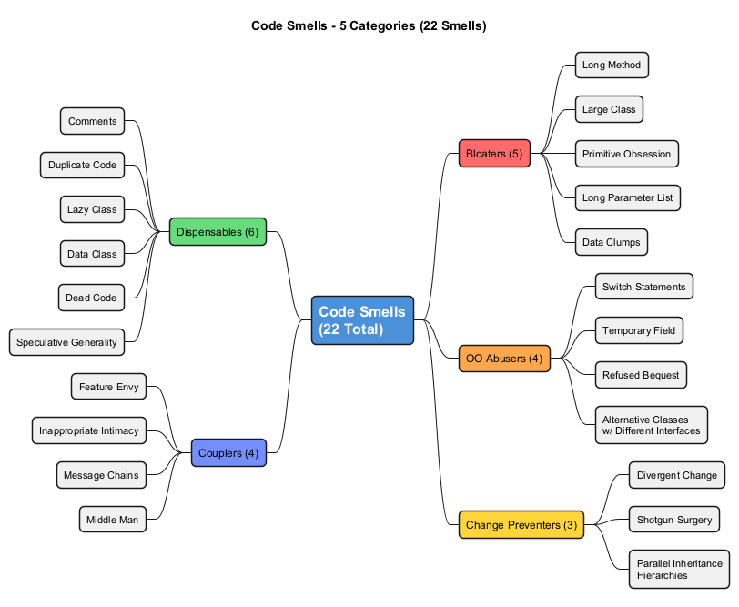

---

<!-- _backgroundColor: aqua -->

<!-- _color: orange -->

<!-- paginate: false -->

# Modül A: Yeniden Yapılandırma Nedir?

### Tanım, Temiz Kod, Teknik Borç, Ne Zaman Yeniden Yapılandırılır, Nasıl Yeniden Yapılandırılır

---

<!-- paginate: true -->

## Modül A: Yeniden Yapılandırma Nedir? -- Tanım

**Yeniden yapılandırma (Refactoring)**, kodun **dış davranışını değiştirmeden** iç yapısını iyileştirmenin sistematik bir sürecidir.

- Yeniden yapılandırmanın temel amacı **teknik borçla mücadele etmektir**
- Dağınık, kötü tasarlanmış kodu temiz, iyi tasarlanmış koda dönüştürür
- Yeniden yapılandırma, hata düzeltme veya yeni özellik ekleme **değildir**
- Kodu daha kolay anlaşılır, bakımı yapılabilir ve genişletilebilir hale getirmekle ilgilidir
- Bunu bir dizi **küçük, davranışı koruyan dönüşüm** uygulamak olarak düşünün

> "Yeniden yapılandırma, mevcut bir kod tabanının tasarımını iyileştirmek için kontrollü bir tekniktir. Özü, her biri tek başına yapılmaya değmeyecek kadar küçük olan bir dizi küçük davranış koruyucu dönüşüm uygulamaktır. Ancak bu dönüşümlerin her birinin kümülatif etkisi oldukça önemlidir."
> -- Martin Fowler

Referans: [RefactoringGuru -- Yeniden Yapılandırma Nedir](https://refactoring.guru/refactoring/what-is-refactoring)

---

## Modül A: Kirli Kod vs. Temiz Kod

### Kirli Kod Nedir?

Kirli kod, okunması zor, değiştirilmesi zor ve bakımı zor olan koddur. Kısayollar, acele teslim tarihleri ve disiplin eksikliği nedeniyle zamanla birikir.

### Temiz Kod Nedir?

Temiz kod bunun tam tersidir -- açık, bakımı kolay ve çalışması keyifli olan koddur.

> "Yeniden yapılandırmanın temel amacı teknik borçla mücadele etmektir. Dağınıklığı temiz koda ve basit tasarıma dönüştürür."

### İlişki

```
Kirli Kod  --[yeniden yapılandırma]-->  Temiz Kod
     |                                      |
     v                                      v
  Bakımı zor                         Bakımı kolay
  Değiştirmesi pahalı                Değiştirmesi ucuz
  Gizli hatalarla dolu               Hatalar görünür
```

---

## Modül A: Temiz Kod Özellikleri

Temiz kod, kirli koddan ayıran **dört temel özelliğe** sahiptir:

### 1. Temiz Kod Diğer Programcılar İçin Açıktır

- Kötü değişken adları, şişmiş sınıflar ve sihirli sayılar kodu özensiz ve kavranması zor hale getirir
- İyi kod neredeyse iyi yazılmış bir düzyazı gibi okunur
- Diğer geliştiriciler kapsamlı dokümantasyon olmadan anlayabilir

### 2. Temiz Kod Tekrarlama İçermez

- Tekrarlanan kodda her değişiklik yaptığınızda, aynı değişikliği her örnekte yapmayı hatırlamanız gerekir
- Bilişsel yükü artırır ve ilerlemeyi yavaşlatır
- DRY (Kendini Tekrar Etme - Don't Repeat Yourself) ilkesini ihlal eder

> "Tekrarlanan kodda her değişiklik yapmanız gerektiğinde, aynı değişikliği her örnekte yapmayı hatırlamanız gerekir." -- RefactoringGuru

---

## Modül A: Temiz Kod Özellikleri (Devamı)

### 3. Temiz Kod Minimum Sayıda Sınıf ve Hareketli Parça İçerir

- "Daha az kod, akılda tutulacak daha az şey demektir"
- "Daha az kod, daha az bakım demektir"
- Daha az kod, daha az hata demektir
- Kod bir **yükümlülüktür**, varlık değil -- en aza indirin

### 4. Temiz Kod Tüm Testleri Geçer

- Testlerin yüzde sıfırını geçen kod kirli koddur
- %95 temiz olan ancak testleri geçmeyen kod yeterince temiz değildir
- Testler, yeniden yapılandırma için bir güvenlik ağı görevi görür

### Sonuç

> **"Temiz kodun bakımı daha kolay ve daha ucuzdur!"**

- Bir yazılım projesinin yaşam döngüsünün büyük bölümü bakıma harcanır
- Temiz kod, süregelen geliştirme maliyetini azaltır
- Yeni ekip üyeleri daha hızlı adapte olabilir

Referans: [RefactoringGuru -- Temiz Kod](https://refactoring.guru/refactoring/clean-code)

---

## Modül A: Teknik Borç -- Metafor

### Teknik Borç Nedir?

Teknik borç, **Ward Cunningham** tarafından ortaya atılan bir metafordur. Hızlı ve özensiz kodlama kararlarını finansal borçla karşılaştırır:

- **Borç almak:** Hızlı, özensiz kod yazarak şimdi daha hızlı teslim edersiniz
- **Faiz ödemeleri:** Kirli kodla her çalışmanızda, onu anlamak ve değiştirmek için ekstra zaman harcarsınız
- **İflas:** Sonunda kod tabanı o kadar dağınık hale gelir ki ileri geliştirme neredeyse imkansız olur

> "Yeni özellikler için test yazmadan geçici olarak hızlanabilirsiniz, ancak bu, sonunda borcu test yazarak ödeyene kadar ilerlemenizi her gün yavaşlatacaktır." -- RefactoringGuru

### Borç Sarmalı

```
Hızlı ve Özensiz Kod  -->  Teknik Borç Birikir
       |                         |
       v                         v
  Şimdi Daha Hızlı Teslim  Geliştirme Yavaşlar
       |                         |
       v                         v
  Daha Fazla Kısayol       Daha Fazla Hata, Daha Fazla Karmaşıklık
       |                         |
       v                         v
  Daha da Fazla Borç   -->  Proje Bakılamaz Hale Gelebilir
```

Referans: [RefactoringGuru -- Teknik Borç](https://refactoring.guru/refactoring/technical-debt)

---

### Teknik Borç Döngüsü (Diyagram)

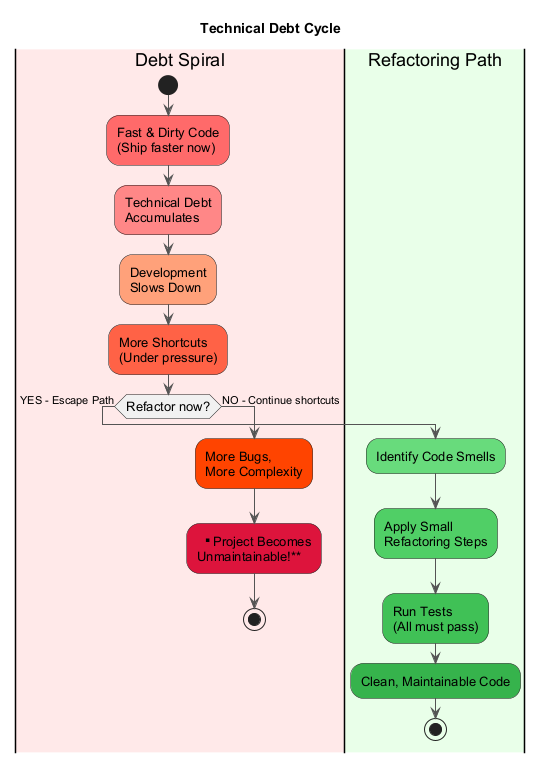

---

## Modül A: Teknik Borç Nedenleri

| # | Neden | Açıklama |
|---|---|---|
| 1 | **İş baskısı** | Acele özellik sürümleri, geçici yamaları üretim koduna zorlar |
| 2 | **Sonuçları anlama eksikliği** | Yönetim, borcun zamanla nasıl birleştiğini fark etmeyebilir |
| 3 | **Bileşenlerin sıkı tutarlılığıyla mücadele edememe** | Monolitik mimariler sıkı bağlantı oluşturur, izole değişiklikleri imkansız kılar |
| 4 | **Test eksikliği** | Eksik test kapsamı, teste tabi tutulmadan üretime ulaşan riskli geçici çözümleri teşvik eder |
| 5 | **Dokümantasyon eksikliği** | Yeni ekip üyeleri adaptasyonda zorlanır, ayrılan uzmanlar bilgi boşlukları oluşturur |
| 6 | **Ekip üyeleri arasında etkileşim eksikliği** | Dağıtılmış bilgi, güncel olmayan anlayışa yol açar |
| 7 | **Dallarda uzun süreli eşzamanlı geliştirme** | İzole dal çalışması, birleştirme sırasında birleşen borç biriktirir |
| 8 | **Ertelenmiş yeniden yapılandırma** | Mimari güncellemeleri ertelemek, gelecekte yeniden çalışma gerektiren yaygın bağımlı kod oluşturur |
| 9 | **Uyumluluk izleme eksikliği** | Tutarsız standartlar ve yetersiz geliştirici becerisi borç birikimine katkıda bulunur |

### Temel Bakış Açısı

- Herkes zaman zaman teknik borç biriktirir
- Önemli olan kontrolden çıkmasına izin vermemektir
- **Yeniden yapılandırma, teknik borcu ödemenin birincil yöntemidir**

---

## Modül A: Ne Zaman Yeniden Yapılandırılır -- Üçler Kuralı

**Üçler Kuralı**, ne zaman yeniden yapılandırma yapılacağına karar vermek için basit bir sezgisel yöntemdir:

### 1. İlk Sefer -- Sadece Yapın

- Bir şeyi ilk kez yapıyorsanız, sadece tamamlayın
- Kod mükemmel olmasa bile ilerleyin

### 2. İkinci Sefer -- Tekrarlamaya İçerlenin

- Benzer bir şeyi ikinci kez yaptığınızda, kendinizi tekrarlamak zorunda kalmanıza içerlenin
- Ama yine de yapın (şimdilik)

### 3. Üçüncü Sefer -- Yeniden Yapılandırın

- Bir şeyi **üçüncü kez** yapıyorsanız, yeniden yapılandırma zamanıdır
- Üç deneme ve yeniden yapılandırırsınız!

> "Bir şeyi ilk kez yaptığınızda, sadece yapın. İkinci kez tekrarlamaya içerlenirsiniz ama yine de yaparsınız. Üçüncü kez yeniden yapılandırırsınız." -- RefactoringGuru

Referans: [RefactoringGuru -- Ne Zaman Yeniden Yapılandırılır](https://refactoring.guru/refactoring/when)

---

## Modül A: Ne Zaman Yeniden Yapılandırılır -- Belirli Durumlar

### Özellik Eklerken

Yeniden yapılandırma, özellik eklerken iki şekilde yardımcı olur:

1. **Başkalarının Kodunu Anlama** -- Kodu daha açık hale getirmek için yeniden yapılandırma, neler olduğunu anlamanıza yardımcı olur. "Temiz kodda değişiklik yapmak çok daha kolaydır."
2. **Eklemeyi Kolaylaştırma** -- Bazen mevcut kod yapısı yeni bir özellik eklemeyi çok zorlaştırır. Önce yeniden yapılandırma yapmak yeni özelliği çok daha kolay uygulanabilir hale getirebilir.

### Hata Düzeltirken

- "Koddaki hatalar tıpkı gerçek hayattakiler gibi davranır: kodun en karanlık, en kirli yerlerinde yaşarlar."
- Sorunlu kodu önce temizleyerek, hatalar daha kolay tanımlanır ve çözülür
- Yöneticiler hataların düzeltilmesi gerektiğini anlar, bu nedenle yeniden yapılandırmayı hata düzeltmeleriyle birleştirebilirsiniz

### Kod İncelemesi Sırasında

- Kod incelemesi, kod kamuya açık hale gelmeden önce düzenlemenin **son şansıdır**
- İkili çalışmada en iyi sonuç verir: inceleyici değişiklikler önerir ve yazar bunları hemen uygular
- Basit yeniden yapılandırmalarla başlayın, karmaşık olanları takip görevleri olarak ele alın

---

## Modül A: Nasıl Yeniden Yapılandırılır -- Temel İlke

> "Yeniden yapılandırma, her biri mevcut kodu biraz daha iyi hale getirirken programı çalışır durumda bırakan bir dizi küçük değişiklik olarak yapılmalıdır." -- RefactoringGuru

```
Çalışan Kod --> Küçük Değişiklik --> Hala Çalışan Kod
     |                                   |
     v                                   v
  Test Geçer                          Test Geçer
     |                                   |
     v                                   v
Küçük Değişiklik --> Hala Çalışan Kod --> Küçük Değişiklik ...
```

- Her bireysel yeniden yapılandırma o kadar küçüktür ki yanlış gitme olasılığı çok düşüktür
- Sistem her küçük adımdan sonra tam işlevsel kalır
- Bir şey bozulursa, tam olarak hangi küçük değişikliğin neden olduğunu bilirsiniz

Referans: [RefactoringGuru -- Nasıl Yeniden Yapılandırılır](https://refactoring.guru/refactoring/how-to)

---

## Modül A: Yeniden Yapılandırma Kontrol Listesi

Yeniden yapılandırma öncesinde, sırasında ve sonrasında şu üç koşulu doğrulayın:

### 1. Kod Daha Temiz Olmalıdır

- Yeniden yapılandırma sonrasında kod hala aynı derecede kirli ise, zaman kaybediyorsunuz
- Bazen bu, birden fazla yeniden yapılandırmayı tek bir büyük değişiklikte birleştirdiğinizde olur
- Ciddi sorunlu kodlar için tam yeniden yazma düşünün -- ancak yalnızca testleri yazdıktan ve yeterli zaman ayırdıktan sonra

### 2. Yeniden Yapılandırma Sırasında Yeni İşlevsellik Oluşturulmamalıdır

- "Yeniden yapılandırmayı ve yeni özelliklerin doğrudan geliştirilmesini karıştırmayın"
- Yeniden yapılandırma ve yeni özellikleri netlik ve izlenebilirlik için **ayrı commit'ler** olarak tutun

### 3. Tüm Mevcut Testler Geçmelidir

- Yeniden yapılandırma sonrasında tüm mevcut testler hala geçmelidir
- **Senaryo 1:** Yeniden yapılandırma sırasında bir hata yaptınız -- küçük hatayı düzeltin
- **Senaryo 2:** Testler çok düşük seviyeydi (davranış yerine özel metotları test ediyordu) -- testleri yeniden yapılandırın veya daha yüksek seviye BDD tarzı testler yazın

---

## Modül A: Güvenli Yeniden Yapılandırma İş Akışı

### Adım Adım Süreç

1. **Yeniden yapılandırmak istediğiniz kod için kapsamlı bir test paketine sahip olduğunuzdan emin olun**
2. **Her seferinde bir küçük değişiklik yapın**
3. **Her değişiklikten sonra tüm testleri çalıştırın**
4. **Testler geçerse**, bir sonraki değişikliğe geçin
5. **Testler başarısız olursa**, değişikliği hemen geri alın ve farklı bir yaklaşım deneyin
6. **Sık sık commit yapın** böylece bir şeyler ters giderse kolayca geri dönebilirsiniz
7. **Nihai sonucu gözden geçirin** -- kod daha temiz mi?

### Yardımcı Araçlar

| Araç | Amaç |
|---|---|
| **Sürüm kontrolü (Git)** | Kötü değişikliklerin kolay geri alınması |
| **Otomatik testler** | Her değişiklikten sonra davranışı doğrulama |
| **IDE yeniden yapılandırma araçları** | Otomatik yeniden adlandırma, metot çıkarma vb. |
| **Sürekli Entegrasyon** | Gerilemeleri erken yakalar |

---

### Yeniden Yapılandırma İş Akışı (Diyagram)

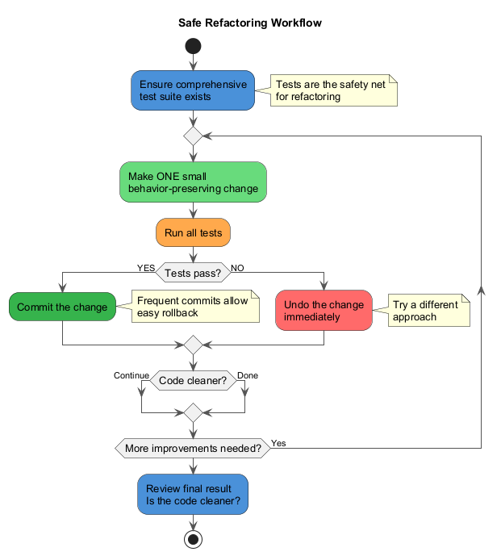

---

## Modül A: Özet

### Temel Noktalar -- Yeniden Yapılandırma Nedir?

- **Yeniden yapılandırma** = dış davranışı değiştirmeden kod yapısını iyileştirme
- **Temiz kod** açık, tekrardan arınmış, minimum, test edilmiş ve bakımı kolaydır
- **Kirli kod**, gelecek geliştirmeyi yavaşlatan **teknik borç** oluşturur
- Teknik borç; iş baskısı, test eksikliği, kötü dokümantasyon, sıkı bağlı bileşenler ve daha fazlasından kaynaklanır
- **Üçler Kuralını** kullanın: ilk seferde yapın, ikinci seferde içerlenin, üçüncü seferde yeniden yapılandırın
- Özellik eklerken, hata düzeltirken ve kod incelemeleri sırasında yeniden yapılandırın
- **Küçük, artımlı değişiklikler** yapın ve tüm testlerin geçmesini sağlayın
- Yeniden yapılandırma ve özellik geliştirmeyi asla aynı commit'te karıştırmayın

> "Herhangi bir aptal bilgisayarın anlayabileceği kod yazabilir. İyi programcılar insanların anlayabileceği kod yazar." -- Martin Fowler

---

<!-- _backgroundColor: aqua -->

<!-- _color: orange -->

<!-- paginate: false -->

# Modül B: Şişkinler (Bloaters)

### O Kadar Büyümüş Kod, Metotlar ve Sınıflar ki Çalışmak Zorlaşmıştır

---

<!-- paginate: true -->

## Modül B: Şişkinler (Bloaters) -- Genel Bakış

**Şişkinler (Bloaters)**, o kadar devasa boyutlara ulaşmış kod, metotlar ve sınıflardır ki bunlarla çalışmak zorlaşır. Genellikle bu kokular hemen ortaya çıkmaz; daha çok program geliştikçe zamanla birikir (ve özellikle kimse onları ortadan kaldırma çabası göstermediğinde).

### 5 Şişkin Kokusu

| # | Koku | Temel Sorun |
|---|---|---|
| 1 | **Uzun Metot (Long Method)** | Metot çok fazla satır kod içerir |
| 2 | **Büyük Sınıf (Large Class)** | Sınıf çok fazla alan/metot/satır içerir |
| 3 | **İlkel Takıntı (Primitive Obsession)** | Küçük nesneler yerine ilkel türlerin aşırı kullanımı |
| 4 | **Uzun Parametre Listesi (Long Parameter List)** | Bir metotta üçten veya dörtten fazla parametre |
| 5 | **Veri Kümeleri (Data Clumps)** | Her zaman birlikte görünen veri grupları |

Referans: [RefactoringGuru -- Şişkinler](https://refactoring.guru/refactoring/smells/bloaters)

---

## Modül B: Şişkin #1 -- Uzun Metot (Long Method)

### Nedir?

Bir metot **çok fazla satır kod** içerir. Genel olarak, **on satırdan** uzun herhangi bir metot sizi soru sormaya başlatmalıdır.

### Belirtiler ve Semptomlar

- Metot 10-20 satırın ötesine büyümüştür
- Metodun farklı bölümlerinin ne yaptığını açıklamak için yorumlara ihtiyaç duyarsınız
- Metot adı, metodun yaptığı her şeyi tam olarak tanımlamaz
- Derinlemesine iç içe kontrol yapıları vardır

### Sorunun Nedenleri

- Mevcut bir metoda **ekleme yapmak**, yeni bir metot oluşturmaktan zihinsel olarak daha kolaydır
- "Bu iki satırı buraya ekleyeyim..." -- ve büyümeye devam eder
- Bir metot oluşturmak, mevcut bir metoda ekleme yapmaktan daha zor olduğundan, çoğu kod mevcut metotlara ekleme olarak yazılır
- Metot başlangıçta küçük başlamış ancak zamanla büyümüştür

Referans: [RefactoringGuru -- Uzun Metot](https://refactoring.guru/smells/long-method)

---

### Uzun Metot - Önce (Kod Kokusu)

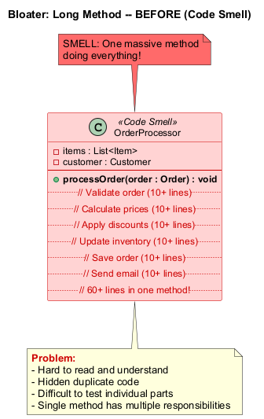

---

### Uzun Metot - Sonra (Yeniden Yapılandırılmış)

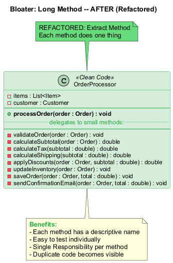

---

## Modül B: Şişkin #1 -- Uzun Metot (Long Method) (Java Örneği -- Önce)

```java
// KOKU: Uzun Metot -- bu metot çok fazla iş yapıyor
public void processOrder(Order order) {
    // Siparişi doğrula (10+ satır)
    if (order == null) throw new IllegalArgumentException("Order is null");
    if (order.getItems().isEmpty())
        throw new IllegalStateException("Order has no items");
    for (Item item : order.getItems()) {
        if (item.getQuantity() <= 0)
            throw new IllegalStateException("Invalid quantity");
        if (!inventory.isAvailable(item.getProductId(), item.getQuantity()))
            throw new IllegalStateException("Product not available");
    }

    // Fiyatları hesapla (10+ satır)
    double subtotal = 0;
    for (Item item : order.getItems()) {
        subtotal += item.getPrice() * item.getQuantity();
    }
    double tax = subtotal * 0.08;
    double shipping = subtotal > 100 ? 0 : 9.99;

    // İndirimleri uygula (10+ satır)
    if (order.getCustomer().isLoyalMember()) {
        subtotal *= 0.90;
    }
    double total = subtotal + tax + shipping;

    // Envanteri güncelle, siparişi kaydet, e-posta gönder... (20+ satır daha)
}
```

---

## Modül B: Şişkin #1 -- Uzun Metot (Long Method) (Java Örneği -- Sonra)

```java
// YENİDEN YAPILANDIRILMIŞ: Metot Çıkarma uygulandı
public void processOrder(Order order) {
    validateOrder(order);
    double subtotal = calculateSubtotal(order);
    double tax = calculateTax(subtotal);
    double shipping = calculateShipping(subtotal);
    subtotal = applyDiscounts(order, subtotal);
    double total = subtotal + tax + shipping;
    updateInventory(order);
    saveOrder(order, total);
    sendConfirmationEmail(order, total);
}

private void validateOrder(Order order) {
    if (order == null) throw new IllegalArgumentException("Order is null");
    if (order.getItems().isEmpty())
        throw new IllegalStateException("Order has no items");
    for (Item item : order.getItems()) {
        validateItem(item);
    }
}

private double calculateSubtotal(Order order) {
    return order.getItems().stream()
        .mapToDouble(item -> item.getPrice() * item.getQuantity())
        .sum();
}
```

---

## Modül B: Şişkin #1 -- Uzun Metot (Long Method) (Tedavi ve Kazanç)

### Tedavi (Yeniden Yapılandırma Teknikleri)

| Teknik | Ne Zaman Kullanılır |
|---|---|
| **Metot Çıkarma (Extract Method)** | Bir kod parçasını alıp açıklayıcı bir adla kendi metoduna dönüştürün |
| **Geçici Değişkeni Sorguyla Değiştirme (Replace Temp with Query)** | Bir ifadeyi yeni bir metoda taşıyın ve sonucu yerel değişkende saklamak yerine döndürün |
| **Parametre Nesnesi Tanıtma (Introduce Parameter Object)** | Tekrarlanan parametre gruplarını bir nesneyle değiştirin |
| **Bütün Nesneyi Koruma (Preserve Whole Object)** | Nesneden tek tek değerler yerine bütün nesneyi geçirin |
| **Metodu Metot Nesnesiyle Değiştirme (Replace Method with Method Object)** | Yerel değişkenler çıkarmayı engellediğinde tüm metodu ayrı bir sınıfa dönüştürün |
| **Koşullu İfadeyi Parçalama (Decompose Conditional)** | Karmaşık koşullu mantığı iyi adlandırılmış metotlara çıkarın |

### Kazanç

- Tüm nesne yönelimli kod türleri arasında, **kısa metotlara sahip sınıflar en uzun ömürlüdür**
- Bir metot ne kadar uzunsa, anlaması ve bakımı o kadar zordur
- Uzun metotlar **istenmeyen tekrarlanan kod** için mükemmel bir saklanma yeridir
- Artık temiz kodunuz olduğunda, **gerçekten etkili** performans optimizasyonları bulma olasılığınız daha yüksektir

---

## Modül B: Şişkin #2 -- Büyük Sınıf (Large Class)

### Nedir?

Bir sınıf **birçok alan, metot ve kod satırı** içerir. Programlar büyüdükçe sınıflar zamanla şişer.

### Belirtiler ve Semptomlar

- Sınıf çok fazla alana sahiptir (farklı kavramları temsil eden 5-10'dan fazla)
- Sınıf çok fazla metoda sahiptir (birden fazla sorumluluğu kapsar)
- Sınıfın ne yaptığını "ve" kullanmadan tek bir cümlede tanımlayamazsınız

### Sorunun Nedenleri

- Sınıflar genellikle küçük başlar ancak program büyüdükçe zamanla şişer
- Programcılar, **yeni bir özelliği mevcut bir sınıfa yerleştirmeyi** özellik için yeni bir sınıf oluşturmaktan zihinsel olarak daha az yorucu bulur
- "Bu sınıf zaten siparişleri yönetiyor... kargo mantığını da buraya ekleyeyim"

Referans: [RefactoringGuru -- Büyük Sınıf](https://refactoring.guru/smells/large-class)

---

### Büyük Sınıf - Önce (Kod Kokusu)

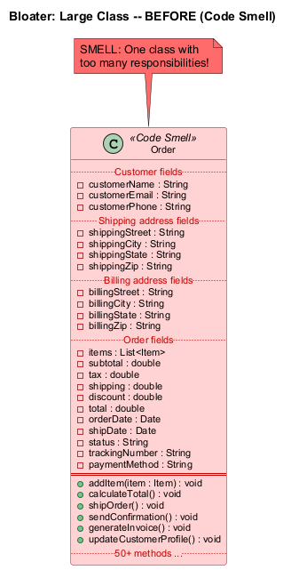

---

### Büyük Sınıf - Sonra (Yeniden Yapılandırılmış)

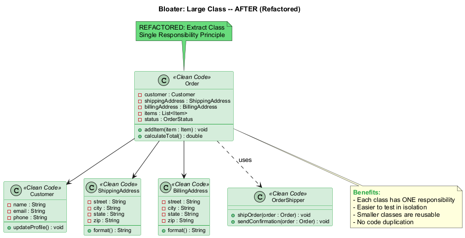

---

## Modül B: Şişkin #2 -- Büyük Sınıf (Large Class) (Java Örneği -- Önce)

```java
// KOKU: Büyük Sınıf -- Order çok fazla sorumluluk üstleniyor
public class Order {
    // Müşteri alanları
    private String customerName, customerEmail, customerPhone;
    // Kargo adresi alanları
    private String shippingStreet, shippingCity, shippingState, shippingZip;
    // Fatura adresi alanları
    private String billingStreet, billingCity, billingState, billingZip;
    // Sipariş alanları
    private List<Item> items;
    private double subtotal, tax, shipping, discount, total;
    private Date orderDate, shipDate, deliveryDate;
    private String status, trackingNumber, paymentMethod;

    // Sipariş, kargo, faturalama, bildirimler, raporlama metotları...
    // Birden fazla sorumluluğu kapsayan 50+ metot
    public void addItem(Item item) { /* ... */ }
    public void calculateTotal() { /* ... */ }
    public void shipOrder() { /* ... */ }
    public void sendConfirmation() { /* ... */ }
    public void generateInvoice() { /* ... */ }
    public void updateCustomerProfile() { /* ... */ }
}
```

---

## Modül B: Şişkin #2 -- Büyük Sınıf (Large Class) (Java Örneği -- Sonra)

```java
// YENİDEN YAPILANDIRILMIŞ: Sınıf Çıkarma -- her sınıfın tek bir sorumluluğu var
public class Order {
    private Customer customer;
    private ShippingAddress shippingAddress;
    private BillingAddress billingAddress;
    private List<Item> items;
    private OrderStatus status;

    public void addItem(Item item) { /* ... */ }
    public double calculateTotal() { /* ... */ }
}

public class Customer {
    private String name, email, phone;
    public void updateProfile() { /* ... */ }
}

public class ShippingAddress {
    private String street, city, state, zip;
}

public class BillingAddress {
    private String street, city, state, zip;
}

public class OrderShipper {
    public void shipOrder(Order order) { /* ... */ }
    public void sendConfirmation(Order order) { /* ... */ }
}
```

---

## Modül B: Şişkin #2 -- Büyük Sınıf (Large Class) (Tedavi ve Kazanç)

### Tedavi (Yeniden Yapılandırma Teknikleri)

| Teknik | Ne Zaman Kullanılır |
|---|---|
| **Sınıf Çıkarma (Extract Class)** | Sınıfın davranışının bir kısmı ayrı bir sınıfa ayrılabildiğinde |
| **Alt Sınıf Çıkarma (Extract Subclass)** | Sınıfın davranışının bir kısmı yalnızca bazı örneklerle ilgili olduğunda |
| **Arayüz Çıkarma (Extract Interface)** | İstemciye hangi işlemlerin ve davranışların mevcut olduğunu belirlemeniz gerektiğinde |
| **Gözlemlenen Veriyi Çoğaltma (Duplicate Observed Data)** | Büyük bir sınıf GUI'den sorumluysa, veri ve davranışı ayrı bir alan nesnesine taşıyın |

### Kazanç

- Geliştiriciler bir sınıf için çok sayıda özelliği hatırlamak zorunda kalmaz
- Büyük sınıfları bölmek sıklıkla **kod tekrarını ve gereksiz işlevselliği ortadan kaldırır**
- Her sınıfın **tek bir net amacı** vardır (Tek Sorumluluk İlkesi)
- Daha küçük sınıflar **izole olarak test etmek** daha kolaydır
- Daha küçük, odaklı sınıflar diğer bağlamlarda **yeniden kullanılabilir**

---

## Modül B: Şişkin #3 -- İlkel Takıntı (Primitive Obsession)

### Nedir?

Alan kavramları için küçük nesneler oluşturmak yerine **ilkel türlerin** (int, String, double, boolean) aşırı kullanımıdır.

### Belirtiler ve Semptomlar

- Basit görevler için **küçük nesneler yerine ilkellerin kullanımı** (para birimi, aralıklar, telefon numaraları için özel dizeler vb.)
- Bilgi kodlama için **sabit değerlerin kullanımı** (`USER_ADMIN_ROLE = 1` gibi)
- Veri dizilerinde kullanım için **alan adları olarak dize sabitlerinin kullanımı**

### Sorunun Nedenleri

- İlkeller "sadece bir değer saklamak için" oluşturulur ve sonunda kullanımları artar
- Bir alan oluşturmak, tamamen yeni bir sınıf oluşturmaktan daha kolaydır
- "Telefon numarası için sadece bir String kullanayım..."
- İlkeller genellikle tembellikten doğar: bir `int` veya `String` kullanmak yeni bir sınıf oluşturmaktan daha basit görünür

Referans: [RefactoringGuru -- İlkel Takıntı](https://refactoring.guru/smells/primitive-obsession)

---

## Modül B: Şişkin #3 -- İlkel Takıntı (Primitive Obsession) (Java Örneği -- Önce)

```java
// KOKU: İlkel Takıntı -- her yerde ilkeller
public class Employee {
    private String name;
    private String phoneNumber;        // PhoneNumber nesnesi olmalı
    private int currencyAmount;        // Kuruş mu? Dolar mı? Euro mu?
    private String zipCode;            // Format doğrulaması yapmalı
    private int temperatureInFahrenheit;
    private String startDate;          // Tarih için String mi? Gerçekten mi?
    private int employeeType;          // 1=Mühendis, 2=Satışçı, 3=Yönetici
    private String socialSecurityNumber; // Doğrulama yok!

    // Koşullarda kullanılan tür kodu
    public double calculatePay() {
        if (employeeType == 1) {
            return baseSalary;
        } else if (employeeType == 2) {
            return baseSalary + commission;
        } else if (employeeType == 3) {
            return baseSalary + bonus;
        }
        return 0;
    }
}
```

---

## Modül B: Şişkin #3 -- İlkel Takıntı (Primitive Obsession) (Java Örneği -- Sonra)

```java
// YENİDEN YAPILANDIRILMIŞ: Veri Değerini Nesneyle Değiştirme, Tür Kodunu Alt Sınıflarla Değiştirme
public class PhoneNumber {
    private String areaCode;
    private String number;
    public PhoneNumber(String areaCode, String number) {
        validate(areaCode, number);
        this.areaCode = areaCode;
        this.number = number;
    }
    private void validate(String areaCode, String number) { /* ... */ }
    public String format() { return "(" + areaCode + ") " + number; }
}

public class Money {
    private long amountInCents;
    private Currency currency;
    public Money(long amountInCents, Currency currency) {
        this.amountInCents = amountInCents;
        this.currency = currency;
    }
    public Money add(Money other) { /* para birimi güvenli toplama */ }
}

// Tür kodu çok biçimlilikle değiştirildi
abstract class Employee {
    abstract double calculatePay();
}
class Engineer extends Employee {
    double calculatePay() { return getBaseSalary(); }
}
```

---

## Modül B: Şişkin #3 -- İlkel Takıntı (Primitive Obsession) (Tedavi ve Kazanç)

### Tedavi (Yeniden Yapılandırma Teknikleri)

| Teknik | Ne Zaman Kullanılır |
|---|---|
| **Veri Değerini Nesneyle Değiştirme (Replace Data Value with Object)** | İlgili ilkel alanları gruplandırın ve ilişkili davranışı taşıyın |
| **Parametre Nesnesi Tanıtma (Introduce Parameter Object)** | İlkeller metot parametrelerinde gruplandığında |
| **Bütün Nesneyi Koruma (Preserve Whole Object)** | Bir nesneden birden fazla değer çıkarıp tek tek geçirdiğinizde |
| **Tür Kodunu Sınıfla Değiştirme (Replace Type Code with Class)** | Tür kodu değerleri davranışı etkilemediğinde |
| **Tür Kodunu Alt Sınıflarla Değiştirme (Replace Type Code with Subclasses)** | Tür kodu davranışı etkilediğinde |
| **Tür Kodunu Durum/Strateji ile Değiştirme (Replace Type Code with State/Strategy)** | Alt sınıflar kullanamadığınızda |
| **Diziyi Nesneyle Değiştirme (Replace Array with Object)** | Diziler karışık veri türleri içerdiğinde |

### Kazanç

- İlkeller yerine nesnelerin kullanımı sayesinde kod daha **esnek** hale gelir
- Kodun daha iyi **anlaşılabilirliği** ve organizasyonu
- Aynı veriyi işleyen **tekrarlanan kodu** bulmak daha kolaydır
- Değer nesnesi içinde **doğrulama** yapılabilir (örn. telefon numarası formatı)

---

## Modül B: Şişkin #4 -- Uzun Parametre Listesi (Long Parameter List)

### Nedir?

Bir metot **üçten veya dörtten fazla parametreye** sahiptir, bu da onu anlamayı ve doğru kullanmayı zorlaştırır.

### Belirtiler ve Semptomlar

- Tek satıra sığmayacak kadar uzun metot imzaları
- Birbirinden ayırt edilmesi zor parametreler
- Çağıranlar sıklıkla yanlış argümanları yanlış pozisyonlara geçirir

### Sorunun Nedenleri

- Uzun bir parametre listesi, **birkaç tür algoritmanın tek bir metotta birleştirilmesinden** sonra ortaya çıkabilir
- Uzun bir liste, **hangi algoritmanın çalıştırılacağını** ve nasıl çalıştırılacağını kontrol etmek için oluşturulmuş olabilir
- Uzun parametre listeleri, **sınıfları birbirinden daha bağımsız hale getirme** çabalarından da kaynaklanabilir (bir nesne geçirmek yerine tek tek değerler geçirilir)
- Uzun listeler "uzadıkça çelişkili ve kullanımı zor" hale gelir

Referans: [RefactoringGuru -- Uzun Parametre Listesi](https://refactoring.guru/smells/long-parameter-list)

---

## Modül B: Şişkin #4 -- Uzun Parametre Listesi (Long Parameter List) (Java Örneği -- Önce)

```java
// KOKU: Uzun Parametre Listesi -- 13 parametre!
public void createUser(String firstName, String lastName,
    String email, String phone, String street,
    String city, String state, String zipCode,
    String country, int age, String gender,
    boolean isActive, String role) {
    // ...
}

// Başka bir örnek -- hesaplanabilecek parametre değerleri
public double calculateFinalPrice(
    int quantity, double itemPrice,
    double seasonalDiscount, double memberDiscount,
    double taxRate, double shippingCost,
    boolean applyPromo) {
    double base = quantity * itemPrice;
    double discount = base * (seasonalDiscount + memberDiscount);
    double tax = (base - discount) * taxRate;
    return base - discount + tax + shippingCost;
}
```

---

## Modül B: Şişkin #4 -- Uzun Parametre Listesi (Long Parameter List) (Java Örneği -- Sonra)

```java
// YENİDEN YAPILANDIRILMIŞ: Parametre Nesnesi Tanıtma + Parametreyi Metot Çağrısıyla Değiştirme
public class UserInfo {
    private String firstName, lastName, email, phone;
    private int age;
    private String gender;
    private boolean isActive;
    private String role;
    // yapıcı, getter'lar...
}

public class Address {
    private String street, city, state, zipCode, country;
    // yapıcı, getter'lar...
}

public void createUser(UserInfo userInfo, Address address) {
    // Temiz, açık ve anlaması kolay
}

// Parametreyi Metot Çağrısıyla Değiştirme
public double calculateFinalPrice(int quantity, double itemPrice) {
    double base = quantity * itemPrice;
    double discount = base * getSeasonalDiscount() + getMemberDiscount();
    double tax = (base - discount) * getTaxRate();
    return base - discount + tax + getShippingCost();
    // Metot ihtiyaç duyduğu değerleri dahili olarak elde eder
}
```

---

## Modül B: Şişkin #4 -- Uzun Parametre Listesi (Long Parameter List) (Tedavi ve Kazanç)

### Tedavi (Yeniden Yapılandırma Teknikleri)

| Teknik | Ne Zaman Kullanılır |
|---|---|
| **Parametreyi Metot Çağrısıyla Değiştirme (Replace Parameter with Method Call)** | Bir parametre değeri, zaten mevcut olan başka bir nesnenin bir metodunu çağırarak elde edilebildiğinde |
| **Bütün Nesneyi Koruma (Preserve Whole Object)** | Tek tek alanlarını çıkarmak yerine bütün nesneyi geçirin |
| **Parametre Nesnesi Tanıtma (Introduce Parameter Object)** | Sık birlikte görünen ilgili parametreleri gruplamak için yeni bir sınıf oluşturun |

### Kazanç

- Daha okunabilir, **daha kısa kod**
- Yeniden yapılandırma, daha önce fark edilmeyen **tekrarlanan kodu** ortaya çıkarabilir
- Metot imzaları kendi kendini belgeleme haline gelir

### Ne Zaman Görmezden Gelinir

- Parametre sayısını azaltmak için sınıflar arasında istenmeyen **bağımlılıklar** oluşturmayın
- Parametreler arasındaki tek bağlantı bu metotta birlikte görünmeleri ise, parametre nesnesi tanıtmak erken olabilir

---

## Modül B: Şişkin #5 -- Veri Kümeleri (Data Clumps)

### Nedir?

**Aynı değişken grupları** kodun farklı bölümlerinde tekrar tekrar görünür. Bu kümeler kendi sınıflarına dönüştürülmelidir.

### Belirtiler ve Semptomlar

- Aynı alan grubu birden fazla sınıfta görünür (örn. cadde, şehir, postaKodu)
- Aynı parametre grubu birden fazla metot imzasında görünür
- Gruptan bir değeri kaldırmak geri kalanını anlamsız kılar

### Sorunun Nedenleri

- Veri kümeleri genellikle **kopyala-yapıştır** programlama yapıldığında ortaya çıkar
- Veri grupları birlikte dolaştırılır ancak asla bir kavram olarak resmileştirilmez
- İyi bir test: **veri değerlerinden birini silin** -- geri kalanlar hala anlamlı mı? Değilse, bu bir kümedir

Referans: [RefactoringGuru -- Veri Kümeleri](https://refactoring.guru/smells/data-clumps)

---

## Modül B: Şişkin #5 -- Veri Kümeleri (Data Clumps) (Java Örneği -- Önce)

```java
// KOKU: Veri Kümeleri -- aynı üç alan her yerde tekrarlanıyor
class Customer {
    private String street;
    private String city;
    private String zipCode;
    // diğer alanlar...
}

class Order {
    private String shippingStreet;
    private String shippingCity;
    private String shippingZipCode;
    // diğer alanlar...
}

class Warehouse {
    private String street;
    private String city;
    private String zipCode;
    // diğer alanlar...
}

// Metot imzalarında aynı veri kümesi
void deliverOrder(String street, String city, String zipCode,
                  String recipientName) {
    // ...
}
```

---

## Modül B: Şişkin #5 -- Veri Kümeleri (Data Clumps) (Java Örneği -- Sonra)

```java
// YENİDEN YAPILANDIRILMIŞ: Sınıf Çıkarma -- Address veri kümesini kapsüller
public class Address {
    private String street;
    private String city;
    private String zipCode;

    public Address(String street, String city, String zipCode) {
        this.street = street;
        this.city = city;
        this.zipCode = zipCode;
    }

    public String format() {
        return street + ", " + city + " " + zipCode;
    }
    // getter'lar, equals, hashCode...
}

class Customer { private Address address; }
class Order { private Address shippingAddress; }
class Warehouse { private Address address; }

// Parametre Nesnesi Tanıtma ile temiz metot imzası
void deliverOrder(Address deliveryAddress, String recipientName) {
    // ...
}
```

---

## Modül B: Şişkin #5 -- Veri Kümeleri (Data Clumps) (Tedavi ve Kazanç)

### Tedavi (Yeniden Yapılandırma Teknikleri)

| Teknik | Ne Zaman Kullanılır |
|---|---|
| **Sınıf Çıkarma (Extract Class)** | Alan grubunu yeni bir sınıfa taşıyın |
| **Parametre Nesnesi Tanıtma (Introduce Parameter Object)** | Veri kümeleri olan metot imzaları için |
| **Bütün Nesneyi Koruma (Preserve Whole Object)** | Tek tek alanlar yerine bütün nesneyi geçirin |

### Kazanç

- Kodun **anlaşılmasını ve organizasyonunu** iyileştirir
- Tekrarlanan alan gruplarını ortadan kaldırarak **kod boyutunu** azaltır
- Veriyle ilişkili işlemler yeni sınıfa taşınabilir (örn. adres biçimlendirme, doğrulama)

### Ne Zaman Görmezden Gelinir

- Tam nesneleri parametre olarak geçirmek sınıflar arasında **istenmeyen bağımlılıklar** oluşturabilir
- Veri grubu yalnızca iki yerde birlikte görünüyorsa, yeni bir sınıfın ek yükü buna değmeyebilir

---

## Modül B: Özet

### Temel Noktalar -- Şişkinler (Bloaters)

| Koku | Temel Çıkarım |
|---|---|
| **Uzun Metot (Long Method)** | Bir metot ~10 satırdan uzunsa, daha küçük metotlar çıkarmayı düşünün |
| **Büyük Sınıf (Large Class)** | Bir sınıfın birden fazla sorumluluğu varsa, bölün |
| **İlkel Takıntı (Primitive Obsession)** | Alan kavramları için ilkelleri küçük değer nesneleriyle değiştirin |
| **Uzun Parametre Listesi (Long Parameter List)** | 3-4'ten fazla parametre mi? Parametre nesneleri tanıtın veya bütün nesneleri geçirin |
| **Veri Kümeleri (Data Clumps)** | Her zaman birlikte görünen veri grupları kendi sınıflarına aittir |

### Ortak Konu

Tüm şişkinler **zamanla kademeli olarak büyür**. Kimse ilk gün kasıtlı olarak 200 satırlık bir metot yazmaz. Dikkat ve düzenli yeniden yapılandırma, şişkinlerin tutunmasını önler.

> "Bir metot içinde bir şeyi yorumlama ihtiyacı hissediyorsanız, o kodu alıp yeni bir metoda koymalısınız. Tek bir satır bile, açıklama gerektiriyorsa ayrı bir metoda çıkarılabilir ve çıkarılmalıdır." -- Martin Fowler

---

<!-- _backgroundColor: aqua -->

<!-- _color: orange -->

<!-- paginate: false -->

# Modül C: Nesne Yönelim Kötüye Kullananlar (OO Abusers)

### Nesne Yönelimli Programlama İlkelerinin Eksik veya Yanlış Uygulanması

---

<!-- paginate: true -->

## Modül C: Nesne Yönelim Kötüye Kullananlar (OO Abusers) -- Genel Bakış

**Nesne Yönelim Kötüye Kullananlar (OO Abusers)**, nesne yönelimli programlama ilkelerinin eksik veya yanlış uygulandığı durumlardır.

### 4 NE Kötüye Kullanan Kokusu

| # | Koku | Temel Sorun |
|---|---|---|
| 1 | **Switch İfadeleri (Switch Statements)** | Çok biçimlilik kullanabilecek karmaşık `switch` veya `if` zincirleri |
| 2 | **Geçici Alan (Temporary Field)** | Yalnızca belirli koşullar altında değer alan alanlar |
| 3 | **Reddedilen Miras (Refused Bequest)** | Alt sınıf, üst sınıfının yalnızca bazı metot ve özelliklerini kullanır |
| 4 | **Farklı Arayüzlere Sahip Alternatif Sınıflar (Alternative Classes with Different Interfaces)** | İki sınıf aynı işlevleri yerine getirir ancak farklı metot adlarına sahiptir |

> Tüm bu kokular, NYP ilkelerinin eksik veya yanlış uygulamalarını temsil eder.

Referans: [RefactoringGuru -- NE Kötüye Kullananlar](https://refactoring.guru/refactoring/smells/oo-abusers)

---

## Modül C: NE Kötüye Kullanan #1 -- Switch İfadeleri (Switch Statements)

### Nedir?

Bir tür veya koşula dayalı olarak farklı eylemler gerçekleştiren karmaşık bir `switch` operatörünüz veya `if` ifadeleri diziniz vardır.

### Belirtiler ve Semptomlar

- Birden fazla yerde aynı koşulu test eden karmaşık bir `switch` veya `if-else` zinciri
- Aynı `switch` yapısının, türün işlendiği her yerde muhtemelen **tekrarlanması**
- Yeni bir tür eklemek **her** `switch` ifadesini değiştirmeyi gerektirir

### Sorunun Nedenleri

- `switch` ve `case`'in nispeten nadir kullanımı, nesne yönelimli kodun ayırt edici özelliklerinden biridir
- Genellikle bir `switch` programın farklı yerlerinde dağılmıştır
- Yeni bir koşul eklendiğinde, tüm `switch` kodunu bulup değiştirmeniz gerekir
- Genel kural olarak, **bir `switch` gördüğünüzde çok biçimliliği düşünmelisiniz**

Referans: [RefactoringGuru -- Switch İfadeleri](https://refactoring.guru/smells/switch-statements)

---

### Switch İfadeleri - Önce (Kod Kokusu)

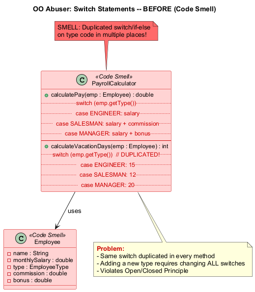

---

### Switch İfadeleri - Sonra (Yeniden Yapılandırılmış)

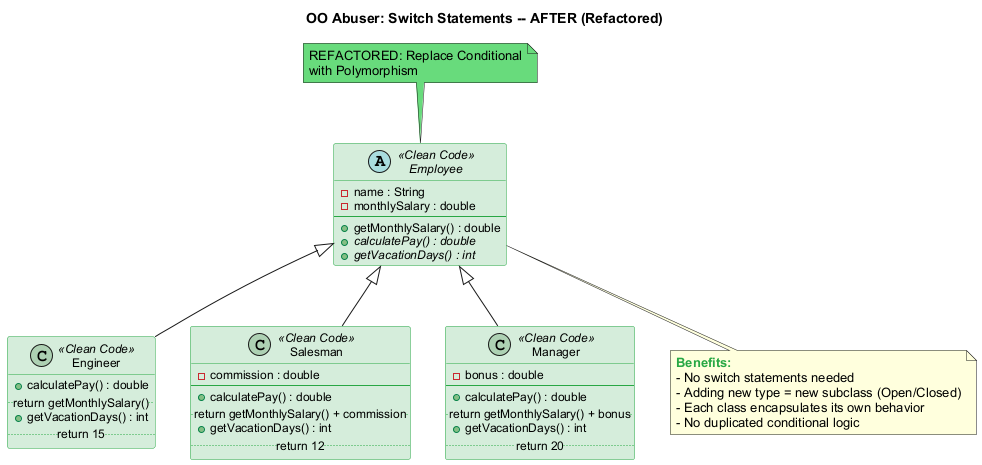

---

## Modül C: NE Kötüye Kullanan #1 -- Switch İfadeleri (Switch Statements) (Java Örneği -- Önce)

```java
// KOKU: Switch İfadeleri -- tekrarlanan koşullu mantık
public class PayrollCalculator {

    public double calculatePay(Employee employee) {
        switch (employee.getType()) {
            case ENGINEER:
                return employee.getMonthlySalary();
            case SALESMAN:
                return employee.getMonthlySalary()
                       + employee.getCommission();
            case MANAGER:
                return employee.getMonthlySalary()
                       + employee.getBonus();
            default:
                throw new RuntimeException("Invalid employee type");
        }
    }

    // Aynı switch başka bir metotta tekrarlanıyor!
    public int calculateVacationDays(Employee employee) {
        switch (employee.getType()) {
            case ENGINEER:  return 15;
            case SALESMAN:  return 12;
            case MANAGER:   return 20;
            default: throw new RuntimeException("Invalid type");
        }
    }
}
```

---

## Modül C: NE Kötüye Kullanan #1 -- Switch İfadeleri (Switch Statements) (Java Örneği -- Sonra)

```java
// YENİDEN YAPILANDIRILMIŞ: Koşullu İfadeyi Çok Biçimlilikle Değiştirme
public abstract class Employee {
    private double monthlySalary;

    public abstract double calculatePay();
    public abstract int getVacationDays();

    public double getMonthlySalary() { return monthlySalary; }
}

public class Engineer extends Employee {
    public double calculatePay() { return getMonthlySalary(); }
    public int getVacationDays() { return 15; }
}

public class Salesman extends Employee {
    private double commission;
    public double calculatePay() {
        return getMonthlySalary() + commission;
    }
    public int getVacationDays() { return 12; }
}

public class Manager extends Employee {
    private double bonus;
    public double calculatePay() {
        return getMonthlySalary() + bonus;
    }
    public int getVacationDays() { return 20; }
}
```

---

## Modül C: NE Kötüye Kullanan #1 -- Switch İfadeleri (Switch Statements) (Tedavi ve Kazanç)

### Tedavi (Yeniden Yapılandırma Teknikleri)

| Teknik | Ne Zaman Kullanılır |
|---|---|
| **Tür Kodunu Alt Sınıflarla Değiştirme (Replace Type Code with Subclasses)** | Her tür için alt sınıflar oluşturun |
| **Koşullu İfadeyi Çok Biçimlilikle Değiştirme (Replace Conditional with Polymorphism)** | Koşullar yerine metot geçersiz kılma kullanın |
| **Tür Kodunu Durum/Strateji ile Değiştirme (Replace Type Code with State/Strategy)** | Alt sınıflar mümkün olmadığında |
| **Parametreyi Açık Metotlarla Değiştirme (Replace Parameter with Explicit Methods)** | Koşullar aynı metodu farklı parametrelerle çağırdığında |
| **Null Nesnesi Tanıtma (Introduce Null Object)** | Null koşulları için |

### Kazanç

- Çok biçimlilik yoluyla iyileştirilmiş **kod organizasyonu**
- **Yeni türler eklemek daha kolay** -- sadece yeni bir alt sınıf ekleyin (Açık/Kapalı İlkesi)
- Kod tabanı boyunca dağılmış **tekrarlanan koşullu mantığı ortadan kaldırır**

### Ne Zaman Görmezden Gelinir

- Bir `switch` **basit eylemler** gerçekleştirdiğinde ve yalnızca tek bir yerde göründüğünde
- Basit fabrika metotları (Factory Method veya Abstract Factory kalıpları) genellikle kabul edilebilir
- Switch'in değişme olasılığı düşükse, çok biçimlilik aşırıya kaçabilir

---

## Modül C: NE Kötüye Kullanan #2 -- Geçici Alan (Temporary Field)

### Nedir?

Geçici alanlar, değerlerini (ve dolayısıyla nesneler tarafından ihtiyaç duyulmaları) yalnızca **belirli koşullar altında** alır. Bu koşulların dışında boştur veya alakasız veri içerir.

### Belirtiler ve Semptomlar

- Yalnızca belirli algoritma yürütmesi sırasında doldurulan ve kullanılan nesne alanları
- Zamanın çoğunda `null` veya boş olan alanlar
- **Neredeyse her zaman boş** olan alanlarda veri görmeyi beklersiniz

### Sorunun Nedenleri

- Genellikle geçici alanlar, **büyük miktarda girdi gerektiren** bir algoritmada kullanılmak üzere oluşturulur
- Programcı, metotta birçok parametre oluşturmak yerine bu veriler için sınıfta **alanlar** oluşturmaya karar verir
- Bu alanlar yalnızca algoritmada kullanılır ve geri kalan zamanda işe yaramazdır
- Bu kod anlaşılması zordur çünkü nesne alanlarının tutarlı bir şekilde anlamlı veri içermesini beklersiniz

Referans: [RefactoringGuru -- Geçici Alan](https://refactoring.guru/smells/temporary-field)

---

## Modül C: NE Kötüye Kullanan #2 -- Geçici Alan (Temporary Field) (Java Örneği -- Önce)

```java
// KOKU: Geçici Alan -- alanlar yalnızca ödeme sırasında anlamlı
public class Order {
    private List<Item> items;
    private Customer customer;

    // Bu alanlar yalnızca ödeme sırasında kullanılıyor!
    private double taxRate;          // Yalnızca ödeme sırasında ayarlanır
    private String promoCode;        // Yalnızca indirim uygulanırken ayarlanır
    private double shippingWeight;   // Yalnızca fiziksel ürünler için geçerli
    private String shippingMethod;   // Kargo seçilene kadar boş

    public double checkout() {
        // taxRate, promoCode, shippingWeight, shippingMethod kullanılır
        // Sipariş ödeme aşamasında değilken bunlar kafa karıştırıcıdır
        double subtotal = calculateSubtotal();
        double discount = promoCode != null ? applyPromo(promoCode) : 0;
        double tax = subtotal * taxRate;
        double shipping = calculateShipping(shippingWeight, shippingMethod);
        return subtotal - discount + tax + shipping;
    }
}
```

---

## Modül C: NE Kötüye Kullanan #2 -- Geçici Alan (Temporary Field) (Java Örneği -- Sonra)

```java
// YENİDEN YAPILANDIRILMIŞ: Sınıf Çıkarma -- ayrı ödeme bağlamı
public class Order {
    private List<Item> items;
    private Customer customer;

    public double calculateSubtotal() {
        return items.stream()
            .mapToDouble(item -> item.getPrice() * item.getQuantity())
            .sum();
    }
}

public class CheckoutContext {
    private double taxRate;
    private String promoCode;
    private double shippingWeight;
    private String shippingMethod;

    public CheckoutContext(double taxRate, String promoCode,
                           double shippingWeight, String shippingMethod) {
        this.taxRate = taxRate;
        this.promoCode = promoCode;
        this.shippingWeight = shippingWeight;
        this.shippingMethod = shippingMethod;
    }

    public double calculateFinalPrice(Order order) {
        double subtotal = order.calculateSubtotal();
        double discount = promoCode != null ? applyPromo(promoCode, subtotal) : 0;
        double tax = subtotal * taxRate;
        double shipping = calculateShipping(shippingWeight, shippingMethod);
        return subtotal - discount + tax + shipping;
    }
}
```

---

## Modül C: NE Kötüye Kullanan #2 -- Geçici Alan (Temporary Field) (Tedavi ve Kazanç)

### Tedavi (Yeniden Yapılandırma Teknikleri)

| Teknik | Ne Zaman Kullanılır |
|---|---|
| **Sınıf Çıkarma (Extract Class)** | Geçici alanları ve ilgili işlemleri ayrı bir sınıfa taşıyın (bir metot nesnesi oluşturur) |
| **Null Nesnesi Tanıtma (Introduce Null Object)** | Geçici alan varlığını kontrol eden koşullu kodu bir Null Nesnesi ile değiştirin |
| **Metodu Metot Nesnesiyle Değiştirme (Replace Method with Method Object)** | Geçici alanlar karmaşık bir algoritma için mevcutsa, tüm algoritmayı ayrı bir sınıfa çıkarın |

### Kazanç

- **Daha iyi kod açıklığı ve organizasyonu** -- alanların ne zaman anlamlı değerlere sahip olduğu konusunda artık kafa karışıklığı yok
- Bir sınıftaki tüm alanlar her zaman anlamlıdır
- Kod hakkında mantık yürütmek daha kolay hale gelir

### Ne Zaman Görmezden Gelinir

- Geçici durum gerçekten geçiciyse ve açıkça belgelenmişse
- Algoritma yeterince basitse ve geçici alanlar kafa karışıklığına neden olmuyorsa

---

## Modül C: NE Kötüye Kullanan #3 -- Reddedilen Miras (Refused Bequest)

### Nedir?

Bir alt sınıf, üst sınıflarından miras alınan metot ve özelliklerin yalnızca **bir kısmını** kullanıyorsa, hiyerarşi dengesizdir. İhtiyaç duyulmayan metotlar ya kullanılmadan kalabilir ya da **istisna fırlatmak üzere yeniden tanımlanabilir**.

### Belirtiler ve Semptomlar

- Bir alt sınıf, üst metotları `UnsupportedOperationException` fırlatmak için geçersiz kılar
- Bir alt sınıf, miras alınan metotların çoğunu kullanılmadan bırakır
- Kalıtım ilişkisi gerçek bir "bir-tür" ilişkisini modellemez

### Sorunun Nedenleri

- Birisi, sınıflar arasında kalıtım oluşturmaya yalnızca bir üst sınıftaki **kodu yeniden kullanma arzusuyla** motive olmuştur
- Ancak üst sınıf ve alt sınıf **doğaları gereği tamamen farklıdır**
- İkisinin de dört bacağı olduğu için Köpeği Sandalyeden türetmeye benzer

Referans: [RefactoringGuru -- Reddedilen Miras](https://refactoring.guru/smells/refused-bequest)

---

## Modül C: NE Kötüye Kullanan #3 -- Reddedilen Miras (Refused Bequest) (Java Örneği -- Önce)

```java
// KOKU: Reddedilen Miras -- Dog kullanamayacağı fly() metodunu miras alıyor
public class Animal {
    public void walk() { /* yürüme mantığı */ }
    public void fly()  { /* uçma mantığı */ }
    public void swim() { /* yüzme mantığı */ }
    public void eat()  { /* yeme mantığı */ }
}

public class Dog extends Animal {
    // Dog yürüyebilir, yüzebilir ve yiyebilir -- ama UÇAMAZ
    @Override
    public void fly() {
        throw new UnsupportedOperationException("Dogs can't fly!");
    }
}

public class Fish extends Animal {
    // Fish yüzebilir ve yiyebilir -- ama YÜRÜYEMEZ veya UÇAMAZ
    @Override
    public void walk() {
        throw new UnsupportedOperationException("Fish can't walk!");
    }
    @Override
    public void fly() {
        throw new UnsupportedOperationException("Fish can't fly!");
    }
}
```

---

## Modül C: NE Kötüye Kullanan #3 -- Reddedilen Miras (Refused Bequest) (Java Örneği -- Sonra)

```java
// YENİDEN YAPILANDIRILMIŞ: Üst Sınıf Çıkarma + Kalıtımı Devretmeyle Değiştirme
public abstract class Animal {
    public abstract void eat();
}

public interface Walkable { void walk(); }
public interface Swimmable { void swim(); }
public interface Flyable { void fly(); }

public class Dog extends Animal implements Walkable, Swimmable {
    public void eat()  { /* yeme mantığı */ }
    public void walk() { /* yürüme mantığı */ }
    public void swim() { /* yüzme mantığı */ }
    // fly() metodu yok -- köpekler uçmaz!
}

public class Eagle extends Animal implements Walkable, Flyable {
    public void eat()  { /* yeme mantığı */ }
    public void walk() { /* yürüme mantığı */ }
    public void fly()  { /* uçma mantığı */ }
}

public class Fish extends Animal implements Swimmable {
    public void eat()  { /* yeme mantığı */ }
    public void swim() { /* yüzme mantığı */ }
}
```

---

## Modül C: NE Kötüye Kullanan #3 -- Reddedilen Miras (Refused Bequest) (Tedavi ve Kazanç)

### Tedavi (Yeniden Yapılandırma Teknikleri)

| Teknik | Ne Zaman Kullanılır |
|---|---|
| **Kalıtımı Devretmeyle Değiştirme (Replace Inheritance with Delegation)** | Kalıtım mantıksal olarak anlam ifade etmediğinde, üst-alt ilişkisini ortadan kaldırın ve bunun yerine bileşim kullanın |
| **Üst Sınıf Çıkarma (Extract Superclass)** | Kalıtım uygunsa, her iki sınıfın da reddedilen metotlar olmadan genişletebileceği yeni bir ara üst sınıf oluşturun |

### Kazanç

- Kod **açıklığını ve organizasyonunu** iyileştirir
- Kafa karıştırıcı veya anlamsız kalıtım hiyerarşilerini ortadan kaldırır
- **Liskov Yerine Geçme İlkesine** uyar (bir alt tür, üst türünün yerine geçebilmelidir)
- `UnsupportedOperationException` fırlatan metotlar artık yok

### Ne Zaman Görmezden Gelinir

- Reddedilen miras minimalse ve kafa karışıklığına neden olmuyorsa
- Kalıtım yoluyla yeniden kullanım önemli faydalar sağlıyorsa ve reddedilen metotlar açıkça belgelenmişse

---

## Modül C: NE Kötüye Kullanan #4 -- Farklı Arayüzlere Sahip Alternatif Sınıflar (Alternative Classes with Different Interfaces)

### Nedir?

İki sınıf **aynı işlevleri** yerine getirir ancak **farklı metot adlarına** sahiptir. Ortak bir arayüzü paylaşmalıdırlar.

### Belirtiler ve Semptomlar

- Aynı şeyi yapan ancak farklı metot adlarına sahip iki sınıf
- İstemci kodu, iki sınıf arasında seçim yapmak için `if-else` kullanır
- Sınıflar birbirlerinin yerine kullanılamaz

### Sorunun Nedenleri

- Bir sınıfı oluşturan geliştirici muhtemelen işlevsel olarak eşdeğer bir sınıfın zaten mevcut olduğunu **bilmiyordu**
- Ya da bağımsız olarak oluşturmuş ve arayüzleri birleştirmeyi düşünmemiştir

Referans: [RefactoringGuru -- Farklı Arayüzlere Sahip Alternatif Sınıflar](https://refactoring.guru/smells/alternative-classes-with-different-interfaces)

---

## Modül C: NE Kötüye Kullanan #4 -- Alternatif Sınıflar (Java Örneği -- Önce)

```java
// KOKU: Farklı Arayüzlere Sahip Alternatif Sınıflar
public class EmailNotifier {
    public void sendEmail(String to, String subject, String body) {
        // e-posta bildirimi gönderir
    }
}

public class SMSNotifier {
    public void dispatchSMS(String phoneNumber, String message) {
        // SMS bildirimi gönderir
    }
}

// İstemci kodu her birinin belirli arayüzünü bilmek zorunda
public class NotificationService {
    public void notifyUser(User user, String message) {
        if (user.prefersEmail()) {
            EmailNotifier emailer = new EmailNotifier();
            emailer.sendEmail(user.getEmail(), "Notification", message);
        } else {
            SMSNotifier sms = new SMSNotifier();
            sms.dispatchSMS(user.getPhone(), message);
        }
    }
}
```

---

## Modül C: NE Kötüye Kullanan #4 -- Alternatif Sınıflar (Java Örneği -- Sonra)

```java
// YENİDEN YAPILANDIRILMIŞ: Üst Sınıf Çıkarma / ortak arayüz
public interface Notifier {
    void send(String recipient, String message);
}

public class EmailNotifier implements Notifier {
    @Override
    public void send(String recipient, String message) {
        // 'recipient' (e-posta adresi) adresine e-posta bildirimi gönderir
    }
}

public class SMSNotifier implements Notifier {
    @Override
    public void send(String recipient, String message) {
        // 'recipient' (telefon numarası) numarasına SMS bildirimi gönderir
    }
}

// İstemci kodu ortak arayüzü kullanır -- çok biçimlilik!
public class NotificationService {
    public void notifyUser(User user, String message) {
        Notifier notifier = user.prefersEmail()
            ? new EmailNotifier()
            : new SMSNotifier();
        notifier.send(user.getContactInfo(), message);
    }
}
```

---

## Modül C: NE Kötüye Kullanan #4 -- Alternatif Sınıflar (Tedavi ve Kazanç)

### Tedavi (Yeniden Yapılandırma Teknikleri)

| Teknik | Ne Zaman Kullanılır |
|---|---|
| **Metodu Yeniden Adlandırma (Rename Method)** | Alternatif sınıflar arasında metot adlarını tutarlı hale getirin |
| **Metot Taşıma / Parametre Ekleme / Metodu Parametreleme (Move Method / Add Parameter / Parameterize Method)** | Metot imzalarını ve uygulamalarını hizalayın |
| **Üst Sınıf Çıkarma (Extract Superclass)** | İşlevselliğin yalnızca bir kısmı tekrarlanıyorsa, ortak parçaları bir üst sınıfa çıkarın |
| **Gereksiz sınıfı silme** | Birleştirildikten sonra, tekrarlanan sınıflardan biri kaldırılabilir |

### Kazanç

- Gereksiz **tekrarlanan kodu** ortadan kaldırır, kodu daha hafif hale getirir
- Birleşik bir arayüz aracılığıyla kod daha **okunabilir** ve anlaşılır hale gelir
- **Çok biçimliliği** etkinleştirir -- istemciler ortak arayüzü birbirinin yerine kullanabilir

### Ne Zaman Görmezden Gelinir

- Bazen sınıfları birleştirmek, alternatif sınıflar her biri kendi sürümlemesine sahip **farklı kütüphanelerde** olduğunda imkansızdır

---

## Modül C: Özet

### Temel Noktalar -- Nesne Yönelim Kötüye Kullananlar (OO Abusers)

| Koku | Temel Çıkarım |
|---|---|
| **Switch İfadeleri (Switch Statements)** | Çok biçimlilikle değiştirin; koşullar yerine alt sınıfları düşünün |
| **Geçici Alan (Temporary Field)** | Ayrı bir sınıfa çıkarın; alanlar her zaman anlamlı olmalıdır |
| **Reddedilen Miras (Refused Bequest)** | "Bir-tür" ilişkisi yanlışsa kalıtımı devretmeyle değiştirin |
| **Farklı Arayüzlere Sahip Alt. Sınıflar** | Arayüzleri birleştirin; üst sınıf veya ortak arayüz çıkarın |

### Ortak Konu

Tüm NE Kötüye Kullananlar, NYP ilkelerini **yanlış anlama veya yanlış uygulamadan** kaynaklanır. Çözüm neredeyse her zaman şudur: çok biçimliliği doğru kullanın, uygun olduğunda kalıtım yerine bileşimi tercih edin ve temiz arayüzler tasarlayın.

> "Bir switch ifadesi gördüğünüzde, çok biçimliliği düşünün." -- RefactoringGuru

---

<!-- _backgroundColor: aqua -->

<!-- _color: orange -->

<!-- paginate: false -->

# Modül D: Değişim Engelleyiciler (Change Preventers)

### Kod Değiştirmeyi Orantısız Derecede Zorlaştıran Kokular

---

<!-- paginate: true -->

## Modül D: Değişim Engelleyiciler (Change Preventers) -- Genel Bakış

**Değişim Engelleyiciler (Change Preventers)**, kodunuzda bir yerde bir şeyi değiştirmeniz gerektiğinde, diğer birçok yerde de değişiklik yapmanız gerektiği anlamına gelen kokulardır. Sonuç olarak program geliştirme çok daha pahalı ve karmaşık hale gelir.

### 3 Değişim Engelleyici Kokusu

| # | Koku | Temel Sorun |
|---|---|---|
| 1 | **Iraksak Değişim (Divergent Change)** | Bir sınıf farklı nedenlerle farklı şekillerde sık sık değiştirilir |
| 2 | **Saçma Ameliyat (Shotgun Surgery)** | Tek bir değişiklik birçok farklı sınıfta düzenleme gerektirir |
| 3 | **Paralel Kalıtım Hiyerarşileri (Parallel Inheritance Hierarchies)** | Bir hiyerarşide alt sınıf oluşturmak diğerinde de oluşturmaya zorlar |

> Bu kokular bazı açılardan **zıttır**: Iraksak Değişim bir sınıfın birçok değişiklikten muzdarip olmasıdır, Saçma Ameliyat ise bir değişikliğin birçok sınıfı etkilemesidir.

Referans: [RefactoringGuru -- Değişim Engelleyiciler](https://refactoring.guru/refactoring/smells/change-preventers)

---

## Modül D: Değişim Engelleyici #1 -- Iraksak Değişim (Divergent Change)

### Nedir?

Bir sınıfta değişiklik yaptığınızda kendinizi **birbiriyle ilgisiz birçok metodu** değiştirmek zorunda bulursunuz. Örneğin, yeni bir ürün türü eklerken ürünleri bulma, görüntüleme ve sipariş etme metotlarını değiştirmeniz gerekir.

### Belirtiler ve Semptomlar

- Bir sınıf farklı, birbiriyle ilgisiz nedenlerle sık değişiklik gerektirir
- Bir sınıf farklı sınıflara ait olması gereken sorumlulukları biriktirmiştir
- Sınıf **Tek Sorumluluk İlkesini** ihlal eder

### Sorunun Nedenleri

- Bu dağınık değişiklikler tipik olarak **kötü program yapısından** veya kopyala-yapıştır programlamadan kaynaklanır
- Bir sınıf zamanla kademeli olarak birden fazla sorumluluk üstlenmiştir
- "Bu Order sınıfı -- görüntüleme mantığını da buraya ekleyeyim"

Referans: [RefactoringGuru -- Iraksak Değişim](https://refactoring.guru/smells/divergent-change)

---

### Iraksak Değişim (Diyagram)

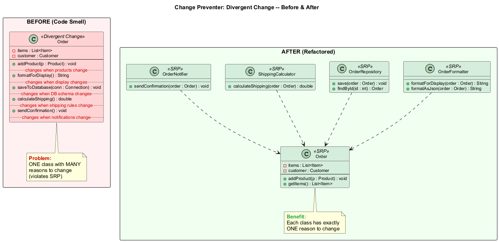

---

## Modül D: Değişim Engelleyici #1 -- Iraksak Değişim (Divergent Change) (Java Örneği -- Önce)

```java
// KOKU: Iraksak Değişim -- bir sınıf, birçok değişiklik nedeni
public class Order {
    private List<Item> items;
    private Customer customer;

    // Ürün türleri değiştiğinde değişir
    public void addProduct(Product p) { /* ... */ }

    // Görüntüleme formatı değiştiğinde değişir
    public String formatForDisplay() {
        return "Order: " + items.toString(); // HTML mi? JSON mu? XML mi?
    }

    // Veritabanı şeması değiştiğinde değişir
    public void saveToDatabase(Connection conn) {
        String sql = "INSERT INTO orders ...";
        // JDBC kodu burada
    }

    // Kargo kuralları değiştiğinde değişir
    public double calculateShipping() {
        if (getTotalWeight() > 50) return 15.99;
        return 5.99;
    }

    // Bildirim gereksinimleri değiştiğinde değişir
    public void sendConfirmation() {
        // e-posta gönderme mantığı
    }
}
```

---

## Modül D: Değişim Engelleyici #1 -- Iraksak Değişim (Divergent Change) (Java Örneği -- Sonra)

```java
// YENİDEN YAPILANDIRILMIŞ: Sınıf Çıkarma -- her sınıfın tek bir değişiklik nedeni var
public class Order {
    private List<Item> items;
    private Customer customer;
    public void addProduct(Product p) { /* ... */ }
    public List<Item> getItems() { return items; }
}

public class OrderFormatter {
    public String formatForDisplay(Order order) {
        return "Order: " + order.getItems().toString();
    }
    public String formatAsJson(Order order) { /* ... */ }
}

public class OrderRepository {
    public void save(Order order) { /* veritabanı mantığı */ }
    public Order findById(int id) { /* veritabanı mantığı */ }
}

public class ShippingCalculator {
    public double calculateShipping(Order order) { /* kargo kuralları */ }
}

public class OrderNotifier {
    public void sendConfirmation(Order order) { /* e-posta mantığı */ }
}
```

---

## Modül D: Değişim Engelleyici #1 -- Iraksak Değişim (Divergent Change) (Tedavi ve Kazanç)

### Tedavi (Yeniden Yapılandırma Teknikleri)

| Teknik | Ne Zaman Kullanılır |
|---|---|
| **Sınıf Çıkarma (Extract Class)** | Sınıfın davranışını her biri tek bir sorumluluğa sahip ayrı sınıflara bölün |
| **Üst Sınıf Çıkarma (Extract Superclass)** | Aynı davranışı paylaşan sınıfları kalıtım yoluyla birleştirin |
| **Alt Sınıf Çıkarma (Extract Subclass)** | İlgili ancak farklı davranışları kalıtım kullanarak düzenleyin |

### Kazanç

- **Kod organizasyonunu** iyileştirir -- her sınıf tam olarak bir nedenle değişir
- Kod tabanı boyunca **kod tekrarını** azaltır
- **Destek ve bakımı** basitleştirir -- değişiklikler yerelleştirilir
- **Tek Sorumluluk İlkesini** (SRP) takip eder

### Iraksak Değişim vs. Saçma Ameliyat

| Iraksak Değişim (Divergent Change) | Saçma Ameliyat (Shotgun Surgery) |
|---|---|
| Bir sınıfta birçok **farklı değişiklik** | Bir değişiklik **birçok sınıfı** etkiler |
| Bir sınıf, birçok değişiklik nedeni | Bir değişiklik nedeni, birçok sınıf |

---

## Modül D: Değişim Engelleyici #2 -- Saçma Ameliyat (Shotgun Surgery)

### Nedir?

Herhangi bir değişiklik yapmak, birçok **farklı sınıfta** birçok **küçük değişiklik** yapmanızı gerektirir.

### Belirtiler ve Semptomlar

- Tek bir mantıksal değişiklik (alan ekleme, kural değiştirme) 5'ten fazla sınıfa dokunmayı gerektirir
- Dağılmış konumlardan birinde değişiklik yapmayı sıklıkla unutursunuz
- Dağılmış sınıfların hepsi aynı endişeyle ilgilenir

### Sorunun Nedenleri

- **Tek bir sorumluluk** çok sayıda sınıf arasında **bölünmüştür**
- Bu, Iraksak Değişim yeniden yapılandırmasının aşırı hevesli uygulanmasından sonra olabilir -- bir sınıfı çok agresif bölme
- İlgili kodun farklı yerlere taşındığı artımlı geliştirme

Referans: [RefactoringGuru -- Saçma Ameliyat](https://refactoring.guru/smells/shotgun-surgery)

---

### Saçma Ameliyat (Diyagram)

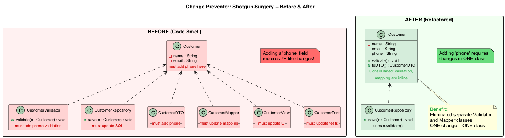

---

## Modül D: Değişim Engelleyici #2 -- Saçma Ameliyat (Shotgun Surgery) (Java Örneği -- Önce)

```java
// KOKU: Saçma Ameliyat -- "phone" alanı eklemek 7+ dosya değişikliği gerektirir!
public class Customer {
    private String name;
    private String email;
    // "phone" eklemek TÜM bu sınıflarda değişiklik gerektirir:
}

public class CustomerValidator {
    public void validate(Customer c) {
        if (c.getName() == null) throw new ValidationException("Name required");
        if (c.getEmail() == null) throw new ValidationException("Email required");
        // Telefon doğrulaması da buraya eklenmeli
    }
}

public class CustomerRepository {
    public void save(Customer c) {
        String sql = "INSERT INTO customers (name, email) VALUES (?, ?)";
        // SQL telefonu dahil etmek için güncellenmeli
    }
}

public class CustomerDTO { /* Telefon eklenmeli */ }
public class CustomerMapper { /* Eşleme güncellenmeli */ }
public class CustomerView { /* Arayüz güncellenmeli */ }
public class CustomerTest { /* Testler güncellenmeli */ }
// TEK bir küçük ekleme için 7+ dosya değişti!
```

---

## Modül D: Değişim Engelleyici #2 -- Saçma Ameliyat (Shotgun Surgery) (Java Örneği -- Sonra)

```java
// YENİDEN YAPILANDIRILMIŞ: Sorumluluğu birleştir -- Metot Taşıma + Alan Taşıma
public class Customer {
    private String name;
    private String email;
    private String phone; // Yeni alan -- yalnızca bir sınıf değiştirilecek!

    public void validate() {
        if (name == null) throw new ValidationException("Name required");
        if (email == null) throw new ValidationException("Email required");
        if (phone == null) throw new ValidationException("Phone required");
    }

    public CustomerDTO toDTO() {
        return new CustomerDTO(name, email, phone);
    }
}

public class CustomerRepository {
    public void save(Customer c) {
        c.validate(); // Customer kendini doğrular
        // Kalıcılık mantığı için tek yer
    }
}

// Ortadan kaldırıldı: CustomerValidator (Customer içine satır içi yapıldı)
// Ortadan kaldırıldı: CustomerMapper (Customer.toDTO() içine satır içi yapıldı)
```

---

## Modül D: Değişim Engelleyici #2 -- Saçma Ameliyat (Shotgun Surgery) (Tedavi ve Kazanç)

### Tedavi (Yeniden Yapılandırma Teknikleri)

| Teknik | Ne Zaman Kullanılır |
|---|---|
| **Metot Taşıma (Move Method)** ve **Alan Taşıma (Move Field)** | Mevcut metot ve alanları dağınık sınıflardan tek bir sınıfa taşıyın |
| **Yeni sınıf oluşturma** | Birleştirilmiş sorumluluk için uygun mevcut bir sınıf yoksa |
| **Satır İçi Sınıf (Inline Class)** | Kodu ilgili bir sınıfa taşımak kaynak sınıfı boşaltırsa, artık gereksiz olan sınıfı ortadan kaldırın |

### Kazanç

- Daha iyi **kod organizasyonu** -- ilgili mantık bir arada yaşar
- Kod tabanı boyunca daha az **kod tekrarı**
- **Daha kolay bakım** -- değişiklikler daha az dosyaya yerelleştirilir
- Birçok dağınık konumdan birinde **bir değişikliği kaçırma** riskini azaltır

### Ne Zaman Görmezden Gelinir

- Bazı çerçeveler (Spring, Jakarta EE) endişeleri kasıtlı olarak katmanlara ayırır (Controller, Service, Repository)
- Bu durumlarda, saçma ameliyat mimari netlik için kabul edilebilir bir ödünleşim olabilir

---

## Modül D: Değişim Engelleyici #3 -- Paralel Kalıtım Hiyerarşileri (Parallel Inheritance Hierarchies)

### Nedir?

Bir sınıf için alt sınıf oluşturduğunuzda, kendinizi **başka bir sınıf** için de alt sınıf oluşturmak zorunda bulursunuz.

### Belirtiler ve Semptomlar

- İki sınıf hiyerarşisi eşzamanlı olarak büyür
- Bir hiyerarşiye sınıf eklemek her zaman diğerine de sınıf eklemeyi gerektirir
- Bir hiyerarşideki sınıf ön ekleri diğerindeki ön ekleri yansıtır (örn. `Circle`/`CircleRenderer`)

### Sorunun Nedenleri

- Başlangıçta yönetilebilir sınıf yapıları, yeni sınıflar eklendikçe değiştirmesi giderek zorlaşır
- Paralellik başlangıçta o kadar küçük olabilir ki kimse fark etmez
- Bu koku aslında **Saçma Ameliyatın özel bir durumudur**

Referans: [RefactoringGuru -- Paralel Kalıtım Hiyerarşileri](https://refactoring.guru/smells/parallel-inheritance-hierarchies)

---

## Modül D: Değişim Engelleyici #3 -- Paralel Kalıtım (Java Örneği -- Önce)

```java
// KOKU: Paralel Kalıtım Hiyerarşileri
// Her yeni şekil eklediğinizde, yeni bir renderer da eklemelisiniz
public abstract class Shape {
    abstract double area();
}
public class Circle extends Shape {
    double area() { return Math.PI * radius * radius; }
}
public class Rectangle extends Shape {
    double area() { return width * height; }
}
public class Triangle extends Shape {
    double area() { return 0.5 * base * height; }
}

// Paralel hiyerarşi -- eşzamanlı büyür!
public abstract class ShapeRenderer {
    abstract void render(Shape shape);
}
public class CircleRenderer extends ShapeRenderer {
    void render(Shape shape) { /* daire çiz */ }
}
public class RectangleRenderer extends ShapeRenderer {
    void render(Shape shape) { /* dikdörtgen çiz */ }
}
public class TriangleRenderer extends ShapeRenderer {
    void render(Shape shape) { /* üçgen çiz */ }
}
// Pentagon ekle? PentagonRenderer da eklenmeli!
```

---

## Modül D: Değişim Engelleyici #3 -- Paralel Kalıtım (Java Örneği -- Sonra)

```java
// YENİDEN YAPILANDIRILMIŞ: Metot Taşıma + Alan Taşıma -- hiyerarşileri birleştir
public abstract class Shape {
    abstract double area();
    abstract void render(); // Çizim mantığı şeklin İÇİNE taşındı
}

public class Circle extends Shape {
    private double radius;

    double area() { return Math.PI * radius * radius; }

    void render() {
        // Daire çizim mantığı (daha önce CircleRenderer'da idi)
        System.out.println("Drawing circle with radius " + radius);
    }
}

public class Rectangle extends Shape {
    private double width, height;

    double area() { return width * height; }

    void render() {
        // Dikdörtgen çizim mantığı (daha önce RectangleRenderer'da idi)
        System.out.println("Drawing rectangle " + width + "x" + height);
    }
}
// Artık paralel ShapeRenderer hiyerarşisi yok!
// Pentagon eklemek yalnızca BİR hiyerarşide değişiklik gerektirir
```

---

## Modül D: Değişim Engelleyici #3 -- Paralel Kalıtım (Tedavi ve Kazanç)

### Tedavi (Yeniden Yapılandırma Teknikleri)

| Teknik | Ne Zaman Kullanılır |
|---|---|
| **Metot Taşıma (Move Method)** ve **Alan Taşıma (Move Field)** | Davranışı bir hiyerarşiden diğerine taşıyarak paralel hiyerarşiyi tekrardan arındırın |
| **Çapraz referanslar oluşturma** | Bir hiyerarşinin örneklerinin diğer hiyerarşinin örneklerine işaret ettiği referanslar oluşturun, ardından gereksiz hiyerarşiyi ortadan kaldırın |

### Kazanç

- İlgili hiyerarşiler arasında **kod tekrarını** azaltır
- Genel **kod organizasyonunu** ve bakım kolaylığını iyileştirir
- Yeni bir tür eklemek iki yerine **bir hiyerarşide** değişiklik gerektirir

### Ne Zaman Görmezden Gelinir

- Bazen paralel sınıf hiyerarşilerine sahip olmak **daha büyük tasarım sorunlarından kaçınmanın** bir yoludur
- Net bir endişe ayrımı sağlıyorlarsa (örn. çizim vs. iş mantığı), haklı olabilirler
- Yeniden yapılandırma girişimleri daha çirkin kod üretiyorsa, mevcut yapıyı kabul etmek daha akıllıca olabilir

---

## Modül D: Özet

### Temel Noktalar -- Değişim Engelleyiciler (Change Preventers)

| Koku | Temel Çıkarım |
|---|---|
| **Iraksak Değişim (Divergent Change)** | Birden fazla değişiklik nedenine sahip bir sınıf -- odaklı sınıflara bölün (SRP) |
| **Saçma Ameliyat (Shotgun Surgery)** | Birçok sınıfa dokunan bir değişiklik -- dağılmış sorumluluğu birleştirin |
| **Paralel Kalıtım Hiyerarşileri (Parallel Inheritance Hierarchies)** | Eşzamanlı büyüyen iki hiyerarşi -- mümkün olduğunda birleştirin |

### Ortak Konu

Değişim Engelleyiciler yazılımı **katı** hale getirir -- basit değişiklikler için orantısız çaba gerektirerek değişime direnir. Düzeltmeler, değişikliklerin **yerelleştirilmesi** için sorumlulukları yeniden düzenlemeyi içerir.

> "Yeniden yapılandırma sanatı, hangi kokuların iyileştirme fırsatını gösterdiğini ve hangilerinin kabul edilebilir ödünleşimler olduğunu bilmektir." -- Martin Fowler

---

<!-- _backgroundColor: aqua -->

<!-- _color: orange -->

<!-- paginate: false -->

# Modül E: Gereksizler (Dispensables)

### Yokluğu Kodu Daha Temiz Yapacak Anlamsız ve Gereksiz Bir Şey

---

<!-- paginate: true -->

## Modül E: Gereksizler (Dispensables) -- Genel Bakış

**Gereksiz (Dispensable)**, yokluğu kodu daha temiz, daha verimli ve anlaşılması daha kolay yapacak olan anlamsız ve gereksiz bir şeydir.

### 6 Gereksiz Kokusu

| # | Koku | Temel Sorun |
|---|---|---|
| 1 | **Yorumlar (Comments)** | Metot açıklayıcı yorumlarla doludur |
| 2 | **Tekrarlanan Kod (Duplicate Code)** | İki kod parçası neredeyse aynı görünür |
| 3 | **Tembel Sınıf (Lazy Class)** | Varlığını haklı çıkaramayacak kadar az iş yapan bir sınıf |
| 4 | **Veri Sınıfı (Data Class)** | Yalnızca alanlar ve getter/setter'lar içeren bir sınıf |
| 5 | **Ölü Kod (Dead Code)** | Artık kullanılmayan kod |
| 6 | **Spekülatif Genellik (Speculative Generality)** | "Her ihtimale karşı" oluşturulmuş kullanılmayan sınıflar, metotlar veya parametreler |

Referans: [RefactoringGuru -- Gereksizler](https://refactoring.guru/refactoring/smells/dispensables)

---

## Modül E: Gereksiz #1 -- Yorumlar (Comments)

### Nedir?

Bir metot, kodun ne yaptığını açıklamaya çalışan **açıklayıcı yorumlarla** doludur. En iyi yorum, bir metot veya sınıf için iyi bir addır.

### Belirtiler ve Semptomlar

- Sonraki birkaç satırın ne yaptığını açıklayan büyük yorum blokları
- Kodu Türkçe/İngilizce olarak yeniden ifade eden yorumlar
- Kötü kodun kokusunu maskelemeye çalışan "deodorant" olarak kullanılan yorumlar
- Artık kodla uyuşmayan güncelliğini yitirmiş yorumlar

### Sorunun Nedenleri

- Yorumlar genellikle yazar kodun sezgisel olmadığını fark ettiğinde **en iyi niyetle** oluşturulur
- Yorum, kötü kodun kokusunu maskelemeye çalışan bir deodorant görevi görür
- Bir kod parçasının yorumlar olmadan anlaşılamayacağını hissediyorsanız, yorumların gereksiz hale gelmesi için **kod yapısını değiştirmeyi** deneyin

Referans: [RefactoringGuru -- Yorumlar](https://refactoring.guru/smells/comments)

---

## Modül E: Gereksiz #1 -- Yorumlar (Comments) (Java Örneği -- Önce)

```java
// KOKU: Yorumlar -- kod aşırı açıklama gerektiriyor
public class PricingEngine {

    public double calculateDiscount(Customer customer, double price) {
        // Check if the customer is eligible for a premium discount
        // by verifying their membership status and purchase history.
        // A customer qualifies if they have been a member for more
        // than 2 years AND have made purchases totaling at least $1000
        // AND their account status is active.
        if ((customer.getMembershipYears() > 2) &&
            (customer.getTotalPurchases() >= 1000.0) &&
            (customer.getStatus().equals("ACTIVE"))) {
            // Apply the premium discount rate of 15%
            // This was changed from 10% in Q3 2024
            return price * 0.15;
        }
        // Apply standard discount rate of 5% for non-premium customers
        return price * 0.05;
    }
}
```

---

## Modül E: Gereksiz #1 -- Yorumlar (Comments) (Java Örneği -- Sonra)

```java
// YENİDEN YAPILANDIRILMIŞ: Metot Çıkarma + Değişken Çıkarma -- kendi kendini belgeleyen kod
public class PricingEngine {

    private static final double PREMIUM_DISCOUNT_RATE = 0.15;
    private static final double STANDARD_DISCOUNT_RATE = 0.05;

    public double calculateDiscount(Customer customer, double price) {
        if (customer.isEligibleForPremiumDiscount()) {
            return price * PREMIUM_DISCOUNT_RATE;
        }
        return price * STANDARD_DISCOUNT_RATE;
    }
}

// Customer sınıfında:
public class Customer {
    private static final int MIN_MEMBERSHIP_YEARS = 2;
    private static final double MIN_PURCHASE_AMOUNT = 1000.0;

    public boolean isEligibleForPremiumDiscount() {
        return getMembershipYears() > MIN_MEMBERSHIP_YEARS
            && getTotalPurchases() >= MIN_PURCHASE_AMOUNT
            && isActive();
    }

    public boolean isActive() {
        return "ACTIVE".equals(status);
    }
}
```

---

## Modül E: Gereksiz #1 -- Yorumlar (Comments) (Tedavi ve Kazanç)

### Tedavi (Yeniden Yapılandırma Teknikleri)

| Teknik | Ne Zaman Kullanılır |
|---|---|
| **Değişken Çıkarma (Extract Variable)** | Bir yorum karmaşık bir ifadeyi açıklıyorsa, onu iyi adlandırılmış bir değişkene çıkarın |
| **Metot Çıkarma (Extract Method)** | Bir yorum bir kod bölümünü açıklıyorsa, o bölümü açıklayıcı bir adla bir metoda çıkarın |
| **Metodu Yeniden Adlandırma (Rename Method)** | Bir metot çıkarılmış ancak ad yeterince iyi açıklamıyorsa |
| **İddia Tanıtma (Introduce Assertion)** | Bir yorum gerekli bir sistem durumunu veya kuralı belgeliyorsa |

### Kazanç

- Kod daha **kendi kendini açıklayan** ve sezgisel hale gelir
- **Güncelliğini yitirmiş veya yanıltıcı yorum** riskini ortadan kaldırır
- Bakım yükünü azaltır (kod değiştiğinde yorumları güncellemeye gerek yok)

### Ne Zaman Görmezden Gelinir

- **Bir şeyin NEDEN yapıldığını açıklama**: `// Using insertion sort because array is nearly sorted`
- **Sonuçları uyarma**: `// WARNING: Changing this order breaks the payment pipeline`
- **TODO yorumları**: `// TODO: Replace with async call after API v2 migration`
- **Genel API'ler için Javadoc**: Parametreleri, dönüş değerlerini, istisnaları belgeleme

---

## Modül E: Gereksiz #2 -- Tekrarlanan Kod (Duplicate Code)

### Nedir?

İki kod parçası **neredeyse aynı** görünür. Bu en yaygın kod kokularından biridir.

### Belirtiler ve Semptomlar

- Aynı kod yapısı birden fazla yerde küçük varyasyonlarla görünür
- Küçük değişikliklerle kopyala-yapıştır edilmiş kod
- Farklı değişken adlarıyla temelde aynı şeyi yapan iki metot

### Sorunun Nedenleri

- Aynı anda çalışan **birden fazla programcı** bağımsız olarak benzer çözümler yazar
- Zaman baskısı ve teslim tarihi aciliyeti altında **kopyala-yapıştır programlama**
- Kodun *farklı göründüğü* ancak aynı işlemleri gerçekleştirdiği ince tekrarlama
- Geliştirici tembelliği veya mevcut "neredeyse doğru" kodu yeniden yapılandırma yetersizliği

Referans: [RefactoringGuru -- Tekrarlanan Kod](https://refactoring.guru/smells/duplicate-code)

---

## Modül E: Gereksiz #2 -- Tekrarlanan Kod (Duplicate Code) (Java Örneği -- Önce)

```java
// KOKU: Tekrarlanan Kod -- iki metotta aynı mantık
public class ReportGenerator {

    public void printOwing() {
        // Banner yazdır (TEKRARLANAN)
        System.out.println("***********************");
        System.out.println("*** Customer Owes ***");
        System.out.println("***********************");

        // Ödenmemiş tutarı hesapla (TEKRARLANAN)
        double outstanding = 0.0;
        for (Order order : orders) {
            outstanding += order.getAmount();
        }
        System.out.println("Amount: " + outstanding);
    }

    public void printStatement() {
        // Banner yazdır (TEKRARLANAN)
        System.out.println("***********************");
        System.out.println("*** Customer Owes ***");
        System.out.println("***********************");

        // Ödenmemiş tutarı hesapla (TEKRARLANAN)
        double outstanding = 0.0;
        for (Order order : orders) {
            outstanding += order.getAmount();
        }
        // ... ek beyanname mantığı
    }
}
```

---

## Modül E: Gereksiz #2 -- Tekrarlanan Kod (Duplicate Code) (Java Örneği -- Sonra)

```java
// YENİDEN YAPILANDIRILMIŞ: Metot Çıkarma -- tekrarlanan kod birleştirildi
public class ReportGenerator {

    private void printBanner() {
        System.out.println("***********************");
        System.out.println("*** Customer Owes ***");
        System.out.println("***********************");
    }

    private double calculateOutstanding() {
        return orders.stream()
            .mapToDouble(Order::getAmount)
            .sum();
    }

    public void printOwing() {
        printBanner();
        double outstanding = calculateOutstanding();
        System.out.println("Amount: " + outstanding);
    }

    public void printStatement() {
        printBanner();
        double outstanding = calculateOutstanding();
        // ... ek beyanname mantığı
    }
}
```

---

## Modül E: Gereksiz #2 -- Tekrarlanan Kod (Duplicate Code) (Tedavi ve Kazanç)

### Tedavi (Yeniden Yapılandırma Teknikleri)

| Bağlam | Teknik |
|---|---|
| **Aynı sınıfın iki metodunda aynı kod** | **Metot Çıkarma (Extract Method)** -- paylaşılan bir metot oluşturun |
| **İki alt sınıfta aynı kod** | **Metot Çıkarma** + **Metodu/Alanı Üste Taşıma (Pull Up Method/Field)**; benzer ama aynı değilse **Şablon Metot Oluşturma (Form Template Method)** kullanın |
| **İlgisiz iki sınıfta aynı kod** | Hiyerarşiye bağlı olarak **Sınıf Çıkarma (Extract Class)** veya **Üst Sınıf Çıkarma (Extract Superclass)** |
| **Koşullu tekrarlar** | **Koşullu İfadeyi Birleştirme (Consolidate Conditional Expression)** + **Metot Çıkarma (Extract Method)** |

### Kazanç

- "Tekrarlanan kodu birleştirmek kodunuzun yapısını **basitleştirir** ve kısaltır"
- Hata düzeltmelerinin birden fazla yerde değil yalnızca **bir kez** uygulanması gerekir
- Anlaşılması daha kolay ve bakımı daha ucuz kod

### Ne Zaman Görmezden Gelinir

- Çok nadir durumlarda, aynı iki kod parçasını birleştirmek kodu **daha az sezgisel** yapabilir
- **Test kodunda**, testleri netlik için bağımsız ve tekrarlı tutmak bazen kabul edilebilir

---

## Modül E: Gereksiz #3 -- Tembel Sınıf (Lazy Class)

### Nedir?

Varlığını haklı çıkarmak için **çok az** iş yapan bir sınıf. Sınıfları anlamak ve bakımını yapmak her zaman zaman ve para maliyetine sahiptir. Bu nedenle bir sınıf dikkatinizi hak edecek kadar iş yapmıyorsa, silinmelidir.

### Belirtiler ve Semptomlar

- Sınıf çok az metot veya alana sahiptir
- Sınıf tek bir değeri sarmaktan fazlasını yapmaz
- Diğer sınıflar bu sınıfın verileriyle tüm gerçek işi yapar

### Sorunun Nedenleri

- Bir sınıf, **yeniden yapılandırma** orijinal işlevselliğini azalttıktan sonra gülünç derecede küçük olabilir
- Ya da **hiç gerçekleşmeyen gelecekteki geliştirmeyi desteklemek** için tasarlanmıştır
- Ya da **çok agresif** bir Sınıf Çıkarma yeniden yapılandırmasından oluşturulmuştur

Referans: [RefactoringGuru -- Tembel Sınıf](https://refactoring.guru/smells/lazy-class)

---

## Modül E: Gereksiz #3 -- Tembel Sınıf (Lazy Class) (Java Örneği -- Önce)

```java
// KOKU: Tembel Sınıf -- neredeyse hiçbir şey yapmıyor
public class PhoneNumber {
    private String number;

    public String getNumber() {
        return number;
    }

    public void setNumber(String number) {
        this.number = number;
    }
    // Bu kadar. Doğrulama yok, biçimlendirme yok, hiç mantık yok.
}

public class Customer {
    private String name;
    private PhoneNumber phone; // Sarmalayıcı hiçbir değer katmıyor

    public String getPhoneNumber() {
        return phone.getNumber();
    }

    public void setPhoneNumber(String number) {
        phone.setNumber(number);
    }
}
```

---

## Modül E: Gereksiz #3 -- Tembel Sınıf (Lazy Class) (Java Örneği -- Sonra)

```java
// YENİDEN YAPILANDIRILMIŞ: Satır İçi Sınıf -- tembel sınıfı kullanıcısına birleştir
public class Customer {
    private String name;
    private String phone; // Basit alan, sarmalayıcıya gerek yok

    public String getPhone() { return phone; }
    public void setPhone(String phone) { this.phone = phone; }
}

// ALTERNATİF: PhoneNumber VAR OLMALI ise, ona gerçek davranış verin
public class PhoneNumber {
    private String areaCode;
    private String number;

    public PhoneNumber(String rawNumber) {
        validate(rawNumber);
        parse(rawNumber);
    }

    private void validate(String rawNumber) {
        if (!rawNumber.matches("\\d{3}-\\d{4}"))
            throw new IllegalArgumentException("Invalid phone number");
    }

    public String format() {
        return "(" + areaCode + ") " + number;
    }
    // Artık PhoneNumber hak ediyor!
}
```

---

## Modül E: Gereksiz #3 -- Tembel Sınıf (Lazy Class) (Tedavi ve Kazanç)

### Tedavi (Yeniden Yapılandırma Teknikleri)

| Teknik | Ne Zaman Kullanılır |
|---|---|
| **Satır İçi Sınıf (Inline Class)** | Tembel sınıfı onu kullanan sınıfa birleştirin |
| **Hiyerarşiyi Daraltma (Collapse Hierarchy)** | Bir alt sınıf temelde üst sınıfıyla aynıysa, birleştirin |

### Kazanç

- Azaltılmış **kod boyutu** ve anlaşılacak daha az sınıf
- Daha kolay **bakım** -- daha az bilişsel yük
- Daha basit sınıf hiyerarşisi ve navigasyonu

### Ne Zaman Görmezden Gelinir

- Bazen bir Tembel Sınıf **gelecekteki geliştirme niyetlerini belirlemek** için oluşturulur
- Sınıf büyüyebilecek bir **alan kavramını** temsil ediyorsa, tutmak akıllıca olabilir
- Sınıf **tür güvenliği** sağlıyorsa (örn. `EmailAddress` vs. `String`), basit olsa bile tutmaya değer olabilir
- Açıklık ve basitlik arasında bir denge koruyun

---

## Modül E: Gereksiz #4 -- Veri Sınıfı (Data Class)

### Nedir?

**Veri sınıfı**, yalnızca alanlar ve bunlara erişmek için ilkel metotlar (getter ve setter) içeren bir sınıftır. Bunlar basitçe diğer sınıflar tarafından kullanılan veriler için kaplardır. Herhangi bir ek işlevsellik içermez ve sahip oldukları veriler üzerinde bağımsız olarak çalışamazlar.

### Belirtiler ve Semptomlar

- Yalnızca özel alanlar, getter'lar ve setter'lar içeren bir sınıf
- Veri üzerinde mantık veya işlem gerçekleştiren metotlar yok
- Bu sınıfın verilerini manipüle eden tüm davranışlar **diğer** sınıflarda yaşar

### Sorunun Nedenleri

- Yeni oluşturulmuş bir sınıfın yalnızca birkaç public alanı içermesi normaldir
- Ancak nesnelerin gerçek gücü, veriyle birlikte **davranış** da içerebilmeleridir
- Veri sınıfları, bu veriyle ilgili **davranışın** başka bir yerde yaşadığını gösterir -- bu kapsüllemeyi ihlal eder

Referans: [RefactoringGuru -- Veri Sınıfı](https://refactoring.guru/smells/data-class)

---

## Modül E: Gereksiz #4 -- Veri Sınıfı (Data Class) (Java Örneği -- Önce)

```java
// KOKU: Veri Sınıfı -- sadece veri, davranış yok
public class Employee {
    private String name;
    private String department;
    private double salary;

    public String getName() { return name; }
    public void setName(String name) { this.name = name; }
    public String getDepartment() { return department; }
    public void setDepartment(String dept) { this.department = dept; }
    public double getSalary() { return salary; }
    public void setSalary(double salary) { this.salary = salary; }
    // Davranış yok! Diğer sınıflar bu veriyle her şeyi yapar.
}

// Davranış istemci kodunda yaşıyor
public class PayrollSystem {
    public double calculateRaise(Employee emp) {
        return emp.getSalary() * 0.10; // Özellik Kıskançlığı!
    }
    public double calculateBonus(Employee emp) {
        return emp.getSalary() * 0.05; // Özellik Kıskançlığı!
    }
    public boolean isHighEarner(Employee emp) {
        return emp.getSalary() > 100000; // Özellik Kıskançlığı!
    }
}
```

---

## Modül E: Gereksiz #4 -- Veri Sınıfı (Data Class) (Java Örneği -- Sonra)

```java
// YENİDEN YAPILANDIRILMIŞ: Metot Taşıma -- davranış veri sınıfına taşındı
public class Employee {
    private String name;
    private String department;
    private double salary;

    public Employee(String name, String department, double salary) {
        this.name = name;
        this.department = department;
        this.salary = salary;
    }

    // Davranış artık veriyle birlikte yaşıyor
    public double calculateRaise() {
        return salary * 0.10;
    }

    public double calculateBonus() {
        return salary * 0.05;
    }

    public boolean isHighEarner() {
        return salary > 100000;
    }

    // Gereksiz setter kaldırıldı -- maaş rastgele değiştirilmemeli
    public String getName() { return name; }
    public String getDepartment() { return department; }
    public double getSalary() { return salary; }
    // setSalary() yok -- bunun yerine calculateRaise() kullanın ve uygulayın
}
```

---

## Modül E: Gereksiz #4 -- Veri Sınıfı (Data Class) (Tedavi ve Kazanç)

### Tedavi (Yeniden Yapılandırma Teknikleri)

| Adım | Teknik |
|---|---|
| **Adım 1: Kapsülle** | **Alanı Kapsülleme (Encapsulate Field)** -- public alanları özel yapın, getter/setter ekleyin. **Koleksiyonu Kapsülleme (Encapsulate Collection)** -- değiştirilemez görünümler döndürün. |
| **Adım 2: Davranışı taşı** | **Metot Taşıma (Move Method)** / **Metot Çıkarma (Extract Method)** -- istemci sınıflarında bu sınıfın verilerini manipüle eden kodu bulun ve veri sınıfına taşıyın |
| **Adım 3: Erişimi kaldır** | **Setter Metodunu Kaldırma (Remove Setting Method)** -- oluşturulduktan sonra değiştirilmemesi gereken alanlar için. **Metodu Gizleme (Hide Method)** -- yalnızca sınıfın kendisinin ihtiyaç duyduğu getter'lar için. |

### Kazanç

- Kodun **anlaşılmasını ve organizasyonunu** iyileştirir -- davranış ve veri bir arada
- Aynı veriler üzerinde çalışan istemci sınıflarında **tekrarlanan kodu** keşfetmeye yardımcı olur
- Sınıflar **kendi kendine yeten** ve kendi işlemlerini gerçekleştirebilen hale gelir

### Ne Zaman Görmezden Gelinir

- Veri sınıfları, katmanlar arasında tamamen taşıma kapları olarak hizmet ettiklerinde **DTO'lar (Veri Transfer Nesneleri)** olarak kabul edilebilir
- **Fonksiyonel programlama** tarzında, veriyi davranıştan ayırmak kasıtlı olabilir

---

## Modül E: Gereksiz #5 -- Ölü Kod (Dead Code)

### Nedir?

Bir değişken, parametre, alan, metot veya sınıf **artık kullanılmıyor** (genellikle eskidiği için).

### Belirtiler ve Semptomlar

- Kullanılmayan değişkenler, parametreler veya alanlar
- Hiç çağrılmayan metotlar
- Hiç örneklenmeyen sınıflar
- Asla erişilemeyecek kod dalları (örn. `if (false) { ... }`)
- "Her ihtimale karşı" geride bırakılmış yorum satırına alınmış kod

### Sorunun Nedenleri

- Gereksinimler değişti ve eski kod **hiç temizlenmedi**
- Kod "geçici olarak" **yorum satırına alındı** ve hiç kaldırılmadı
- Ölü kod genellikle **kütüphane güncellemeleri** veya **özellik kaldırmalarından** sonra birikir
- "Daha sonra gerekebilir" korkusuyla kod kaldırma çekincesi
- Belirli dalların erişilemez hale geldiği karmaşık koşullar

Referans: [RefactoringGuru -- Ölü Kod](https://refactoring.guru/smells/dead-code)

---

## Modül E: Gereksiz #5 -- Ölü Kod (Dead Code) (Java Örneği -- Önce)

```java
// KOKU: Ölü Kod -- çeşitli kullanılmayan kod biçimleri
public class UserService {
    // Ölü alan -- hiçbir yerde okunmuyor
    private int legacyUserCount;

    // Ölü metot -- hiç çağrılmıyor (göç 3 yıl önce gerçekleşti)
    public void migrateOldAccounts() {
        // Bu göç 2022'de tamamlandı
    }

    // Ölü parametre -- 'includeHistory' tamamen görmezden geliniyor
    public User getUser(int userId, boolean includeHistory) {
        return userRepository.findById(userId);
    }

    // Ölü kod dalı -- koşul her zaman false
    public void processUser(User user) {
        if (false) {
            // Birisi bunu "her ihtimale karşı" burada bırakmış
            sendLegacyNotification(user);
        }
        // Normal işleme
        processNormally(user);
    }

    // Yorum satırına alınmış kod
    // public void oldProcessUser(User user) {
    //     // eski uygulama
    // }
}
```

---

## Modül E: Gereksiz #5 -- Ölü Kod (Dead Code) (Java Örneği -- Sonra)

```java
// YENİDEN YAPILANDIRILMIŞ: Kullanılmayan kodu silin -- Git her şeyi hatırlar
public class UserService {
    // legacyUserCount -- SİLİNDİ
    // migrateOldAccounts() -- SİLİNDİ
    // yorum satırına alınmış kod -- SİLİNDİ

    // Ölü parametre kaldırıldı
    public User getUser(int userId) {
        return userRepository.findById(userId);
    }

    // Ölü kod dalı kaldırıldı
    public void processUser(User user) {
        processNormally(user);
    }
}

// migrateOldAccounts() tekrar gerekirse,
// Git geçmişine bakın:
//   git log --all --full-history -- "**/UserService.java"
//   git show <commit-hash>:path/to/UserService.java
```

---

## Modül E: Gereksiz #5 -- Ölü Kod (Dead Code) (Tedavi ve Kazanç)

### Tedavi (Yeniden Yapılandırma Teknikleri)

| Teknik | Ne Zaman Kullanılır |
|---|---|
| **Kullanılmayan kodu silin** | En basit ve en etkili tedavi -- sadece silin |
| **Parametreyi Kaldırma (Remove Parameter)** | Metot imzalarından kullanılmayan parametreleri ortadan kaldırın |
| **Satır İçi Sınıf (Inline Class)** veya **Hiyerarşiyi Daraltma (Collapse Hierarchy)** | Gereksiz sınıflar için |
| **IDE araçlarını kullanın** | Modern IDE'ler ve statik analiz araçları kullanılmayan kodu verimli bir şekilde tanımlayabilir |

### Kazanç

- **Azaltılmış kod boyutu** -- okunacak, anlaşılacak ve bakımı yapılacak daha az kod
- **Daha basit destek** -- ölü kodun bakımının yapılıp yapılmaması gerektiği konusunda kafa karışıklığı yok
- **Daha temiz kod tabanı** -- gezinmesi ve araması daha kolay

### Temel Bakış Açısı

> Unutmayın: **Git her şeyi hatırlar** -- silinen kodu sürüm geçmişinden her zaman geri alabilirsiniz. Ölü kodu "her ihtimale karşı" tutmak için hiçbir neden yoktur.

---

## Modül E: Gereksiz #6 -- Spekülatif Genellik (Speculative Generality)

### Nedir?

**Hiç uygulanmayan** gelecekteki özellikleri desteklemek için oluşturulmuş **kullanılmayan bir sınıf, metot, alan veya parametre** vardır.

### Belirtiler ve Semptomlar

- Yalnızca tek bir somut uygulaması olan soyut sınıflar
- Hiçbir çağıran tarafından kullanılmayan parametreleri olan metotlar
- "Bir gün ihtiyacımız olursa diye" var olan sınıflar
- Basit problemlere uygulanan aşırı karmaşık tasarım kalıpları

### Sorunun Nedenleri

- "Bir gün buna ihtiyacımız olacak" -- ama o gün hiç gelmez
- **Tasarım kalıplarının** ve **soyutlamanın** aşırı hevesli uygulanması
- Daha sonra **iptal edilen** özellikleri öngören bir tasarım aşamasında oluşturulmuş
- Belirli bir çözüm yeterli olduğunda "genel amaçlı" bir çerçeve oluşturma arzusu

Referans: [RefactoringGuru -- Spekülatif Genellik](https://refactoring.guru/smells/speculative-generality)

---

## Modül E: Gereksiz #6 -- Spekülatif Genellik (Speculative Generality) (Java Örneği -- Önce)

```java
// KOKU: Spekülatif Genellik -- aşırı mühendislik yapılmış soyutlama
public abstract class AbstractNotificationService {
    abstract void send(String message);
    abstract void schedule(String message, Date date);   // Hiç kullanılmıyor
    abstract void retract(String messageId);             // Hiç kullanılmıyor
    abstract void broadcast(String message, String group); // Hiç kullanılmıyor
}

// Yalnızca TEK bir somut uygulama -- üst sınıf neden soyut?
public class EmailNotificationService extends AbstractNotificationService {
    void send(String message) { /* gerçek uygulama */ }
    void schedule(String message, Date date) { /* uygulanmadı */ }
    void retract(String messageId) { /* uygulanmadı */ }
    void broadcast(String message, String group) { /* uygulanmadı */ }
}

// Kullanılmayan Shape metotları
public abstract class Shape {
    abstract double area();
    abstract double perimeter();
    abstract void rotate(double degrees);      // Hiç çağrılmıyor
    abstract void scale(double factor);        // Hiç çağrılmıyor
    abstract Shape clone3D();                  // "Bir gün 3D gerekebilir"
}
```

---

## Modül E: Gereksiz #6 -- Spekülatif Genellik (Speculative Generality) (Java Örneği -- Sonra)

```java
// YENİDEN YAPILANDIRILMIŞ: Hiyerarşiyi Daraltma + Kullanılmayan metotları kaldırma
// Soyut sınıfa gerek yok -- yalnızca tek bir uygulama var
public class EmailNotificationService {
    public void send(String message) {
        // gerçek e-posta gönderme uygulaması
    }
    // schedule(), retract(), broadcast() -- SİLİNDİ (YAGNI)
}

// Shape yalnızca gerçekten kullanılan metotlarla
public abstract class Shape {
    abstract double area();
    abstract double perimeter();
    // rotate(), scale(), clone3D() -- SİLİNDİ
    // Daha sonra ihtiyacımız olursa, o zaman ekleyebiliriz
}

public class Circle extends Shape {
    private double radius;
    double area() { return Math.PI * radius * radius; }
    double perimeter() { return 2 * Math.PI * radius; }
}
```

---

## Modül E: Gereksiz #6 -- Spekülatif Genellik (Speculative Generality) (Tedavi ve Kazanç)

### Tedavi (Yeniden Yapılandırma Teknikleri)

| Teknik | Ne Zaman Kullanılır |
|---|---|
| **Hiyerarşiyi Daraltma (Collapse Hierarchy)** | Yalnızca tek bir alt sınıfı olan gereksiz soyut sınıfları kaldırın |
| **Satır İçi Sınıf (Inline Class)** | Sınıflar arasındaki gereksiz devretmeyi ortadan kaldırın |
| **Satır İçi Metot (Inline Method)** | Kullanılmayan metotları silin |
| **Parametreyi Kaldırma (Remove Parameter)** | Gereksiz parametreleri olan metotları temizleyin |
| **Doğrudan silme** | Kullanılmayan alanları basitçe silin |

### Kazanç

- **Daha ince kod** -- okunacak, anlaşılacak ve bakımı yapılacak daha az şey
- **Daha temiz mimari** -- tasarımı karmaşıklaştıran hayalet soyutlamalar yok
- **YAGNI** ilkesini takip eder (İhtiyacınız Olmayacak - You Aren't Gonna Need It)

### Ne Zaman Görmezden Gelinir

- Bir **çerçeve** üzerinde çalışıyorsanız, çerçeve kullanıcıları için işlevsellik oluşturmak makuldür
- Bir test, mocking amacıyla soyut bir sınıf veya arayüz kullanıyorsa
- Özellik aktif planlamada ise ve bir sonraki sprint'te uygulanacaksa

---

## Modül E: Özet

### Temel Noktalar -- Gereksizler (Dispensables)

| Koku | Temel Çıkarım |
|---|---|
| **Yorumlar (Comments)** | Kodu kendi kendini belgeleyen yapın; yorumlar "ne" değil "neden" açıklamalı |
| **Tekrarlanan Kod (Duplicate Code)** | Ortak kodu çıkarın; her değişiklik yalnızca bir kez yapılmalı |
| **Tembel Sınıf (Lazy Class)** | Bir sınıf hak etmiyorsa, satır içi yapın |
| **Veri Sınıfı (Data Class)** | Davranışı verilerin yanına taşıyın |
| **Ölü Kod (Dead Code)** | Silin -- Git her şeyi hatırlar |
| **Spekülatif Genellik (Speculative Generality)** | YAGNI -- hayal edilen gelecek gereksinimler için inşa etmeyin |

### Ortak Konu

Gereksizler **gereksiz karmaşıklığı kaldırmakla** ilgilidir. Daha az kod, daha az hata, daha kolay bakım ve daha hızlı kavrama anlamına gelir. Çalışan en basit kod genellikle en iyi koddur.

> "Mükemmellik, eklenecek hiçbir şey kalmadığında değil, çıkarılacak hiçbir şey kalmadığında elde edilir." -- Antoine de Saint-Exupery

---

<!-- _backgroundColor: aqua -->

<!-- _color: orange -->

<!-- paginate: false -->

# Modül F: Bağlayıcılar (Couplers)

### Sınıflar Arası Aşırı Bağlantıya Katkıda Bulunan Kokular

---

<!-- paginate: true -->

## Modül F: Bağlayıcılar (Couplers) -- Genel Bakış

Bu gruptaki tüm kokular sınıflar arasında **aşırı bağlantıya** katkıda bulunur veya bağlantının **aşırı devretmeyle** değiştirildiğinde ne olduğunu gösterir.

### 4 Bağlayıcı Kokusu

| # | Koku | Temel Sorun |
|---|---|---|
| 1 | **Özellik Kıskançlığı (Feature Envy)** | Bir metot kendi verisinden çok başka bir nesnenin verisine erişir |
| 2 | **Uygunsuz Yakınlık (Inappropriate Intimacy)** | Bir sınıf başka bir sınıfın iç alanlarını/metotlarını kullanır |
| 3 | **Mesaj Zincirleri (Message Chains)** | `a.getB().getC().getD().doSomething()` |
| 4 | **Aracı (Middle Man)** | Bir sınıf yalnızca başka bir sınıfa devretir |

> Bu kokular, aşırı bağlantının kodda ortaya çıkmasının farklı yollarını temsil eder; doğrudan veri erişimi veya kırılgan bağımlılıklar oluşturan devretme zincirleri aracılığıyla.

Referans: [RefactoringGuru -- Bağlayıcılar](https://refactoring.guru/refactoring/smells/couplers)

---

## Modül F: Bağlayıcı #1 -- Özellik Kıskançlığı (Feature Envy)

### Nedir?

Bir metot, kendi verisinden çok **başka bir nesnenin verisine** erişir. Metot başka bir sınıfa "kıskanç"tır.

### Belirtiler ve Semptomlar

- Başka bir nesnenin birçok getter'ını çağıran bir metot
- Metot kendi sınıfından çok başka bir sınıfın alanlarını/metotlarını kullanır
- Metot başka bir sınıfa aitmiş gibi görünür

### Sorunun Nedenleri

- Bu koku sıklıkla alanlar bir **veri sınıfına** taşındığında ortaya çıkar
- Bu durumda, veri üzerindeki işlemleri de o sınıfa taşımak isteyebilirsiniz
- Bir metot geliştirme sırasında **yanlış sınıfa** yerleştirilmiştir
- Kendi verisinden çok başka bir sınıfın verisi üzerinde çalışır

Referans: [RefactoringGuru -- Özellik Kıskançlığı](https://refactoring.guru/smells/feature-envy)

---

### Özellik Kıskançlığı - Önce (Kod Kokusu)

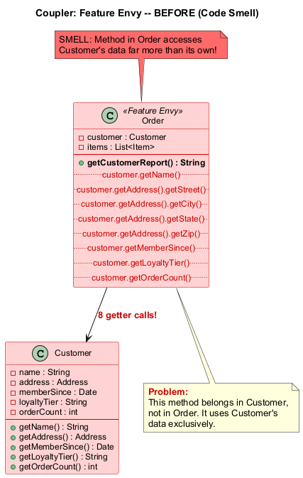

---

### Özellik Kıskançlığı - Sonra (Yeniden Yapılandırılmış)

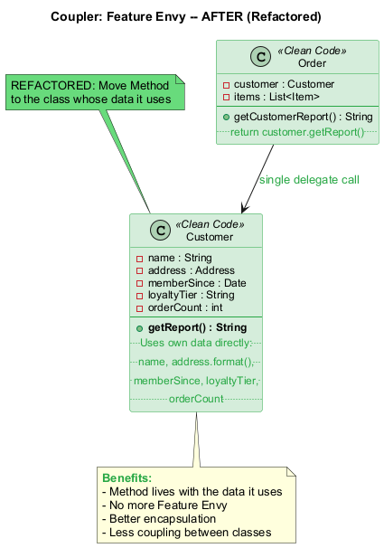

---

## Modül F: Bağlayıcı #1 -- Özellik Kıskançlığı (Feature Envy) (Java Örneği -- Önce)

```java
// KOKU: Özellik Kıskançlığı -- getCustomerReport() Customer'ın verisini kıskanıyor
public class Order {
    private Customer customer;
    private List<Item> items;

    // Bu metot Order'ın verisinden çok Customer'ın verisine erişiyor
    public String getCustomerReport() {
        String report = customer.getName() + "\n";
        report += customer.getAddress().getStreet() + "\n";
        report += customer.getAddress().getCity() + ", ";
        report += customer.getAddress().getState() + " ";
        report += customer.getAddress().getZip() + "\n";
        report += "Member since: " + customer.getMemberSince() + "\n";
        report += "Loyalty tier: " + customer.getLoyaltyTier() + "\n";
        report += "Total orders: " + customer.getOrderCount() + "\n";
        return report;
    }
}
```

---

## Modül F: Bağlayıcı #1 -- Özellik Kıskançlığı (Feature Envy) (Java Örneği -- Sonra)

```java
// YENİDEN YAPILANDIRILMIŞ: Metot Taşıma -- rapor üretimini Customer'a taşı
public class Customer {
    private String name;
    private Address address;
    private Date memberSince;
    private String loyaltyTier;
    private int orderCount;

    // Metot artık kullandığı veriyle birlikte yaşıyor
    public String getReport() {
        String report = name + "\n";
        report += address.format() + "\n";
        report += "Member since: " + memberSince + "\n";
        report += "Loyalty tier: " + loyaltyTier + "\n";
        report += "Total orders: " + orderCount + "\n";
        return report;
    }
}

public class Order {
    private Customer customer;

    // Customer'a devret -- artık Özellik Kıskançlığı yok
    public String getCustomerReport() {
        return customer.getReport();
    }
}
```

---

## Modül F: Bağlayıcı #1 -- Özellik Kıskançlığı (Feature Envy) (Tedavi ve Kazanç)

### Tedavi (Yeniden Yapılandırma Teknikleri)

| Teknik | Ne Zaman Kullanılır |
|---|---|
| **Metot Taşıma (Move Method)** | Metodu verisini en çok kullandığı sınıfa taşıyın |
| **Metot Çıkarma (Extract Method)** | Metodun yalnızca bir kısmı başka bir nesneyi kıskanıyorsa, o kısmı çıkarıp taşıyın |

### Kazanç

- Daha az **kod tekrarı** (kıskanç mantık başka bir yerde tekrarlanmışsa)
- Daha iyi **kod organizasyonu** -- veri ve davranışı aynı yerde

### Ne Zaman Görmezden Gelinir

- Özellik Kıskançlığı davranışsal tasarım kalıplarında **kasıtlı olarak** kullanıldığında:
  - **Strateji Kalıbı (Strategy Pattern)**: Davranış kasıtlı olarak veri sınıfından ayrılır
  - **Ziyaretçi Kalıbı (Visitor Pattern)**: İşlemler nesne yapısından ayrılır
  - **Komut Kalıbı (Command Pattern)**: Komutlar diğer nesnelerin verisi üzerinde çalışır

> Bir metot kasıtlı olarak veriyi davranıştan ayıran bir tasarım kalıbına aitse, Özellik Kıskançlığı kabul edilebilir.

---

## Modül F: Bağlayıcı #2 -- Uygunsuz Yakınlık (Inappropriate Intimacy)

### Nedir?

Bir sınıf, başka bir sınıfın **iç alanlarını ve metotlarını** kullanır. İyi sınıflar birbirleri hakkında mümkün olduğunca az bilmelidir -- bu, sınıfları bakımı kolay ve yeniden kullanılabilir hale getirir.

### Belirtiler ve Semptomlar

- Bir sınıf başka bir sınıfın alanlarına doğrudan erişir (özellikle özel olmayanlar)
- Bir sınıf başka bir sınıfın iç uygulama detaylarına bağlıdır
- İki sınıfın birbirinin iç yapısına referans verdiği çift yönlü bağımlılıklar
- Bir sınıfı değiştirmek sıklıkla diğerini bozar

### Sorunun Nedenleri

- Birbirinin özel bölümlerini fazla kurcalayan sınıflar
- Genellikle sınırların dikkatle korunmadığı **artımlı geliştirmeden** kaynaklanır
- Kolaylık odaklı kodlama yoluyla zamanla oluşan sıkı bağlantı

Referans: [RefactoringGuru -- Uygunsuz Yakınlık](https://refactoring.guru/smells/inappropriate-intimacy)

---

## Modül F: Bağlayıcı #2 -- Uygunsuz Yakınlık (Inappropriate Intimacy) (Java Örneği -- Önce)

```java
// KOKU: Uygunsuz Yakınlık -- Order Customer'ın iç yapısına erişiyor
public class Customer {
    int loyaltyPoints;              // Özel olmalı!
    List<Order> orderHistory;       // Order'a açık!
    String membershipTier;          // Doğrudan erişiliyor!
}

public class Order {
    private Customer customer;

    // Customer'ın iç alanlarına doğrudan erişiyor ve değiştiriyor!
    public void applyDiscount() {
        if (customer.loyaltyPoints > 1000) {  // İç alana erişim
            customer.loyaltyPoints -= 100;     // İç alanı değiştirme!
            this.discount = 0.10;
        }
    }

    public void addToHistory() {
        customer.orderHistory.add(this);       // Koleksiyonu doğrudan değiştirme!
    }

    public boolean isVipOrder() {
        return customer.membershipTier.equals("GOLD")  // İç detaylar!
            && customer.orderHistory.size() > 50;
    }
}
```

---

## Modül F: Bağlayıcı #2 -- Uygunsuz Yakınlık (Inappropriate Intimacy) (Java Örneği -- Sonra)

```java
// YENİDEN YAPILANDIRILMIŞ: Doğru kapsülleme -- Metot Taşıma + Alanları gizle
public class Customer {
    private int loyaltyPoints;
    private List<Order> orderHistory;
    private String membershipTier;

    public boolean canRedeemDiscount() {
        return loyaltyPoints > 1000;
    }

    public void redeemDiscount() {
        if (!canRedeemDiscount()) throw new IllegalStateException();
        loyaltyPoints -= 100;
    }

    public void addOrder(Order order) {
        orderHistory.add(order);
    }

    public boolean isVip() {
        return "GOLD".equals(membershipTier) && orderHistory.size() > 50;
    }
}

public class Order {
    private Customer customer;

    public void applyDiscount() {
        if (customer.canRedeemDiscount()) {
            customer.redeemDiscount();
            this.discount = 0.10;
        }
    }
}
```

---

## Modül F: Bağlayıcı #2 -- Uygunsuz Yakınlık (Inappropriate Intimacy) (Tedavi ve Kazanç)

### Tedavi (Yeniden Yapılandırma Teknikleri)

| Teknik | Ne Zaman Kullanılır |
|---|---|
| **Metot Taşıma / Alan Taşıma (Move Method / Move Field)** | Bir sınıfın parçalarını en çok ilişkili oldukları sınıfa taşıyın |
| **Sınıf Çıkarma (Extract Class)** ve **Temsilciyi Gizleme (Hide Delegate)** | Paylaşılan işlevselliği ayrı bir sınıfa çıkararak ilişkiyi resmileştirin |
| **Çift Yönlü İlişkiyi Tek Yönlü İlişkiye Dönüştürme (Change Bidirectional Association to Unidirectional)** | İki sınıf karşılıklı birbirine bağlı olduğunda, tek yönlü bağımlılığa dönüştürün |
| **Devretmeyi Kalıtımla Değiştirme (Replace Delegation with Inheritance)** | Bir sınıf gerçekten diğerinin özel bir versiyonu olduğunda |

### Kazanç

- Geliştirilmiş **kod organizasyonu** ve yapısı
- Basitleştirilmiş **bakım** ve iyileştirilmiş kod yeniden kullanılabilirliği
- Daha iyi **kapsülleme** -- sınıflar yalnızca ihtiyaç duydukları şeyi açığa çıkarır
- **Demeter Yasasına** uyar (en az bilgi ilkesi)

> "Her birim diğer birimler hakkında yalnızca sınırlı bilgiye sahip olmalıdır: yalnızca mevcut birimle yakından ilişkili birimler." -- Demeter Yasası

---

## Modül F: Bağlayıcı #3 -- Mesaj Zincirleri (Message Chains)

### Nedir?

Kodda `a.getB().getC().getD()` benzeri bir dizi çağrı görürsünüz. Bu zincirler, istemcinin sınıf hiyerarşisinin **navigasyon yapısına bağlı** olduğu anlamına gelir.

### Belirtiler ve Semptomlar

- Bir nesne grafiğini dolaşan uzun metot çağrı zincirleri
- İstemcinin birden fazla sınıfın iç yapısını bilmesi gerekir
- Ara ilişkilerdeki herhangi bir değişiklik istemciyi değiştirmeyi gerektirir

### Sorunun Nedenleri

- Mesaj zincirleri, bir istemcinin ihtiyaç duyduğu bilgiyi bulmak için bir **nesne grafiğinde** gezinmesi gerektiğinde oluşturulur
- İstemci bir nesne ister, bu nesne başka bir nesne ister, o da başka birini ister
- Bu, tüm navigasyon yapısına sıkı bağlantı oluşturur

Referans: [RefactoringGuru -- Mesaj Zincirleri](https://refactoring.guru/smells/message-chains)

---

### Mesaj Zincirleri - Önce (Kod Kokusu)

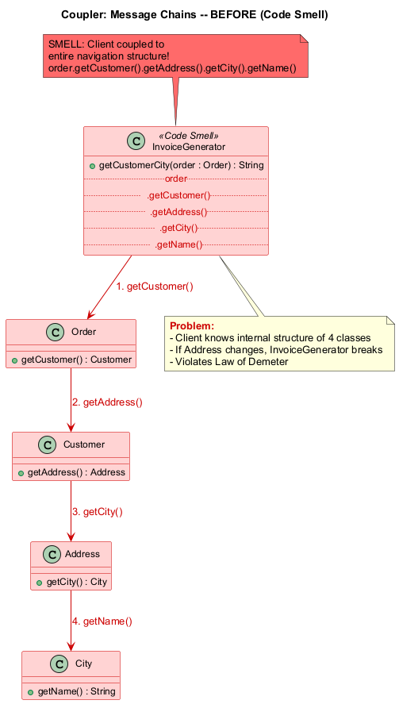

---

### Mesaj Zincirleri - Sonra (Yeniden Yapılandırılmış)

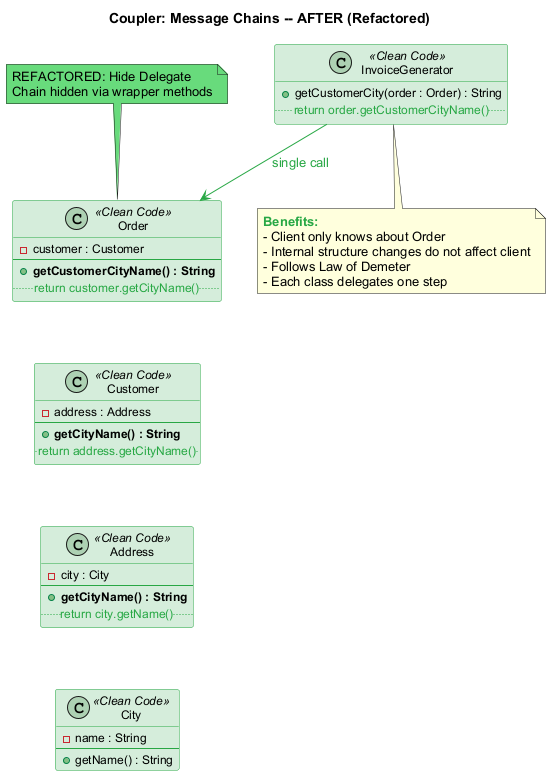

---

## Modül F: Bağlayıcı #3 -- Mesaj Zincirleri (Message Chains) (Java Örneği -- Önce)

```java
// KOKU: Mesaj Zincirleri -- navigasyon yapısına sıkı bağlantı
public class InvoiceGenerator {

    public String getCustomerCity(Order order) {
        // Zincir: Order -> Customer -> Address -> City -> Name
        String cityName = order
            .getCustomer()
            .getAddress()
            .getCity()
            .getName();
        return cityName;
    }

    public double getManagerBalance(Company company) {
        // Zincir: Company -> Department -> Manager -> Account -> Balance
        double balance = company
            .getDepartment("Sales")
            .getManager()
            .getAccount()
            .getBalance();
        return balance;
    }
}
// Address yapısı değişirse, InvoiceGenerator bozulur!
// Department-Manager ilişkisi değişirse, InvoiceGenerator bozulur!
```

---

## Modül F: Bağlayıcı #3 -- Mesaj Zincirleri (Message Chains) (Java Örneği -- Sonra)

```java
// YENİDEN YAPILANDIRILMIŞ: Temsilciyi Gizleme -- zinciri kırmak için sarmalayıcı metotlar oluştur
public class Order {
    private Customer customer;

    // Temsilciyi gizle: Order doğrudan müşteri şehrini sağlar
    public String getCustomerCityName() {
        return customer.getCityName();
    }
}

public class Customer {
    private Address address;

    public String getCityName() {
        return address.getCityName();
    }
}

public class Address {
    private City city;

    public String getCityName() {
        return city.getName();
    }
}

// İstemci kodu -- temiz, zincir yok!
public class InvoiceGenerator {
    public String getCustomerCity(Order order) {
        return order.getCustomerCityName();
    }
}
```

---

## Modül F: Bağlayıcı #3 -- Mesaj Zincirleri (Message Chains) (Tedavi ve Kazanç)

### Tedavi (Yeniden Yapılandırma Teknikleri)

| Teknik | Ne Zaman Kullanılır |
|---|---|
| **Temsilciyi Gizleme (Hide Delegate)** | Her seviyede zinciri kapsülleyen sarmalayıcı metotlar oluşturun |
| **Metot Çıkarma (Extract Method)** | Zinciri iyi adlandırılmış bir metoda çıkarın |
| **Metot Taşıma (Move Method)** | Zinciri kullanan metodu veriye sahip sınıfa taşıyın |

### Kazanç

- Bir zincirdeki sınıflar arasında **bağımlılıkları** azaltır
- İstemcideki **şişmiş kod** miktarını azaltır
- İstemci iç navigasyon yapısından ayrıştırılır
- Ara sınıflardaki değişiklikler istemcilere yayılmaz

### Ne Zaman Görmezden Gelinir

- **Aşırı agresif temsilci gizleme** **Aracı (Middle Man)** kokusuna yol açabilir
- Zincir **kararlı, iyi bilinen bir yapıyı** yansıtıyorsa (örn. `request.getSession().getAttribute()`), kabul edilebilir olabilir
- Doğru dengeyi bulun: ne çok fazla zincir ne de çok fazla temsilci metot

```
Mesaj Zinciri  <------- Denge ------->  Aracı
(çok fazla bağlantı)                  (çok fazla devretme)
```

---

## Modül F: Bağlayıcı #4 -- Aracı (Middle Man)

### Nedir?

Bir sınıf yalnızca **tek bir eylem** gerçekleştiriyorsa -- işi başka bir sınıfa devretmek -- neden var ki?

### Belirtiler ve Semptomlar

- Metotların çoğunluğu basitçe çağrıları başka bir sınıfa ileten bir sınıf
- Sınıf mantık, doğrulama, dönüştürme eklemiyor
- İstemciler temsilciyi doğrudan çağırabilir

### Sorunun Nedenleri

- **Mesaj Zincirlerini aşırı hevesle ortadan kaldırma** -- geliştiriciler metot zincirlerini kırmak için agresif bir şekilde yeniden yapılandırmış ve kasıtsız olarak gereksiz ara sınıflar oluşturmuş olabilir
- **Sorumluluğun kademeli erozyonu** -- bir sınıfın kullanışlı işlevselliği kademeli olarak başka yerlere taşınır, geride yalnızca devretme yapan boş bir kabuk kalır

Referans: [RefactoringGuru -- Aracı](https://refactoring.guru/smells/middle-man)

---

## Modül F: Bağlayıcı #4 -- Aracı (Middle Man) (Java Örneği -- Önce)

```java
// KOKU: Aracı -- Department her şeyi Manager'a devretir
public class Department {
    private Manager manager;

    public String getManagerName() {
        return manager.getName();       // Sadece devretir
    }

    public String getManagerEmail() {
        return manager.getEmail();      // Sadece devretir
    }

    public void approveExpense(Expense expense) {
        manager.approveExpense(expense); // Sadece devretir
    }

    public Report getReport() {
        return manager.getReport();     // Sadece devretir
    }

    public void scheduleMeeting(Date date) {
        manager.scheduleMeeting(date);  // Sadece devretir
    }
    // Her metot sadece manager'a yönlendiriyor!
    // Department hiçbir değer katmıyor.
}
```

---

## Modül F: Bağlayıcı #4 -- Aracı (Middle Man) (Java Örneği -- Sonra)

```java
// YENİDEN YAPILANDIRILMIŞ: Aracıyı Kaldır -- istemci Manager'a doğrudan erişir
public class Department {
    private Manager manager;

    // İstemcilerin doğrudan etkileşim kurabilmesi için manager'ı açığa çıkar
    public Manager getManager() {
        return manager;
    }

    // DEĞER KATAN metotları koru (sadece devretmeyenleri)
    public double getTotalBudget() {
        return manager.getTeamBudget() + operatingCosts;
    }
}

// İstemci kodu -- doğrudan etkileşim
public class ExpenseProcessor {
    public void process(Department dept, Expense expense) {
        // Önce: dept.approveExpense(expense);  // Aracı
        // Sonra: işin gerçekten yapıldığı yere doğrudan erişim
        dept.getManager().approveExpense(expense);
    }
}
```

---

## Modül F: Bağlayıcı #4 -- Aracı (Middle Man) (Tedavi ve Kazanç)

### Tedavi (Yeniden Yapılandırma Teknikleri)

| Teknik | Ne Zaman Kullanılır |
|---|---|
| **Aracıyı Kaldırma (Remove Middle Man)** | Çoğu metot saf devretme olduğunda istemcinin son nesneyi doğrudan çağırmasını sağlayın |
| **Satır İçi Metot (Inline Method)** | Önemsiz devretme metotları için |
| **Devretmeyi Kalıtımla Değiştirme (Replace Delegation with Inheritance)** | Aracı her zaman aynı sınıfa devretiyorsa, onu bir alt sınıf yapmayı düşünün |

### Kazanç

- **Daha az şişmiş kod** -- gereksiz ara sınıflar yok
- **Daha açık kod** -- işin gerçekten nerede yapıldığını görebilirsiniz
- Daha basit sınıf hiyerarşisi

### Ne Zaman Görmezden Gelinir

- Bir Aracı kasıtlı olarak **sınıflar arası bağımlılıklardan kaçınmak** için eklenmiş olabilir
- Aracı kasıtlı olarak **Cephe (Facade)**, **Vekil (Proxy)** veya **Dekoratör (Decorator)** kalıplarının bir parçası olabilir
- Kaldırmak temsilci sınıfın çok fazla iç yapısını açığa çıkaracaksa, tutun
- Aracıyı kaldırmak **Mesaj Zincirleri** oluşturacaksa kaldırmayın -- doğru dengeyi bulun

---

## Modül F: Özet

### Temel Noktalar -- Bağlayıcılar (Couplers)

| Koku | Temel Çıkarım |
|---|---|
| **Özellik Kıskançlığı (Feature Envy)** | Metodu verisini en çok kullandığı sınıfa taşıyın |
| **Uygunsuz Yakınlık (Inappropriate Intimacy)** | Kapsüllemeyi uygulayın; sınıflar birbirleri hakkında mümkün olduğunca az bilmeli |
| **Mesaj Zincirleri (Message Chains)** | İstemcinin navigasyon yapısına bağlantısını azaltmak için temsilcileri gizleyin |
| **Aracı (Middle Man)** | Bir sınıf yalnızca devretiyorsa, istemcilerin temsilciyi doğrudan çağırmasına izin verin |

### Bağlantı Spektrumu

```
Sıkı Bağlantı <-------- Hedef --------> Gevşek Bağlantı
(Özellik Kıskançlığı,   (Doğru denge)    (Aracı,
 Uygunsuz                                 Aşırı
 Yakınlık)                                Devretme)
```

> Hedef **yeterli bağlantıdır** -- değişikliklerin her yere yayılacağı kadar fazla değil ve kodun önemsiz devretmeler labirentine dönüşeceği kadar az değil.

---

## Özet: Tüm 22 Kod Kokusu Bir Bakışta

| Kategori | Kokular | Temel Sorun |
|---|---|---|
| **Şişkinler (Bloaters)** | Uzun Metot, Büyük Sınıf, İlkel Takıntı, Uzun Parametre Listesi, Veri Kümeleri | Çok büyümüş kod |
| **NE Kötüye Kullananlar (OO Abusers)** | Switch İfadeleri, Geçici Alan, Reddedilen Miras, Farklı Arayüzlere Sahip Alternatif Sınıflar | NYP'nin yanlış uygulanması |
| **Değişim Engelleyiciler (Change Preventers)** | Iraksak Değişim, Saçma Ameliyat, Paralel Kalıtım Hiyerarşileri | Değişiklikler orantısız çaba gerektirir |
| **Gereksizler (Dispensables)** | Yorumlar, Tekrarlanan Kod, Tembel Sınıf, Veri Sınıfı, Ölü Kod, Spekülatif Genellik | Gereksiz karmaşıklık |
| **Bağlayıcılar (Couplers)** | Özellik Kıskançlığı, Uygunsuz Yakınlık, Mesaj Zincirleri, Aracı | Aşırı bağlantı veya devretme |

---

## Özet: Temel Yeniden Yapılandırma İlkeleri

### Hatırlatma

- Kod kokuları **göstergelerdir**, mutlak kurallar değil -- bağlam önemlidir
- Her kokunun bir "Ne Zaman Görmezden Gelinir" durumu vardır
- Yeniden yapılandırma **küçük, güvenli değişiklikleri** sürekli yapmakla ilgilidir
- Yeniden yapılandırma için en iyi zaman **şimdidir** -- teknik borç yalnızca büyür
- Yeniden yapılandırma ve özellik geliştirmeyi asla aynı commit'te karıştırmayın
- Yeniden yapılandırma sonrasında tüm mevcut testler geçmelidir

### Yeniden Yapılandırma Zihniyeti

```
 Kokuyu Tespit Et --> Tekniği Seç --> Küçük Değişiklik Uygula --> Testleri Çalıştır
      ^                                                               |
      |                                                               v
      +-------------------- Gerekirse Tekrarla ----------------------+
```

> "Yeniden yapılandırmanın anahtarı küçük adımlarla çalışmaktır. Küçük bir değişiklik yaparsınız, test edersiniz, başka bir küçük değişiklik yaparsınız, test edersiniz." -- Martin Fowler

---

## Kaynaklar

- Fowler, M. (2018). *Refactoring: Improving the Design of Existing Code* (2nd Edition). Addison-Wesley.
- Beck, K., & Fowler, M. (1999). *Bad Smells in Code.* In Refactoring: Improving the Design of Existing Code.
- Martin, R. C. (2008). *Clean Code: A Handbook of Agile Software Craftsmanship.* Prentice Hall.
- RefactoringGuru. *What is Refactoring?* [https://refactoring.guru/refactoring/what-is-refactoring](https://refactoring.guru/refactoring/what-is-refactoring)
- RefactoringGuru. *Clean Code.* [https://refactoring.guru/refactoring/clean-code](https://refactoring.guru/refactoring/clean-code)
- RefactoringGuru. *Technical Debt.* [https://refactoring.guru/refactoring/technical-debt](https://refactoring.guru/refactoring/technical-debt)
- RefactoringGuru. *When to Refactor.* [https://refactoring.guru/refactoring/when](https://refactoring.guru/refactoring/when)
- RefactoringGuru. *How to Refactor.* [https://refactoring.guru/refactoring/how-to](https://refactoring.guru/refactoring/how-to)
- RefactoringGuru. *Code Smells.* [https://refactoring.guru/refactoring/smells](https://refactoring.guru/refactoring/smells)

---

## Kaynaklar (Devamı)

- RefactoringGuru. *Bloaters.* [https://refactoring.guru/refactoring/smells/bloaters](https://refactoring.guru/refactoring/smells/bloaters)
- RefactoringGuru. *Object-Orientation Abusers.* [https://refactoring.guru/refactoring/smells/oo-abusers](https://refactoring.guru/refactoring/smells/oo-abusers)
- RefactoringGuru. *Change Preventers.* [https://refactoring.guru/refactoring/smells/change-preventers](https://refactoring.guru/refactoring/smells/change-preventers)
- RefactoringGuru. *Dispensables.* [https://refactoring.guru/refactoring/smells/dispensables](https://refactoring.guru/refactoring/smells/dispensables)
- RefactoringGuru. *Couplers.* [https://refactoring.guru/refactoring/smells/couplers](https://refactoring.guru/refactoring/smells/couplers)
- RefactoringGuru. *Long Method.* [https://refactoring.guru/smells/long-method](https://refactoring.guru/smells/long-method)
- RefactoringGuru. *Large Class.* [https://refactoring.guru/smells/large-class](https://refactoring.guru/smells/large-class)
- RefactoringGuru. *Primitive Obsession.* [https://refactoring.guru/smells/primitive-obsession](https://refactoring.guru/smells/primitive-obsession)
- RefactoringGuru. *Long Parameter List.* [https://refactoring.guru/smells/long-parameter-list](https://refactoring.guru/smells/long-parameter-list)
- RefactoringGuru. *Data Clumps.* [https://refactoring.guru/smells/data-clumps](https://refactoring.guru/smells/data-clumps)

---

## Kaynaklar (Devamı)

- RefactoringGuru. *Switch Statements.* [https://refactoring.guru/smells/switch-statements](https://refactoring.guru/smells/switch-statements)
- RefactoringGuru. *Temporary Field.* [https://refactoring.guru/smells/temporary-field](https://refactoring.guru/smells/temporary-field)
- RefactoringGuru. *Refused Bequest.* [https://refactoring.guru/smells/refused-bequest](https://refactoring.guru/smells/refused-bequest)
- RefactoringGuru. *Alternative Classes with Different Interfaces.* [https://refactoring.guru/smells/alternative-classes-with-different-interfaces](https://refactoring.guru/smells/alternative-classes-with-different-interfaces)
- RefactoringGuru. *Divergent Change.* [https://refactoring.guru/smells/divergent-change](https://refactoring.guru/smells/divergent-change)
- RefactoringGuru. *Shotgun Surgery.* [https://refactoring.guru/smells/shotgun-surgery](https://refactoring.guru/smells/shotgun-surgery)
- RefactoringGuru. *Parallel Inheritance Hierarchies.* [https://refactoring.guru/smells/parallel-inheritance-hierarchies](https://refactoring.guru/smells/parallel-inheritance-hierarchies)
- RefactoringGuru. *Comments.* [https://refactoring.guru/smells/comments](https://refactoring.guru/smells/comments)
- RefactoringGuru. *Duplicate Code.* [https://refactoring.guru/smells/duplicate-code](https://refactoring.guru/smells/duplicate-code)
- RefactoringGuru. *Lazy Class.* [https://refactoring.guru/smells/lazy-class](https://refactoring.guru/smells/lazy-class)

---

## Kaynaklar (Devamı)

- RefactoringGuru. *Data Class.* [https://refactoring.guru/smells/data-class](https://refactoring.guru/smells/data-class)
- RefactoringGuru. *Dead Code.* [https://refactoring.guru/smells/dead-code](https://refactoring.guru/smells/dead-code)
- RefactoringGuru. *Speculative Generality.* [https://refactoring.guru/smells/speculative-generality](https://refactoring.guru/smells/speculative-generality)
- RefactoringGuru. *Feature Envy.* [https://refactoring.guru/smells/feature-envy](https://refactoring.guru/smells/feature-envy)
- RefactoringGuru. *Inappropriate Intimacy.* [https://refactoring.guru/smells/inappropriate-intimacy](https://refactoring.guru/smells/inappropriate-intimacy)
- RefactoringGuru. *Message Chains.* [https://refactoring.guru/smells/message-chains](https://refactoring.guru/smells/message-chains)
- RefactoringGuru. *Middle Man.* [https://refactoring.guru/smells/middle-man](https://refactoring.guru/smells/middle-man)

---

$End-Of-Week-12-Module$