<!-- _backgroundColor: aqua -->

<!-- _color: orange -->

<!-- paginate: false -->

## CEN206 Object-Oriented Programming

## Week-13 (Refactoring Techniques)

#### Spring Semester, 2025-2026

Download [DOC-PDF](ce204-week-13.en.md_doc.pdf), [DOC-DOCX](ce204-week-13.en.md_word.docx), [SLIDE](ce204-week-13.en.md_slide.pdf)

<iframe width=700, height=500 frameBorder=0 src="../ce204-week-13.en.md_slide.html"></iframe>

---

<!-- paginate: true -->

## Week-13 Overview

### Refactoring Techniques (All 66 Techniques)

| Module | Topic | Techniques |
|--------|-------|------------|
| A | Composing Methods | 9 techniques |
| B | Moving Features between Objects | 8 techniques |
| C | Organizing Data | 15 techniques |
| D | Simplifying Conditional Expressions | 8 techniques |
| E | Simplifying Method Calls | 14 techniques |
| F | Dealing with Generalization | 12 techniques |

**Source:** [https://refactoring.guru/refactoring/techniques](https://refactoring.guru/refactoring/techniques)

---

## What is Refactoring?

- **Refactoring** is a disciplined technique for restructuring an existing body of code, altering its internal structure without changing its external behavior.
- Each transformation (called a "refactoring") does little, but a sequence of transformations can produce a significant restructuring.
- The goal is to make code **easier to understand**, **cheaper to modify**, and **safer to extend**.

---

## Why Refactor?

- **Improves software design** -- Without refactoring, the design of a program will decay over time.
- **Makes software easier to understand** -- Code that communicates its purpose clearly is easier to maintain.
- **Helps find bugs** -- Clarifying code structure makes bugs more visible.
- **Helps you program faster** -- Good design enables rapid development of new features.

---

## When to Refactor?

- **Rule of Three**: The first time you do something, just do it. The second time, you wince at duplication but do it anyway. The third time, you refactor.
- **When adding a feature**: Refactor to make the new feature easier to add.
- **When fixing a bug**: Refactor to make the bug obvious.
- **During code review**: Refactor to improve readability and maintainability.

---

### Refactoring Techniques - Overview Diagram

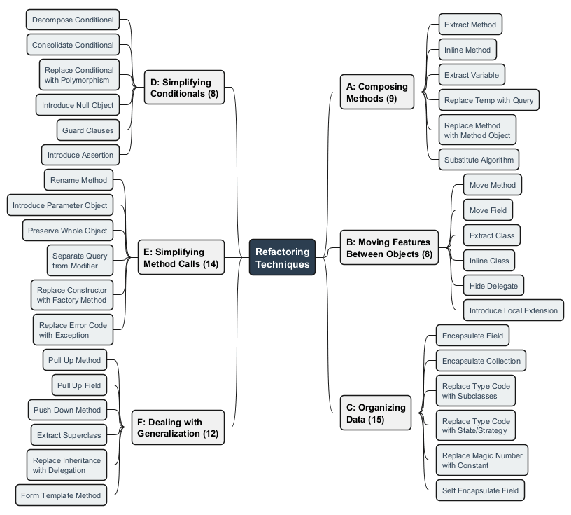

---

<!-- _backgroundColor: aqua -->

<!-- _color: orange -->

# Module A: Composing Methods

## 9 Techniques for Better Method Structure

---

## Module A Outline

### Composing Methods

These refactorings deal with how methods are composed. Much of refactoring is about composing methods to properly package code. Almost all the time, the root problem is **methods that are too long**.

1. Extract Method
2. Inline Method
3. Extract Variable
4. Inline Temp
5. Replace Temp with Query
6. Split Temporary Variable
7. Remove Assignments to Parameters
8. Replace Method with Method Object
9. Substitute Algorithm

---

<style scoped>section{ font-size: 25px; }</style>

## A1. Extract Method

**What:** Move a code fragment into a separate method with a descriptive name.

**Problem:** You have a code fragment that can be grouped together. Long methods are hard to understand and maintain.

**Solution:** Turn the fragment into a method whose name explains the purpose of the method.

**When to use:** Methods exceed 10-15 lines; code sections perform a distinct task; logic is duplicated.

**When NOT to use:** The extracted code is genuinely a one-time operation; the new method would have excessive parameters.

---

<style scoped>section{ font-size: 20px; }</style>

## A1. Extract Method -- Before

```java
public class Order {
    private String name;
    private List<LineItem> items;

    public void printOwing() {
        double outstanding = 0.0;

        // print banner
        System.out.println("**************************");
        System.out.println("***** Customer Owes ******");
        System.out.println("**************************");

        // calculate outstanding
        for (LineItem item : items) {
            outstanding += item.getAmount();
        }

        // print details
        System.out.println("name: " + name);
        System.out.println("amount: " + outstanding);
    }
}
```

---

<style scoped>section{ font-size: 20px; }</style>

## A1. Extract Method -- After

```java
public class Order {
    private String name;
    private List<LineItem> items;

    public void printOwing() {
        printBanner();
        double outstanding = calculateOutstanding();
        printDetails(outstanding);
    }

    private void printBanner() {
        System.out.println("**************************");
        System.out.println("***** Customer Owes ******");
        System.out.println("**************************");
    }

    private double calculateOutstanding() {
        double outstanding = 0.0;
        for (LineItem item : items) {
            outstanding += item.getAmount();
        }
        return outstanding;
    }

    private void printDetails(double outstanding) {
        System.out.println("name: " + name);
        System.out.println("amount: " + outstanding);
    }
}
```

---

### Extract Method - Before/After Diagram

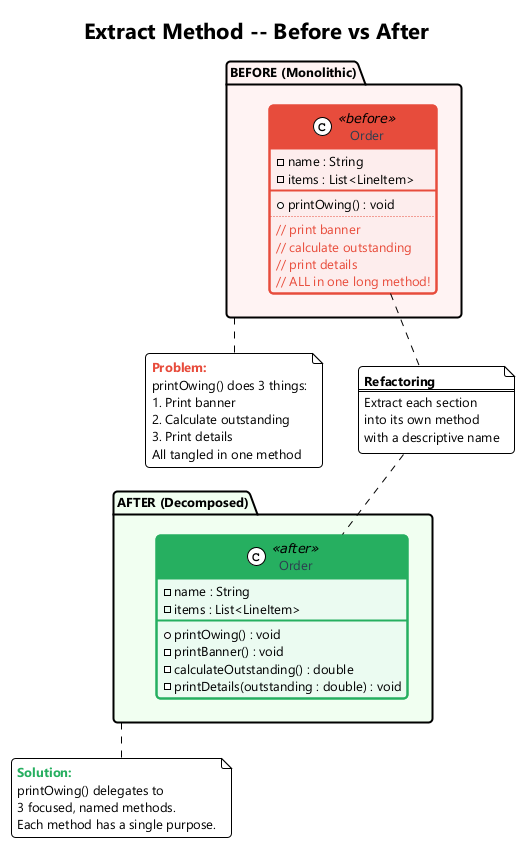

---

<style scoped>section{ font-size: 25px; }</style>

## A2. Inline Method

**What:** Replace a method call with the method's body and delete the method.

**Problem:** When a method body is just as clear as the method name, or the method body is trivially simple, the indirection adds no value.

**Solution:** Put the method's body into the body of its callers and remove the method.

**When to use:** Method bodies are clearer than the method names; simple delegation methods have outlived their purpose.

**When NOT to use:** The method is overridden in subclasses (inlining would break polymorphism); the method is called from many places where simplicity matters.

---

<style scoped>section{ font-size: 22px; }</style>

## A2. Inline Method -- Before / After

```java
// Before
class PizzaDelivery {
    int getRating() {
        return moreThanFiveLateDeliveries() ? 2 : 1;
    }
    boolean moreThanFiveLateDeliveries() {
        return numberOfLateDeliveries > 5;
    }
}
```

```java
// After
class PizzaDelivery {
    int getRating() {
        return numberOfLateDeliveries > 5 ? 2 : 1;
    }
}
```

By minimizing the number of unneeded methods, you make the code more straightforward.

---

<style scoped>section{ font-size: 25px; }</style>

## A3. Extract Variable

**What:** Place the result of an expression (or its parts) in separate variables that are self-explanatory.

**Problem:** You have an expression that is hard to understand, particularly in conditional statements or multi-part arithmetic.

**Solution:** Assign expression results to self-explanatory variables.

**When to use:** Complex conditionals need clarification; long arithmetic expressions lack intermediate results.

**When NOT to use:** Simple, self-evident expressions; when the extracted variable appears only once.

---

<style scoped>section{ font-size: 20px; }</style>

## A3. Extract Variable -- Before / After

```java
// Before
public class Product {
    private int quantity;
    private double itemPrice;

    public double getPrice() {
        return quantity * itemPrice
            - Math.max(0, quantity - 500) * itemPrice * 0.05
            + Math.min(quantity * itemPrice * 0.1, 100.0);
    }
}
```

```java
// After
public class Product {
    private int quantity;
    private double itemPrice;

    public double getPrice() {
        double basePrice = quantity * itemPrice;
        double quantityDiscount = Math.max(0, quantity - 500) * itemPrice * 0.05;
        double shipping = Math.min(basePrice * 0.1, 100.0);
        return basePrice - quantityDiscount + shipping;
    }
}
```

---

<style scoped>section{ font-size: 25px; }</style>

## A4. Inline Temp

**What:** Replace all references to a temporary variable with the expression itself.

**Problem:** You have a temporary variable that is assigned to once with a simple expression, and the temp is getting in the way of other refactorings.

**Solution:** Replace all references to that temp with the expression.

**When to use:** The temp is blocking another refactoring (e.g., Replace Temp with Query); the variable adds no clarity.

**When NOT to use:** The expression is evaluated multiple times with side effects; removing the variable reduces readability.

```java
// Before
double basePrice = order.basePrice();
return (basePrice > 1000);

// After
return (order.basePrice() > 1000);
```

---

<style scoped>section{ font-size: 25px; }</style>

## A5. Replace Temp with Query

**What:** Extract the expression into a method and replace all references to the temp with the method call.

**Problem:** You are using a temporary variable to hold the result of an expression.

**Solution:** Move the expression to a separate method. Replace all references to the temp with the method call. The new method can then be used in other methods.

**When to use:** When a temp is used in a single method but the expression is useful in other methods too.

**When NOT to use:** When the expression has side effects or performance-critical calculations that should not be repeated.

---

<style scoped>section{ font-size: 22px; }</style>

## A5. Replace Temp with Query -- Before / After

```java
// Before
public class Product {
    private int quantity;
    private double itemPrice;

    double getPrice() {
        double basePrice = quantity * itemPrice;
        if (basePrice > 1000) {
            return basePrice * 0.95;
        }
        return basePrice * 0.98;
    }
}
```

```java
// After
public class Product {
    private int quantity;
    private double itemPrice;

    double getPrice() {
        if (basePrice() > 1000) {
            return basePrice() * 0.95;
        }
        return basePrice() * 0.98;
    }

    private double basePrice() {
        return quantity * itemPrice;
    }
}
```

---

<style scoped>section{ font-size: 25px; }</style>

## A6. Split Temporary Variable

**What:** Use a separate temporary variable for each assignment.

**Problem:** You have a local variable that is assigned more than once, but it is not a loop variable or a collecting variable.

**Solution:** Make a separate temporary variable for each assignment. Each temp should be assigned only once.

**When to use:** When a temp is used for two different things, it confuses the reader. Use a separate variable for each purpose.

**When NOT to use:** Loop counters or accumulator variables that are naturally reassigned.

---

<style scoped>section{ font-size: 22px; }</style>

## A6. Split Temporary Variable -- Before / After

```java
// Before
public class Rectangle {
    double height;
    double width;

    void calculate() {
        double temp = 2 * (height + width);
        System.out.println("Perimeter: " + temp);
        temp = height * width;
        System.out.println("Area: " + temp);
    }
}
```

```java
// After
public class Rectangle {
    double height;
    double width;

    void calculate() {
        double perimeter = 2 * (height + width);
        System.out.println("Perimeter: " + perimeter);
        double area = height * width;
        System.out.println("Area: " + area);
    }
}
```

---

<style scoped>section{ font-size: 25px; }</style>

## A7. Remove Assignments to Parameters

**What:** Use a local variable instead of assigning to a parameter.

**Problem:** A value is assigned to a parameter inside the method's body.

**Solution:** Use a local variable instead of the parameter.

**When to use:** When a method modifies a parameter value, blurring the line between input values and local working variables.

**When NOT to use:** In languages with pass-by-reference where modifying the parameter is the intended behavior.

```java
// Before
int discount(int inputVal, int quantity) {
    if (quantity > 50) inputVal -= 2;
    return inputVal;
}

// After
int discount(int inputVal, int quantity) {
    int result = inputVal;
    if (quantity > 50) result -= 2;
    return result;
}
```

---

<style scoped>section{ font-size: 25px; }</style>

## A8. Replace Method with Method Object

**What:** Transform a long method into a separate class so that local variables become fields.

**Problem:** You have a long method in which local variables are so intertwined that you cannot apply Extract Method.

**Solution:** Transform the method into a separate class so that the local variables become fields of the class. Then you can split the method into several methods within the same class.

**When to use:** When Extract Method is blocked by complex local variable dependencies.

**When NOT to use:** When the method can be simplified by other, simpler refactorings first.

---

<style scoped>section{ font-size: 18px; }</style>

## A8. Replace Method with Method Object -- Before

```java
public class Order {
    public double price() {
        double primaryBasePrice;
        double secondaryBasePrice;
        double tertiaryBasePrice;
        // long computation using all three variables...
        primaryBasePrice = quantity * itemPrice;
        secondaryBasePrice = primaryBasePrice * 0.9;
        tertiaryBasePrice = primaryBasePrice * 0.8;
        return primaryBasePrice + secondaryBasePrice + tertiaryBasePrice;
    }
}
```

## A8. Replace Method with Method Object -- After

```java
public class PriceCalculator {
    private double primaryBasePrice;
    private double secondaryBasePrice;
    private double tertiaryBasePrice;
    private Order order;

    public PriceCalculator(Order order) {
        this.order = order;
    }

    public double compute() {
        primaryBasePrice = order.getQuantity() * order.getItemPrice();
        secondaryBasePrice = primaryBasePrice * 0.9;
        tertiaryBasePrice = primaryBasePrice * 0.8;
        return primaryBasePrice + secondaryBasePrice + tertiaryBasePrice;
    }
}
```

---

### Replace Method with Method Object - Diagram

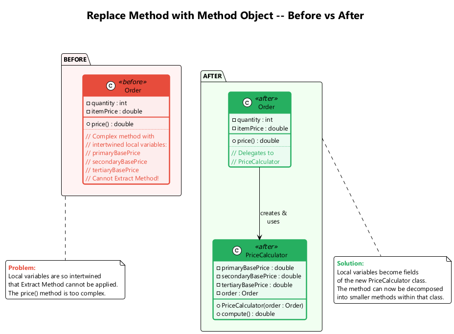

---

<style scoped>section{ font-size: 25px; }</style>

## A9. Substitute Algorithm

**What:** Replace the body of a method with a new, clearer algorithm.

**Problem:** You want to replace an existing algorithm with one that is clearer or more efficient.

**Solution:** Replace the body of the method that implements the algorithm with a new algorithm.

**When to use:** When you find a simpler or more efficient way to accomplish what a method does; when the existing algorithm is overly complex.

**When NOT to use:** When the existing algorithm is already optimal and well-understood.

---

<style scoped>section{ font-size: 22px; }</style>

## A9. Substitute Algorithm -- Before / After

```java
// Before
String foundPerson(String[] people) {
    for (int i = 0; i < people.length; i++) {
        if (people[i].equals("Don")) { return "Don"; }
        if (people[i].equals("John")) { return "John"; }
        if (people[i].equals("Kent")) { return "Kent"; }
    }
    return "";
}
```

```java
// After
String foundPerson(String[] people) {
    List<String> candidates = List.of("Don", "John", "Kent");
    for (String person : people) {
        if (candidates.contains(person)) {
            return person;
        }
    }
    return "";
}
```

---

## Module A -- Takeaway

### Composing Methods: Key Points

| # | Technique | Purpose |
|---|-----------|---------|
| 1 | Extract Method | Break long methods into smaller, named pieces |
| 2 | Inline Method | Remove unnecessary indirection |
| 3 | Extract Variable | Make complex expressions readable |
| 4 | Inline Temp | Remove blocking temporary variables |
| 5 | Replace Temp with Query | Turn temps into reusable query methods |
| 6 | Split Temporary Variable | One purpose per variable |
| 7 | Remove Assignments to Parameters | Preserve parameter semantics |
| 8 | Replace Method with Method Object | Handle complex local variable dependencies |
| 9 | Substitute Algorithm | Replace with clearer/faster algorithm |

---

<!-- _backgroundColor: aqua -->

<!-- _color: orange -->

# Module B: Moving Features Between Objects

## 8 Techniques for Proper Responsibility Distribution

---

## Module B Outline

### Moving Features Between Objects

These refactorings address how to distribute functionality among classes. The key decisions are **where to put responsibilities**. If a class has too many responsibilities, use Extract Class. If a class is underperforming, use Inline Class.

1. Move Method
2. Move Field
3. Extract Class
4. Inline Class
5. Hide Delegate
6. Remove Middle Man
7. Introduce Foreign Method
8. Introduce Local Extension

---

<style scoped>section{ font-size: 25px; }</style>

## B1. Move Method

**What:** Create the method in the class that uses it most, and redirect or remove the original.

**Problem:** A method is used more in another class than in its own class.

**Solution:** Create a new method in the class that uses the method the most, then move the body of the old method there. Turn the old method into a simple delegation, or remove it entirely.

**When to use:** When a method accesses data from another object more than its own.

**When NOT to use:** When the method uses many features of its current class equally.

---

<style scoped>section{ font-size: 18px; }</style>

## B1. Move Method -- Before / After

```java
// Before
class Account {
    private AccountType type;
    private int daysOverdrawn;

    double overdraftCharge() {
        if (type.isPremium()) {
            double result = 10;
            if (daysOverdrawn > 7) {
                result += (daysOverdrawn - 7) * 0.85;
            }
            return result;
        }
        return daysOverdrawn * 1.75;
    }

    double bankCharge() {
        double result = 4.5;
        if (daysOverdrawn > 0) {
            result += overdraftCharge();
        }
        return result;
    }
}
```

```java
// After -- overdraftCharge moved to AccountType
class AccountType {
    double overdraftCharge(int daysOverdrawn) {
        if (isPremium()) {
            double result = 10;
            if (daysOverdrawn > 7) {
                result += (daysOverdrawn - 7) * 0.85;
            }
            return result;
        }
        return daysOverdrawn * 1.75;
    }
}
```

---

### Move Method - Before/After Diagram

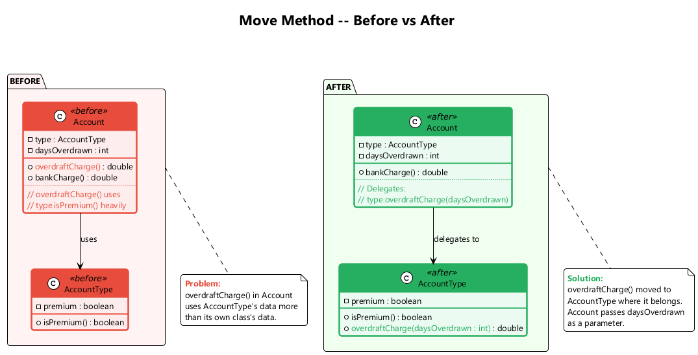

---

<style scoped>section{ font-size: 25px; }</style>

## B2. Move Field

**What:** Move a field to the class that uses it more often.

**Problem:** A field is used more in another class than in its own class.

**Solution:** Create a field in a new class and redirect all users of the old field to it.

**When to use:** When a field is used more by methods of another class; as part of Extract Class.

**When NOT to use:** When the field is central to the current class's identity.

```java
// Before
class Account {
    private double interestRate;
    private AccountType type;
}

// After -- interestRate moved to AccountType
class AccountType {
    private double interestRate;
    double getInterestRate() { return interestRate; }
}
class Account {
    private AccountType type;
    double getInterestRate() { return type.getInterestRate(); }
}
```

---

<style scoped>section{ font-size: 25px; }</style>

## B3. Extract Class

**What:** Create a new class containing fields and methods for a distinct responsibility.

**Problem:** When one class does the work of two, awkwardness results. The class has too many responsibilities.

**Solution:** Create a new class and move the relevant fields and methods from the old class into the new class.

**When to use:** When a class has features that are naturally grouped and could stand on their own.

**When NOT to use:** When the class is still cohesive and splitting it would create unnecessary coupling.

---

<style scoped>section{ font-size: 18px; }</style>

## B3. Extract Class -- Before / After

```java
// Before
class Person {
    private String name;
    private String officeAreaCode;
    private String officeNumber;

    String getTelephoneNumber() {
        return "(" + officeAreaCode + ") " + officeNumber;
    }
}
```

```java
// After
class Person {
    private String name;
    private TelephoneNumber officeTelephone = new TelephoneNumber();

    String getTelephoneNumber() {
        return officeTelephone.getTelephoneNumber();
    }
}

class TelephoneNumber {
    private String areaCode;
    private String number;

    String getTelephoneNumber() {
        return "(" + areaCode + ") " + number;
    }
}
```

---

### Extract Class - Before/After Diagram

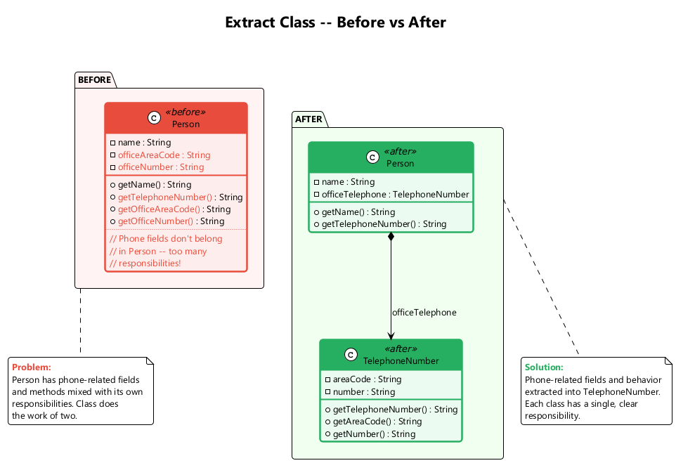

---

<style scoped>section{ font-size: 25px; }</style>

## B4. Inline Class

**What:** Move all features from an underperforming class into another class and delete it.

**Problem:** A class does almost nothing and is not responsible for anything, and no additional responsibilities are planned for it.

**Solution:** Move all features from the class to another one and delete the empty class.

**When to use:** After refactorings have stripped a class of all but a thin wrapper of functionality.

**When NOT to use:** When the class still has a clear responsibility or is expected to grow.

```java
// Before
class Person {
    private TelephoneNumber officeTelephone;
    String getAreaCode() { return officeTelephone.getAreaCode(); }
}
class TelephoneNumber { /* only areaCode and number */ }

// After -- TelephoneNumber merged back into Person
class Person {
    private String officeAreaCode;
    private String officeNumber;
    String getAreaCode() { return officeAreaCode; }
}
```

---

<style scoped>section{ font-size: 25px; }</style>

## B5. Hide Delegate

**What:** Create a delegate method on the server to hide the delegate from the client.

**Problem:** The client gets object B from object A, then calls a method of object B (law of Demeter violation: `a.getB().doSomething()`).

**Solution:** Create a method in class A that delegates the call to B, shielding the client from knowing about B.

**When to use:** When clients navigate through chains of objects (message chains).

**When NOT to use:** When the delegate is a widely-known, stable API.

```java
// Before
class Person {
    Department department;
    Department getDepartment() { return department; }
}
// Client code: person.getDepartment().getManager();

// After
class Person {
    Department department;
    Person getManager() { return department.getManager(); }
}
// Client code: person.getManager();
```

---

<style scoped>section{ font-size: 25px; }</style>

## B6. Remove Middle Man

**What:** Have the client call the delegate directly, removing forwarding methods.

**Problem:** A class has too many methods that simply delegate to another object. The server class becomes a "middle man".

**Solution:** Delete the middle man methods and let the client call the end object directly.

**When to use:** When a class is overwhelmed with simple delegating methods; when Hide Delegate was overdone.

**When NOT to use:** When hiding the delegate is important for encapsulation.

```java
// Before
class Person {
    Department department;
    Person getManager() { return department.getManager(); }
    // many more delegations...
}
// Client: person.getManager();

// After
class Person {
    Department department;
    Department getDepartment() { return department; }
}
// Client: person.getDepartment().getManager();
```

---

<style scoped>section{ font-size: 25px; }</style>

## B7. Introduce Foreign Method

**What:** Add a utility method to a client class, passing the server object as an argument.

**Problem:** A utility class that you use does not contain the method that you need, and you cannot add the method to the class.

**Solution:** Create the method in a client class and pass an instance of the utility class as its first argument.

**When to use:** When you need just one or two extra methods on a class you cannot modify.

**When NOT to use:** When you need many methods -- use Introduce Local Extension instead.

```java
// Before
Date newStart = new Date(previousEnd.getYear(),
    previousEnd.getMonth(), previousEnd.getDate() + 1);

// After
Date newStart = nextDay(previousEnd);

private static Date nextDay(Date date) {
    return new Date(date.getYear(), date.getMonth(), date.getDate() + 1);
}
```

---

<style scoped>section{ font-size: 25px; }</style>

## B8. Introduce Local Extension

**What:** Create a new class (subclass or wrapper) that contains the extra methods you need.

**Problem:** A utility class lacks several methods that you need, and you cannot add methods to the class.

**Solution:** Create a new class containing the extra methods. Make this extension class a subclass or a wrapper of the original.

**When to use:** When you need many extra methods on a class you cannot modify.

**When NOT to use:** When only one or two methods are needed (use Introduce Foreign Method instead).

---

<style scoped>section{ font-size: 18px; }</style>

## B8. Introduce Local Extension -- Example

```java
// Wrapper approach
class MfDateWrapper {
    private Date original;

    public MfDateWrapper(Date date) {
        this.original = date;
    }

    public MfDateWrapper(String dateString) {
        this.original = new Date(dateString);
    }

    public Date nextDay() {
        return new Date(original.getYear(), original.getMonth(), original.getDate() + 1);
    }

    public int dayOfYear() {
        // custom implementation
        Calendar cal = Calendar.getInstance();
        cal.setTime(original);
        return cal.get(Calendar.DAY_OF_YEAR);
    }

    // delegate all original methods...
    public int getYear() { return original.getYear(); }
    public int getMonth() { return original.getMonth(); }
    public int getDate() { return original.getDate(); }
}
```

---

## Module B -- Takeaway

### Moving Features Between Objects: Key Points

| # | Technique | Purpose |
|---|-----------|---------|
| 1 | Move Method | Place method with the data it uses |
| 2 | Move Field | Place field with the methods that use it |
| 3 | Extract Class | Split overloaded classes |
| 4 | Inline Class | Merge underpowered classes |
| 5 | Hide Delegate | Reduce coupling (Law of Demeter) |
| 6 | Remove Middle Man | Eliminate excessive delegation |
| 7 | Introduce Foreign Method | Add method to unmodifiable class (one-off) |
| 8 | Introduce Local Extension | Add methods to unmodifiable class (many) |

---

<!-- _backgroundColor: aqua -->

<!-- _color: orange -->

# Module C: Organizing Data

## 15 Techniques for Better Data Management

---

<style scoped>section{ font-size: 22px; }</style>

## Module C Outline

### Organizing Data

These refactorings make data handling easier by replacing primitives with rich class representations and simplifying class associations.

1. Self Encapsulate Field
2. Replace Data Value with Object
3. Change Value to Reference
4. Change Reference to Value
5. Replace Array with Object
6. Duplicate Observed Data
7. Change Unidirectional Association to Bidirectional
8. Change Bidirectional Association to Unidirectional
9. Replace Magic Number with Symbolic Constant
10. Encapsulate Field
11. Encapsulate Collection
12. Replace Type Code with Class
13. Replace Type Code with Subclasses
14. Replace Type Code with State/Strategy
15. Replace Subclass with Fields

---

<style scoped>section{ font-size: 25px; }</style>

## C1. Self Encapsulate Field

**What:** Access a field only through getter and setter methods, even within the class.

**Problem:** You directly access a private field inside the class, making it harder to change the field's behavior later.

**Solution:** Create a getter and setter for the field and use only those to access the field.

**When to use:** When you want to be able to override field access in subclasses; when you want to add validation or lazy initialization.

**When NOT to use:** When direct access is simpler and there is no foreseeable need for indirect access.

---

<style scoped>section{ font-size: 20px; }</style>

## C1. Self Encapsulate Field -- Before / After

```java
// Before
class IntRange {
    private int low, high;

    boolean includes(int arg) {
        return arg >= low && arg <= high;
    }
}
```

```java
// After
class IntRange {
    private int low, high;

    int getLow() { return low; }
    int getHigh() { return high; }

    boolean includes(int arg) {
        return arg >= getLow() && arg <= getHigh();
    }
}

class CappedRange extends IntRange {
    private int cap;

    @Override
    int getHigh() {
        return Math.min(super.getHigh(), cap);
    }
}
```

---

<style scoped>section{ font-size: 25px; }</style>

## C2. Replace Data Value with Object

**What:** Turn a data field into an object with its own fields and behavior.

**Problem:** You have a data field (e.g., a String for phone number) that needs additional data or behavior (e.g., formatting, validation).

**Solution:** Create a new class, place the old field and its behavior in the class, and store an object of this class in the original class.

**When to use:** When a simple field evolves to need its own behavior.

**When NOT to use:** When the data truly is just a simple value with no additional behavior needed.

---

<style scoped>section{ font-size: 20px; }</style>

## C2. Replace Data Value with Object -- Before / After

```java
// Before
class Order {
    private String customer; // just a name string

    String getCustomer() { return customer; }
    void setCustomer(String customer) { this.customer = customer; }
}
```

```java
// After
class Order {
    private Customer customer;

    String getCustomerName() { return customer.getName(); }
    void setCustomer(String customerName) {
        this.customer = new Customer(customerName);
    }
}

class Customer {
    private String name;

    Customer(String name) { this.name = name; }
    String getName() { return name; }
}
```

---

<style scoped>section{ font-size: 25px; }</style>

## C3. Change Value to Reference

**What:** Convert identical value objects into a single reference object.

**Problem:** You have many identical instances of a single class that you need to replace with a single object (e.g., multiple Customer objects for the same customer).

**Solution:** Convert the value objects into reference objects. Use a factory or registry to ensure only one instance exists for each logical entity.

**When to use:** When multiple equal objects should be the same physical object for consistency.

**When NOT to use:** When objects need to be independently mutable.

---

<style scoped>section{ font-size: 20px; }</style>

## C3. Change Value to Reference -- Before / After

```java
// Before -- each Order creates its own Customer
class Order {
    private Customer customer;

    Order(String customerName) {
        customer = new Customer(customerName);
    }
}
```

```java
// After -- Orders share a single Customer reference
class Customer {
    private static Map<String, Customer> instances = new HashMap<>();

    static Customer getNamed(String name) {
        if (!instances.containsKey(name)) {
            instances.put(name, new Customer(name));
        }
        return instances.get(name);
    }

    private String name;
    private Customer(String name) { this.name = name; }
}

class Order {
    private Customer customer;

    Order(String customerName) {
        customer = Customer.getNamed(customerName);
    }
}
```

---

<style scoped>section{ font-size: 25px; }</style>

## C4. Change Reference to Value

**What:** Make a reference object into a value object.

**Problem:** You have a reference object that is small, immutable, and awkward to manage (requires lifecycle management, registry, etc.).

**Solution:** Turn it into a value object. Make it immutable and override equals/hashCode.

**When to use:** When reference management overhead is not justified; when the object is small and rarely changes.

**When NOT to use:** When the object needs to be shared and mutated across the system.

```java
// Before -- Currency as reference object with registry
Currency usd = Currency.get("USD");

// After -- Currency as value object
class Currency {
    private String code;
    Currency(String code) { this.code = code; }
    public boolean equals(Object o) {
        return o instanceof Currency && ((Currency)o).code.equals(code);
    }
    public int hashCode() { return code.hashCode(); }
}
```

---

<style scoped>section{ font-size: 25px; }</style>

## C5. Replace Array with Object

**What:** Replace an array that contains different types of data with an object that has named fields.

**Problem:** You have an array whose elements mean different things (e.g., `row[0]` is name, `row[1]` is age).

**Solution:** Replace the array with an object that has a field for each element.

**When to use:** When array elements represent different concepts.

**When NOT to use:** When the array truly represents a list of same-type elements.

```java
// Before
String[] row = new String[2];
row[0] = "Liverpool";
row[1] = "15";

// After
class Performance {
    private String name;
    private int wins;
    String getName() { return name; }
    int getWins() { return wins; }
}
Performance row = new Performance();
row.setName("Liverpool");
row.setWins(15);
```

---

<style scoped>section{ font-size: 25px; }</style>

## C6. Duplicate Observed Data

**What:** Copy domain data into domain objects and set up an observer to synchronize the two.

**Problem:** Domain data is stored in GUI classes only, and domain methods need access to it.

**Solution:** Copy the data into a domain object and set up an observer to synchronize the two copies.

**When to use:** When GUI controls hold domain data that should be accessible to business logic.

**When NOT to use:** When data exists only for display purposes with no domain logic.

---

<style scoped>section{ font-size: 18px; }</style>

## C6. Duplicate Observed Data -- Before / After

```java
// Before -- domain data trapped in GUI
class IntervalWindow extends Frame {
    TextField startField;
    TextField endField;
    TextField lengthField;

    void calculateLength() {
        int start = Integer.parseInt(startField.getText());
        int end = Integer.parseInt(endField.getText());
        lengthField.setText(String.valueOf(end - start));
    }
}
```

```java
// After -- domain object with observer
class Interval implements Observable {
    private int start, end;

    int getLength() { return end - start; }

    void setStart(int start) {
        this.start = start;
        notifyObservers();
    }
    void setEnd(int end) {
        this.end = end;
        notifyObservers();
    }
}

class IntervalWindow extends Frame implements Observer {
    Interval interval = new Interval();
    // GUI syncs with domain model via Observer pattern
}
```

---

<style scoped>section{ font-size: 25px; }</style>

## C7. Change Unidirectional Association to Bidirectional

**What:** Add a back-pointer so both classes can refer to each other.

**Problem:** You have two classes that each need to use the features of the other, but there is only a one-way association.

**Solution:** Add a back reference and update both directions when the link changes.

**When to use:** When both objects need to navigate to each other.

**When NOT to use:** When a bidirectional link adds unnecessary complexity; prefer unidirectional links when possible.

---

<style scoped>section{ font-size: 18px; }</style>

## C7. Change Unidirectional to Bidirectional -- Example

```java
// Before -- Order knows Customer, but Customer doesn't know Orders
class Order {
    private Customer customer;
    Customer getCustomer() { return customer; }
    void setCustomer(Customer customer) { this.customer = customer; }
}

// After -- bidirectional association
class Order {
    private Customer customer;
    Customer getCustomer() { return customer; }
    void setCustomer(Customer customer) {
        if (this.customer != null) this.customer.removeOrder(this);
        this.customer = customer;
        if (customer != null) customer.addOrder(this);
    }
}

class Customer {
    private Set<Order> orders = new HashSet<>();
    Set<Order> getOrders() { return Collections.unmodifiableSet(orders); }
    void addOrder(Order order) { orders.add(order); }
    void removeOrder(Order order) { orders.remove(order); }
}
```

---

<style scoped>section{ font-size: 25px; }</style>

## C8. Change Bidirectional Association to Unidirectional

**What:** Remove the unnecessary direction of a bidirectional association.

**Problem:** You have a bidirectional association but one class no longer needs features from the other.

**Solution:** Remove the unneeded end of the association.

**When to use:** When one class no longer uses the reference to the other; to simplify dependency structure.

**When NOT to use:** When both directions are actively used.

```java
// Before -- bidirectional
class Order {
    Customer customer;
}
class Customer {
    Set<Order> orders;
}

// After -- only Order -> Customer remains
class Order {
    Customer customer;
}
class Customer {
    // orders field removed -- if needed, query from Order repository
}
```

---

<style scoped>section{ font-size: 25px; }</style>

## C9. Replace Magic Number with Symbolic Constant

**What:** Replace a literal number with a named constant.

**Problem:** Your code uses a number that has a certain meaning to it (e.g., 9.81 for gravitational acceleration).

**Solution:** Replace this number with a constant that has a human-readable name explaining the meaning.

**When to use:** When a number's meaning is not obvious from context.

**When NOT to use:** When the number is self-evident (e.g., 0, 1 in trivial contexts).

```java
// Before
double potentialEnergy(double mass, double height) {
    return mass * 9.81 * height;
}

// After
static final double GRAVITATIONAL_CONSTANT = 9.81;

double potentialEnergy(double mass, double height) {
    return mass * GRAVITATIONAL_CONSTANT * height;
}
```

---

<style scoped>section{ font-size: 25px; }</style>

## C10. Encapsulate Field

**What:** Make a public field private and provide access methods.

**Problem:** You have a public field that is directly accessed by external classes.

**Solution:** Make the field private and provide getter and setter methods.

**When to use:** Always -- public fields violate encapsulation.

**When NOT to use:** In simple data-transfer objects where encapsulation is not a concern (though even then, it is a good practice).

```java
// Before
class Person {
    public String name;
}
// Client: person.name = "John";

// After
class Person {
    private String name;
    public String getName() { return name; }
    public void setName(String name) { this.name = name; }
}
// Client: person.setName("John");
```

---

<style scoped>section{ font-size: 25px; }</style>

## C11. Encapsulate Collection

**What:** Make a collection getter return a read-only view and provide separate add/remove methods.

**Problem:** A method returns a collection directly, allowing callers to modify it without the owning class knowing.

**Solution:** Make the getter return a read-only view or copy of the collection, and provide separate add/remove methods.

**When to use:** When external code can modify a collection without the owning class's knowledge.

**When NOT to use:** When the collection truly needs to be freely modified by external code (rare).

---

<style scoped>section{ font-size: 18px; }</style>

## C11. Encapsulate Collection -- Before / After

```java
// Before
class Course {}
class Person {
    private List<Course> courses = new ArrayList<>();
    List<Course> getCourses() { return courses; }
    void setCourses(List<Course> courses) { this.courses = courses; }
}
// Client: person.getCourses().add(new Course());  // bypasses Person
```

```java
// After
class Person {
    private List<Course> courses = new ArrayList<>();

    List<Course> getCourses() {
        return Collections.unmodifiableList(courses);
    }

    void addCourse(Course course) {
        courses.add(course);
    }

    void removeCourse(Course course) {
        courses.remove(course);
    }
}
// Client: person.addCourse(new Course());  // Person controls its collection
```

---

### Encapsulate Collection - Before/After Diagram

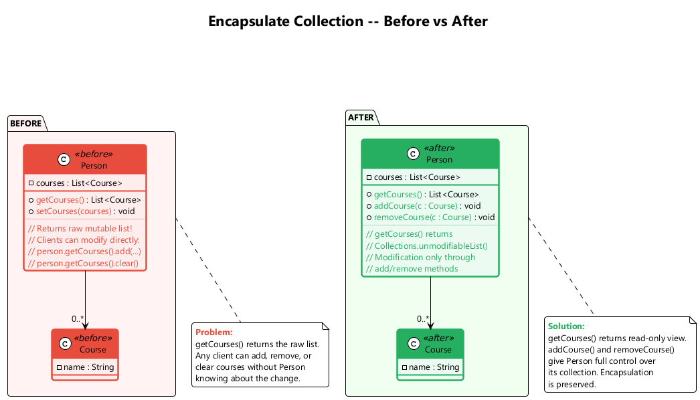

---

<style scoped>section{ font-size: 25px; }</style>

## C12. Replace Type Code with Class

**What:** Replace a type code (int or String) with a class.

**Problem:** A class has a field containing a type code. The values of this type are not used in operator conditions and do not affect the behavior of the program.

**Solution:** Create a new class and use its objects instead of the type code values.

**When to use:** When type codes are used for data only (no behavior depends on them).

**When NOT to use:** When the type code affects behavior -- use Replace Type Code with Subclasses or State/Strategy instead.

---

<style scoped>section{ font-size: 18px; }</style>

## C12. Replace Type Code with Class -- Before / After

```java
// Before
class Person {
    static final int O = 0;
    static final int A = 1;
    static final int B = 2;
    static final int AB = 3;
    private int bloodGroup;
    Person(int bloodGroup) { this.bloodGroup = bloodGroup; }
}
```

```java
// After
class BloodGroup {
    public static final BloodGroup O = new BloodGroup(0);
    public static final BloodGroup A = new BloodGroup(1);
    public static final BloodGroup B = new BloodGroup(2);
    public static final BloodGroup AB = new BloodGroup(3);

    private final int code;
    private BloodGroup(int code) { this.code = code; }
    int getCode() { return code; }
}

class Person {
    private BloodGroup bloodGroup;
    Person(BloodGroup bloodGroup) { this.bloodGroup = bloodGroup; }
}
// Usage: new Person(BloodGroup.A);
```

---

<style scoped>section{ font-size: 25px; }</style>

## C13. Replace Type Code with Subclasses

**What:** Create subclasses for each value of the type code.

**Problem:** You have a coded type that directly affects program behavior (e.g., conditionals that switch on the type code).

**Solution:** Create subclasses for each value of the coded type. Extract the relevant behaviors from the original class to these subclasses. Replace control flow code with polymorphism.

**When to use:** When the type code affects behavior and the type does not change after creation.

**When NOT to use:** When the type code can change at runtime (use State/Strategy instead).

---

<style scoped>section{ font-size: 18px; }</style>

## C13. Replace Type Code with Subclasses -- Before / After

```java
// Before
class Employee {
    static final int ENGINEER = 0;
    static final int SALESMAN = 1;
    static final int MANAGER = 2;
    private int type;

    int payAmount() {
        switch (type) {
            case ENGINEER: return monthlySalary;
            case SALESMAN: return monthlySalary + commission;
            case MANAGER:  return monthlySalary + bonus;
            default: throw new RuntimeException("Invalid type");
        }
    }
}
```

```java
// After
abstract class Employee {
    abstract int payAmount();
}
class Engineer extends Employee {
    int payAmount() { return monthlySalary; }
}
class Salesman extends Employee {
    int payAmount() { return monthlySalary + commission; }
}
class Manager extends Employee {
    int payAmount() { return monthlySalary + bonus; }
}
```

---

### Replace Type Code with Subclasses - Diagram

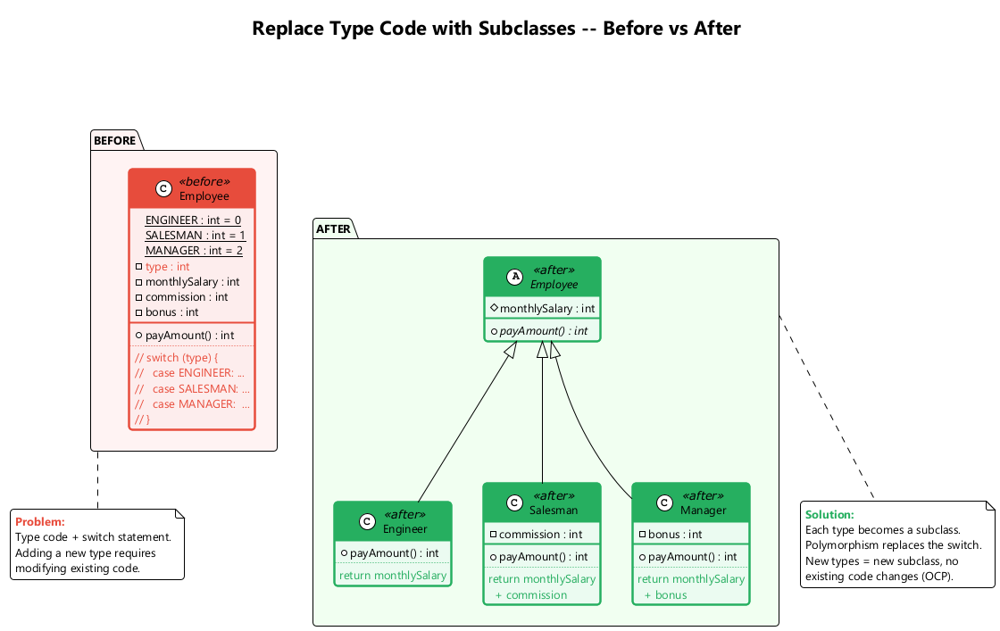

---

<style scoped>section{ font-size: 25px; }</style>

## C14. Replace Type Code with State/Strategy

**What:** Replace the type code with a state object using the State or Strategy pattern.

**Problem:** You have a coded type that affects behavior, but you cannot use subclassing because the type changes at runtime, or the class is already subclassed for another reason.

**Solution:** Replace the type code with a state object. Use the State or Strategy pattern.

**When to use:** When the type code affects behavior AND the type changes during the object's lifetime.

**When NOT to use:** When the type is immutable after construction (use Subclasses instead).

---

<style scoped>section{ font-size: 18px; }</style>

## C14. Replace Type Code with State/Strategy -- Example

```java
// After applying State/Strategy pattern
abstract class EmployeeType {
    abstract int payAmount(Employee employee);
}

class Engineer extends EmployeeType {
    int payAmount(Employee emp) { return emp.getMonthlySalary(); }
}
class Salesman extends EmployeeType {
    int payAmount(Employee emp) { return emp.getMonthlySalary() + emp.getCommission(); }
}
class Manager extends EmployeeType {
    int payAmount(Employee emp) { return emp.getMonthlySalary() + emp.getBonus(); }
}

class Employee {
    private EmployeeType type;

    void setType(EmployeeType type) { this.type = type; }

    int payAmount() { return type.payAmount(this); }
}
// Now the type can change at runtime: emp.setType(new Manager());
```

---

### Replace Type Code with State/Strategy - Diagram

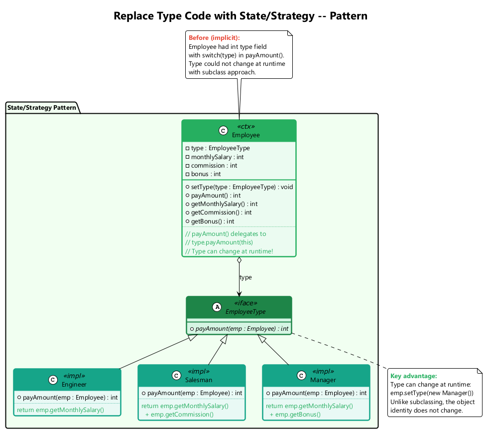

---

<style scoped>section{ font-size: 25px; }</style>

## C15. Replace Subclass with Fields

**What:** Replace subclasses whose only difference is constant-returning methods with fields in the parent class.

**Problem:** You have subclasses that differ only in their methods that return constant data (e.g., `getCode()` returns different values).

**Solution:** Replace the methods with fields in the parent class and eliminate the subclasses.

**When to use:** When subclasses add no real behavior, only returning different constant values.

**When NOT to use:** When subclasses have meaningful behavioral differences beyond returning constants.

---

<style scoped>section{ font-size: 18px; }</style>

## C15. Replace Subclass with Fields -- Before / After

```java
// Before
abstract class Person {
    abstract boolean isMale();
    abstract char getCode();
}
class Male extends Person {
    boolean isMale() { return true; }
    char getCode() { return 'M'; }
}
class Female extends Person {
    boolean isMale() { return false; }
    char getCode() { return 'F'; }
}
```

```java
// After
class Person {
    private final boolean male;
    private final char code;

    private Person(boolean male, char code) {
        this.male = male;
        this.code = code;
    }

    static Person createMale() { return new Person(true, 'M'); }
    static Person createFemale() { return new Person(false, 'F'); }

    boolean isMale() { return male; }
    char getCode() { return code; }
}
```

---

<style scoped>section{ font-size: 18px; }</style>

## Module C -- Takeaway

### Organizing Data: Key Points

| # | Technique | Purpose |
|---|-----------|---------|
| 1 | Self Encapsulate Field | Access fields via getters/setters even internally |
| 2 | Replace Data Value with Object | Promote primitives to objects with behavior |
| 3 | Change Value to Reference | Share identical objects via registry |
| 4 | Change Reference to Value | Simplify small, immutable objects |
| 5 | Replace Array with Object | Name array elements with typed fields |
| 6 | Duplicate Observed Data | Separate GUI data from domain data |
| 7 | Unidirectional to Bidirectional | Add back-pointer for mutual navigation |
| 8 | Bidirectional to Unidirectional | Remove unneeded association direction |
| 9 | Replace Magic Number | Use named constants for clarity |
| 10 | Encapsulate Field | Make public fields private with accessors |
| 11 | Encapsulate Collection | Return read-only views, provide add/remove |
| 12 | Replace Type Code with Class | Use class objects instead of int codes |
| 13 | Type Code with Subclasses | Use polymorphism for type-dependent behavior |
| 14 | Type Code with State/Strategy | Handle runtime-changeable type codes |
| 15 | Replace Subclass with Fields | Eliminate constant-only subclasses |

---

<!-- _backgroundColor: aqua -->

<!-- _color: orange -->

# Module D: Simplifying Conditional Expressions

## 8 Techniques for Cleaner Conditionals

---

## Module D Outline

### Simplifying Conditional Expressions

Conditionals tend to get more and more complicated in their logic over time, and there are yet more techniques to combat this. These refactorings reduce complexity and improve readability of conditional logic.

1. Decompose Conditional
2. Consolidate Conditional Expression
3. Consolidate Duplicate Conditional Fragments
4. Remove Control Flag
5. Replace Nested Conditional with Guard Clauses
6. Replace Conditional with Polymorphism
7. Introduce Null Object
8. Introduce Assertion

---

<style scoped>section{ font-size: 25px; }</style>

## D1. Decompose Conditional

**What:** Extract complex conditional parts into separate, well-named methods.

**Problem:** You have a complex conditional (if-then-else or switch) whose condition, then-branch, and else-branch are hard to understand.

**Solution:** Decompose the complicated parts of the conditional into separate methods: the condition, the then-branch, and the else-branch.

**When to use:** When conditional logic becomes difficult to understand at a glance.

**When NOT to use:** When the condition is already simple and self-documenting.

---

<style scoped>section{ font-size: 18px; }</style>

## D1. Decompose Conditional -- Before / After

```java
// Before
double calculateCharge(Date date, int quantity) {
    double charge;
    if (date.before(SUMMER_START) || date.after(SUMMER_END)) {
        charge = quantity * winterRate + winterServiceCharge;
    } else {
        charge = quantity * summerRate;
    }
    return charge;
}
```

```java
// After
double calculateCharge(Date date, int quantity) {
    if (isNotSummer(date)) {
        return winterCharge(quantity);
    }
    return summerCharge(quantity);
}

boolean isNotSummer(Date date) {
    return date.before(SUMMER_START) || date.after(SUMMER_END);
}

double winterCharge(int quantity) {
    return quantity * winterRate + winterServiceCharge;
}

double summerCharge(int quantity) {
    return quantity * summerRate;
}
```

---

### Decompose Conditional - Before/After Diagram

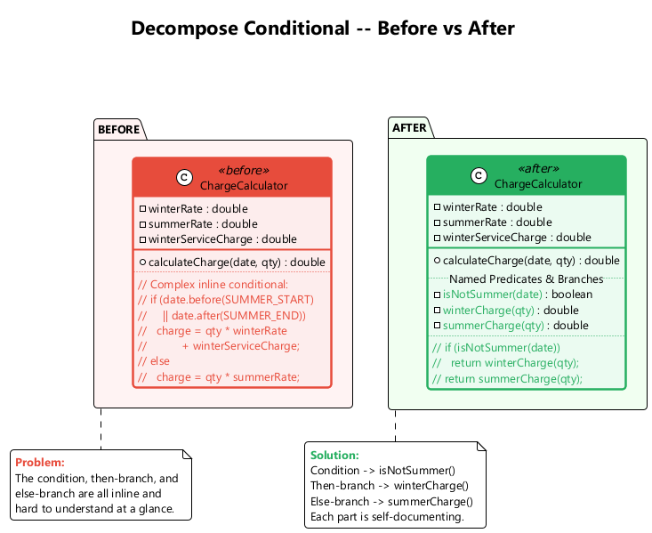

---

<style scoped>section{ font-size: 25px; }</style>

## D2. Consolidate Conditional Expression

**What:** Combine multiple conditionals that lead to the same result into a single expression.

**Problem:** You have multiple conditionals that lead to the same result or action.

**Solution:** Consolidate all these conditionals into a single expression, then extract the combined condition into a well-named method.

**When to use:** When multiple conditions lead to the same result and can be logically combined.

**When NOT to use:** When the conditions are truly independent checks that only coincidentally return the same result.

---

<style scoped>section{ font-size: 20px; }</style>

## D2. Consolidate Conditional Expression -- Before / After

```java
// Before
double disabilityAmount() {
    if (seniority < 2) return 0;
    if (monthsDisabled > 12) return 0;
    if (isPartTime) return 0;
    // compute the disability amount
    return basePay * 0.5;
}
```

```java
// After
double disabilityAmount() {
    if (isNotEligibleForDisability()) return 0;
    return basePay * 0.5;
}

boolean isNotEligibleForDisability() {
    return seniority < 2 || monthsDisabled > 12 || isPartTime;
}
```

---

<style scoped>section{ font-size: 25px; }</style>

## D3. Consolidate Duplicate Conditional Fragments

**What:** Move identical code that appears in all branches outside the conditional.

**Problem:** Identical code can be found in all branches of a conditional.

**Solution:** Move the duplicated code outside of the conditional.

**When to use:** When the same statement appears at the beginning or end of every branch.

**When NOT to use:** When the code only looks similar but is semantically different in each branch.

```java
// Before
if (isSpecialDeal()) {
    total = price * 0.95;
    send();
} else {
    total = price * 0.98;
    send();
}

// After
if (isSpecialDeal()) {
    total = price * 0.95;
} else {
    total = price * 0.98;
}
send();
```

---

<style scoped>section{ font-size: 25px; }</style>

## D4. Remove Control Flag

**What:** Use `break`, `continue`, or `return` instead of a boolean control flag.

**Problem:** You have a boolean variable that acts as a control flag for multiple boolean expressions.

**Solution:** Use `break`, `continue`, and `return` instead of the flag variable.

**When to use:** When boolean variables are used solely to control loop or conditional execution flow.

**When NOT to use:** When the flag variable has genuine domain meaning beyond flow control.

---

<style scoped>section{ font-size: 18px; }</style>

## D4. Remove Control Flag -- Before / After

```java
// Before
boolean found = false;
for (Person person : people) {
    if (!found) {
        if (person.getName().equals("Don")) {
            sendAlert();
            found = true;
        }
        if (person.getName().equals("John")) {
            sendAlert();
            found = true;
        }
    }
}
```

```java
// After
for (Person person : people) {
    if (person.getName().equals("Don") || person.getName().equals("John")) {
        sendAlert();
        break;
    }
}
```

---

<style scoped>section{ font-size: 25px; }</style>

## D5. Replace Nested Conditional with Guard Clauses

**What:** Use guard clauses for special cases, leaving the normal path un-indented.

**Problem:** You have a group of nested conditionals that makes it hard to determine the normal flow of code execution.

**Solution:** Isolate all special checks and edge cases into separate clauses (guard clauses) and place them before the main logic. Return early from each guard clause.

**When to use:** When deeply nested conditions make code hard to follow.

**When NOT to use:** When the condition truly represents two equal alternatives (use if-else).

---

<style scoped>section{ font-size: 18px; }</style>

## D5. Replace Nested Conditional with Guard Clauses -- Before / After

```java
// Before
double getPayAmount() {
    double result;
    if (isDead) {
        result = deadAmount();
    } else {
        if (isSeparated) {
            result = separatedAmount();
        } else {
            if (isRetired) {
                result = retiredAmount();
            } else {
                result = normalPayAmount();
            }
        }
    }
    return result;
}
```

```java
// After
double getPayAmount() {
    if (isDead) return deadAmount();
    if (isSeparated) return separatedAmount();
    if (isRetired) return retiredAmount();
    return normalPayAmount();
}
```

---

<style scoped>section{ font-size: 25px; }</style>

## D6. Replace Conditional with Polymorphism

**What:** Create subclasses matching conditional branches and use polymorphic method calls.

**Problem:** You have a conditional that performs various actions depending on object type or properties.

**Solution:** Create subclasses matching each condition branch. Create a shared method via polymorphism and move the relevant code from each branch to the matching subclass. The original method becomes abstract.

**When to use:** When conditionals depend on object types; when the same conditional structure repeats.

**When NOT to use:** When the conditional is simple and unlikely to grow; when creating subclasses is overkill.

---

<style scoped>section{ font-size: 18px; }</style>

## D6. Replace Conditional with Polymorphism -- Before / After

```java
// Before
class Bird {
    String type;
    double getSpeed() {
        switch (type) {
            case "EUROPEAN":  return getBaseSpeed();
            case "AFRICAN":   return getBaseSpeed() - getLoadFactor() * numberOfCoconuts;
            case "NORWEGIAN_BLUE": return (isNailed) ? 0 : getBaseSpeed();
            default: throw new RuntimeException("Unknown type");
        }
    }
}
```

```java
// After
abstract class Bird {
    abstract double getSpeed();
}
class European extends Bird {
    double getSpeed() { return getBaseSpeed(); }
}
class African extends Bird {
    double getSpeed() { return getBaseSpeed() - getLoadFactor() * numberOfCoconuts; }
}
class NorwegianBlue extends Bird {
    double getSpeed() { return (isNailed) ? 0 : getBaseSpeed(); }
}
```

---

### Replace Conditional with Polymorphism - Diagram

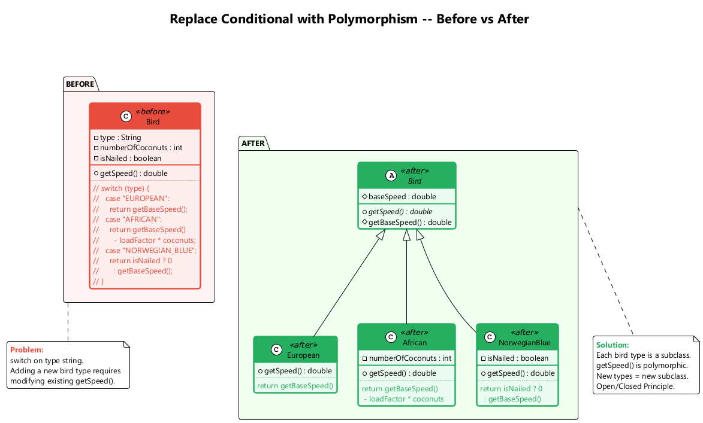

---

<style scoped>section{ font-size: 25px; }</style>

## D7. Introduce Null Object

**What:** Instead of returning `null`, return a special null object that provides default behavior.

**Problem:** Since some methods return `null` instead of real objects, you have many checks for `null` in your code.

**Solution:** Instead of `null`, return a null object that exhibits default behavior.

**When to use:** When null checks clutter code; when null represents "nothing" with a known default behavior.

**When NOT to use:** When null has genuine meaning (e.g., "not found" must be handled differently from "found with defaults").

---

<style scoped>section{ font-size: 18px; }</style>

## D7. Introduce Null Object -- Before / After

```java
// Before
class Site {
    Customer getCustomer() {
        return customer; // may return null
    }
}
// Client:
Customer c = site.getCustomer();
String name = (c == null) ? "occupant" : c.getName();
String plan = (c == null) ? BillingPlan.basic() : c.getPlan();
```

```java
// After
class NullCustomer extends Customer {
    @Override String getName() { return "occupant"; }
    @Override String getPlan() { return BillingPlan.basic(); }
    @Override boolean isNull() { return true; }
}

class Site {
    Customer getCustomer() {
        return (customer == null) ? new NullCustomer() : customer;
    }
}
// Client: no null checks needed
String name = site.getCustomer().getName();
String plan = site.getCustomer().getPlan();
```

---

### Introduce Null Object - Diagram

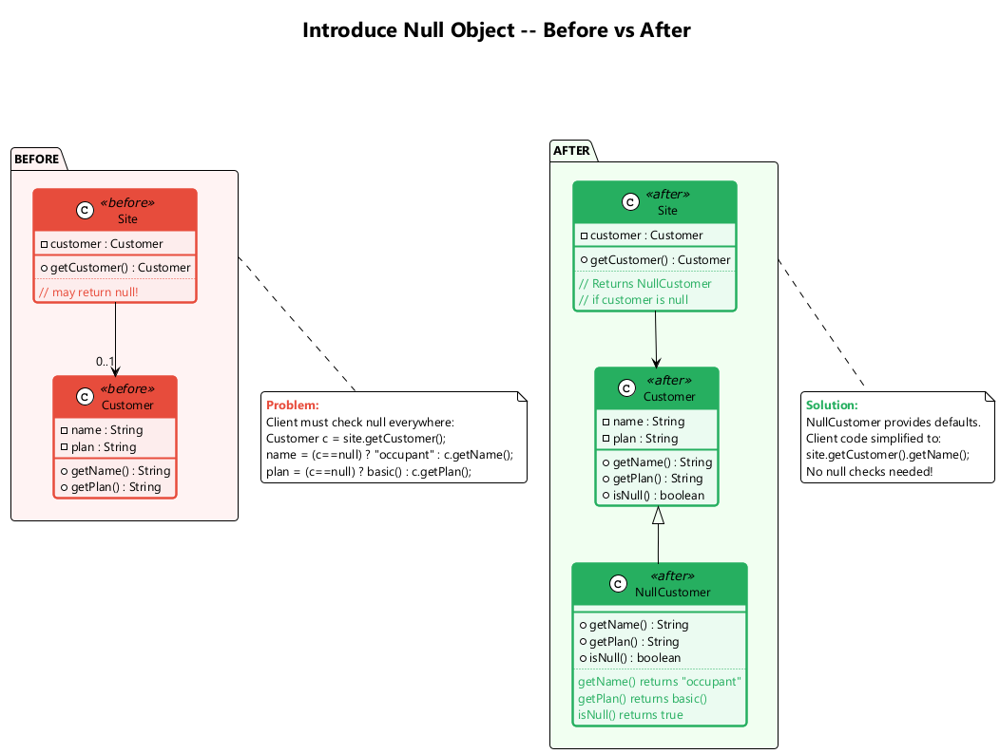

---

<style scoped>section{ font-size: 25px; }</style>

## D8. Introduce Assertion

**What:** Replace assumptions about program state with explicit assertion checks.

**Problem:** A section of code assumes something about the current state of the object or parameter values but does not enforce it.

**Solution:** Replace these assumptions with specific assertion checks.

**When to use:** When you need to document and enforce required preconditions; to make implicit assumptions explicit.

**When NOT to use:** Do not use assertions for input validation in public APIs (use exceptions instead). Assertions are for programmer errors, not user errors.

---

<style scoped>section{ font-size: 22px; }</style>

## D8. Introduce Assertion -- Before / After

```java
// Before
double getExpenseLimit() {
    // should have either expense limit or a primary project
    return (expenseLimit != NULL_EXPENSE)
        ? expenseLimit
        : primaryProject.getMemberExpenseLimit();
}
```

```java
// After
double getExpenseLimit() {
    assert (expenseLimit != NULL_EXPENSE || primaryProject != null)
        : "Must have either expense limit or primary project";

    return (expenseLimit != NULL_EXPENSE)
        ? expenseLimit
        : primaryProject.getMemberExpenseLimit();
}
```

Assertions make implicit assumptions explicit and help catch programmer errors early.

---

<style scoped>section{ font-size: 18px; }</style>

## Module D -- Takeaway

### Simplifying Conditional Expressions: Key Points

| # | Technique | Purpose |
|---|-----------|---------|
| 1 | Decompose Conditional | Extract complex condition/then/else into named methods |
| 2 | Consolidate Conditional Expression | Merge conditions with the same result |
| 3 | Consolidate Duplicate Conditional Fragments | Move identical code out of all branches |
| 4 | Remove Control Flag | Replace flags with break/continue/return |
| 5 | Replace Nested Conditional with Guard Clauses | Flatten deep nesting with early returns |
| 6 | Replace Conditional with Polymorphism | Use subclasses instead of type-switching |
| 7 | Introduce Null Object | Eliminate null checks with default-behavior objects |
| 8 | Introduce Assertion | Make implicit assumptions explicit |

---

<!-- _backgroundColor: aqua -->

<!-- _color: orange -->

# Module E: Simplifying Method Calls

## 14 Techniques for Cleaner Interfaces

---

<style scoped>section{ font-size: 22px; }</style>

## Module E Outline

### Simplifying Method Calls

These techniques make method interfaces simpler and easier to understand. They address method naming, parameter lists, and return semantics.

1. Rename Method
2. Add Parameter
3. Remove Parameter
4. Separate Query from Modifier
5. Parameterize Method
6. Replace Parameter with Explicit Methods
7. Preserve Whole Object
8. Replace Parameter with Method Call
9. Introduce Parameter Object
10. Remove Setting Method
11. Hide Method
12. Replace Constructor with Factory Method
13. Replace Error Code with Exception
14. Replace Exception with Test

---

<style scoped>section{ font-size: 25px; }</style>

## E1. Rename Method

**What:** Give a method a name that reveals its purpose.

**Problem:** The name of a method does not explain what the method does.

**Solution:** Rename the method to something more descriptive.

**When to use:** When the method name is misleading, abbreviated, or unclear.

**When NOT to use:** When the method name is already clear and well-understood.

```java
// Before
class Customer {
    String getsnm() { return surname; }
}

// After
class Customer {
    String getSurname() { return surname; }
}
```

---

<style scoped>section{ font-size: 25px; }</style>

## E2. Add Parameter

**What:** Add a new parameter to a method that needs additional data.

**Problem:** A method does not have enough data to perform certain actions.

**Solution:** Create a new parameter to pass the necessary data.

**When to use:** When a method needs additional information to complete its job.

**When NOT to use:** When the data can be obtained from an existing parameter or from the object itself. Consider Introduce Parameter Object if you are adding too many parameters.

```java
// Before
class Customer {
    Contact getContact() { ... }
}

// After
class Customer {
    Contact getContact(Date date) { ... }
}
```

---

<style scoped>section{ font-size: 25px; }</style>

## E3. Remove Parameter

**What:** Remove an unused parameter from a method.

**Problem:** A parameter is not used in the body of a method.

**Solution:** Remove the unused parameter.

**When to use:** When a parameter is no longer needed after refactoring.

**When NOT to use:** When the parameter is used by overriding methods in subclasses, even if the base class does not use it.

```java
// Before
class Customer {
    Contact getContact(Date date) {
        // date is never used
        return contact;
    }
}

// After
class Customer {
    Contact getContact() {
        return contact;
    }
}
```

---

<style scoped>section{ font-size: 25px; }</style>

## E4. Separate Query from Modifier

**What:** Split a method that returns a value and changes object state into two methods.

**Problem:** You have a method that returns a value but also changes something inside an object (side effect). Callers may not expect the side effect.

**Solution:** Split the method into two separate methods. One returns the value (query), the other performs the modification (command).

**When to use:** When mixing queries and commands leads to unexpected side effects.

**When NOT to use:** When the combined operation is atomic and splitting it would cause concurrency issues.

---

<style scoped>section{ font-size: 18px; }</style>

## E4. Separate Query from Modifier -- Before / After

```java
// Before
class SecurityService {
    String foundMiscreant(String[] people) {
        for (String person : people) {
            if (person.equals("Don")) {
                sendAlert();
                return "Don";
            }
            if (person.equals("John")) {
                sendAlert();
                return "John";
            }
        }
        return "";
    }
}
```

```java
// After
class SecurityService {
    String foundMiscreant(String[] people) {
        for (String person : people) {
            if (person.equals("Don") || person.equals("John")) {
                return person;
            }
        }
        return "";
    }

    void alertIfMiscreant(String[] people) {
        if (!foundMiscreant(people).isEmpty()) {
            sendAlert();
        }
    }
}
```

---

<style scoped>section{ font-size: 25px; }</style>

## E5. Parameterize Method

**What:** Combine similar methods that differ only in internal values by adding a parameter.

**Problem:** Multiple methods perform similar actions that differ only in their internal values, numbers, or operations.

**Solution:** Combine these methods by using a parameter for the varying values.

**When to use:** When duplicate methods differ only by constants or similar values.

**When NOT to use:** When the methods have significantly different logic beyond the differing values.

---

<style scoped>section{ font-size: 20px; }</style>

## E5. Parameterize Method -- Before / After

```java
// Before
class Employee {
    void tenPercentRaise() {
        salary *= 1.1;
    }

    void fivePercentRaise() {
        salary *= 1.05;
    }
}
```

```java
// After
class Employee {
    void raise(double factor) {
        salary *= (1 + factor);
    }
}
// Usage: employee.raise(0.10); employee.raise(0.05);
```

---

<style scoped>section{ font-size: 25px; }</style>

## E6. Replace Parameter with Explicit Methods

**What:** Split a method that uses a parameter to choose behavior into separate methods.

**Problem:** A method is split into parts, each of which is run depending on the value of a parameter (e.g., `setValue("height", 10)`).

**Solution:** Extract the individual parts of the method into their own methods.

**When to use:** When a parameter is used only to select among different behaviors.

**When NOT to use:** When the parameter values are not known at compile time.

```java
// Before
void setValue(String name, int value) {
    if (name.equals("height")) { height = value; }
    else if (name.equals("width")) { width = value; }
}

// After
void setHeight(int value) { height = value; }
void setWidth(int value) { width = value; }
```

---

<style scoped>section{ font-size: 25px; }</style>

## E7. Preserve Whole Object

**What:** Pass the entire object instead of extracting several values and passing them individually.

**Problem:** You get several values from an object and then pass them as parameters to a method.

**Solution:** Instead, try passing the whole object.

**When to use:** When several parameters come from the same object; when future changes might require more data from the same object.

**When NOT to use:** When the called method should not depend on the whole object (to avoid coupling); when only one value is needed.

---

<style scoped>section{ font-size: 20px; }</style>

## E7. Preserve Whole Object -- Before / After

```java
// Before
int low = daysTempRange.getLow();
int high = daysTempRange.getHigh();
boolean withinPlan = plan.withinRange(low, high);
```

```java
// After
boolean withinPlan = plan.withinRange(daysTempRange);

// In HeatingPlan class:
class HeatingPlan {
    boolean withinRange(TempRange daysTempRange) {
        return daysTempRange.getLow() >= rangeLow
            && daysTempRange.getHigh() <= rangeHigh;
    }
}
```

Passing the whole object reduces the number of parameters and makes the method more resilient to future changes.

---

<style scoped>section{ font-size: 25px; }</style>

## E8. Replace Parameter with Method Call

**What:** Instead of passing a computed value as a parameter, let the method compute it itself.

**Problem:** You call a query method and pass its results as a parameter to another method, while that method could call the query directly.

**Solution:** Remove the parameter and let the receiver invoke the method directly.

**When to use:** When the called method can easily obtain the value on its own.

**When NOT to use:** When the called method should not know about or depend on the source of the value.

```java
// Before
int basePrice = quantity * itemPrice;
double discount = getDiscount();
double finalPrice = discountedPrice(basePrice, discount);

// After
double finalPrice = discountedPrice(basePrice);

double discountedPrice(int basePrice) {
    return basePrice - getDiscount();
}
```

---

<style scoped>section{ font-size: 25px; }</style>

## E9. Introduce Parameter Object

**What:** Replace a recurring group of parameters with an object.

**Problem:** Your methods contain a repeating group of parameters (e.g., start and end dates appear in many methods).

**Solution:** Replace these parameters with an object.

**When to use:** When the same group of parameters travels together across multiple methods.

**When NOT to use:** When the parameter group is coincidental and has no domain meaning.

---

<style scoped>section{ font-size: 20px; }</style>

## E9. Introduce Parameter Object -- Before / After

```java
// Before
class Account {
    double getFlowBetween(Date start, Date end) {
        double result = 0;
        for (Entry e : entries) {
            if (e.getDate().after(start) && e.getDate().before(end)) {
                result += e.getValue();
            }
        }
        return result;
    }
}
```

```java
// After
class DateRange {
    private final Date start;
    private final Date end;
    DateRange(Date start, Date end) { this.start = start; this.end = end; }
    Date getStart() { return start; }
    Date getEnd() { return end; }
    boolean includes(Date date) { return date.after(start) && date.before(end); }
}

class Account {
    double getFlowBetween(DateRange range) {
        double result = 0;
        for (Entry e : entries) {
            if (range.includes(e.getDate())) {
                result += e.getValue();
            }
        }
        return result;
    }
}
```

---

### Introduce Parameter Object - Diagram

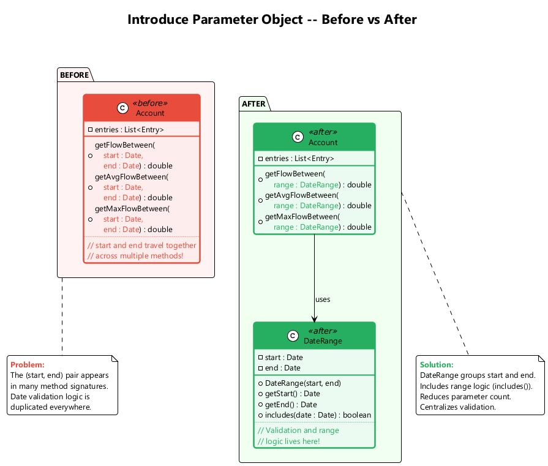

---

<style scoped>section{ font-size: 25px; }</style>

## E10. Remove Setting Method

**What:** Remove the setter for a field that should only be set at creation time.

**Problem:** The value of a field should be set only when it is created, and should not change at any time after that.

**Solution:** Remove the setter method. Set the field only in the constructor.

**When to use:** When a field should be immutable after construction.

**When NOT to use:** When the field legitimately needs to be changed after creation.

```java
// Before
class Employee {
    private String id;
    void setId(String id) { this.id = id; }
    String getId() { return id; }
}

// After
class Employee {
    private final String id;
    Employee(String id) { this.id = id; }
    String getId() { return id; }
}
```

---

<style scoped>section{ font-size: 25px; }</style>

## E11. Hide Method

**What:** Make a method private or protected if it is not used by other classes.

**Problem:** A method is not used by any other classes, or is used only inside its own class hierarchy.

**Solution:** Make the method private (or protected).

**When to use:** When a method's visibility is wider than necessary.

**When NOT to use:** When the method is part of a public API that external clients depend on.

```java
// Before
class Employee {
    public int calculateBonusPercentage() {
        // only used internally
        return yearsOfService > 10 ? 15 : 5;
    }
    public int getBonus() {
        return salary * calculateBonusPercentage() / 100;
    }
}

// After
class Employee {
    private int calculateBonusPercentage() {
        return yearsOfService > 10 ? 15 : 5;
    }
    public int getBonus() {
        return salary * calculateBonusPercentage() / 100;
    }
}
```

---

<style scoped>section{ font-size: 25px; }</style>

## E12. Replace Constructor with Factory Method

**What:** Replace a constructor with a factory method.

**Problem:** You have a complex constructor that does something more than just setting parameter values in object fields. Or you need to return different subclass instances.

**Solution:** Create a factory method and use it instead of the constructor.

**When to use:** When constructors perform logic beyond simple assignment; when you need to return different types.

**When NOT to use:** When construction is simple and straightforward.

---

<style scoped>section{ font-size: 18px; }</style>

## E12. Replace Constructor with Factory Method -- Before / After

```java
// Before
class Employee {
    static final int ENGINEER = 0;
    static final int SALESMAN = 1;
    static final int MANAGER = 2;
    private int type;

    Employee(int type) {
        this.type = type;
    }
}
// Usage: Employee e = new Employee(Employee.ENGINEER);
```

```java
// After
abstract class Employee {
    static Employee create(int type) {
        switch (type) {
            case ENGINEER:  return new Engineer();
            case SALESMAN:  return new Salesman();
            case MANAGER:   return new Manager();
            default: throw new IllegalArgumentException("Invalid type: " + type);
        }
    }
}
// Usage: Employee e = Employee.create(Employee.ENGINEER);
```

---

<style scoped>section{ font-size: 25px; }</style>

## E13. Replace Error Code with Exception

**What:** Throw an exception instead of returning a special error code value.

**Problem:** A method returns a special value (like -1 or null) that indicates an error.

**Solution:** Throw an exception instead.

**When to use:** When error conditions should interrupt normal flow and be explicitly handled by callers.

**When NOT to use:** When the "error" is actually a normal, expected outcome (use a return value or Optional).

```java
// Before
int withdraw(int amount) {
    if (amount > balance) return -1;
    balance -= amount;
    return 0;
}

// After
void withdraw(int amount) {
    if (amount > balance) {
        throw new InsufficientFundsException();
    }
    balance -= amount;
}
```

---

<style scoped>section{ font-size: 25px; }</style>

## E14. Replace Exception with Test

**What:** Replace an exception with a conditional test.

**Problem:** You throw an exception in a place where a simple test would do the job. Exceptions are used for expected control flow.

**Solution:** Replace the exception with a condition test.

**When to use:** When exceptions are used for predictable, non-exceptional situations.

**When NOT to use:** When the condition is truly exceptional and cannot be checked in advance.

```java
// Before
double getValueForPeriod(int periodNumber) {
    try {
        return values[periodNumber];
    } catch (ArrayIndexOutOfBoundsException e) {
        return 0;
    }
}

// After
double getValueForPeriod(int periodNumber) {
    if (periodNumber >= values.length) return 0;
    return values[periodNumber];
}
```

---

<style scoped>section{ font-size: 16px; }</style>

## Module E -- Takeaway

### Simplifying Method Calls: Key Points

| # | Technique | Purpose |
|---|-----------|---------|
| 1 | Rename Method | Give methods names that reveal their purpose |
| 2 | Add Parameter | Supply missing data to a method |
| 3 | Remove Parameter | Delete unused parameters |
| 4 | Separate Query from Modifier | Split side-effect methods into query + command |
| 5 | Parameterize Method | Unify duplicate methods via a parameter |
| 6 | Replace Parameter with Explicit Methods | Replace flag parameters with named methods |
| 7 | Preserve Whole Object | Pass the object instead of extracted values |
| 8 | Replace Parameter with Method Call | Let the receiver compute the value |
| 9 | Introduce Parameter Object | Group recurring parameters into an object |
| 10 | Remove Setting Method | Enforce immutability |
| 11 | Hide Method | Reduce public surface area |
| 12 | Replace Constructor with Factory Method | Enable polymorphic construction |
| 13 | Replace Error Code with Exception | Use exceptions for error signaling |
| 14 | Replace Exception with Test | Use tests for expected conditions |

---

<!-- _backgroundColor: aqua -->

<!-- _color: orange -->

# Module F: Dealing with Generalization

## 12 Techniques for Managing Class Hierarchies

---

<style scoped>section{ font-size: 22px; }</style>

## Module F Outline

### Dealing with Generalization

Abstraction has its own group of refactoring techniques, primarily associated with moving functionality along the class inheritance hierarchy, creating new classes and interfaces, and replacing inheritance with delegation and vice versa.

1. Pull Up Field
2. Pull Up Method
3. Pull Up Constructor Body
4. Push Down Method
5. Push Down Field
6. Extract Subclass
7. Extract Superclass
8. Extract Interface
9. Collapse Hierarchy
10. Form Template Method
11. Replace Inheritance with Delegation
12. Replace Delegation with Inheritance

---

<style scoped>section{ font-size: 25px; }</style>

## F1. Pull Up Field

**What:** Move a field from subclasses to the superclass.

**Problem:** Two or more subclasses have the same field.

**Solution:** Remove the field from subclasses and move it to the superclass.

**When to use:** When multiple subclasses declare the same field.

**When NOT to use:** When the fields only appear similar but represent different concepts in each subclass.

```java
// Before
class Salesman extends Employee {
    private String name;
}
class Engineer extends Employee {
    private String name;
}

// After
class Employee {
    protected String name;
}
class Salesman extends Employee { }
class Engineer extends Employee { }
```

---

<style scoped>section{ font-size: 25px; }</style>

## F2. Pull Up Method

**What:** Move identical methods from subclasses to the superclass.

**Problem:** Your subclasses have methods that perform similar work.

**Solution:** Make the methods identical and then move them to the relevant superclass.

**When to use:** When subclasses implement identical or nearly identical methods.

**When NOT to use:** When the methods are truly different despite similar names.

```java
// Before
class Salesman extends Employee {
    String getName() { return name; }
}
class Engineer extends Employee {
    String getName() { return name; }
}

// After
class Employee {
    String getName() { return name; }
}
class Salesman extends Employee { }
class Engineer extends Employee { }
```

---

### Pull Up Method - Before/After Diagram

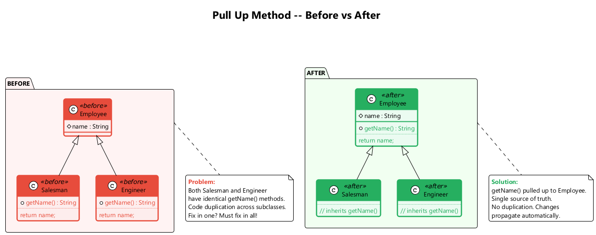

---

<style scoped>section{ font-size: 25px; }</style>

## F3. Pull Up Constructor Body

**What:** Move common constructor code to the superclass constructor.

**Problem:** Your subclasses have constructors with code that is mostly identical.

**Solution:** Create a superclass constructor and move the shared code into it. Call the superclass constructor in subclass constructors.

**When to use:** When constructor logic repeats across the hierarchy.

**When NOT to use:** When only a superficial similarity exists between constructors.

---

<style scoped>section{ font-size: 20px; }</style>

## F3. Pull Up Constructor Body -- Before / After

```java
// Before
class Manager extends Employee {
    private int grade;
    Manager(String name, String id, int grade) {
        this.name = name;
        this.id = id;
        this.grade = grade;
    }
}
class Engineer extends Employee {
    Engineer(String name, String id) {
        this.name = name;
        this.id = id;
    }
}
```

```java
// After
class Employee {
    protected String name;
    protected String id;
    Employee(String name, String id) {
        this.name = name;
        this.id = id;
    }
}
class Manager extends Employee {
    private int grade;
    Manager(String name, String id, int grade) {
        super(name, id);
        this.grade = grade;
    }
}
class Engineer extends Employee {
    Engineer(String name, String id) {
        super(name, id);
    }
}
```

---

<style scoped>section{ font-size: 25px; }</style>

## F4. Push Down Method

**What:** Move a method from a superclass to specific subclasses that need it.

**Problem:** Behavior implemented in a superclass is used by only one (or a few) subclasses.

**Solution:** Move the method to those specific subclasses.

**When to use:** When a method is only relevant to a subset of subclasses.

**When NOT to use:** When the method is used by most or all subclasses.

```java
// Before
class Employee {
    int getQuota() { ... } // only relevant for Salesman
}
class Engineer extends Employee { }
class Salesman extends Employee { }

// After
class Employee { }
class Engineer extends Employee { }
class Salesman extends Employee {
    int getQuota() { ... }
}
```

---

<style scoped>section{ font-size: 25px; }</style>

## F5. Push Down Field

**What:** Move a field from a superclass to specific subclasses that need it.

**Problem:** A field is used only in a few subclasses, not across the entire hierarchy.

**Solution:** Move the field to those specific subclasses.

**When to use:** When not all subclasses require the same data.

**When NOT to use:** When the field is used by most subclasses.

```java
// Before
class Employee {
    protected int quota; // only used by Salesman
}
class Engineer extends Employee { }
class Salesman extends Employee { }

// After
class Employee { }
class Engineer extends Employee { }
class Salesman extends Employee {
    private int quota;
}
```

---

<style scoped>section{ font-size: 25px; }</style>

## F6. Extract Subclass

**What:** Create a subclass for features that are used only in certain cases.

**Problem:** A class has features that are used only in certain cases.

**Solution:** Create a subclass from these features.

**When to use:** When a class has behavior that is relevant only for some instances; when you see type codes or conditionals that differentiate instance behavior.

**When NOT to use:** When the variation is better handled by delegation or strategy.

---

<style scoped>section{ font-size: 18px; }</style>

## F6. Extract Subclass -- Before / After

```java
// Before
class JobItem {
    private int unitPrice;
    private int quantity;
    private boolean isLabor;
    private Employee employee;

    int getTotalPrice() {
        return getUnitPrice() * quantity;
    }

    int getUnitPrice() {
        return isLabor ? employee.getRate() : unitPrice;
    }
}
```

```java
// After
class JobItem {
    protected int unitPrice;
    protected int quantity;

    int getTotalPrice() { return getUnitPrice() * quantity; }
    int getUnitPrice() { return unitPrice; }
}

class LaborItem extends JobItem {
    private Employee employee;

    @Override
    int getUnitPrice() { return employee.getRate(); }
}
```

---

<style scoped>section{ font-size: 25px; }</style>

## F7. Extract Superclass

**What:** Create a shared superclass for two classes with common fields and methods.

**Problem:** You have two classes with common fields and methods.

**Solution:** Create a superclass for them and move all the common fields and methods to the superclass.

**When to use:** When multiple classes share significant functionality.

**When NOT to use:** When the similarity is coincidental and does not represent a true "is-a" relationship.

---

<style scoped>section{ font-size: 18px; }</style>

## F7. Extract Superclass -- Before / After

```java
// Before
class Department {
    String name;
    int getAnnualCost() { /* sum of staff costs */ }
    int getHeadCount() { /* number of staff */ }
    String getName() { return name; }
}
class Employee {
    String name;
    int getAnnualCost() { return salary; }
    int getId() { return id; }
    String getName() { return name; }
}
```

```java
// After
abstract class Party {
    protected String name;
    String getName() { return name; }
    abstract int getAnnualCost();
}
class Department extends Party {
    int getAnnualCost() { /* sum of staff costs */ }
    int getHeadCount() { /* number of staff */ }
}
class Employee extends Party {
    int getAnnualCost() { return salary; }
    int getId() { return id; }
}
```

---

<style scoped>section{ font-size: 25px; }</style>

## F8. Extract Interface

**What:** Move a shared portion of a class interface into its own interface.

**Problem:** Multiple clients use the same subset of a class's interface. Or two classes have a part of their interfaces in common.

**Solution:** Move this identical portion to its own interface.

**When to use:** When you want to decouple clients from specific implementations; when classes share a behavioral contract.

**When NOT to use:** When the interface would contain only one method (may not be worth the abstraction).

---

<style scoped>section{ font-size: 20px; }</style>

## F8. Extract Interface -- Before / After

```java
// Before
class Employee {
    int getRate() { return salary / 12; }
    boolean hasSpecialSkill() { ... }
    String getName() { return name; }
    String getDepartment() { return department; }
}
// Client only cares about getRate() and hasSpecialSkill()
```

```java
// After
interface Billable {
    int getRate();
    boolean hasSpecialSkill();
}

class Employee implements Billable {
    public int getRate() { return salary / 12; }
    public boolean hasSpecialSkill() { ... }
    String getName() { return name; }
    String getDepartment() { return department; }
}
// Client depends on Billable interface, not Employee
```

---

<style scoped>section{ font-size: 25px; }</style>

## F9. Collapse Hierarchy

**What:** Merge a superclass and subclass when they are practically the same.

**Problem:** You have a class hierarchy in which a subclass is practically the same as its superclass.

**Solution:** Merge the subclass and superclass.

**When to use:** When the hierarchy no longer adds value; when a subclass has no significant differences from its parent.

**When NOT to use:** When the distinction between the classes is meaningful for future extensibility.

```java
// Before
class Employee { ... }
class Salesman extends Employee {
    // no meaningful additions
}

// After -- merge Salesman into Employee
class Employee {
    // all functionality here
}
```

---

<style scoped>section{ font-size: 25px; }</style>

## F10. Form Template Method

**What:** Move the shared algorithm structure to a superclass while keeping varying steps in subclasses.

**Problem:** Your subclasses implement algorithms that contain similar steps in the same order, but the individual steps are different.

**Solution:** Move the algorithm structure to a superclass method (the template method), and keep the varying steps as abstract methods in the subclasses.

**When to use:** When subclasses share an algorithm structure but differ in details.

**When NOT to use:** When the algorithms have fundamentally different structures.

---

<style scoped>section{ font-size: 18px; }</style>

## F10. Form Template Method -- Before / After

```java
// Before
class TextStatement {
    String value(Customer c) {
        String result = "Statement for " + c.getName() + "\n";
        for (Rental r : c.getRentals()) {
            result += r.getMovie().getTitle() + ": " + r.getCharge() + "\n";
        }
        result += "Total: " + c.getTotalCharge();
        return result;
    }
}
class HtmlStatement {
    String value(Customer c) {
        String result = "<h1>Statement for " + c.getName() + "</h1>";
        for (Rental r : c.getRentals()) {
            result += "<p>" + r.getMovie().getTitle() + ": " + r.getCharge() + "</p>";
        }
        result += "<p>Total: " + c.getTotalCharge() + "</p>";
        return result;
    }
}
```

```java
// After -- Template Method pattern
abstract class Statement {
    String value(Customer c) {  // template method
        String result = headerString(c);
        for (Rental r : c.getRentals()) {
            result += rentalString(r);
        }
        result += footerString(c);
        return result;
    }
    abstract String headerString(Customer c);
    abstract String rentalString(Rental r);
    abstract String footerString(Customer c);
}
```

---

<style scoped>section{ font-size: 25px; }</style>

## F11. Replace Inheritance with Delegation

**What:** Create a field for the superclass, delegate methods to it, and remove the inheritance.

**Problem:** A subclass uses only a portion of the methods of its superclass (or it is not possible to inherit the superclass's data). The inheritance does not represent a true "is-a" relationship.

**Solution:** Create a field and put a superclass object in it, delegate methods to the superclass object, and get rid of inheritance.

**When to use:** When a subclass violates the Liskov Substitution Principle; when it only uses some inherited methods.

**When NOT to use:** When the inheritance genuinely represents an "is-a" relationship.

---

<style scoped>section{ font-size: 18px; }</style>

## F11. Replace Inheritance with Delegation -- Before / After

```java
// Before -- MyStack inherits from Vector but is not a true Vector
class MyStack<E> extends Vector<E> {
    public E push(E item) {
        addElement(item);
        return item;
    }
    public E pop() {
        E obj = peek();
        removeElementAt(size() - 1);
        return obj;
    }
    public E peek() {
        return elementAt(size() - 1);
    }
    // Problem: clients can call insertElementAt(), removeElementAt() etc.
}
```

```java
// After -- delegation instead of inheritance
class MyStack<E> {
    private Vector<E> vector = new Vector<>();

    public E push(E item) {
        vector.addElement(item);
        return item;
    }
    public E pop() {
        E obj = peek();
        vector.removeElementAt(vector.size() - 1);
        return obj;
    }
    public E peek() {
        return vector.elementAt(vector.size() - 1);
    }
    public int size() { return vector.size(); }
    public boolean isEmpty() { return vector.isEmpty(); }
}
```

---

### Replace Inheritance with Delegation - Diagram

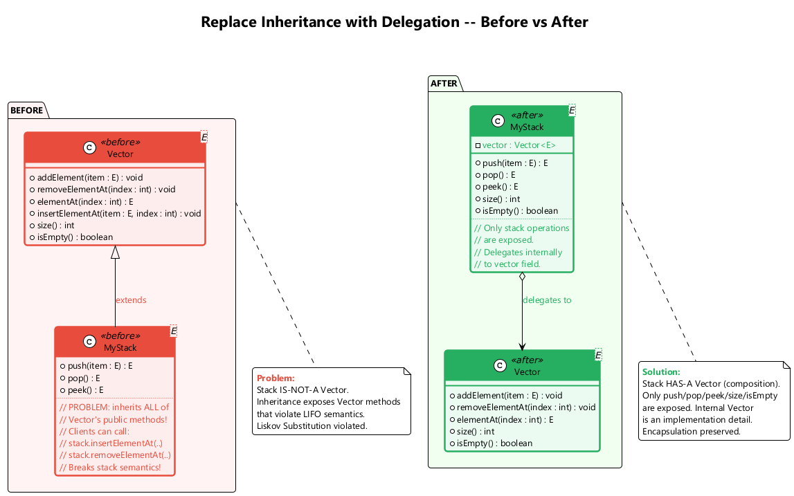

---

<style scoped>section{ font-size: 25px; }</style>

## F12. Replace Delegation with Inheritance

**What:** Make the delegating class inherit from the delegate, eliminating boilerplate delegation.

**Problem:** A class contains many simple methods that delegate to all methods of another class.

**Solution:** Make the class an inheritor of the delegate, which makes the delegating methods unnecessary.

**When to use:** When the class delegates most methods to another class and the relationship is truly "is-a".

**When NOT to use:** When the delegate is used by several classes (shared state); when the delegate is mutable and you only want partial behavior.

---

<style scoped>section{ font-size: 18px; }</style>

## F12. Replace Delegation with Inheritance -- Before / After

```java
// Before -- excessive delegation
class Employee {
    private Person person = new Person();

    String getName() { return person.getName(); }
    void setName(String name) { person.setName(name); }
    String getAddress() { return person.getAddress(); }
    void setAddress(String addr) { person.setAddress(addr); }
    String getPhone() { return person.getPhone(); }
    void setPhone(String phone) { person.setPhone(phone); }
    // ... many more delegations
}
```

```java
// After -- inheritance eliminates boilerplate
class Employee extends Person {
    // getName(), setName(), getAddress(), etc.
    // are all inherited automatically
    private String employeeId;
    private double salary;

    String getEmployeeId() { return employeeId; }
    double getSalary() { return salary; }
}
```

---

<style scoped>section{ font-size: 16px; }</style>

## Module F -- Takeaway

### Dealing with Generalization: Key Points

| # | Technique | Purpose |
|---|-----------|---------|
| 1 | Pull Up Field | Eliminate duplicate fields in subclasses |
| 2 | Pull Up Method | Eliminate duplicate methods in subclasses |
| 3 | Pull Up Constructor Body | Share constructor initialization in superclass |
| 4 | Push Down Method | Move superclass methods to specific subclasses |
| 5 | Push Down Field | Move superclass fields to specific subclasses |
| 6 | Extract Subclass | Create subclass for case-specific features |
| 7 | Extract Superclass | Create shared parent for common functionality |
| 8 | Extract Interface | Define behavioral contracts separately |
| 9 | Collapse Hierarchy | Merge redundant class levels |
| 10 | Form Template Method | Share algorithm structure, vary steps |
| 11 | Replace Inheritance with Delegation | Use "has-a" instead of inappropriate "is-a" |
| 12 | Replace Delegation with Inheritance | Eliminate boilerplate when "is-a" fits |

---

<!-- _backgroundColor: aqua -->

<!-- _color: orange -->

# Complete Summary

## All 66 Refactoring Techniques

---

<style scoped>section{ font-size: 14px; }</style>

## All 66 Techniques at a Glance (1/4)

### Composing Methods (A1--A9) & Moving Features (B1--B8)

| # | Technique | Category | One-Line Purpose |
|---|-----------|----------|-----------------|
| A1 | Extract Method | Composing Methods | Break long methods into named pieces |
| A2 | Inline Method | Composing Methods | Remove trivial indirection |
| A3 | Extract Variable | Composing Methods | Name complex sub-expressions |
| A4 | Inline Temp | Composing Methods | Remove blocking temporaries |
| A5 | Replace Temp with Query | Composing Methods | Turn temps into reusable query methods |
| A6 | Split Temporary Variable | Composing Methods | One purpose per variable |
| A7 | Remove Assignments to Parameters | Composing Methods | Preserve parameter semantics |
| A8 | Replace Method with Method Object | Composing Methods | Handle complex variable dependencies |
| A9 | Substitute Algorithm | Composing Methods | Replace with clearer algorithm |
| B1 | Move Method | Moving Features | Place method with its data |
| B2 | Move Field | Moving Features | Place field with its users |
| B3 | Extract Class | Moving Features | Split overloaded classes |
| B4 | Inline Class | Moving Features | Merge underpowered classes |
| B5 | Hide Delegate | Moving Features | Reduce coupling |
| B6 | Remove Middle Man | Moving Features | Eliminate excessive delegation |
| B7 | Introduce Foreign Method | Moving Features | Add method to sealed class (one-off) |
| B8 | Introduce Local Extension | Moving Features | Add methods to sealed class (many) |

---

<style scoped>section{ font-size: 14px; }</style>

## All 66 Techniques at a Glance (2/4)

### Organizing Data (C1--C15)

| # | Technique | Category | One-Line Purpose |
|---|-----------|----------|-----------------|
| C1 | Self Encapsulate Field | Organizing Data | Access fields via getters/setters internally |
| C2 | Replace Data Value with Object | Organizing Data | Promote primitives to objects |
| C3 | Change Value to Reference | Organizing Data | Share identical objects via registry |
| C4 | Change Reference to Value | Organizing Data | Simplify small, immutable objects |
| C5 | Replace Array with Object | Organizing Data | Name array elements with typed fields |
| C6 | Duplicate Observed Data | Organizing Data | Separate GUI data from domain data |
| C7 | Unidirectional to Bidirectional | Organizing Data | Add back-pointer for mutual navigation |
| C8 | Bidirectional to Unidirectional | Organizing Data | Remove unneeded association direction |
| C9 | Replace Magic Number | Organizing Data | Use named constants |
| C10 | Encapsulate Field | Organizing Data | Make public fields private with accessors |
| C11 | Encapsulate Collection | Organizing Data | Return read-only views, provide add/remove |
| C12 | Replace Type Code with Class | Organizing Data | Use class objects instead of int codes |
| C13 | Type Code with Subclasses | Organizing Data | Polymorphism for type-dependent behavior |
| C14 | Type Code with State/Strategy | Organizing Data | Handle runtime-changeable type codes |
| C15 | Replace Subclass with Fields | Organizing Data | Eliminate constant-only subclasses |

---

<style scoped>section{ font-size: 14px; }</style>

## All 66 Techniques at a Glance (3/4)

### Simplifying Conditionals (D1--D8) & Simplifying Method Calls (E1--E14)

| # | Technique | Category | One-Line Purpose |
|---|-----------|----------|-----------------|
| D1 | Decompose Conditional | Simplifying Conditionals | Extract condition/then/else into methods |
| D2 | Consolidate Conditional Expression | Simplifying Conditionals | Merge conditions with same result |
| D3 | Consolidate Duplicate Fragments | Simplifying Conditionals | Move identical code out of branches |
| D4 | Remove Control Flag | Simplifying Conditionals | Use break/continue/return |
| D5 | Guard Clauses | Simplifying Conditionals | Flatten deep nesting |
| D6 | Conditional with Polymorphism | Simplifying Conditionals | Use subclasses instead of switches |
| D7 | Introduce Null Object | Simplifying Conditionals | Eliminate null checks |
| D8 | Introduce Assertion | Simplifying Conditionals | Make assumptions explicit |
| E1 | Rename Method | Method Calls | Reveal method purpose |
| E2 | Add Parameter | Method Calls | Supply missing data |
| E3 | Remove Parameter | Method Calls | Delete unused parameters |
| E4 | Separate Query from Modifier | Method Calls | Split side-effect methods |
| E5 | Parameterize Method | Method Calls | Unify methods via parameter |
| E6 | Parameter with Explicit Methods | Method Calls | Replace flag parameters |
| E7 | Preserve Whole Object | Method Calls | Pass object instead of values |
| E8 | Parameter with Method Call | Method Calls | Let receiver compute value |
| E9 | Introduce Parameter Object | Method Calls | Group recurring parameters |
| E10 | Remove Setting Method | Method Calls | Enforce immutability |
| E11 | Hide Method | Method Calls | Reduce public surface |
| E12 | Constructor with Factory Method | Method Calls | Polymorphic construction |
| E13 | Error Code with Exception | Method Calls | Use exceptions for errors |
| E14 | Exception with Test | Method Calls | Use tests for expected cases |

---

<style scoped>section{ font-size: 14px; }</style>

## All 66 Techniques at a Glance (4/4)

### Dealing with Generalization (F1--F12)

| # | Technique | Category | One-Line Purpose |
|---|-----------|----------|-----------------|
| F1 | Pull Up Field | Generalization | Eliminate duplicate fields in subclasses |
| F2 | Pull Up Method | Generalization | Eliminate duplicate methods in subclasses |
| F3 | Pull Up Constructor Body | Generalization | Share constructor initialization |
| F4 | Push Down Method | Generalization | Move methods to specific subclasses |
| F5 | Push Down Field | Generalization | Move fields to specific subclasses |
| F6 | Extract Subclass | Generalization | Create subclass for special features |
| F7 | Extract Superclass | Generalization | Create shared parent class |
| F8 | Extract Interface | Generalization | Define behavioral contracts |
| F9 | Collapse Hierarchy | Generalization | Merge redundant class levels |
| F10 | Form Template Method | Generalization | Share algorithm structure |
| F11 | Replace Inheritance with Delegation | Generalization | Use "has-a" over inappropriate "is-a" |
| F12 | Replace Delegation with Inheritance | Generalization | Eliminate boilerplate delegation |

### **Total: 66 Refactoring Techniques across 6 Categories**

---

<style scoped>section{ font-size: 14px; }</style>

## Code Smell to Refactoring: Bloaters

| Code Smell | Description | Recommended Refactorings |
|------------|-------------|--------------------------|
| **Long Method** | A method contains too many lines of code (generally, more than 10 lines) | Extract Method, Replace Temp with Query, Introduce Parameter Object, Preserve Whole Object, Replace Method with Method Object, Decompose Conditional |
| **Large Class** | A class contains many fields/methods/lines of code | Extract Class, Extract Subclass, Extract Interface, Duplicate Observed Data |
| **Primitive Obsession** | Use of primitives instead of small objects for simple tasks (currency, ranges, phone numbers) | Replace Data Value with Object, Replace Type Code with Class, Replace Type Code with Subclasses, Replace Type Code with State/Strategy, Replace Array with Object, Introduce Parameter Object |
| **Long Parameter List** | More than three or four parameters for a method | Replace Parameter with Method Call, Preserve Whole Object, Introduce Parameter Object |
| **Data Clumps** | Groups of variables passed together in multiple places | Extract Class, Introduce Parameter Object, Preserve Whole Object |

---

<style scoped>section{ font-size: 14px; }</style>

## Code Smell to Refactoring: Object-Orientation Abusers

| Code Smell | Description | Recommended Refactorings |
|------------|-------------|--------------------------|
| **Switch Statements** | Complex switch operators or if-else chains | Decompose Conditional, Replace Conditional with Polymorphism, Replace Type Code with Subclasses, Replace Type Code with State/Strategy, Replace Parameter with Explicit Methods, Introduce Null Object |
| **Temporary Field** | Temporary fields that get their values only under certain circumstances | Extract Class, Introduce Null Object |
| **Refused Bequest** | A subclass uses only some of the methods and properties inherited from its parents | Replace Inheritance with Delegation, Extract Subclass |
| **Alternative Classes with Different Interfaces** | Two classes perform identical functions but have different method names | Rename Method, Extract Superclass, Move Method |

---

<style scoped>section{ font-size: 14px; }</style>

## Code Smell to Refactoring: Change Preventers

| Code Smell | Description | Recommended Refactorings |
|------------|-------------|--------------------------|
| **Divergent Change** | You find yourself having to change many unrelated methods when you make changes to a class | Extract Class |
| **Shotgun Surgery** | Making any modification requires many small changes to many different classes | Move Method, Move Field, Inline Class |
| **Parallel Inheritance Hierarchies** | Whenever you create a subclass for a class, you find yourself needing to create a subclass for another class | Move Method, Move Field |

---

<style scoped>section{ font-size: 14px; }</style>

## Code Smell to Refactoring: Dispensables

| Code Smell | Description | Recommended Refactorings |
|------------|-------------|--------------------------|
| **Comments** | A method is filled with explanatory comments | Extract Variable, Extract Method, Rename Method, Introduce Assertion |
| **Duplicate Code** | Two code fragments look almost identical | Extract Method, Pull Up Method, Form Template Method, Extract Class |
| **Lazy Class** | A class does too little to justify its existence | Inline Class, Collapse Hierarchy |
| **Data Class** | A class contains only fields and crude accessors | Encapsulate Field, Encapsulate Collection, Move Method, Extract Method, Remove Setting Method, Hide Method |
| **Dead Code** | A variable, parameter, field, method, or class is no longer used anywhere | Delete the unused code (Inline Class, Collapse Hierarchy, Remove Parameter) |
| **Speculative Generality** | There is an unused class, method, field, or parameter created "just in case" for future use | Collapse Hierarchy, Inline Class, Inline Method, Remove Parameter |

---

<style scoped>section{ font-size: 14px; }</style>

## Code Smell to Refactoring: Couplers

| Code Smell | Description | Recommended Refactorings |
|------------|-------------|--------------------------|
| **Feature Envy** | A method accesses the data of another object more than its own data | Move Method, Extract Method |
| **Inappropriate Intimacy** | One class uses the internal fields and methods of another class | Move Method, Move Field, Extract Class, Hide Delegate, Change Bidirectional Association to Unidirectional, Replace Inheritance with Delegation |
| **Message Chains** | You see a series of calls like `a.getB().getC().getD()` | Hide Delegate, Extract Method, Move Method |
| **Middle Man** | A class does nothing except delegate to another class | Remove Middle Man, Inline Method, Replace Delegation with Inheritance |
| **Incomplete Library Class** | A library class does not have a method you need | Introduce Foreign Method, Introduce Local Extension |

---

## Refactoring Best Practices

1. **Always have tests** before refactoring -- refactoring without tests is risky
2. **Small steps** -- each refactoring should be a small, verifiable change
3. **Commit frequently** -- after each successful refactoring step
4. **Do not add functionality** while refactoring -- separate concerns
5. **Follow your nose** -- if code smells, investigate and refactor
6. **Use IDE support** -- automated refactoring tools reduce manual errors (IntelliJ IDEA, Eclipse, VS Code)
7. **Review the result** -- ensure the refactored code is actually better
8. **Refactor continuously** -- not as a one-time event but as part of daily development

---

## References

- Fowler, M. (1999). *Refactoring: Improving the Design of Existing Code*. Addison-Wesley Professional.
- Fowler, M. (2018). *Refactoring: Improving the Design of Existing Code* (2nd Edition). Addison-Wesley Professional.
- RefactoringGuru. *Refactoring Techniques*. [https://refactoring.guru/refactoring/techniques](https://refactoring.guru/refactoring/techniques)
- RefactoringGuru. *Composing Methods*. [https://refactoring.guru/refactoring/techniques/composing-methods](https://refactoring.guru/refactoring/techniques/composing-methods)
- RefactoringGuru. *Moving Features between Objects*. [https://refactoring.guru/refactoring/techniques/moving-features-between-objects](https://refactoring.guru/refactoring/techniques/moving-features-between-objects)
- RefactoringGuru. *Organizing Data*. [https://refactoring.guru/refactoring/techniques/organizing-data](https://refactoring.guru/refactoring/techniques/organizing-data)

---

## References (continued)

- RefactoringGuru. *Simplifying Conditional Expressions*. [https://refactoring.guru/refactoring/techniques/simplifying-conditional-expressions](https://refactoring.guru/refactoring/techniques/simplifying-conditional-expressions)
- RefactoringGuru. *Simplifying Method Calls*. [https://refactoring.guru/refactoring/techniques/simplifying-method-calls](https://refactoring.guru/refactoring/techniques/simplifying-method-calls)
- RefactoringGuru. *Dealing with Generalization*. [https://refactoring.guru/refactoring/techniques/dealing-with-generalization](https://refactoring.guru/refactoring/techniques/dealing-with-generalization)
- RefactoringGuru. *Code Smells*. [https://refactoring.guru/refactoring/smells](https://refactoring.guru/refactoring/smells)
- Kerievsky, J. (2004). *Refactoring to Patterns*. Addison-Wesley Professional.
- Martin, R. C. (2008). *Clean Code: A Handbook of Agile Software Craftsmanship*. Prentice Hall.

---
