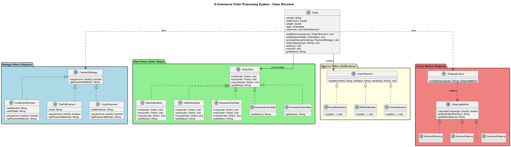
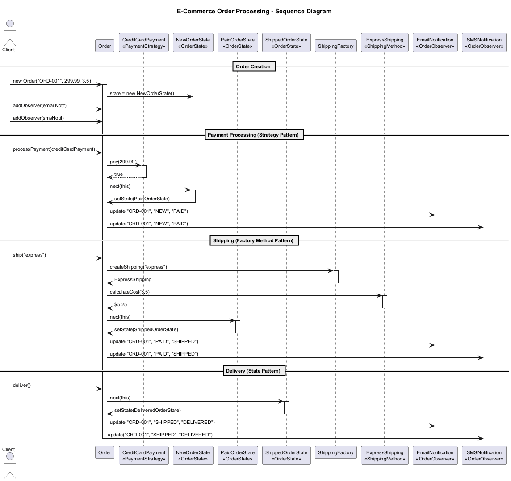
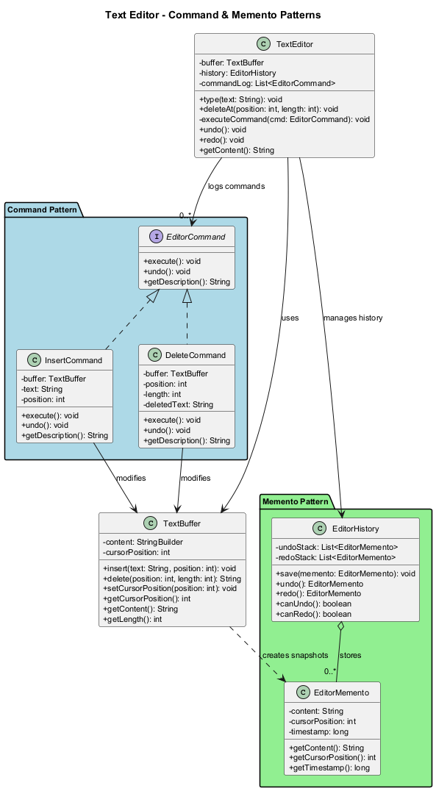
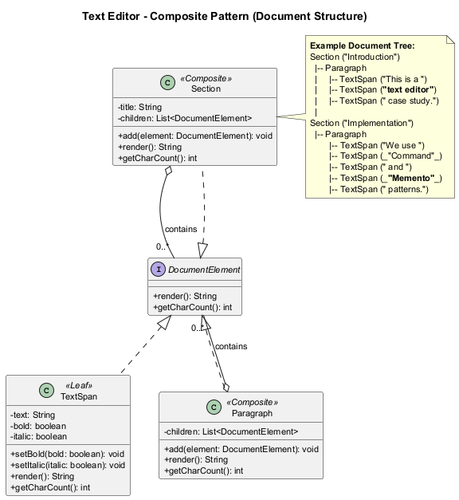
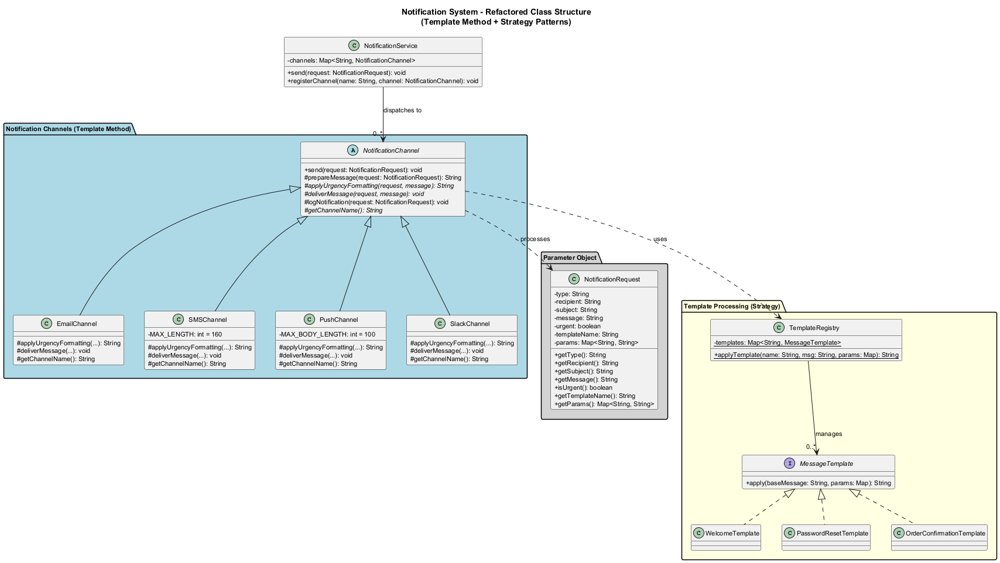
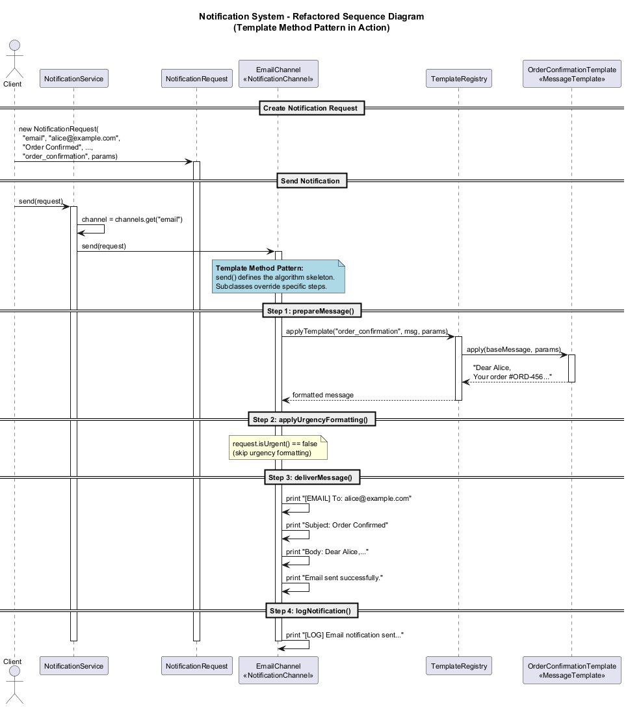

<!-- _backgroundColor: aqua -->

<!-- _color: orange -->

<!-- paginate: false -->

## CEN206 Object-Oriented Programming

## Week-14 (Case Studies - Design Patterns & Refactoring in Practice)

#### Spring Semester, 2025-2026

Download [DOC-PDF](ce204-week-14.en.md_doc.pdf), [DOC-DOCX](ce204-week-14.en.md_word.docx), [SLIDE](ce204-week-14.en.md_slide.pdf)

<iframe width=700, height=500 frameBorder=0 src="../ce204-week-14.en.md_slide.html"></iframe>

---

<!-- paginate: true -->

## Week-14 Overview

### Case Studies - Design Patterns & Refactoring in Practice

| Module | Topic |
|--------|-------|
| A | Real-World Design Pattern Applications |
| B | Case Study 1 -- E-Commerce Order Processing System |
| C | Case Study 2 -- Text Editor with Undo/Redo |
| D | Case Study 3 -- Notification System Refactoring |
| E | Best Practices & Anti-Patterns |

---

## Why Case Studies?

- Design patterns and refactoring techniques are powerful tools, but their true value is seen in **real-world applications**.
- Studying case studies helps us understand:
  - **When** to apply a pattern
  - **How** patterns work together in a system
  - **What** improvements they bring to code quality
  - **Where** refactoring makes the biggest impact

---

<!-- _backgroundColor: aqua -->

<!-- _color: orange -->

# Module A: Real-World Design Pattern Applications

## How Design Patterns Appear in Java Frameworks

---

## Module A Outline

### Real-World Design Pattern Applications

Design patterns are not just academic concepts. They are extensively used in production frameworks and libraries you use every day.

1. Singleton in `Runtime.getRuntime()`
2. Iterator in `java.util.Iterator`
3. Observer in `EventListener`
4. Factory Method in `Calendar.getInstance()`
5. Decorator in `java.io` Streams
6. Strategy in `java.util.Comparator`
7. Template Method in `java.io.InputStream`
8. Adapter in `Arrays.asList()`

---

## A1. Singleton -- `Runtime.getRuntime()`

**Pattern:** Singleton ensures a class has only one instance and provides a global point of access.

**Where it appears:** `java.lang.Runtime` -- every Java application has exactly one `Runtime` object.

```java
public class SingletonExample {
    public static void main(String[] args) {
        // Runtime uses the Singleton pattern
        Runtime runtime1 = Runtime.getRuntime();
        Runtime runtime2 = Runtime.getRuntime();

        // Both references point to the same object
        System.out.println(runtime1 == runtime2); // true

        // Use the singleton to get system info
        System.out.println("Available processors: "
            + runtime1.availableProcessors());
        System.out.println("Free memory: "
            + runtime1.freeMemory() + " bytes");
    }
}
```

---

<style scoped>section{ font-size: 22px; }</style>

## A1. Singleton -- How `Runtime` Works Internally

The JDK implements `Runtime` as a classic Singleton:

```java
public class Runtime {
    // Eager initialization -- instance created at class loading
    private static final Runtime currentRuntime = new Runtime();

    // Private constructor prevents external instantiation
    private Runtime() {}

    // Global access point
    public static Runtime getRuntime() {
        return currentRuntime;
    }

    public int availableProcessors() {
        // native implementation
    }

    public long freeMemory() {
        // native implementation
    }
}
```

**Key takeaway:** The JVM guarantees only one `Runtime` instance exists, which makes sense because there is only one runtime environment per application.

---

## A2. Iterator -- `java.util.Iterator`

**Pattern:** Iterator provides a way to access elements of a collection sequentially without exposing its underlying representation.

**Where it appears:** Every Java Collection implements `Iterable`, which returns an `Iterator`.

```java
import java.util.*;

public class IteratorExample {
    public static void main(String[] args) {
        List<String> languages = new ArrayList<>(
            Arrays.asList("Java", "Python", "C++", "Rust")
        );

        // Using the Iterator pattern explicitly
        Iterator<String> iterator = languages.iterator();
        while (iterator.hasNext()) {
            String lang = iterator.next();
            System.out.println(lang);
            if (lang.equals("C++")) {
                iterator.remove(); // safe removal during iteration
            }
        }

        // Enhanced for-loop uses Iterator behind the scenes
        for (String lang : languages) {
            System.out.println("Remaining: " + lang);
        }
    }
}
```

---

<style scoped>section{ font-size: 22px; }</style>

## A3. Observer -- `EventListener`

**Pattern:** Observer defines a one-to-many dependency so that when one object changes state, all its dependents are notified.

**Where it appears:** Java's event handling system (AWT/Swing), `java.util.EventListener`, `PropertyChangeListener`.

```java
import java.beans.PropertyChangeListener;
import java.beans.PropertyChangeSupport;

public class Stock {
    private String symbol;
    private double price;
    private PropertyChangeSupport support;

    public Stock(String symbol, double price) {
        this.symbol = symbol;
        this.price = price;
        this.support = new PropertyChangeSupport(this);
    }

    public void addObserver(PropertyChangeListener listener) {
        support.addPropertyChangeListener(listener);
    }

    public void setPrice(double newPrice) {
        double oldPrice = this.price;
        this.price = newPrice;
        // Notify all observers
        support.firePropertyChange("price", oldPrice, newPrice);
    }

    public double getPrice() { return price; }
    public String getSymbol() { return symbol; }
}
```

---

<style scoped>section{ font-size: 22px; }</style>

## A3. Observer -- Using the Stock Example

```java
import java.beans.PropertyChangeEvent;
import java.beans.PropertyChangeListener;

public class StockTrader implements PropertyChangeListener {
    private String traderName;

    public StockTrader(String name) {
        this.traderName = name;
    }

    @Override
    public void propertyChange(PropertyChangeEvent evt) {
        System.out.println(traderName + " notified: "
            + "Price changed from " + evt.getOldValue()
            + " to " + evt.getNewValue());
    }

    public static void main(String[] args) {
        Stock apple = new Stock("AAPL", 150.0);

        StockTrader trader1 = new StockTrader("Alice");
        StockTrader trader2 = new StockTrader("Bob");

        apple.addObserver(trader1);
        apple.addObserver(trader2);

        apple.setPrice(155.0); // Both traders get notified
        apple.setPrice(148.0); // Both traders get notified again
    }
}
```

**Output:**

```
Alice notified: Price changed from 150.0 to 155.0
Bob notified: Price changed from 150.0 to 155.0
Alice notified: Price changed from 155.0 to 148.0
Bob notified: Price changed from 155.0 to 148.0
```

---

<style scoped>section{ font-size: 22px; }</style>

## A4. Factory Method -- `Calendar.getInstance()`

**Pattern:** Factory Method defines an interface for creating an object but lets subclasses decide which class to instantiate.

**Where it appears:** `java.util.Calendar.getInstance()` returns a locale-specific calendar implementation.

```java
import java.util.Calendar;
import java.util.Locale;

public class FactoryMethodExample {
    public static void main(String[] args) {
        // Factory Method -- returns GregorianCalendar
        // for most locales
        Calendar cal1 = Calendar.getInstance();
        System.out.println("Default: "
            + cal1.getClass().getName());

        // Factory Method with Japanese locale
        // returns JapaneseImperialCalendar
        Calendar cal2 = Calendar.getInstance(
            new Locale("ja", "JP", "JP"));
        System.out.println("Japanese: "
            + cal2.getClass().getName());

        // The client code works with any Calendar
        System.out.println("Year: "
            + cal1.get(Calendar.YEAR));
        System.out.println("Month: "
            + (cal1.get(Calendar.MONTH) + 1));
        System.out.println("Day: "
            + cal1.get(Calendar.DAY_OF_MONTH));
    }
}
```

---

<style scoped>section{ font-size: 20px; }</style>

## A5. Decorator -- `java.io` Streams

**Pattern:** Decorator attaches additional responsibilities to an object dynamically, providing a flexible alternative to subclassing.

**Where it appears:** The entire `java.io` stream hierarchy uses the Decorator pattern.

```java
import java.io.*;

public class DecoratorExample {
    public static void main(String[] args) throws Exception {
        // Base component: FileReader
        // Decorator 1: BufferedReader adds buffering
        // Each decorator wraps the previous component
        try (BufferedReader reader = new BufferedReader(
                new FileReader("example.txt"))) {
            String line;
            while ((line = reader.readLine()) != null) {
                System.out.println(line);
            }
        }

        // Another example: OutputStream decorators
        // FileOutputStream -> BufferedOutputStream -> DataOutputStream
        try (DataOutputStream out = new DataOutputStream(
                new BufferedOutputStream(
                    new FileOutputStream("data.bin")))) {
            out.writeInt(42);
            out.writeDouble(3.14);
            out.writeUTF("Hello, Decorator!");
        }

        // Reading back with corresponding decorators
        try (DataInputStream in = new DataInputStream(
                new BufferedInputStream(
                    new FileInputStream("data.bin")))) {
            System.out.println("Int: " + in.readInt());
            System.out.println("Double: " + in.readDouble());
            System.out.println("String: " + in.readUTF());
        }
    }
}
```

---

<style scoped>section{ font-size: 22px; }</style>

## A6. Strategy -- `java.util.Comparator`

**Pattern:** Strategy defines a family of algorithms, encapsulates each one, and makes them interchangeable.

**Where it appears:** `java.util.Comparator` allows changing the sorting algorithm at runtime.

```java
import java.util.*;

public class StrategyExample {
    public static void main(String[] args) {
        List<String> names = new ArrayList<>(
            Arrays.asList("Charlie", "Alice", "Bob", "Diana")
        );

        // Strategy 1: Natural ordering (alphabetical)
        names.sort(Comparator.naturalOrder());
        System.out.println("Alphabetical: " + names);

        // Strategy 2: Reverse ordering
        names.sort(Comparator.reverseOrder());
        System.out.println("Reversed: " + names);

        // Strategy 3: By string length
        names.sort(Comparator.comparingInt(String::length));
        System.out.println("By length: " + names);

        // Strategy 4: Custom comparator using lambda
        names.sort((a, b) -> {
            int lastCharA = a.charAt(a.length() - 1);
            int lastCharB = b.charAt(b.length() - 1);
            return lastCharA - lastCharB;
        });
        System.out.println("By last char: " + names);
    }
}
```

---

<style scoped>section{ font-size: 22px; }</style>

## A7. Template Method -- `java.io.InputStream`

**Pattern:** Template Method defines the skeleton of an algorithm in a method, deferring some steps to subclasses.

**Where it appears:** `java.io.InputStream.read(byte[], int, int)` calls the abstract `read()` method.

```java
import java.io.InputStream;
import java.io.IOException;

// Custom InputStream demonstrating Template Method
public class RandomInputStream extends InputStream {

    private int remaining;

    public RandomInputStream(int size) {
        this.remaining = size;
    }

    // Subclasses MUST implement this single abstract method
    @Override
    public int read() throws IOException {
        if (remaining <= 0) return -1;
        remaining--;
        return (int) (Math.random() * 256);
    }

    // Template method in InputStream uses read() internally:
    // public int read(byte[] b, int off, int len) {
    //     for (int i = 0; i < len; i++) {
    //         int c = read();  <-- calls our implementation
    //         if (c == -1) break;
    //         b[off + i] = (byte) c;
    //     }
    // }

    public static void main(String[] args) throws IOException {
        try (RandomInputStream ris = new RandomInputStream(5)) {
            byte[] buffer = new byte[5];
            int bytesRead = ris.read(buffer, 0, 5);
            System.out.println("Read " + bytesRead + " bytes");
            for (byte b : buffer) {
                System.out.print((b & 0xFF) + " ");
            }
        }
    }
}
```

---

## A8. Adapter -- `Arrays.asList()`

**Pattern:** Adapter converts the interface of a class into another interface clients expect.

**Where it appears:** `Arrays.asList()` adapts an array to the `List` interface.

```java
import java.util.*;

public class AdapterExample {
    public static void main(String[] args) {
        String[] array = {"Java", "Python", "C++"};

        // Arrays.asList() adapts the array to a List interface
        List<String> list = Arrays.asList(array);

        // Now we can use List operations on the array
        System.out.println("Element at 1: " + list.get(1));
        System.out.println("Contains Java: "
            + list.contains("Java"));
        System.out.println("Index of C++: "
            + list.indexOf("C++"));

        // Modifications to the list affect the original array
        list.set(0, "Kotlin");
        System.out.println("Array[0]: " + array[0]); // Kotlin

        // Note: structural modifications throw exceptions
        // list.add("Rust"); // UnsupportedOperationException
        // list.remove(0);   // UnsupportedOperationException
    }
}
```

---

## Module A -- Takeaway

### Design Patterns Are Everywhere in Java

| Pattern | Java Example | Purpose |
|---------|-------------|---------|
| Singleton | `Runtime.getRuntime()` | Single instance guarantee |
| Iterator | `Collection.iterator()` | Sequential access |
| Observer | `PropertyChangeListener` | Event notification |
| Factory Method | `Calendar.getInstance()` | Flexible object creation |
| Decorator | `BufferedReader(FileReader)` | Dynamic behavior addition |
| Strategy | `Comparator` | Interchangeable algorithms |
| Template Method | `InputStream.read()` | Algorithm skeleton |
| Adapter | `Arrays.asList()` | Interface conversion |

**Understanding these patterns helps you use Java APIs more effectively and design better software.**

---

<!-- _backgroundColor: aqua -->

<!-- _color: orange -->

# Module B: Case Study 1

## E-Commerce Order Processing System

---

## Module B Outline

### E-Commerce Order Processing System

This case study demonstrates how multiple design patterns work together to solve real business problems.

1. Problem Description
2. Design Without Patterns (Naive Approach)
3. Applying the Strategy Pattern (Payment)
4. Applying the State Pattern (Order Status)
5. Applying the Observer Pattern (Notifications)
6. Applying the Factory Method Pattern (Shipping)
7. Complete Integrated System
8. Before/After Comparison

---

## B0. E-Commerce System -- Pattern Overview

The following class diagram shows how four design patterns (Strategy, State, Observer, Factory Method) work together in the E-Commerce Order Processing System:



---

## B1. Problem Description

### Online Store Requirements

You are building an order processing system for an online store. The system must:

- **Accept multiple payment methods** -- Credit Card, PayPal, Bank Transfer, Cryptocurrency
- **Track order status** -- New, Paid, Shipped, Delivered, Cancelled
- **Send notifications** -- Email, SMS, Push notification when order status changes
- **Support different shipping methods** -- Standard, Express, Overnight, International

The system must be **extensible** -- new payment methods, shipping options, and notification channels should be easy to add.

---

<style scoped>section{ font-size: 18px; }</style>

## B2. Design Without Patterns (Naive Approach)

```java
public class NaiveOrderProcessor {
    public void processPayment(String type, double amount) {
        if (type.equals("creditcard")) {
            System.out.println("Processing credit card: $" + amount);
            // credit card specific logic...
        } else if (type.equals("paypal")) {
            System.out.println("Processing PayPal: $" + amount);
            // paypal specific logic...
        } else if (type.equals("banktransfer")) {
            System.out.println("Processing bank transfer: $" + amount);
            // bank transfer specific logic...
        } else if (type.equals("crypto")) {
            System.out.println("Processing crypto: $" + amount);
            // crypto specific logic...
        }
    }

    public void updateStatus(String orderId, String newStatus) {
        if (newStatus.equals("paid")) {
            // validate payment...
            sendEmail(orderId, "Your order has been paid");
            sendSMS(orderId, "Your order has been paid");
        } else if (newStatus.equals("shipped")) {
            // validate transition...
            sendEmail(orderId, "Your order has been shipped");
            sendSMS(orderId, "Your order has been shipped");
        }
        // ... more conditions
    }

    public void createShipping(String type, String orderId) {
        if (type.equals("standard")) { /* ... */ }
        else if (type.equals("express")) { /* ... */ }
        // ... more conditions
    }

    private void sendEmail(String id, String msg) { /* ... */ }
    private void sendSMS(String id, String msg) { /* ... */ }
}
```

**Problems:** Long if-else chains, hard to extend, violates Open/Closed Principle, tight coupling.

---

<style scoped>section{ font-size: 20px; }</style>

## B3. Strategy Pattern -- Payment Methods

**Goal:** Encapsulate each payment algorithm so they can be swapped independently.

```java
// Strategy interface
public interface PaymentStrategy {
    boolean pay(double amount);
    String getPaymentMethod();
}

// Concrete Strategy: Credit Card
public class CreditCardPayment implements PaymentStrategy {
    private String cardNumber;
    private String cardHolder;

    public CreditCardPayment(String cardNumber, String cardHolder) {
        this.cardNumber = cardNumber;
        this.cardHolder = cardHolder;
    }

    @Override
    public boolean pay(double amount) {
        System.out.println("Paid $" + amount
            + " with Credit Card ending in "
            + cardNumber.substring(cardNumber.length() - 4));
        return true;
    }

    @Override
    public String getPaymentMethod() {
        return "Credit Card";
    }
}
```

---

<style scoped>section{ font-size: 20px; }</style>

## B3. Strategy Pattern -- More Payment Methods

```java
// Concrete Strategy: PayPal
public class PayPalPayment implements PaymentStrategy {
    private String email;

    public PayPalPayment(String email) {
        this.email = email;
    }

    @Override
    public boolean pay(double amount) {
        System.out.println("Paid $" + amount
            + " via PayPal (" + email + ")");
        return true;
    }

    @Override
    public String getPaymentMethod() { return "PayPal"; }
}

// Concrete Strategy: Cryptocurrency
public class CryptoPayment implements PaymentStrategy {
    private String walletAddress;

    public CryptoPayment(String walletAddress) {
        this.walletAddress = walletAddress;
    }

    @Override
    public boolean pay(double amount) {
        System.out.println("Paid $" + amount
            + " via Crypto wallet " + walletAddress);
        return true;
    }

    @Override
    public String getPaymentMethod() { return "Cryptocurrency"; }
}
```

---

<style scoped>section{ font-size: 20px; }</style>

## B4. State Pattern -- Order Status Transitions

**Goal:** Allow the order to change behavior when its internal state changes.

```java
// State interface
public interface OrderState {
    void next(Order order);
    void prev(Order order);
    void cancel(Order order);
    String getStatus();
}

// Concrete State: New Order
public class NewOrderState implements OrderState {
    @Override
    public void next(Order order) {
        order.setState(new PaidOrderState());
        System.out.println("Order moved to PAID state.");
    }

    @Override
    public void prev(Order order) {
        System.out.println("Already at initial state.");
    }

    @Override
    public void cancel(Order order) {
        order.setState(new CancelledOrderState());
        System.out.println("Order has been CANCELLED.");
    }

    @Override
    public String getStatus() { return "NEW"; }
}
```

---

<style scoped>section{ font-size: 20px; }</style>

## B4. State Pattern -- More States

```java
public class PaidOrderState implements OrderState {
    @Override
    public void next(Order order) {
        order.setState(new ShippedOrderState());
        System.out.println("Order moved to SHIPPED state.");
    }

    @Override
    public void prev(Order order) {
        order.setState(new NewOrderState());
        System.out.println("Order moved back to NEW state.");
    }

    @Override
    public void cancel(Order order) {
        order.setState(new CancelledOrderState());
        System.out.println("Paid order CANCELLED. Refund initiated.");
    }

    @Override
    public String getStatus() { return "PAID"; }
}

public class ShippedOrderState implements OrderState {
    @Override
    public void next(Order order) {
        order.setState(new DeliveredOrderState());
        System.out.println("Order moved to DELIVERED state.");
    }

    @Override
    public void prev(Order order) {
        order.setState(new PaidOrderState());
        System.out.println("Order returned to PAID state.");
    }

    @Override
    public void cancel(Order order) {
        System.out.println("Cannot cancel shipped order.");
    }

    @Override
    public String getStatus() { return "SHIPPED"; }
}
```

---

<style scoped>section{ font-size: 22px; }</style>

## B4. State Pattern -- Terminal States

```java
public class DeliveredOrderState implements OrderState {
    @Override
    public void next(Order order) {
        System.out.println("Order already delivered.");
    }

    @Override
    public void prev(Order order) {
        System.out.println("Cannot revert a delivered order.");
    }

    @Override
    public void cancel(Order order) {
        System.out.println("Cannot cancel a delivered order.");
    }

    @Override
    public String getStatus() { return "DELIVERED"; }
}

public class CancelledOrderState implements OrderState {
    @Override
    public void next(Order order) {
        System.out.println("Cannot proceed from cancelled order.");
    }

    @Override
    public void prev(Order order) {
        System.out.println("Cannot revert a cancelled order.");
    }

    @Override
    public void cancel(Order order) {
        System.out.println("Order is already cancelled.");
    }

    @Override
    public String getStatus() { return "CANCELLED"; }
}
```

---

<style scoped>section{ font-size: 20px; }</style>

## B5. Observer Pattern -- Notifications

**Goal:** Notify multiple channels (email, SMS, push) when order status changes.

```java
// Observer interface
public interface OrderObserver {
    void update(String orderId, String oldStatus, String newStatus);
}

// Concrete Observer: Email Notification
public class EmailNotification implements OrderObserver {
    @Override
    public void update(String orderId, String oldStatus,
                       String newStatus) {
        System.out.println("[EMAIL] Order " + orderId
            + ": " + oldStatus + " -> " + newStatus);
    }
}

// Concrete Observer: SMS Notification
public class SMSNotification implements OrderObserver {
    @Override
    public void update(String orderId, String oldStatus,
                       String newStatus) {
        System.out.println("[SMS] Order " + orderId
            + ": " + oldStatus + " -> " + newStatus);
    }
}

// Concrete Observer: Push Notification
public class PushNotification implements OrderObserver {
    @Override
    public void update(String orderId, String oldStatus,
                       String newStatus) {
        System.out.println("[PUSH] Order " + orderId
            + ": " + oldStatus + " -> " + newStatus);
    }
}
```

---

<style scoped>section{ font-size: 20px; }</style>

## B6. Factory Method -- Shipping

**Goal:** Create shipping objects without specifying their exact class.

```java
// Product interface
public interface ShippingMethod {
    double calculateCost(double weight);
    String getEstimatedDelivery();
    String getMethodName();
}

// Concrete Products
public class StandardShipping implements ShippingMethod {
    @Override
    public double calculateCost(double weight) {
        return weight * 0.5;
    }
    @Override
    public String getEstimatedDelivery() {
        return "5-7 business days";
    }
    @Override
    public String getMethodName() { return "Standard"; }
}

public class ExpressShipping implements ShippingMethod {
    @Override
    public double calculateCost(double weight) {
        return weight * 1.5;
    }
    @Override
    public String getEstimatedDelivery() {
        return "2-3 business days";
    }
    @Override
    public String getMethodName() { return "Express"; }
}

public class OvernightShipping implements ShippingMethod {
    @Override
    public double calculateCost(double weight) {
        return weight * 3.0;
    }
    @Override
    public String getEstimatedDelivery() {
        return "Next business day";
    }
    @Override
    public String getMethodName() { return "Overnight"; }
}
```

---

<style scoped>section{ font-size: 22px; }</style>

## B6. Factory Method -- Shipping Factory

```java
// Factory
public class ShippingFactory {
    public static ShippingMethod createShipping(String type) {
        switch (type.toLowerCase()) {
            case "standard":
                return new StandardShipping();
            case "express":
                return new ExpressShipping();
            case "overnight":
                return new OvernightShipping();
            default:
                throw new IllegalArgumentException(
                    "Unknown shipping type: " + type);
        }
    }
}

// Usage
public class ShippingDemo {
    public static void main(String[] args) {
        ShippingMethod shipping =
            ShippingFactory.createShipping("express");
        double cost = shipping.calculateCost(2.5); // 2.5 kg
        System.out.println("Method: "
            + shipping.getMethodName());
        System.out.println("Cost: $" + cost);
        System.out.println("Delivery: "
            + shipping.getEstimatedDelivery());
    }
}
```

---

<style scoped>section{ font-size: 17px; }</style>

## B7. Integrated Order Class

```java
import java.util.*;

public class Order {
    private String orderId;
    private double totalAmount;
    private double weight;
    private OrderState state;
    private List<OrderObserver> observers = new ArrayList<>();

    public Order(String orderId, double totalAmount, double weight) {
        this.orderId = orderId;
        this.totalAmount = totalAmount;
        this.weight = weight;
        this.state = new NewOrderState();
    }

    public void addObserver(OrderObserver observer) {
        observers.add(observer);
    }

    public void setState(OrderState newState) {
        String oldStatus = this.state.getStatus();
        this.state = newState;
        notifyObservers(oldStatus, newState.getStatus());
    }

    private void notifyObservers(String oldStatus, String newStatus) {
        for (OrderObserver observer : observers) {
            observer.update(orderId, oldStatus, newStatus);
        }
    }

    public void processPayment(PaymentStrategy paymentStrategy) {
        if (paymentStrategy.pay(totalAmount)) {
            state.next(this); // Transition from NEW to PAID
        }
    }

    public void ship(String shippingType) {
        ShippingMethod shipping = ShippingFactory.createShipping(shippingType);
        double cost = shipping.calculateCost(weight);
        System.out.println("Shipping via " + shipping.getMethodName()
            + " | Cost: $" + cost
            + " | ETA: " + shipping.getEstimatedDelivery());
        state.next(this); // Transition from PAID to SHIPPED
    }

    public void deliver() { state.next(this); }
    public void cancel() { state.cancel(this); }
    public String getStatus() { return state.getStatus(); }
    public String getOrderId() { return orderId; }
}
```

---

<style scoped>section{ font-size: 18px; }</style>

## B7. Running the Integrated System

```java
public class ECommerceDemo {
    public static void main(String[] args) {
        // Create an order
        Order order = new Order("ORD-001", 299.99, 3.5);

        // Register observers (Observer Pattern)
        order.addObserver(new EmailNotification());
        order.addObserver(new SMSNotification());
        order.addObserver(new PushNotification());

        System.out.println("Initial status: " + order.getStatus());
        System.out.println("---");

        // Process payment (Strategy Pattern)
        PaymentStrategy payment = new CreditCardPayment(
            "4111111111111234", "John Doe");
        order.processPayment(payment);
        System.out.println("---");

        // Ship the order (Factory Method Pattern)
        order.ship("express");
        System.out.println("---");

        // Deliver the order (State Pattern)
        order.deliver();
        System.out.println("---");

        System.out.println("Final status: " + order.getStatus());
    }
}
```

**Output:**

```
Initial status: NEW
---
Paid $299.99 with Credit Card ending in 1234
Order moved to PAID state.
[EMAIL] Order ORD-001: NEW -> PAID
[SMS] Order ORD-001: NEW -> PAID
[PUSH] Order ORD-001: NEW -> PAID
---
Shipping via Express | Cost: $5.25 | ETA: 2-3 business days
Order moved to SHIPPED state.
[EMAIL] Order ORD-001: PAID -> SHIPPED
[SMS] Order ORD-001: PAID -> SHIPPED
[PUSH] Order ORD-001: PAID -> SHIPPED
---
Order moved to DELIVERED state.
[EMAIL] Order ORD-001: SHIPPED -> DELIVERED
[SMS] Order ORD-001: SHIPPED -> DELIVERED
[PUSH] Order ORD-001: SHIPPED -> DELIVERED
---
Final status: DELIVERED
```

---

## B7. Order Processing Flow

The following sequence diagram shows the complete order processing flow, illustrating how Strategy, State, Observer, and Factory Method patterns interact at runtime:



---

## B8. Before/After Comparison

### Before (Without Patterns)

- Long `if-else` chains for payment, status, shipping, notifications
- Adding a new payment method requires modifying `processPayment()`
- Adding a new notification channel requires modifying every status transition
- Status transitions are error-prone -- no validation

### After (With Patterns)

- **Strategy:** New payment methods = new class implementing `PaymentStrategy`
- **State:** Clear transitions, impossible invalid state changes
- **Observer:** New notification channel = new `OrderObserver` implementation
- **Factory Method:** New shipping type = new class + factory update

---

## Module B -- Takeaway

### Key Lessons from E-Commerce Case Study

1. **Patterns solve specific problems** -- Don't apply a pattern unless you have the problem it solves.
2. **Patterns work together** -- Strategy, State, Observer, and Factory Method each handle a different concern in the same system.
3. **Open/Closed Principle** -- The system is open for extension (new payment methods, shipping types) but closed for modification.
4. **Single Responsibility** -- Each class has one reason to change.

---

<!-- _backgroundColor: aqua -->

<!-- _color: orange -->

# Module C: Case Study 2

## Text Editor with Undo/Redo

---

## Module C Outline

### Text Editor with Undo/Redo

This case study demonstrates the Command and Memento patterns working together.

1. Problem Description
2. Command Pattern (Editor Operations)
3. Memento Pattern (Undo/Redo)
4. Composite Pattern (Document Structure)
5. Integrated Text Editor
6. Step-by-Step Refactoring

---

## C0. Text Editor -- Pattern Overview

The following class diagram shows how the Command and Memento patterns work together in the Text Editor system:



---

## C1. Problem Description

### Text Editor Requirements

Build a simple text editor that supports:

- **Typing text** at the cursor position
- **Deleting text** at the cursor position
- **Bold/Italic formatting** on selected text
- **Undo/Redo** for all operations
- **Document structure** with sections, paragraphs, and characters

The editor must remember the history of all operations and allow users to undo/redo them in order.

---

<style scoped>section{ font-size: 20px; }</style>

## C2. Command Pattern -- Editor Operations

**Goal:** Encapsulate each operation as an object, supporting undo.

```java
// Command interface
public interface EditorCommand {
    void execute();
    void undo();
    String getDescription();
}

// Receiver -- the actual text buffer
public class TextBuffer {
    private StringBuilder content = new StringBuilder();
    private int cursorPosition = 0;

    public void insert(String text, int position) {
        content.insert(position, text);
        cursorPosition = position + text.length();
    }

    public String delete(int position, int length) {
        String deleted = content.substring(position,
            position + length);
        content.delete(position, position + length);
        cursorPosition = position;
        return deleted;
    }

    public void setCursorPosition(int position) {
        this.cursorPosition = Math.min(position,
            content.length());
    }

    public int getCursorPosition() { return cursorPosition; }
    public String getContent() { return content.toString(); }
    public int getLength() { return content.length(); }
}
```

---

<style scoped>section{ font-size: 20px; }</style>

## C2. Command Pattern -- Concrete Commands

```java
// Concrete Command: Insert Text
public class InsertCommand implements EditorCommand {
    private TextBuffer buffer;
    private String text;
    private int position;

    public InsertCommand(TextBuffer buffer, String text,
                         int position) {
        this.buffer = buffer;
        this.text = text;
        this.position = position;
    }

    @Override
    public void execute() {
        buffer.insert(text, position);
    }

    @Override
    public void undo() {
        buffer.delete(position, text.length());
    }

    @Override
    public String getDescription() {
        return "Insert '" + text + "' at position " + position;
    }
}

// Concrete Command: Delete Text
public class DeleteCommand implements EditorCommand {
    private TextBuffer buffer;
    private int position;
    private int length;
    private String deletedText; // saved for undo

    public DeleteCommand(TextBuffer buffer, int position,
                         int length) {
        this.buffer = buffer;
        this.position = position;
        this.length = length;
    }

    @Override
    public void execute() {
        deletedText = buffer.delete(position, length);
    }

    @Override
    public void undo() {
        buffer.insert(deletedText, position);
    }

    @Override
    public String getDescription() {
        return "Delete " + length + " chars at position "
            + position;
    }
}
```

---

<style scoped>section{ font-size: 20px; }</style>

## C3. Memento Pattern -- Editor State Snapshots

**Goal:** Capture and restore the editor's internal state for undo/redo.

```java
// Memento -- immutable snapshot of editor state
public class EditorMemento {
    private final String content;
    private final int cursorPosition;
    private final long timestamp;

    public EditorMemento(String content, int cursorPosition) {
        this.content = content;
        this.cursorPosition = cursorPosition;
        this.timestamp = System.currentTimeMillis();
    }

    public String getContent() { return content; }
    public int getCursorPosition() { return cursorPosition; }
    public long getTimestamp() { return timestamp; }
}

// Caretaker -- manages the history of mementos
public class EditorHistory {
    private final List<EditorMemento> undoStack = new ArrayList<>();
    private final List<EditorMemento> redoStack = new ArrayList<>();

    public void save(EditorMemento memento) {
        undoStack.add(memento);
        redoStack.clear(); // new action invalidates redo history
    }

    public EditorMemento undo() {
        if (undoStack.size() <= 1) return null; // nothing to undo
        EditorMemento current = undoStack.remove(
            undoStack.size() - 1);
        redoStack.add(current);
        return undoStack.get(undoStack.size() - 1);
    }

    public EditorMemento redo() {
        if (redoStack.isEmpty()) return null;
        EditorMemento memento = redoStack.remove(
            redoStack.size() - 1);
        undoStack.add(memento);
        return memento;
    }

    public boolean canUndo() { return undoStack.size() > 1; }
    public boolean canRedo() { return !redoStack.isEmpty(); }
}
```

---

<style scoped>section{ font-size: 20px; }</style>

## C4. Composite Pattern -- Document Structure

**Goal:** Represent the document as a tree of elements (sections, paragraphs, text).

```java
import java.util.*;

// Component
public interface DocumentElement {
    String render();
    int getCharCount();
}

// Leaf: TextSpan
public class TextSpan implements DocumentElement {
    private String text;
    private boolean bold;
    private boolean italic;

    public TextSpan(String text) {
        this.text = text;
    }

    public void setBold(boolean bold) { this.bold = bold; }
    public void setItalic(boolean italic) {
        this.italic = italic;
    }

    @Override
    public String render() {
        String result = text;
        if (bold) result = "**" + result + "**";
        if (italic) result = "_" + result + "_";
        return result;
    }

    @Override
    public int getCharCount() { return text.length(); }
}

// Composite: Paragraph
public class Paragraph implements DocumentElement {
    private List<DocumentElement> children = new ArrayList<>();

    public void add(DocumentElement element) {
        children.add(element);
    }

    @Override
    public String render() {
        StringBuilder sb = new StringBuilder();
        for (DocumentElement child : children) {
            sb.append(child.render());
        }
        return sb.toString() + "\n";
    }

    @Override
    public int getCharCount() {
        return children.stream()
            .mapToInt(DocumentElement::getCharCount).sum();
    }
}

// Composite: Section
public class Section implements DocumentElement {
    private String title;
    private List<DocumentElement> children = new ArrayList<>();

    public Section(String title) { this.title = title; }

    public void add(DocumentElement element) {
        children.add(element);
    }

    @Override
    public String render() {
        StringBuilder sb = new StringBuilder();
        sb.append("=== ").append(title).append(" ===\n");
        for (DocumentElement child : children) {
            sb.append(child.render());
        }
        return sb.toString();
    }

    @Override
    public int getCharCount() {
        return children.stream()
            .mapToInt(DocumentElement::getCharCount).sum();
    }
}
```

---

## C4. Composite Pattern -- Document Structure Diagram

The following diagram illustrates how the Composite pattern models the document as a tree of elements:



---

<style scoped>section{ font-size: 17px; }</style>

## C5. Integrated Text Editor

```java
import java.util.*;

public class TextEditor {
    private TextBuffer buffer;
    private EditorHistory history;
    private List<EditorCommand> commandLog;

    public TextEditor() {
        this.buffer = new TextBuffer();
        this.history = new EditorHistory();
        this.commandLog = new ArrayList<>();
        // Save initial state
        history.save(new EditorMemento(
            buffer.getContent(), buffer.getCursorPosition()));
    }

    public void type(String text) {
        EditorCommand cmd = new InsertCommand(
            buffer, text, buffer.getCursorPosition());
        executeCommand(cmd);
    }

    public void deleteAt(int position, int length) {
        EditorCommand cmd = new DeleteCommand(
            buffer, position, length);
        executeCommand(cmd);
    }

    private void executeCommand(EditorCommand cmd) {
        cmd.execute();
        commandLog.add(cmd);
        history.save(new EditorMemento(
            buffer.getContent(), buffer.getCursorPosition()));
        System.out.println("Executed: " + cmd.getDescription());
    }

    public void undo() {
        EditorMemento memento = history.undo();
        if (memento != null) {
            buffer = new TextBuffer();
            buffer.insert(memento.getContent(), 0);
            buffer.setCursorPosition(memento.getCursorPosition());
            System.out.println("Undo performed.");
        } else {
            System.out.println("Nothing to undo.");
        }
    }

    public void redo() {
        EditorMemento memento = history.redo();
        if (memento != null) {
            buffer = new TextBuffer();
            buffer.insert(memento.getContent(), 0);
            buffer.setCursorPosition(memento.getCursorPosition());
            System.out.println("Redo performed.");
        } else {
            System.out.println("Nothing to redo.");
        }
    }

    public String getContent() { return buffer.getContent(); }
    public int getCursorPosition() { return buffer.getCursorPosition(); }
}
```

---

<style scoped>section{ font-size: 20px; }</style>

## C5. Running the Text Editor

```java
public class TextEditorDemo {
    public static void main(String[] args) {
        TextEditor editor = new TextEditor();

        // Type some text
        editor.type("Hello");
        System.out.println("Content: '" + editor.getContent()
            + "'\n");

        editor.type(" World");
        System.out.println("Content: '" + editor.getContent()
            + "'\n");

        editor.type("!");
        System.out.println("Content: '" + editor.getContent()
            + "'\n");

        // Undo last operation
        editor.undo();
        System.out.println("Content: '" + editor.getContent()
            + "'\n");

        // Undo again
        editor.undo();
        System.out.println("Content: '" + editor.getContent()
            + "'\n");

        // Redo
        editor.redo();
        System.out.println("Content: '" + editor.getContent()
            + "'\n");

        // Delete text
        editor.deleteAt(0, 5); // Delete "Hello"
        System.out.println("Content: '" + editor.getContent()
            + "'\n");

        // Undo delete
        editor.undo();
        System.out.println("Content: '" + editor.getContent()
            + "'");
    }
}
```

---

## C5. Text Editor Output

```
Executed: Insert 'Hello' at position 0
Content: 'Hello'

Executed: Insert ' World' at position 5
Content: 'Hello World'

Executed: Insert '!' at position 11
Content: 'Hello World!'

Undo performed.
Content: 'Hello World'

Undo performed.
Content: 'Hello'

Redo performed.
Content: 'Hello World'

Executed: Delete 5 chars at position 0
Content: ' World'

Undo performed.
Content: 'Hello World'
```

---

<style scoped>section{ font-size: 22px; }</style>

## C6. Document Structure Demo (Composite)

```java
public class DocumentDemo {
    public static void main(String[] args) {
        // Build a document using the Composite pattern
        Section intro = new Section("Introduction");
        Paragraph p1 = new Paragraph();
        p1.add(new TextSpan("This is a "));
        TextSpan boldText = new TextSpan("text editor");
        boldText.setBold(true);
        p1.add(boldText);
        p1.add(new TextSpan(" case study."));
        intro.add(p1);

        Section body = new Section("Implementation");
        Paragraph p2 = new Paragraph();
        p2.add(new TextSpan("We use "));
        TextSpan italicText = new TextSpan("Command");
        italicText.setItalic(true);
        p2.add(italicText);
        p2.add(new TextSpan(" and "));
        TextSpan boldItalic = new TextSpan("Memento");
        boldItalic.setBold(true);
        boldItalic.setItalic(true);
        p2.add(boldItalic);
        p2.add(new TextSpan(" patterns."));
        body.add(p2);

        // Render the document
        System.out.println(intro.render());
        System.out.println(body.render());
        System.out.println("Intro chars: "
            + intro.getCharCount());
        System.out.println("Body chars: "
            + body.getCharCount());
    }
}
```

**Output:**

```
=== Introduction ===
This is a **text editor** case study.

=== Implementation ===
We use _Command_ and _**Memento**_ patterns.

Intro chars: 36
Body chars: 36
```

---

## Module C -- Takeaway

### Key Lessons from Text Editor Case Study

1. **Command Pattern** turns operations into objects -- enabling logging, queuing, and undo.
2. **Memento Pattern** captures state snapshots without violating encapsulation.
3. **Composite Pattern** allows uniform treatment of individual elements and compositions.
4. **Patterns complement each other** -- Command tracks what happened, Memento remembers how things were.
5. **Step-by-step refactoring** is safer than rewriting from scratch.

---

<!-- _backgroundColor: aqua -->

<!-- _color: orange -->

# Module D: Case Study 3

## Notification System Refactoring

---

## Module D Outline

### Notification System Refactoring

This case study focuses on identifying code smells and applying refactoring techniques.

1. Initial Monolithic Design
2. Identifying Code Smells
3. Extract Method Refactoring
4. Replace Conditional with Polymorphism
5. Applying the Strategy and Template Method Patterns
6. Before/After Code Comparison

---

<style scoped>section{ font-size: 16px; }</style>

## D1. Initial Monolithic Design (The Smelly Code)

```java
public class NotificationService {
    public void sendNotification(String type, String recipient,
            String subject, String message, boolean urgent,
            String templateName, Map<String, String> params) {

        String finalMessage = message;

        // Apply template if specified
        if (templateName != null && !templateName.isEmpty()) {
            if (templateName.equals("welcome")) {
                finalMessage = "Dear " + params.get("name")
                    + ",\nWelcome to our platform! " + message;
            } else if (templateName.equals("password_reset")) {
                finalMessage = "Hello " + params.get("name")
                    + ",\nClick here to reset your password: "
                    + params.get("resetLink") + "\n" + message;
            } else if (templateName.equals("order_confirmation")) {
                finalMessage = "Dear " + params.get("name")
                    + ",\nYour order #" + params.get("orderId")
                    + " has been confirmed.\nTotal: $"
                    + params.get("total") + "\n" + message;
            } else if (templateName.equals("shipping_update")) {
                finalMessage = "Dear " + params.get("name")
                    + ",\nYour order #" + params.get("orderId")
                    + " has been shipped.\nTracking: "
                    + params.get("trackingNumber") + "\n"
                    + message;
            }
        }

        // Send based on type
        if (type.equals("email")) {
            if (urgent) {
                System.out.println("[URGENT EMAIL] To: " + recipient);
                System.out.println("Subject: !!! " + subject + " !!!");
            } else {
                System.out.println("[EMAIL] To: " + recipient);
                System.out.println("Subject: " + subject);
            }
            System.out.println("Body: " + finalMessage);
            // Connect to SMTP server, authenticate, send...
            System.out.println("Email sent successfully.");

        } else if (type.equals("sms")) {
            String smsMessage = finalMessage;
            if (smsMessage.length() > 160) {
                smsMessage = smsMessage.substring(0, 157) + "...";
            }
            if (urgent) {
                smsMessage = "URGENT: " + smsMessage;
            }
            System.out.println("[SMS] To: " + recipient);
            System.out.println("Message: " + smsMessage);
            // Connect to SMS gateway, send...
            System.out.println("SMS sent successfully.");

        } else if (type.equals("push")) {
            if (urgent) {
                System.out.println("[PUSH - HIGH PRIORITY] To: "
                    + recipient);
            } else {
                System.out.println("[PUSH] To: " + recipient);
            }
            System.out.println("Title: " + subject);
            String pushBody = finalMessage.length() > 100
                ? finalMessage.substring(0, 97) + "..."
                : finalMessage;
            System.out.println("Body: " + pushBody);
            // Connect to push service, send...
            System.out.println("Push notification sent.");

        } else if (type.equals("slack")) {
            System.out.println("[SLACK] Channel: " + recipient);
            String slackMsg = "*" + subject + "*\n" + finalMessage;
            if (urgent) {
                slackMsg = ":rotating_light: " + slackMsg;
            }
            System.out.println("Message: " + slackMsg);
            // Connect to Slack API, send...
            System.out.println("Slack message sent.");
        }

        // Log the notification
        System.out.println("[LOG] " + type + " notification sent to "
            + recipient + " at " + new java.util.Date());
    }
}
```

---

## D2. Identifying Code Smells

### Smells Found in `NotificationService`

| Smell | Description | Location |
|-------|-------------|----------|
| **Long Method** | `sendNotification()` is over 70 lines | Entire method |
| **Feature Envy** | Template processing does not belong in notification service | Template section |
| **Switch Statements** | Multiple if-else chains based on `type` and `templateName` | Throughout |
| **Divergent Change** | Adding a new notification type requires modifying this class | Type-based branching |
| **Shotgun Surgery** | Adding a new template requires modifying the same method | Template section |
| **Primitive Obsession** | Using strings for type, template name, and parameters | Method signature |
| **Long Parameter List** | 7 parameters in a single method | Method signature |

---

## D2. Refactoring Plan

### Step-by-Step Approach

1. **Extract Method** -- Break the long method into smaller methods
2. **Replace Conditional with Polymorphism** -- Eliminate type-based if-else
3. **Introduce Parameter Object** -- Reduce parameter count
4. **Apply Strategy Pattern** -- For notification channels
5. **Apply Template Method Pattern** -- For message formatting

Let's refactor step by step.

---

<style scoped>section{ font-size: 20px; }</style>

## D3. Step 1 -- Introduce Parameter Object

**Before:** 7 parameters in the method signature.

**After:** A single `NotificationRequest` object.

```java
import java.util.*;

public class NotificationRequest {
    private final String type;
    private final String recipient;
    private final String subject;
    private final String message;
    private final boolean urgent;
    private final String templateName;
    private final Map<String, String> params;

    public NotificationRequest(String type, String recipient,
            String subject, String message, boolean urgent,
            String templateName, Map<String, String> params) {
        this.type = type;
        this.recipient = recipient;
        this.subject = subject;
        this.message = message;
        this.urgent = urgent;
        this.templateName = templateName;
        this.params = params != null
            ? Collections.unmodifiableMap(params)
            : Collections.emptyMap();
    }

    // Getters
    public String getType() { return type; }
    public String getRecipient() { return recipient; }
    public String getSubject() { return subject; }
    public String getMessage() { return message; }
    public boolean isUrgent() { return urgent; }
    public String getTemplateName() { return templateName; }
    public Map<String, String> getParams() { return params; }
}
```

---

<style scoped>section{ font-size: 20px; }</style>

## D3. Step 2 -- Extract Template Processing

**Extract** the template logic into its own class hierarchy.

```java
// Template interface
public interface MessageTemplate {
    String apply(String baseMessage,
                 Map<String, String> params);
}

// Concrete Templates
public class WelcomeTemplate implements MessageTemplate {
    @Override
    public String apply(String baseMessage,
                        Map<String, String> params) {
        return "Dear " + params.get("name")
            + ",\nWelcome to our platform! " + baseMessage;
    }
}

public class PasswordResetTemplate implements MessageTemplate {
    @Override
    public String apply(String baseMessage,
                        Map<String, String> params) {
        return "Hello " + params.get("name")
            + ",\nClick here to reset your password: "
            + params.get("resetLink") + "\n" + baseMessage;
    }
}

public class OrderConfirmationTemplate
        implements MessageTemplate {
    @Override
    public String apply(String baseMessage,
                        Map<String, String> params) {
        return "Dear " + params.get("name")
            + ",\nYour order #" + params.get("orderId")
            + " has been confirmed.\nTotal: $"
            + params.get("total") + "\n" + baseMessage;
    }
}

// Template Registry
public class TemplateRegistry {
    private static final Map<String, MessageTemplate> templates
        = new HashMap<>();

    static {
        templates.put("welcome", new WelcomeTemplate());
        templates.put("password_reset",
            new PasswordResetTemplate());
        templates.put("order_confirmation",
            new OrderConfirmationTemplate());
    }

    public static String applyTemplate(String templateName,
            String baseMessage, Map<String, String> params) {
        if (templateName == null || templateName.isEmpty()) {
            return baseMessage;
        }
        MessageTemplate template = templates.get(templateName);
        if (template == null) {
            return baseMessage;
        }
        return template.apply(baseMessage, params);
    }
}
```

---

<style scoped>section{ font-size: 18px; }</style>

## D4. Step 3 -- Replace Conditional with Polymorphism

**Replace** the if-else chain for notification types with a class hierarchy.

```java
// Abstract notification channel using Template Method pattern
public abstract class NotificationChannel {

    // Template Method -- defines the algorithm skeleton
    public final void send(NotificationRequest request) {
        String message = prepareMessage(request);
        if (request.isUrgent()) {
            message = applyUrgencyFormatting(request, message);
        }
        deliverMessage(request, message);
        logNotification(request);
    }

    // Steps that subclasses implement
    protected String prepareMessage(NotificationRequest request) {
        return TemplateRegistry.applyTemplate(
            request.getTemplateName(),
            request.getMessage(),
            request.getParams()
        );
    }

    protected abstract String applyUrgencyFormatting(
        NotificationRequest request, String message);

    protected abstract void deliverMessage(
        NotificationRequest request, String message);

    protected void logNotification(NotificationRequest request) {
        System.out.println("[LOG] " + getChannelName()
            + " notification sent to "
            + request.getRecipient()
            + " at " + new java.util.Date());
    }

    protected abstract String getChannelName();
}
```

---

<style scoped>section{ font-size: 18px; }</style>

## D4. Concrete Notification Channels

```java
public class EmailChannel extends NotificationChannel {
    @Override
    protected String applyUrgencyFormatting(
            NotificationRequest request, String message) {
        return message; // urgency handled in delivery
    }

    @Override
    protected void deliverMessage(
            NotificationRequest request, String message) {
        if (request.isUrgent()) {
            System.out.println("[URGENT EMAIL] To: "
                + request.getRecipient());
            System.out.println("Subject: !!! "
                + request.getSubject() + " !!!");
        } else {
            System.out.println("[EMAIL] To: "
                + request.getRecipient());
            System.out.println("Subject: "
                + request.getSubject());
        }
        System.out.println("Body: " + message);
        System.out.println("Email sent successfully.");
    }

    @Override
    protected String getChannelName() { return "Email"; }
}

public class SMSChannel extends NotificationChannel {
    private static final int MAX_LENGTH = 160;

    @Override
    protected String applyUrgencyFormatting(
            NotificationRequest request, String message) {
        return "URGENT: " + message;
    }

    @Override
    protected void deliverMessage(
            NotificationRequest request, String message) {
        if (message.length() > MAX_LENGTH) {
            message = message.substring(0, MAX_LENGTH - 3)
                + "...";
        }
        System.out.println("[SMS] To: "
            + request.getRecipient());
        System.out.println("Message: " + message);
        System.out.println("SMS sent successfully.");
    }

    @Override
    protected String getChannelName() { return "SMS"; }
}
```

---

<style scoped>section{ font-size: 20px; }</style>

## D4. More Notification Channels

```java
public class PushChannel extends NotificationChannel {
    private static final int MAX_BODY_LENGTH = 100;

    @Override
    protected String applyUrgencyFormatting(
            NotificationRequest request, String message) {
        return message; // handled in delivery
    }

    @Override
    protected void deliverMessage(
            NotificationRequest request, String message) {
        if (request.isUrgent()) {
            System.out.println("[PUSH - HIGH PRIORITY] To: "
                + request.getRecipient());
        } else {
            System.out.println("[PUSH] To: "
                + request.getRecipient());
        }
        System.out.println("Title: " + request.getSubject());
        String pushBody = message.length() > MAX_BODY_LENGTH
            ? message.substring(0, MAX_BODY_LENGTH - 3) + "..."
            : message;
        System.out.println("Body: " + pushBody);
        System.out.println("Push notification sent.");
    }

    @Override
    protected String getChannelName() { return "Push"; }
}

public class SlackChannel extends NotificationChannel {
    @Override
    protected String applyUrgencyFormatting(
            NotificationRequest request, String message) {
        return ":rotating_light: " + message;
    }

    @Override
    protected void deliverMessage(
            NotificationRequest request, String message) {
        System.out.println("[SLACK] Channel: "
            + request.getRecipient());
        String slackMsg = "*" + request.getSubject()
            + "*\n" + message;
        System.out.println("Message: " + slackMsg);
        System.out.println("Slack message sent.");
    }

    @Override
    protected String getChannelName() { return "Slack"; }
}
```

---

<style scoped>section{ font-size: 20px; }</style>

## D5. Refactored Notification Service

```java
import java.util.*;

public class NotificationService {
    private final Map<String, NotificationChannel> channels;

    public NotificationService() {
        channels = new HashMap<>();
        channels.put("email", new EmailChannel());
        channels.put("sms", new SMSChannel());
        channels.put("push", new PushChannel());
        channels.put("slack", new SlackChannel());
    }

    public void send(NotificationRequest request) {
        NotificationChannel channel =
            channels.get(request.getType());
        if (channel == null) {
            throw new IllegalArgumentException(
                "Unknown channel: " + request.getType());
        }
        channel.send(request);
    }

    // Easy to add new channels without modifying existing code
    public void registerChannel(String name,
                                NotificationChannel channel) {
        channels.put(name, channel);
    }
}
```

**Notice:** The original 70+ line method is now a simple 5-line dispatch. Each channel handles its own logic independently.

---

## D5. Refactored System -- Class Structure

The following class diagram shows the complete refactored Notification System using Template Method and Strategy patterns:



---

<style scoped>section{ font-size: 20px; }</style>

## D5. Using the Refactored Service

```java
public class NotificationDemo {
    public static void main(String[] args) {
        NotificationService service = new NotificationService();

        // Send an email notification with template
        Map<String, String> params = new HashMap<>();
        params.put("name", "Alice");
        params.put("orderId", "ORD-456");
        params.put("total", "149.99");

        NotificationRequest emailReq = new NotificationRequest(
            "email", "alice@example.com",
            "Order Confirmed",
            "Thank you for your purchase!",
            false, "order_confirmation", params
        );
        service.send(emailReq);
        System.out.println("---");

        // Send an urgent SMS
        NotificationRequest smsReq = new NotificationRequest(
            "sms", "+1234567890",
            "Alert", "Server is down!",
            true, null, null
        );
        service.send(smsReq);
        System.out.println("---");

        // Send a Slack message
        NotificationRequest slackReq = new NotificationRequest(
            "slack", "#engineering",
            "Deploy Complete",
            "Version 2.5.0 deployed to production.",
            false, null, null
        );
        service.send(slackReq);
    }
}
```

---

## D5. Refactored Flow -- Sequence Diagram

The following sequence diagram shows how the Template Method pattern orchestrates the notification delivery process:



---

## D6. Before/After Comparison

### Before

| Metric | Value |
|--------|-------|
| Classes | 1 |
| Lines in main method | 70+ |
| Code smells | 7 identified |
| Adding a new channel | Modify `sendNotification()` |
| Adding a new template | Modify `sendNotification()` |
| Testability | Low -- single monolithic method |

### After

| Metric | Value |
|--------|-------|
| Classes | 10+ (each with single responsibility) |
| Lines per method | 5-15 |
| Code smells | 0 |
| Adding a new channel | Add new class, register it |
| Adding a new template | Add new class, register it |
| Testability | High -- each class testable in isolation |

---

## Module D -- Takeaway

### Key Lessons from Notification System Refactoring

1. **Code smells are symptoms** -- they point to deeper design problems.
2. **Refactoring is incremental** -- small, safe steps lead to major improvements.
3. **Replace Conditional with Polymorphism** is one of the most powerful refactorings.
4. **Template Method** works well when subclasses share an algorithm structure but differ in specific steps.
5. **Parameter objects** reduce complexity and improve readability.
6. **Before/After metrics** help justify refactoring effort to stakeholders.

---

<!-- _backgroundColor: aqua -->

<!-- _color: orange -->

# Module E: Best Practices & Anti-Patterns

## When Patterns Help and When They Hurt

---

## Module E Outline

### Best Practices & Anti-Patterns

1. When NOT to Use Design Patterns
2. Common Anti-Patterns
3. Balancing Simplicity vs. Extensibility
4. SOLID Principles Revisited
5. Practical Guidelines

---

<style scoped>section{ font-size: 22px; }</style>

## E1. When NOT to Use Design Patterns

### Over-Engineering Warning Signs

Design patterns are tools, not goals. Using a pattern where it is not needed creates unnecessary complexity.

**Do NOT use a pattern when:**

- **The problem is simple** -- A straightforward `if-else` is fine for 2-3 cases.
- **You are not sure the code will change** -- YAGNI (You Aren't Gonna Need It).
- **The pattern adds more code than it saves** -- If the abstraction is more complex than the problem, skip it.
- **Your team does not understand the pattern** -- Readability matters more than cleverness.

```java
// OVER-ENGINEERED: Factory for 2 simple types
public class AnimalFactory {
    public static Animal create(String type) {
        if (type.equals("dog")) return new Dog();
        if (type.equals("cat")) return new Cat();
        throw new IllegalArgumentException(type);
    }
}

// SIMPLER: Just create the objects directly
Dog dog = new Dog();
Cat cat = new Cat();
```

---

<style scoped>section{ font-size: 22px; }</style>

## E2. Anti-Pattern: God Object

**What:** A single class that knows too much and does too much.

**Symptoms:** Hundreds or thousands of lines, imports from everywhere, hard to test.

```java
// BAD: God Object
public class ApplicationManager {
    public void handleUserLogin(String u, String p) { /* ... */ }
    public void processOrder(Order o) { /* ... */ }
    public void generateReport(String type) { /* ... */ }
    public void sendEmail(String to, String body) { /* ... */ }
    public void updateInventory(Item item) { /* ... */ }
    public void calculateTaxes(Order o) { /* ... */ }
    public void backupDatabase() { /* ... */ }
    public void processPayroll() { /* ... */ }
    // 50 more methods covering every aspect of the app...
}

// GOOD: Separate responsibilities into focused classes
public class AuthenticationService {
    public void login(String u, String p) { /* ... */ }
}
public class OrderService {
    public void processOrder(Order o) { /* ... */ }
}
public class ReportService {
    public void generateReport(String type) { /* ... */ }
}
public class NotificationService {
    public void sendEmail(String to, String body) { /* ... */ }
}
```

---

<style scoped>section{ font-size: 22px; }</style>

## E3. Anti-Pattern: Singleton Abuse

**What:** Using Singleton for everything because "we only need one instance."

**Problems:** Hidden dependencies, hard to test, global mutable state.

```java
// BAD: Singleton used as a global variable
public class DatabaseConnection {
    private static DatabaseConnection instance;
    private Connection connection;

    private DatabaseConnection() {
        // connect to database
    }

    public static DatabaseConnection getInstance() {
        if (instance == null) {
            instance = new DatabaseConnection();
        }
        return instance;
    }

    public void query(String sql) { /* ... */ }
}

// Every class depends on the singleton
public class OrderService {
    public void createOrder(Order order) {
        // Hidden dependency -- hard to test!
        DatabaseConnection.getInstance()
            .query("INSERT INTO orders ...");
    }
}

// GOOD: Use dependency injection instead
public class OrderService {
    private final DatabaseConnection db;

    public OrderService(DatabaseConnection db) {
        this.db = db; // Explicit dependency, testable
    }

    public void createOrder(Order order) {
        db.query("INSERT INTO orders ...");
    }
}
```

---

<style scoped>section{ font-size: 22px; }</style>

## E4. Anti-Pattern: Pattern Obsession

**What:** Applying design patterns everywhere, even when simpler solutions exist.

**Result:** Code that is hard to follow because every simple operation is wrapped in layers of abstraction.

```java
// OVER-PATTERNED: Simple string formatting
// using Strategy + Factory + Builder patterns
public interface FormatterStrategy {
    String format(String input);
}
public class UpperCaseFormatter implements FormatterStrategy {
    public String format(String input) {
        return input.toUpperCase();
    }
}
public class FormatterFactory {
    public static FormatterStrategy create(String type) {
        if ("upper".equals(type))
            return new UpperCaseFormatter();
        throw new IllegalArgumentException(type);
    }
}
// Usage: 4 classes for something trivial
String result = FormatterFactory.create("upper")
    .format("hello");

// SIMPLE: Just use the built-in method
String result = "hello".toUpperCase();
```

**Rule of thumb:** If you can explain the solution in one sentence, you probably do not need a pattern.

---

## E5. Balancing Simplicity vs. Extensibility

### The Complexity Spectrum

```
Simple Code  <-------|------->  Extensible Code
(Easy now)          (Sweet Spot)        (Easy later)
```

**Guidelines for finding the sweet spot:**

| Question | If YES | If NO |
|----------|--------|-------|
| Will this code change frequently? | Add abstraction | Keep it simple |
| Are there 3+ variations? | Use a pattern | Use if-else |
| Is the team familiar with the pattern? | Use it | Document or simplify |
| Does the pattern reduce duplication? | Use it | Skip it |
| Is this a core business feature? | Invest in design | Keep it pragmatic |

---

<style scoped>section{ font-size: 22px; }</style>

## E6. SOLID Principles Revisited

### How SOLID Guides Pattern Usage

| Principle | Description | Pattern Connection |
|-----------|-------------|-------------------|
| **S** - Single Responsibility | A class should have one reason to change | Prevents God Objects |
| **O** - Open/Closed | Open for extension, closed for modification | Strategy, Observer, Decorator |
| **L** - Liskov Substitution | Subtypes must be substitutable for base types | Template Method, State |
| **I** - Interface Segregation | Prefer small, focused interfaces | Adapter, specific interfaces |
| **D** - Dependency Inversion | Depend on abstractions, not concretions | Factory, Dependency Injection |

---

<style scoped>section{ font-size: 20px; }</style>

## E6. SOLID in Our Case Studies

### Single Responsibility

```java
// Case Study 1: Each pattern handles one concern
PaymentStrategy    -> Payment processing only
OrderState         -> State transitions only
OrderObserver      -> Notifications only
ShippingMethod     -> Shipping logistics only
```

### Open/Closed Principle

```java
// Case Study 3: Adding a new notification channel
// does NOT modify existing code
public class TeamsChannel extends NotificationChannel {
    @Override
    protected String applyUrgencyFormatting(
            NotificationRequest request, String message) {
        return "!! " + message + " !!";
    }

    @Override
    protected void deliverMessage(
            NotificationRequest request, String message) {
        System.out.println("[TEAMS] To: "
            + request.getRecipient());
        System.out.println("Message: " + message);
    }

    @Override
    protected String getChannelName() { return "Teams"; }
}

// Just register it -- no modification to existing classes
service.registerChannel("teams", new TeamsChannel());
```

---

## E7. Practical Guidelines

### Decision Framework for Applying Patterns

1. **Start simple** -- Write the simplest code that works.
2. **Wait for the smell** -- Let code smells tell you when to refactor.
3. **Refactor to patterns** -- Apply patterns to solve specific problems, not preemptively.
4. **Measure the improvement** -- Lines of code, testability, coupling.
5. **Document your decisions** -- Future developers need to understand *why* a pattern was chosen.

### The Three Strikes Rule

> *The first time you do something, just do it. The second time you do something similar, wince but do it anyway. The third time, refactor.*
> -- Martin Fowler

---

## Module E -- Takeaway

### Best Practices Summary

1. **Patterns are tools, not goals** -- Use them to solve problems, not to impress.
2. **Avoid anti-patterns** -- God Object, Singleton abuse, and Pattern obsession create more problems than they solve.
3. **Balance is key** -- Too little design leads to spaghetti code; too much leads to lasagna code (too many layers).
4. **SOLID principles guide decisions** -- They help you know when a pattern is appropriate.
5. **Refactor incrementally** -- Small, safe steps are better than big rewrites.
6. **Code is for humans** -- Readability and maintainability trump cleverness every time.

---

## Week-14 Summary

### What We Learned

| Module | Key Insight |
|--------|-------------|
| A | Design patterns are used extensively in Java frameworks |
| B | Multiple patterns work together to solve complex problems (E-Commerce) |
| C | Command + Memento enable undo/redo; Composite models hierarchies (Text Editor) |
| D | Refactoring transforms smelly code into clean, extensible designs (Notifications) |
| E | Patterns should be applied judiciously, guided by SOLID principles |

---

## References

- Gamma, E., Helm, R., Johnson, R., & Vlissides, J. (1994). *Design Patterns: Elements of Reusable Object-Oriented Software*. Addison-Wesley.
- Freeman, E., Robson, E. (2020). *Head First Design Patterns*. O'Reilly Media.
- Fowler, M. (2018). *Refactoring: Improving the Design of Existing Code* (2nd Edition). Addison-Wesley.
- Martin, R. C. (2008). *Clean Code: A Handbook of Agile Software Craftsmanship*. Prentice Hall.
- Bloch, J. (2018). *Effective Java* (3rd Edition). Addison-Wesley.

---

## References (continued)

- RefactoringGuru. *Design Patterns*. [https://refactoring.guru/design-patterns](https://refactoring.guru/design-patterns)
- RefactoringGuru. *Refactoring Techniques*. [https://refactoring.guru/refactoring/techniques](https://refactoring.guru/refactoring/techniques)
- Oracle. *Java Platform SE Documentation*. [https://docs.oracle.com/javase/](https://docs.oracle.com/javase/)
- Kerievsky, J. (2004). *Refactoring to Patterns*. Addison-Wesley Professional.
- Martin, R. C. (2003). *Agile Software Development: Principles, Patterns, and Practices*. Prentice Hall.

---

$End-Of-Week-14-Module$
