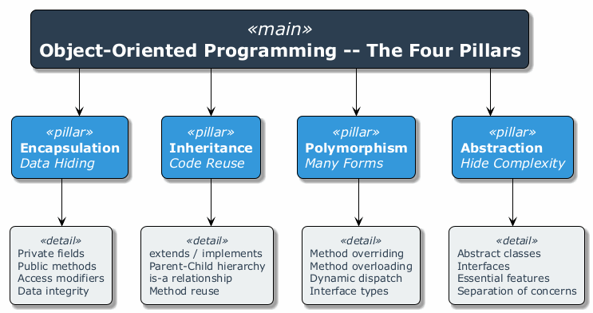
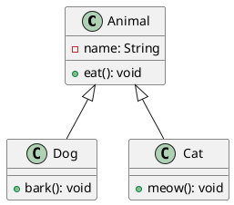
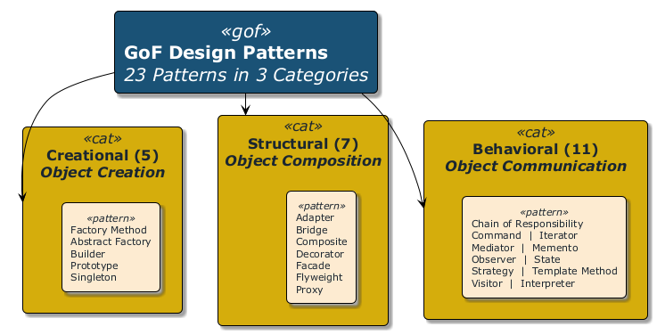
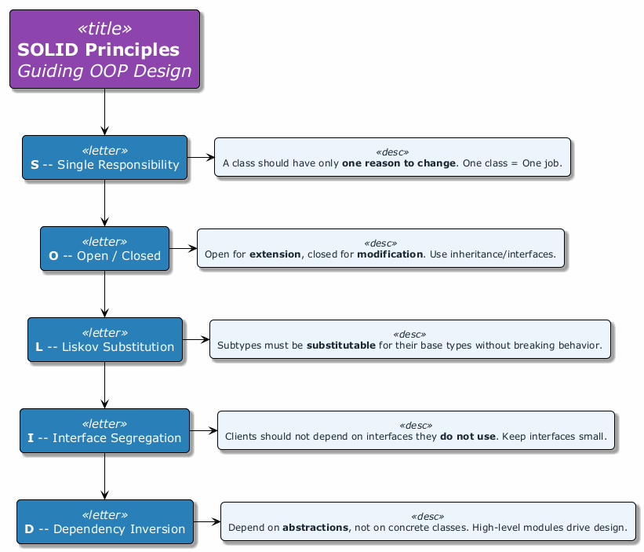
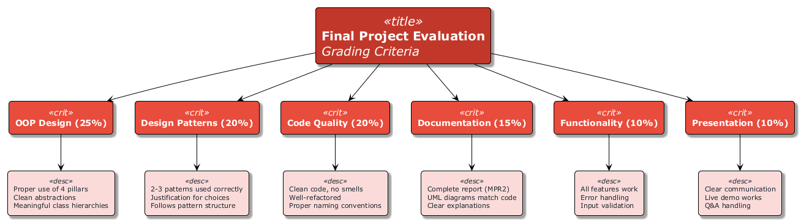
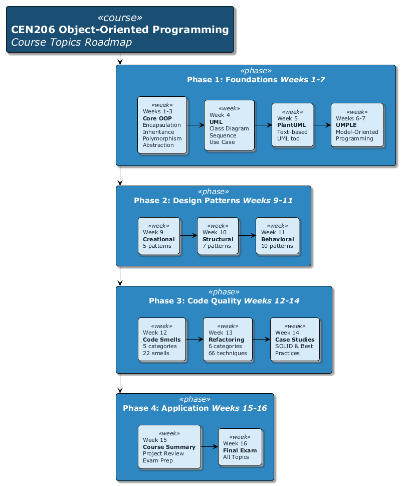

<!-- _backgroundColor: aqua -->

<!-- _color: orange -->

<!-- paginate: false -->

## CEN206 Object-Oriented Programming

## Week-15 (Final Project Progress Review & Course Summary)

#### Spring Semester, 2025-2026

Download [DOC-PDF](ce204-week-15.en.md_doc.pdf), [DOC-DOCX](ce204-week-15.en.md_word.docx), [SLIDE](ce204-week-15.en.md_slide.pdf)

<iframe width=700, height=500 frameBorder=0 src="../ce204-week-15.en.md_slide.html"></iframe>

---

<!-- paginate: true -->

## Week-15 Overview

### Final Project Progress Review & Course Summary

| Module | Topic |
|--------|-------|
| A | Course Review -- OOP Fundamentals (Weeks 1-7) |
| B | Course Review -- Design Patterns & Refactoring (Weeks 9-14) |
| C | Final Project Requirements & Evaluation |
| D | Project Demonstration Guidelines |
| E | Final Exam Preparation |

---

## Purpose of This Week

- Consolidate **all knowledge** gained throughout the semester
- Clarify **final project** expectations and evaluation criteria
- Provide **demonstration guidelines** for project presentations
- Prepare students for the **final exam**
- Answer remaining questions and address concerns

---

<!-- _backgroundColor: aqua -->

<!-- _color: orange -->

# Module A: Course Review -- OOP Fundamentals

## Weeks 1-7 Recap

---

## Module A Outline

### Course Review -- OOP Fundamentals (Weeks 1-7)

1. Weeks 1-3: Core OOP Concepts
2. Week 4: UML Diagrams
3. Week 5: PlantUML
4. Weeks 6-7: UMPLE
5. Key Takeaways from Each Topic

---

## Weeks 1-3: Core OOP Concepts

### The Four Pillars of Object-Oriented Programming

| Pillar | Description | Key Mechanism |
|--------|-------------|---------------|
| **Encapsulation** | Bundling data and methods together, hiding internal state | Access modifiers (`private`, `protected`, `public`) |
| **Inheritance** | Creating new classes from existing ones, reusing code | `extends` (Java), `:` (C++) |
| **Polymorphism** | Same interface, different implementations | Method overriding, method overloading |
| **Abstraction** | Exposing only essential features, hiding complexity | Abstract classes, interfaces |



---

<style scoped>section{ font-size: 25px; }</style>

## Weeks 1-3: Encapsulation Review

- **What:** Restricting direct access to an object's internal state and requiring interaction through well-defined methods.
- **Why:** Protects data integrity, reduces coupling, enables implementation changes without affecting clients.

```java
public class BankAccount {
    private double balance; // hidden internal state

    public double getBalance() {
        return balance;
    }

    public void deposit(double amount) {
        if (amount > 0) {
            balance += amount;
        }
    }

    public boolean withdraw(double amount) {
        if (amount > 0 && amount <= balance) {
            balance -= amount;
            return true;
        }
        return false;
    }
}
```

---

<style scoped>section{ font-size: 25px; }</style>

## Weeks 1-3: Inheritance Review

- **What:** A mechanism where a child class inherits fields and methods from a parent class.
- **Why:** Code reuse, establishing is-a relationships, building class hierarchies.

```java
public class Animal {
    protected String name;

    public void eat() {
        System.out.println(name + " is eating.");
    }
}

public class Dog extends Animal {
    public Dog(String name) {
        this.name = name;
    }

    public void bark() {
        System.out.println(name + " is barking.");
    }
}
```

---

<style scoped>section{ font-size: 25px; }</style>

## Weeks 1-3: Polymorphism Review

- **What:** The ability of objects of different classes to respond to the same method call in different ways.
- **Why:** Enables flexible, extensible code that works with abstractions rather than concrete types.

```java
public abstract class Shape {
    public abstract double area();
}

public class Circle extends Shape {
    private double radius;
    public Circle(double r) { this.radius = r; }
    public double area() { return Math.PI * radius * radius; }
}

public class Rectangle extends Shape {
    private double width, height;
    public Rectangle(double w, double h) { this.width = w; this.height = h; }
    public double area() { return width * height; }
}

// Polymorphic usage
Shape s = new Circle(5);
System.out.println(s.area()); // calls Circle's area()
```

---

<style scoped>section{ font-size: 25px; }</style>

## Weeks 1-3: Abstraction Review

- **What:** Defining essential characteristics of an object while hiding the implementation details.
- **Why:** Simplifies complex systems, focuses on what an object does rather than how it does it.

```java
public interface Sortable {
    void sort(int[] data);
}

public class QuickSort implements Sortable {
    public void sort(int[] data) {
        // Quick sort implementation hidden from clients
        quickSort(data, 0, data.length - 1);
    }
    private void quickSort(int[] arr, int low, int high) { /* ... */ }
}

public class MergeSort implements Sortable {
    public void sort(int[] data) {
        // Merge sort implementation hidden from clients
        mergeSort(data, 0, data.length - 1);
    }
    private void mergeSort(int[] arr, int low, int high) { /* ... */ }
}
```

---

## Week 4: UML Diagrams Review

### Unified Modeling Language

| Diagram Type | Category | Purpose |
|-------------|----------|---------|
| **Class Diagram** | Structural | Shows classes, attributes, methods, and relationships |
| **Object Diagram** | Structural | Shows instances at a specific point in time |
| **Sequence Diagram** | Behavioral | Shows object interactions over time |
| **Use Case Diagram** | Behavioral | Shows system functionality from user perspective |
| **Activity Diagram** | Behavioral | Shows workflow and business processes |
| **State Machine Diagram** | Behavioral | Shows object state transitions |
| **Component Diagram** | Structural | Shows system components and dependencies |

---

<style scoped>section{ font-size: 25px; }</style>

## Week 4: Class Diagram Relationships Review

| Relationship | Symbol | Meaning | Example |
|-------------|--------|---------|---------|
| **Association** | solid line | "uses" or "knows about" | Student -- Course |
| **Aggregation** | open diamond | "has-a" (weak ownership) | Department <>-- Professor |
| **Composition** | filled diamond | "owns" (strong ownership) | House <>-- Room |
| **Inheritance** | open triangle arrow | "is-a" | Dog --> Animal |
| **Realization** | dashed triangle arrow | "implements" | ArrayList ..> List |
| **Dependency** | dashed arrow | "depends on" | Client ..> Service |

---

## Week 5: PlantUML Review

### Key Features

- **Text-based** UML diagramming tool
- Converts plain text descriptions into UML diagrams
- Supports class diagrams, sequence diagrams, use case diagrams, and more
- Integrates with IDEs, CI/CD pipelines, and documentation tools



---

## Weeks 6-7: UMPLE Review

### Key Features

- **Model-Oriented Programming** language
- Adds modeling constructs directly into programming languages (Java, C++, PHP)
- Supports associations, state machines, and design patterns
- Generates executable code from models

```umple
class Student {
  name;
  Integer studentId;
  1 -- * Course;
}

class Course {
  title;
  Integer courseCode;
}
```

---

<style scoped>section{ font-size: 25px; }</style>

## Weeks 6-7: UMPLE Associations & State Machines

### Associations

| Multiplicity | Meaning | Example |
|-------------|---------|---------|
| `1 -- *` | One-to-many | One Student has many Courses |
| `* -- *` | Many-to-many | Students and Clubs |
| `0..1 -- *` | Optional one-to-many | Mentor and Students |

### State Machines

```umple
class TrafficLight {
  status {
    Red { timer -> Green; }
    Green { timer -> Yellow; }
    Yellow { timer -> Red; }
  }
}
```

---

## Module A -- Takeaway

### OOP Fundamentals: Key Points

| Week | Topic | Core Skill Gained |
|------|-------|------------------|
| 1-3 | OOP Concepts | Understanding encapsulation, inheritance, polymorphism, abstraction |
| 4 | UML Diagrams | Modeling software systems visually |
| 5 | PlantUML | Automating UML diagram generation from text |
| 6-7 | UMPLE | Model-oriented programming and code generation |

**Remember:** OOP is not just about syntax -- it is about **thinking in objects**, designing **clean abstractions**, and building **maintainable systems**.

---

<!-- _backgroundColor: aqua -->

<!-- _color: orange -->

# Module B: Course Review -- Design Patterns & Refactoring

## Weeks 9-14 Recap

---

## Module B Outline

### Design Patterns & Refactoring (Weeks 9-14)

1. Week 9: Creational Patterns (5 patterns)
2. Week 10: Structural Patterns (7 patterns)
3. Week 11: Behavioral Patterns (10 patterns)
4. Week 12: Code Smells (5 categories, 22 smells)
5. Week 13: Refactoring Techniques (6 categories, 66 techniques)
6. Week 14: Case Studies and Best Practices
7. Pattern Selection Decision Guide



---

<style scoped>section{ font-size: 22px; }</style>

## Week 9: Creational Design Patterns Summary

### 5 Patterns for Object Creation

| # | Pattern | Intent | When to Use |
|---|---------|--------|-------------|
| 1 | **Factory Method** | Define an interface for creating objects, letting subclasses decide the type | When a class cannot anticipate the type of objects it needs to create |
| 2 | **Abstract Factory** | Create families of related objects without specifying concrete classes | When the system must be independent of how its products are created |
| 3 | **Builder** | Separate the construction of a complex object from its representation | When creating objects with many optional parameters |
| 4 | **Prototype** | Create new objects by copying existing ones | When object creation is expensive and similar objects already exist |
| 5 | **Singleton** | Ensure a class has only one instance and provide global access | When exactly one instance is needed (e.g., configuration, logging) |

---

<style scoped>section{ font-size: 20px; }</style>

## Week 10: Structural Design Patterns Summary

### 7 Patterns for Class/Object Composition

| # | Pattern | Intent | When to Use |
|---|---------|--------|-------------|
| 1 | **Adapter** | Convert one interface to another that clients expect | When you need to use an existing class with an incompatible interface |
| 2 | **Bridge** | Separate abstraction from implementation | When both abstraction and implementation may vary independently |
| 3 | **Composite** | Compose objects into tree structures for part-whole hierarchies | When you need to treat individual objects and compositions uniformly |
| 4 | **Decorator** | Attach additional responsibilities dynamically | When you need to add behavior without subclassing |
| 5 | **Facade** | Provide a simplified interface to a complex subsystem | When you need a simple interface to a complex system |
| 6 | **Flyweight** | Share objects to support large numbers efficiently | When many similar objects consume excessive memory |
| 7 | **Proxy** | Provide a surrogate or placeholder for another object | When you need controlled access, lazy loading, or logging |

---

<style scoped>section{ font-size: 18px; }</style>

## Week 11: Behavioral Design Patterns Summary

### 10 Patterns for Object Communication

| # | Pattern | Intent | When to Use |
|---|---------|--------|-------------|
| 1 | **Chain of Responsibility** | Pass request along a chain of handlers | When multiple objects may handle a request |
| 2 | **Command** | Encapsulate a request as an object | When you need undo/redo, queuing, or logging of requests |
| 3 | **Iterator** | Access elements sequentially without exposing internals | When you need uniform traversal of collections |
| 4 | **Mediator** | Define centralized communication between objects | When many objects communicate in complex ways |
| 5 | **Memento** | Capture and restore object state | When you need undo/rollback functionality |
| 6 | **Observer** | Notify dependents automatically when state changes | When one object change should update many others |
| 7 | **State** | Alter behavior when internal state changes | When behavior depends on state and changes at runtime |
| 8 | **Strategy** | Define interchangeable algorithms | When you need to select an algorithm at runtime |
| 9 | **Template Method** | Define algorithm skeleton, letting subclasses fill in steps | When subclasses should customize parts of an algorithm |
| 10 | **Visitor** | Add operations to objects without modifying them | When you need to perform operations across a class hierarchy |

---

<style scoped>section{ font-size: 22px; }</style>

## Week 12: Code Smells Summary

### 5 Categories, 22 Smells

| Category | Smells | Key Indicator |
|----------|--------|---------------|
| **Bloaters** | Long Method, Large Class, Primitive Obsession, Long Parameter List, Data Clumps | Code that grows excessively large |
| **Object-Orientation Abusers** | Switch Statements, Temporary Field, Refused Bequest, Alternative Classes with Different Interfaces | Improper use of OOP principles |
| **Change Preventers** | Divergent Change, Shotgun Surgery, Parallel Inheritance Hierarchies | Changes require modifications in many places |
| **Dispensables** | Comments (excessive), Duplicate Code, Lazy Class, Data Class, Dead Code, Speculative Generality | Unnecessary code that adds complexity |
| **Couplers** | Feature Envy, Inappropriate Intimacy, Message Chains, Middle Man, Incomplete Library Class | Excessive coupling between classes |

---

<style scoped>section{ font-size: 22px; }</style>

## Week 13: Refactoring Techniques Summary

### 6 Categories, 66 Techniques

| Category | Count | Purpose | Key Techniques |
|----------|-------|---------|----------------|
| **Composing Methods** | 9 | Better method structure | Extract Method, Inline Method, Extract Variable |
| **Moving Features** | 8 | Proper feature placement | Move Method, Move Field, Extract Class |
| **Organizing Data** | 15 | Better data management | Encapsulate Field, Replace Magic Number, Replace Type Code |
| **Simplifying Conditionals** | 8 | Cleaner conditional logic | Decompose Conditional, Replace Conditional with Polymorphism |
| **Simplifying Method Calls** | 14 | Better method interfaces | Rename Method, Add/Remove Parameter, Parameterize Method |
| **Dealing with Generalization** | 12 | Better inheritance hierarchies | Pull Up Method, Push Down Method, Extract Interface |

---

## Week 14: Case Studies & Best Practices

### Key Lessons

- **Real-world applications** of design patterns in industry projects
- **Pattern combinations** -- how patterns work together in practice
- **Anti-patterns** -- common mistakes and how to avoid them
- **SOLID principles** applied alongside design patterns
  - **S** -- Single Responsibility Principle
  - **O** -- Open/Closed Principle
  - **L** -- Liskov Substitution Principle
  - **I** -- Interface Segregation Principle
  - **D** -- Dependency Inversion Principle



---

<style scoped>section{ font-size: 22px; }</style>

## Pattern Selection Decision Guide

### How to Choose the Right Pattern

```
Is your problem about...

CREATING objects?
  |-- Need one instance only?           --> Singleton
  |-- Need families of related objects? --> Abstract Factory
  |-- Need flexible object construction?--> Builder
  |-- Need to copy existing objects?    --> Prototype
  |-- Need subclass to decide type?     --> Factory Method

STRUCTURING classes?
  |-- Need to adapt an interface?       --> Adapter
  |-- Need to add behavior dynamically? --> Decorator
  |-- Need a simplified interface?      --> Facade
  |-- Need tree structures?             --> Composite
  |-- Need controlled access?           --> Proxy

MANAGING behavior?
  |-- Need to notify on state change?   --> Observer
  |-- Need interchangeable algorithms?  --> Strategy
  |-- Need to encapsulate requests?     --> Command
  |-- Need to traverse a collection?    --> Iterator
  |-- Need state-dependent behavior?    --> State
```

---

## Module B -- Takeaway

### Design Patterns & Refactoring: Key Points

| Week | Topic | Core Skill Gained |
|------|-------|------------------|
| 9 | Creational Patterns | Flexible and decoupled object creation |
| 10 | Structural Patterns | Composing classes and objects effectively |
| 11 | Behavioral Patterns | Managing complex object interactions |
| 12 | Code Smells | Identifying problematic code |
| 13 | Refactoring Techniques | Systematically improving code quality |
| 14 | Case Studies & Best Practices | Applying patterns in real-world scenarios |

**Remember:** Design patterns are **tools, not rules**. Use them when they solve a real problem, not to demonstrate knowledge.

---

<!-- _backgroundColor: aqua -->

<!-- _color: orange -->

# Module C: Final Project Requirements & Evaluation

## Project Report Structure, Deliverables & Grading

---

## Module C Outline

### Final Project Requirements & Evaluation

1. Project Report Structure (MPR2)
2. Expected Deliverables
3. Evaluation Criteria and Rubric
4. Presentation Guidelines
5. Code Quality Expectations
6. Documentation Requirements

---

## Project Report Structure (MPR2)

### Required Report Sections

| Section | Description |
|---------|-------------|
| **1. Title Page** | Project name, team members, date, course information |
| **2. Abstract** | Brief summary of the project (150-300 words) |
| **3. Introduction** | Problem statement, motivation, objectives |
| **4. Requirements Analysis** | Functional and non-functional requirements |
| **5. System Design** | Architecture, UML diagrams (class, sequence, use case) |
| **6. Implementation** | Key implementation details, design patterns used |
| **7. Testing** | Test strategy, test cases, results |
| **8. Conclusion** | Summary, challenges faced, lessons learned |
| **9. References** | All sources cited properly |
| **10. Appendices** | Additional diagrams, full code listings (if needed) |

---

<style scoped>section{ font-size: 25px; }</style>

## Expected Deliverables

### What You Must Submit

1. **Source Code**
   - Complete, compilable, and runnable project
   - Hosted on a version control system (e.g., GitHub)
   - Clean commit history showing team contributions

2. **Project Report (MPR2)**
   - Following the structure described above
   - Minimum 15 pages (excluding appendices)
   - PDF format

3. **UML Diagrams**
   - Class diagram (mandatory)
   - Sequence diagram for at least 2 key scenarios
   - Use case diagram

4. **Presentation Slides**
   - 10-15 slides covering key aspects
   - Demo screenshots or video

5. **Live Demonstration**
   - Working prototype shown during project presentation

---

<style scoped>section{ font-size: 20px; }</style>

## Evaluation Criteria and Rubric

### Grading Breakdown

| Criterion | Weight | Excellent (90-100) | Good (70-89) | Satisfactory (50-69) | Poor (0-49) |
|-----------|--------|--------------------|--------------|-----------------------|-------------|
| **OOP Design** | 25% | Proper use of all 4 pillars, clean abstractions | Good use of 3+ pillars, minor issues | Basic use of inheritance/encapsulation only | No clear OOP structure |
| **Design Patterns** | 20% | 3+ patterns used appropriately with justification | 2 patterns used correctly | 1 pattern attempted | No patterns used |
| **Code Quality** | 20% | Clean code, no smells, well-refactored | Mostly clean, minor smells | Some code smells present | Many code smells, poor structure |
| **Documentation** | 15% | Complete report, clear UML diagrams | Good report, minor diagram issues | Incomplete report or diagrams | Missing report or diagrams |
| **Functionality** | 10% | All features work as specified | Most features work | Core features work | Major features broken |
| **Presentation** | 10% | Clear, well-prepared, handles Q&A well | Good presentation, minor issues | Basic presentation | Unprepared, unclear |



---

<style scoped>section{ font-size: 25px; }</style>

## Presentation Guidelines

### How to Structure Your Presentation

| Time | Section | Content |
|------|---------|---------|
| 2 min | **Introduction** | Problem statement, motivation, team members |
| 3 min | **Design** | Architecture overview, key UML diagrams |
| 3 min | **Implementation** | Design patterns used, key technical decisions |
| 5 min | **Demo** | Live demonstration of working features |
| 2 min | **Conclusion** | Lessons learned, future work |
| 5 min | **Q&A** | Answer questions from instructor and peers |

**Total Time: ~20 minutes per team**

---

<style scoped>section{ font-size: 25px; }</style>

## Code Quality Expectations

### What We Look For

1. **Clean Code Principles**
   - Meaningful variable and method names
   - Short, focused methods (no Long Methods)
   - Proper code organization and package structure

2. **Design Patterns Usage**
   - At least 2-3 design patterns applied appropriately
   - Justification for why each pattern was chosen
   - Correct implementation following pattern structure

3. **Proper OOP**
   - Encapsulation: private fields with getters/setters where needed
   - Inheritance: meaningful class hierarchies (not forced)
   - Polymorphism: interfaces and abstract classes used effectively
   - Abstraction: clean separation of concerns

4. **No Code Smells**
   - No duplicate code
   - No long parameter lists
   - No feature envy or inappropriate intimacy

---

<style scoped>section{ font-size: 25px; }</style>

## Documentation Requirements

### UML Diagrams Required

| Diagram | Purpose | Minimum Content |
|---------|---------|-----------------|
| **Class Diagram** | Show system structure | All major classes, attributes, methods, relationships |
| **Sequence Diagram** | Show key interactions | At least 2 important use case flows |
| **Use Case Diagram** | Show system functionality | All primary actors and use cases |

### Report Requirements

- **PlantUML or UMPLE** preferred for diagram generation (not hand-drawn)
- Diagrams must be **consistent** with actual code
- All external libraries and frameworks must be **documented**
- Code snippets in the report should be **formatted** and **explained**

---

## Module C -- Takeaway

### Final Project Requirements: Key Points

- Your project is evaluated on **design quality**, not just functionality
- Use at least **2-3 design patterns** with proper justification
- Submit **clean, well-documented code** with proper OOP structure
- UML diagrams must **match your actual implementation**
- The report should tell the **story** of your project: problem, design, implementation, testing

---

<!-- _backgroundColor: aqua -->

<!-- _color: orange -->

# Module D: Project Demonstration Guidelines

## How to Present Your Project Effectively

---

## Module D Outline

### Project Demonstration Guidelines

1. How to Present Your Project
2. Demo Flow Recommendations
3. Q&A Preparation Tips
4. Common Pitfalls to Avoid
5. Grading Rubric for Demonstrations

---

<style scoped>section{ font-size: 25px; }</style>

## How to Present Your Project

### Preparation Checklist

- [ ] **Test everything** on the presentation machine beforehand
- [ ] **Prepare a backup plan** (screenshots, video recording) in case of technical issues
- [ ] **Know your code** -- every team member should understand all parts
- [ ] **Prepare talking points** -- do not read from slides
- [ ] **Practice the demo** at least 2-3 times
- [ ] **Time your presentation** to stay within limits
- [ ] **Assign roles** -- who presents which section

### Presentation Tips

- Start with the **big picture** before diving into details
- Show the **architecture** before showing code
- Use **diagrams** to explain complex interactions
- Keep slides **simple** -- use them as visual aids, not scripts

---

## Demo Flow Recommendations

### Recommended Demo Structure

```
1. SETUP (1 minute)
   - Show project structure briefly
   - Mention technologies and tools used

2. CORE FEATURES (3-4 minutes)
   - Demonstrate primary functionality
   - Show the most impressive features first
   - Follow a logical user workflow

3. DESIGN HIGHLIGHTS (1-2 minutes)
   - Show a specific design pattern in action
   - Explain WHY you chose that pattern
   - Show the corresponding UML diagram

4. CODE WALKTHROUGH (1-2 minutes)
   - Show one well-written class
   - Highlight clean code practices
   - Show how patterns are implemented

5. EDGE CASES (1 minute)
   - Show error handling
   - Demonstrate input validation
```

---

<style scoped>section{ font-size: 25px; }</style>

## Q&A Preparation Tips

### Common Questions to Expect

| Category | Example Questions |
|----------|-----------------|
| **Design Decisions** | "Why did you choose the Observer pattern here instead of Mediator?" |
| **Alternatives** | "What other patterns did you consider and why did you reject them?" |
| **Challenges** | "What was the biggest technical challenge and how did you solve it?" |
| **OOP Principles** | "How does your design demonstrate the Open/Closed Principle?" |
| **Testing** | "How did you test this feature? What edge cases did you consider?" |
| **Scalability** | "How would your design handle 10x more users/data?" |

### Tips for Answering

- **Be honest** -- if you do not know, say so and explain how you would find out
- **Be specific** -- reference actual classes, methods, and patterns by name
- **Be concise** -- answer the question directly, then elaborate if asked

---

<style scoped>section{ font-size: 25px; }</style>

## Common Pitfalls to Avoid

### What NOT to Do

| Pitfall | Why It Is a Problem | How to Avoid |
|---------|---------------------|--------------|
| **No backup plan** | Technical failures happen | Record a demo video beforehand |
| **Reading from slides** | Shows lack of preparation | Use slides as visual aids only |
| **Showing too much code** | Overwhelms the audience | Show only key snippets |
| **Skipping the design** | Misses the main evaluation point | Spend at least 30% on design |
| **Unequal participation** | Shows poor teamwork | Ensure every member presents |
| **Ignoring time limits** | Disrespectful, loses points | Practice with a timer |
| **Using patterns incorrectly** | Worse than not using them | Understand each pattern fully |
| **No error handling in demo** | Crashes look unprofessional | Test all demo paths beforehand |

---

<style scoped>section{ font-size: 22px; }</style>

## Grading Rubric for Demonstrations

### How Demos Are Evaluated

| Criterion | Weight | Description |
|-----------|--------|-------------|
| **Technical Depth** | 30% | Demonstrates understanding of OOP concepts, design patterns, and code quality |
| **Functionality** | 25% | Features work correctly and as described in the report |
| **Presentation Quality** | 20% | Clear communication, good structure, professional delivery |
| **Design Justification** | 15% | Can explain WHY design decisions were made, not just WHAT was done |
| **Q&A Response** | 10% | Handles questions competently and honestly |

### Grade Descriptors

| Grade | Description |
|-------|-------------|
| **A (90-100)** | Exceptional design, flawless demo, deep understanding shown in Q&A |
| **B (80-89)** | Good design, working demo with minor issues, solid Q&A |
| **C (70-79)** | Adequate design, demo works for core features, basic Q&A |
| **D (60-69)** | Minimal design effort, demo has significant issues, weak Q&A |
| **F (<60)** | Poor or missing design, demo fails, unable to answer questions |

---

## Module D -- Takeaway

### Project Demonstration: Key Points

- **Prepare thoroughly** -- practice the demo multiple times
- **Always have a backup** -- record a video of your demo
- **Focus on design** -- the demo should showcase your OOP and pattern usage, not just features
- **Every team member** must be able to explain every part of the project
- **Anticipate questions** -- prepare answers for common Q&A topics

---

<!-- _backgroundColor: aqua -->

<!-- _color: orange -->

# Module E: Final Exam Preparation

## Exam Format, Key Topics & Study Guide

---

## Module E Outline

### Final Exam Preparation

1. Exam Format and Scope
2. Key Topics to Review
3. Sample Question Types
4. Study Resources and Recommendations

---

## Exam Format and Scope

### Final Exam Details

| Aspect | Details |
|--------|---------|
| **Duration** | 90 minutes |
| **Format** | Written exam (closed book) |
| **Question Types** | Multiple choice, code analysis, short answer, design problems |
| **Scope** | All topics from Weeks 1-14 |
| **Weight** | As specified in the course syllabus |

### What to Bring

- Student ID
- Pen/pencil
- No electronic devices allowed

---

<style scoped>section{ font-size: 22px; }</style>

## Key Topics to Review

### High-Priority Topics

| Priority | Topic | What to Know |
|----------|-------|-------------|
| **High** | 4 Pillars of OOP | Definitions, examples, when to use each |
| **High** | Design Patterns (all 22) | Intent, structure, when to use, code examples |
| **High** | UML Class Diagrams | Read and create class diagrams, understand relationships |
| **High** | Code Smells | Identify smells, know which refactoring to apply |
| **Medium** | Refactoring Techniques | Know the major techniques and their purposes |
| **Medium** | PlantUML | Read PlantUML syntax, understand generated diagrams |
| **Medium** | UMPLE | Understand associations, state machines, code generation |
| **Medium** | SOLID Principles | Definitions, examples, how they relate to patterns |
| **Low** | Specific pattern implementations | Detailed code for all 22 patterns |
| **Low** | All 66 refactoring techniques | Detailed steps for every technique |

---

<style scoped>section{ font-size: 22px; }</style>

## Sample Question Types

### Type 1: Multiple Choice

**Example:** Which design pattern ensures a class has only one instance?

a) Factory Method
b) Singleton
c) Prototype
d) Builder

**Answer:** b) Singleton

---

<style scoped>section{ font-size: 22px; }</style>

## Sample Question Types (continued)

### Type 2: Code Analysis

**Example:** Identify the design pattern used in the following code:

```java
public interface Logger {
    void log(String message);
}

public class FileLogger implements Logger {
    public void log(String message) { /* write to file */ }
}

public class ConsoleLogger implements Logger {
    public void log(String message) { /* print to console */ }
}

public class LoggerFactory {
    public static Logger getLogger(String type) {
        if (type.equals("file")) return new FileLogger();
        if (type.equals("console")) return new ConsoleLogger();
        throw new IllegalArgumentException("Unknown type: " + type);
    }
}
```

**Answer:** Factory Method (Simple Factory variant) -- creates objects without exposing creation logic to the client.

---

<style scoped>section{ font-size: 22px; }</style>

## Sample Question Types (continued)

### Type 3: Code Smell Identification

**Example:** Identify the code smell(s) in the following code and suggest a refactoring:

```java
public double calculatePrice(String type, int quantity, double unitPrice,
                              double discount, boolean isMember,
                              String couponCode, double taxRate) {
    // ... complex calculation
}
```

**Answer:**
- **Code Smell:** Long Parameter List
- **Refactoring:** Introduce Parameter Object -- create a `PriceRequest` class to group related parameters.

---

<style scoped>section{ font-size: 22px; }</style>

## Sample Question Types (continued)

### Type 4: Design Problem

**Example:** You are designing a notification system that needs to:
- Support multiple notification channels (email, SMS, push notification)
- Allow adding new channels without modifying existing code
- Let users subscribe/unsubscribe from notifications

**Question:** Which design pattern(s) would you use? Draw a UML class diagram and explain your choice.

**Expected Answer:**
- **Observer Pattern** for subscribe/unsubscribe mechanism
- **Strategy Pattern** for interchangeable notification channels
- Should include a class diagram showing `NotificationService`, `Observer` interface, `NotificationChannel` strategy interface, and concrete implementations

---

<style scoped>section{ font-size: 25px; }</style>

## Study Resources and Recommendations

### Recommended Study Plan

| Day | Activity | Focus |
|-----|----------|-------|
| Day 1 | Review OOP fundamentals | 4 pillars, SOLID principles |
| Day 2 | Review Creational & Structural patterns | 12 patterns: intent, when to use |
| Day 3 | Review Behavioral patterns | 10 patterns: intent, when to use |
| Day 4 | Review Code Smells & Refactoring | 22 smells, major refactoring techniques |
| Day 5 | Practice problems | Sample questions, code analysis |
| Day 6 | UML diagrams & PlantUML | Draw class diagrams, read PlantUML |
| Day 7 | Full review | Go through all week summaries |

### Key Resources

- **Course slides** (Weeks 1-14)
- **RefactoringGuru**: [https://refactoring.guru](https://refactoring.guru)
- **Design Patterns (GoF Book)**: Gamma, Helm, Johnson, Vlissides
- **Clean Code**: Robert C. Martin

---

## Module E -- Takeaway

### Final Exam Preparation: Key Points

- The exam covers **all topics from Weeks 1-15**
- Focus on **understanding concepts**, not memorizing code
- Practice **identifying patterns** in code snippets
- Practice **identifying code smells** and suggesting refactorings
- Be able to **draw UML class diagrams** for given scenarios
- Know **when to use** each pattern, not just what it is

---

## Course Summary

### What You Have Learned

```
CEN206 Object-Oriented Programming
|
|-- FOUNDATIONS (Weeks 1-7)
|   |-- OOP Concepts: Encapsulation, Inheritance,
|   |   Polymorphism, Abstraction
|   |-- UML Diagrams: Visual modeling of software systems
|   |-- PlantUML: Text-based diagram generation
|   |-- UMPLE: Model-oriented programming
|
|-- DESIGN PATTERNS (Weeks 9-11)
|   |-- Creational: 5 patterns for object creation
|   |-- Structural: 7 patterns for composition
|   |-- Behavioral: 10 patterns for communication
|
|-- CODE QUALITY (Weeks 12-14)
|   |-- Code Smells: 22 smells across 5 categories
|   |-- Refactoring: 66 techniques across 6 categories
|   |-- Best Practices: SOLID, Clean Code, Case Studies
|
|-- APPLICATION (Week 15)
    |-- Final Project: Applying all concepts together
    |-- Course Summary: Consolidating knowledge
```



---

## Final Words

### Key Principles to Carry Forward

1. **Think in objects** -- model real-world entities with classes and relationships
2. **Design before coding** -- UML diagrams save debugging time
3. **Use patterns wisely** -- they are solutions to recurring problems, not goals themselves
4. **Keep code clean** -- refactor continuously, eliminate smells early
5. **Follow SOLID** -- these principles guide good OOP design
6. **Test your code** -- untested code is unreliable code
7. **Document your design** -- future you (and your team) will thank you

**Good luck with your final projects and exams!**

---

## References

- Gamma, E., Helm, R., Johnson, R., & Vlissides, J. (1994). *Design Patterns: Elements of Reusable Object-Oriented Software*. Addison-Wesley.
- Fowler, M. (2018). *Refactoring: Improving the Design of Existing Code* (2nd Edition). Addison-Wesley Professional.
- Martin, R. C. (2008). *Clean Code: A Handbook of Agile Software Craftsmanship*. Prentice Hall.
- RefactoringGuru. *Design Patterns*. [https://refactoring.guru/design-patterns](https://refactoring.guru/design-patterns)
- RefactoringGuru. *Refactoring Techniques*. [https://refactoring.guru/refactoring/techniques](https://refactoring.guru/refactoring/techniques)
- RefactoringGuru. *Code Smells*. [https://refactoring.guru/refactoring/smells](https://refactoring.guru/refactoring/smells)

---

## References (continued)

- Lethbridge, T. C., & Laganiere, R. (2004). *Object-Oriented Software Engineering: Practical Software Development using UML and Java*. McGraw-Hill.
- Booch, G., Rumbaugh, J., & Jacobson, I. (2005). *The Unified Modeling Language User Guide* (2nd Edition). Addison-Wesley.
- PlantUML. *PlantUML Documentation*. [https://plantuml.com](https://plantuml.com)
- UMPLE. *UMPLE Online*. [https://cruise.umple.org/umpleonline](https://cruise.umple.org/umpleonline)
- Freeman, E., Robson, E., Sierra, K., & Bates, B. (2004). *Head First Design Patterns*. O'Reilly Media.

---

$End-Of-Week-15-Module$
