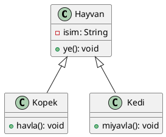

<!-- _backgroundColor: aqua -->

<!-- _color: orange -->

<!-- paginate: false -->

## CEN206 Nesne Yönelimli Programlama

## Hafta-15 (Final Proje İlerleme Değerlendirmesi ve Ders Özeti)

#### Bahar Dönemi, 2025-2026

İndir [BELGE-PDF](ce204-week-15.tr.md_doc.pdf), [BELGE-DOCX](ce204-week-15.tr.md_word.docx), [SLAYT](ce204-week-15.tr.md_slide.pdf)

<iframe width=700, height=500 frameBorder=0 src="../ce204-week-15.tr.md_slide.html"></iframe>

---

<!-- paginate: true -->

## Hafta-15 Genel Bakış

### Final Proje İlerleme Değerlendirmesi ve Ders Özeti

| Modül | Konu |
|-------|------|
| A | Ders Tekrarı -- NYP Temelleri (Hafta 1-7) |
| B | Ders Tekrarı -- Tasarım Kalıpları ve Yeniden Düzenleme (Hafta 9-14) |
| C | Final Proje Gereksinimleri ve Değerlendirme |
| D | Proje Sunum Kılavuzu |
| E | Final Sınavına Hazırlık |

---

## Bu Haftanın Amacı

- Dönem boyunca kazanılan **tüm bilgileri** pekiştirmek
- **Final projesi** beklentilerini ve değerlendirme kriterlerini netleştirmek
- Proje sunumları için **sunum kılavuzu** sağlamak
- Öğrencileri **final sınavına** hazırlamak
- Kalan soruları yanıtlamak ve endişeleri gidermek

---

<!-- _backgroundColor: aqua -->

<!-- _color: orange -->

# Modül A: Ders Tekrarı -- NYP Temelleri

## Hafta 1-7 Özeti

---

## Modül A Taslağı

### Ders Tekrarı -- NYP (OOP) Temelleri (Hafta 1-7)

1. Hafta 1-3: Temel NYP (OOP) Kavramları
2. Hafta 4: UML Diyagramları
3. Hafta 5: PlantUML
4. Hafta 6-7: UMPLE
5. Her Konudan Temel Çıkarımlar

---

## Hafta 1-3: Temel NYP (OOP) Kavramları

### Nesne Yönelimli Programlamanın Dört Temel İlkesi

| İlke | Açıklama | Temel Mekanizma |
|------|----------|-----------------|
| **Kapsülleme (Encapsulation)** | Veri ve metodları bir arada paketleme, iç durumu gizleme | Erişim belirleyicileri (`private`, `protected`, `public`) |
| **Kalıtım (Inheritance)** | Mevcut sınıflardan yeni sınıflar oluşturma, kodu yeniden kullanma | `extends` (Java), `:` (C++) |
| **Çok Biçimlilik (Polymorphism)** | Aynı arayüz, farklı uygulamalar | Metod geçersiz kılma (overriding), metod aşırı yükleme (overloading) |
| **Soyutlama (Abstraction)** | Yalnızca temel özellikleri gösterme, karmaşıklığı gizleme | Soyut sınıflar (abstract classes), arayüzler (interfaces) |

---

<style scoped>section{ font-size: 25px; }</style>

## Hafta 1-3: Kapsülleme (Encapsulation) Tekrarı

- **Ne:** Bir nesnenin iç durumuna doğrudan erişimi kısıtlama ve iyi tanımlanmış metodlar aracılığıyla etkileşim gerektirme.
- **Neden:** Veri bütünlüğünü korur, bağımlılığı (coupling) azaltır, istemcileri etkilemeden uygulama değişikliklerini mümkün kılar.

```java
public class BankaHesabi {
    private double bakiye; // gizli iç durum

    public double getBakiye() {
        return bakiye;
    }

    public void paraYatir(double miktar) {
        if (miktar > 0) {
            bakiye += miktar;
        }
    }

    public boolean paraCek(double miktar) {
        if (miktar > 0 && miktar <= bakiye) {
            bakiye -= miktar;
            return true;
        }
        return false;
    }
}
```

---

<style scoped>section{ font-size: 25px; }</style>

## Hafta 1-3: Kalıtım (Inheritance) Tekrarı

- **Ne:** Bir alt sınıfın (child class) üst sınıftan (parent class) alan ve metodları miras aldığı bir mekanizma.
- **Neden:** Kod tekrar kullanımı, "bir tür" (is-a) ilişkilerini kurma, sınıf hiyerarşileri oluşturma.

```java
public class Hayvan {
    protected String isim;

    public void ye() {
        System.out.println(isim + " yemek yiyor.");
    }
}

public class Kopek extends Hayvan {
    public Kopek(String isim) {
        this.isim = isim;
    }

    public void havla() {
        System.out.println(isim + " havlıyor.");
    }
}
```

---

<style scoped>section{ font-size: 25px; }</style>

## Hafta 1-3: Çok Biçimlilik (Polymorphism) Tekrarı

- **Ne:** Farklı sınıfların nesnelerinin aynı metod çağrısına farklı şekillerde yanıt verme yeteneği.
- **Neden:** Somut türler yerine soyutlamalarla çalışan esnek, genişletilebilir kod sağlar.

```java
public abstract class Sekil {
    public abstract double alan();
}

public class Daire extends Sekil {
    private double yaricap;
    public Daire(double r) { this.yaricap = r; }
    public double alan() { return Math.PI * yaricap * yaricap; }
}

public class Dikdortgen extends Sekil {
    private double genislik, yukseklik;
    public Dikdortgen(double g, double y) { this.genislik = g; this.yukseklik = y; }
    public double alan() { return genislik * yukseklik; }
}

// Çok biçimli kullanım (Polymorphic usage)
Sekil s = new Daire(5);
System.out.println(s.alan()); // Daire'nin alan() metodunu çağırır
```

---

<style scoped>section{ font-size: 25px; }</style>

## Hafta 1-3: Soyutlama (Abstraction) Tekrarı

- **Ne:** Uygulama ayrıntılarını gizlerken bir nesnenin temel özelliklerini tanımlama.
- **Neden:** Karmaşık sistemleri basitleştirir, bir nesnenin nasıl yaptığından çok ne yaptığına odaklanır.

```java
public interface Siralanabilir {
    void sirala(int[] veri);
}

public class HizliSiralama implements Siralanabilir {
    public void sirala(int[] veri) {
        // Hızlı sıralama (Quick sort) uygulaması istemcilerden gizli
        hizliSirala(veri, 0, veri.length - 1);
    }
    private void hizliSirala(int[] dizi, int bas, int son) { /* ... */ }
}

public class BirlestirmeSiralama implements Siralanabilir {
    public void sirala(int[] veri) {
        // Birleştirme sıralaması (Merge sort) uygulaması istemcilerden gizli
        birlestirmeSirala(veri, 0, veri.length - 1);
    }
    private void birlestirmeSirala(int[] dizi, int bas, int son) { /* ... */ }
}
```

---

## Hafta 4: UML Diyagramları Tekrarı

### Birleşik Modelleme Dili (Unified Modeling Language)

| Diyagram Türü | Kategori | Amaç |
|--------------|----------|------|
| **Sınıf Diyagramı (Class Diagram)** | Yapısal | Sınıfları, nitelikleri, metodları ve ilişkileri gösterir |
| **Nesne Diyagramı (Object Diagram)** | Yapısal | Belirli bir zaman noktasındaki örnekleri gösterir |
| **Sıra Diyagramı (Sequence Diagram)** | Davranışsal | Nesneler arası etkileşimleri zaman içinde gösterir |
| **Kullanım Senaryosu Diyagramı (Use Case)** | Davranışsal | Sistem işlevselliğini kullanıcı perspektifinden gösterir |
| **Etkinlik Diyagramı (Activity Diagram)** | Davranışsal | İş akışını ve süreçleri gösterir |
| **Durum Makinesi Diyagramı (State Machine)** | Davranışsal | Nesne durum geçişlerini gösterir |
| **Bileşen Diyagramı (Component Diagram)** | Yapısal | Sistem bileşenlerini ve bağımlılıkları gösterir |

---

<style scoped>section{ font-size: 25px; }</style>

## Hafta 4: Sınıf Diyagramı İlişkileri Tekrarı

| İlişki | Sembol | Anlam | Örnek |
|--------|--------|-------|-------|
| **İlişkilendirme (Association)** | düz çizgi | "kullanır" veya "bilir" | Öğrenci -- Ders |
| **Toplama (Aggregation)** | açık elmas | "sahip" (zayıf sahiplik) | Bölüm <>-- Profesör |
| **Bileşim (Composition)** | dolu elmas | "sahip" (güçlü sahiplik) | Ev <>-- Oda |
| **Kalıtım (Inheritance)** | açık üçgen ok | "bir tür" (is-a) | Köpek --> Hayvan |
| **Gerçekleştirme (Realization)** | kesikli üçgen ok | "uygular" (implements) | ArrayList ..> List |
| **Bağımlılık (Dependency)** | kesikli ok | "bağlıdır" | İstemci ..> Servis |

---

## Hafta 5: PlantUML Tekrarı

### Temel Özellikler

- **Metin tabanlı** UML diyagram oluşturma aracı
- Düz metin açıklamalarını UML diyagramlarına dönüştürür
- Sınıf diyagramları, sıra diyagramları, kullanım senaryosu diyagramları ve daha fazlasını destekler
- IDE'ler, CI/CD hatları ve dokümantasyon araçlarıyla entegre olur



---

## Hafta 6-7: UMPLE Tekrarı

### Temel Özellikler

- **Model Yönelimli Programlama (Model-Oriented Programming)** dili
- Modelleme yapılarını doğrudan programlama dillerine ekler (Java, C++, PHP)
- İlişkilendirmeleri (associations), durum makinelerini (state machines) ve tasarım kalıplarını (design patterns) destekler
- Modellerden çalıştırılabilir kod üretir

```umple
class Ogrenci {
  isim;
  Integer ogrenciNo;
  1 -- * Ders;
}

class Ders {
  baslik;
  Integer dersKodu;
}
```

---

<style scoped>section{ font-size: 25px; }</style>

## Hafta 6-7: UMPLE İlişkilendirmeler ve Durum Makineleri

### İlişkilendirmeler (Associations)

| Çokluk (Multiplicity) | Anlam | Örnek |
|------------------------|-------|-------|
| `1 -- *` | Birden çoğa (One-to-many) | Bir Öğrencinin birçok Dersi vardır |
| `* -- *` | Çoktan çoğa (Many-to-many) | Öğrenciler ve Kulüpler |
| `0..1 -- *` | İsteğe bağlı birden çoğa | Danışman ve Öğrenciler |

### Durum Makineleri (State Machines)

```umple
class TrafikIsigi {
  durum {
    Kirmizi { zamanlayici -> Yesil; }
    Yesil { zamanlayici -> Sari; }
    Sari { zamanlayici -> Kirmizi; }
  }
}
```

---

## Modül A -- Özet

### NYP (OOP) Temelleri: Temel Noktalar

| Hafta | Konu | Kazanılan Temel Beceri |
|-------|------|------------------------|
| 1-3 | NYP (OOP) Kavramları | Kapsülleme, kalıtım, çok biçimlilik, soyutlamayı anlama |
| 4 | UML Diyagramları | Yazılım sistemlerini görsel olarak modelleme |
| 5 | PlantUML | Metinden UML diyagramı oluşturmayı otomatikleştirme |
| 6-7 | UMPLE | Model yönelimli programlama ve kod üretimi |

**Unutmayın:** NYP (OOP) sadece sözdizimi (syntax) ile ilgili değildir -- **nesnelerle düşünme**, **temiz soyutlamalar** tasarlama ve **sürdürülebilir sistemler** oluşturma ile ilgilidir.

---

<!-- _backgroundColor: aqua -->

<!-- _color: orange -->

# Modül B: Ders Tekrarı -- Tasarım Kalıpları ve Yeniden Düzenleme

## Hafta 9-14 Özeti

---

## Modül B Taslağı

### Tasarım Kalıpları (Design Patterns) ve Yeniden Düzenleme (Refactoring) (Hafta 9-14)

1. Hafta 9: Oluşturucu Kalıplar (Creational Patterns) (5 kalıp)
2. Hafta 10: Yapısal Kalıplar (Structural Patterns) (7 kalıp)
3. Hafta 11: Davranışsal Kalıplar (Behavioral Patterns) (10 kalıp)
4. Hafta 12: Kod Kokuları (Code Smells) (5 kategori, 22 koku)
5. Hafta 13: Yeniden Düzenleme Teknikleri (Refactoring Techniques) (6 kategori, 66 teknik)
6. Hafta 14: Vaka Çalışmaları (Case Studies) ve En İyi Uygulamalar (Best Practices)
7. Kalıp Seçim Karar Rehberi

---

<style scoped>section{ font-size: 22px; }</style>

## Hafta 9: Oluşturucu Tasarım Kalıpları (Creational Patterns) Özeti

### Nesne Oluşturma için 5 Kalıp

| # | Kalıp | Amaç | Ne Zaman Kullanılır |
|---|-------|------|---------------------|
| 1 | **Factory Method** | Nesneleri oluşturmak için bir arayüz tanımlar, alt sınıfların türe karar vermesini sağlar | Bir sınıf oluşturması gereken nesne türünü önceden tahmin edemediğinde |
| 2 | **Abstract Factory** | Somut sınıfları belirtmeden ilişkili nesne aileleri oluşturur | Sistem, ürünlerinin nasıl oluşturulduğundan bağımsız olmalıysa |
| 3 | **Builder** | Karmaşık bir nesnenin yapısını temsilinden ayırır | Birçok isteğe bağlı parametresi olan nesneler oluştururken |
| 4 | **Prototype** | Mevcut nesneleri kopyalayarak yeni nesneler oluşturur | Nesne oluşturma maliyetli ve benzer nesneler zaten mevcutsa |
| 5 | **Singleton** | Bir sınıfın yalnızca bir örneğe sahip olmasını sağlar ve küresel erişim sunar | Tam olarak bir örnek gerektiğinde (ör. yapılandırma, günlük kaydı) |

---

<style scoped>section{ font-size: 20px; }</style>

## Hafta 10: Yapısal Tasarım Kalıpları (Structural Patterns) Özeti

### Sınıf/Nesne Bileşimi için 7 Kalıp

| # | Kalıp | Amaç | Ne Zaman Kullanılır |
|---|-------|------|---------------------|
| 1 | **Adapter** | Bir arayüzü istemcilerin beklediği başka bir arayüze dönüştürür | Uyumsuz arayüze sahip mevcut bir sınıfı kullanmanız gerektiğinde |
| 2 | **Bridge** | Soyutlamayı uygulamadan ayırır | Hem soyutlama hem de uygulama bağımsız olarak değişebiliyorsa |
| 3 | **Composite** | Nesneleri parça-bütün hiyerarşileri için ağaç yapılarına dönüştürür | Tekil nesneleri ve bileşimleri aynı şekilde ele almanız gerektiğinde |
| 4 | **Decorator** | Dinamik olarak ek sorumluluklar ekler | Alt sınıflama yapmadan davranış eklemeniz gerektiğinde |
| 5 | **Facade** | Karmaşık bir alt sisteme basitleştirilmiş bir arayüz sağlar | Karmaşık bir sisteme basit bir arayüz gerektiğinde |
| 6 | **Flyweight** | Büyük sayıları verimli şekilde desteklemek için nesneleri paylaşır | Birçok benzer nesne aşırı bellek tükettiğinde |
| 7 | **Proxy** | Başka bir nesne için vekil veya yer tutucu sağlar | Kontrollü erişim, tembel yükleme (lazy loading) veya günlük kaydı gerektiğinde |

---

<style scoped>section{ font-size: 18px; }</style>

## Hafta 11: Davranışsal Tasarım Kalıpları (Behavioral Patterns) Özeti

### Nesne İletişimi için 10 Kalıp

| # | Kalıp | Amaç | Ne Zaman Kullanılır |
|---|-------|------|---------------------|
| 1 | **Chain of Responsibility** | İsteği bir işleyici zinciri boyunca iletir | Birden fazla nesne bir isteği işleyebiliyorsa |
| 2 | **Command** | Bir isteği nesne olarak kapsüller | Geri alma/yineleme (undo/redo), kuyruklama veya günlük kaydı gerektiğinde |
| 3 | **Iterator** | İç yapıyı açığa çıkarmadan elemanlara sıralı erişim sağlar | Koleksiyonların tekdüze dolaşılması gerektiğinde |
| 4 | **Mediator** | Nesneler arasında merkezi iletişim tanımlar | Birçok nesne karmaşık şekillerde iletişim kurduğunda |
| 5 | **Memento** | Nesne durumunu yakalar ve geri yükler | Geri alma/geri dönüş (undo/rollback) işlevi gerektiğinde |
| 6 | **Observer** | Durum değiştiğinde bağımlıları otomatik bilgilendirir | Bir nesne değişikliği birçok diğerini güncellemelidir |
| 7 | **State** | İç durum değiştiğinde davranışı değiştirir | Davranış duruma bağlıysa ve çalışma zamanında değişiyorsa |
| 8 | **Strategy** | Değiştirilebilir algoritmalar tanımlar | Çalışma zamanında bir algoritma seçmeniz gerektiğinde |
| 9 | **Template Method** | Algoritma iskeletini tanımlar, alt sınıfların adımları doldurmasını sağlar | Alt sınıflar bir algoritmanın parçalarını özelleştirmelidir |
| 10 | **Visitor** | Nesneleri değiştirmeden işlemler ekler | Bir sınıf hiyerarşisinde işlemler gerçekleştirmeniz gerektiğinde |

---

<style scoped>section{ font-size: 22px; }</style>

## Hafta 12: Kod Kokuları (Code Smells) Özeti

### 5 Kategori, 22 Koku

| Kategori | Kokular | Temel Gösterge |
|----------|---------|----------------|
| **Şişkinler (Bloaters)** | Uzun Metod (Long Method), Büyük Sınıf (Large Class), İlkel Takıntı (Primitive Obsession), Uzun Parametre Listesi (Long Parameter List), Veri Kümeleri (Data Clumps) | Aşırı büyüyen kod |
| **NYP Kötüye Kullananlar (OO Abusers)** | Switch İfadeleri, Geçici Alan (Temporary Field), Reddedilen Miras (Refused Bequest), Farklı Arayüzlü Alternatif Sınıflar | NYP ilkelerinin yanlış kullanımı |
| **Değişiklik Engelleyiciler (Change Preventers)** | Iraksak Değişiklik (Divergent Change), Saçma Ameliyat (Shotgun Surgery), Paralel Kalıtım Hiyerarşileri | Değişiklikler birçok yerde düzenleme gerektirir |
| **Gereksizler (Dispensables)** | Yorumlar (aşırı), Yinelenen Kod (Duplicate Code), Tembel Sınıf (Lazy Class), Veri Sınıfı (Data Class), Ölü Kod (Dead Code), Spekülatif Genelleme | Karmaşıklık ekleyen gereksiz kod |
| **Bağlayıcılar (Couplers)** | Özellik Kıskançlığı (Feature Envy), Uygunsuz Yakınlık (Inappropriate Intimacy), Mesaj Zincirleri (Message Chains), Aracı (Middle Man), Eksik Kütüphane Sınıfı | Sınıflar arasında aşırı bağımlılık |

---

<style scoped>section{ font-size: 22px; }</style>

## Hafta 13: Yeniden Düzenleme Teknikleri (Refactoring Techniques) Özeti

### 6 Kategori, 66 Teknik

| Kategori | Sayı | Amaç | Temel Teknikler |
|----------|------|------|-----------------|
| **Metod Oluşturma (Composing Methods)** | 9 | Daha iyi metod yapısı | Metod Ayıklama (Extract Method), Metod Satır İçi Yapma (Inline Method), Değişken Ayıklama (Extract Variable) |
| **Özellikleri Taşıma (Moving Features)** | 8 | Doğru özellik yerleşimi | Metod Taşıma (Move Method), Alan Taşıma (Move Field), Sınıf Ayıklama (Extract Class) |
| **Verileri Düzenleme (Organizing Data)** | 15 | Daha iyi veri yönetimi | Alan Kapsülleme (Encapsulate Field), Sihirli Sayıyı Değiştirme (Replace Magic Number), Tür Kodunu Değiştirme (Replace Type Code) |
| **Koşulları Basitleştirme (Simplifying Conditionals)** | 8 | Daha temiz koşullu mantık | Koşulu Ayrıştırma (Decompose Conditional), Koşulu Çok Biçimlilikle Değiştirme (Replace Conditional with Polymorphism) |
| **Metod Çağrılarını Basitleştirme (Simplifying Method Calls)** | 14 | Daha iyi metod arayüzleri | Metodu Yeniden Adlandırma (Rename Method), Parametre Ekleme/Kaldırma, Metodu Parametrize Etme |
| **Genelleme ile İlgilenme (Dealing with Generalization)** | 12 | Daha iyi kalıtım hiyerarşileri | Metodu Yukarı Çekme (Pull Up Method), Metodu Aşağı İtme (Push Down Method), Arayüz Ayıklama (Extract Interface) |

---

## Hafta 14: Vaka Çalışmaları (Case Studies) ve En İyi Uygulamalar (Best Practices)

### Temel Dersler

- Tasarım kalıplarının endüstri projelerinde **gerçek dünya uygulamaları**
- **Kalıp kombinasyonları** -- kalıpların pratikte birlikte nasıl çalıştığı
- **Anti-kalıplar (Anti-patterns)** -- yaygın hatalar ve bunlardan nasıl kaçınılacağı
- Tasarım kalıplarıyla birlikte uygulanan **SOLID ilkeleri**
  - **S** -- Tek Sorumluluk İlkesi (Single Responsibility Principle)
  - **O** -- Açık/Kapalı İlkesi (Open/Closed Principle)
  - **L** -- Liskov Yerine Geçme İlkesi (Liskov Substitution Principle)
  - **I** -- Arayüz Ayrıştırma İlkesi (Interface Segregation Principle)
  - **D** -- Bağımlılığı Tersine Çevirme İlkesi (Dependency Inversion Principle)

---

<style scoped>section{ font-size: 22px; }</style>

## Kalıp Seçim Karar Rehberi (Pattern Selection Decision Guide)

### Doğru Kalıbı Nasıl Seçersiniz

```
Probleminiz şununla mı ilgili...

NESNE OLUŞTURMA (CREATING objects)?
  |-- Yalnızca bir örnek mi gerekli?              --> Singleton
  |-- İlişkili nesne aileleri mi gerekli?          --> Abstract Factory
  |-- Esnek nesne yapısı mı gerekli?               --> Builder
  |-- Mevcut nesneleri kopyalamak mı gerekli?      --> Prototype
  |-- Alt sınıf mı türe karar vermeli?             --> Factory Method

SINIF YAPILANDIRMA (STRUCTURING classes)?
  |-- Arayüzü uyarlamak mı gerekli?                --> Adapter
  |-- Dinamik olarak davranış eklemek mi gerekli?   --> Decorator
  |-- Basitleştirilmiş arayüz mü gerekli?          --> Facade
  |-- Ağaç yapıları mı gerekli?                    --> Composite
  |-- Kontrollü erişim mi gerekli?                 --> Proxy

DAVRANIŞ YÖNETİMİ (MANAGING behavior)?
  |-- Durum değişikliğinde bildirim mi gerekli?     --> Observer
  |-- Değiştirilebilir algoritmalar mı gerekli?     --> Strategy
  |-- İstekleri kapsüllemek mi gerekli?             --> Command
  |-- Koleksiyon dolaşmak mı gerekli?              --> Iterator
  |-- Duruma bağlı davranış mı gerekli?            --> State
```

---

## Modül B -- Özet

### Tasarım Kalıpları ve Yeniden Düzenleme: Temel Noktalar

| Hafta | Konu | Kazanılan Temel Beceri |
|-------|------|------------------------|
| 9 | Oluşturucu Kalıplar (Creational) | Esnek ve bağımsız nesne oluşturma |
| 10 | Yapısal Kalıplar (Structural) | Sınıfları ve nesneleri etkili bir şekilde birleştirme |
| 11 | Davranışsal Kalıplar (Behavioral) | Karmaşık nesne etkileşimlerini yönetme |
| 12 | Kod Kokuları (Code Smells) | Sorunlu kodu belirleme |
| 13 | Yeniden Düzenleme Teknikleri (Refactoring) | Kod kalitesini sistematik olarak iyileştirme |
| 14 | Vaka Çalışmaları ve En İyi Uygulamalar | Kalıpları gerçek dünya senaryolarında uygulama |

**Unutmayın:** Tasarım kalıpları **araçtır, kural değil**. Bunları gerçek bir sorunu çözdüklerinde kullanın, bilgi göstermek için değil.

---

<!-- _backgroundColor: aqua -->

<!-- _color: orange -->

# Modül C: Final Proje Gereksinimleri ve Değerlendirme

## Proje Rapor Yapısı, Teslim Edilecekler ve Notlandırma

---

## Modül C Taslağı

### Final Proje Gereksinimleri ve Değerlendirme

1. Proje Rapor Yapısı (MPR2)
2. Beklenen Teslim Edilecekler
3. Değerlendirme Kriterleri ve Puanlama Tablosu (Rubric)
4. Sunum Kılavuzu
5. Kod Kalitesi Beklentileri
6. Dokümantasyon Gereksinimleri

---

## Proje Rapor Yapısı (MPR2)

### Gerekli Rapor Bölümleri

| Bölüm | Açıklama |
|-------|----------|
| **1. Başlık Sayfası** | Proje adı, ekip üyeleri, tarih, ders bilgisi |
| **2. Özet (Abstract)** | Projenin kısa özeti (150-300 kelime) |
| **3. Giriş (Introduction)** | Problem tanımı, motivasyon, hedefler |
| **4. Gereksinim Analizi (Requirements Analysis)** | Fonksiyonel ve fonksiyonel olmayan gereksinimler |
| **5. Sistem Tasarımı (System Design)** | Mimari, UML diyagramları (sınıf, sıra, kullanım senaryosu) |
| **6. Uygulama (Implementation)** | Temel uygulama ayrıntıları, kullanılan tasarım kalıpları |
| **7. Test (Testing)** | Test stratejisi, test senaryoları, sonuçlar |
| **8. Sonuç (Conclusion)** | Özet, karşılaşılan zorluklar, öğrenilen dersler |
| **9. Kaynaklar (References)** | Tüm kaynaklar düzgün şekilde atıflanmış |
| **10. Ekler (Appendices)** | Ek diyagramlar, tam kod listeleri (gerekirse) |

---

<style scoped>section{ font-size: 25px; }</style>

## Beklenen Teslim Edilecekler

### Teslim Etmeniz Gerekenler

1. **Kaynak Kod (Source Code)**
   - Eksiksiz, derlenebilir ve çalıştırılabilir proje
   - Sürüm kontrol sisteminde barındırılmış (ör. GitHub)
   - Ekip katkılarını gösteren temiz commit geçmişi

2. **Proje Raporu (MPR2)**
   - Yukarıda açıklanan yapıyı takip eden
   - Minimum 15 sayfa (ekler hariç)
   - PDF formatında

3. **UML Diyagramları**
   - Sınıf diyagramı (class diagram) (zorunlu)
   - En az 2 temel senaryo için sıra diyagramı (sequence diagram)
   - Kullanım senaryosu diyagramı (use case diagram)

4. **Sunum Slaytları**
   - Temel konuları kapsayan 10-15 slayt
   - Demo ekran görüntüleri veya video

5. **Canlı Sunum (Live Demonstration)**
   - Proje sunumu sırasında gösterilen çalışan prototip

---

<style scoped>section{ font-size: 20px; }</style>

## Değerlendirme Kriterleri ve Puanlama Tablosu (Rubric)

### Not Dağılımı

| Kriter | Ağırlık | Mükemmel (90-100) | İyi (70-89) | Yeterli (50-69) | Zayıf (0-49) |
|--------|---------|-------------------|-------------|------------------|---------------|
| **NYP Tasarımı (OOP Design)** | %25 | 4 ilkenin tamamının düzgün kullanımı, temiz soyutlamalar | 3+ ilkenin iyi kullanımı, küçük sorunlar | Yalnızca temel kalıtım/kapsülleme kullanımı | Belirgin NYP yapısı yok |
| **Tasarım Kalıpları (Design Patterns)** | %20 | 3+ kalıp gerekçelendirmeyle uygun kullanılmış | 2 kalıp doğru kullanılmış | 1 kalıp denenmiş | Kalıp kullanılmamış |
| **Kod Kalitesi (Code Quality)** | %20 | Temiz kod, koku yok, iyi düzenlenmiş | Çoğunlukla temiz, küçük kokular | Bazı kod kokuları mevcut | Çok sayıda kod kokusu, zayıf yapı |
| **Dokümantasyon (Documentation)** | %15 | Eksiksiz rapor, net UML diyagramları | İyi rapor, küçük diyagram sorunları | Eksik rapor veya diyagramlar | Rapor veya diyagramlar eksik |
| **İşlevsellik (Functionality)** | %10 | Tüm özellikler belirtildiği gibi çalışıyor | Çoğu özellik çalışıyor | Temel özellikler çalışıyor | Temel özellikler bozuk |
| **Sunum (Presentation)** | %10 | Net, iyi hazırlanmış, S&C'yi iyi yönetiyor | İyi sunum, küçük sorunlar | Temel sunum | Hazırlıksız, belirsiz |

---

<style scoped>section{ font-size: 25px; }</style>

## Sunum Kılavuzu

### Sunumunuzu Nasıl Yapılandırmalısınız

| Süre | Bölüm | İçerik |
|------|-------|--------|
| 2 dk | **Giriş** | Problem tanımı, motivasyon, ekip üyeleri |
| 3 dk | **Tasarım** | Mimari genel bakış, temel UML diyagramları |
| 3 dk | **Uygulama** | Kullanılan tasarım kalıpları, temel teknik kararlar |
| 5 dk | **Demo** | Çalışan özelliklerin canlı gösterimi |
| 2 dk | **Sonuç** | Öğrenilen dersler, gelecek çalışmalar |
| 5 dk | **S&C (Soru-Cevap)** | Eğitimci ve akranlardan gelen soruları yanıtlama |

**Toplam Süre: Ekip başına ~20 dakika**

---

<style scoped>section{ font-size: 25px; }</style>

## Kod Kalitesi Beklentileri

### Neye Bakıyoruz

1. **Temiz Kod İlkeleri (Clean Code Principles)**
   - Anlamlı değişken ve metod isimleri
   - Kısa, odaklanmış metodlar (Uzun Metod olmamalı)
   - Uygun kod organizasyonu ve paket yapısı

2. **Tasarım Kalıpları Kullanımı (Design Patterns Usage)**
   - En az 2-3 tasarım kalıbı uygun şekilde uygulanmış
   - Her kalıbın neden seçildiğine dair gerekçelendirme
   - Kalıp yapısına uygun doğru uygulama

3. **Doğru NYP (Proper OOP)**
   - Kapsülleme (Encapsulation): gerektiğinde getter/setter ile özel (private) alanlar
   - Kalıtım (Inheritance): anlamlı sınıf hiyerarşileri (zoraki değil)
   - Çok Biçimlilik (Polymorphism): arayüzler ve soyut sınıflar etkili kullanılmış
   - Soyutlama (Abstraction): endişelerin temiz ayrımı

4. **Kod Kokusu Olmamalı (No Code Smells)**
   - Yinelenen kod (duplicate code) olmamalı
   - Uzun parametre listeleri olmamalı
   - Özellik kıskançlığı (feature envy) veya uygunsuz yakınlık olmamalı

---

<style scoped>section{ font-size: 25px; }</style>

## Dokümantasyon Gereksinimleri

### Gerekli UML Diyagramları

| Diyagram | Amaç | Minimum İçerik |
|----------|------|----------------|
| **Sınıf Diyagramı (Class Diagram)** | Sistem yapısını gösterme | Tüm ana sınıflar, nitelikler, metodlar, ilişkiler |
| **Sıra Diyagramı (Sequence Diagram)** | Temel etkileşimleri gösterme | En az 2 önemli kullanım senaryosu akışı |
| **Kullanım Senaryosu Diyagramı (Use Case Diagram)** | Sistem işlevselliğini gösterme | Tüm birincil aktörler ve kullanım senaryoları |

### Rapor Gereksinimleri

- Diyagram oluşturma için **PlantUML veya UMPLE** tercih edilir (elle çizilmiş değil)
- Diyagramlar gerçek kodla **tutarlı** olmalıdır
- Tüm harici kütüphaneler ve çerçeveler **belgelenmeli**
- Rapordaki kod parçacıkları **biçimlendirilmiş** ve **açıklanmış** olmalıdır

---

## Modül C -- Özet

### Final Proje Gereksinimleri: Temel Noktalar

- Projeniz yalnızca işlevsellik değil, **tasarım kalitesi** üzerinden değerlendirilir
- Uygun gerekçelendirmeyle en az **2-3 tasarım kalıbı** kullanın
- Uygun NYP yapısıyla **temiz, iyi belgelenmiş kod** teslim edin
- UML diyagramları **gerçek uygulamanızla eşleşmeli**
- Rapor projenizin **hikayesini** anlatmalıdır: problem, tasarım, uygulama, test

---

<!-- _backgroundColor: aqua -->

<!-- _color: orange -->

# Modül D: Proje Sunum Kılavuzu

## Projenizi Etkili Bir Şekilde Nasıl Sunarsınız

---

## Modül D Taslağı

### Proje Sunum Kılavuzu

1. Projenizi Nasıl Sunarsınız
2. Demo Akış Önerileri
3. S&C (Soru-Cevap) Hazırlık İpuçları
4. Kaçınılması Gereken Yaygın Hatalar
5. Sunumlar İçin Puanlama Tablosu (Rubric)

---

<style scoped>section{ font-size: 25px; }</style>

## Projenizi Nasıl Sunarsınız

### Hazırlık Kontrol Listesi

- [ ] Sunum makinesinde önceden **her şeyi test edin**
- [ ] Teknik sorunlara karşı **yedek plan hazırlayın** (ekran görüntüleri, video kaydı)
- [ ] **Kodunuzu tanıyın** -- her ekip üyesi tüm bölümleri anlamalı
- [ ] **Konuşma noktaları hazırlayın** -- slaytlardan okumayın
- [ ] **Demoyu en az 2-3 kez prova edin**
- [ ] **Sunumunuzu zamanlayın** ve sınırlar içinde kalın
- [ ] **Roller atayın** -- kim hangi bölümü sunuyor

### Sunum İpuçları

- Ayrıntılara dalmadan önce **genel resimle** başlayın
- Kodu göstermeden önce **mimariyi** gösterin
- Karmaşık etkileşimleri açıklamak için **diyagramlar** kullanın
- Slaytları **basit** tutun -- onları senaryo değil, görsel yardımcı olarak kullanın

---

## Demo Akış Önerileri

### Önerilen Demo Yapısı

```
1. KURULUM (1 dakika)
   - Proje yapısını kısaca gösterin
   - Kullanılan teknolojileri ve araçları belirtin

2. TEMEL ÖZELLİKLER (3-4 dakika)
   - Birincil işlevselliği gösterin
   - En etkileyici özellikleri önce gösterin
   - Mantıklı bir kullanıcı iş akışını takip edin

3. TASARIM VURGULARI (1-2 dakika)
   - Belirli bir tasarım kalıbını eylem halinde gösterin
   - O kalıbı NEDEN seçtiğinizi açıklayın
   - İlgili UML diyagramını gösterin

4. KOD İNCELEMESİ (1-2 dakika)
   - İyi yazılmış bir sınıfı gösterin
   - Temiz kod uygulamalarını vurgulayın
   - Kalıpların nasıl uygulandığını gösterin

5. SINIR DURUMLARI (1 dakika)
   - Hata yönetimini gösterin
   - Girdi doğrulamasını gösterin
```

---

<style scoped>section{ font-size: 25px; }</style>

## S&C (Soru-Cevap) Hazırlık İpuçları

### Beklenen Yaygın Sorular

| Kategori | Örnek Sorular |
|----------|--------------|
| **Tasarım Kararları** | "Burada Mediator yerine Observer kalıbını neden seçtiniz?" |
| **Alternatifler** | "Başka hangi kalıpları düşündünüz ve neden reddettiniz?" |
| **Zorluklar** | "En büyük teknik zorluk neydi ve nasıl çözdünüz?" |
| **NYP İlkeleri** | "Tasarımınız Açık/Kapalı İlkesini (Open/Closed Principle) nasıl gösteriyor?" |
| **Test** | "Bu özelliği nasıl test ettiniz? Hangi sınır durumlarını düşündünüz?" |
| **Ölçeklenebilirlik** | "Tasarımınız 10 kat daha fazla kullanıcı/veriyi nasıl ele alır?" |

### Cevaplama İpuçları

- **Dürüst olun** -- bilmiyorsanız söyleyin ve nasıl öğreneceğinizi açıklayın
- **Spesifik olun** -- gerçek sınıflara, metodlara ve kalıplara adlarıyla referans verin
- **Kısa ve öz olun** -- soruyu doğrudan yanıtlayın, sonra istenirse ayrıntılandırın

---

<style scoped>section{ font-size: 25px; }</style>

## Kaçınılması Gereken Yaygın Hatalar

### Yapılmaması Gerekenler

| Hata | Neden Sorun | Nasıl Kaçınılır |
|------|-------------|-----------------|
| **Yedek plan yok** | Teknik arızalar olur | Önceden bir demo videosu kaydedin |
| **Slaytlardan okumak** | Hazırlık eksikliğini gösterir | Slaytları yalnızca görsel yardımcı olarak kullanın |
| **Çok fazla kod göstermek** | İzleyiciyi bunaltır | Yalnızca temel parçacıkları gösterin |
| **Tasarımı atlamak** | Ana değerlendirme noktasını kaçırır | Zamanın en az %30'unu tasarıma ayırın |
| **Eşit olmayan katılım** | Zayıf ekip çalışmasını gösterir | Her üyenin sunum yapmasını sağlayın |
| **Zaman sınırlarını aşmak** | Saygısızlık, puan kaybı | Zamanlayıcıyla prova yapın |
| **Kalıpları yanlış kullanmak** | Kullanmamaktan daha kötü | Her kalıbı tam olarak anlayın |
| **Demoda hata yönetimi yok** | Çökmeler profesyonel görünmez | Tüm demo yollarını önceden test edin |

---

<style scoped>section{ font-size: 22px; }</style>

## Sunumlar İçin Puanlama Tablosu (Rubric)

### Demolar Nasıl Değerlendirilir

| Kriter | Ağırlık | Açıklama |
|--------|---------|----------|
| **Teknik Derinlik (Technical Depth)** | %30 | NYP kavramları, tasarım kalıpları ve kod kalitesi anlayışını gösterir |
| **İşlevsellik (Functionality)** | %25 | Özellikler raporda açıklandığı gibi doğru çalışır |
| **Sunum Kalitesi (Presentation Quality)** | %20 | Net iletişim, iyi yapı, profesyonel sunum |
| **Tasarım Gerekçelendirme (Design Justification)** | %15 | Tasarım kararlarının NEDEN yapıldığını açıklayabilir, sadece NE yapıldığını değil |
| **S&C Yanıtları (Q&A Response)** | %10 | Soruları yetkin ve dürüst bir şekilde ele alır |

### Not Tanımlayıcıları

| Not | Açıklama |
|-----|----------|
| **A (90-100)** | Olağanüstü tasarım, kusursuz demo, S&C'de derin anlayış gösterilmiş |
| **B (80-89)** | İyi tasarım, küçük sorunlarla çalışan demo, sağlam S&C |
| **C (70-79)** | Yeterli tasarım, demo temel özellikler için çalışıyor, temel S&C |
| **D (60-69)** | Minimum tasarım çabası, demoda önemli sorunlar, zayıf S&C |
| **F (<60)** | Zayıf veya eksik tasarım, demo başarısız, soruları yanıtlayamıyor |

---

## Modül D -- Özet

### Proje Sunumu: Temel Noktalar

- **İyice hazırlanın** -- demoyu birçok kez prova edin
- **Her zaman bir yedeğiniz olsun** -- demonuzun bir videosunu kaydedin
- **Tasarıma odaklanın** -- demo yalnızca özelliklerinizi değil, NYP ve kalıp kullanımınızı sergilemeli
- **Her ekip üyesi** projenin her bölümünü açıklayabilmeli
- **Soruları önceden tahmin edin** -- yaygın S&C konuları için cevaplar hazırlayın

---

<!-- _backgroundColor: aqua -->

<!-- _color: orange -->

# Modül E: Final Sınavına Hazırlık

## Sınav Formatı, Temel Konular ve Çalışma Rehberi

---

## Modül E Taslağı

### Final Sınavına Hazırlık

1. Sınav Formatı ve Kapsamı
2. Tekrar Edilecek Temel Konular
3. Örnek Soru Türleri
4. Çalışma Kaynakları ve Önerileri

---

## Sınav Formatı ve Kapsamı

### Final Sınavı Ayrıntıları

| Konu | Ayrıntılar |
|------|-----------|
| **Süre** | 90 dakika |
| **Format** | Yazılı sınav (kapalı kitap) |
| **Soru Türleri** | Çoktan seçmeli, kod analizi, kısa cevap, tasarım problemleri |
| **Kapsam** | Hafta 1-14 arası tüm konular |
| **Ağırlık** | Ders izlencesinde (syllabus) belirtildiği gibi |

### Yanınızda Getirmeniz Gerekenler

- Öğrenci kimliği
- Kalem/kurşun kalem
- Elektronik cihaz yasaktır

---

<style scoped>section{ font-size: 22px; }</style>

## Tekrar Edilecek Temel Konular

### Yüksek Öncelikli Konular

| Öncelik | Konu | Bilinmesi Gerekenler |
|---------|------|---------------------|
| **Yüksek** | NYP'nin 4 İlkesi (4 Pillars of OOP) | Tanımlar, örnekler, her birinin ne zaman kullanılacağı |
| **Yüksek** | Tasarım Kalıpları (tüm 22) (Design Patterns) | Amaç, yapı, ne zaman kullanılır, kod örnekleri |
| **Yüksek** | UML Sınıf Diyagramları (Class Diagrams) | Sınıf diyagramlarını okuma ve oluşturma, ilişkileri anlama |
| **Yüksek** | Kod Kokuları (Code Smells) | Kokuları belirleme, hangi yeniden düzenlemenin uygulanacağını bilme |
| **Orta** | Yeniden Düzenleme Teknikleri (Refactoring) | Başlıca teknikleri ve amaçlarını bilme |
| **Orta** | PlantUML | PlantUML sözdizimini okuma, oluşturulan diyagramları anlama |
| **Orta** | UMPLE | İlişkilendirmeleri, durum makinelerini, kod üretimini anlama |
| **Orta** | SOLID İlkeleri | Tanımlar, örnekler, kalıplarla nasıl ilişkilendirildikleri |
| **Düşük** | Belirli kalıp uygulamaları | Tüm 22 kalıp için ayrıntılı kod |
| **Düşük** | Tüm 66 yeniden düzenleme tekniği | Her teknik için ayrıntılı adımlar |

---

<style scoped>section{ font-size: 22px; }</style>

## Örnek Soru Türleri

### Tür 1: Çoktan Seçmeli (Multiple Choice)

**Örnek:** Bir sınıfın yalnızca bir örneğe sahip olmasını hangi tasarım kalıbı sağlar?

a) Factory Method
b) Singleton
c) Prototype
d) Builder

**Cevap:** b) Singleton

---

<style scoped>section{ font-size: 22px; }</style>

## Örnek Soru Türleri (devam)

### Tür 2: Kod Analizi (Code Analysis)

**Örnek:** Aşağıdaki kodda kullanılan tasarım kalıbını belirleyin:

```java
public interface Logger {
    void log(String message);
}

public class FileLogger implements Logger {
    public void log(String message) { /* dosyaya yaz */ }
}

public class ConsoleLogger implements Logger {
    public void log(String message) { /* konsola yazdır */ }
}

public class LoggerFactory {
    public static Logger getLogger(String type) {
        if (type.equals("file")) return new FileLogger();
        if (type.equals("console")) return new ConsoleLogger();
        throw new IllegalArgumentException("Bilinmeyen tür: " + type);
    }
}
```

**Cevap:** Factory Method (Simple Factory varyantı) -- oluşturma mantığını istemciye açıklamadan nesneler oluşturur.

---

<style scoped>section{ font-size: 22px; }</style>

## Örnek Soru Türleri (devam)

### Tür 3: Kod Kokusu Belirleme (Code Smell Identification)

**Örnek:** Aşağıdaki koddaki kod kokusunu/kokularını belirleyin ve bir yeniden düzenleme (refactoring) önerin:

```java
public double fiyatHesapla(String tur, int miktar, double birimFiyat,
                            double indirim, boolean uyeMi,
                            String kuponKodu, double vergiOrani) {
    // ... karmaşık hesaplama
}
```

**Cevap:**
- **Kod Kokusu:** Uzun Parametre Listesi (Long Parameter List)
- **Yeniden Düzenleme:** Parametre Nesnesi Tanıtma (Introduce Parameter Object) -- ilişkili parametreleri gruplamak için bir `FiyatIstegi` sınıfı oluşturun.

---

<style scoped>section{ font-size: 22px; }</style>

## Örnek Soru Türleri (devam)

### Tür 4: Tasarım Problemi (Design Problem)

**Örnek:** Şunları gerektiren bir bildirim sistemi tasarlıyorsunuz:
- Birden fazla bildirim kanalını destekleme (e-posta, SMS, anlık bildirim)
- Mevcut kodu değiştirmeden yeni kanallar ekleme
- Kullanıcıların bildirimlerden abone olma/abonelikten çıkma

**Soru:** Hangi tasarım kalıbını/kalıplarını kullanırsınız? Bir UML sınıf diyagramı çizin ve seçiminizi açıklayın.

**Beklenen Cevap:**
- Abone olma/abonelikten çıkma mekanizması için **Observer Pattern**
- Değiştirilebilir bildirim kanalları için **Strategy Pattern**
- `BildirimServisi`, `Observer` arayüzü, `BildirimKanali` strateji arayüzü ve somut uygulamaları gösteren bir sınıf diyagramı içermelidir

---

<style scoped>section{ font-size: 25px; }</style>

## Çalışma Kaynakları ve Önerileri

### Önerilen Çalışma Planı

| Gün | Etkinlik | Odak |
|-----|----------|------|
| 1. Gün | NYP temellerini tekrar et | 4 ilke, SOLID prensipleri |
| 2. Gün | Oluşturucu ve Yapısal kalıpları tekrar et | 12 kalıp: amaç, ne zaman kullanılır |
| 3. Gün | Davranışsal kalıpları tekrar et | 10 kalıp: amaç, ne zaman kullanılır |
| 4. Gün | Kod Kokuları ve Yeniden Düzenlemeyi tekrar et | 22 koku, başlıca yeniden düzenleme teknikleri |
| 5. Gün | Alıştırma problemleri | Örnek sorular, kod analizi |
| 6. Gün | UML diyagramları ve PlantUML | Sınıf diyagramları çizme, PlantUML okuma |
| 7. Gün | Tam tekrar | Tüm hafta özetlerini gözden geçirme |

### Temel Kaynaklar

- **Ders slaytları** (Hafta 1-14)
- **RefactoringGuru**: [https://refactoring.guru](https://refactoring.guru)
- **Design Patterns (GoF Kitabı)**: Gamma, Helm, Johnson, Vlissides
- **Clean Code**: Robert C. Martin

---

## Modül E -- Özet

### Final Sınavına Hazırlık: Temel Noktalar

- Sınav **Hafta 1-15 arası tüm konuları** kapsar
- Kod ezberlemek değil, **kavramları anlamak** üzerine odaklanın
- Kod parçacıklarında **kalıpları belirleme** alıştırması yapın
- **Kod kokularını belirleme** ve yeniden düzenleme önerme alıştırması yapın
- Verilen senaryolar için **UML sınıf diyagramları çizebilin**
- Her kalıbın yalnızca ne olduğunu değil, **ne zaman kullanılacağını** bilin

---

## Ders Özeti

### Neler Öğrendiniz

```
CEN206 Nesne Yönelimli Programlama
|
|-- TEMELLER (Hafta 1-7)
|   |-- NYP Kavramları: Kapsülleme, Kalıtım,
|   |   Çok Biçimlilik, Soyutlama
|   |-- UML Diyagramları: Yazılım sistemlerinin görsel modellenmesi
|   |-- PlantUML: Metin tabanlı diyagram oluşturma
|   |-- UMPLE: Model yönelimli programlama
|
|-- TASARIM KALIPLARI (Hafta 9-11)
|   |-- Oluşturucu (Creational): Nesne oluşturma için 5 kalıp
|   |-- Yapısal (Structural): Bileşim için 7 kalıp
|   |-- Davranışsal (Behavioral): İletişim için 10 kalıp
|
|-- KOD KALİTESİ (Hafta 12-14)
|   |-- Kod Kokuları (Code Smells): 5 kategoride 22 koku
|   |-- Yeniden Düzenleme (Refactoring): 6 kategoride 66 teknik
|   |-- En İyi Uygulamalar: SOLID, Clean Code, Vaka Çalışmaları
|
|-- UYGULAMA (Hafta 15)
    |-- Final Projesi: Tüm kavramları birlikte uygulama
    |-- Ders Özeti: Bilgiyi pekiştirme
```

---

## Son Sözler

### İleriye Taşıyacağınız Temel İlkeler

1. **Nesnelerle düşünün** -- gerçek dünya varlıklarını sınıflar ve ilişkilerle modelleyin
2. **Kodlamadan önce tasarlayın** -- UML diyagramları hata ayıklama süresini kısaltır
3. **Kalıpları akıllıca kullanın** -- onlar tekrarlayan sorunlara çözümlerdir, amaç değil
4. **Kodu temiz tutun** -- sürekli yeniden düzenleyin, kokuları erken giderin
5. **SOLID'i takip edin** -- bu ilkeler iyi NYP tasarımına rehberlik eder
6. **Kodunuzu test edin** -- test edilmemiş kod güvenilmez koddur
7. **Tasarımınızı belgeleyin** -- gelecekteki siz (ve ekibiniz) bunun için teşekkür edecek

**Final projelerinizde ve sınavlarınızda başarılar dileriz!**

---

## Kaynaklar

- Gamma, E., Helm, R., Johnson, R., & Vlissides, J. (1994). *Design Patterns: Elements of Reusable Object-Oriented Software*. Addison-Wesley.
- Fowler, M. (2018). *Refactoring: Improving the Design of Existing Code* (2nd Edition). Addison-Wesley Professional.
- Martin, R. C. (2008). *Clean Code: A Handbook of Agile Software Craftsmanship*. Prentice Hall.
- RefactoringGuru. *Design Patterns*. [https://refactoring.guru/design-patterns](https://refactoring.guru/design-patterns)
- RefactoringGuru. *Refactoring Techniques*. [https://refactoring.guru/refactoring/techniques](https://refactoring.guru/refactoring/techniques)
- RefactoringGuru. *Code Smells*. [https://refactoring.guru/refactoring/smells](https://refactoring.guru/refactoring/smells)

---

## Kaynaklar (devam)

- Lethbridge, T. C., & Laganiere, R. (2004). *Object-Oriented Software Engineering: Practical Software Development using UML and Java*. McGraw-Hill.
- Booch, G., Rumbaugh, J., & Jacobson, I. (2005). *The Unified Modeling Language User Guide* (2nd Edition). Addison-Wesley.
- PlantUML. *PlantUML Documentation*. [https://plantuml.com](https://plantuml.com)
- UMPLE. *UMPLE Online*. [https://cruise.umple.org/umpleonline](https://cruise.umple.org/umpleonline)
- Freeman, E., Robson, E., Sierra, K., & Bates, B. (2004). *Head First Design Patterns*. O'Reilly Media.

---

$End-Of-Week-15-Module$
