<!-- _backgroundColor: aqua -->

<!-- _color: orange -->

<!-- paginate: false -->

## CEN206 Object-Oriented Programming

## Week-2 (Inheritance, Polymorphism and Advanced Class Structures)

#### Spring Semester, 2025-2026

Download [DOC-DOCX](ce204-week-2.en.md_word.docx), [SLIDE](ce204-week-2.en.md_slide.pdf)

<iframe width=700, height=500 frameBorder=0 src="../ce204-week-2.en.md_slide.html"></iframe>

---

<!-- paginate: true -->

## **Module A: Java Inheritance**

---

### Module Outline

- Organizing Classes into Inheritance Hierarchies
- The Is-a Rule and Design Principles
- Java Inheritance Syntax and Basics
- Single, Multi-level, Hierarchical, and Hybrid Inheritance

---

### Organizing Classes into Inheritance Hierarchies

- **Superclasses**
  - Contain features common to a set of subclasses
- **Inheritance hierarchies**
  - Show the relationships among superclasses and subclasses
  - A triangle shows a *generalization*
- **Inheritance**
  - The implicit possession by all subclasses of features defined in its superclasses

---

### An Example Inheritance Hierarchy

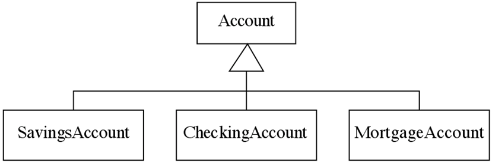

- **Inheritance**
  - The *implicit* possession by all subclasses of features defined in its superclasses

---

### The Is-a Rule

- **Always check generalizations to ensure they obey the isa rule**
  - "A checking account **is an** account"
  - "A village **is a** municipality"
- **Should 'Province' be a subclass of 'Country'?**
  - No, it violates the is-a rule
  - "A province **is a** country" is invalid!

---

### A possible inheritance hierarchy of mathematical objects

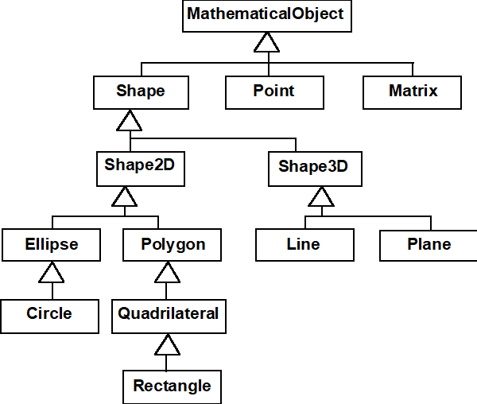

---

### Make Sure all Inherited Features Make Sense in Subclasses

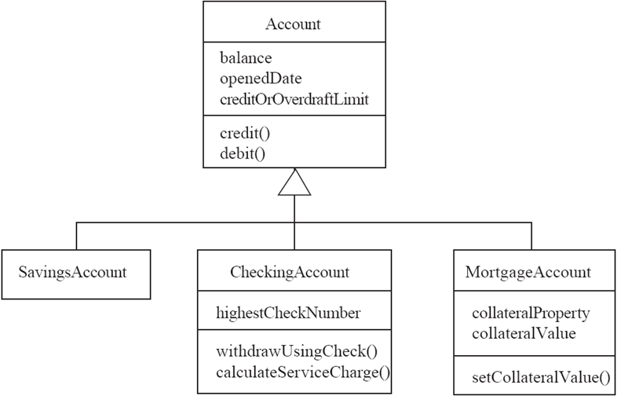

---

### Inheritance, Polymorphism and Variables

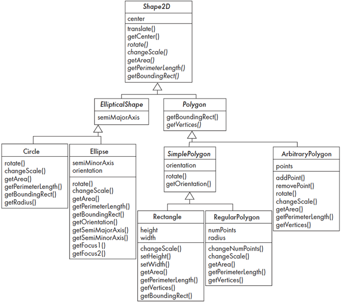

---

### Some Operations in the Shape Example

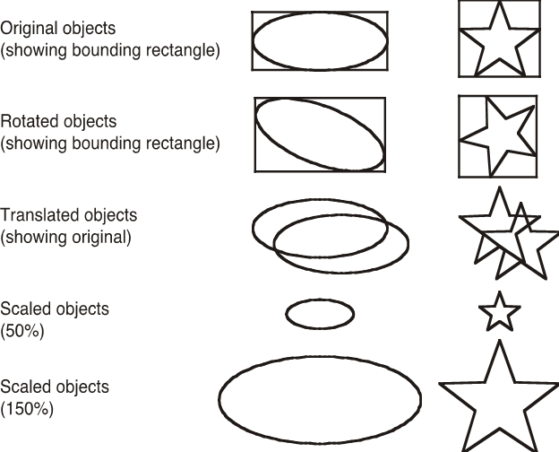

---

## **Java Inheritance**

--- 

### Inheritance Concept

- The inheritance is a very useful and powerful concept of object-oriented programming. 
- In java, using the inheritance concept, we can use the existing features of one class in another class. - The inheritance provides a great advantage called code re-usability.
- With the help of code re-usability, the commonly used code in an application need not be written again and again.

--- 

### Inheritance Concept

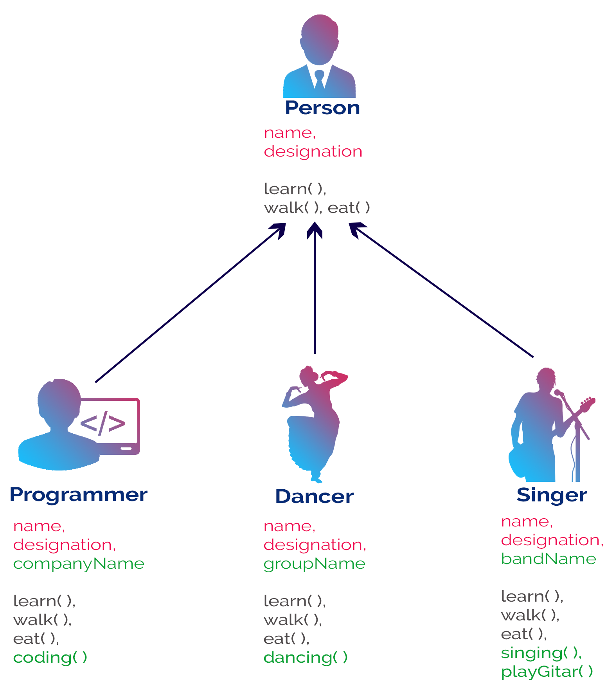

--- 

### Inheritance Concept

The inheritance is the process of acquiring the properties of one class to another class.

---

### Inheritance Basics

- In inheritance, we use the terms like 
  - parent class, 
  - child class, 
  - base class, 
  - derived class, 
  - superclass, and 
  - subclass.

---

### Inheritance Basics

- **The Parent class** is the class which provides features to another class. 
  
  - **The parent class** is also known as **Base class** or **Superclass**.

- **The Child class** is the class which receives features from another class. 
  
  - **The child class** is also known as the **Derived Class** or **Subclass**.

---

### Inheritance Basics

- In the inheritance, 
  - the child class acquires the features from its parent class. 
  - But the parent class never acquires the features from its child class.

---

### Inheritance Basics

There are five types of inheritances, and they are as follows.

- Simple Inheritance (or) Single Inheritance
- Multiple Inheritance
- Multi-Level Inheritance
- Hierarchical Inheritance
- Hybrid Inheritance

---

### Inheritance Basics

- Simple Inheritance (or) Single Inheritance

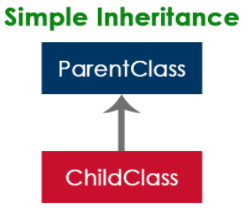

---

### Inheritance Basics

- Multiple Inheritance

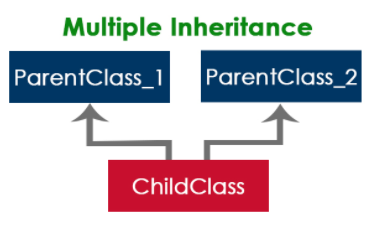

---

### Inheritance Basics

- Multi-Level Inheritance

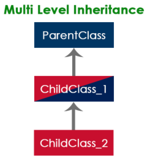

---

### Inheritance Basics

- Hierarchical Inheritance

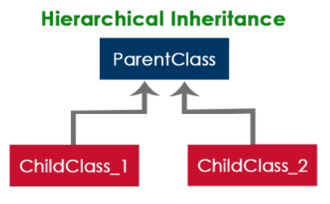

---

### Inheritance Basics

- Hybrid Inheritance

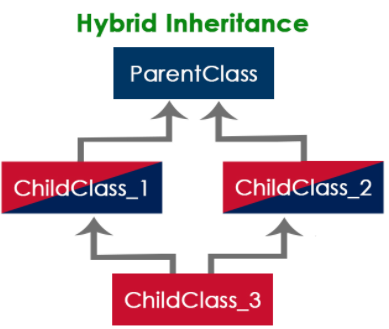

---

### Inheritance Basics

- The java programming language does not support multiple inheritance type. 
- However, it provides an alternate with the concept of **interfaces**.

---

### Creating Child Class in java

- In java, we use the keyword **extends** to create a child class. 
  - The following syntax used to create a child class in java.

``` Java linenums="1"
  class <ChildClassName> extends <ParentClassName>{
    ...
    //Implementation of child class
    ...
  }
  ```

  - In a java programming language, a class extends only one class. 
    - Extending multiple classes is not allowed in java.

---

### Single Inheritance in Java Example-1
- In this type of inheritance, one child class derives from one parent class. 

``` Java linenums="1"
class ParentClass{
	int a;
	void setData(int a) {
		this.a = a;
	}
}
```

``` Java linenums="1"
class ChildClass extends ParentClass{
	void showData() {
		System.out.println("Value of a is " + a);
	}
}
```

---

### Single Inheritance in Java Example-1

``` Java linenums="1"
public class SingleInheritance {

	public static void main(String[] args) {

		ChildClass obj = new ChildClass();
		obj.setData(100);
		obj.showData();

	}
}
```

---

### Single Inheritance in Java Example-2


``` Java linenums="1"
class Animal {

  // field and method of the parent class
  String name;
  public void eat() {
    System.out.println("I can eat");
  }
}
```

``` Java linenums="1"
// inherit from Animal
class Dog extends Animal {

  // new method in subclass
  public void display() {
    System.out.println("My name is " + name);
  }
}
```

---

### Single Inheritance in Java Example-2


``` Java linenums="1"

class Main {
  public static void main(String[] args) {
    // create an object of the subclass
    Dog labrador = new Dog();
    // access field of superclass
    labrador.name = "Rohu";
    labrador.display();
    // call method of superclass
    // using object of subclass
    labrador.eat();
  }
}
```

---

### Single Inheritance in Java Example-2

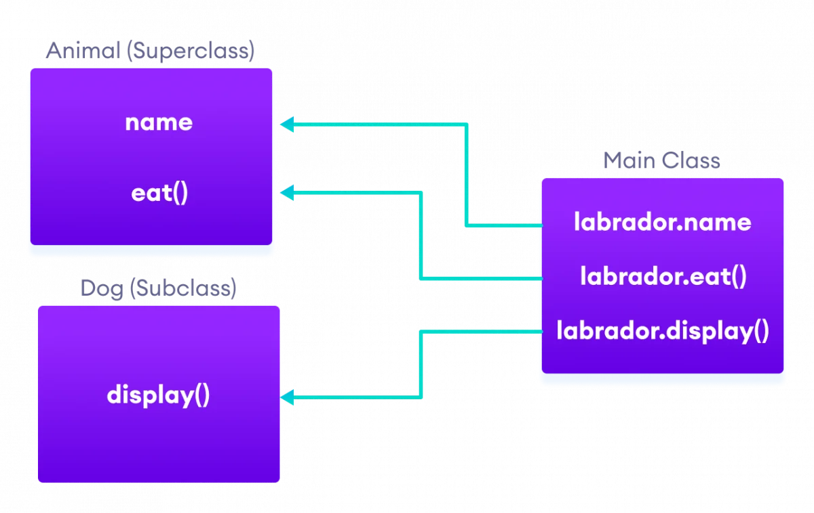

---

### Single Inheritance / is-a relationship

- In Java, inheritance is an is-a relationship. That is, we use inheritance only if there exists an is-a relationship between two classes. For example,
  - Car is a Vehicle
  - Orange is a Fruit
  - Surgeon is a Doctor
  - Dog is an Animal
    - Here, Car can inherit from Vehicle, Orange can inherit from Fruit, and so on.

---

### Multi-level Inheritance in java

- In this type of inheritance, the child class derives from a class which already derived from another class

``` Java linenums="1"
class ParentClass{
	int a;
	void setData(int a) {
		this.a = a;
	}
}
```

---

### Multi-level Inheritance in java


``` Java linenums="1"
class ChildClass extends ParentClass{
	void showData() {
		System.out.println("Value of a is " + a);
	}
}
``` 

``` Java linenums="1"
class ChildChildClass extends ChildClass{
	void display() {
		System.out.println("Inside ChildChildClass!");
	}
}
``` 

---

### Multi-level Inheritance in java

``` Java linenums="1"
public class MultipleInheritance {

	public static void main(String[] args) {

		ChildChildClass obj = new ChildChildClass();
		obj.setData(100);
		obj.showData();
		obj.display();

	}
}
```

---

### Hierarchical Inheritance in java

- In this type of inheritance, two or more child classes derive from one parent class.

``` Java linenums="1"
class ParentClass{
	int a;
	void setData(int a) {
		this.a = a;
	}
}
```

---

### Hierarchical Inheritance in java


``` Java linenums="1"
class ChildClass extends ParentClass{
	void showData() {
		System.out.println("Inside ChildClass!");
		System.out.println("Value of a is " + a);
	}
}
```
``` Java linenums="1"
class ChildClassToo extends ParentClass{
	void display() {
		System.out.println("Inside ChildClassToo!");
		System.out.println("Value of a is " + a);
	}
}
```

---

### Hierarchical Inheritance in java

``` Java linenums="1"
public class HierarchicalInheritance {
	public static void main(String[] args) {
		ChildClass child_obj = new ChildClass();
		child_obj.setData(100);
		child_obj.showData();
        
		ChildClassToo childToo_obj = new ChildClassToo();
		childToo_obj.setData(200);
		childToo_obj.display();
	}
}
```

---

### Hybrid Inheritance in java

- The hybrid inheritance is the combination of more than one type of inheritance. 
  - We may use any combination as a 
    - single with multiple inheritances, 
    - multi-level with multiple inheritances, etc.,

---


### Takeaway: Java Inheritance

- Inheritance enables code reuse through parent-child class relationships
- The Is-a Rule: use inheritance only when "A Dog is-a Animal" makes sense
- Java supports single, multi-level, and hierarchical inheritance
- 'extends' keyword creates the inheritance relationship
- All inherited features must make sense in subclasses - design carefully

---

## **Module B: Constructors in Inheritance**

---

### Module Outline

- Constructor Chain in Inheritance
- super() for Parent Constructor Calls
- Method Overriding in Inheritance Context

---

## **Java Constructors in Inheritance**

---

### Java Constructors in Inheritance

- It is very important to understand how the constructors get executed in the inheritance concept.
- In the inheritance, the constructors never get inherited to any child class.
- In java, the default constructor of a parent class called automatically by the constructor of its child class. 
- That means when we create an object of the child class, 
- the parent class constructor executed, followed by the child class constructor executed.

---

### Java Constructors in Inheritance - Example

``` Java linenums="1"
class ParentClass{
	int a;
	ParentClass(){
		System.out.println("Inside ParentClass constructor!");
	}
}
```

``` Java linenums="1"
class ChildClass extends ParentClass{

	ChildClass(){
		System.out.println("Inside ChildClass constructor!!");		
	}
}
```

---

### Java Constructors in Inheritance - Example


``` Java linenums="1"
class ChildChildClass extends ChildClass{

	ChildChildClass(){
		System.out.println("Inside ChildChildClass constructor!!");		
	}	
}
```

``` Java linenums="1"
public class ConstructorInInheritance {

	public static void main(String[] args) {

		ChildChildClass obj = new ChildChildClass();
	}
}
```

---

### Java Constructors in Inheritance

- if the parent class contains both default and parameterized constructor, 
  - then only the default constructor called automatically 
    - by the child class constructor

---

### Java Constructors in Inheritance - Example

``` Java linenums="1"
class ParentClass{
	int a;
	ParentClass(int a){
		System.out.println("Inside ParentClass parameterized constructor!");
		this.a = a;
	}
	ParentClass(){
		System.out.println("Inside ParentClass default constructor!");
	}
}
```

---

### Java Constructors in Inheritance - Example


``` Java linenums="1"
class ChildClass extends ParentClass{
	ChildClass(){
		System.out.println("Inside ChildClass constructor!!");		
	}
}
```

``` Java linenums="1"
public class ConstructorInInheritance {
	public static void main(String[] args) {
		ChildClass obj = new ChildClass();
	}
}
```

---

### Java Constructors in Inheritance

- The parameterized constructor of parent class must be called explicitly using the super keyword.


---

### Method Overriding in Java Inheritance


``` Java linenums="1"
class Animal {

  // method in the superclass
  public void eat() {
    System.out.println("I can eat");
  }
}
```

---

### Method Overriding in Java Inheritance


``` Java linenums="1"
// Dog inherits Animal
class Dog extends Animal {

  // overriding the eat() method
  @Override
  public void eat() {
    System.out.println("I eat dog food");
  }

  // new method in subclass
  public void bark() {
    System.out.println("I can bark");
  }
}
```

---

### Method Overriding in Java Inheritance


``` Java linenums="1"
class Main {
  public static void main(String[] args) {

    // create an object of the subclass
    Dog labrador = new Dog();

    // call the eat() method
    labrador.eat();
    labrador.bark();
  }
}
```

---

### Method Overriding in Java Inheritance

- In the above example, the eat() method is present in both the superclass Animal and the subclass Dog.
- Here, we have created an object labrador of Dog.
- Now when we call eat() using the object labrador, the method inside Dog is called. This is because the method inside the derived class overrides the method inside the base class.


--- 


### Takeaway: Constructors in Inheritance

- Parent class constructor runs before child class constructor
- Use super() to explicitly call a specific parent constructor
- If no explicit super() call, Java calls the parent's no-arg constructor automatically
- Method overriding allows child classes to provide specific implementations
- Constructor chaining ensures proper initialization of the entire hierarchy

---

## **Module C: Java super Keyword - Comprehensive**

---

### Module Outline

- What is the super keyword?
- super to Access Parent Data Members
- super to Call Parent Methods
- super() to Call Parent Constructor
- Accessing Overridden Methods via super
- Complete Examples (5 detailed examples)

---

## **super Keyword in Java Inheritance**

--- 

### super Keyword in Java Inheritance

- the same method in the subclass overrides the method in superclass.

- In such a situation, the super keyword is used to call the method of the parent class from the method of the child class.

--- 

### super Keyword in Java Inheritance

``` Java linenums="1"
class Animal {

  // method in the superclass
  public void eat() {
    System.out.println("I can eat");
  }
}
```

--- 

### super Keyword in Java Inheritance

``` Java linenums="1"
// Dog inherits Animal
class Dog extends Animal {

  // overriding the eat() method
  @Override
  public void eat() {

    // call method of superclass
    super.eat();
    System.out.println("I eat dog food");
  }

  // new method in subclass
  public void bark() {
    System.out.println("I can bark");
  }
}
```

--- 

### super Keyword in Java Inheritance


``` Java linenums="1"
class Main {
  public static void main(String[] args) {

    // create an object of the subclass
    Dog labrador = new Dog();

    // call the eat() method
    labrador.eat();
    labrador.bark();
  }
}
```

---

## **Java super keyword**

---

### Java super keyword

- In java, `super` is a keyword used to refers to the **parent class object**. 
- The `super` keyword came into existence to solve the *naming conflicts* in the inheritance. 
- When both parent class and child class have members with the same name, 
  - then the super keyword is used to refer to the parent class version.

---

### Java super keyword

- In another word, The super keyword in Java is used in subclasses to access superclass members (attributes, constructors and methods).

---

### Java super keyword

- In java, the super keyword is used for the following purposes.
  - To refer parent class **data members**
  - To refer parent class **methods**
  - To call parent class **constructor**

---

### Java super keyword

- To call methods of the superclass that is overridden in the subclass.
- To access attributes (fields) of the superclass if both superclass and subclass have attributes with the same name.
- To explicitly call superclass no-arg (default) or parameterized constructor from the subclass constructor.

---

### Java super keyword

- The super keyword is used inside the child class only.

---

### super to refer parent class **data members**

- When both parent class and child class have data members with the same name, 
  - then the super keyword is used to refer to the parent class data member from child class.

---

### super to refer parent class **data members**

``` Java linenums="1"
class ParentClass{
	
	int num = 10;
	
}
```

``` Java linenums="1"
class ChildClass extends ParentClass{
	
	int num = 20;
	
	void showData() {
		System.out.println("Inside the ChildClass");
		System.out.println("ChildClass num = " + num);
		System.out.println("ParentClass num = " + super.num);		
	}
}
```

---

### super to refer parent class **data members**

``` Java linenums="1"
public class SuperKeywordExample {

	public static void main(String[] args) {
		ChildClass obj = new ChildClass();
		
		obj.showData();
		
		System.out.println("\nInside the non-child class");
		System.out.println("ChildClass num = " + obj.num);
		//System.out.println("ParentClass num = " + super.num); //super can't be used here
	}
}
```

---

### super to refer parent class **method**

- When both parent class and child class have method with the same name, 
  - then the super keyword is used to refer to the parent class method from child class.

---

### super to refer parent class **method**

```Java
class ParentClass{
	
	int num1 = 10;
	
	void showData() {
		System.out.println("\nInside the ParentClass showData method");
		System.out.println("ChildClass num = " + num1);		
	}	
}
```

---

### super to refer parent class **method**

```Java
class ChildClass extends ParentClass{
	
	int num2 = 20;
	
	void showData() {
		System.out.println("\nInside the ChildClass showData method");
		System.out.println("ChildClass num = " + num2);	

		super.showData();
		
	}
}
```

---

### super to refer parent class **method**

```Java
public class SuperKeywordExample {

	public static void main(String[] args) {
		ChildClass obj = new ChildClass();
		
		obj.showData();
		//super.showData();	// super can't be used here
		
	}
}
```

--- 

### super to call parent class **constructor**

- When an object of child class is created, it automatically calls the parent class default-constructor before it's own. 
- But, the parameterized constructor of parent class must be called explicitly using the super keyword inside the child class constructor.

--- 

### super to call parent class **constructor**

``` Java linenums="1"
class ParentClass{
	
	int num1;
	
	ParentClass(){
		System.out.println("\nInside the ParentClass default constructor");
		num1 = 10;
	}
	
	ParentClass(int value){
		System.out.println("\nInside the ParentClass parameterized constructor");
		num1 = value;
	}	
}
```

--- 

### super to call parent class **constructor**

``` Java linenums="1"
class ChildClass extends ParentClass{
	
	int num2;
	
	ChildClass(){
		super(100);
		System.out.println("\nInside the ChildClass constructor");
		num2 = 200;		
	}
}
```

--- 

### super to call parent class **constructor**

``` Java linenums="1"
public class SuperKeywordExample {

	public static void main(String[] args) {
		
		ChildClass obj = new ChildClass();
		
	}
}
```

--- 

### super to call parent class **constructor**

- To call the parameterized constructor of the parent class, 
- the super keyword must be the first statement inside the child class constructor, 
- and we must pass the parameter values.

---

### Access Overridden Methods of the superclass

- If methods with the same name are defined in both superclass and subclass, the method in the subclass overrides the method in the superclass. This is called method overriding.

---

### Example 1: Method overriding

``` Java linenums="1"
class Animal {

  // overridden method
  public void display(){
    System.out.println("I am an animal");
  }
}
```

---

### Example 1: Method overriding

``` Java linenums="1"
class Dog extends Animal {

  // overriding method
  @Override
  public void display(){
    System.out.println("I am a dog");
  }

  public void printMessage(){
    display();
  }
}
```

---

### Example 1: Method overriding

``` Java linenums="1"
class Main {
  public static void main(String[] args) {
    Dog dog1 = new Dog();
    dog1.printMessage();
  }
}

```

---

### Example 1: Method overriding

In this example, by making an object dog1 of Dog class, we can call its method printMessage() which then executes the display() statement.

Since display() is defined in both the classes, the method of subclass Dog overrides the method of superclass Animal. Hence, the display() of the subclass is called.

---

### Example 1: Method overriding

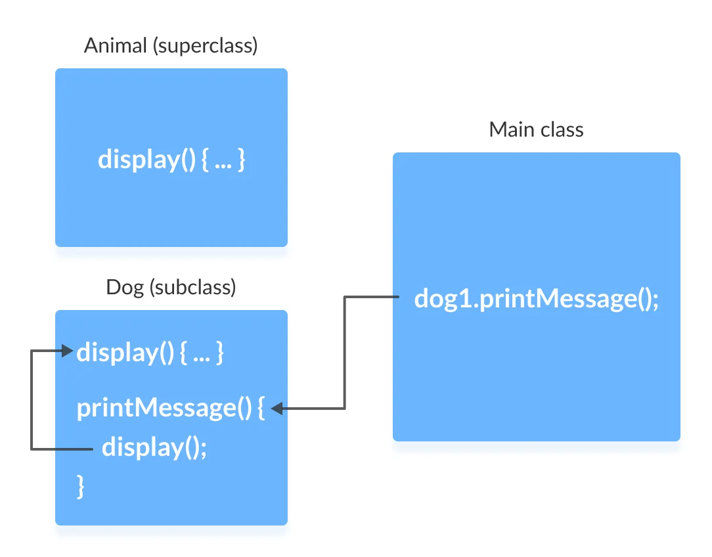

---

### What if the overridden method of the superclass has to be called?
- We use super.display() if the overridden method display() of superclass Animal needs to be called.

---

### Example 2: super to Call Superclass Method

``` Java linenums="1"
class Animal {

  // overridden method
  public void display(){
    System.out.println("I am an animal");
  }
}
```

---

### Example 2: super to Call Superclass Method

``` Java linenums="1"
class Dog extends Animal {

  // overriding method
  @Override
  public void display(){
    System.out.println("I am a dog");
  }

  public void printMessage(){

    // this calls overriding method
    display();

    // this calls overridden method
    super.display();
  }
}
```

---

### Example 2: super to Call Superclass Method

``` Java linenums="1"
class Main {
  public static void main(String[] args) {
    Dog dog1 = new Dog();
    dog1.printMessage();
  }
}
```

---

### Example 2: super to Call Superclass Method

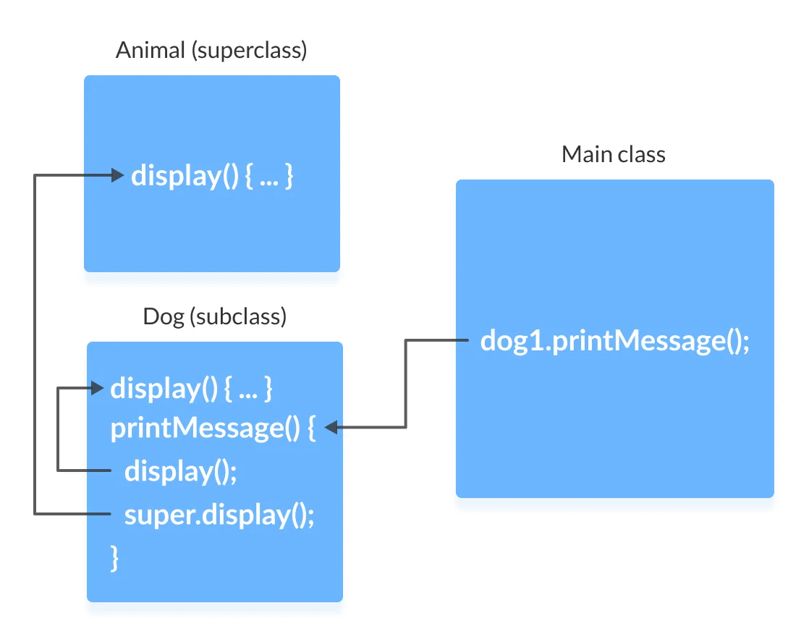

---

### Access Attributes of the Superclass

- The superclass and subclass can have attributes with the same name. 
  - We use the super keyword to access the attribute of the superclass.

---

### Example 3: Access superclass attribute

``` Java linenums="1"
class Animal {
  protected String type="animal";
}
```

``` Java linenums="1"
class Dog extends Animal {
  public String type="mammal";

  public void printType() {
    System.out.println("I am a " + type);
    System.out.println("I am an " + super.type);
  }
}
```

---

### Example 3: Access superclass attribute

``` Java linenums="1"
class Main {
  public static void main(String[] args) {
    Dog dog1 = new Dog();
    dog1.printType();
  }
}

```

---

### Example 3: Access superclass attribute

- In this example, we have defined the same instance field `type` in both the superclass `Animal` and the subclass `Dog`.
- We then created an object `dog1` of the Dog class. Then, the `printType()` method is called using this object.
  - Inside the `printType()` function,
    - `type` refers to the attribute of the subclass `Dog`.
    - `super.type` refers to the attribute of the superclass Animal.

---

### Use of super() to access superclass constructor

- As we know, when an object of a class is created, its default constructor is automatically called.
- To explicitly call the superclass constructor from the subclass constructor, we use `super()`. It's a special form of the super keyword.
- `super()` can be used only inside the subclass constructor and must be the first statement.

---

### Example 4: Use of super()

``` Java linenums="1"
class Animal {

  // default or no-arg constructor of class Animal
  Animal() {
    System.out.println("I am an animal");
  }
}
```

---

### Example 4: Use of super()

``` Java linenums="1"
class Dog extends Animal {

  // default or no-arg constructor of class Dog
  Dog() {

    // calling default constructor of the superclass
    super();

    System.out.println("I am a dog");
  }
}
```

---

### Example 4: Use of super()

``` Java linenums="1"
class Main {
  public static void main(String[] args) {
    Dog dog1 = new Dog();
  }
}
```

---

### Example 4: Use of super()

- when an object dog1 of Dog class is created, it automatically calls the default or no-arg constructor of that class.

- Inside the subclass constructor, the super() statement calls the constructor of the superclass and executes the statements inside it. Hence, we get the output I am an animal.

---

### Example 4: Use of super()

-example.png)

The flow of the program then returns back to the subclass constructor and executes the remaining statements. Thus, I am a dog will be printed.

However, using super() is not compulsory. Even if super() is not used in the subclass constructor, the compiler implicitly calls the default constructor of the superclass.

---

### Example 4: Use of super()

- **So, why use redundant code if the compiler automatically invokes super()?**
  -  It is required if the parameterized constructor (a constructor that takes arguments) of the superclass has to be called from the subclass constructor.

- The parameterized super() must always be the first statement
  - in the body of the constructor of the subclass, 
  - otherwise, we get a compilation error.

---

### Example 5: Call Parameterized Constructor Using super()

``` Java linenums="1"
class Animal {

  // default or no-arg constructor
  Animal() {
    System.out.println("I am an animal");
  }

  // parameterized constructor
  Animal(String type) {
    System.out.println("Type: "+type);
  }
}
```

---

### Example 5: Call Parameterized Constructor Using super()

``` Java linenums="1"
class Dog extends Animal {

  // default constructor
  Dog() {

    // calling parameterized constructor of the superclass
    super("Animal");

    System.out.println("I am a dog");
  }
}
```

---

### Example 5: Call Parameterized Constructor Using super()

``` Java linenums="1"
class Main {
  public static void main(String[] args) {
    Dog dog1 = new Dog();
  }
}
```

---

### Example 5: Call Parameterized Constructor Using super()

If a parameterized constructor has to be called, we need to explicitly define it in the subclass constructor.

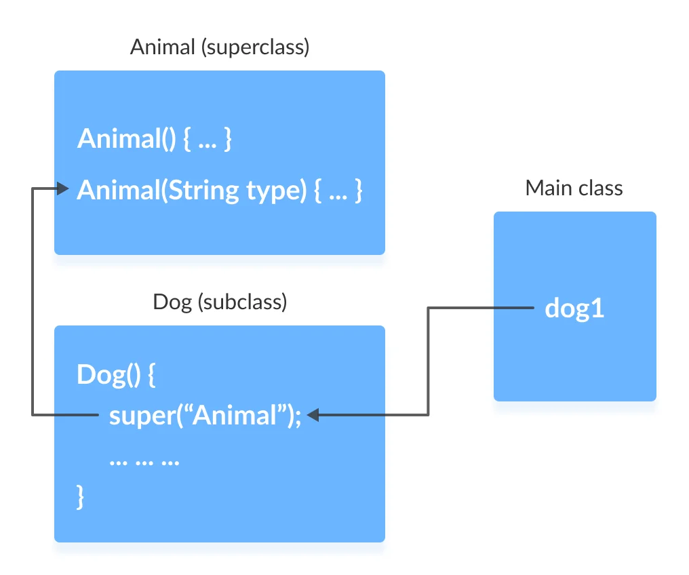

---

## Example 5: Call Parameterized Constructor Using super()

Note that in the above example, we explicitly called the parameterized constructor super("Animal"). The compiler does not call the default constructor of the superclass in this case.

---


### Takeaway: Java super Keyword

- super refers to the parent (superclass) object
- Three main uses: access parent data members, call parent methods, invoke parent constructor
- super.fieldName accesses parent's field when child has same-named field
- super.methodName() calls parent's method - useful for extending (not replacing) behavior
- super() must be the first statement in a constructor if used

---

## **Module D: Java this Keyword and instanceof Operator**

---

### Module Outline

- Java this Keyword: Resolving Ambiguity
- this with Getters and Setters
- this in Constructor Overloading
- Passing this as an Argument
- Java instanceof Operator
- instanceof with Inheritance and Interfaces

---

## **Java this Keyword**

---

### Java this Keyword

- In Java, this keyword is used to refer to 
  - the current object 
    - inside a 
      - method or a 
      - constructor

---

### Java this Keyword


``` Java linenums="1"
class Main {
    int instVar;

    Main(int instVar){
        this.instVar = instVar;
        System.out.println("this reference = " + this);
    }

    public static void main(String[] args) {
        Main obj = new Main(8);
        System.out.println("object reference = " + obj);
    }
}
``` 

---

### Using this for Ambiguity Variable Names

- In Java, it is not allowed to declare two or more variables having the same name inside a scope (class scope or method scope). 
- However, instance variables and parameters may have the same name.

---

### Using this for Ambiguity Variable Names

WRONG 


``` Java linenums="1"
class Main {

    int age;
    Main(int age){
        age = age;
    }

    public static void main(String[] args) {
        Main obj = new Main(8);
        System.out.println("obj.age = " + obj.age);
    }
}
```

--- 

### Using this for Ambiguity Variable Names

CORRECT 

``` Java linenums="1"
class Main {

    int age;
    Main(int age){
        this.age = age;
    }

    public static void main(String[] args) {
        Main obj = new Main(8);
        System.out.println("obj.age = " + obj.age);
    }
}
```

---

### this with Getters and Setters
- Another common use of this keyword is in setters and getters methods of a class

``` Java linenums="1"
class Main {
   String name;

   // setter method
   void setName( String name ) {
       this.name = name;
   }

   // getter method
   String getName(){
       return this.name;
   }
   ...
``` 

---

### this with Getters and Setters


``` Java linenums="1"
...
   public static void main( String[] args ) {
       Main obj = new Main();

       // calling the setter and the getter method
       obj.setName("Toshiba");
       System.out.println("obj.name: "+obj.getName());
   }
}
```

---

### Using this in Constructor Overloading

- While working with constructor overloading, 
- we might have to invoke one constructor from another constructor. 
- In such a case, 
  - we cannot call the constructor explicitly. Instead, 
  - we have to use this keyword.

---

### Using this in Constructor Overloading

``` Java linenums="1"

class Complex {

    private int a, b;

    // constructor with 2 parameters
    private Complex( int i, int j ){
        this.a = i;
        this.b = j;
    }

    // constructor with single parameter
    private Complex(int i){
        // invokes the constructor with 2 parameters
        this(i, i); 
    }

    // constructor with no parameter
    private Complex(){
        // invokes the constructor with single parameter
        this(0);
    }
    ...
``` 

---

### Using this in Constructor Overloading

``` Java linenums="1"
    @Override
    public String toString(){
        return this.a + " + " + this.b + "i";
    }

    public static void main( String[] args ) {
  
        // creating object of Complex class
        // calls the constructor with 2 parameters
        Complex c1 = new Complex(2, 3); 
    
        // calls the constructor with a single parameter
        Complex c2 = new Complex(3);

        // calls the constructor with no parameters
        Complex c3 = new Complex();

        // print objects
        System.out.println(c1);
        System.out.println(c2);
        System.out.println(c3);
    }
}
```

---

### Using this in Constructor Overloading

- In the example, we have used this keyword,
  - to call the constructor `Complex(int i, int j)` from the constructor `Complex(int i)`
  - to call the constructor `Complex(int i)` from the constructor `Complex()`
- the line, `System.out.println(c1);` process, the toString() is called Since we override the toString() method inside our class, we get the output according to that method. 

---

### Using this in Constructor Overloading

- One of the huge advantages of this() is to reduce the amount of duplicate code. However, we should be always careful while using this().

- This is because calling constructor from another constructor adds overhead and it is a slow process. Another huge advantage of using this() is to reduce the amount of duplicate code.

---

### Using this in Constructor Overloading

- Invoking one constructor from another constructor is called explicit constructor invocation.


--- 

### Passing this as an Argument

- We can use this keyword to pass the current object as an argument to a method

``` Java linenums="1"
class ThisExample {
    // declare variables
    int x;
    int y;

    ThisExample(int x, int y) {
       // assign values of variables inside constructor
        this.x = x;
        this.y = y;

        // value of x and y before calling add()
        System.out.println("Before passing this to addTwo() method:");
        System.out.println("x = " + this.x + ", y = " + this.y);

        // call the add() method passing this as argument
        add(this);

        // value of x and y after calling add()
        System.out.println("After passing this to addTwo() method:");
        System.out.println("x = " + this.x + ", y = " + this.y);
    }

    void add(ThisExample o){
        o.x += 2;
        o.y += 2;
    }
}
```

--- 

### Passing this as an Argument

``` Java linenums="1"
class Main {
    public static void main( String[] args ) {
        ThisExample obj = new ThisExample(1, -2);
    }
}
```

--- 

### Passing this as an Argument

- In the example, inside the constructor `ThisExample()`, notice the line, `add(this);`
- Here, we are calling the `add()` method by passing this as an argument. 
- Since this keyword contains the reference to the object obj of the class, 
- we can change the value of `x` and `y` inside the `add()` method.

---

## **Java instanceof Operator**

---

### Java instanceof Operator

- The instanceof operator in Java is used to 
  - check whether an object is an instance of 
    - a particular class or not.
- Its syntax is

``` Java
objectName instanceOf className;
```

---

### Example: Java instanceof


``` Java linenums="1"
class Main {

  public static void main(String[] args) {

    // create a variable of string type
    String name = "My App";
    
    // checks if name is instance of String
    boolean result1 = name instanceof String;
    System.out.println("name is an instance of String: " + result1);

    // create an object of Main
    Main obj = new Main();

    // checks if obj is an instance of Main
    boolean result2 = obj instanceof Main;
    System.out.println("obj is an instance of Main: " + result2);
  }
}
```

---

### Example: Java instanceof

- In the example, we have created a variable name of the String type and an object obj of the Main class.

- Here, we have used the instanceof operator to check whether name and obj are instances of the String and Main class respectively. And, the operator returns true in both cases.

---

### Java instanceof during Inheritance

- We can use the instanceof operator to check if objects of the subclass is also an instance of the superclass.

---

### Java instanceof during Inheritance


``` Java linenums="1"
// Java Program to check if an object of the subclass
// is also an instance of the superclass

// superclass
class Animal {
}

// subclass
class Dog extends Animal {
}

class Main {
  public static void main(String[] args) {

    // create an object of the subclass
    Dog d1 = new Dog();

    // checks if d1 is an instance of the subclass
    System.out.println(d1 instanceof Dog);        // prints true

    // checks if d1 is an instance of the superclass
    System.out.println(d1 instanceof Animal);     // prints true
  }
}
```

---

### Java instanceof during Inheritance

- In the above example, we have created a subclass Dog that inherits from the superclass Animal. We have created an object d1 of the Dog class.

- Inside the print statement, notice the expression,

``` Java linenums="1"
d1 instanceof Animal
```

- Here, we are using the `instanceof` operator to check whether `d1` is also an instance of the superclass `Animal`

--- 

### Java instanceof in Interface

- The instanceof operator is also used to check whether an object of a class is 
  - also an instance of the interface implemented by the class

--- 

### Java instanceof in Interface

``` Java linenums="1"
// Java program to check if an object of a class is also
//  an instance of the interface implemented by the class

interface Animal {
}

class Dog implements Animal {
}
```

--- 

### Java instanceof in Interface


``` Java linenums="1"
class Main {
  public static void main(String[] args) {

    // create an object of the Dog class
    Dog d1 = new Dog();

    // checks if the object of Dog
    // is also an instance of Animal
    System.out.println(d1 instanceof Animal);  // returns true
  }
}
```

--- 

### Java instanceof in Interface

- In the example, the `Dog` class implements the `Animal` interface. Inside the print statement, notice the expression,

``` Java linenums="1"
d1 instanceof Animal
``` 

- Here, `d1` is an instance of `Dog` class. The instanceof operator checks 
  - if `d1` is also an instance of the interface `Animal`.

--- 

### Java instanceof in Interface

In Java, all the classes are inherited from the Object class. So, instances of all the classes are also an instance of the Object class.

In the previous example, if we check,

``` Java linenums="1"
d1 instanceof Object
``` 

The result will be `true`.

--- 


### Takeaway: this Keyword and instanceof

- this refers to the current object instance
- Use this to disambiguate between instance variables and parameters with same name
- this() calls another constructor in the same class (constructor chaining)
- instanceof checks if an object is an instance of a specific class or interface
- instanceof returns true for parent classes and implemented interfaces too

---

## **Module E: Java Method Overriding**

---

### Module Outline

- What is Method Overriding? Conceptual Understanding
- How the JVM Decides Which Method to Run (Dynamic Binding)
- Java Method Overriding Syntax and Rules
- Access Specifiers in Overriding
- Using super with Overriding
- Overriding Abstract Methods

---

### Overriding

- A method would be inherited, but a subclass contains a new version instead
  - For extension
    - E.g. `SavingsAccount` might charge an extra fee following every debit
  - For optimization
    - E.g. The `getPerimeterLength` method in `Circle` is much simpler than the one in `Ellipse`
  - For restriction (best to avoid)
    - E.g. `scale(x,y)` would not work in `Circle`

---

### How a decision is made about which method to run

- If there is a concrete method for the operation in the current class, run that method.
- Otherwise, check in the immediate superclass to see if there is a method there; if so, run it.
- Repeat step 2, looking in successively higher superclasses until a concrete method is found and run.
- If no method is found, then there is an error
  In Java and C++ the program would not have compiled
  - In Java and C++ the program would not have compiled

---

### Dynamic binding

- **Occurs when decision about which method to run can only be made at run time**
  - Needed when:
    - A variable is declared to have a superclass as its type, and
    - There is more than one possible polymorphic method that could be run among the type of the variable and its subclasses

---

## **Java Method Overriding**

---

### Java Method Overriding

- The method overriding is the process of re-defining a method in a child class that is already defined in the parent class. 
- When both parent and child classes have the same method, then that method is said to be the overriding method.
- The method overriding enables the child class to change the implementation of the method which aquired from parent class according to its requirement.

---

### Java Method Overriding

The method overriding is also known as 
- dynamic method dispatch or 
- run time polymorphism or 
- pure polymorphism.

---

### Java Method Overriding Example

``` Java linenums="1"
class ParentClass{
	
	int num = 10;
	
	void showData() {
		System.out.println("Inside ParentClass showData() method");
		System.out.println("num = " + num);
	}
}
```

---

### Java Method Overriding Example

``` Java linenums="1"
class ChildClass extends ParentClass{
	
	void showData() {
		System.out.println("Inside ChildClass showData() method");
		System.out.println("num = " + num);
	}
}
```

---

### Java Method Overriding Example

``` Java linenums="1"
public class PurePolymorphism {

	public static void main(String[] args) {
		
		ParentClass obj = new ParentClass();
		obj.showData();
		
		obj = new ChildClass();
		obj.showData();
		
	}
}
```

---

### Rules for method overriding

While overriding a method, we must follow the below list of rules.

- Static methods can not be overridden.
- Final methods can not be overridden.
- Private methods can not be overridden.
- Constructor can not be overridden.
- An abstract method must be overridden.
- Use super keyword to invoke overridden method from child class.

---

### Rules for method overriding

- The return type of the overriding method must be same as the parent has it.
- The access specifier of the overriding method can be changed, but the visibility must increase but not decrease. For example, a protected method in the parent class can be made public, but not private, in the child class.

---

### Rules for method overriding

- If the overridden method does not throw an exception in the parent class, then the child class overriding method can only throw the unchecked exception, throwing a checked exception is not allowed.
- If the parent class overridden method does throw an exception, then the child class overriding method can only throw the same, or subclass exception, or it may not throw any exception.

---

### Method Overriding Example

``` Java linenums="1"
class Animal {
   public void displayInfo() {
      System.out.println("I am an animal.");
   }
}

class Dog extends Animal {
   @Override
   public void displayInfo() {
      System.out.println("I am a dog.");
   }
}

class Main {
   public static void main(String[] args) {
      Dog d1 = new Dog();
      d1.displayInfo();
   }
}
```

---

### Method Overriding Example

- annotations are the metadata that we used to provide information to the compiler

- It is not mandatory to use @Override. However, when we use this, the method should follow all the rules of overriding. Otherwise, the compiler will generate an error.

---

### Method Overriding Example

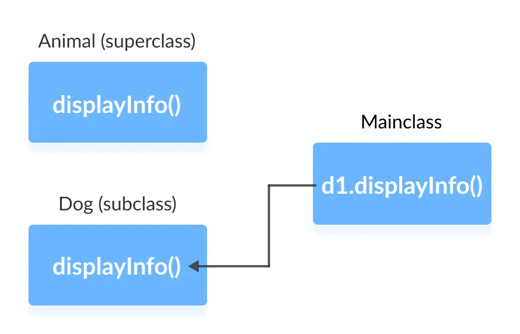

---

### super Keyword in Java Overriding

- Can we access the method of the superclass after overriding?
  - The answer is Yes. To access the method of the superclass from the subclass, we use the super keyword

---

### Use of super Keyword Example

``` Java linenums="1"
class Animal {
   public void displayInfo() {
      System.out.println("I am an animal.");
   }
}

class Dog extends Animal {
   public void displayInfo() {
      super.displayInfo();
      System.out.println("I am a dog.");
   }
}

class Main {
   public static void main(String[] args) {
      Dog d1 = new Dog();
      d1.displayInfo();
   }
}
```

---

### Use of super Keyword Example

- In the above example, the subclass Dog overrides the method displayInfo() of the superclass Animal.

- When we call the method displayInfo() using the d1 object of the Dog subclass, the method inside the Dog subclass is called; the method inside the superclass is not called

- Inside displayInfo() of the Dog subclass, we have used super.displayInfo() to call displayInfo() of the superclass.

---

### Use of super Keyword Example

- note that constructors in Java are not inherited. Hence, there is no such thing as constructor overriding in Java.

- However, we can call the constructor of the superclass from its subclasses. For that, we use super()

---

### Access Specifiers in Method Overriding

- The same method declared in the superclass and its subclasses can have different access specifiers. However, there is a restriction.

- We can only use those access specifiers in subclasses that provide larger access than the access specifier of the superclass. For example,

- Suppose, a method myClass() in the superclass is declared protected. Then, the same method myClass() in the subclass can be either public or protected, but not private.

---

### Access Specifier in Overriding Example

``` Java linenums="1"
class Animal {
   protected void displayInfo() {
      System.out.println("I am an animal.");
   }
}

class Dog extends Animal {
   public void displayInfo() {
      System.out.println("I am a dog.");
   }
}

class Main {
   public static void main(String[] args) {
      Dog d1 = new Dog();
      d1.displayInfo();
   }
}
```

---

### Access Specifier in Overriding Example

- In the above example, the subclass Dog overrides the method displayInfo() of the superclass Animal.

- Whenever we call displayInfo() using the d1 (object of the subclass), the method inside the subclass is called.

- Notice that, the displayInfo() is declared protected in the Animal superclass. The same method has the public access specifier in the Dog subclass. 
- This is possible because the public provides larger access than the protected.

---

### Overriding Abstract Methods

- In Java, abstract classes are created to be the superclass of other classes. 
- And, if a class contains an abstract method, 
  - it is mandatory to override it.

---


### Takeaway: Java Method Overriding

- Override: subclass provides its own implementation of a parent method
- The JVM decides at RUNTIME which method to call (dynamic binding / late binding)
- Rules: same name, same parameters, covariant return type allowed
- Cannot override: final methods, static methods, private methods
- Access modifier in overriding method cannot be more restrictive than parent

---

## **Module F: Java Polymorphism**

---

### Module Outline

- Conceptual Understanding of Polymorphism
- Methods, Operations, and Polymorphism
- Ad hoc Polymorphism (Method Overloading)
- Pure Polymorphism (Method Overriding)
- Polymorphic Variables and Dynamic Binding in Action

---

### Methods, Operations and Polymorphism

- **Operation**
  - A higher-level procedural abstraction that specifies a type of behaviour
  - Independent of any code which implements that behaviour
    - E.g. calculating area (in general)

---

### Methods, Operations and Polymorphism

- **Method**
  - A procedural abstraction used to implement the behaviour of a class
  - Several different classes can have methods with the same name
    - They implement the same abstract operation in ways suitable to each class 
    - E.g. calculating area in a rectangle is done differently from in a circle

---

### Polymorphism

- **A property of object oriented software by which an abstract operation may be performed in different ways in different classes.**
  - Requires that there be *multiple methods* of *the same name*
  - The choice of which one to execute depends on the object that is in a variable
  - Reduces the need for programmers to code many `if-else` or `switch` statements

---

### Inheritance, Polymorphism and Variables


---

### Some Operations in the Shape Example


---

## **Java Polymorphism**

---

### Java Polymorphism

- The polymorphism is the process of defining same method with different implementation. That means creating multiple methods with different behaviors.
- In java, polymorphism implemented using 
  - method overloading and 
  - method overriding.

---

### Ad hoc polymorphism

- The ad hoc polymorphism is a technique used to define 
  - the same method with different implementations and 
  - different arguments. 
- In a java programming language, ad hoc polymorphism carried out with 
  - a method overloading concept.

---

### Ad hoc polymorphism

- In ad hoc polymorphism the method binding happens at the time of compilation. 
- Ad hoc polymorphism is also known as compile-time polymorphism. 
- Every function call binded with the respective overloaded method based on the arguments.

---

### Ad hoc polymorphism

- The ad hoc polymorphism implemented within the class only.

---

### Ad hoc polymorphism example-1

``` Java linenums="1"
import java.util.Arrays;

public class AdHocPolymorphismExample {
	
	void sorting(int[] list) {
		Arrays.parallelSort(list);
		System.out.println("Integers after sort: " + Arrays.toString(list) );
	}
	void sorting(String[] names) {
		Arrays.parallelSort(names);
		System.out.println("Names after sort: " + Arrays.toString(names) );		
	}
...

```

---

### Ad hoc polymorphism example-1

``` Java linenums="1"
...
	public static void main(String[] args) {

		AdHocPolymorphismExample obj = new AdHocPolymorphismExample();
		int list[] = {2, 3, 1, 5, 4};
		obj.sorting(list);	// Calling with integer array
		
		String[] names = {"rama", "raja", "shyam", "seeta"};
		obj.sorting(names);	// Calling with String array
	}
}
```

---

### Pure polymorphism

- The pure polymorphism is a technique used to define the same method with the same arguments but different implementations. 
- In a java programming language, pure polymorphism carried out with 
  - a method overriding concept.

---

### Pure polymorphism

- In pure polymorphism, the method binding happens at run time. 
  - Pure polymorphism is also known as run-time polymorphism. 
  - Every function call binding with the respective overridden method based on the object reference.

- When a child class has a definition for a member function of the parent class, 
  - the parent class function is said to be overridden.

---

### Pure polymorphism

- The pure polymorphism implemented in the inheritance concept only.

---

### Pure polymorphism example-1

``` Java linenums="1"
class ParentClass{
	
	int num = 10;
	
	void showData() {
		System.out.println("Inside ParentClass showData() method");
		System.out.println("num = " + num);
	}
	
}
```

---

### Pure polymorphism example-1

``` Java linenums="1"
class ChildClass extends ParentClass{
	
	void showData() {
		System.out.println("Inside ChildClass showData() method");
		System.out.println("num = " + num);
	}
}
```

---

### Pure polymorphism example-1

``` Java linenums="1"
public class PurePolymorphism {

	public static void main(String[] args) {
		
		ParentClass obj = new ParentClass();
		obj.showData();
		
		obj = new ChildClass();
		obj.showData();
		
	}
}
```

---

### Java Method Overriding

- During inheritance in Java, if the same method is present in both the superclass and the subclass. 
  - Then, the method in the subclass overrides the same method in the superclass. This is called method overriding.

--- 

### Polymorphism using method overriding example-2

``` Java linenums="1"
class Language {
  public void displayInfo() {
    System.out.println("Common English Language");
  }
}

class Java extends Language {
  @Override
  public void displayInfo() {
    System.out.println("Java Programming Language");
  }
}
```
--- 

### Polymorphism using method overriding example-2

``` Java linenums="1"
class Main {
  public static void main(String[] args) {

    // create an object of Java class
    Java j1 = new Java();
    j1.displayInfo();

    // create an object of Language class
    Language l1 = new Language();
    l1.displayInfo();
  }
}
```

---

### Polymorphism using method overriding example-2

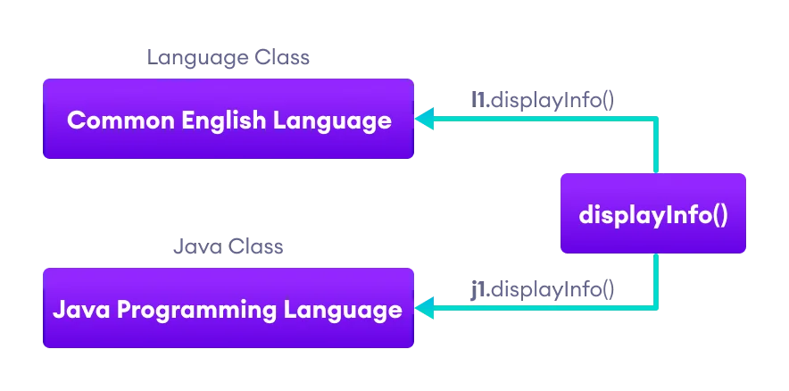

---

### Java Method Overloading

In a Java class, we can create methods with the same name if they differ in parameters. For example

``` Java linenums="1"
void func() { ... }
void func(int a) { ... }
float func(double a) { ... }
float func(int a, float b) { ... }
```

This is known as method overloading in Java. Here, the same method will perform different operations based on the parameter.

---

###  Polymorphism using method overloading example-3

``` Java linenums="1"
class Pattern {

  // method without parameter
  public void display() {
    for (int i = 0; i < 10; i++) {
      System.out.print("*");
    }
  }

  // method with single parameter
  public void display(char symbol) {
    for (int i = 0; i < 10; i++) {
      System.out.print(symbol);
    }
  }
}
```

---

###  Polymorphism using method overloading example-3

``` Java linenums="1"
class Main {
  public static void main(String[] args) {
    Pattern d1 = new Pattern();

    // call method without any argument
    d1.display();
    System.out.println("\n");

    // call method with a single argument
    d1.display('#');
  }
}
```

---

### Polymorphic Variables

- A variable is called polymorphic if it refers to different values under different conditions.
- Object variables (instance variables) represent the behavior of polymorphic variables in Java. 
- It is because object variables of a class can refer to objects of its class as well as objects of its subclasses.

---

### Polymorphic Variables Example-1

``` Java linenums="1"
class ProgrammingLanguage {
  public void display() {
    System.out.println("I am Programming Language.");
  }
}
```

---

### Polymorphic Variables Example-1

``` Java linenums="1"
class Java extends ProgrammingLanguage {
  @Override
  public void display() {
    System.out.println("I am Object-Oriented Programming Language.");
  }
}
```

---

### Polymorphic Variables Example-1

``` Java linenums="1"
class Main {
  public static void main(String[] args) {

    // declare an object variable
    ProgrammingLanguage pl;

    // create object of ProgrammingLanguage
    pl = new ProgrammingLanguage();
    pl.display();

    // create object of Java class
    pl = new Java();
    pl.display();
  }
}
```

---


### Takeaway: Java Polymorphism

- Polymorphism means 'many forms' - same interface, different implementations
- Ad hoc polymorphism: method overloading (compile-time, same class)
- Pure polymorphism: method overriding (runtime, inheritance hierarchy)
- Polymorphic variables: parent type reference can hold child type objects
- Dynamic binding: JVM resolves the actual method at runtime based on object type

---

## **Module G: Java Encapsulation and Data Hiding**

---

### Module Outline

- Conceptual Understanding of Encapsulation and Data Hiding
- Example: A Point on the Plane
- Java Encapsulation with Getters and Setters
- Why Encapsulation Matters (7 Reasons)
- Data Hiding using the Private Specifier

---

### OOP: Encapsulation and Data Hiding

- Thinking in terms of objects rather than functions 
- Close match between **objects** in the **programming** sense and  **objects in the real world** 
- Both data and the functions that operate on that data are combined into a single program entity 
- **Data** represent the **properties** (state), and **functions** represent the **behavior** of an object. Data and its functions are said to be **encapsulated** into a single entity 
- An object's functions, called member functions in Java typically provide the only way to access its data. The data is **hidden**, so it is safe from accidental alteration. 

---

### OOP: Encapsulation and Data Hiding

- **Encapsulation** and **data hiding** are key terms in the 
  description of object-oriented languages. 
- If you want to modify the data in an object, you know exactly what functions to interact with it 
  - The member functions in the object. 
  - No other functions can access the data: This simplifies writing, debugging, and maintaining the program. 

---

### Example: A Point on the plane

- A Point on a plane has two properties; x-y coordinates. 
- Abilities (behavior) of a Point are, moving on the plane, appearing on the screen and disappearing.  
- A model for 2 dimensional points with the following parts: 
  - Two integer variables `(x,y)` to represent x and y  coordinates 
  - A function to move the point: `move` 
  - A function to print the point on the screen: `print` 
  - A function to hide the point: `hide` 

---

### Example: A Point on the plane

- Once the **model** has been built and tested, it is  possible to create many **objects of this model**, in the  main program. 

``` Java linenums="1"
Point pointOne = new Point(67, 89); 
Point pointTwo = new Point(12, 34); 

public class Point { 
    public int x = 0; 
    public int y = 0; 
    public Point(int a, int b) { 
    x = a; 
    y = b; 
    } 
} 
```

---

## **Java Encapsulation**

---

### Java Encapsulation

- It prevents outer classes from accessing and changing fields and methods of a class. This also helps to achieve data hiding

---

### Java Encapsulation Example

``` Java linenums="1"
class Area {

  // fields to calculate area
  int length;
  int breadth;

  // constructor to initialize values
  Area(int length, int breadth) {
    this.length = length;
    this.breadth = breadth;
  }

  // method to calculate area
  public void getArea() {
    int area = length * breadth;
    System.out.println("Area: " + area);
  }
}
```

---

### Java Encapsulation Example

``` Java linenums="1"
class Main {
  public static void main(String[] args) {

    // create object of Area
    // pass value of length and breadth
    Area rectangle = new Area(5, 6);
    rectangle.getArea();
  }
}
```

---

### Why Encapsulation?

- In Java, encapsulation helps us to keep 
  - related 
    - fields and 
    - methods together, 
  - which makes our code cleaner and easy to read.

---

### Why Encapsulation?

- It helps to control the values of our data fields

``` Java linenums="1"
class Person {
  private int age;

  public void setAge(int age) {
    if (age >= 0) {
      this.age = age;
    }
  }
}
```

---

### Why Encapsulation?

- The getter and setter methods provide 
  - read-only or 
  - write-only 
- access to our class fields

``` Java linenums="1"
getName()  // provides read-only access
setName() // provides write-only access
```
---

### Why Encapsulation?

- It helps to decouple components of a system. 
  - For example, 
    - we can encapsulate code into multiple bundles.
- These decoupled components (bundle) 
  - can be developed, 
  - tested, and 
  - debugged independently and concurrently. 
- And, any changes in a particular component 
  - do not have any effect on other components.

---

### Why Encapsulation?

- We can also achieve data hiding using encapsulation. 
- In the next example, 
  - if we change the length and breadth variable into private, 
  - then the access to these fields is restricted.
- And, they are kept hidden from outer classes. 
  - This is called data hiding.

---

### Why Encapsulation?

``` Java linenums="1"
class Area {

  // fields to calculate area
  int length;
  int breadth;

  // constructor to initialize values
  Area(int length, int breadth) {
    this.length = length;
    this.breadth = breadth;
  }

  // method to calculate area
  public void getArea() {
    int area = length * breadth;
    System.out.println("Area: " + area);
  }
}
```

---

### Why Encapsulation?

``` Java linenums="1"
class Main {
  public static void main(String[] args) {

    // create object of Area
    // pass value of length and breadth
    Area rectangle = new Area(5, 6);
    rectangle.getArea();
  }
}
```

---

### Data Hiding

- Data hiding is a way of restricting the access of our data members by hiding the implementation details. 

- Encapsulation also provides a way for data hiding.

- We can use access modifiers to achieve data hiding

---

### Data hiding using the private specifier example

- Making `age` private allowed us to restrict unauthorized access from outside the class. This is data hiding.

---

### Data hiding using the private specifier example

``` Java linenums="1"
class Person {

  // private field
  private int age;

  // getter method
  public int getAge() {
    return age;
  }

  // setter method
  public void setAge(int age) {
    this.age = age;
  }
}
```


---

### Data hiding using the private specifier example

``` Java linenums="1"
class Main {
  public static void main(String[] args) {

    // create an object of Person
    Person p1 = new Person();

    // change age using setter
    p1.setAge(24);

    // access age using getter
    System.out.println("My age is " + p1.getAge());
  }
}
```

---


### Takeaway: Encapsulation and Data Hiding

- Encapsulation bundles data and methods that operate on that data within a class
- Data hiding: make fields private, provide public getter/setter methods
- Benefits: control over data, flexibility to change implementation, data validation
- The Point example shows how encapsulation protects x,y coordinates
- Follow the principle: private fields, public methods (getters/setters where needed)

---

## **Module H: Java final Keyword**

---

### Module Outline

- final with Variables (Constants)
- final with Methods (Prevent Overriding)
- final with Classes (Prevent Inheritance)

---

## **Java final keyword**

---

### Java final keyword

- In java, the final is a keyword and it is used with the following things.
  - With variable (to create constant)
  - With method (to avoid method overriding)
  - With class (to avoid inheritance)

---

### Java final restrictions

- the final variable cannot be reinitialized with another value
- the final method cannot be overridden
- the final class cannot be extended

---

### **final** with variables

- When a variable defined with the final keyword, 
- it becomes a constant, and 
  - it does not allow us to modify the value. 
- The variable defined with the final keyword allows only a one-time assignment, 
  - once a value assigned to it, 
    - never allows us to change it again.

---

### **final** with variables example-1

``` Java linenums="1"
public class FinalVariableExample {
	public static void main(String[] args) {
		final int a = 10;
		System.out.println("a = " + a);
		a = 100;	// Can't be modified
	}
}
```

---

### **final** with variables example-2

``` Java linenums="1"
class Main {
  public static void main(String[] args) {

    // create a final variable
    final int AGE = 32;

    // try to change the final variable
    AGE = 45;
    System.out.println("Age: " + AGE);
  }
}
```

---

### **final** with variables recommendation

- It is recommended to use uppercase to declare final variables in Java.

---

### **final** with methods

- When a method defined with the final keyword, 
  - it does not allow it to override. 
- The final method extends to the child class, 
  - but the child class can not override or re-define it. 
- It must be used as it has implemented in the parent class.

---

### **final** with methods example-1

``` Java linenums="1"
class ParentClass{
	
	int num = 10;
	
	final void showData() {
		System.out.println("Inside ParentClass showData() method");
		System.out.println("num = " + num);
	}
	
}
```

---

### **final** with methods example-1

``` Java linenums="1"
class ChildClass extends ParentClass{
	
	void showData() {
		System.out.println("Inside ChildClass showData() method");
		System.out.println("num = " + num);
	}
}
```

---

### **final** with methods example-1

``` Java linenums="1"
public class FinalKeywordExample {

	public static void main(String[] args) {
		
		ChildClass obj = new ChildClass();
		obj.showData();
		
	}
}
``` 

---

### **final** with methods example-2

``` Java linenums="1"
class FinalDemo {
    // create a final method
    public final void display() {
      System.out.println("This is a final method.");
    }
}

class Main extends FinalDemo {
  // try to override final method
  public final void display() {
    System.out.println("The final method is overridden.");
  }

  public static void main(String[] args) {
    Main obj = new Main();
    obj.display();
  }
}
``` 

---

### **final** with class

- When a class defined with final keyword, it can not be extended by any other class.

---

### **final** with class example-1

``` Java linenums="1"
final class ParentClass{
	
	int num = 10;
	
	void showData() {
		System.out.println("Inside ParentClass showData() method");
		System.out.println("num = " + num);
	}
	
}
```

---

### **final** with class example-1

``` Java linenums="1"
class ChildClass extends ParentClass{
	
	
}
```

---

### **final** with class example-1

``` Java linenums="1"
public class FinalKeywordExample {

	public static void main(String[] args) {
		
		ChildClass obj = new ChildClass();
		
	}
}
```

---

### **final** with class example-2

``` Java linenums="1"
// create a final class
final class FinalClass {
  public void display() {
    System.out.println("This is a final method.");
  }
}

// try to extend the final class
class Main extends FinalClass {
  public  void display() {
    System.out.println("The final method is overridden.");
  }

  public static void main(String[] args) {
    Main obj = new Main();
    obj.display();
  }
}
```

---


### Takeaway: Java final Keyword

- final variable: value cannot be changed once assigned (constant)
- final method: cannot be overridden by subclasses
- final class: cannot be extended (no subclasses allowed)
- Best practice: use final for constants (static final), utility classes, security-sensitive methods
- String class in Java is final - it cannot be subclassed

---

## **Module I: Java Abstract Classes**

---

### Module Outline

- Conceptual Understanding of Abstract Classes and Methods
- Defining Abstract Classes and Methods in Java
- Abstract Class Examples (3 detailed examples)
- Constructors of Abstract Classes
- Rules for Method Overriding in Abstract Classes
- Abstract Class and Method Review

---

### Abstract Classes and Methods

- **An operation should be declared to exist at the highest class in the hierarchy where it makes sense**
  - The *operation* may be *abstract* (lacking implementation) at that level
  - If so, the class also *must* be abstract
    - No instances can be created
    - The opposite of an abstract class is a *concrete* class
  - If a superclass has an abstract operation then its subclasses at some level must have a concrete method for the operation
    - Leaf classes must have or inherit concrete methods for all operations
    - Leaf classes must be concrete

---

## **Java Abstract Class**


---

### Java Abstract Class

- An abstract class is a class that created using abstract keyword. In other words, a class prefixed with abstract keyword is known as an abstract class.

- In java, an abstract class may contain abstract methods (methods without implementation) and also non-abstract methods (methods with implementation).

- We use the following syntax to create an abstract class.

``` Java linenums="1"
abstract class <ClassName>{
    ...
}
```

---

### Java Abstract Class Example-1

``` Java linenums="1"
import java.util.*;

abstract class Shape {
	int length, breadth, radius;
	Scanner input = new Scanner(System.in);

	abstract void printArea();

}
```

---

### Java Abstract Class Example-1

``` Java linenums="1"
class Rectangle extends Shape {
	void printArea() {
		System.out.println("*** Finding the Area of Rectangle ***");
		System.out.print("Enter length and breadth: ");
		length = input.nextInt();
		breadth = input.nextInt();
		System.out.println("The area of Rectangle is: " + length * breadth);
	}
}
```

---

### Java Abstract Class Example-1

``` Java linenums="1"
class Triangle extends Shape {
	void printArea() {
		System.out.println("\n*** Finding the Area of Triangle ***");
		System.out.print("Enter Base And Height: ");
		length = input.nextInt();
		breadth = input.nextInt();
		System.out.println("The area of Triangle is: " + (length * breadth) / 2);
	}
}
```

---

### Java Abstract Class Example-1

``` Java linenums="1"
class Cricle extends Shape {
	void printArea() {
		System.out.println("\n*** Finding the Area of Cricle ***");
		System.out.print("Enter Radius: ");
		radius = input.nextInt();
		System.out.println("The area of Cricle is: " + 3.14f * radius * radius);
	}
}
```

---

### Java Abstract Class Example-1

``` Java linenums="1"
public class AbstractClassExample {
	public static void main(String[] args) {
		Rectangle rec = new Rectangle();
		rec.printArea();

		Triangle tri = new Triangle();
		tri.printArea();
		
		Cricle cri = new Cricle();
		cri.printArea();
	}
}
```

---

### Java Abstract Class Example-1

- An abstract class can not be instantiated but can be referenced. 
  - That means we can not create an object of an abstract class, 
  - but base reference can be created.

---

### Java Abstract Class Example-1

- In the example program, the child class objects are created to invoke the overridden abstract method. 
- But we may also create base class reference and assign it with child class instance to invoke the same. 
- The main method of the above program can be written as follows that produce the same output.

---

### Java Abstract Class Example-1

``` Java linenums="1"
public static void main(String[] args) {
		Shape obj = new Rectangle();  //Base class reference to Child class instance
		obj.printArea();

		obj = new Triangle();
		obj.printArea();
		
		obj = new Cricle();
		obj.printArea();
	}
```

---

### Java Abstract Class Example-2

``` Java linenums="1"
abstract class Animal {
  abstract void makeSound();

  public void eat() {
    System.out.println("I can eat.");
  }
}
```

---

### Java Abstract Class Example-2

``` Java linenums="1"
class Dog extends Animal {

  // provide implementation of abstract method
  public void makeSound() {
    System.out.println("Bark bark");
  }
}
```

---

### Java Abstract Class Example-2

``` Java linenums="1"
class Main {
  public static void main(String[] args) {

    // create an object of Dog class
    Dog d1 = new Dog();

    d1.makeSound();
    d1.eat();
  }
}
```

---

### Java Abstract Class Example-3

``` Java linenums="1"
abstract class MotorBike {
  abstract void brake();
}
```

---

### Java Abstract Class Example-3

``` Java linenums="1"
class SportsBike extends MotorBike {
    
  // implementation of abstract method
  public void brake() {
    System.out.println("SportsBike Brake");
  }
}
```

---

### Java Abstract Class Example-3

``` Java linenums="1"
class MountainBike extends MotorBike {
    
  // implementation of abstract method
  public void brake() {
    System.out.println("MountainBike Brake");
  }
}
```

---

### Java Abstract Class Example-3

``` Java linenums="1"
class Main {
  public static void main(String[] args) {
    MountainBike m1 = new MountainBike();
    m1.brake();
    SportsBike s1 = new SportsBike();
    s1.brake();
  }
}
```

---

### Accesses Constructor of Abstract Classes

- An abstract class can have constructors like the regular class. And, we can access the constructor of an abstract class from the subclass using the super keyword. For example,

``` Java linenums="1"
abstract class Animal {
   Animal() {
      ….
   }
}

class Dog extends Animal {
   Dog() {
      super();
      ...
   }
}
```

---

### Accesses Constructor of Abstract Classes

- **Note that the `super` should always be the first statement of the subclass constructor**

---

### Java Abstract Class 

#### Rules for method overriding

An abstract class must follow the below list of rules.

- An abstract class must be created with abstract keyword.
- An abstract class can be created without any abstract method.
- An abstract class may contain abstract methods and non-abstract methods.
- An abstract class may contain final methods that can not be overridden.

---

### Java Abstract Class 

#### Rules for method overriding

- An abstract class may contain static methods, but the abstract method can not be static.
- An abstract class may have a constructor that gets executed when the child class object created.
- An abstract method must be overridden by the child class, otherwise, it must be defined as an abstract class.
- An abstract class can not be instantiated but can be referenced.

---

## **Java Abstract Class Review**

---

### Java Abstract Class Review

The abstract class in Java cannot be instantiated (we cannot create objects of abstract classes). We use the abstract keyword to declare an abstract class. For example,

``` Java linenums="1"
// create an abstract class
abstract class Language {
  // fields and methods
}
...

// try to create an object Language
// throws an error
Language obj = new Language(); 
```

---

### Java Abstract Class Review

- An abstract class can have both the regular methods and abstract methods. For example,

``` Java linenums="1"
abstract class Language {

  // abstract method
  abstract void method1();

  // regular method
  void method2() {
    System.out.println("This is regular method");
  }
}
```

---

<style scoped>section{ font-size: 25px; }</style>

### Java Abstract Method Review

- A method that doesn't have its body is known as an abstract method. We use the same abstract keyword to create abstract methods. For example,

``` Java linenums="1"
abstract void display();
``` 

Here, display() is an abstract method. The body of display() is replaced by ;.

If a class contains an abstract method, then the class should be declared abstract. Otherwise, it will generate an error. For example,

``` Java linenums="1"
// error
// class should be abstract
class Language {

  // abstract method
  abstract void method1();
}
```

---

### Java Abstract Class and Method Example

- Though abstract classes cannot be instantiated, we can create subclasses from it. We can then access members of the abstract class using the object of the subclass.

---

### Java Abstract Class and Method Example

``` Java linenums="1"
abstract class Language {

  // method of abstract class
  public void display() {
    System.out.println("This is Java Programming");
  }
}

class Main extends Language {

  public static void main(String[] args) {
    
    // create an object of Main
    Main obj = new Main();

    // access method of abstract class
    // using object of Main class
    obj.display();
  }
}
```

---

### Java Abstract Class and Method Example

- In the  example, we have created an abstract class named Language. The class contains a regular method display().
- We have created the Main class that inherits the abstract class. Notice the statement,
``` Java linenums="1"
obj.display();
```
- Here, obj is the object of the child class Main. We are calling the method of the abstract class using the object obj.

---

<style scoped>section{ font-size: 25px; }</style>

### Java Abstract Method Review Keypoints 

- We use the abstract keyword to create abstract classes and methods.
- An abstract method doesn't have any implementation (method body).
- A class containing abstract methods should also be abstract.
- We cannot create objects of an abstract class.
- To implement features of an abstract class, we inherit subclasses from it and create objects of the subclass.
- A subclass must override all abstract methods of an abstract class. However, if the subclass is declared abstract, it's not mandatory to override abstract methods.
- We can access the static attributes and methods of an abstract class using the reference of the abstract class. For example,
``` Java linenums="1"
Animal.staticMethod();
```

---


### Takeaway: Java Abstract Classes

- Abstract class: cannot be instantiated, serves as a template for subclasses
- Abstract method: declared without body, MUST be overridden by concrete subclasses
- A class with at least one abstract method must be declared abstract
- Abstract classes CAN have constructors, concrete methods, and fields
- Use abstract classes when closely related classes share code and behavior

---

## **Module J: Java Object Class and Forms of Inheritance**

---

### Module Outline

- The java.lang.Object Class
- Methods of Object: toString, equals, hashCode, clone, getClass, finalize
- Six Forms of Inheritance
- Benefits and Costs of Inheritance

---

## **Java Object Class** 

---

### Java Object Class

- In java, the Object class is the super most class of any class hierarchy. 
  - The Object class in the java programming language is present inside the java.lang package.
- Every class in the java programming language is a subclass of Object class by default.
- The Object class is useful when you want to refer to any object whose type you don't know. 
  - Because it is the superclass of all other classes in java, 
    - it can refer to any type of object.

---

### Methods of Object class

- object **getClass()**	
  - Returns Class class object	
- int **hashCode()**	
  - returns the hashcode number for object being used.

- boolean **equals(Object obj)**	
  - compares the argument object to calling object.
- int **clone()**	
  - Compares two strings, ignoring case

---

### Methods of Object class

- object **concat(String)**
  - Creates copy of invoking object	
- String **toString()**	
  - Returns the string representation of invoking object.
- void **notify()**
  - Wakes up a thread, waiting on invoking object's monitor.
- void **notifyAll()**	
  - wakes up all the threads, waiting on invoking object's - monitor.	

---

### Methods of Object class

- void **wait()**
  - causes the current thread to wait, until another thread - notifies

- void **wait(long,int)**
  - causes the current thread to wait for the specified - milliseconds and nanoseconds, until another thread notifies.	
- void **finalize()**
  - It is invoked by the garbage collector before an object is being garbage collected.	

---

### Java Forms of Inheritance

- The inheritance concept used for the number of purposes in the java programming language. 
- One of the main purposes is substitutability. 
  - The substitutability means that when a child class acquires properties from its parent class, the object of the parent class may be substituted with the child class object. 
  - For example, if B is a child class of A, anywhere we expect an instance of A we can use an instance of B.

- The substitutability can achieve using inheritance, whether using extends or implements keywords.

---

### Java Forms of Inheritance

- The following are the different forms of inheritance in java.
- Specialization
- Specification
- Construction
- Extension
- Limitation
- Combination

---

### Java Forms of Inheritance

#### Specialization
It is the most ideal form of inheritance. The subclass is a special case of the parent class. It holds the principle of substitutability.

---

### Java Forms of Inheritance

#### Specification
This is another commonly used form of inheritance. In this form of inheritance, the parent class just specifies which methods should be available to the child class but doesn't implement them. The java provides concepts like abstract and interfaces to support this form of inheritance. It holds the principle of substitutability.

---

### Java Forms of Inheritance

#### Construction
This is another form of inheritance where the child class may change the behavior defined by the parent class (overriding). It does not hold the principle of substitutability.

---

### Java Forms of Inheritance

#### Extension
This is another form of inheritance where the child class may add its new properties. It holds the principle of substitutability.

---

### Java Forms of Inheritance

#### Limitation
This is another form of inheritance where the subclass restricts the inherited behavior. It does not hold the principle of substitutability.

---

### Java Forms of Inheritance

#### Combination
This is another form of inheritance where the subclass inherits properties from multiple parent classes. Java does not support multiple inheritance type.

---

###  Benefits and Costs of Inheritance in java

- Inheritance is the core and more useful concept of Object-Oriented Programming. 
- It proWith inheritance, we will be able to override the methods of the base class so that the meaningful implementation of the base class method can be designed in the derived class. 
- An inheritance leads to less development and maintenance costs. Vides many benefits, and a few of them are listed below.

---

#### Benefits of Inheritance

- Inheritance helps in code reuse. The child class may use the code defined in the parent class without re-writing it.
- Inheritance can save time and effort as the main code need not be written again.
- Inheritance provides a clear model structure which is easy to understand.
- An inheritance leads to less development and maintenance costs.
- With inheritance, we will be able to override the methods of the base class so that the meaningful implementation of the base class method can be designed in the derived class. An inheritance leads to less development and maintenance costs.
- In inheritance base class can decide to keep some data private so that it cannot be altered by the derived class.

---

#### Costs of Inheritance

- Inheritance decreases the execution speed due to the increased time and effort it takes, the program to jump through all the levels of overloaded classes.
- Inheritance makes the two classes (base and inherited class) get tightly coupled. This means one cannot be used independently of each other.
- The changes made in the parent class will affect the behavior of child class too.
- The overuse of inheritance makes the program more complex.

---


### Takeaway: Object Class and Forms of Inheritance

- Every class in Java implicitly extends java.lang.Object
- Key Object methods: toString(), equals(), hashCode(), clone(), getClass(), finalize()
- Six forms of inheritance: Specialization, Specification, Construction, Extension, Limitation, Combination
- Benefits: code reuse, polymorphism, logical organization
- Costs: tight coupling, fragile base class problem, increased complexity

---

## References

- [BtechSmartClass-super Keyword](http://www.btechsmartclass.com/java/java-super-keyword.html)
- [Programiz-super Keyword](https://www.programiz.com/java-programming/super-keyword)
- [BtechSmartClass-Java final Keyword](http://www.btechsmartclass.com/java/java-final-keyword.html)
- [Programiz-final Keyword](https://www.programiz.com/java-programming/final-keyword)
- [BtechSmartClass-java Polymorphism](http://www.btechsmartclass.com/java/java-polymorphism.html)
- [Programiz-Polymorphism](https://www.programiz.com/java-programming/polymorphism)
- [Programiz-Encapsulation](https://www.programiz.com/java-programming/encapsulation)
- [BtechSmartClass-Java Method Overriding](http://www.btechsmartclass.com/java/java-method-overriding.html)


---

## References

- [Programiz-Method Overriding](https://www.programiz.com/java-programming/method-overriding)
- [Programiz-Nested Inner Class](https://www.programiz.com/java-programming/nested-inner-class)
- [Programiz-Static Class](https://www.programiz.com/java-programming/static-class)
- [Programiz-Anonymous Class](https://www.programiz.com/java-programming/anonymous-class)
- [Programiz-enums](https://www.programiz.com/java-programming/enums)
- [Programiz-enum constructor](https://www.programiz.com/java-programming/enum-constructor)
- [Programiz-enum string](https://www.programiz.com/java-programming/enum-string)
- [BtechSmartClass-Java Abstract Class](http://www.btechsmartclass.com/java/java-abstract-class.html)
- [Programiz-Abstract Classes Methods](https://www.programiz.com/java-programming/abstract-classes-methods)

---

## References

- [BtechSmartClass-Java Object class](http://www.btechsmartclass.com/java/java-Object-class.html)
- [BtechSmartClass-Java Forms of Inheritance](http://www.btechsmartclass.com/java/java-forms-of-inheritance.html)
- [Programiz-Interfaces](https://www.programiz.com/java-programming/interfaces)
- [BtechSmartClass-Java Benefits and Costs of Inheritance](http://www.btechsmartclass.com/java/java-benefits-and-costs-of-inheritance.html)
- [BtechSmartClass-Java Defining Packages](http://www.btechsmartclass.com/java/java-defining-packages.html)
- [BtechSmartClass-Java Access Protection in Packages](http://www.btechsmartclass.com/java/java-access-protection-in-packages.html)
- [BtechSmartClass-Java Importing Packages](http://www.btechsmartclass.com/java/java-importing-packages.html)

---

$End-Of-Week-2-Module$