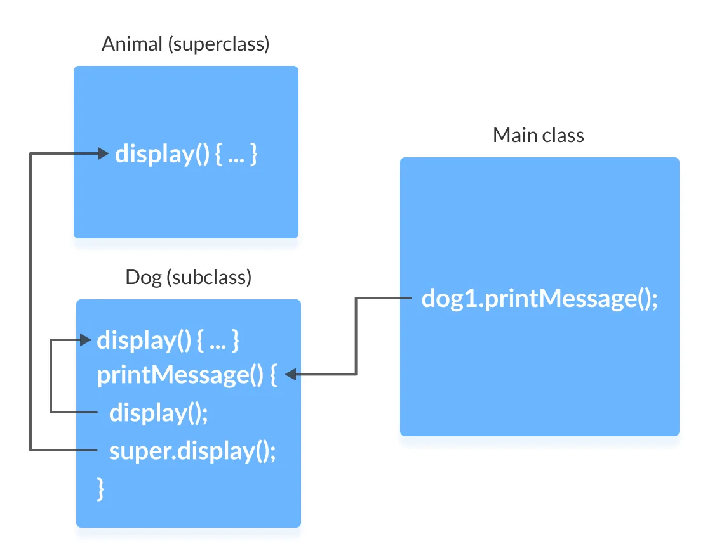
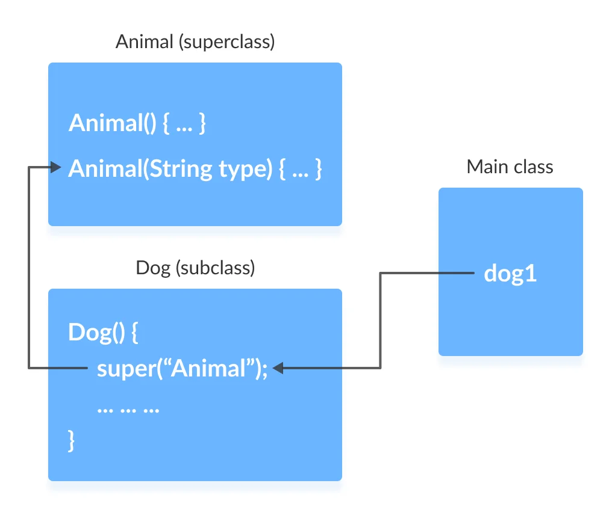
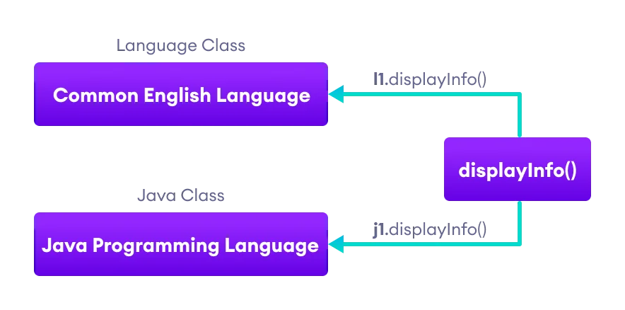
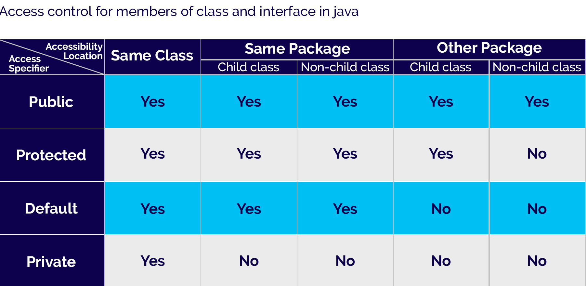

<!-- _backgroundColor: aquq -->

<!-- _color: orange -->

<!-- paginate: false -->

## CE204 Object-Oriented Programming

## Week-2 (OOP with Java-II)

#### Spring Semester, 2021-2022

Download [DOC](ce204-week-2.md_doc.pdf), [SLIDE](ce204-week-2.md_slide.pdf), [PPTX](ce204-week-2.md_slide.pptx)

<iframe width=700, height=500 frameBorder=0 src="../ce204-week-2.md_slide.html"></iframe>

---

<!-- paginate: true -->

## **OOP with Java-II**

--- 

## Outline (1)

 - Java super Keyword
 - Java final Keyword
 - Java Polymorphism / Encapsulation
 - Java Method Overriding
 - Java Nested Inner Class
 - Java Static Class
 - Java Anonymous Class

--- 

## Outline (2)

 - Java Enums / Enum-Constructor / Enum-String
 - Java Abstract Class
 - Java Object Class
 - Java Forms of Inheritance
 - Java Benefits and Costs of Inheritance
 - Java Packages
 - Java Access Protection in Packages

--- 

## **Java super keyword**

---

## Java super keyword

- In java, `super` is a keyword used to refers to the **parent class object**. 
- The `super` keyword came into existence to solve the *naming conflicts* in the inheritance. 
- When both parent class and child class have members with the same name, 
  - then the super keyword is used to refer to the parent class version.

---

## Java super keyword

- In another word, The super keyword in Java is used in subclasses to access superclass members (attributes, constructors and methods).

---

## Java super keyword

- In java, the super keyword is used for the following purposes.
  - To refer parent class **data members**
  - To refer parent class **methods**
  - To call parent class **constructor**

---

## Java super keyword

- To call methods of the superclass that is overridden in the subclass.
- To access attributes (fields) of the superclass if both superclass and subclass have attributes with the same name.
- To explicitly call superclass no-arg (default) or parameterized constructor from the subclass constructor.

---

## Java super keyword

- The super keyword is used inside the child class only.

---

## super to refer parent class **data members**

- When both parent class and child class have data members with the same name, 
  - then the super keyword is used to refer to the parent class data member from child class.

---

## super to refer parent class **data members**

``` Java linenums="1"
class ParentClass{
	
	int num = 10;
	
}
```

``` Java linenums="1"
class ChildClass extends ParentClass{
	
	int num = 20;
	
	void showData() {
		System.out.println("Inside the ChildClass");
		System.out.println("ChildClass num = " + num);
		System.out.println("ParentClass num = " + super.num);		
	}
}
```

---

## super to refer parent class **data members**

``` Java linenums="1"
public class SuperKeywordExample {

	public static void main(String[] args) {
		ChildClass obj = new ChildClass();
		
		obj.showData();
		
		System.out.println("\nInside the non-child class");
		System.out.println("ChildClass num = " + obj.num);
		//System.out.println("ParentClass num = " + super.num); //super can't be used here
	}
}
```

---

## super to refer parent class **method**

- When both parent class and child class have method with the same name, 
  - then the super keyword is used to refer to the parent class method from child class.

---

## super to refer parent class **method**

```Java
class ParentClass{
	
	int num1 = 10;
	
	void showData() {
		System.out.println("\nInside the ParentClass showData method");
		System.out.println("ChildClass num = " + num1);		
	}	
}
```

---

## super to refer parent class **method**

```Java
class ChildClass extends ParentClass{
	
	int num2 = 20;
	
	void showData() {
		System.out.println("\nInside the ChildClass showData method");
		System.out.println("ChildClass num = " + num2);	

		super.showData();
		
	}
}
```

---

## super to refer parent class **method**

```Java
public class SuperKeywordExample {

	public static void main(String[] args) {
		ChildClass obj = new ChildClass();
		
		obj.showData();
		//super.showData();	// super can't be used here
		
	}
}
```

--- 

## super to call parent class **constructor**

- When an object of child class is created, it automatically calls the parent class default-constructor before it's own. 
- But, the parameterized constructor of parent class must be called explicitly using the super keyword inside the child class constructor.

--- 

## super to call parent class **constructor**

``` Java linenums="1"
class ParentClass{
	
	int num1;
	
	ParentClass(){
		System.out.println("\nInside the ParentClass default constructor");
		num1 = 10;
	}
	
	ParentClass(int value){
		System.out.println("\nInside the ParentClass parameterized constructor");
		num1 = value;
	}	
}
```

--- 

## super to call parent class **constructor**

``` Java linenums="1"
class ChildClass extends ParentClass{
	
	int num2;
	
	ChildClass(){
		super(100);
		System.out.println("\nInside the ChildClass constructor");
		num2 = 200;		
	}
}
```

--- 

## super to call parent class **constructor**

``` Java linenums="1"
public class SuperKeywordExample {

	public static void main(String[] args) {
		
		ChildClass obj = new ChildClass();
		
	}
}
```

--- 

## super to call parent class **constructor**

- To call the parameterized constructor of the parent class, 
- the super keyword must be the first statement inside the child class constructor, 
- and we must pass the parameter values.

---

## Access Overridden Methods of the superclass

- If methods with the same name are defined in both superclass and subclass, the method in the subclass overrides the method in the superclass. This is called method overriding.

---

## Example 1: Method overriding

``` Java linenums="1"
class Animal {

  // overridden method
  public void display(){
    System.out.println("I am an animal");
  }
}
```

---

## Example 1: Method overriding

``` Java linenums="1"
class Dog extends Animal {

  // overriding method
  @Override
  public void display(){
    System.out.println("I am a dog");
  }

  public void printMessage(){
    display();
  }
}
```

---

## Example 1: Method overriding

``` Java linenums="1"
class Main {
  public static void main(String[] args) {
    Dog dog1 = new Dog();
    dog1.printMessage();
  }
}

```

---

## Example 1: Method overriding

In this example, by making an object dog1 of Dog class, we can call its method printMessage() which then executes the display() statement.

Since display() is defined in both the classes, the method of subclass Dog overrides the method of superclass Animal. Hence, the display() of the subclass is called.

---

## Example 1: Method overriding


---

## What if the overridden method of the superclass has to be called?
- We use super.display() if the overridden method display() of superclass Animal needs to be called.

---

## Example 2: super to Call Superclass Method

``` Java linenums="1"
class Animal {

  // overridden method
  public void display(){
    System.out.println("I am an animal");
  }
}
```

---

## Example 2: super to Call Superclass Method

``` Java linenums="1"
class Dog extends Animal {

  // overriding method
  @Override
  public void display(){
    System.out.println("I am a dog");
  }

  public void printMessage(){

    // this calls overriding method
    display();

    // this calls overridden method
    super.display();
  }
}
```
---

## Example 2: super to Call Superclass Method

``` Java linenums="1"
class Main {
  public static void main(String[] args) {
    Dog dog1 = new Dog();
    dog1.printMessage();
  }
}
```
---

## Example 2: super to Call Superclass Method



---

## Access Attributes of the Superclass

- The superclass and subclass can have attributes with the same name. 
  - We use the super keyword to access the attribute of the superclass.

---

## Example 3: Access superclass attribute

``` Java linenums="1"
class Animal {
  protected String type="animal";
}
```

``` Java linenums="1"
class Dog extends Animal {
  public String type="mammal";

  public void printType() {
    System.out.println("I am a " + type);
    System.out.println("I am an " + super.type);
  }
}
```

---

## Example 3: Access superclass attribute

``` Java linenums="1"
class Main {
  public static void main(String[] args) {
    Dog dog1 = new Dog();
    dog1.printType();
  }
}

```

---

## Example 3: Access superclass attribute

- In this example, we have defined the same instance field `type` in both the superclass `Animal` and the subclass `Dog`.
- We then created an object `dog1` of the Dog class. Then, the `printType()` method is called using this object.
  - Inside the `printType()` function,
    - `type` refers to the attribute of the subclass `Dog`.
    - `super.type` refers to the attribute of the superclass Animal.

---

## Use of super() to access superclass constructor

- As we know, when an object of a class is created, its default constructor is automatically called.
- To explicitly call the superclass constructor from the subclass constructor, we use `super()`. It's a special form of the super keyword.
- `super()` can be used only inside the subclass constructor and must be the first statement.

---

## Example 4: Use of super()

``` Java linenums="1"
class Animal {

  // default or no-arg constructor of class Animal
  Animal() {
    System.out.println("I am an animal");
  }
}
```

---

## Example 4: Use of super()

``` Java linenums="1"
class Dog extends Animal {

  // default or no-arg constructor of class Dog
  Dog() {

    // calling default constructor of the superclass
    super();

    System.out.println("I am a dog");
  }
}
```

---

## Example 4: Use of super()

``` Java linenums="1"
class Main {
  public static void main(String[] args) {
    Dog dog1 = new Dog();
  }
}
```

---

## Example 4: Use of super()

- when an object dog1 of Dog class is created, it automatically calls the default or no-arg constructor of that class.

- Inside the subclass constructor, the super() statement calls the constructor of the superclass and executes the statements inside it. Hence, we get the output I am an animal.

---

## Example 4: Use of super()

-example.png)

The flow of the program then returns back to the subclass constructor and executes the remaining statements. Thus, I am a dog will be printed.

However, using super() is not compulsory. Even if super() is not used in the subclass constructor, the compiler implicitly calls the default constructor of the superclass.

---

## Example 4: Use of super()

- **So, why use redundant code if the compiler automatically invokes super()?**
  -  It is required if the parameterized constructor (a constructor that takes arguments) of the superclass has to be called from the subclass constructor.

- The parameterized super() must always be the first statement
  - in the body of the constructor of the subclass, 
  - otherwise, we get a compilation error.

---

## Example 5: Call Parameterized Constructor Using super()

``` Java linenums="1"
class Animal {

  // default or no-arg constructor
  Animal() {
    System.out.println("I am an animal");
  }

  // parameterized constructor
  Animal(String type) {
    System.out.println("Type: "+type);
  }
}
```

---

## Example 5: Call Parameterized Constructor Using super()

``` Java linenums="1"
class Dog extends Animal {

  // default constructor
  Dog() {

    // calling parameterized constructor of the superclass
    super("Animal");

    System.out.println("I am a dog");
  }
}
```

---

## Example 5: Call Parameterized Constructor Using super()

``` Java linenums="1"
class Main {
  public static void main(String[] args) {
    Dog dog1 = new Dog();
  }
}
```

---

## Example 5: Call Parameterized Constructor Using super()

If a parameterized constructor has to be called, we need to explicitly define it in the subclass constructor.



---

## Example 5: Call Parameterized Constructor Using super()

Note that in the above example, we explicitly called the parameterized constructor super("Animal"). The compiler does not call the default constructor of the superclass in this case.

---

## **Java final keyword**

---

## Java final keyword

- In java, the final is a keyword and it is used with the following things.
  - With variable (to create constant)
  - With method (to avoid method overriding)
  - With class (to avoid inheritance)

---

## Java final restrictions

- the final variable cannot be reinitialized with another value
- the final method cannot be overridden
- the final class cannot be extended

---

## **final** with variables

- When a variable defined with the final keyword, 
- it becomes a constant, and 
  - it does not allow us to modify the value. 
- The variable defined with the final keyword allows only a one-time assignment, 
  - once a value assigned to it, 
    - never allows us to change it again.

---

## **final** with variables example-1

``` Java linenums="1"
public class FinalVariableExample {
	public static void main(String[] args) {
		final int a = 10;
		System.out.println("a = " + a);
		a = 100;	// Can't be modified
	}
}
```

---

## **final** with variables example-2

``` Java linenums="1"
class Main {
  public static void main(String[] args) {

    // create a final variable
    final int AGE = 32;

    // try to change the final variable
    AGE = 45;
    System.out.println("Age: " + AGE);
  }
}
```

---

## **final** with variables recommendation

- It is recommended to use uppercase to declare final variables in Java.

---

## **final** with methods

- When a method defined with the final keyword, 
  - it does not allow it to override. 
- The final method extends to the child class, 
  - but the child class can not override or re-define it. 
- It must be used as it has implemented in the parent class.

---

## **final** with methods example-1

``` Java linenums="1"
class ParentClass{
	
	int num = 10;
	
	final void showData() {
		System.out.println("Inside ParentClass showData() method");
		System.out.println("num = " + num);
	}
	
}
```

---

## **final** with methods example-1

``` Java linenums="1"
class ChildClass extends ParentClass{
	
	void showData() {
		System.out.println("Inside ChildClass showData() method");
		System.out.println("num = " + num);
	}
}
```

---

## **final** with methods example-1

``` Java linenums="1"
public class FinalKeywordExample {

	public static void main(String[] args) {
		
		ChildClass obj = new ChildClass();
		obj.showData();
		
	}
}
``` 

---

## **final** with methods example-2

``` Java linenums="1"
class FinalDemo {
    // create a final method
    public final void display() {
      System.out.println("This is a final method.");
    }
}

class Main extends FinalDemo {
  // try to override final method
  public final void display() {
    System.out.println("The final method is overridden.");
  }

  public static void main(String[] args) {
    Main obj = new Main();
    obj.display();
  }
}
``` 

---

## **final** with class

- When a class defined with final keyword, it can not be extended by any other class.

---

## **final** with class example-1

``` Java linenums="1"
final class ParentClass{
	
	int num = 10;
	
	void showData() {
		System.out.println("Inside ParentClass showData() method");
		System.out.println("num = " + num);
	}
	
}
```

---

## **final** with class example-1

``` Java linenums="1"
class ChildClass extends ParentClass{
	
	
}
```

---

## **final** with class example-1

``` Java linenums="1"
public class FinalKeywordExample {

	public static void main(String[] args) {
		
		ChildClass obj = new ChildClass();
		
	}
}
```

---

## **final** with class example-2

``` Java linenums="1"
// create a final class
final class FinalClass {
  public void display() {
    System.out.println("This is a final method.");
  }
}

// try to extend the final class
class Main extends FinalClass {
  public  void display() {
    System.out.println("The final method is overridden.");
  }

  public static void main(String[] args) {
    Main obj = new Main();
    obj.display();
  }
}
```

---

## **Java Polymorphism**

---

## Java Polymorphism

- The polymorphism is the process of defining same method with different implementation. That means creating multiple methods with different behaviors.
- In java, polymorphism implemented using 
  - method overloading and 
  - method overriding.

---

## Ad hoc polymorphism

- The ad hoc polymorphism is a technique used to define 
  - the same method with different implementations and 
  - different arguments. 
- In a java programming language, ad hoc polymorphism carried out with 
  - a method overloading concept.

---

## Ad hoc polymorphism

- In ad hoc polymorphism the method binding happens at the time of compilation. 
- Ad hoc polymorphism is also known as compile-time polymorphism. 
- Every function call binded with the respective overloaded method based on the arguments.

---

## Ad hoc polymorphism

- The ad hoc polymorphism implemented within the class only.

---

## Ad hoc polymorphism example-1

``` Java linenums="1"
import java.util.Arrays;

public class AdHocPolymorphismExample {
	
	void sorting(int[] list) {
		Arrays.parallelSort(list);
		System.out.println("Integers after sort: " + Arrays.toString(list) );
	}
	void sorting(String[] names) {
		Arrays.parallelSort(names);
		System.out.println("Names after sort: " + Arrays.toString(names) );		
	}
...

```

---

## Ad hoc polymorphism example-1

``` Java linenums="1"
...
	public static void main(String[] args) {

		AdHocPolymorphismExample obj = new AdHocPolymorphismExample();
		int list[] = {2, 3, 1, 5, 4};
		obj.sorting(list);	// Calling with integer array
		
		String[] names = {"rama", "raja", "shyam", "seeta"};
		obj.sorting(names);	// Calling with String array
	}
}
```

---

## Pure polymorphism

- The pure polymorphism is a technique used to define the same method with the same arguments but different implementations. 
- In a java programming language, pure polymorphism carried out with 
  - a method overriding concept.

---

## Pure polymorphism

- In pure polymorphism, the method binding happens at run time. 
  - Pure polymorphism is also known as run-time polymorphism. 
  - Every function call binding with the respective overridden method based on the object reference.

- When a child class has a definition for a member function of the parent class, 
  - the parent class function is said to be overridden.

---

## Pure polymorphism

- The pure polymorphism implemented in the inheritance concept only.

---

## Pure polymorphism example-1

``` Java linenums="1"
class ParentClass{
	
	int num = 10;
	
	void showData() {
		System.out.println("Inside ParentClass showData() method");
		System.out.println("num = " + num);
	}
	
}
```

---

## Pure polymorphism example-1

``` Java linenums="1"
class ChildClass extends ParentClass{
	
	void showData() {
		System.out.println("Inside ChildClass showData() method");
		System.out.println("num = " + num);
	}
}
```

---

## Pure polymorphism example-1

``` Java linenums="1"
public class PurePolymorphism {

	public static void main(String[] args) {
		
		ParentClass obj = new ParentClass();
		obj.showData();
		
		obj = new ChildClass();
		obj.showData();
		
	}
}
```

---

## Java Method Overriding

- During inheritance in Java, if the same method is present in both the superclass and the subclass. 
  - Then, the method in the subclass overrides the same method in the superclass. This is called method overriding.

--- 

## Polymorphism using method overriding example-2

``` Java linenums="1"
class Language {
  public void displayInfo() {
    System.out.println("Common English Language");
  }
}

class Java extends Language {
  @Override
  public void displayInfo() {
    System.out.println("Java Programming Language");
  }
}
```
--- 

## Polymorphism using method overriding example-2

``` Java linenums="1"
class Main {
  public static void main(String[] args) {

    // create an object of Java class
    Java j1 = new Java();
    j1.displayInfo();

    // create an object of Language class
    Language l1 = new Language();
    l1.displayInfo();
  }
}
```

---

## Polymorphism using method overriding example-2



---

## Java Method Overloading

In a Java class, we can create methods with the same name if they differ in parameters. For example

``` Java linenums="1"
void func() { ... }
void func(int a) { ... }
float func(double a) { ... }
float func(int a, float b) { ... }
```

This is known as method overloading in Java. Here, the same method will perform different operations based on the parameter.

---

##  Polymorphism using method overloading example-3

``` Java linenums="1"
class Pattern {

  // method without parameter
  public void display() {
    for (int i = 0; i < 10; i++) {
      System.out.print("*");
    }
  }

  // method with single parameter
  public void display(char symbol) {
    for (int i = 0; i < 10; i++) {
      System.out.print(symbol);
    }
  }
}
```

---

##  Polymorphism using method overloading example-3

``` Java linenums="1"
class Main {
  public static void main(String[] args) {
    Pattern d1 = new Pattern();

    // call method without any argument
    d1.display();
    System.out.println("\n");

    // call method with a single argument
    d1.display('#');
  }
}
```

---

## Polymorphic Variables

- A variable is called polymorphic if it refers to different values under different conditions.
- Object variables (instance variables) represent the behavior of polymorphic variables in Java. 
- It is because object variables of a class can refer to objects of its class as well as objects of its subclasses.

---

## Polymorphic Variables Example-1

``` Java linenums="1"
class ProgrammingLanguage {
  public void display() {
    System.out.println("I am Programming Language.");
  }
}
```

---

## Polymorphic Variables Example-1

``` Java linenums="1"
class Java extends ProgrammingLanguage {
  @Override
  public void display() {
    System.out.println("I am Object-Oriented Programming Language.");
  }
}
```

---

## Polymorphic Variables Example-1

``` Java linenums="1"
class Main {
  public static void main(String[] args) {

    // declare an object variable
    ProgrammingLanguage pl;

    // create object of ProgrammingLanguage
    pl = new ProgrammingLanguage();
    pl.display();

    // create object of Java class
    pl = new Java();
    pl.display();
  }
}
```

---

## **Java Encapsulation**

---

## Java Encapsulation

- It prevents outer classes from accessing and changing fields and methods of a class. This also helps to achieve data hiding

---

## Java Encapsulation Example

``` Java linenums="1"
class Area {

  // fields to calculate area
  int length;
  int breadth;

  // constructor to initialize values
  Area(int length, int breadth) {
    this.length = length;
    this.breadth = breadth;
  }

  // method to calculate area
  public void getArea() {
    int area = length * breadth;
    System.out.println("Area: " + area);
  }
}
```

---

## Java Encapsulation Example

``` Java linenums="1"
class Main {
  public static void main(String[] args) {

    // create object of Area
    // pass value of length and breadth
    Area rectangle = new Area(5, 6);
    rectangle.getArea();
  }
}
```

---

## Why Encapsulation?

- In Java, encapsulation helps us to keep 
  - related 
    - fields and 
    - methods together, 
  - which makes our code cleaner and easy to read.

---

## Why Encapsulation?

- It helps to control the values of our data fields

``` Java linenums="1"
class Person {
  private int age;

  public void setAge(int age) {
    if (age >= 0) {
      this.age = age;
    }
  }
}
```

---

## Why Encapsulation?

- The getter and setter methods provide 
  - read-only or 
  - write-only 
- access to our class fields

``` Java linenums="1"
getName()  // provides read-only access
setName() // provides write-only access
```
---

## Why Encapsulation?

- It helps to decouple components of a system. 
  - For example, 
    - we can encapsulate code into multiple bundles.
- These decoupled components (bundle) 
  - can be developed, 
  - tested, and 
  - debugged independently and concurrently. 
- And, any changes in a particular component 
  - do not have any effect on other components.

---

## Why Encapsulation?

- We can also achieve data hiding using encapsulation. 
- In the next example, 
  - if we change the length and breadth variable into private, 
  - then the access to these fields is restricted.
- And, they are kept hidden from outer classes. 
  - This is called data hiding.

---

## Why Encapsulation?

``` Java linenums="1"
class Area {

  // fields to calculate area
  int length;
  int breadth;

  // constructor to initialize values
  Area(int length, int breadth) {
    this.length = length;
    this.breadth = breadth;
  }

  // method to calculate area
  public void getArea() {
    int area = length * breadth;
    System.out.println("Area: " + area);
  }
}
```

---

## Why Encapsulation?

``` Java linenums="1"
class Main {
  public static void main(String[] args) {

    // create object of Area
    // pass value of length and breadth
    Area rectangle = new Area(5, 6);
    rectangle.getArea();
  }
}
```

---

## Data Hiding

- Data hiding is a way of restricting the access of our data members by hiding the implementation details. 

- Encapsulation also provides a way for data hiding.

- We can use access modifiers to achieve data hiding

---

## Data hiding using the private specifier example

- Making `age` private allowed us to restrict unauthorized access from outside the class. This is data hiding.

---

## Data hiding using the private specifier example

``` Java linenums="1"
class Person {

  // private field
  private int age;

  // getter method
  public int getAge() {
    return age;
  }

  // setter method
  public void setAge(int age) {
    this.age = age;
  }
}
```


---

## Data hiding using the private specifier example

``` Java linenums="1"
class Main {
  public static void main(String[] args) {

    // create an object of Person
    Person p1 = new Person();

    // change age using setter
    p1.setAge(24);

    // access age using getter
    System.out.println("My age is " + p1.getAge());
  }
}
```

---

## **Java Method Overriding**

---

## Java Method Overriding

- The method overriding is the process of re-defining a method in a child class that is already defined in the parent class. 
- When both parent and child classes have the same method, then that method is said to be the overriding method.
- The method overriding enables the child class to change the implementation of the method which aquired from parent class according to its requirement.

---

## Java Method Overriding

The method overriding is also known as 
- dynamic method dispatch or 
- run time polymorphism or 
- pure polymorphism.

---

## Java Method Overriding Example

``` Java linenums="1"
class ParentClass{
	
	int num = 10;
	
	void showData() {
		System.out.println("Inside ParentClass showData() method");
		System.out.println("num = " + num);
	}
}
```

---

## Java Method Overriding Example

``` Java linenums="1"
class ChildClass extends ParentClass{
	
	void showData() {
		System.out.println("Inside ChildClass showData() method");
		System.out.println("num = " + num);
	}
}
```

---

## Java Method Overriding Example

``` Java linenums="1"
public class PurePolymorphism {

	public static void main(String[] args) {
		
		ParentClass obj = new ParentClass();
		obj.showData();
		
		obj = new ChildClass();
		obj.showData();
		
	}
}
```

---

## Rules for method overriding

While overriding a method, we must follow the below list of rules.

- Static methods can not be overridden.
- Final methods can not be overridden.
- Private methods can not be overridden.
- Constructor can not be overridden.
- An abstract method must be overridden.
- Use super keyword to invoke overridden method from child class.

---

## Rules for method overriding

- The return type of the overriding method must be same as the parent has it.
- The access specifier of the overriding method can be changed, but the visibility must increase but not decrease. For example, a protected method in the parent class can be made public, but not private, in the child class.

---

## Rules for method overriding

- If the overridden method does not throw an exception in the parent class, then the child class overriding method can only throw the unchecked exception, throwing a checked exception is not allowed.
- If the parent class overridden method does throw an exception, then the child class overriding method can only throw the same, or subclass exception, or it may not throw any exception.

---

## Method Overriding Example

``` Java linenums="1"
class Animal {
   public void displayInfo() {
      System.out.println("I am an animal.");
   }
}

class Dog extends Animal {
   @Override
   public void displayInfo() {
      System.out.println("I am a dog.");
   }
}

class Main {
   public static void main(String[] args) {
      Dog d1 = new Dog();
      d1.displayInfo();
   }
}
```

---

## Method Overriding Example

- annotations are the metadata that we used to provide information to the compiler

- It is not mandatory to use @Override. However, when we use this, the method should follow all the rules of overriding. Otherwise, the compiler will generate an error.

---

## Method Overriding Example


---

## super Keyword in Java Overriding

- Can we access the method of the superclass after overriding?
  - The answer is Yes. To access the method of the superclass from the subclass, we use the super keyword

---

## Use of super Keyword Example

``` Java linenums="1"
class Animal {
   public void displayInfo() {
      System.out.println("I am an animal.");
   }
}

class Dog extends Animal {
   public void displayInfo() {
      super.displayInfo();
      System.out.println("I am a dog.");
   }
}

class Main {
   public static void main(String[] args) {
      Dog d1 = new Dog();
      d1.displayInfo();
   }
}
```

---

## Use of super Keyword Example

- In the above example, the subclass Dog overrides the method displayInfo() of the superclass Animal.

- When we call the method displayInfo() using the d1 object of the Dog subclass, the method inside the Dog subclass is called; the method inside the superclass is not called

- Inside displayInfo() of the Dog subclass, we have used super.displayInfo() to call displayInfo() of the superclass.

---

## Use of super Keyword Example

- note that constructors in Java are not inherited. Hence, there is no such thing as constructor overriding in Java.

- However, we can call the constructor of the superclass from its subclasses. For that, we use super()

---

## Access Specifiers in Method Overriding

- The same method declared in the superclass and its subclasses can have different access specifiers. However, there is a restriction.

- We can only use those access specifiers in subclasses that provide larger access than the access specifier of the superclass. For example,

- Suppose, a method myClass() in the superclass is declared protected. Then, the same method myClass() in the subclass can be either public or protected, but not private.

---

## Access Specifier in Overriding Example

``` Java linenums="1"
class Animal {
   protected void displayInfo() {
      System.out.println("I am an animal.");
   }
}

class Dog extends Animal {
   public void displayInfo() {
      System.out.println("I am a dog.");
   }
}

class Main {
   public static void main(String[] args) {
      Dog d1 = new Dog();
      d1.displayInfo();
   }
}
```

---

## Access Specifier in Overriding Example

- In the above example, the subclass Dog overrides the method displayInfo() of the superclass Animal.

- Whenever we call displayInfo() using the d1 (object of the subclass), the method inside the subclass is called.

- Notice that, the displayInfo() is declared protected in the Animal superclass. The same method has the public access specifier in the Dog subclass. 
- This is possible because the public provides larger access than the protected.

---

## Overriding Abstract Methods

- In Java, abstract classes are created to be the superclass of other classes. 
- And, if a class contains an abstract method, 
  - it is mandatory to override it.

---

## **Java Nested and Inner Class**

---

## Java Nested and Inner Class

- In Java, you can define a class within another class. 
  - Such class is known as nested class

``` Java linenums="1"
class OuterClass {
  // ...
  class NestedClass {
      // ...
  }
}
```

---

## Java Nested and Inner Class

- There are two types of nested classes you can create in Java.
  - Non-static nested class (inner class)
  - Static nested class

---

## Non-Static Nested Class (Inner Class)

- A non-static nested class is a class within another class. 
  - It has access to members of the enclosing class (outer class). 
    - It is commonly known as inner class.

- Since the inner class exists within the outer class, 
  - you must instantiate the outer class first, 
    - in order to instantiate the inner class.

---

## Non-Static Nested Class (Inner Class) Example

``` Java linenums="1"
class CPU {
    double price;
    // nested class
    class Processor{

        // members of nested class
        double cores;
        String manufacturer;

        double getCache(){
            return 4.3;
        }
    }

    // nested protected class
    protected class RAM{

        // members of protected nested class
        double memory;
        String manufacturer;

        double getClockSpeed(){
            return 5.5;
        }
    }
}
```

---

## Non-Static Nested Class (Inner Class) Example

``` Java linenums="1"
public class Main {
    public static void main(String[] args) {

        // create object of Outer class CPU
        CPU cpu = new CPU();

       // create an object of inner class Processor using outer class
        CPU.Processor processor = cpu.new Processor();

        // create an object of inner class RAM using outer class CPU
        CPU.RAM ram = cpu.new RAM();
        System.out.println("Processor Cache = " + processor.getCache());
        System.out.println("Ram Clock speed = " + ram.getClockSpeed());
    }
}
``` 

---

<style scoped>section{ font-size: 25px; }</style>

## Non-Static Nested Class (Inner Class) Example

- In the example program, there are two nested classes: 
  - Processor and RAM inside the outer class: 
    - CPU. 
- We can declare the inner class as protected. 
- Hence, we have declared the RAM class as protected.

- Inside the Main class,
  - we first created an instance of an outer class CPU named cpu.
  - Using the instance of the outer class, we then created objects of inner classes

  ``` Java linenums="1"
  CPU.Processor processor = cpu.new Processor;
  CPU.RAM ram = cpu.new RAM();
  ```
- We use the dot (.) operator to create an instance of the inner class using the outer class.

---

## Accessing Members of Outer Class within Inner Class

- We can access the members of the outer class by using this keyword

---

## Accessing Members of Outer Class within Inner Class Example

``` Java linenums="1"
class Car {
    String carName;
    String carType;

    // assign values using constructor
    public Car(String name, String type) {
        this.carName = name;
        this.carType = type;
    }

    // private method
    private String getCarName() {
        return this.carName;
    }
...

```

---

## Accessing Members of Outer Class within Inner Class Example

``` Java linenums="1"
...
// inner class
    class Engine {
        String engineType;
        void setEngine() {

           // Accessing the carType property of Car
            if(Car.this.carType.equals("4WD")){

                // Invoking method getCarName() of Car
                if(Car.this.getCarName().equals("Crysler")) {
                    this.engineType = "Smaller";
                } else {
                    this.engineType = "Bigger";
                }

            }else{
                this.engineType = "Bigger";
            }
        }
        String getEngineType(){
            return this.engineType;
        }
    }
}
```

---

## Accessing Members of Outer Class within Inner Class Example

``` Java linenums="1"
public class Main {
    public static void main(String[] args) {

// create an object of the outer class Car
        Car car1 = new Car("Mazda", "8WD");

        // create an object of inner class using the outer class
        Car.Engine engine = car1.new Engine();
        engine.setEngine();
        System.out.println("Engine Type for 8WD= " + engine.getEngineType());

        Car car2 = new Car("Crysler", "4WD");
        Car.Engine c2engine = car2.new Engine();
        c2engine.setEngine();
        System.out.println("Engine Type for 4WD = " + c2engine.getEngineType());
    }
}
```

---

<style scoped>section{ font-size: 30px; }</style>

## Accessing Members of Outer Class within Inner Class Example

- In the example program, we have the inner class named 
  - Engine inside the outer class Car. Here, notice the line,

``` Java linenums="1"
if(Car.this.carType.equals("4WD")) {...}
``` 

- We are using `this` keyword to access the `carType` variable of the outer class. 
- You may have noticed that instead of using `this.carType` we have used `Car.this.carType`

---

<style scoped>section{ font-size: 30px; }</style>

## Accessing Members of Outer Class within Inner Class Example

- It is because if we had not mentioned the name of the outer class Car, 
  - then this keyword will represent the member inside the inner class.

- Similarly, we are also accessing the method of the outer class from the inner class.

``` Java linenums="1"
if (Car.this.getCarName().equals("Crysler") {...}
``` 

- It is important to note that, although the `getCarName()` is a `private` method, we are able to access it from the inner class.

---

<style scoped>section{ font-size: 25px; }</style>

## Static Nested Class

- In Java, we can also define a static class inside another class. 
  - Such class is known as static nested class. 
  - Static nested classes are not called static inner classes.

- Unlike inner class, a static nested class cannot access the member variables of the outer class. 
  - It is because the static nested class doesn't require you to create an instance of the outer class.

``` Java linenums="1"
OuterClass.NestedClass obj = new OuterClass.NestedClass();
``` 

- Here, we are creating an object of the static nested class by simply using the class name of the outer class. 
- Hence, the outer class cannot be referenced using `OuterClass.this`.

---

<style scoped>section{ font-size: 25px; }</style>

## Static Inner Class Example

``` Java linenums="1"
class MotherBoard {

   // static nested class
   static class USB{
       int usb2 = 2;
       int usb3 = 1;
       int getTotalPorts(){
           return usb2 + usb3;
       }
   }

}
```

``` Java linenums="1"
public class Main {
   public static void main(String[] args) {

       // create an object of the static nested class
       // using the name of the outer class
       MotherBoard.USB usb = new MotherBoard.USB();
       System.out.println("Total Ports = " + usb.getTotalPorts());
   }
}
``` 

---

<style scoped>section{ font-size: 25px; }</style>

## Static Inner Class Example

- In the above program, we have created a static class named USB inside the class MotherBoard. Notice the line,

``` Java linenums="1"
MotherBoard.USB usb = new MotherBoard.USB();
``` 

- Here, we are creating an object of USB using the name of the outer class.

- Now, let's see what would happen if you try to access the members of the outer class:

---

## Accessing members of Outer class inside Static Inner Class Example

``` Java linenums="1"
class MotherBoard {
   String model;
   public MotherBoard(String model) {
       this.model = model;
   }

   // static nested class
   static class USB{
       int usb2 = 2;
       int usb3 = 1;
       int getTotalPorts(){
           // accessing the variable model of the outer classs
           if(MotherBoard.this.model.equals("MSI")) {
               return 4;
           }
           else {
               return usb2 + usb3;
           }
       }
   }
}
```

---

## Accessing members of Outer class inside Static Inner Class Example

``` Java linenums="1"
public class Main {
   public static void main(String[] args) {

       // create an object of the static nested class
       MotherBoard.USB usb = new MotherBoard.USB();
       System.out.println("Total Ports = " + usb.getTotalPorts());
   }
}
``` 

---

## Accessing members of Outer class inside Static Inner Class Example

- When we try to run the program, we will get an error:

``` Bash linenums="1"
error: non-static variable this cannot be referenced from a static context
```
- This is because we are not using the object of the outer class to create an object of the inner class. 
- Hence, there is no reference to the outer class `Motherboard` stored in `Motherboard.this`.

---

<style scoped>section{ font-size: 25px; }</style>

## Key Points to Remember

- Java treats the inner class as a regular member of a class. They are just like methods and variables declared inside a class.
- Since inner classes are members of the outer class, you can apply any access modifiers like private, protected to your inner class which is not possible in normal classes.
- Since the nested class is a member of its enclosing outer class, you can use the dot (.) notation to access the nested class and its members.
- Using the nested class will make your code more readable and provide better encapsulation.
- Non-static nested classes (inner classes) have access to other members of the outer/enclosing class, even if they are declared private.

---

## **Java Nested Static Class**

---

## Java Nested Static Class

- we can have a class inside another class in Java. Such classes are known as nested classes. In Java, nested classes are of two types:
  - Nested non-static class (Inner class)
  - Nested static class.

---

## Java Nested Static Class

- We use the keyword static to make our nested class static.
  - Note: In Java, only nested classes are allowed to be static.
- Like regular classes, static nested classes can include both static and non-static fields and methods. For example,

``` Java linenums="1"
Class Animal {
   static class Mammal {
      // static and non-static members of Mammal
   }
   // members of Animal
} 
```
- Static nested classes are associated with the outer class.
  - To access the static nested class, we don’t need objects of the outer class.

---

## Static Nested Class Example

``` Java linenums="1"
class Animal {

// inner class
   class Reptile {
      public void displayInfo() {
        System.out.println("I am a reptile.");
      }
   }

// static class
   static class Mammal {
      public void displayInfo() {
        System.out.println("I am a mammal.");
      }
   }
}
```

---

## Static Nested Class Example

``` Java linenums="1"
class Main {
   public static void main(String[] args) {
      // object creation of the outer class
      Animal animal = new Animal();

      // object creation of the non-static class
      Animal.Reptile reptile = animal.new Reptile();
      reptile.displayInfo();

      // object creation of the static nested class
      Animal.Mammal mammal = new Animal.Mammal();
      mammal.displayInfo();

   }
}
```

---

## Static Nested Class Example

- In the example program, we have two nested class `Mammal` and `Reptile` inside a class `Animal`.
  - To create an object of the non-static class Reptile, we have used

  ``` Java linenums="1"
  Animal.Reptile reptile = animal.new Reptile()
  ```

  - To create an object of the static class Mammal, we have used

  ``` Java linenums="1"
  Animal.Mammal mammal = new Animal.Mammal()
  ```

---

## Accessing Members of Outer Class

- In Java, static nested classes are associated with the outer class. 
- This is why static nested classes can only access the class members (static fields and methods) of the outer class.

---

## Accessing Non-static members Example

``` Java linenums="1"
class Animal {
  static class Mammal {
   public void displayInfo() {
     System.out.println("I am a mammal.");
   }
 }

 class Reptile {
   public void displayInfo() {
     System.out.println("I am a reptile.");
   }
 }

 public void eat() {
   System.out.println("I eat food.");
 }
}
```

---

## Accessing Non-static members Example

``` Java linenums="1"
class Main {
 public static void main(String[] args) {
   Animal animal = new Animal();
   Animal.Reptile reptile = animal.new Reptile();
   reptile.displayInfo();

   Animal.Mammal mammal = new Animal.Mammal();
   mammal.displayInfo();
   mammal.eat();
 }
}
```

---

## Accessing Non-static members Example

- In the example, we have created a non-static method `eat()` inside the class Animal.

- Now, if we try to access `eat()` using the object `mammal`, the compiler shows an error.

- It is because `mammal` is an object of a static class and we cannot access non-static methods from static classes.

---

## Static Top-level Class

- only nested classes can be static. 
- We cannot have static top-level classes.

---

## Static Top-level Class

- if we try to make a top-level class static.

``` Java linenums="1"
static class Animal {
 public static void displayInfo() {
   System.out.println("I am an animal");
 }
}
```

``` Java linenums="1"
class Main {
 public static void main(String[] args) {
   Animal.displayInfo();
 }
}
```

---

## Static Top-level Class

``` Bash
Main.java:1: error: modifier static not allowed here
static class Animal {
       ^
1 error
compiler exit status 1
```

- In the example, we have tried to create a static class Animal. 
- Since Java doesn’t allow static top-level class, 
  - we will get an error.

---

## **Java Anonymous Class**

---

## Java Anonymous Class

- In Java, a class can contain another class known as nested class. It's possible to create a nested class without giving any name.
- A nested class that doesn't have any name is known as an anonymous class.
- An anonymous class must be defined inside another class. Hence, it is also known as an anonymous inner class. Its syntax is:

``` Java linenums="1"
class outerClass {

    // defining anonymous class
    object1 = new Type(parameterList) {
         // body of the anonymous class
    };
}
```

---

## Java Anonymous Class

- Anonymous classes usually extend subclasses or implement interfaces.
- Here, Type can be
  - a superclass that an anonymous class extends
  - an interface that an anonymous class implements
- The above code creates an object, object1, of an anonymous class at runtime.
- **Note**: Anonymous classes are defined inside an expression. So, the semicolon is used at the end of anonymous classes to indicate the end of the expression.

---

## Anonymous Class Extending a Class Example

``` Java linenums="1"
class Polygon {
   public void display() {
      System.out.println("Inside the Polygon class");
   }
}
```

``` Java linenums="1"
class AnonymousDemo {
   public void createClass() {

      // creation of anonymous class extending class Polygon
      Polygon p1 = new Polygon() {
         public void display() {
            System.out.println("Inside an anonymous class.");
         }
      };
      p1.display();
   }
}
```

---

## Anonymous Class Extending a Class Example

``` Java linenums="1"
class Main {
   public static void main(String[] args) {
       AnonymousDemo an = new AnonymousDemo();
       an.createClass();
   }
}
```

---

## Anonymous Class Extending a Class Example

- In the example, we have created a class `Polygon`. It has a single method `display()`.
- We then created an anonymous class that extends the class Polygon and overrides the `display()` method.
- When we run the program, an object `p1` of the anonymous class is created. 
  - The object then calls the `display()` method of the anonymous class.

---

## Anonymous Class Implementing an Interface Example

``` Java linenums="1"
interface Polygon {
   public void display();
}
```

``` Java linenums="1"
class AnonymousDemo {
   public void createClass() {

      // anonymous class implementing interface
      Polygon p1 = new Polygon() {
         public void display() {
            System.out.println("Inside an anonymous class.");
         }
      };
      p1.display();
   }
}
```

---

## Anonymous Class Implementing an Interface Example

``` Java linenums="1"
class Main {
   public static void main(String[] args) {
      AnonymousDemo an = new AnonymousDemo();
      an.createClass();
   }
}
```

- In the example, we have created an anonymous class that implements the Polygon interface.

---

## Advantages of Anonymous Classes

- In anonymous classes, objects are created whenever they are required. 
- That is, objects are created to perform some specific tasks. For example,

``` Java linenums="1"
Object = new Example() {
   public void display() {
      System.out.println("Anonymous class overrides the method display().");
   }
};
```

- Here, an object of the anonymous class is created dynamically when we need to override the display() method.
- Anonymous classes also help us to make our code concise.

---

## **Java enums**

---

## Java enums

- In Java, an enum (short for enumeration) is a type that has a fixed set of constant values. We use the `enum` keyword to declare enums. For example,

``` Java linenums="1"
enum Size { 
   SMALL, MEDIUM, LARGE, EXTRALARGE 
}
```
- Here, we have created an enum named Size. It contains fixed values `SMALL`, `MEDIUM`, `LARGE`, and `EXTRALARGE`.
- These values inside the braces are called enum constants (values).
  - **Note:** The enum constants are usually represented in uppercase.

---

## Java Enum Example

``` Java linenums="1"
enum Size {
   SMALL, MEDIUM, LARGE, EXTRALARGE
}

class Main {
   public static void main(String[] args) {
      System.out.println(Size.SMALL);
      System.out.println(Size.MEDIUM);
   }
}
```

---

## Java Enum Example

we use the enum name to access the constant values.

Also, we can create variables of enum types. For example

``` Java linenums="1"
Size pizzaSize;
``` 

- Here, pizzaSize is a variable of the Size type. It can only be assigned with 4 values.

``` Java linenums="1"
pizzaSize = Size.SMALL;
pizzaSize = Size.MEDIUM;
pizzaSize = Size.LARGE;
pizzaSize = Size.EXTRALARGE;
``` 

---

## Java Enum with the switch statement example

``` Java linenums="1"
enum Size {
 SMALL, MEDIUM, LARGE, EXTRALARGE
}
``` 

---

## Java Enum with the switch statement example

``` Java linenums="1"
class Test {
 Size pizzaSize;
 public Test(Size pizzaSize) {
   this.pizzaSize = pizzaSize;
 }
 public void orderPizza() {
   switch(pizzaSize) {
     case SMALL:
       System.out.println("I ordered a small size pizza.");
       break;
     case MEDIUM:
       System.out.println("I ordered a medium size pizza.");
       break;
     default:
       System.out.println("I don't know which one to order.");
       break;
   }
 }
}
```

---

## Java Enum with the switch statement example

``` Java linenums="1"
class Main {
 public static void main(String[] args) {
   Test t1 = new Test(Size.MEDIUM);
   t1.orderPizza();
 }
}
```

---

## Java Enum with the switch statement example

- In the example, we have created an enum type `Size`. - We then declared a variable `pizzaSize` of the `Size` type.
- Here, the variable `pizzaSize` can only be assigned with 4 values (`SMALL, MEDIUM, LARGE, EXTRALARGE`).
- Notice the statement,
``` Java linenums="1"
Test t1 = new Test(Size.MEDIUM);
``` 
- It will call the `Test()` constructor inside the `Test` class. Now, the variable pizzaSize is assigned with the `MEDIUM` constant.
- Based on the value, one of the cases of the switch case statement is executed.

---

## Enum Class in Java

- In Java, enum types are considered to be a special type of class. 
  - It was introduced with the release of Java 5.
- An enum class can include methods and fields just like regular classes.
``` Java linenums="1"
enum Size {
    constant1, constant2, …, constantN;

    // methods and fields	
}
```
- When we create an enum class, the compiler will create instances (objects) of each enum constants. 
  - Also, all enum constant is always public static final by default.

---

## Java Enum Class Example

``` Java linenums="1"
enum Size{
  SMALL, MEDIUM, LARGE, EXTRALARGE;

  public String getSize() {

    // this will refer to the object SMALL
    switch(this) {
      case SMALL:
        return "small";

      case MEDIUM:
        return "medium";

      case LARGE:
        return "large";

      case EXTRALARGE:
        return "extra large";

      default:
        return null;
      }
   }
...

```

---

## Java Enum Class Example

``` Java linenums="1"
...
  public static void main(String[] args) {

    // call getSize()
    // using the object SMALL
    System.out.println("The size of the pizza is " + Size.SMALL.getSize());
  }
}
```

---

## Java Enum Class Example

- In the example, we have created an enum class Size. It has four constants SMALL, MEDIUM, LARGE and EXTRALARGE.
- Since Size is an enum class, the compiler automatically creates instances for each enum constants.
- Here inside the main() method, we have used the instance SMALL to call the getSize() method.
- **Note**: Like regular classes, an enum class also may include constructors

---

## Methods of Java Enum Class

- There are some predefined methods in enum classes that are readily available for use.

---

## Methods of Java Enum Class

### Java Enum ordinal()

  - The ordinal() method returns the position of an enum constant. For example,

``` Java linenums="1"
ordinal(SMALL) 
// returns 0
```

---

## Methods of Java Enum Class

### Enum compareTo()

- The compareTo() method compares the enum constants based on their ordinal value. For example,

``` Java linenums="1"
Size.SMALL.compareTo(Size.MEDIUM)
 // returns ordinal(SMALL) - ordinal(MEDIUM)
```

---

## Methods of Java Enum Class

### Enum toString()

- The toString() method returns the string representation of the enum constants. For example,

``` Java linenums="1"
SMALL.toString()
// returns "SMALL"
```

---

## Methods of Java Enum Class

### Enum name()
- The name() method returns the defined name of an enum constant in string form. The returned value from the name() method is final. For example,

``` Java linenums="1"
name(SMALL)
// returns "SMALL"
```

---

## Methods of Java Enum Class

### Java Enum valueOf()
- The `valueOf()` method takes a string and returns an enum constant having the same string name. For example,

``` Java linenums="1"
Size.valueOf("SMALL")
// returns constant SMALL.
```

---

## Methods of Java Enum Class

### Enum values()

- The `values()` method returns an array of enum type containing all the enum constants. For example,

``` Java linenums="1"
Size[] enumArray = Size.value();
``` 

---

## Why Java Enums?

- In Java, enum was introduced to replace the use of int constants.

- Suppose we have used a collection of int constants.

``` Java linenums="1"
class Size {
   public final static int SMALL = 1;
   public final static int MEDIUM = 2;
   public final static int LARGE = 3;
   public final static int EXTRALARGE = 4;
}
```

- Here, the problem arises if we print the constants.   
  - It is because only the number is printed which might not be helpful.

---

## Why Java Enums?

- So, instead of using int constants, we can simply use enums. For example,

``` Java linenums="1"
enum Size {
   SMALL, MEDIUM, LARGE, EXTRALARGE
}
```

- This makes our code more intuitive.

---

## Why Java Enums?

- Also, enum provides compile-time type safety.
- If we declare a variable of the Size type. For example,

``` Java linenums="1"
Size size;
```

- Here, it is guaranteed that the variable will hold one of the four values. 
- Now, If we try to pass values other than those four values, 
  - the compiler will generate an error.

---

## Java enum Constructor

- In Java, an enum class may include a constructor like a regular class. These enum constructors are either
  - **private** - accessible within the class or
  - **package-private** - accessible within the package

---

## enum Constructor Example

``` Java linenums="1"
enum Size {

   // enum constants calling the enum constructors 
   SMALL("The size is small."),
   MEDIUM("The size is medium."),
   LARGE("The size is large."),
   EXTRALARGE("The size is extra large.");

   private final String pizzaSize;

   // private enum constructor
   private Size(String pizzaSize) {
      this.pizzaSize = pizzaSize;
   }

   public String getSize() {
      return pizzaSize;
   }
}
```

---

## enum Constructor Example

``` Java linenums="1"
class Main {
   public static void main(String[] args) {
      Size size = Size.SMALL;
      System.out.println(size.getSize());
   }
}
```

---

## enum Constructor Example

- In the example, we have created an enum Size. 
  - It includes a private enum constructor. 
  - The constructor takes a string value as a parameter and assigns value to the variable pizzaSize.
- Since the constructor is private, 
  - we cannot access it from outside the class. However, 
  - we can use enum constants to call the constructor.
- In the Main class, we assigned SMALL to an enum variable size. 
  - The constant SMALL then calls the constructor Size with string as an argument.
- Finally, we called getSize() using size.

---

## **Java enum Strings**

---

## Java enum Strings

In Java, we can get the string representation of enum constants using the toString() method or the name() method. For example,

``` Java linenums="1"
enum Size {
   SMALL, MEDIUM, LARGE, EXTRALARGE
}

class Main {
   public static void main(String[] args) {

      System.out.println("string value of SMALL is " + Size.SMALL.toString());
      System.out.println("string value of MEDIUM is " + Size.MEDIUM.name());

   }
}
```
- we have seen the default string representation of an enum constant is the name of the same constant.

---

## Change Default String Value of enums

- We can change the default string representation of enum constants by overriding the toString() method. For example,

``` Java linenums="1"
enum Size {
   SMALL {

      // overriding toString() for SMALL
      public String toString() {
        return "The size is small.";
      }
   },

   MEDIUM {

     // overriding toString() for MEDIUM
      public String toString() {
        return "The size is medium.";
      }
   };
}
...
```

---

## Change Default String Value of enums

``` Java linenums="1"
...
class Main {
   public static void main(String[] args) {
      System.out.println(Size.MEDIUM.toString());
   }
}
```

- In the above program, we have created an enum Size. And we have overridden the `toString()` method for enum constants `SMALL` and `MEDIUM`.
- **Note:** We cannot override the `name()` method. It is because the `name()` method is `final`.


---


## **Java Abstract Class**


---

## Java Abstract Class

- An abstract class is a class that created using abstract keyword. In other words, a class prefixed with abstract keyword is known as an abstract class.

- In java, an abstract class may contain abstract methods (methods without implementation) and also non-abstract methods (methods with implementation).

- We use the following syntax to create an abstract class.

``` Java linenums="1"
abstract class <ClassName>{
    ...
}
```

---

## Java Abstract Class Example-1

``` Java linenums="1"
import java.util.*;

abstract class Shape {
	int length, breadth, radius;
	Scanner input = new Scanner(System.in);

	abstract void printArea();

}
```

---

## Java Abstract Class Example-1

``` Java linenums="1"
class Rectangle extends Shape {
	void printArea() {
		System.out.println("*** Finding the Area of Rectangle ***");
		System.out.print("Enter length and breadth: ");
		length = input.nextInt();
		breadth = input.nextInt();
		System.out.println("The area of Rectangle is: " + length * breadth);
	}
}
```

---

## Java Abstract Class Example-1

``` Java linenums="1"
class Triangle extends Shape {
	void printArea() {
		System.out.println("\n*** Finding the Area of Triangle ***");
		System.out.print("Enter Base And Height: ");
		length = input.nextInt();
		breadth = input.nextInt();
		System.out.println("The area of Triangle is: " + (length * breadth) / 2);
	}
}
```

---

## Java Abstract Class Example-1

``` Java linenums="1"
class Cricle extends Shape {
	void printArea() {
		System.out.println("\n*** Finding the Area of Cricle ***");
		System.out.print("Enter Radius: ");
		radius = input.nextInt();
		System.out.println("The area of Cricle is: " + 3.14f * radius * radius);
	}
}
```

---

## Java Abstract Class Example-1

``` Java linenums="1"
public class AbstractClassExample {
	public static void main(String[] args) {
		Rectangle rec = new Rectangle();
		rec.printArea();

		Triangle tri = new Triangle();
		tri.printArea();
		
		Cricle cri = new Cricle();
		cri.printArea();
	}
}
```

---

## Java Abstract Class Example-1

- An abstract class can not be instantiated but can be referenced. 
  - That means we can not create an object of an abstract class, 
  - but base reference can be created.

---

## Java Abstract Class Example-1

- In the example program, the child class objects are created to invoke the overridden abstract method. 
- But we may also create base class reference and assign it with child class instance to invoke the same. 
- The main method of the above program can be written as follows that produce the same output.

---

## Java Abstract Class Example-1

``` Java linenums="1"
public static void main(String[] args) {
		Shape obj = new Rectangle();  //Base class reference to Child class instance
		obj.printArea();

		obj = new Triangle();
		obj.printArea();
		
		obj = new Cricle();
		obj.printArea();
	}
```

---

## Java Abstract Class Example-2

``` Java linenums="1"
abstract class Animal {
  abstract void makeSound();

  public void eat() {
    System.out.println("I can eat.");
  }
}
```

---

## Java Abstract Class Example-2

``` Java linenums="1"
class Dog extends Animal {

  // provide implementation of abstract method
  public void makeSound() {
    System.out.println("Bark bark");
  }
}
```

---

## Java Abstract Class Example-2

``` Java linenums="1"
class Main {
  public static void main(String[] args) {

    // create an object of Dog class
    Dog d1 = new Dog();

    d1.makeSound();
    d1.eat();
  }
}
```

---

## Java Abstract Class Example-3

``` Java linenums="1"
abstract class MotorBike {
  abstract void brake();
}
```

---

## Java Abstract Class Example-3

``` Java linenums="1"
class SportsBike extends MotorBike {
    
  // implementation of abstract method
  public void brake() {
    System.out.println("SportsBike Brake");
  }
}
```

---

## Java Abstract Class Example-3

``` Java linenums="1"
class MountainBike extends MotorBike {
    
  // implementation of abstract method
  public void brake() {
    System.out.println("MountainBike Brake");
  }
}
```

---

## Java Abstract Class Example-3

``` Java linenums="1"
class Main {
  public static void main(String[] args) {
    MountainBike m1 = new MountainBike();
    m1.brake();
    SportsBike s1 = new SportsBike();
    s1.brake();
  }
}
```

---

## Accesses Constructor of Abstract Classes

- An abstract class can have constructors like the regular class. And, we can access the constructor of an abstract class from the subclass using the super keyword. For example,

``` Java linenums="1"
abstract class Animal {
   Animal() {
      ….
   }
}

class Dog extends Animal {
   Dog() {
      super();
      ...
   }
}
```

---

## Accesses Constructor of Abstract Classes

- **Note that the `super` should always be the first statement of the subclass constructor**

---

## Java Abstract Class 

### Rules for method overriding

An abstract class must follow the below list of rules.

- An abstract class must be created with abstract keyword.
- An abstract class can be created without any abstract method.
- An abstract class may contain abstract methods and non-abstract methods.
- An abstract class may contain final methods that can not be overridden.

---

## Java Abstract Class 

### Rules for method overriding

- An abstract class may contain static methods, but the abstract method can not be static.
- An abstract class may have a constructor that gets executed when the child class object created.
- An abstract method must be overridden by the child class, otherwise, it must be defined as an abstract class.
- An abstract class can not be instantiated but can be referenced.

---

## **Java Abstract Class Review**

---

## Java Abstract Class Review

The abstract class in Java cannot be instantiated (we cannot create objects of abstract classes). We use the abstract keyword to declare an abstract class. For example,

``` Java linenums="1"
// create an abstract class
abstract class Language {
  // fields and methods
}
...

// try to create an object Language
// throws an error
Language obj = new Language(); 
```

---

## Java Abstract Class Review

- An abstract class can have both the regular methods and abstract methods. For example,

``` Java linenums="1"
abstract class Language {

  // abstract method
  abstract void method1();

  // regular method
  void method2() {
    System.out.println("This is regular method");
  }
}
```

---

<style scoped>section{ font-size: 25px; }</style>

## Java Abstract Method Review

- A method that doesn't have its body is known as an abstract method. We use the same abstract keyword to create abstract methods. For example,

``` Java linenums="1"
abstract void display();
``` 

Here, display() is an abstract method. The body of display() is replaced by ;.

If a class contains an abstract method, then the class should be declared abstract. Otherwise, it will generate an error. For example,

``` Java linenums="1"
// error
// class should be abstract
class Language {

  // abstract method
  abstract void method1();
}
```

---

## Java Abstract Class and Method Example

- Though abstract classes cannot be instantiated, we can create subclasses from it. We can then access members of the abstract class using the object of the subclass.

---

## Java Abstract Class and Method Example

``` Java linenums="1"
abstract class Language {

  // method of abstract class
  public void display() {
    System.out.println("This is Java Programming");
  }
}

class Main extends Language {

  public static void main(String[] args) {
    
    // create an object of Main
    Main obj = new Main();

    // access method of abstract class
    // using object of Main class
    obj.display();
  }
}
```

---

## Java Abstract Class and Method Example

- In the  example, we have created an abstract class named Language. The class contains a regular method display().
- We have created the Main class that inherits the abstract class. Notice the statement,
``` Java linenums="1"
obj.display();
```
- Here, obj is the object of the child class Main. We are calling the method of the abstract class using the object obj.

---

<style scoped>section{ font-size: 25px; }</style>

## Java Abstract Method Review Keypoints 

- We use the abstract keyword to create abstract classes and methods.
- An abstract method doesn't have any implementation (method body).
- A class containing abstract methods should also be abstract.
- We cannot create objects of an abstract class.
- To implement features of an abstract class, we inherit subclasses from it and create objects of the subclass.
- A subclass must override all abstract methods of an abstract class. However, if the subclass is declared abstract, it's not mandatory to override abstract methods.
- We can access the static attributes and methods of an abstract class using the reference of the abstract class. For example,
``` Java linenums="1"
Animal.staticMethod();
```

---

## **Java Object Class** 

---

## Java Object Class

- In java, the Object class is the super most class of any class hierarchy. 
  - The Object class in the java programming language is present inside the java.lang package.
- Every class in the java programming language is a subclass of Object class by default.
- The Object class is useful when you want to refer to any object whose type you don't know. 
  - Because it is the superclass of all other classes in java, 
    - it can refer to any type of object.

---

## Methods of Object class

- object **getClass()**	
  - Returns Class class object	
- int **hashCode()**	
  - returns the hashcode number for object being used.

- boolean **equals(Object obj)**	
  - compares the argument object to calling object.
- int **clone()**	
  - Compares two strings, ignoring case

---

## Methods of Object class

- object **concat(String)**
  - Creates copy of invoking object	
- String **toString()**	
  - Returns the string representation of invoking object.
- void **notify()**
  - Wakes up a thread, waiting on invoking object's monitor.
- void **notifyAll()**	
  - wakes up all the threads, waiting on invoking object's - monitor.	

---

## Methods of Object class

- void **wait()**
  - causes the current thread to wait, until another thread - notifies

- void **wait(long,int)**
  - causes the current thread to wait for the specified - milliseconds and nanoseconds, until another thread notifies.	
- void **finalize()**
  - It is invoked by the garbage collector before an object is being garbage collected.	

---

## Java Forms of Inheritance

- The inheritance concept used for the number of purposes in the java programming language. 
- One of the main purposes is substitutability. 
  - The substitutability means that when a child class acquires properties from its parent class, the object of the parent class may be substituted with the child class object. 
  - For example, if B is a child class of A, anywhere we expect an instance of A we can use an instance of B.

- The substitutability can achieve using inheritance, whether using extends or implements keywords.

---

## Java Forms of Inheritance

- The following are the differnt forms of inheritance in java.
- Specialization
- Specification
- Construction
- Extension
- Limitation
- Combination

---

## Java Forms of Inheritance

### Specialization
It is the most ideal form of inheritance. The subclass is a special case of the parent class. It holds the principle of substitutability.

---

## Java Forms of Inheritance

### Specification
This is another commonly used form of inheritance. In this form of inheritance, the parent class just specifies which methods should be available to the child class but doesn't implement them. The java provides concepts like abstract and interfaces to support this form of inheritance. It holds the principle of substitutability.

---

## Java Forms of Inheritance

### Construction
This is another form of inheritance where the child class may change the behavior defined by the parent class (overriding). It does not hold the principle of substitutability.

---

## Java Forms of Inheritance

### Extension
This is another form of inheritance where the child class may add its new properties. It holds the principle of substitutability.

---

## Java Forms of Inheritance

### Limitation
This is another form of inheritance where the subclass restricts the inherited behavior. It does not hold the principle of substitutability.

---

## Java Forms of Inheritance

### Combination
This is another form of inheritance where the subclass inherits properties from multiple parent classes. Java does not support multiple inheritance type.

---

##  Benefits and Costs of Inheritance in java

- Inheritance is the core and more useful concept of Object-Oriented Programming. 
- It proWith inheritance, we will be able to override the methods of the base class so that the meaningful implementation of the base class method can be designed in the derived class. 
- An inheritance leads to less development and maintenance costs. Vides many benefits, and a few of them are listed below.

---

## Benefits of Inheritance

- Inheritance helps in code reuse. The child class may use the code defined in the parent class without re-writing it.
- Inheritance can save time and effort as the main code need not be written again.
- Inheritance provides a clear model structure which is easy to understand.
- An inheritance leads to less development and maintenance costs.
- With inheritance, we will be able to override the methods of the base class so that the meaningful implementation of the base class method can be designed in the derived class. An inheritance leads to less development and maintenance costs.
- In inheritance base class can decide to keep some data private so that it cannot be altered by the derived class.

---

## Costs of Inheritance

- Inheritance decreases the execution speed due to the increased time and effort it takes, the program to jump through all the levels of overloaded classes.
- Inheritance makes the two classes (base and inherited class) get tightly coupled. This means one cannot be used independently of each other.
- The changes made in the parent class will affect the behavior of child class too.
- The overuse of inheritance makes the program more complex.

---

## **Defining Packages in java**

---

## Defining Packages in java

- In java, a package is a container of classes, 
  - interfaces, and 
  - sub-packages. 
- We may think of it as a folder in a file directory.
- We use the packages to 
  - avoid naming conflicts and 
  - to organize 
    - project-related 
      - classes, 
      - interfaces, and 
      - sub-packages into a bundle.

---

## Defining Packages in java

- In java, the packages have divided into two types.
  - Built-in Packages
  - User-defined Packages

---

## Built-in Packages

- The built-in packages are the packages from java API. The Java API is a library of pre-defined classes, interfaces, and sub-packages. 
  - The built-in packages were included in the JDK.

- There are many built-in packages in java, few of them are as `java, lang, io, util, awt, javax, swing, net, sql`, etc.

- We need to import the built-in packages to use them in our program. 
  - To import a package, we use the `import` statement.

---

## User-defined Packages

- The user-defined packages are the packages created by the user. 
- User is free to create their own packages.

---

## Definig a Package in java

- We use the package keyword to create or define a package in java programming language.

``` Java linenums="1"
package packageName;
```

---

## Definig a Package in java

- The package statement must be the first statement in the program.

- The package name must be a single word.

- The package name must use Camel case notation.

---

## Definig a Package in java

- create a user-defined package myPackage

``` Java linenums="1"
package myPackage;

public class DefiningPackage {

	public static void main(String[] args) {

		System.out.println("This class belongs to myPackage.");

	}

}
```

---

## Definig a Package in java

- Now, save the example code in a file `DefiningPackage.java`, and compile it using the following command.

``` Bash
javac -d . DefiningPackage.java
```

- The above command creates a directory with the package name myPackage, and the `DefiningPackage.class` is saved into it.

- Run the program use the following command.

``` Bash
java myPackage.DefiningPackage
``` 

- When we use IDE like Eclipse, Netbeans, etc. the package structure is created automatically.

---

## Access protection in java packages

- In java, the access modifiers define the accessibility of the class and its members. 
  - For example, private members are accessible within the same class members only. Java has four access modifiers, and they are default, private, protected, and public.

- In java, the package is a container of classes, sub-classes, interfaces, and sub-packages. The class acts as a container of data and methods. So, the access modifier decides the accessibility of class members across the different packages.

- In java, the accessibility of the members of a class or interface depends on its access specifiers. 

---

## Access protection in java packages



---

## Access protection in java packages

- The **public** members can be accessed everywhere.

- The **private** members can be accessed only inside the same class.

- The **protected** members are accessible to every child class (same package or other packages).

- The **default** members are accessible within the same package but not outside the package.

---

## Access protection in java packages example

``` Java linenums="1"
class ParentClass{
	int a = 10;
	public int b = 20;
	protected int c = 30;
	private int d = 40;
	
	void showData() {
		System.out.println("Inside ParentClass");
		System.out.println("a = " + a);
		System.out.println("b = " + b);
		System.out.println("c = " + c);
		System.out.println("d = " + d);
	}
}
```

---

## Access protection in java packages example

``` Java linenums="1"
class ChildClass extends ParentClass {
	
	void accessData() {
		System.out.println("Inside ChildClass");
		System.out.println("a = " + a);
		System.out.println("b = " + b);
		System.out.println("c = " + c);
		//System.out.println("d = " + d);	// private member can't be accessed
	}
	
}
```

---

## Access protection in java packages example

``` Java linenums="1"
public class AccessModifiersExample {

	public static void main(String[] args) {

		ChildClass obj = new ChildClass();
		obj.showData();
		obj.accessData();
	}
}
```

---

## Importing Packages in java

- In java, the import keyword used to import built-in and user-defined packages. When a package has imported, we can refer to all the classes of that package using their name directly.

- The import statement must be after the package statement, and before any other statement.

- Using an import statement, we may import a specific class or all the classes from a package.

---

## Importing Packages in java

- Using one import statement, we may import only one package or a class.

- Using an import statement, we can not import a class directly, but it must be a part of a package.

- A program may contain any number of import statements.

---

## Importing specific class

``` Java linenums="1"
import packageName.ClassName;
```

---

## Importing specific class

- import a built-in package and Scanner class.

``` Java linenums="1"
package myPackage;

import java.util.Scanner;

public class ImportingExample {

	public static void main(String[] args) {

		Scanner read = new Scanner(System.in);
		
		int i = read.nextInt();
		
		System.out.println("You have entered a number " + i);
	}
}
```

---

## Importing all the classes

- Using an importing statement, we can import all the classes of a package. To import all the classes of the package, we use * symbol. 
- The following syntax is employed to import all the classes of a package.

``` Java linenums="1"
import packageName.*;
``` 

---

## Importing all the classes

- import a built-in package.

``` Java linenums="1"
package myPackage;

import java.util.*;

public class ImportingExample {

	public static void main(String[] args) {

		Scanner read = new Scanner(System.in);
		
		int i = read.nextInt();
		
		System.out.println("You have entered a number " + i);
		
		Random rand = new Random();
		
		int num = rand.nextInt(100);
		
		System.out.println("Randomly generated number " + num);
	}
}
```

---

## Importing all the classes

- The import statement imports only classes of the package, but not sub-packages and its classes.

- We may also import sub-packages by using a symbol '.' (dot) to separate parent package and sub-package.

---

## References

- [BtechSmartClass-super Keyword](http://www.btechsmartclass.com/java/java-super-keyword.html)
- [Programiz-super Keyword](https://www.programiz.com/java-programming/super-keyword)
- [BtechSmartClass-Java final Keyword](http://www.btechsmartclass.com/java/java-final-keyword.html)
- [Programiz-final Keyword](https://www.programiz.com/java-programming/final-keyword)
- [BtechSmartClass-java Polymorphism](http://www.btechsmartclass.com/java/java-polymorphism.html)
- [Programiz-Polymorphism](https://www.programiz.com/java-programming/polymorphism)
- [Programiz-Encapsulation](https://www.programiz.com/java-programming/encapsulation)
- [BtechSmartClass-Java Method Overriding](http://www.btechsmartclass.com/java/java-method-overriding.html)


---

## References

- [Programiz-Method Overriding](https://www.programiz.com/java-programming/method-overriding)
- [Programiz-Nested Inner Class](https://www.programiz.com/java-programming/nested-inner-class)
- [Programiz-Static Class](https://www.programiz.com/java-programming/static-class)
- [Programiz-Anonymous Class](https://www.programiz.com/java-programming/anonymous-class)
- [Programiz-enums](https://www.programiz.com/java-programming/enums)
- [Programiz-enum constructor](https://www.programiz.com/java-programming/enum-constructor)
- [Programiz-enum string](https://www.programiz.com/java-programming/enum-string)
- [BtechSmartClass-Java Abstract Class](http://www.btechsmartclass.com/java/java-abstract-class.html)
- [Programiz-Abstract Classes Methods](https://www.programiz.com/java-programming/abstract-classes-methods)

---

## References

- [BtechSmartClass-Java Object class](http://www.btechsmartclass.com/java/java-Object-class.html)
- [BtechSmartClass-Java Forms of Inheritance](http://www.btechsmartclass.com/java/java-forms-of-inheritance.html)
- [Programiz-Interfaces](https://www.programiz.com/java-programming/interfaces)
- [BtechSmartClass-Java Benefits and Costs of Inheritance](http://www.btechsmartclass.com/java/java-benefits-and-costs-of-inheritance.html)
- [BtechSmartClass-Java Defining Packages](http://www.btechsmartclass.com/java/java-defining-packages.html)
- [BtechSmartClass-Java Access Protection in Packages](http://www.btechsmartclass.com/java/java-access-protection-in-packages.html)
- [BtechSmartClass-Java Importing Packages](http://www.btechsmartclass.com/java/java-importing-packages.html)

---

$End-Of-Week-2-Module$