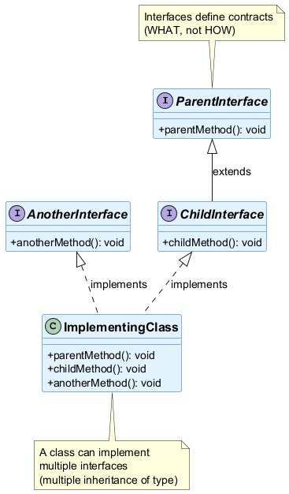
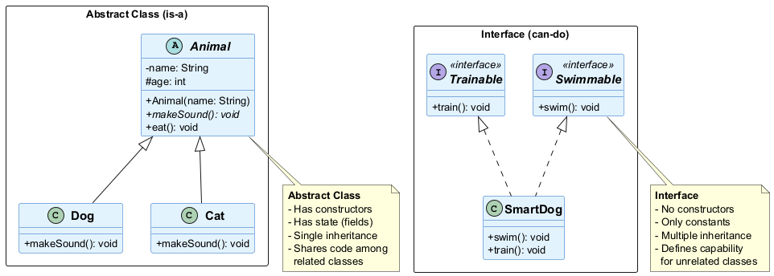
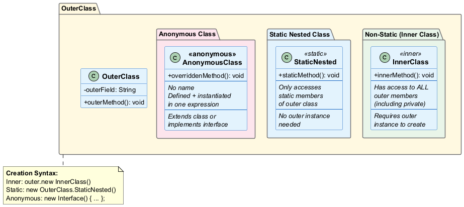
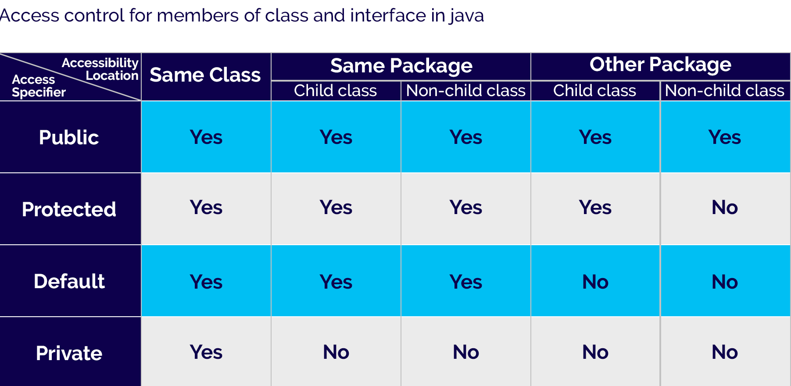
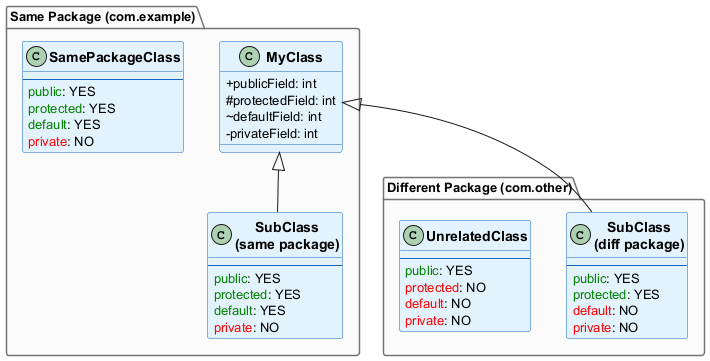
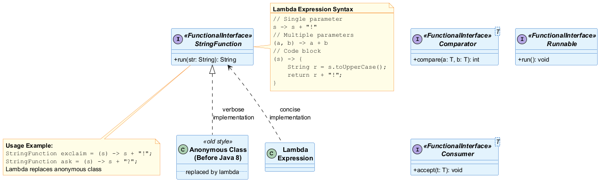

<!-- _backgroundColor: aqua -->

<!-- _color: orange -->

<!-- paginate: false -->

## CEN206 Object-Oriented Programming

## Week-3 (Interfaces, Type System and Code Organization)

#### Spring Semester, 2025-2026

Download [DOC-PDF](ce204-week-3.en.md_doc.pdf), [DOC-DOCX](ce204-week-3.en.md_word.docx), [SLIDE](ce204-week-3.en.md_slide.pdf)

<iframe width=700, height=500 frameBorder=0 src="../ce204-week-3.en.md_slide.html"></iframe>

---

<!-- paginate: true -->

## **Module A: Defining and Implementing Interfaces**

---

### Module Outline

- Defining an Interface in Java
- Implementing an Interface
- Implementing Multiple Interfaces

---

## **Defining an Interface in Java**

---

### Defining an Interface in Java

- In java, an interface is similar to a class, 
  - but it contains abstract methods and static final variables only. 
  - The interface in Java is another mechanism to achieve abstraction.
- We may think of an interface as a completely abstract class. 
  - None of the methods in the interface has an implementation, 
  - and all the variables in the interface are constants.
- All the methods of an interface, 
  - implemented by the class that implements it.
- The interface in java enables java to support multiple-inheritance. 
  - An interface may extend only one interface, 
  - but a class may implement any number of interfaces.

---

### Defining an Interface in Java

- An interface is a container of abstract methods and static final variables.

- An interface, implemented by a class. (class implements interface).

- An interface may extend another interface. (Interface extends Interface).

- An interface never implements another interface, or class.

- A class may implement any number of interfaces.

- We can not instantiate an interface.

- Specifying the keyword abstract for interface methods is optional, it automatically added.

- All the members of an interface are public by default.

---

### Defining an Interface in Java

- Defining an interface is similar to that of a class. We use the keyword interface to define an interface. 
- All the members of an interface are public by default. The following is the syntax for defining an interface.

``` Java linenums="1"
interface InterfaceName{
    ...
    members declaration;
    ...
}
```

---

### Defining an Interface in Java

- In the example we defined an interface HumanInterfaceExample that contains two abstract methods learn(), work() and one constant duration.

``` Java linenums="1"
interface HumanInterfaceExample {
	
	void learn(String str);
	void work();
	
	int duration = 10;
    
}
```

---

### Defining an Interface in Java Example-1

- Every interface in Java is auto-completed by the compiler. For example, in the above example code, 
- no member is defined as public, but all are public automatically.
- The above code automatically converted as follows.

``` Java linenums="1"
interface HumanInterfaceExample {
	
	public abstract void learn(String str);
	public abstract void work();
	
	public static final int duration = 10;
    
}
```

---

## **Implementing an Interface in Java**

---

### Implementing an Interface in Java

- In java, an interface is implemented by a class. 
- The class that implements an interface must provide code for all the methods defined in the interface, otherwise, 
  - it must be defined as an abstract class.
- The class uses a keyword `implements` to implement an interface. 
- A class can implement any number of interfaces. 
- When a class wants to implement more than one interface, 
  - we use the implements keyword is followed by a comma-separated list of the interfaces implemented by the class.

---

### Implementing an Interface in Java

- The following is the syntax for defineing a class that implements an interface.

``` Java linenums="1"
class className implements InterfaceName{
    ...
    boby-of-the-class
    ...
}
```

---

### Implementing an Interface in Java Example-1

``` Java linenums="1"
interface Human {
	
	void learn(String str);
	void work();
	
	int duration = 10;
	
}
```

---

### Implementing an Interface in Java Example-1

``` Java linenums="1"
class Programmer implements Human{
	public void learn(String str) {
		System.out.println("Learn using " + str);
	}
	public void work() {
		System.out.println("Develop applications");
	}
}
```

---

### Implementing an Interface in Java Example-1

``` Java linenums="1"
public class HumanTest {

	public static void main(String[] args) {
		Programmer trainee = new Programmer();
		trainee.learn("coding");
		trainee.work();
	}
}
```

---

### Implementing an Interface in Java Example-1

- In the example we defined an interface 
  - Human that contains two abstract methods 
    - learn(), 
    - work() and one constant duration. 
- The class Programmer implements the interface. 
  - As it implementing the Human interface it must provide the body of all the methods those defined in the Human interface.

---

### Implementing an Interface in Java Example-2

``` Java linenums="1"
interface Polygon {
  void getArea(int length, int breadth);
}
```

``` Java linenums="1"
// implement the Polygon interface
class Rectangle implements Polygon {

  // implementation of abstract method
  public void getArea(int length, int breadth) {
    System.out.println("The area of the rectangle is " + (length * breadth));
  }
}
```

---

### Implementing an Interface in Java Example-2

``` Java linenums="1"
class Main {
  public static void main(String[] args) {
    Rectangle r1 = new Rectangle();
    r1.getArea(5, 6);
  }
}
```

---

### Implementing an Interface in Java Example-3

``` Java linenums="1"
// create an interface
interface Language {
  void getName(String name);
}
```

``` Java linenums="1"
// class implements interface
class ProgrammingLanguage implements Language {

  // implementation of abstract method
  public void getName(String name) {
    System.out.println("Programming Language: " + name);
  }
}
```

---

### Implementing an Interface in Java Example-3

``` Java linenums="1"
class Main {
  public static void main(String[] args) {
    ProgrammingLanguage language = new ProgrammingLanguage();
    language.getName("Java");
  }
}
```

---

## Implementing multiple Interfaces

- When a class wants to implement more than one interface, 
- we use the implements keyword is followed by a comma-separated list of the interfaces implemented by the class.

---

## Implementing multiple Interfaces

- The following is the syntax for defineing a class that implements multiple interfaces.

``` Java linenums="1"
class className implements InterfaceName1, InterfaceName2, ...{
    ...
    boby-of-the-class
    ...
}
``` 

---

## Implementing multiple Interfaces Example-1

- In the example  we defined a class that implements multiple interfaces.

``` Java linenums="1"
interface Human {	
	void learn(String str);
	void work();
}
```
``` Java linenums="1"
interface Recruitment {
	boolean screening(int score);
	boolean interview(boolean selected);
}
```
---

## Implementing multiple Interfaces Example-1

``` Java linenums="1"
class Programmer implements Human, Recruitment {
	public void learn(String str) {
		System.out.println("Learn using " + str);
	}
	public boolean screening(int score) {
		System.out.println("Attend screening test");
		int thresold = 20;
		if(score > thresold)
			return true;
		return false;
	}
	public boolean interview(boolean selected) {
		System.out.println("Attend interview");
		if(selected)
			return true;
		return false;
	} 
	public void work() {
		System.out.println("Develop applications");
	}
}
``` 

---

## Implementing multiple Interfaces Example-1

``` Java linenums="1"
public class HumanTest {
	public static void main(String[] args) {
		Programmer trainee = new Programmer();
		trainee.learn("Coding");
		trainee.screening(30);
		trainee.interview(true);
		trainee.work();
	}
}
```

- In the example, two interfaces `Human` and `Recruitment`, and a class `Programmer` implements both the interfaces.

---

## Implementing multiple Interfaces Example-2

``` Java linenums="1"
interface A {
  // members of A
}
```

``` Java linenums="1"
interface B {
  // members of B
}
```

``` Java linenums="1"
class C implements A, B {
  // abstract members of A
  // abstract members of B
}
``` 

---


### Takeaway: Defining and Implementing Interfaces

- An interface is a contract - it defines WHAT a class must do, not HOW
- Interfaces contain abstract methods and static final variables
- A class implements an interface using the 'implements' keyword
- Java allows implementing multiple interfaces (multiple inheritance of type)
- All interface methods are implicitly public and abstract

---

## **Module B: Nested Interfaces**

---

## **Nested Interfaces in Java**

---

### Nested Interfaces in Java

- In java, an interface may be defined inside another interface, 
  - and also inside a class. 
- The interface that defined inside another interface or a class is konwn as nested interface. 
  - The nested interface is also refered as inner interface.

---

### Nested Interfaces in Java

- The nested interface declared within an interface is public by default.

- The nested interface declared within a class can be with any access modifier.

- Every nested interface is static by default.

---

### Nested Interfaces in Java

- The nested interface cannot be accessed directly. 
  - We can only access the nested interface by using outer interface or outer class name followed by dot( . ), followed by the nested interface name.

---

### Nested interface inside another interface Example

- The nested interface that defined inside another interface must be accessed as `OuterInterface.InnerInterface`.

``` Java linenums="1"
interface OuterInterface{
	void outerMethod();
	
	interface InnerInterface{
		void innerMethod();
	}
}
```

---

### Nested interface inside another interface Example

``` Java linenums="1"
class OnlyOuter implements OuterInterface{
	public void outerMethod() {
		System.out.println("This is OuterInterface method");
	}
}
```

``` Java linenums="1"
class OnlyInner implements OuterInterface.InnerInterface{
	public void innerMethod() {
		System.out.println("This is InnerInterface method");
	}
}
```

---

### Nested interface inside another interface Example

``` Java linenums="1"
public class NestedInterfaceExample {

	public static void main(String[] args) {
		OnlyOuter obj_1 = new OnlyOuter();
		OnlyInner obj_2 = new OnlyInner();
		
		obj_1.outerMethod();
		obj_2.innerMethod();
	}

}
```

---

## Nested interface inside a class Example

- The nested interface that defined inside a class must be accessed as `ClassName.InnerInterface`

``` Java linenums="1"
class OuterClass{
	
	interface InnerInterface{
		void innerMethod();
	}
}
```

---

## Nested interface inside a class Example

``` Java linenums="1"
class ImplementingClass implements OuterClass.InnerInterface{
	public void innerMethod() {
		System.out.println("This is InnerInterface method");
	}
}
```

---

## Nested interface inside a class Example

``` Java linenums="1"
public class NestedInterfaceExample {

	public static void main(String[] args) {
		ImplementingClass obj = new ImplementingClass();
		
		obj.innerMethod();
	}

}
``` 

---


### Takeaway: Nested Interfaces

- Interfaces can be nested inside other interfaces or classes
- Nested interfaces help organize related contracts together
- A class implementing a nested interface uses OuterInterface.InnerInterface syntax
- Nested interfaces in classes can have any access modifier

---

## **Module C: Interface Variables and Extending Interfaces**

---

## **Variables in Java Interfaces**

---

### Variables in Java Interfaces

- In java, an interface is a completely abstract class. 
- An interface is a container of abstract methods and static final variables. 
- The interface contains the static final variables. 
- The variables defined in an interface can not be modified by the class that implements the interface,
  - but it may use as it defined in the interface.

---

### Variables in Java Interfaces

- The variable in an interface is public, static, and final by default.

- If any variable in an interface is defined without public, static, and final keywords then, the compiler automatically adds the same.

- No access modifier is allowed except the public for interface variables.

- Every variable of an interface must be initialized in the interface itself.

- The class that implements an interface can not modify the interface variable, but it may use as it defined in the interface.

---

### Variables in Java Interfaces Example-1

``` Java linenums="1"
interface SampleInterface{
	
	int UPPER_LIMIT = 100;
	
	//int LOWER_LIMIT; // Error - must be initialised
	
}
```

``` Java linenums="1"
public class InterfaceVariablesExample implements SampleInterface{

	public static void main(String[] args) {
		
		System.out.println("UPPER LIMIT = " + UPPER_LIMIT);
		
		// UPPER_LIMIT = 150; // Can not be modified
	}
}
```

---

## **Extending an Interface in java**

---

### Extending an Interface in java

- In java, an interface can extend another interface.
  - When an interface wants to extend another interface,
    - it uses the keyword extends.
- The interface that extends another interface has its own members and all the members defined in its parent interface too.
- The class which implements a child interface needs to provide code for the methods defined in both child and parent interfaces,
  - otherwise, it needs to be defined as abstract class.

---

### Extending an Interface in Java

- An interface can extend another interface.

- An interface can not extend multiple interfaces.

- An interface can implement neither an interface nor a class.

- The class that implements child interface needs to provide code for all the methods defined in both child and parent interfaces.



---

### Extending an Interface in Java Example-1

``` Java linenums="1"
interface ParentInterface{
	void parentMethod();
}
```

``` Java linenums="1"
interface ChildInterface extends ParentInterface{
	void childMethod();
}
```

---

### Extending an Interface in Java Example-1

``` Java linenums="1"
class ImplementingClass implements ChildInterface{
	
	public void childMethod() {
		System.out.println("Child Interface method!!");
	}
	
	public void parentMethod() {
		System.out.println("Parent Interface mehtod!");
	}
}
```

---

### Extending an Interface in Java Example-1

``` Java linenums="1"
public class ExtendingAnInterface {

	public static void main(String[] args) {

		ImplementingClass obj = new ImplementingClass();
		
		obj.childMethod();
		obj.parentMethod();

	}

}
```

---

### Extending an Interface in Java Example-2

-  Here, the Polygon interface extends the Line interface. Now, if any class implements Polygon, it should provide implementations for all the abstract methods of both Line and Polygon

``` Java linenums="1"
interface Line {
  // members of Line interface
}

// extending interface
interface Polygon extends Line {
  // members of Polygon interface
  // members of Line interface
}
``` 

---

### Extending Multiple Interfaces in Java Example

``` Java linenums="1"
interface A {
   ...
}
```

``` Java linenums="1"
interface B {
   ... 
}
```

``` Java linenums="1"
interface C extends A, B {
   ...
}
``` 

---


### Takeaway: Interface Variables and Extending

- Interface variables are implicitly public, static, and final (constants)
- Interfaces can extend other interfaces using the 'extends' keyword
- A class implementing a child interface must implement ALL methods from the entire hierarchy
- An interface can extend multiple interfaces (unlike classes)

---

## **Module D: Modern Interface Features and Advantages**

---

## **Advantages of Interface in Java**

---

### Advantages of Interface in Java

- **Similar to abstract classes, interfaces help us to achieve abstraction in Java**
  - Here, we know getArea() calculates the area of polygons but the way area is calculated is different for different polygons. Hence, the implementation of getArea() is independent of one another.

---

### Advantages of Interface in Java

- **Interfaces provide specifications that a class (which implements it) must follow.**
  - In our previous example, we have used getArea() as a specification inside the interface Polygon. This is like setting a rule that we should be able to get the area of every polygon.
- Now any class that implements the Polygon interface must provide an implementation for the getArea() method.

---

### Advantages of Interface in Java

- Interfaces are also used to achieve multiple inheritance in Java
  - In the example, the class Rectangle is implementing two different interfaces. This is how we achieve multiple inheritance in Java.

``` Java linenums="1"
interface Line {
…
}

interface Polygon {
…
}

class Rectangle implements Line, Polygon {
…
}
```

---

### Advantages of Interface in Java

- All the methods inside an interface are implicitly public and all fields are implicitly public static final. For example,

``` Java linenums="1"
interface Language {
  
  // by default public static final
  String type = "programming language";

  // by default public
  void getName();
}
```

---

## **default methods in Java Interfaces**

---

### default methods in Java Interfaces

- With the release of Java 8, we can now add methods with implementation inside an interface. 
  - These methods are called default methods.
- To declare default methods inside interfaces, we use the default keyword. For example,

``` Java linenums="1"
public default void getSides() {
   // body of getSides()
}
```

---

### why default methods in Java Interfaces

- Let's take a scenario to understand why default methods are introduced in Java.
- Suppose, we need to add a new method in an interface.
- We can add the method in our interface easily without implementation. However, that's not the end of the story. All our classes that implement that interface must provide an implementation for the method.
- If a large number of classes were implementing this interface, we need to track all these classes and make changes to them. This is not only tedious but error-prone as well.
- To resolve this, Java introduced default methods. Default methods are inherited like ordinary methods.

---

### Default Method in Java Interface Example

``` Java linenums="1"
interface Polygon {
  void getArea();

  // default method 
  default void getSides() {
    System.out.println("I can get sides of a polygon.");
  }
}
```

---

### Default Method in Java Interface Example

``` Java linenums="1"
// implements the interface
class Rectangle implements Polygon {
  public void getArea() {
    int length = 6;
    int breadth = 5;
    int area = length * breadth;
    System.out.println("The area of the rectangle is " + area);
  }

  // overrides the getSides()
  public void getSides() {
    System.out.println("I have 4 sides.");
  }
}
```

---

### Default Method in Java Interface Example

``` Java linenums="1"
// implements the interface
class Square implements Polygon {
  public void getArea() {
    int length = 5;
    int area = length * length;
    System.out.println("The area of the square is " + area);
  }
}
```

---

### Default Method in Java Interface Example

``` Java linenums="1"
class Main {
  public static void main(String[] args) {

    // create an object of Rectangle
    Rectangle r1 = new Rectangle();
    r1.getArea();
    r1.getSides();

    // create an object of Square
    Square s1 = new Square();
    s1.getArea();
    s1.getSides();
  }
}
```

---

### Default Method in Java Interface Example

- In the example, we have created an interface named Polygon. It has a default method getSides() and an abstract method getArea().
- Here, we have created two classes Rectangle and Square that implement Polygon.
- The Rectangle class provides the implementation of the getArea() method and overrides the getSides() method. However, the Square class only provides the implementation of the getArea() method.
- Now, while calling the getSides() method using the Rectangle object, the overridden method is called. However, in the case of the Square object, the default method is called.

---

## **private and static Methods in Interface**

---

### private and static Methods in Interface

- The Java 8 also added another feature to include static methods inside an interface.
- Similar to a class, we can access static methods of an interface using its references. For example,

``` Java linenums="1"
// create an interface
interface Polygon {
  staticMethod(){..}
}

// access static method
Polygon.staticMethod();
```

---

### private and static Methods in Interface

- Note: With the release of Java 9, private methods are also supported in interfaces.
- We cannot create objects of an interface. 
  - Hence, private methods are used as helper methods that provide support to other methods in interfaces.

---

### Java Interface Practical Example

``` Java linenums="1"
// To use the sqrt function
import java.lang.Math;

interface  Polygon {
   void getArea();
  
 // calculate the perimeter of a Polygon
   default void getPerimeter(int... sides) {
      int perimeter = 0;
      for (int side: sides) {
         perimeter += side;
      }

   System.out.println("Perimeter: " + perimeter);
   }
}
```

---

### Java Interface Practical Example

``` Java linenums="1"
class Triangle implements Polygon {
   private int a, b, c;
   private double s, area;

// initializing sides of a triangle
   Triangle(int a, int b, int c) {
      this.a = a;
      this.b = b;
      this.c = c;
      s = 0;
   }

// calculate the area of a triangle
   public void getArea() {
      s = (double) (a + b + c)/2;
      area = Math.sqrt(s*(s-a)*(s-b)*(s-c));
      System.out.println("Area: " + area);
   }
}
```

---

### Java Interface Practical Example

``` Java linenums="1"
class Main {
   public static void main(String[] args) {
      Triangle t1 = new Triangle(2, 3, 4);

// calls the method of the Triangle class
      t1.getArea();

// calls the method of Polygon
      t1.getPerimeter(2, 3, 4);
   }
}
```

---

### Java Interface Practical Example

- In the example, we have created an interface named Polygon. 
  - It includes a default method getPerimeter() and an abstract method getArea().
- We can calculate the perimeter of all polygons in the same manner so we implemented the body of getPerimeter() in Polygon.
- Now, all polygons that implement Polygon can use getPerimeter() to calculate perimeter.
- However, the rule for calculating the area is different for different polygons. 
  - Hence, getArea() is included without implementation.
- Any class that implements Polygon must provide an implementation of getArea().


---


### Takeaway: Modern Interface Features

- Interfaces enable polymorphism, loose coupling, and multiple inheritance of type
- Java 8+ default methods: provide implementation in interfaces for backward compatibility
- Java 9+ private methods in interfaces: share code between default methods
- Static methods in interfaces: utility methods that belong to the interface
- Interfaces evolved from pure contracts to powerful abstractions

---

## **Module E: Abstract Class vs Interface - When to Use Which?**

---

### Abstract Class vs Interface: Comparison

| Feature | Abstract Class | Interface |
|---------|---------------|-----------|
| Methods | Abstract + concrete | Abstract + default + static + private |
| Fields | Any type | Only public static final |
| Constructor | Yes | No |
| Access Modifiers | Any | Public (methods), public static final (fields) |
| Multiple Inheritance | No (single extends) | Yes (multiple implements) |
| When to Use | Related classes sharing code | Unrelated classes sharing contract |

---

### Abstract Class vs Interface: Visual Comparison



---

### Abstract Class vs Interface: Relationship Types

- **Abstract Class** expresses **is-a** relationship
  - "A Dog **is-a** Animal" -> abstract class Animal
  - Share common state and behavior among family of classes

- **Interface** expresses **can-do** capability
  - "A Dog **can** Swim" -> interface Swimmable
  - Define a contract that any class can fulfill

---

### Abstract Class vs Interface: The Diamond Problem

- Java does NOT allow multiple class inheritance (no diamond problem with classes)
- Interfaces CAN have the diamond problem with default methods
- Java resolves this by requiring the implementing class to override the conflicting method

``` Java linenums="1"
interface A { default void hello() { System.out.println("A"); } }
interface B { default void hello() { System.out.println("B"); } }

class C implements A, B {
    // MUST override hello() to resolve conflict
    public void hello() {
        A.super.hello(); // explicitly choose A's version
    }
}
```

---

### Abstract Class vs Interface: Decision Flowchart

- **Need to share code among closely related classes?** -> Abstract Class
- **Need to define a contract for unrelated classes?** -> Interface
- **Need multiple inheritance of type?** -> Interface
- **Need to define constants?** -> Interface (public static final)
- **Need non-public members?** -> Abstract Class
- **Need to maintain state?** -> Abstract Class
- **Need backward-compatible API extension?** -> Interface (default methods)

---

### Takeaway: Abstract Class vs Interface

- Abstract Class = 'is-a' relationship, Interface = 'can-do' capability
- Use abstract class when classes are closely related and share state/behavior
- Use interfaces when unrelated classes need to fulfill the same contract
- Java resolves diamond problem by requiring explicit override of conflicting default methods
- Modern Java: interfaces are more powerful than ever with default, static, and private methods

---

## **Module F: Nested, Static and Anonymous Classes**

---

### Module Outline

- Non-Static Nested Class (Inner Class)
- Accessing Members of Outer Class within Inner Class
- Static Nested Class
- Java Anonymous Class
- Advantages of Anonymous Classes

---

## **Java Nested and Inner Class**

---

### Java Nested and Inner Class

- In Java, you can define a class within another class. 
  - Such class is known as nested class

``` Java linenums="1"
class OuterClass {
  // ...
  class NestedClass {
      // ...
  }
}
```

---

### Java Nested and Inner Class

- There are two types of nested classes you can create in Java.
  - Non-static nested class (inner class)
  - Static nested class

---

### Java Nested Class Types Overview



---

### Non-Static Nested Class (Inner Class)

- A non-static nested class is a class within another class. 
  - It has access to members of the enclosing class (outer class). 
    - It is commonly known as inner class.

- Since the inner class exists within the outer class, 
  - you must instantiate the outer class first, 
    - in order to instantiate the inner class.

---

### Non-Static Nested Class (Inner Class) Example

``` Java linenums="1"
class CPU {
    double price;
    // nested class
    class Processor{

        // members of nested class
        double cores;
        String manufacturer;

        double getCache(){
            return 4.3;
        }
    }

    // nested protected class
    protected class RAM{

        // members of protected nested class
        double memory;
        String manufacturer;

        double getClockSpeed(){
            return 5.5;
        }
    }
}
```

---

### Non-Static Nested Class (Inner Class) Example

``` Java linenums="1"
public class Main {
    public static void main(String[] args) {

        // create object of Outer class CPU
        CPU cpu = new CPU();

       // create an object of inner class Processor using outer class
        CPU.Processor processor = cpu.new Processor();

        // create an object of inner class RAM using outer class CPU
        CPU.RAM ram = cpu.new RAM();
        System.out.println("Processor Cache = " + processor.getCache());
        System.out.println("Ram Clock speed = " + ram.getClockSpeed());
    }
}
``` 

---

<style scoped>section{ font-size: 25px; }</style>

### Non-Static Nested Class (Inner Class) Example

- In the example program, there are two nested classes: 
  - Processor and RAM inside the outer class: 
    - CPU. 
- We can declare the inner class as protected. 
- Hence, we have declared the RAM class as protected.

- Inside the Main class,
  - we first created an instance of an outer class CPU named cpu.
  - Using the instance of the outer class, we then created objects of inner classes

  ``` Java linenums="1"
  CPU.Processor processor = cpu.new Processor;
  CPU.RAM ram = cpu.new RAM();
  ```
- We use the dot (.) operator to create an instance of the inner class using the outer class.

---

### Accessing Members of Outer Class within Inner Class

- We can access the members of the outer class by using this keyword

---

### Accessing Members of Outer Class within Inner Class Example

``` Java linenums="1"
class Car {
    String carName;
    String carType;

    // assign values using constructor
    public Car(String name, String type) {
        this.carName = name;
        this.carType = type;
    }

    // private method
    private String getCarName() {
        return this.carName;
    }
...

```

---

### Accessing Members of Outer Class within Inner Class Example

``` Java linenums="1"
...
// inner class
    class Engine {
        String engineType;
        void setEngine() {

           // Accessing the carType property of Car
            if(Car.this.carType.equals("4WD")){

                // Invoking method getCarName() of Car
                if(Car.this.getCarName().equals("Crysler")) {
                    this.engineType = "Smaller";
                } else {
                    this.engineType = "Bigger";
                }

            }else{
                this.engineType = "Bigger";
            }
        }
        String getEngineType(){
            return this.engineType;
        }
    }
}
```

---

### Accessing Members of Outer Class within Inner Class Example

``` Java linenums="1"
public class Main {
    public static void main(String[] args) {

// create an object of the outer class Car
        Car car1 = new Car("Mazda", "8WD");

        // create an object of inner class using the outer class
        Car.Engine engine = car1.new Engine();
        engine.setEngine();
        System.out.println("Engine Type for 8WD= " + engine.getEngineType());

        Car car2 = new Car("Crysler", "4WD");
        Car.Engine c2engine = car2.new Engine();
        c2engine.setEngine();
        System.out.println("Engine Type for 4WD = " + c2engine.getEngineType());
    }
}
```

---

<style scoped>section{ font-size: 30px; }</style>

### Accessing Members of Outer Class within Inner Class Example

- In the example program, we have the inner class named 
  - Engine inside the outer class Car. Here, notice the line,

``` Java linenums="1"
if(Car.this.carType.equals("4WD")) {...}
``` 

- We are using `this` keyword to access the `carType` variable of the outer class. 
- You may have noticed that instead of using `this.carType` we have used `Car.this.carType`

---

<style scoped>section{ font-size: 30px; }</style>

### Accessing Members of Outer Class within Inner Class Example

- It is because if we had not mentioned the name of the outer class Car, 
  - then this keyword will represent the member inside the inner class.

- Similarly, we are also accessing the method of the outer class from the inner class.

``` Java linenums="1"
if (Car.this.getCarName().equals("Crysler") {...}
``` 

- It is important to note that, although the `getCarName()` is a `private` method, we are able to access it from the inner class.

---

<style scoped>section{ font-size: 25px; }</style>

### Static Nested Class

- In Java, we can also define a static class inside another class. 
  - Such class is known as static nested class. 
  - Static nested classes are not called static inner classes.

- Unlike inner class, a static nested class cannot access the member variables of the outer class. 
  - It is because the static nested class doesn't require you to create an instance of the outer class.

``` Java linenums="1"
OuterClass.NestedClass obj = new OuterClass.NestedClass();
``` 

- Here, we are creating an object of the static nested class by simply using the class name of the outer class. 
- Hence, the outer class cannot be referenced using `OuterClass.this`.

---

<style scoped>section{ font-size: 25px; }</style>

### Static Inner Class Example

``` Java linenums="1"
class MotherBoard {

   // static nested class
   static class USB{
       int usb2 = 2;
       int usb3 = 1;
       int getTotalPorts(){
           return usb2 + usb3;
       }
   }

}
```

``` Java linenums="1"
public class Main {
   public static void main(String[] args) {

       // create an object of the static nested class
       // using the name of the outer class
       MotherBoard.USB usb = new MotherBoard.USB();
       System.out.println("Total Ports = " + usb.getTotalPorts());
   }
}
``` 

---

<style scoped>section{ font-size: 25px; }</style>

### Static Inner Class Example

- In the above program, we have created a static class named USB inside the class MotherBoard. Notice the line,

``` Java linenums="1"
MotherBoard.USB usb = new MotherBoard.USB();
``` 

- Here, we are creating an object of USB using the name of the outer class.

- Now, let's see what would happen if you try to access the members of the outer class:

---

### Accessing members of Outer class inside Static Inner Class Example

``` Java linenums="1"
class MotherBoard {
   String model;
   public MotherBoard(String model) {
       this.model = model;
   }

   // static nested class
   static class USB{
       int usb2 = 2;
       int usb3 = 1;
       int getTotalPorts(){
           // accessing the variable model of the outer classs
           if(MotherBoard.this.model.equals("MSI")) {
               return 4;
           }
           else {
               return usb2 + usb3;
           }
       }
   }
}
```

---

### Accessing members of Outer class inside Static Inner Class Example

``` Java linenums="1"
public class Main {
   public static void main(String[] args) {

       // create an object of the static nested class
       MotherBoard.USB usb = new MotherBoard.USB();
       System.out.println("Total Ports = " + usb.getTotalPorts());
   }
}
``` 

---

### Accessing members of Outer class inside Static Inner Class Example

- When we try to run the program, we will get an error:

``` Bash linenums="1"
error: non-static variable this cannot be referenced from a static context
```
- This is because we are not using the object of the outer class to create an object of the inner class. 
- Hence, there is no reference to the outer class `Motherboard` stored in `Motherboard.this`.

---

<style scoped>section{ font-size: 25px; }</style>

### Key Points to Remember

- Java treats the inner class as a regular member of a class. They are just like methods and variables declared inside a class.
- Since inner classes are members of the outer class, you can apply any access modifiers like private, protected to your inner class which is not possible in normal classes.
- Since the nested class is a member of its enclosing outer class, you can use the dot (.) notation to access the nested class and its members.
- Using the nested class will make your code more readable and provide better encapsulation.
- Non-static nested classes (inner classes) have access to other members of the outer/enclosing class, even if they are declared private.

---

## **Java Nested Static Class**

---

### Java Nested Static Class

- we can have a class inside another class in Java. Such classes are known as nested classes. In Java, nested classes are of two types:
  - Nested non-static class (Inner class)
  - Nested static class.

---

### Java Nested Static Class

- We use the keyword static to make our nested class static.
  - Note: In Java, only nested classes are allowed to be static.
- Like regular classes, static nested classes can include both static and non-static fields and methods. For example,

``` Java linenums="1"
Class Animal {
   static class Mammal {
      // static and non-static members of Mammal
   }
   // members of Animal
} 
```
- Static nested classes are associated with the outer class.
  - To access the static nested class, we don’t need objects of the outer class.

---

### Static Nested Class Example

``` Java linenums="1"
class Animal {

// inner class
   class Reptile {
      public void displayInfo() {
        System.out.println("I am a reptile.");
      }
   }

// static class
   static class Mammal {
      public void displayInfo() {
        System.out.println("I am a mammal.");
      }
   }
}
```

---

### Static Nested Class Example

``` Java linenums="1"
class Main {
   public static void main(String[] args) {
      // object creation of the outer class
      Animal animal = new Animal();

      // object creation of the non-static class
      Animal.Reptile reptile = animal.new Reptile();
      reptile.displayInfo();

      // object creation of the static nested class
      Animal.Mammal mammal = new Animal.Mammal();
      mammal.displayInfo();

   }
}
```

---

### Static Nested Class Example

- In the example program, we have two nested class `Mammal` and `Reptile` inside a class `Animal`.
  - To create an object of the non-static class Reptile, we have used

  ``` Java linenums="1"
  Animal.Reptile reptile = animal.new Reptile()
  ```

  - To create an object of the static class Mammal, we have used

  ``` Java linenums="1"
  Animal.Mammal mammal = new Animal.Mammal()
  ```

---

### Accessing Members of Outer Class

- In Java, static nested classes are associated with the outer class. 
- This is why static nested classes can only access the class members (static fields and methods) of the outer class.

---

### Accessing Non-static members Example

``` Java linenums="1"
class Animal {
  static class Mammal {
   public void displayInfo() {
     System.out.println("I am a mammal.");
   }
 }

 class Reptile {
   public void displayInfo() {
     System.out.println("I am a reptile.");
   }
 }

 public void eat() {
   System.out.println("I eat food.");
 }
}
```

---

### Accessing Non-static members Example

``` Java linenums="1"
class Main {
 public static void main(String[] args) {
   Animal animal = new Animal();
   Animal.Reptile reptile = animal.new Reptile();
   reptile.displayInfo();

   Animal.Mammal mammal = new Animal.Mammal();
   mammal.displayInfo();
   mammal.eat();
 }
}
```

---

### Accessing Non-static members Example

- In the example, we have created a non-static method `eat()` inside the class Animal.

- Now, if we try to access `eat()` using the object `mammal`, the compiler shows an error.

- It is because `mammal` is an object of a static class and we cannot access non-static methods from static classes.

---

### Static Top-level Class

- only nested classes can be static. 
- We cannot have static top-level classes.

---

### Static Top-level Class

- if we try to make a top-level class static.

``` Java linenums="1"
static class Animal {
 public static void displayInfo() {
   System.out.println("I am an animal");
 }
}
```

``` Java linenums="1"
class Main {
 public static void main(String[] args) {
   Animal.displayInfo();
 }
}
```

---

### Static Top-level Class

``` Bash
Main.java:1: error: modifier static not allowed here
static class Animal {
       ^
1 error
compiler exit status 1
```

- In the example, we have tried to create a static class Animal. 
- Since Java doesn’t allow static top-level class, 
  - we will get an error.

---

## **Java Anonymous Class**

---

### Java Anonymous Class

- In Java, a class can contain another class known as nested class. It's possible to create a nested class without giving any name.
- A nested class that doesn't have any name is known as an anonymous class.
- An anonymous class must be defined inside another class. Hence, it is also known as an anonymous inner class. Its syntax is:

``` Java linenums="1"
class outerClass {

    // defining anonymous class
    object1 = new Type(parameterList) {
         // body of the anonymous class
    };
}
```

---

### Java Anonymous Class

- Anonymous classes usually extend subclasses or implement interfaces.
- Here, Type can be
  - a superclass that an anonymous class extends
  - an interface that an anonymous class implements
- The above code creates an object, object1, of an anonymous class at runtime.
- **Note**: Anonymous classes are defined inside an expression. So, the semicolon is used at the end of anonymous classes to indicate the end of the expression.

---

### Anonymous Class Extending a Class Example

``` Java linenums="1"
class Polygon {
   public void display() {
      System.out.println("Inside the Polygon class");
   }
}
```

``` Java linenums="1"
class AnonymousDemo {
   public void createClass() {

      // creation of anonymous class extending class Polygon
      Polygon p1 = new Polygon() {
         public void display() {
            System.out.println("Inside an anonymous class.");
         }
      };
      p1.display();
   }
}
```

---

### Anonymous Class Extending a Class Example

``` Java linenums="1"
class Main {
   public static void main(String[] args) {
       AnonymousDemo an = new AnonymousDemo();
       an.createClass();
   }
}
```

---

### Anonymous Class Extending a Class Example

- In the example, we have created a class `Polygon`. It has a single method `display()`.
- We then created an anonymous class that extends the class Polygon and overrides the `display()` method.
- When we run the program, an object `p1` of the anonymous class is created. 
  - The object then calls the `display()` method of the anonymous class.

---

### Anonymous Class Implementing an Interface Example

``` Java linenums="1"
interface Polygon {
   public void display();
}
```

``` Java linenums="1"
class AnonymousDemo {
   public void createClass() {

      // anonymous class implementing interface
      Polygon p1 = new Polygon() {
         public void display() {
            System.out.println("Inside an anonymous class.");
         }
      };
      p1.display();
   }
}
```

---

### Anonymous Class Implementing an Interface Example

``` Java linenums="1"
class Main {
   public static void main(String[] args) {
      AnonymousDemo an = new AnonymousDemo();
      an.createClass();
   }
}
```

- In the example, we have created an anonymous class that implements the Polygon interface.

---

### Advantages of Anonymous Classes

- In anonymous classes, objects are created whenever they are required. 
- That is, objects are created to perform some specific tasks. For example,

``` Java linenums="1"
Object = new Example() {
   public void display() {
      System.out.println("Anonymous class overrides the method display().");
   }
};
```

- Here, an object of the anonymous class is created dynamically when we need to override the display() method.
- Anonymous classes also help us to make our code concise.

---


### Takeaway: Nested, Static and Anonymous Classes

- Inner class (non-static nested): has access to ALL members of the outer class, including private
- Static nested class: does NOT have access to non-static members of outer class
- Anonymous class: a class without a name, defined and instantiated in one expression
- Use inner classes for tightly coupled helper classes
- Use anonymous classes for one-time implementations (event handlers, callbacks)

---

## **Module G: Java Enums**

---

### Module Outline

- Java Enum Basics and Switch Statement
- Enum as a Class: Fields, Methods, and the Enum Class
- Enum Methods: ordinal, compareTo, toString, name, valueOf, values
- Why Java Enums?
- Enum Constructors and Custom Strings

---

## **Java enums**

---

### Java enums

- In Java, an enum (short for enumeration) is a type that has a fixed set of constant values. We use the `enum` keyword to declare enums. For example,

``` Java linenums="1"
enum Size { 
   SMALL, MEDIUM, LARGE, EXTRALARGE 
}
```
- Here, we have created an enum named Size. It contains fixed values `SMALL`, `MEDIUM`, `LARGE`, and `EXTRALARGE`.
- These values inside the braces are called enum constants (values).
  - **Note:** The enum constants are usually represented in uppercase.

---

### Java Enum Example

``` Java linenums="1"
enum Size {
   SMALL, MEDIUM, LARGE, EXTRALARGE
}

class Main {
   public static void main(String[] args) {
      System.out.println(Size.SMALL);
      System.out.println(Size.MEDIUM);
   }
}
```

---

### Java Enum Example

we use the enum name to access the constant values.

Also, we can create variables of enum types. For example

``` Java linenums="1"
Size pizzaSize;
``` 

- Here, pizzaSize is a variable of the Size type. It can only be assigned with 4 values.

``` Java linenums="1"
pizzaSize = Size.SMALL;
pizzaSize = Size.MEDIUM;
pizzaSize = Size.LARGE;
pizzaSize = Size.EXTRALARGE;
``` 

---

### Java Enum with the switch statement example

``` Java linenums="1"
enum Size {
 SMALL, MEDIUM, LARGE, EXTRALARGE
}
``` 

---

### Java Enum with the switch statement example

``` Java linenums="1"
class Test {
 Size pizzaSize;
 public Test(Size pizzaSize) {
   this.pizzaSize = pizzaSize;
 }
 public void orderPizza() {
   switch(pizzaSize) {
     case SMALL:
       System.out.println("I ordered a small size pizza.");
       break;
     case MEDIUM:
       System.out.println("I ordered a medium size pizza.");
       break;
     default:
       System.out.println("I don't know which one to order.");
       break;
   }
 }
}
```

---

### Java Enum with the switch statement example

``` Java linenums="1"
class Main {
 public static void main(String[] args) {
   Test t1 = new Test(Size.MEDIUM);
   t1.orderPizza();
 }
}
```

---

### Java Enum with the switch statement example

- In the example, we have created an enum type `Size`. - We then declared a variable `pizzaSize` of the `Size` type.
- Here, the variable `pizzaSize` can only be assigned with 4 values (`SMALL, MEDIUM, LARGE, EXTRALARGE`).
- Notice the statement,
``` Java linenums="1"
Test t1 = new Test(Size.MEDIUM);
``` 
- It will call the `Test()` constructor inside the `Test` class. Now, the variable pizzaSize is assigned with the `MEDIUM` constant.
- Based on the value, one of the cases of the switch case statement is executed.

---

### Enum Class in Java

- In Java, enum types are considered to be a special type of class. 
  - It was introduced with the release of Java 5.
- An enum class can include methods and fields just like regular classes.
``` Java linenums="1"
enum Size {
    constant1, constant2, …, constantN;

    // methods and fields	
}
```
- When we create an enum class, the compiler will create instances (objects) of each enum constants. 
  - Also, all enum constant is always public static final by default.

---

### Java Enum Class Example

``` Java linenums="1"
enum Size{
  SMALL, MEDIUM, LARGE, EXTRALARGE;

  public String getSize() {

    // this will refer to the object SMALL
    switch(this) {
      case SMALL:
        return "small";

      case MEDIUM:
        return "medium";

      case LARGE:
        return "large";

      case EXTRALARGE:
        return "extra large";

      default:
        return null;
      }
   }
...

```

---

### Java Enum Class Example

``` Java linenums="1"
...
  public static void main(String[] args) {

    // call getSize()
    // using the object SMALL
    System.out.println("The size of the pizza is " + Size.SMALL.getSize());
  }
}
```

---

### Java Enum Class Example

- In the example, we have created an enum class Size. It has four constants SMALL, MEDIUM, LARGE and EXTRALARGE.
- Since Size is an enum class, the compiler automatically creates instances for each enum constants.
- Here inside the main() method, we have used the instance SMALL to call the getSize() method.
- **Note**: Like regular classes, an enum class also may include constructors

---

### Methods of Java Enum Class

- There are some predefined methods in enum classes that are readily available for use.

---

### Methods of Java Enum Class

#### Java Enum ordinal()

  - The ordinal() method returns the position of an enum constant. For example,

``` Java linenums="1"
ordinal(SMALL) 
// returns 0
```

---

### Methods of Java Enum Class

#### Enum compareTo()

- The compareTo() method compares the enum constants based on their ordinal value. For example,

``` Java linenums="1"
Size.SMALL.compareTo(Size.MEDIUM)
 // returns ordinal(SMALL) - ordinal(MEDIUM)
```

---

### Methods of Java Enum Class

#### Enum toString()

- The toString() method returns the string representation of the enum constants. For example,

``` Java linenums="1"
SMALL.toString()
// returns "SMALL"
```

---

### Methods of Java Enum Class

#### Enum name()
- The name() method returns the defined name of an enum constant in string form. The returned value from the name() method is final. For example,

``` Java linenums="1"
name(SMALL)
// returns "SMALL"
```

---

### Methods of Java Enum Class

#### Java Enum valueOf()
- The `valueOf()` method takes a string and returns an enum constant having the same string name. For example,

``` Java linenums="1"
Size.valueOf("SMALL")
// returns constant SMALL.
```

---

### Methods of Java Enum Class

#### Enum values()

- The `values()` method returns an array of enum type containing all the enum constants. For example,

``` Java linenums="1"
Size[] enumArray = Size.value();
``` 

---

### Why Java Enums?

- In Java, enum was introduced to replace the use of int constants.

- Suppose we have used a collection of int constants.

``` Java linenums="1"
class Size {
   public final static int SMALL = 1;
   public final static int MEDIUM = 2;
   public final static int LARGE = 3;
   public final static int EXTRALARGE = 4;
}
```

- Here, the problem arises if we print the constants.   
  - It is because only the number is printed which might not be helpful.

---

### Why Java Enums?

- So, instead of using int constants, we can simply use enums. For example,

``` Java linenums="1"
enum Size {
   SMALL, MEDIUM, LARGE, EXTRALARGE
}
```

- This makes our code more intuitive.

---

### Why Java Enums?

- Also, enum provides compile-time type safety.
- If we declare a variable of the Size type. For example,

``` Java linenums="1"
Size size;
```

- Here, it is guaranteed that the variable will hold one of the four values. 
- Now, If we try to pass values other than those four values, 
  - the compiler will generate an error.

---

### Java enum Constructor

- In Java, an enum class may include a constructor like a regular class. These enum constructors are either
  - **private** - accessible within the class or
  - **package-private** - accessible within the package

---

### enum Constructor Example

``` Java linenums="1"
enum Size {

   // enum constants calling the enum constructors 
   SMALL("The size is small."),
   MEDIUM("The size is medium."),
   LARGE("The size is large."),
   EXTRALARGE("The size is extra large.");

   private final String pizzaSize;

   // private enum constructor
   private Size(String pizzaSize) {
      this.pizzaSize = pizzaSize;
   }

   public String getSize() {
      return pizzaSize;
   }
}
```

---

### enum Constructor Example

``` Java linenums="1"
class Main {
   public static void main(String[] args) {
      Size size = Size.SMALL;
      System.out.println(size.getSize());
   }
}
```

---

### enum Constructor Example

- In the example, we have created an enum Size. 
  - It includes a private enum constructor. 
  - The constructor takes a string value as a parameter and assigns value to the variable pizzaSize.
- Since the constructor is private, 
  - we cannot access it from outside the class. However, 
  - we can use enum constants to call the constructor.
- In the Main class, we assigned SMALL to an enum variable size. 
  - The constant SMALL then calls the constructor Size with string as an argument.
- Finally, we called getSize() using size.

---

## **Java enum Strings**

---

### Java enum Strings

In Java, we can get the string representation of enum constants using the toString() method or the name() method. For example,

``` Java linenums="1"
enum Size {
   SMALL, MEDIUM, LARGE, EXTRALARGE
}

class Main {
   public static void main(String[] args) {

      System.out.println("string value of SMALL is " + Size.SMALL.toString());
      System.out.println("string value of MEDIUM is " + Size.MEDIUM.name());

   }
}
```
- we have seen the default string representation of an enum constant is the name of the same constant.

---

### Change Default String Value of enums

- We can change the default string representation of enum constants by overriding the toString() method. For example,

``` Java linenums="1"
enum Size {
   SMALL {

      // overriding toString() for SMALL
      public String toString() {
        return "The size is small.";
      }
   },

   MEDIUM {

     // overriding toString() for MEDIUM
      public String toString() {
        return "The size is medium.";
      }
   };
}
...
```

---

### Change Default String Value of enums

``` Java linenums="1"
...
class Main {
   public static void main(String[] args) {
      System.out.println(Size.MEDIUM.toString());
   }
}
```

- In the above program, we have created an enum Size. And we have overridden the `toString()` method for enum constants `SMALL` and `MEDIUM`.
- **Note:** We cannot override the `name()` method. It is because the `name()` method is `final`.


---


### Takeaway: Java Enums

- Enums define a fixed set of type-safe constants (no more magic numbers or strings)
- Enums are implicitly final classes that extend java.lang.Enum
- Enums can have fields, methods, and constructors (constructor is always private)
- Key methods: ordinal() (position), name() (string name), values() (all constants)
- Use enums for: days of week, directions, states, status codes, etc.

---

## **Module H: Java Packages**

---

### Module Outline

- Defining Packages in Java
- Built-in vs User-defined Packages
- Access Protection in Java Packages
- Importing Packages: Specific Class vs All Classes

---

## **Defining Packages in java**

---

### Defining Packages in java

- In java, a package is a container of classes, 
  - interfaces, and 
  - sub-packages. 
- We may think of it as a folder in a file directory.
- We use the packages to 
  - avoid naming conflicts and 
  - to organize 
    - project-related 
      - classes, 
      - interfaces, and 
      - sub-packages into a bundle.

---

### Defining Packages in java

- In java, the packages have divided into two types.
  - Built-in Packages
  - User-defined Packages

---

### Built-in Packages

- The built-in packages are the packages from java API. The Java API is a library of pre-defined classes, interfaces, and sub-packages. 
  - The built-in packages were included in the JDK.

- There are many built-in packages in java, few of them are as `java, lang, io, util, awt, javax, swing, net, sql`, etc.

- We need to import the built-in packages to use them in our program. 
  - To import a package, we use the `import` statement.

---

### User-defined Packages

- The user-defined packages are the packages created by the user. 
- User is free to create their own packages.

---

### Definig a Package in java

- We use the package keyword to create or define a package in java programming language.

``` Java linenums="1"
package packageName;
```

---

### Definig a Package in java

- The package statement must be the first statement in the program.

- The package name must be a single word.

- The package name must use Camel case notation.

---

### Definig a Package in java

- create a user-defined package myPackage

``` Java linenums="1"
package myPackage;

public class DefiningPackage {

	public static void main(String[] args) {

		System.out.println("This class belongs to myPackage.");

	}

}
```

---

### Definig a Package in java

- Now, save the example code in a file `DefiningPackage.java`, and compile it using the following command.

``` Bash
javac -d . DefiningPackage.java
```

- The above command creates a directory with the package name myPackage, and the `DefiningPackage.class` is saved into it.

- Run the program use the following command.

``` Bash
java myPackage.DefiningPackage
``` 

- When we use IDE like Eclipse, Netbeans, etc. the package structure is created automatically.

---

### Access protection in java packages

- In java, the access modifiers define the accessibility of the class and its members. 
  - For example, private members are accessible within the same class members only. Java has four access modifiers, and they are default, private, protected, and public.

- In java, the package is a container of classes, sub-classes, interfaces, and sub-packages. The class acts as a container of data and methods. So, the access modifier decides the accessibility of class members across the different packages.

- In java, the accessibility of the members of a class or interface depends on its access specifiers. 

---

### Access protection in java packages



---

### Access protection in java packages

- The **public** members can be accessed everywhere.

- The **private** members can be accessed only inside the same class.

- The **protected** members are accessible to every child class (same package or other packages).

- The **default** members are accessible within the same package but not outside the package.

---

### Access Modifiers: Cross-Package Visibility



---

### Access protection in java packages example

``` Java linenums="1"
class ParentClass{
	int a = 10;
	public int b = 20;
	protected int c = 30;
	private int d = 40;
	
	void showData() {
		System.out.println("Inside ParentClass");
		System.out.println("a = " + a);
		System.out.println("b = " + b);
		System.out.println("c = " + c);
		System.out.println("d = " + d);
	}
}
```

---

### Access protection in java packages example

``` Java linenums="1"
class ChildClass extends ParentClass {
	
	void accessData() {
		System.out.println("Inside ChildClass");
		System.out.println("a = " + a);
		System.out.println("b = " + b);
		System.out.println("c = " + c);
		//System.out.println("d = " + d);	// private member can't be accessed
	}
	
}
```

---

### Access protection in java packages example

``` Java linenums="1"
public class AccessModifiersExample {

	public static void main(String[] args) {

		ChildClass obj = new ChildClass();
		obj.showData();
		obj.accessData();
	}
}
```

---

### Importing Packages in java

- In java, the import keyword used to import built-in and user-defined packages. When a package has imported, we can refer to all the classes of that package using their name directly.

- The import statement must be after the package statement, and before any other statement.

- Using an import statement, we may import a specific class or all the classes from a package.

---

### Importing Packages in java

- Using one import statement, we may import only one package or a class.

- Using an import statement, we can not import a class directly, but it must be a part of a package.

- A program may contain any number of import statements.

---

### Importing specific class

``` Java linenums="1"
import packageName.ClassName;
```

---

### Importing specific class

- import a built-in package and Scanner class.

``` Java linenums="1"
package myPackage;

import java.util.Scanner;

public class ImportingExample {

	public static void main(String[] args) {

		Scanner read = new Scanner(System.in);
		
		int i = read.nextInt();
		
		System.out.println("You have entered a number " + i);
	}
}
```

---

### Importing all the classes

- Using an importing statement, we can import all the classes of a package. To import all the classes of the package, we use * symbol. 
- The following syntax is employed to import all the classes of a package.

``` Java linenums="1"
import packageName.*;
``` 

---

### Importing all the classes

- import a built-in package.

``` Java linenums="1"
package myPackage;

import java.util.*;

public class ImportingExample {

	public static void main(String[] args) {

		Scanner read = new Scanner(System.in);
		
		int i = read.nextInt();
		
		System.out.println("You have entered a number " + i);
		
		Random rand = new Random();
		
		int num = rand.nextInt(100);
		
		System.out.println("Randomly generated number " + num);
	}
}
```

---

### Importing all the classes

- The import statement imports only classes of the package, but not sub-packages and its classes.

- We may also import sub-packages by using a symbol '.' (dot) to separate parent package and sub-package.

---


### Takeaway: Java Packages

- Packages organize related classes and interfaces into namespaces
- Built-in packages: java.lang (auto-imported), java.util, java.io, etc.
- User-defined packages: use 'package' statement as the first line of the file
- Access protection in packages: default (package-private) limits visibility to same package
- Import: specific class (import pkg.Class) or all classes (import pkg.*)

---

## **Module I: Java Reflection**

---

### Module Outline

- What is Reflection?
- Reflecting Java Classes (4 Ways to Get Class Object)
- Reflecting Methods, Fields, and Constructors
- Accessing Private Members via Reflection

---

## **Java Reflection**

---

### Java Reflection

- In Java, reflection allows us to inspect and manipulate classes, interfaces, constructors, methods, and fields at run time.
- There is a class in Java named `Class` that keeps all the information about objects and classes at runtime. The object of `Class` can be used to perform reflection.

---

### Reflection of Java Classes

- In order to reflect a Java class, we first need to create an object of Class.
- And, using the object we can call various methods to get information about methods, fields, and constructors present in a class.
- There exists three ways to create objects of Class:

---

### Reflection of Java Classes

- Using forName() method

``` Java linenums="1"
class Dog {...}

// create object of Class
// to reflect the Dog class
Class a = Class.forName("Dog");
``` 
- Here, the forName() method takes the name of the class to be reflected as its argument.


---

### Reflection of Java Classes

- Using getClass() method

``` Java linenums="1"
// create an object of Dog class
Dog d1 = new Dog();

// create an object of Class
// to reflect Dog
Class b = d1.getClass();
```
- Here, we are using the object of the Dog class to create an object of Class.

---

### Reflection of Java Classes

- Using .class extension

``` Java linenums="1"
// create an object of Class
// to reflect the Dog class
Class c = Dog.class;
```

- Now that we know how we can create objects of the Class. 
  - We can use this object to get information about the corresponding class at runtime.

---

### Java Class Reflection Example

``` Java linenums="1"
import java.lang.Class;
import java.lang.reflect.*;

class Animal {
}

// put this class in different Dog.java file
public class Dog extends Animal {
  public void display() {
    System.out.println("I am a dog.");
  }
}
```

---

### Java Class Reflection Example

``` Java linenums="1"
// put this in Main.java file
class Main {
  public static void main(String[] args) {
    try {
      // create an object of Dog
      Dog d1 = new Dog();
      // create an object of Class
      // using getClass()
      Class obj = d1.getClass();
      // get name of the class
      String name = obj.getName();
      System.out.println("Name: " + name);
      // get the access modifier of the class
      int modifier = obj.getModifiers();
      // convert the access modifier to string
      String mod = Modifier.toString(modifier);
      System.out.println("Modifier: " + mod);
      // get the superclass of Dog
      Class superClass = obj.getSuperclass();
      System.out.println("Superclass: " + superClass.getName());
    }catch (Exception e) { e.printStackTrace();}
  }
}
```

---

### Java Class Reflection Example

- In the example, we have created a superclass: Animal and a subclass: Dog. Here, we are trying to inspect the class Dog. 
- Notice the statement,

``` Java linenums="1"
Class obj = d1.getClass();
```

- Here, we are creating an object obj of Class using the getClass() method. Using the object, we are calling different methods of Class.
  - **obj.getName()** - returns the name of the class
  - **obj.getModifiers()** - returns the access modifier of the class
  - **obj.getSuperclass()** - returns the super class of the class
- **Note:** We are using the Modifier class to convert the integer access modifier to a string.

---

### Reflecting Fields, Methods, and Constructors

- The package java.lang.reflect provides classes that can be used for manipulating class members. For example,
- **Method class** - provides information about methods in a class
- **Field class** - provides information about fields in a class
- **Constructor class** - provides information about constructors in a class

---

#### Reflection of Java Methods

- The Method class provides various methods that can be used to get information about the methods present in a class. 

---

#### Reflection of Java Methods Example

``` Java linenums="1"
import java.lang.Class;
import java.lang.reflect.*;

class Dog {

  // methods of the class
  public void display() {
    System.out.println("I am a dog.");
  }

  private void makeSound() {
    System.out.println("Bark Bark");
  }
}
```

---

#### Reflection of Java Methods Example

``` Java linenums="1"
class Main {
  public static void main(String[] args) {
    try {

      // create an object of Dog
      Dog d1 = new Dog();

      // create an object of Class
      // using getClass()
      Class obj = d1.getClass();

      // using object of Class to
      // get all the declared methods of Dog
      Method[] methods = obj.getDeclaredMethods();
...
```

---

#### Reflection of Java Methods Example

``` Java linenums="1"
...
      // create an object of the Method class
      for (Method m : methods) {

        // get names of methods
        System.out.println("Method Name: " + m.getName());

        // get the access modifier of methods
        int modifier = m.getModifiers();
        System.out.println("Modifier: " + Modifier.toString(modifier));

        // get the return types of method
        System.out.println("Return Types: " + m.getReturnType());
        System.out.println(" ");
      }
    }
    catch (Exception e) {
      e.printStackTrace();
    }
  }
}
```

---

#### Reflection of Java Methods Example

- In the example, we are trying to get information about the methods present in the Dog class. 
- As mentioned earlier, we have first created an object obj of Class using the getClass() method.
- Notice the expression,

``` Java linenums="1"
Method[] methods = obj.getDeclaredMethod();
```

- Here, the getDeclaredMethod() returns all the methods present inside the class.

---

#### Reflection of Java Methods Example

- Also, we have created an object m of the Method class. Here,
  - `m.getName()` - returns the name of a method
  - `m.getModifiers()` - returns the access modifier of methods in integer form
  - `m.getReturnType()` - returns the return type of methods
- The Method class also provides various other methods that can be used to inspect methods at run time.

---

#### Reflection of Java Fields

- Like methods, we can also inspect and modify different fields of a class using the methods of the Field class.

---

#### Reflection of Java Public Fields Example

``` Java linenums="1"
import java.lang.Class;
import java.lang.reflect.*;

class Dog {
  public String type;
}
```

---

#### Reflection of Java Public Fields Example

``` Java linenums="1"
class Main {
  public static void main(String[] args) {
    try {
      // create an object of Dog
      Dog d1 = new Dog();

      // create an object of Class
      // using getClass()
      Class obj = d1.getClass();

      // access and set the type field
      Field field1 = obj.getField("type");
      field1.set(d1, "labrador");
...

``` 

---

#### Reflection of Java Public Fields Example

``` Java linenums="1"
...
      // get the value of the field type
      String typeValue = (String) field1.get(d1);
      System.out.println("Value: " + typeValue);

      // get the access modifier of the field type
      int mod = field1.getModifiers();

      // convert the modifier to String form
      String modifier1 = Modifier.toString(mod);
      System.out.println("Modifier: " + modifier1);
      System.out.println(" ");
    }
    
    catch (Exception e) {
      e.printStackTrace();
    }
  }
}
```

---

#### Reflection of Java Public Fields Example

- In the example, we have created a class named Dog.    
  - It includes a public field named type. Notice the statement,

``` Java linenums="1"
Field field1 = obj.getField("type");
```

- Here, we are accessing the public field of the Dog class and assigning it to the object field1 of the Field class.
- We then used various methods of the Field class:
  - `field1.set()` - sets the value of the field
  - `field1.get()` - returns the value of field
  - `field1.getModifiers()` - returns the value of the field in integer form

---

#### Reflection of Java Private Fields Example

- Similarly, we can also access and modify private fields as well. However, the reflection of private field is little bit different than the public field

---

#### Reflection of Java Private Fields Example

``` Java linenums="1"
import java.lang.Class;
import java.lang.reflect.*;

class Dog {
  private String color;
}
```

---

#### Reflection of Java Private Fields Example

``` Java linenums="1"
class Main {
  public static void main(String[] args) {
    try {
      // create an object of Dog
      Dog d1 = new Dog();

      // create an object of Class
      // using getClass()
      Class obj = d1.getClass();

      // access the private field color
      Field field1 = obj.getDeclaredField("color");

      // allow modification of the private field
      field1.setAccessible(true);
...

``` 

---

#### Reflection of Java Private Fields Example


``` Java linenums="1"
...
      // set the value of color
      field1.set(d1, "brown");

      // get the value of field color
      String colorValue = (String) field1.get(d1);
      System.out.println("Value: " + colorValue);

      // get the access modifier of color
      int mod2 = field1.getModifiers();

      // convert the access modifier to string
      String modifier2 = Modifier.toString(mod2);
      System.out.println("Modifier: " + modifier2);
    }
    
    catch (Exception e) {
      e.printStackTrace();
    }
  }
}
```

---

#### Reflection of Java Private Fields Example

- In the example, we have created a class named `Dog`. 
- The class contains a private field named `color`. Notice the statement.

``` Java linenums="1"
Field field1 = obj.getDeclaredField("color");
field1.setAccessible(true);
```

- Here, we are accessing color and assigning it to the object `field1` of the Field class. 
- We then used `field1` to modify the accessibility of color and allows us to make changes to it.
- We then used `field1` to perform various operations on the private field color.

---

#### Reflection of Java Constructor

- We can also inspect different constructors of a class using various methods provided by the Constructor class

---

#### Reflection of Java Constructor Example 

``` Java linenums="1"
import java.lang.Class;
import java.lang.reflect.*;

class Dog {

  // public constructor without parameter
  public Dog() {

  }

  // private constructor with a single parameter
  private Dog(int age) {

  }

}
```

---

#### Reflection of Java Constructor Example

``` Java linenums="1"
class Main {
  public static void main(String[] args) {
    try {
      // create an object of Dog
      Dog d1 = new Dog();

      // create an object of Class
      // using getClass()
      Class obj = d1.getClass();

      // get all constructors of Dog
      Constructor[] constructors = obj.getDeclaredConstructors();
... 

```

---

#### Reflection of Java Constructor Example

``` Java linenums="1"
...
      for (Constructor c : constructors) {

        // get the name of constructors
        System.out.println("Constructor Name: " + c.getName());

        // get the access modifier of constructors
        // convert it into string form
        int modifier = c.getModifiers();
        String mod = Modifier.toString(modifier);
        System.out.println("Modifier: " + mod);

        // get the number of parameters in constructors
        System.out.println("Parameters: " + c.getParameterCount());
        System.out.println("");
      }
    }
    
    catch (Exception e) {
      e.printStackTrace();
    }
  }
}
```

---

#### Reflection of Java Constructor Example

- In the example, we have created a class named Dog. The class includes two constructors.

- We are using reflection to find the information about the constructors of the class. Notice the statement,

``` Java linenums="1"
Constructor[] constructors = obj.getDeclaredConstructor();
```

- Here, the we are accessing all the constructors present in Dog and assigning them to an array constructors of the Constructor type.

---

#### Reflection of Java Constructor Example

- We then used object c to get different informations about the constructor.
  - `c.getName()` - returns the name of the constructor
  - `c.getModifiers()` - returns the access modifiers of the constructor in integer form
  - `c.getParameterCount()` - returns the number of parameters present in each constructor

---


### Takeaway: Java Reflection

- Reflection allows inspecting and manipulating classes, methods, fields at runtime
- Get Class object: Class.forName(), obj.getClass(), ClassName.class, Type.TYPE
- Reflect methods: getMethods(), getDeclaredMethods(), invoke()
- Reflect fields: getFields(), getDeclaredFields(), get(), set()
- Reflection can access private members using setAccessible(true) - use with caution

---

## **Module J: Java Wrapper Classes**

---

## **Java Wrapper Classes**

---

### Java Wrapper Classes

- Wrapper classes provide a way to use primitive data types (int, boolean, etc..) as objects

Primitive Data Type $\Longrightarrow$	Wrapper Class
byte	$\Longrightarrow$ Byte
short	$\Longrightarrow$ Short
int	$\Longrightarrow$ Integer
long $\Longrightarrow$ Long
float	$\Longrightarrow$ Float
double	$\Longrightarrow$ Double
boolean	$\Longrightarrow$ Boolean
char	$\Longrightarrow$ Character

---

### Java Wrapper Classes

- Sometimes you must use wrapper classes, for example when working with Collection objects, such as ArrayList, where primitive types cannot be used (the list can only store objects)

``` Java linenums="1"
ArrayList<int> myNumbers = new ArrayList<int>(); // Invalid
```

``` Java linenums="1"
ArrayList<Integer> myNumbers = new ArrayList<Integer>(); // Valid
```

---

### Creating Wrapper Objects

- To create a wrapper object, use the wrapper class instead of the primitive type. To get the value, you can just print the object

``` Java linenums="1"
public class Main {
  public static void main(String[] args) {
    Integer myInt = 5;
    Double myDouble = 5.99;
    Character myChar = 'A';
    System.out.println(myInt);
    System.out.println(myDouble);
    System.out.println(myChar);
  }
}
```

---

### Creating Wrapper Objects

- Since you're now working with objects, you can use certain methods to get information about the specific object.
- For example, the following methods are used to get the value associated with the corresponding wrapper object: `intValue()`, `byteValue()`, `shortValue()`, `longValue()`, `floatValue()`, `doubleValue()`, `charValue()`, `booleanValue()`.

---

### Creating Wrapper Objects

``` Java linenums="1"
public class Main {
  public static void main(String[] args) {
    Integer myInt = 5;
    Double myDouble = 5.99;
    Character myChar = 'A';
    System.out.println(myInt.intValue());
    System.out.println(myDouble.doubleValue());
    System.out.println(myChar.charValue());
  }
}
```

---

### Creating Wrapper Objects

- Another useful method is the toString() method, which is used to convert wrapper objects to strings.
- In the following example, we convert an Integer to a String, and use the length() method of the String class to output the length of the "string":

``` Java linenums="1"
public class Main {
  public static void main(String[] args) {
    Integer myInt = 100;
    String myString = myInt.toString();
    System.out.println(myString.length());
  }
}
```

---


### Takeaway: Java Wrapper Classes

- Every primitive type has a corresponding wrapper class (int->Integer, char->Character, etc.)
- Autoboxing: automatic conversion from primitive to wrapper (int -> Integer)
- Unboxing: automatic conversion from wrapper to primitive (Integer -> int)
- Wrapper classes are needed for: Collections, generics, null values, utility methods
- Wrapper classes are immutable and final

---

## **Module K: Java Lambda Expressions**

---

## **Java Lambda Expressions**

---

### Java Lambda Expressions

- Lambda Expressions were added in Java 8.

- A lambda expression is a short block of code which takes in parameters and returns a value. Lambda expressions are similar to methods, but they do not need a name and they can be implemented right in the body of a method.

---

### Java Lambda Expressions and Functional Interfaces



---

### Java Lambda Expressions Syntax

- The simplest lambda expression contains a single parameter and an expression:

``` Java linenums="1"
parameter -> expression
```

- To use more than one parameter, wrap them in parentheses:

``` Java linenums="1"
(parameter1, parameter2) -> expression
```

---

### Java Lambda Expressions Syntax

- Expressions are limited. They have to immediately return a value, and they cannot contain variables, assignments or statements such as if or for. In order to do more complex operations, a code block can be used with curly braces. If the lambda expression needs to return a value, then the code block should have a return statement.

``` Java linenums="1"
(parameter1, parameter2) -> { code block }
```

---

**Lambda expressions are usually passed as parameters to a function**

---

### Using Lambda Expressions

- Use a lamba expression in the ArrayList's forEach() method to print every item in the list

``` Java linenums="1"
import java.util.ArrayList;

public class Main {
  public static void main(String[] args) {
    ArrayList<Integer> numbers = new ArrayList<Integer>();
    numbers.add(5);
    numbers.add(9);
    numbers.add(8);
    numbers.add(1);
    numbers.forEach( (n) -> { System.out.println(n); } );
  }
}
```

---

- **Lambda expressions can be stored in variables if the variable's type is an interface which has only one method.** 
- **The lambda expression should have the same number of parameters and the same return type as that method.** 
- **Java has many of these kinds of interfaces built in, such as the Consumer interface (found in the java.util package) used by lists.**

---

### Using Lambda Expressions

- Use Java's Consumer interface to store a lambda expression in a variable:

``` Java linenums="1"
import java.util.ArrayList;
import java.util.function.Consumer;

public class Main {
  public static void main(String[] args) {
    ArrayList<Integer> numbers = new ArrayList<Integer>();
    numbers.add(5);
    numbers.add(9);
    numbers.add(8);
    numbers.add(1);
    Consumer<Integer> method = (n) -> { System.out.println(n); };
    numbers.forEach( method );
  }
}
```

---

- **To use a lambda expression in a method, the method should have a parameter with a single-method interface as its type.** 
- **Calling the interface's method will run the lambda expression:**

---

### Using Lambda Expressions

- Create a method which takes a lambda expression as a parameter:

``` Java linenums="1"
interface StringFunction {
  String run(String str);
}

public class Main {
  public static void main(String[] args) {
    StringFunction exclaim = (s) -> s + "!";
    StringFunction ask = (s) -> s + "?";
    printFormatted("Hello", exclaim);
    printFormatted("Hello", ask);
  }
  public static void printFormatted(String str, StringFunction format) {
    String result = format.run(str);
    System.out.println(result);
  }
}
``` 

---


### Takeaway: Java Lambda Expressions

- Lambda: concise way to represent an anonymous function (functional interface implementation)
- Syntax: (parameters) -> expression  OR  (parameters) -> { statements; }
- Lambdas work with functional interfaces (interfaces with exactly one abstract method)
- Common functional interfaces: Runnable, Comparator, Predicate, Function
- Lambdas enable functional programming style in Java

---

## References

- [BTechSmartClass-Defining an Interface in Java](http://www.btechsmartclass.com/java/java-defining-an-interface.html)
- [BTechSmartClass-Implementing an Interface in Java](http://www.btechsmartclass.com/java/java-implementing-an-interface.html)
- [BTechSmartClass-Nested Interfaces in java](http://www.btechsmartclass.com/java/java-nested-interfaces.html)
- [BTechSmartClass-Variables in Java Interfaces](http://www.btechsmartclass.com/java/java-variables-in-interfaces.html)
- [BTechSmartClass-Extending an Interface in java](http://www.btechsmartclass.com/java/java-extending-an-interface.html)
- [Programiz-Java Interface](https://www.programiz.com/java-programming/interfaces)
- [Programiz-Java Reflection](https://www.programiz.com/java-programming/reflection)
- [W3schools-Java Wrapper Classes](https://www.w3schools.com/java/java_wrapper_classes.asp)
- [W3schools-Java Lambda Expressions](https://www.w3schools.com/java/java_lambda.asp)

---

$End-Of-Week-3-Module$