<!-- _backgroundColor: aquq -->

<!-- _color: orange -->

<!-- paginate: false -->

## CE204 Object-Oriented Programming

### Week-4 (UML-Unified Modelling Language)

#### Spring Semester, 2021-2022

Download [DOC-PDF](ce204-week-4.tr.md_doc.pdf), [DOC-DOCX](ce204-week-4.tr.md_word.docx), [SLIDE](ce204-week-4.tr.md_slide.pdf), [PPTX](ce204-week-4.tr.md_slide.pptx),

<iframe width=700, height=500 frameBorder=0 src="../ce204-week-4.tr.md_slide.html"></iframe>

---

<!-- paginate: true -->

## **UML-Unified Modelling Language**

---

## Outline

- UML Overview
- UML Tools
- UML Building Blocks
- UML Architecture
- UML Diagrams Overview
- UML Relationship
- UML Association vs. Aggregation vs. Composition

---

## Outline

- UML- Association
- UML-Dependency
- UML-Generalization
- UML-Realization
- UML Class Diagram
- UML Object Diagram
- UML Component Diagram

---

## Outline

- UML Deployment Diagram
- UML Interaction Diagram
- UML Use Case Diagram
- UML Sequence Diagram
- UML Collaboration Diagram
- UML State Machine Diagram
- UML Activity Diagram
- UML Timing Diagram

---

## **UML Overview**

---

### UML Overview

- UML (Unified Modeling Language) is a general-purpose, graphical modeling language in the field of Software Engineering. 
- UML is used to specify, visualize, construct, and document the artifacts (major elements) of the software system. 
- It was initially developed by Grady Booch, Ivar Jacobson, and James Rumbaugh in 1994-95 at Rational software, 
  - and its further development was carried out through 1996. 
- In 1997, it got adopted as a standard by the Object Management Group.

---

### What is UML

- The UML stands for Unified modeling language, is a standardized general-purpose visual modeling language in the field of Software Engineering. 
- It is used for specifying, visualizing, constructing, and documenting the primary artifacts of the software system. 
- It helps in designing and characterizing, especially those software systems that incorporate the concept of Object orientation. 
- It describes the working of both the software and hardware systems.

---

### Goals of UML

- Since it is a general-purpose modeling language, it can be utilized by all the modelers.
- UML came into existence after the introduction of object-oriented concepts to systemize and consolidate the object-oriented development, due to the absence of standard methods at that time.
- The UML diagrams are made for business users, developers, ordinary people, or anyone who is looking forward to understand the system, such that the system can be software or non-software.
- Thus it can be concluded that the UML is a simple modeling approach that is used to model all the practical systems.

---

### Characteristics of UML

- The UML has the following features:
  - It is a generalized modeling language.
  - It is distinct from other programming languages like C++, Python, etc.
  - It is interrelated to object-oriented analysis and design.
  - It is used to visualize the workflow of the system.
  - It is a pictorial language, used to generate powerful modeling artifacts.

---

### Conceptual Modeling

- Before moving ahead with the concept of UML, we should first understand the basics of the conceptual model.
- A conceptual model is composed of several interrelated concepts. It makes it easy to understand the objects and how they interact with each other. This is the first step before drawing UML diagrams.

---

### Conceptual Modeling

- Following are some object-oriented concepts that are needed to begin with UML:
  - **Object**: An object is a real world entity. There are many objects present within a single system. It is a fundamental building block of UML.
  - **Class**: A class is a software blueprint for objects, which means that it defines the variables and methods common to all the objects of a particular type.

---

### Conceptual Modeling

- **Abstraction**: Abstraction is the process of portraying the essential characteristics of an object to the users while hiding the irrelevant information. Basically, it is used to envision the functioning of an object.
- **Inheritance**: Inheritance is the process of deriving a new class from the existing ones.
- **Polymorphism**: It is a mechanism of representing objects having multiple forms used for different purposes.
- **Encapsulation**: It binds the data and the object together as a single unit, enabling tight coupling between them.

---

### OO Analysis and Design

- OO is an analysis of objects, and design means combining those identified objects. 
- So, the main purpose of OO analysis is identifying the objects for designing a system. 
- The analysis can also be done for an existing system. 
- The analysis can be more efficient if we can identify the objects. Once we have identified the objects, their relationships are then identified, and the design is also produced.

---

### OO Analysis and Design

- The purpose of OO is:
  - To identify the objects of a system.
  - To identify their relationships.
  - To make a design that is executable when the concepts of OO are employed.

---

### OO Analysis and Design

#### Step 1: OO Analysis

- The main purpose of OO analysis is identifying the objects and describing them correctly. 
- After the objects are identified, the designing step is easily carried out. It is a must to identify the objects with responsibilities. 
- Here the responsibility refers to the functions performed by the objects. 
- Each individual object has its own functions to perform. 
- The purpose of the system is fulfilled by collaborating these responsibilities.

---

### OO Analysis and Design

#### Step 2: OO Design

- This phase mainly emphasizes on meeting the requirements. 
- In this phase, the objects are joined together as per the intended associations. 
- After the association is completed, the designing phase also gets complete.

---

### OO Analysis and Design

#### Step 3: OO Implementation

- This is the last phase that comes after the designing is done. 
- It implements the design using any OO languages like C++, Java, etc.

---

### Role of UML in OO design

- As the UML is a modeling language used to model software as well as non-software systems, 
- but here it focuses on modeling OO software applications. 
- It is essential to understand the relation between the OO design and UML. 
  - The OO design can be converted into the UML as and when required. 
  - The OO languages influence the programming world as they model real world objects.

---

### Role of UML in OO design

- The UML itself is an amalgamation of object-oriented notations like 
  - Object-Oriented Design (OOD), 
  - Object Modeling Technique (OMT), and 
  - Object-Oriented Software Engineering (OOSE). 
- The strength of these three approaches is utilized by the UML to represent more consistency.

---

## **UML Tools**

---

### UML Tools

#### Plantuml

- Plantuml is an open-source online and offline modeling tool with textual inputs to  create flowcharts, process diagrams, UML, ER, and network diagrams.

- PlantUML diagrams are “Diagrams as Code” in PlantUML syntax.

- https://crashedmind.github.io/PlantUMLHitchhikersGuide/C4/C4Stdlib.html

- https://en.wikipedia.org/wiki/4%2B1_architectural_view_model

- https://c4model.com/img/c4-overview.png

- https://plantuml.com/

- https://crashedmind.github.io/PlantUMLHitchhikersGuide/about/AboutPlantUML.html

- https://github.com/jupe/puml2code

- http://static.codingthearchitecture.com/visualising-software-architecture.pdf

- http://static.codingthearchitecture.com/documenting-software-architecture.pdf

- https://en.wikipedia.org/wiki/C4_model

---

### UML Tools

#### Draw.IO

- Draw.io is an open-source modeling tool to create flowcharts, process diagrams, UML, ER, and network diagrams.

---

### UML Tools

#### Draw.IO

- Features:
  
  - Since it is very easy to use, it provides an intuitive interface, drag& drop functionality, a huge amount of templates, and also, it does not need to install.
  - It offers security and reliability.
  - It can be used anywhere, both online and offline.
  - It is compatible with every browser.

- Download link: https://www.draw.io

---

### UML Tools

#### Umple

- Umple is an object-oriented and modeling language that textually supports state diagrams and class diagrams. It adapts JAVA, C++, and PHP, which results in more readable and short lines of code.

---

### UML Tools

#### Umple

- Features:
  
  - It includes Singleton pattern, keys, immutability, mixins, and aspect-oriented code injection, which makes UML more understandable to the users.

- It enforces referential integrity by supporting UML multiplicity.

- Download link: https://cruise.eecs.uottawa.ca/umple/

---

### UML Tools

#### Visual Paradigm

- A visual Paradigm is a tool that supports SysML, UML2, and Business Process Modeling Notation from Object Management Group. It involves report generation as well as code generation.

---

### UML Tools

#### Visual Paradigm

- Features:
  
  - It supports all of the 14 UML2 diagrams.
  - It supports BPMN 2.0, ERD, ORMD, SysML.

- Download link: https://www.visual-paradigm.com

---

### UML Tools

### StarUML

- StarUML is an open-source software modeling tool, which is provided by MKLab. It has come up with eleven different types of modeling diagrams. It also supports UML2.0 specified diagrams.

---

### UML Tools

### StarUML

- Features:
  
  - It let you create Object, Use case, Deployment, Sequence, Collaboration, Activity, and Profile diagrams.
  - It is a UML 2.x standard compliant.
  - It offers multiplatform support (MacOS, Windows, and Linux).

- Download link: http://staruml.io

---

### UML Tools

#### Umbrello

- Umbrello is a Unified Modeling language tool, which is based on KDE technology. It supports both reverse engineering and code generation for C++ and Java.

---

### UML Tools

#### Umbrello

- Features:
  
  - It implements both structural and behavioral diagrams.
  - It imports C++ and can export up to a wider range of languages.

- Download link: https://umbrello.kde.org

---

### UML Tools

#### UML designer tool

- The UML designer tool helps in modifying and envisioning UML2.5 models. It allows you to create all of the UML diagrams.

---

### UML Tools

#### UML designer tool

- Features:
  
  - It provides transparency to work on DSL as well as UML models.
  - With the UML designer tool, the user can reuse the provided presentations.
  - It implements Component, Class, and Composite structure diagrams.
  - To start working with DSL, you can use UML legacy models.

- Download link: http://www.umldesigner.org/download/

---

### UML Tools

#### Altova

- Altova has provided UModel, which is another UML software modeling tool. It supports all types of 14 UML2 diagrams as well as SysML for the embedded systems. 

- It also holds up for business process modeling for enterprise analysts. 

- It generates visually designed software models by incorporating Java, C++, and C #or Visual Basic .NET.

---

### UML Tools

#### Altova

- Features:
  
  - It provides a dedicated toolbar for an individual diagram.
  - It offers unlimited undo/redo, which inspires to discover new ideas.
  - In UML diagrams, you can easily add a hyperlink to any element.
  - It also provides an intuitive color-coding, icons, customized alignment grid, and cascading styles for colors, fonts line size.

- Download link: https://www.altova.com/umodel

---

### UML Tools

#### WhitestarUML

- Whitestar UML is a division of StarUML 5.0 that offers bug fixes and has improved its compatibility with the latest operating systems, i.e., support of Unicode strings or simply being developed and tested on Windows 7 and 8.

---

### UML Tools

#### WhitestarUML

- Features:
  
  - It offers a refreshed user interface.
  - It completely handles the functioning of Unicode strings.
  - It provides support on Windows 7, 8, and 10.
  - On-demand upload and download of units.
  - It directly integrates the ERD profile and extends to generate and parse the SQL tables.

- Download link: http://whitestaruml.sourceforge.net

---

### UML Tools

#### GenMyModel

- GenMyModel is an online modeling platform that offers Business (Archimate, BPMN, flowcharts support) as well as IT modeling (RDS, UML2.5 class diagrams).

---

### UML Tools

#### GenMyModel

- Features:
  
  - It provides an online platform.
  - It generates online code.
  - It provides a centralized repository for easy and simultaneous model collaboration.
  - You can import or export as a PDF.

- Download link: https://www.genmymodel.com

---

### UML Tools

#### Umletino

- It is an online platform that offers UML tools for faster development of UML diagrams. It is based on UMLet, which is an eclipse plugin or work as a standalone tool.

---

### UML Tools

#### Umletino

- Features:
  
  - It allows you to export the diagram as XML or any other image file such as Gif, JPEG, or SVG format.
  - It is an installation free web application.

- Download link: http://www.umlet.com/umletino/umletino.html

---

### UML Tools

#### Diagramo

- Diagramo is an online open-source HTML5 software that allows you to build flowcharts. It allows easy download and installation on the servers.

---

### UML Tools

#### Diagramo

- Features:
  
  - It saves diagrams as images.
  - It is a kind of UML diagram as it offers a flowchart focused software.
  - It offers lifetime support and storage.

- Download link: http://diagramo.com

---

### UML Tools

#### Astah

- Astah, which was previously known as JUDE (Java and UML Developer's Environment) is a UML modeling tool.

---

### UML Tools

#### Astah

- Features:
  
  - It import XML file and export HTML, RTF, and image files.
  - It intuitively works with Windows, Mac, and Linux operating systems.

- Download link: http://astah.net

---

### UML Tools

#### BOUML

- BOUML is a UML diagram designer which is programmed in Qt and C++. It permits you to specify and generate code in C++, Java, Idl, Php, Python, and MySQL.

---

### UML Tools

#### BOUML

- Features:
  
  - It supports code generation, reverse engineering, and it is multilingual.
  - It runs on Windows, Linux, and MacOS X.
  - Since it is very fast, it does not necessitate much memory to handle thousands of classes.

- Download link: https://www.bouml.fr

---

### UML Tools

#### ConceptDraw

- ConceptDraw is a software, which is used in diagraming for creating business graphics that include diagrams, flowcharts, Infographics, data envisioning, data presentation, and project management documentation.

---

### UML Tools

#### ConceptDraw

- Features:
  
  - It is used for creating UML diagrams, DFD, ERD, computer network topology, etc.
  - It improves the interaction by empowering technical representation techniques.
  - It provides a powerful and inclusive drawing tool.

- Download link: https://www.conceptdraw.com/products/drawing-tool

---

### UML Tools

#### Dia

- Dia is an open-source general-purpose drawing tool, which is licensed under GPL. It let you create flow charts, UML diagrams, network diagrams, circuit diagrams, and many more. It allows you to incorporate a subset of Scalable Vector Graphics (SVG) while writing a simple XML file for drawing new shapes.

---

### UML Tools

#### Dia

- Features:
  
  - Dia can export diagrams to several formats, which include EPS (Encapsulated PostScript), SVG (Scalable Vector Graphics), DXF (AutoCAD's Drawing Interchange Format), CGM (Computer Graphics Metafile defined by ISO standards), WMF (Windows Meta File), PNG (Portable Network Graphics), JPEG (Joint Photographic Experts Group), and VDX (Microsoft's XML for Visio drawing).
  - It let you create many different types of diagrams as it incorporates special objects that help you in drawing ER diagrams, UML diagrams, network diagrams, flowcharts, etc.

- Download link: http://dia-installer.de

---

### UML Tools

#### Sparxsystems

- Sparxsystems is a diagram designing tool that helps in visualizing, analyzing, modeling, testing, and maintain software, system, processes, and architectures. It builds a robust and maintainable software.

---

### UML Tools

#### Sparxsystems

- Features:
  
  - It integrates and connects a wide range of structural and behavioral information in a visual format to create a logical and justified model.
  - It builds strategic and business level models.
  - It provides domain-specific profiles and reusable model patterns.
  - It also provides role-based security.

- Download link: https://sparxsystems.com

---

### UML Tools

#### Gliffy

- Gliffy is an open-source software that designs UML diagrams, floor plans, Venn diagrams, flowcharts, and much more. It allows the user to share and edit Gliffy diagrams dynamically.

---

### UML Tools

#### Gliffy

- Features:
  
  - It constitutes a drag and drop interface.
  - It exports diagrams in various formats that are; PDF, JPEG, PNG, and SVG.
  - It is supported by all web browsers such as Google Chrome, Firefox, Safari, and Internet Explorer 9+.

- Download link: https://www.gliffy.com

---

### UML Tools

#### Lucidchart

- Lucidchart is an HTML-5 based UML tool that allows user interaction while drawing, editing, and sharing diagrams and charts. With Lucidchart, you can create simple flowcharts as well as complex technical diagrams.

---

### UML Tools

#### Lucidchart

- Features:
  
  - It works faster with keyboard shortcuts.
  - It constitutes the concept of containerization as the complex diagram involves several steps and people.
  - It manages user account by increasing security.
  - It is platform-independent.

- Download link: https://www.lucidchart.com/pages/

---

### UML Tools

#### Magic Draw

- Magic Draw is used to model UML diagrams, SysML, BPMN, and UPDM that supports the dynamic collaboration of the team. This tool is meant for business analysts, software analysts, programmers, and QA engineers. It facilitates analyzing and designing object-oriented systems and databases.

---

### UML Tools

#### Magic Draw

- Features:
  
  - It provides round-trip support for programming languages (J2EE, C#, C++, COBRA IDL), .NET, XML Schema, DDL generation, and database schema.
  - It incorporates the concept of reverse engineering.
  - It is a domain-specific language.
  - It constitutes model decomposition that categorizes the main project into several distinct independents parts.
  - It encompasses model refactoring to improve the existing model.

- Download link: https://www.nomagic.com/products/magicdraw

---

### UML Tools

#### Visio

- Visio is a part of the Microsoft family, which is a diagramming software. It is helpful in drawing building plans, floor charts, data flow diagrams, process flow diagrams, business process modeling, swimlane diagrams, and many more.

---

### UML Tools

#### Visio

- Features:
  
  - It connects the diagrams and the flowcharts to real-time data.
  - Since it is a platform-independent, it can be accessed from anywhere.

- Download link: https://products.office.com/en-in/visio/flowchart-software

---

### UML Tools

#### Modelio

- Modelio is an open-source UML tool that amalgamates UML2 and BPMN standards to support an inclusive range of models and diagrams.

---

### UML Tools

#### Modelio

- Features:
  
  - It provides support to Jython, which is a scripting language.
  - It provides a BPMN integrated support with UML.
  - It offers XMI import/export.

- Download link: https://www.modelio.org

---

### UML Tools

#### Nclass

- Nclass is an open-source tool, used to create class diagrams that support #C and Java. It requires a framework of .NET 4.0. It has designed a simple and user-friendly user interface for fast and easy development.

---

### UML Tools

#### Nclass

- Features:
  
  - It provides a simple and easy user interface.
  - It offers a multilingual user interface.
  - It provides mono support for the non-windows user.
  - It has come up with inline class editors for fast and easy editing.
  - It incorporates source code generation and reverse engineering from .Net assemblies.

- Download link: http://nclass.sourceforge.net

---

### UML Tools

#### Open ModelSphere

- Open ModelSphere, which is written in Java, is an open-source data, process, and UML modeling tool. It supports forward and reverse engineering.

---

### UML Tools

#### Open ModelSphere

- Features:
  
  - It provides support to the user interface written in English and French language.
  - It provides an in-built interface to connect to the SQL database via JDBC/ODBC drivers.
  - It has come up with a bi-directional plug-in database interface.
  - It supports physical, logical, and database modeling.

- Download link: http://www.modelsphere.com/org/

---

### UML Tools

#### Systems design rhapsody

- System design rhapsody provides a collaborative design and modeling environment, which is based on UML for creating real-time, embedded systems. It helps in managing complex issues such as product system development.

---

### UML Tools

#### Systems design rhapsody

- Features:
  
  - For the system and software engineers, it has come up with a collaborative design, development, and a test environment based on UML, SysML, and AUTOSAR.
  - It helps in analyzing and elaborating project requirements.
  - It outperforms in the real-time, embedded, agile engineering environment.
  - It generates documentation after automating design reviews.

- Download link: https://www.ibm.com/in-en/marketplace/systems-design-rhapsody

---

### UML Tools

#### Reactive Blocks

- A visual model-driven environment is based on the activity diagram that is supported by reactive blocks. Since it is a UML tool, it incorporates code generation, hierarchical modeling, and an extensive library of ready-to-use components for the Java platform.

---

### UML Tools

#### Reactive Blocks

- Features:
  
  - It helps in creating complex graphical applications by amalgamating reusable blocks.
  - It provides support to Java, Open Services Gateway Initiative, Eclipse Kura, and ESF.

- Download link: http://www.bitreactive.com/reactive-blocks/

---

### UML Tools

##### Software Ideas Modeler

- Software Ideas Modeler is the CASE and designing tool written in C# that supports all of the 14 diagrams specified by UML2.5, SysML, ERD, Archimate, flowcharts, DFD, wire frames, user stories, and much more.

---

### UML Tools

##### Software Ideas Modeler

- Features:
  
  - It can be used for creating infographics, which is used for data visualization.
  - It involves automatic scrolling, drag and drop, undo/ redo facilities.
  - It offers simple task management.
  - It supports reverse engineering.
  - It also supports SVN.

- Download link: https://www.softwareideas.net

---

## **UML Building Blocks**

---

### UML Building Blocks

- UML is composed of three main building blocks, i.e., 
  
  - **Things**, 
  - **Relationships**, and 
  - **Diagrams**. 

- Building blocks generate one complete UML model diagram by rotating around several different blocks. 

---

#### Things

- Anything that is a real world entity or object is termed as things. It can be divided into several different categories:
  - **Structural things**
  - **Behavioral things**
  - **Grouping things**
  - **Annotational things**

---

##### Structural things

- Nouns that depicts the static behavior of a model is termed as structural things. 
- They display the **physical** and **conceptual** components. 
- They include **class, object, interface, node, collaboration, component, and a use case**.

---

##### Structural things

- **Class**: 
  
  - A Class is a set of identical things that outlines the functionality and properties of an object. 
  - It also represents the abstract class whose functionalities are not defined. Its notation is as follows
  
  

---

##### Structural things

- **Object**: 
  
  - An individual that describes the behavior and the functions of a system. 
  - The notation of the object is similar to that of the class; the only difference is that the object name is always underlined and its notation is given follow;
  
  

---

##### Structural things

- **Interface**: 
  
  - A set of operations that describes the functionality of a class, which is implemented whenever an interface is implemented.
  
  

---

##### Structural things

- **Collaboration**: 
  
  - It represents the interaction between things that is done to meet the goal. 
  - It is symbolized as a dotted ellipse with its name written inside it.
  
  

---

##### Structural things

- **Use case**: 
  
  - Use case is the core concept of object-oriented modeling. 
  - It portrays a set of actions executed by a system to achieve the goal.
  
  

---

##### Structural things

- **Actor**: 
  
  - It comes under the use case diagrams. 
  - It is an object that interacts with the system, for example, a user.
  
  

---

##### Structural things

- **Component**: 
  - It represents the physical part of the system.

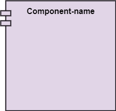

---

##### Structural things

- **Node**: 
  - A physical element that exists at run time.

---

##### Behavioral Things

- They are the verbs that encompass the dynamic parts of a model. 
- It depicts the behavior of a system. 
- They involve 
  - state machine, 
  - activity diagram, 
  - interaction diagram, 
  - grouping things, 
  - annotation things

---

##### Behavioral Things

- **State Machine**: 
  - It defines a sequence of states that an entity goes through in the software development lifecycle. 
  - It keeps a record of several distinct states of a system component.

---

##### Behavioral Things

- **Activity Diagram**: 
  - It portrays all the activities accomplished by different entities of a system. 
  - It is represented the same as that of a state machine diagram. It consists of an initial state, final state, a decision box, and an action notation.

---

##### Behavioral Things

- **Interaction Diagram**: 
  - It is used to envision the flow of messages between several components in a system.

---

##### Grouping Things

- It is a method that together binds the elements of the UML model. 
- In UML, the package is the only thing, which is used for grouping.

---

##### Grouping Things

- **Package**: Package is the only thing that is available for grouping behavioral and structural things.

---

##### Annotation Things

- It is a mechanism that captures the remarks, descriptions, and comments of UML model elements. 
- In UML, a note is the only Annotational thing.

---

##### Annotation Things

- **Note**: 
  - It is used to attach the constraints, comments, and rules to the elements of the model. 
  - It is a kind of yellow sticky note.

---

#### Relationships

- It illustrates the meaningful connections between things. It shows the association between the entities and defines the functionality of an application. There are four types of relationships 
  - **Dependency**
  - **Association**
  - **Generalization**
  - **Realization**

---

#### Relationships

- **Dependency**: 
  
  - Dependency is a kind of relationship in which a change in target element affects the source element, or simply we can say the source element is dependent on the target element. 
  - It is one of the most important notations in UML. It depicts the dependency from one entity to another.
  - It is denoted by a dotted line followed by an arrow at one side as shown below,
  
  

---

#### Relationships

- **Association**: 
  
  - A set of links that associates the entities to the UML model. 
  - It tells how many elements are actually taking part in forming that relationship.
  - It is denoted by a dotted line with arrowheads on both sides to describe the relationship with the element on both sides.
  
  

---

#### Relationships

- **Generalization**: 
  
  - It portrays the relationship between a general thing (a parent class or superclass) and a specific kind of that thing (a child class or subclass). 
  - It is used to describe the concept of inheritance.
  - It is denoted by a straight line followed by an empty arrowhead at one side.
  
  

---

#### Relationships

- **Realization**: 
  
  - It is a semantic kind of relationship between two things, where one defines the behavior to be carried out, and the other one implements the mentioned behavior. 
  - It exists in interfaces.
  - It is denoted by a dotted line with an empty arrowhead at one side.
  
  

---

#### Diagrams

- The diagrams are the graphical implementation of the models that incorporate symbols and text. 
- Each symbol has a different meaning in the context of the UML diagram. 
- There are thirteen different types of UML diagrams that are available in UML 2.0, such that each diagram has its own set of a symbol. 
- And each diagram manifests a different dimension, perspective, and view of the system.

---

#### Diagrams

- UML diagrams are classified into three categories that are given below:
  - **Structural Diagram**
  - **Behavioral Diagram**
  - **Interaction Diagram**

---

#### Diagrams

- **Structural Diagram**: 
  - It represents the static view of a system by portraying the structure of a system. 
  - It shows several objects residing in the system. Following are the structural diagrams given below:
    - **Class diagram**
    - **Object diagram**
    - **Package diagram**
    - **Component diagram**
    - **Deployment diagram**

---

#### Diagrams

- **Behavioral Diagram**: 
  - It depicts the behavioral features of a system. 
  - It deals with dynamic parts of the system. 
  - It encompasses the following diagrams:
    - **Activity diagram**
    - **State machine diagram**
    - **Use case diagram**

---

#### Diagrams

- **Interaction diagram**: 
  - It is a subset of behavioral diagrams. 
  - It depicts the interaction between two objects and the data flow between them. 
  - Following are the several interaction diagrams in UML:
    - **Timing diagram**
    - **Sequence diagram**
    - **Collaboration diagram**

---

## **UML Architecture**

---

### UML Architecture

- Software architecture is all about how a software system is built at its highest level. 
- It is needed to think big from multiple perspectives with quality and design in mind. The software team is tied to many practical concerns, such as:
  - The structure of the development team.
  - The needs of the business.
  - Development cycle.
  - The intent of the structure itself.

---

### UML Architecture

- Software architecture provides a basic design of a complete software system. 
- It defines the elements included in the system, the functions each element has, and how each element relates to one another. 
  - In short, it is a big picture or overall structure of the whole system, 
    - how everything works together

---

### UML Architecture

- To form an architecture, the software architect will take several factors into consideration:
  - What will the system be used for?
  - Who will be using the system?
  - What quality matters to them?
  - Where will the system run?

---

### UML Architecture

- The architect plans the structure of the system to meet the needs like these. 
- It is essential to have proper software architecture, mainly for a large software system. 
- Having a clear design of a complete system as a starting point provides a solid basis for developers to follow

---

### UML Architecture

- Each developer will know what needs to be implemented and how things relate to meet the desired needs efficiently. 
- One of the main advantages of software architecture is that it provides high productivity to the software team. The software development becomes more effective as it comes up with an explained structure in place to coordinate work, implement individual features, or ground discussions on potential issues. 
- With a lucid architecture, it is easier to know where the key responsibilities are residing in the system and where to make changes to add new requirements or simply fixing the failures.

---

### UML Architecture

- a clear architecture will help to achieve quality in the software with a well-designed structure using principles like separation of concerns; 
- the system becomes easier to maintain, reuse, and adapt. The software architecture is useful to people such as software developers, the project manager, the client, and the end-user. 
- Each one will have different perspectives to view the system and will bring different agendas to a project. Also, it provides a collection of several views

---

### UML Architecture

- It can be best understood as a collection of five views:
  - Use case view
  - Design view
  - Implementation view
  - Process view
  - Development view

---

### UML Architecture

---

### UML Architecture

#### Use case view

- It is a view that shows the functionality of the system as perceived by external actors.
- It reveals the requirements of the system.
- With UML, it is easy to capture the static aspects of this view in the use case diagrams, whereas it?s dynamic aspects are captured in interaction diagrams, state chart diagrams, and activity diagrams.

---

### UML Architecture

#### Design View

- It is a view that shows how the functionality is designed inside the system in terms of static structure and dynamic behavior.
- It captures the vocabulary of the problem space and solution space.
- With UML, it represents the static aspects of this view in class and object diagrams, whereas its dynamic aspects are captured in interaction diagrams, state chart diagrams, and activity diagrams.

---

### UML Architecture

#### Implementation View

- It is the view that represents the organization of the core components and files.
- It primarily addresses the configuration management of the system?s releases.
- With UML, its static aspects are expressed in component diagrams, and the dynamic aspects are captured in interaction diagrams, state chart diagrams, and activity diagrams.

---

### UML Architecture

#### Process View

- It is the view that demonstrates the concurrency of the system.
- It incorporates the threads and processes that make concurrent system and synchronized mechanisms.
- It primarily addresses the system's scalability, throughput, and performance.
- Its static and dynamic aspects are expressed the same way as the design view but focus more on the active classes that represent these threads and processes.

---

### UML Architecture

#### Deployment View

- It is the view that shows the deployment of the system in terms of physical architecture.
- It includes the nodes, which form the system hardware topology where the system will be executed.
- It primarily addresses the distribution, delivery, and installation of the parts that build the physical system.

---

## **UML Diagrams Overview**

---

### UML Diagrams Overview

- The UML diagrams are categorized into 
  - **structural diagrams**, 
  - **behavioral diagrams**, and also 
  - **interaction overview diagrams**. 

---

### UML Diagrams Overview

---

#### Structural Diagrams

Structural diagrams depict a static view or structure of a system. It is widely used in the documentation of software architecture. It embraces class diagrams, composite structure diagrams, component diagrams, deployment diagrams, object diagrams, and package diagrams. It presents an outline for the system. It stresses the elements to be present that are to be modeled.

---

#### Structural Diagrams

**Class Diagram**: 

- Class diagrams are one of the most widely used diagrams. It is the backbone of all the object-oriented software systems. 
- It depicts the static structure of the system. 
- It displays the system's class, attributes, and methods. 
- It is helpful in recognizing the relation between different objects as well as classes.

---

#### Structural Diagrams

**Composite Structure Diagram**: 

- The composite structure diagrams show parts within the class. 
- It displays the relationship between the parts and their configuration that ascertain the behavior of the class. 
- It makes full use of ports, parts, and connectors to portray the internal structure of a structured classifier. 
- It is similar to class diagrams, just the fact it represents individual parts in a detailed manner when compared with class diagrams.

---

#### Structural Diagrams

**Object Diagram**: 

- It describes the static structure of a system at a particular point in time. 
- It can be used to test the accuracy of class diagrams. 
- It represents distinct instances of classes and the relationship between them at a time.

---

#### Structural Diagrams

**Component Diagram**: 

- It portrays the organization of the physical components within the system. 
- It is used for modeling execution details. 
- It determines whether the desired functional requirements have been considered by the planned development or not, as it depicts the structural relationships between the elements of a software system.

---

#### Structural Diagrams

**Deployment Diagram**: 

- It presents the system's software and its hardware by telling what the existing physical components are and what software components are running on them. 
- It produces information about system software. 
- It is incorporated whenever software is used, distributed, or deployed across multiple machines with dissimilar configurations.

---

#### Structural Diagrams

**Package Diagram**: 

- It is used to illustrate how the packages and their elements are organized. 
- It shows the dependencies between distinct packages. 
- It manages UML diagrams by making it easily understandable. 
- It is used for organizing the class and use case diagrams.

---

#### Behavioral Diagrams

- Behavioral diagrams portray a dynamic view of a system or the behavior of a system, which describes the functioning of the system. 
- It includes use case diagrams, state diagrams, and activity diagrams. 
- It defines the interaction within the system.

---

#### Behavioral Diagrams

**State Machine Diagram**: 

- It is a behavioral diagram. 
- it portrays the system's behavior utilizing finite state transitions. 
- It is also known as the State-charts diagram. 
- It models the dynamic behavior of a class in response to external stimuli.

---

#### Behavioral Diagrams

**Activity Diagram**: 

- It models the flow of control from one activity to the other. 
- With the help of an activity diagram, we can model sequential and concurrent activities. 
- It visually depicts the workflow as well as what causes an event to occur.

---

#### Behavioral Diagrams

**Use Case Diagram**: 

- It represents the functionality of a system by utilizing actors and use cases. 
- It encapsulates the functional requirement of a system and its association with actors. 
- It portrays the use case view of a system.

---

#### Interaction Diagrams

- Interaction diagrams are a subclass of behavioral diagrams that give emphasis to object interactions and also depicts the flow between various use case elements of a system. 
- In simple words, it shows how objects interact with each other and how the data flows within them. 
- It consists of communication, interaction overview, sequence, and timing diagrams

---

#### Interaction Diagrams

**Sequence Diagram**: 

- It shows the interactions between the objects in terms of messages exchanged over time. 
- It delineates in what order and how the object functions are in a system.

---

#### Interaction Diagrams

**Communication Diagram**: 

- It shows the interchange of sequence messages between the objects. 
- It focuses on objects and their relations. 
- It describes the static and dynamic behavior of a system.

---

#### Interaction Diagrams

**Timing Diagram**: 

- It is a special kind of sequence diagram used to depict the object's behavior over a specific period of time. 
- It governs the change in state and object behavior by showing the time and duration constraints.

---

#### Interaction Diagrams

**Interaction Overview diagram**: 

- It is a mixture of activity and sequence diagram that depicts a sequence of actions to simplify the complex interactions into simple interactions.

---

## **UML Relationship**

---

### UML Relationship

- Relationships depict a connection between several things, such as structural, behavioral, or grouping things in the unified modeling language. 
- Since it is termed as a link, it demonstrates how things are interrelated to each other at the time of system execution. 
- It constitutes four types of relationships, i.e., 
  - **dependency**, 
  - **association**, 
  - **generalization**, and 
  - **realization**.

---

### UML Relationship

#### Dependency

- Whenever there is a change in either the structure or the behavior of the class that affects the other class, such a relationship is termed as a dependency. 
- Or, simply, we can say a class contained in other class is known as dependency. 
- It is a unidirectional relationship.

---

### UML Relationship

#### Association

- Association is a structural relationship that represents how two entities are linked or connected to each other within a system. 
- It can form several types of associations, such as
  - **one-to-one**, 
  - **one-to-many**, 
  - **many-to-one**, and 
  - **many-to-many**. 
- A ternary association is one that constitutes three links. 
- It portrays the static relationship between the entities of two classes.

---

### UML Relationship

#### Association

- An association can be categorized into four types of associations, i.e., 
  - **bi-directional**, 
  - **unidirectional**, 
  - **aggregation** (**composition aggregation**), and 
  - **reflexive**, 
- such that an aggregation is a special form of association and 
- **composition** is a special form of **aggregation**. 
- The mostly used associations are **unidirectional** and **bi-directional**.

---

### UML Relationship

#### Aggregation

- An aggregation is a special form of association. 
- It portrays a part-of relationship. 
- It forms a binary relationship, which means it cannot include more than two classes. 
- It is also known as Has-a relationship. 
- It specifies the direction of an object contained in another object. 
- In aggregation, a child can exist independent of the parent.

---

### UML Relationship

#### Composition

- In a composition relationship, the child depends on the parent. 
- It forms a two-way relationship. 
- It is a special case of aggregation. 
- It is known as Part-of relationship.

---

### UML Relationship

#### Aggregation vs Composition Relationship

| Features                 | Aggregation Relationship                                                                                                   | Composition Relationship                                                              |
| ------------------------ | -------------------------------------------------------------------------------------------------------------------------- | ------------------------------------------------------------------------------------- |
| **Dependency**           | In an aggregation relationship, a child can exist independent of a parent.                                                 | In a composition relationship, the child cannot exist independent of the parent.      |
| **Type of Relationship** | It constitutes a Has-a relationship.                                                                                       | It constitutes Part-of relationship.                                                  |
| **Type of Association**  | It forms a weak association.                                                                                               | It forms a strong association.                                                        |
| **Examples**             | A doctor has patients when the doctor gets transfer to another hospital, the patients do not accompany to a new workplace. | A hospital and its wards. If the hospital is destroyed, the wards also get destroyed. |

---

### UML Relationship

#### Generalization

- The generalization relationship implements the object-oriented concept called inheritance or is-a relationship. 
- It exists between two objects (things or entities), such that one entity is a parent (superclass or base class), and the other one is a child (subclass or derived class
- These are represented in terms of inheritance. 
- Any child can access, update, or inherit the functionality, structure, and behavior of the parent.

---

### UML Relationship

#### Realization

- It is a kind of relationship in which one thing specifies the behavior or a responsibility to be carried out, and the other thing carries out that behavior. 
- It can be represented on a class diagram or component diagrams. 
- The realization relationship is constituted between interfaces, classes, packages, and components to link a client element to the supplier element.

---

## **UML Association vs. Aggregation vs. Composition**

---

### UML Association vs. Aggregation vs. Composition

- In UML diagrams, relationships are used to link several things. It is a connection between structural, behavioral, or grouping things. Following are the standard UML relationships enlisted below:
  - **Association**
  - **Dependency**
  - **Generalization**
  - **Realization**

---

### UML Association vs. Aggregation vs. Composition

#### Association

- Association relationship is a structural relationship in which different objects are linked within the system. It exhibits a binary relationship between the objects representing an activity. It depicts the relationship between objects, such as a teacher, can be associated with multiple teachers.

- It is represented by a line between the classes followed by an arrow that navigates the direction, and when the arrow is on both sides, it is then called a bidirectional association. We can specify the multiplicity of an association by adding the adornments on the line that will denote the association.

---

### UML Association vs. Aggregation vs. Composition

#### Association

A single teacher has multiple students.

---

### UML Association vs. Aggregation vs. Composition

#### Association

A single student can associate with many teachers.

---

### UML Association vs. Aggregation vs. Composition

- The composition and aggregation are two subsets of association. 
- In both of the cases, the object of one class is owned by the object of another class; 
- the only difference is that in composition, 
  - the child does not exist independently of its parent, whereas in aggregation, 
  - the child is not dependent on its parent i.e., standalone. 
- An aggregation is a special form of association, and 
- composition is the special form of aggregation.

---

### UML Association vs. Aggregation vs. Composition

---

### UML Association vs. Aggregation vs. Composition

#### Aggregation

- Aggregation is a subset of association, is a collection of different things. 
- It represents has a relationship. 
- It is more specific than an association. 
- It describes a part-whole or part-of relationship. 
- It is a binary association, 
  - i.e., it only involves two classes. 
- It is a kind of relationship in which the child is independent of its parent.

---

### UML Association vs. Aggregation vs. Composition

#### Aggregation

- Here we are considering a car and a wheel example. 
- A car cannot move without a wheel. 
- But the wheel can be independently used with the bike, scooter, cycle, or any other vehicle. 
- The wheel object can exist without the car object, which proves to be an aggregation relationship.

---

### UML Association vs. Aggregation vs. Composition

#### Composition

- The composition is a part of aggregation, and it portrays the whole-part relationship. 
- It depicts dependency between a composite (parent) and its parts (children), 
  - which means that if the composite is discarded, so will its parts get deleted. It exists between similar objects.

---

### UML Association vs. Aggregation vs. Composition

#### Composition

- the composition association relationship connects the Person class with Brain class, Heart class, and Legs class. 
- If the person is destroyed, the brain, heart, and legs will also get discarded.

---

### UML Association vs. Aggregation vs. Composition

| Association                                             | Aggregation                                                                                  | Composition                                                                                     |
| ------------------------------------------------------- | -------------------------------------------------------------------------------------------- | ----------------------------------------------------------------------------------------------- |
| Association relationship is represented using an arrow. | Aggregation relationship is represented by a straight line with an empty diamond at one end. | The composition relationship is represented by a straight line with a black diamond at one end. |
| In UML, it can exist between two or more classes.       | It is a part of the association relationship.                                                | It is a part of the aggregation relationship.                                                   |

---

### UML Association vs. Aggregation vs. Composition

| Association                                                                                             | Aggregation                                                                                                | Composition                                                                                                      |
| ------------------------------------------------------------------------------------------------------- | ---------------------------------------------------------------------------------------------------------- | ---------------------------------------------------------------------------------------------------------------- |
| It incorporates one-to-one, one-to-many, many-to-one, and many-to-many association between the classes. | It exhibits a kind of weak relationship.                                                                   | It exhibits a strong type of relationship.                                                                       |
| It can associate one more objects together.                                                             | In an aggregation relationship, the associated objects exist independently within the scope of the system. | In a composition relationship, the associated objects cannot exist independently within the scope of the system. |

---

### UML Association vs. Aggregation vs. Composition

| Association                                                                      | Aggregation                                                                                     | Composition                                                               |
| -------------------------------------------------------------------------------- | ----------------------------------------------------------------------------------------------- | ------------------------------------------------------------------------- |
| In this, objects are linked together.                                            | In this, the linked objects are independent of each other.                                      | Here the linked objects are dependent on each other.                      |
| It may or may not affect the other associated element if one element is deleted. | Deleting one element in the aggregation relationship does not affect other associated elements. | It affects the other element if one of its associated element is deleted. |

---

### UML Association vs. Aggregation vs. Composition

| Association                                                                                                 | Aggregation                                                                                                                                 | Composition |
| ----------------------------------------------------------------------------------------------------------- | ------------------------------------------------------------------------------------------------------------------------------------------- | ----------- |
| Example: A tutor can associate with multiple students, or one student can associate with multiple teachers. | Example: A car needs a wheel for its proper functioning, but it may not require the same wheel. It may function with another wheel as well. |             |

---

## **UML- Association**

---

### UML- Association

- Association is the semantic relationship between classes that shows how one instance is connected or merged with others in a system. 
- The objects are combined either logically or physically. 
- Since it connects the object of one class to the object of another class, it is categorized as a structural relationship

---

### UML- Association

- Following are the constraints applied to the association relationship
  - **{implicit}**: As the name suggests, the implicit constraints define that the relationship is not visible, but it is based on a concept.
  - **{ordered}**: It describes that the set of entities is in a particular way at one end in an association.
  - **{changeable}**: The changeable constraint ensures that the connections between several objects within a system are added, improved, and detached, as and when required.
  - **{addOnly}**: It specifies that any new connection can be added from an object located at the other end in an association.
  - **{frozen}**: The frozen constraint specifies that whenever a link is added between objects, it cannot be altered by the time it is activated over the connection or given link

---

### Reflexive Association

- In the reflexive associations, the links are between the objects of the same classes. 
- In other words, it can be said that the reflexive association consists of the same class at both ends.
- An object can also be termed as an instance.

---

### Reflexive Association

- The vegetable class has two objects, i.e., onion and eggplant. According to the reflexive association's definition, the link between the onion and eggplant exist, as they belong to the same class, i.e., vegetable.

---

### Directed Association

- The directed association is concerned with the direction of flow inside association classes. 
- The flow of association can be shown by employing a directed association. 
- The directed association between two classes is represented by a line with an arrowhead, which indicates the navigation direction. 
- The flow of association from one class to another is always in one direction

---

### Directed Association

- It can be said that there is an association between a person and the company. 
- The person works for the company. 
- Here the person works for the company, and not the company works for a person

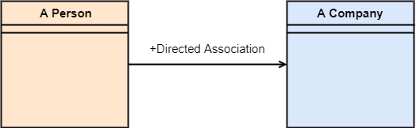

---

## **UML-Dependency**

---

### UML-Dependency

- Dependency depicts how various things within a system are dependent on each other. 
- In UML, a dependency relationship is the kind of relationship in which a client (one element) is dependent on the supplier (another element). 
- It is used in class diagrams, component diagrams, deployment diagrams, and use-case diagrams, which indicates that a change to the supplier necessitates a change to the client. 

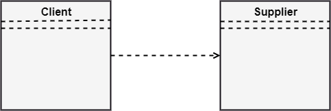

---

### Types of Dependency Relationship (1 of 6)

*Following are the type of dependency relationships, keywords, or stereotypes given below*:

- `<<derive>>` -It is a constraint that specifies the template can be initialized by the source at the target location utilizing given parameters.

- `<<derive>>` -It represents that the source object's location can be evaluated from the target object.

- `<<friend>>` -It states the uniqueness of the source in the target object.

- `<<instanceOf>>` -It states that an instance of a target classifier is the source object.

---

### Types of Dependency Relationship (2 of 6)

*Following are the type of dependency relationships, keywords, or stereotypes given below*:

- `<<instantiate>>` -It defines the capability of the source object, creating instances of a target object.

- `<<refine>>` -It states that the source object comprises of exceptional abstraction than that of the target object.

- `<<use>>` -When the packages are created in UML, the use of stereotype is used as it describes that the elements of the source package can also exist in the target package. It specifies that the source package uses some of the elements of the target package.

---

### Types of Dependency Relationship (3 of 6)

*Following are the type of dependency relationships, keywords, or stereotypes given below*:

- `<<substitute>>` -The substitute stereotype state that the client can be substituted at the runtime for the supplier.

- `<<access>>` -It is also called as private merging in which the source package accesses the element of the target package.

- `<<import>>` -It specifies that target imports the source package's element as they are defined within the target. It is also known as public merging.

---

### Types of Dependency Relationship (4 of 6)

*Following are the type of dependency relationships, keywords, or stereotypes given below*:

- `<<permit>>` -It describes that the source element can access the supplier element or whatever visibility is provided by the supplier.

- `<<extend>>` -It states that the behavior of the source element can be extended by the target.

- `<<include>>` -It describes the source element, which can include the behavior of another element at a specific location, just like a function call in C/C++.

---

### Types of Dependency Relationship (5 of 6)

*Following are the type of dependency relationships, keywords, or stereotypes given below*:

- `<<become>>` -It states that target is similar to the source with distinct roles and values.

- `<<call>>` -It specifies that the target object can be invoked by the source.

- `<<copy>>` -It states that the target is an independent replica of a source object.

---

### Types of Dependency Relationship (6 of 6)

*Following are the type of dependency relationships, keywords, or stereotypes given below*:

- `<<parameter>>` -It describes that the supplier is a parameter of the client's actions.

- `<<send>>` -The client act as an operation, which sends some unspecified targets to the supplier.

---

## **UML-Generalization**

---

### UML-Generalization

---

### UML-Generalization

- In UML modeling, a generalization relationship is a relationship that implements the concept of object orientation called inheritance. 

- The generalization relationship occurs between two entities or objects, such that one entity is the parent, and the other one is the child. 

---

### UML-Generalization

- The child inherits the functionality of its parent and can access as well as update it.

- Generalization relationship is utilized in class, component, deployment, and use case diagrams to specify that the child inherits actions, characteristics, and relationships from its parent.

---

### UML-Generalization

- To meet UML's standard, it necessitates usage of the same types of model elements in the generalization relationship, i.e., generalization relation can either be used between actors or between use cases, but not between an actor and a use case.

- The generalization relationship is incorporated to record attributes, operations, and relationships in a parent model element so that it can be inherited in one or more child model elements.

---

### UML-Generalization

- The parent model element can have as many children, and also, the child can have one or more parents. But most commonly, 

- it can be seen that there is one parent model element and multiple child model elements. 

---

### UML-Generalization

- The generalization relationship does not consist of names. 
- The generalization relationship is represented by a solid line with a hollow arrowhead pointing towards the parent model element from the child model element.

---

### Stereotypes and their constraints

---

### Stereotypes and their constraints

- `<<implementation>>` - It is used to show that the child is implemented by its parent, such that the child object inherits the structure and behavior of its parent object without disobeying the rules. 
  - The implementation of stereotype is mostly used in single inheritance.

---

### Stereotypes and their constraints

- In the generalization stereotype, there are two types of constraints that are complete and incomplete to check if all the child objects are involved or not in the relationship.

---

### Stereotypes and their constraints

- As we know, the bank account can be of two types; 
  - Savings Account and 
  - Credit Card Account. 
- Both the savings and the credit card account inherits the generalized properties from the Bank Account, which is Account Number, Account Balance, etc.

---

## **UML-Realization**

---

### UML-Realization

- In UML modeling, the realization is a relationship between two objects, where the client (one model element) implements the responsibility specified by the supplier (another model element). 
- The realization relationship can be employed in class diagrams and components diagrams.
- The realization relationship does not have names. 
- It is mostly found in the interfaces. 
- It is represented by a dashed line with a hollow arrowhead at one end that points from the client to the server.

---

### Interface Realization

- Interface realization is a kind of specialized relation between the classifier and the interface. 

- In interface realization relationship, realizing classifiers conforms to the contract defined by the interface.

---

### Interface Realization

- A classifier implementing an interface identifies the objects that conform to the interface and any of its ancestors. 

- A classifier can execute one or more interfaces. The set of interfaces that are implemented by the classifier are its given interfaces. 

---

### Interface Realization

- The given interfaces are the set of services offered by the classifiers to its clients.

- The interface realization relationship does not contain names, and if you name it, then the name will appear beside the connector in the diagram.

---

### Interface Realization

- The interface realization relationship is represented by a dashed line with a hollow arrowhead, which points from the classifier to the given interface.

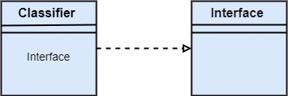

---

### Types of realization

- Canonical form
- Elided form

---

#### Canonical form

- In UML, the canonical form realizes the interfaces across the system. 
- An interface stereotype is used for creating an interface, and a realization relationship is employed to realize (implement) a specific interface. 
- In this, the realization relationship is represented by a dashed line with a hollow arrowhead, and the interface is implemented using an object.

---

#### Canonical form

- From the diagram given below, it can be seen that the object Account Business Rules realizes the interface Iruleagent.

---

### Elided form

---

### Elided form

- It is that kind of realization relationship in which the interface is represented by a circle, also known as a lollipop notation. 
- When an interface is realized employing anything present in the system, then an elided structure is created.
- Here the interface Iruleagent is denoted by an elided form, which is realized by acctrule.dll.

---

## **UML Class Diagram**

---

### UML Class Diagram

The class diagram depicts a static view of an application. It represents the types of objects residing in the system and the relationships between them. A class consists of its objects, and also it may inherit from other classes. A class diagram is used to visualize, describe, document various different aspects of the system, and also construct executable software code.

It shows the attributes, classes, functions, and relationships to give an overview of the software system. It constitutes class names, attributes, and functions in a separate compartment that helps in software development. Since it is a collection of classes, interfaces, associations, collaborations, and constraints, it is termed as a structural diagram.

---

### Purpose of Class Diagrams

The main purpose of class diagrams is to build a static view of an application. It is the only diagram that is widely used for construction, and it can be mapped with object-oriented languages. It is one of the most popular UML diagrams. Following are the purpose of class diagrams given below:

- It analyses and designs a static view of an application.
- It describes the major responsibilities of a system.
- It is a base for component and deployment diagrams.
- It incorporates forward and reverse engineering.

---

### Benefits of Class Diagrams

- It can represent the object model for complex systems.
- It reduces the maintenance time by providing an overview of - how an application is structured before coding.
- It provides a general schematic of an application for - better understanding.
- It represents a detailed chart by highlighting the desired - code, which is to be programmed.
- It is helpful for the stakeholders and the developers.

---

### Vital components of a Class Diagram

- Upper Section
- Middle Section
- Lower Section
  

---

#### Upper Section: (the name of the class)

- The upper section encompasses the name of the class. A class is a representation of similar objects that shares the same relationships, attributes, operations, and semantics. Some of the following rules that should be taken into account while representing a class are given below:
  
  - Capitalize the initial letter of the class name.
  - Place the class name in the center of the upper section.
  - A class name must be written in bold format.
  - The name of the abstract class should be written in italics format.
  
  

---

#### Middle Section: (attributes)

- The middle section constitutes the attributes, which describe the quality of the class. The attributes have the following characteristics:
- The attributes are written along with its visibility - factors, which are `public (+)`, `private (-)`, `protected (#)`, - and `package (~)`.
- The accessibility of an attribute class is illustrated by - the visibility factors.
- A meaningful name should be assigned to the attribute, which will explain its usage inside the class.

---

#### Lower Section: (methods)

- The lower section contain methods or operations. 
- The methods are represented in the form of a list, where each method is written in a single line. 
- It demonstrates how a class interacts with data.

---

### Relationships

In UML, relationships are of three types:

- Dependency
- Generalization
- Association

---

#### Dependency:

- A dependency is a semantic relationship between two or more classes where a change in one class cause changes in another class. 
- It forms a weaker relationship.
- In the following example, Student_Name is dependent on the Student_Id.

---

#### Generalization:

- A generalization is a relationship between a parent class (superclass) and a child class (subclass). 
- In this, the child class is inherited from the parent class.
- For example, The Current Account, Saving Account, and Credit Account are the generalized form of Bank Account.

---

#### Association:

- It describes a static or physical connection between two or more objects. 
- It depicts how many objects are there in the relationship.
- For example, a department is associated with the college.

---

$Also...$

---

#### Multiplicity:

- It defines a specific range of allowable instances of attributes. In case if a range is not specified, one is considered as a default multiplicity.

- For example, multiple patients are admitted to one hospital.

---

#### Aggregation:

- An aggregation is a subset of association, which represents has a relationship. It is more specific then association. It defines a part-whole or part-of relationship. In this kind of relationship, the child class can exist independently of its parent class.

- The company encompasses a number of employees, and even if one employee resigns, the company still exists.

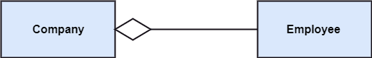

---

#### Composition:

- The composition is a subset of aggregation. It portrays the dependency between the parent and its child, which means if one part is deleted, then the other part also gets discarded. It represents a whole-part relationship.

- A contact book consists of multiple contacts, and if you delete the contact book, all the contacts will be lost.

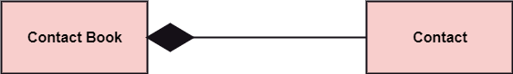

---

### Abstract Classes

- In the abstract class, no objects can be a direct entity of the abstract class. The abstract class can neither be declared nor be instantiated. It is used to find the functionalities across the classes. The notation of the abstract class is similar to that of class; 

- the only difference is that the name of the class is written in italics. Since it does not involve any implementation for a given function, it is best to use the abstract class with multiple objects.

- Let us assume that we have an abstract class named displacement with a method declared inside it, and that method will be called as a drive (). Now, this abstract class method can be implemented by any object, for example, car, bike, scooter, cycle, etc.

---

### How to draw a Class Diagram?

The class diagram is used most widely to construct software applications. It not only represents a static view of the system but also all the major aspects of an application. A collection of class diagrams as a whole represents a system.

---

### How to draw a Class Diagram?

Some key points that are needed to keep in mind while drawing a class diagram are given below:

- To describe a complete aspect of the system, it is - suggested to give a meaningful name to the class diagram.
- The objects and their relationships should be acknowledged - in advance.
- The attributes and methods (responsibilities) of each class - must be known.
- A minimum number of desired properties should be specified - as more number of the unwanted property will lead to a - complex diagram.
- Notes can be used as and when required by the developer to - describe the aspects of a diagram.
- The diagrams should be redrawn and reworked as many times - to make it correct before producing its final version.

---

### Class Diagram Example

A class diagram describing the sales order system is given below.

---

### Usage of Class diagrams

The class diagram is used to represent a static view of the system. It plays an essential role in the establishment of the component and deployment diagrams. It helps to construct an executable code to perform forward and backward engineering for any system, or we can say it is mainly used for construction. It represents the mapping with object-oriented languages that are C++, Java, etc. Class diagrams can be used for the following purposes:

---

### Usage of Class diagrams

- To describe the static view of a system.
- To show the collaboration among every instance in the static view.
- To describe the functionalities performed by the system.
- To construct the software application using object-oriented languages.

---

## **UML Object Diagram**

---

### UML Object Diagram

- Object diagrams are dependent on the class diagram as they are derived from the class diagram. It represents an instance of a class diagram. The objects help in portraying a static view of an object-oriented system at a specific instant.

- Both the object and class diagram are similar to some extent; the only difference is that the class diagram provides an abstract view of a system. It helps in visualizing a particular functionality of a system.

---

### Notation of an Object Diagram

---

### Purpose of Object Diagram

The object diagram holds the same purpose as that of a class diagram. The class diagram provides an abstract view which comprises of classes and their relationships, whereas the object diagram represents an instance at a particular point of time.

---

### Purpose of Object Diagram

The object diagram is actually similar to the concrete (actual) system behavior. The main purpose is to depict a static view of a system.

---

### Purpose of Object Diagram

Following are the purposes enlisted below:

- It is used to perform forward and reverse engineering.
- It is used to understand object behavior and their - relationships practically.
- It is used to get a static view of a system.
- It is used to represent an instance of a system.

---

### Example of Object Diagram

---

### How to draw an Object Diagram?

- All the objects present in the system should be examined - before start drawing the object diagram.
- Before creating the object diagram, the relation between - the objects must be acknowledged.
- The association relationship among the entities must be - cleared already.
- To represent the functionality of an object, a proper - meaningful name should be assigned.
- The objects are to be examined to understand its functionality.

---

### Applications of Object diagrams

The following are the application areas where the object diagrams can be used.

- To build a prototype of a system.
- To model complex data structures.
- To perceive the system from a practical perspective.
- Reverse engineering.

---

### Class vs. Object diagram

| Class Diagram                                                        | Object Diagram                                           |
| -------------------------------------------------------------------- | -------------------------------------------------------- |
| It depicts the static view of a system.                              | It portrays the real-time behavior of a system.          |
| Dynamic changes are not included in the class diagram.               | Dynamic changes are captured in the object diagram.      |
| The data values and attributes of an instance are not involved here. | It incorporates data values and attributes of an entity. |
| The object behavior is manipulated in the class diagram.             |                                                          |

---

## **UML Component Diagram**

---

### UML Component Diagram

A component diagram is used to break down a large object-oriented system into the smaller components, so as to make them more manageable. It models the physical view of a system such as executables, files, libraries, etc. that resides within the node.

It visualizes the relationships as well as the organization between the components present in the system. It helps in forming an executable system. A component is a single unit of the system, which is replaceable and executable. The implementation details of a component are hidden, and it necessitates an interface to execute a function. It is like a black box whose behavior is explained by the provided and required interfaces.

---

### Notation of a Component Diagram

- Component

- Node

---

### Purpose of a Component Diagram

Since it is a special kind of a UML diagram, it holds distinct purposes. It describes all the individual components that are used to make the functionalities, but not the functionalities of the system. It visualizes the physical components inside the system. The components can be a library, packages, files, etc.

The component diagram also describes the static view of a system, which includes the organization of components at a particular instant. The collection of component diagrams represents a whole system.

---

### Purpose of a Component Diagram

The main purpose of the component diagram are enlisted below:

- It envisions each component of a system.
- It constructs the executable by incorporating forward and reverse engineering.
- It depicts the relationships and organization of components.

---

### Why use Component Diagram?

The component diagrams have remarkable importance. It is used to depict the functionality and behavior of all the components present in the system, unlike other diagrams that are used to represent the architecture of the system, working of a system, or simply the system itself.

In UML, the component diagram portrays the behavior and organization of components at any instant of time. The system cannot be visualized by any individual component, but it can be by the collection of components.

---

### Why use Component Diagram?

Following are some reasons for the requirement of the component diagram:

- It portrays the components of a system at the runtime.
- It is helpful in testing a system.
- It envisions the links between several connections.

---

### When to use a Component Diagram?

It represents various physical components of a system at runtime. It is helpful in visualizing the structure and the organization of a system. It describes how individual components can together form a single system. 

---

### When to use a Component Diagram?

Following are some reasons, which tells when to use component diagram:

- To divide a single system into multiple components according to the functionality.
- To represent the component organization of the system.

---

### How to Draw a Component Diagram?

The component diagram is helpful in representing the physical aspects of a system, which are files, executables, libraries, etc. The main purpose of a component diagram is different from that of other diagrams. It is utilized in the implementation phase of any application.

Once the system is designed employing different UML diagrams, and the artifacts are prepared, the component diagram is used to get an idea of implementation. It plays an essential role in implementing applications efficiently.

---

### How to Draw a Component Diagram?

Following are some artifacts that are needed to be identified before drawing a component diagram:

- What files are used inside the system?
- What is the application of relevant libraries and artifacts?
- What is the relationship between the artifacts?

---

### How to Draw a Component Diagram?

Following are some points that are needed to be kept in - mind after the artifacts are identified:

- Using a meaningful name to ascertain the component for - which the diagram is about to be drawn.
- Before producing the required tools, a mental layout is to be made.
- To clarify the important points, notes can be incorporated.

---

### Example of a Component Diagram

A component diagram for an online shopping system is given below:

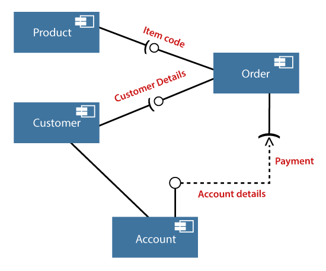

---

### Where to use Component Diagrams?

The component diagram is a special purpose diagram, which is used to visualize the static implementation view of a system. It represents the physical components of a system, or we can say it portrays the organization of the components inside a system. The components, such as libraries, files, executables, etc. are first needed to be organized before the implementation.

---

### Where to use Component Diagrams?

The component diagram can be used for the followings:

- To model the components of the system.
- To model the schemas of a database.
- To model the applications of an application.
- To model the system's source code.

---

## **UML Deployment Diagram**

---

### UML Deployment Diagram

The deployment diagram visualizes the physical hardware on which the software will be deployed. It portrays the static deployment view of a system. It involves the nodes and their relationships.

It ascertains how software is deployed on the hardware. It maps the software architecture created in design to the physical system architecture, where the software will be executed as a node. Since it involves many nodes, the relationship is shown by utilizing communication paths.

---

### Purpose of Deployment Diagram

The main purpose of the deployment diagram is to represent how software is installed on the hardware component. It depicts in what manner a software interacts with hardware to perform its execution.

Both the deployment diagram and the component diagram are closely interrelated to each other as they focus on software and hardware components. The component diagram represents the components of a system, whereas the deployment diagram describes how they are actually deployed on the hardware.

The deployment diagram does not focus on the logical components of the system, but it put its attention on the hardware topology.

---

### Purpose of Deployment Diagram

Following are the purposes of deployment diagram enlisted below:

- To envision the hardware topology of the system.
- To represent the hardware components on which the software - components are installed.
- To describe the processing of nodes at the runtime.

---

### Symbol and notation of Deployment diagram

The deployment diagram consist of the following notations:

- A component
- An artifact
- An interface
- A node

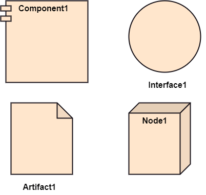

---

### How to draw a Deployment Diagram?

The deployment diagram portrays the deployment view of the system. It helps in visualizing the topological view of a system. It incorporates nodes, which are physical hardware. The nodes are used to execute the artifacts. The instances of artifacts can be deployed on the instances of nodes.

---

### How to draw a Deployment Diagram?

Since it plays a critical role during the administrative process, it involves the following parameters:

- High performance
- Scalability
- Maintainability
- Portability
- Easily understandable

---

### How to draw a Deployment Diagram?

- One of the essential elements of the deployment diagram is the nodes and artifacts. 
- So it is necessary to identify all of the nodes and the relationship between them. 
- It becomes easier to develop a deployment diagram if all of the nodes, artifacts, and their relationship is already known.

---

### Example of a Deployment diagram

- A deployment diagram for the Apple iTunes application is given below.

---

### Example of a Deployment diagram

- The iTunes setup can be downloaded from the iTunes website, and also it can be installed on the home computer. Once the installation and the registration are done, iTunes application can easily interconnect with the Apple iTunes store. Users can purchase and download music, video, TV serials, etc. and cache it in the media library.

---

### Example of a Deployment diagram

- Devices like Apple iPod Touch and Apple iPhone can update its own media library from the computer with iTunes with the help of USB or simply by downloading media directly from the Apple iTunes store using wireless protocols, for example; Wi-Fi, 3G, or EDGE.

---

### When to use a Deployment Diagram?

The deployment diagram is mostly employed by network engineers, system administrators, etc. with the purpose of representing the deployment of software on the hardware system. It envisions the interaction of the software with the hardware to accomplish the execution. The selected hardware must be of good quality so that the software can work more efficiently at a faster rate by producing accurate results in no time.

---

### When to use a Deployment Diagram?

The software applications are quite complex these days, as they are standalone, distributed, web-based, etc. So, it is very necessary to design efficient software.

---

### When to use a Deployment Diagram?

Deployment diagrams can be used for the followings:

- To model the network and hardware topology of a system.
- To model the distributed networks and systems.
- Implement forwarding and reverse engineering processes.
- To model the hardware details for a client/server system.
- For modeling the embedded system.

---

## **UML Interaction Diagram**

---

### UML Interaction Diagram

UML Interaction Diagram
As the name suggests, the interaction diagram portrays the interactions between distinct entities present in the model. It amalgamates both the activity and sequence diagrams. The communication is nothing but units of the behavior of a classifier that provides context for interactions.

---

### UML Interaction Diagram

A set of messages that are interchanged between the entities to achieve certain specified tasks in the system is termed as interaction. It may incorporate any feature of the classifier of which it has access. In the interaction diagram, the critical component is the messages and the lifeline.

---

### UML Interaction Diagram

In UML, the interaction overview diagram initiates the interaction between the objects utilizing message passing. While drawing an interaction diagram, the entire focus is to represent the relationship among different objects which are available within the system boundary and the message exchanged by them to communicate with each other.

---

### UML Interaction Diagram

The message exchanged among objects is either to pass some information or to request some information. And based on the information, the interaction diagram is categorized into the sequence diagram, collaboration diagram, and timing diagram.

---

### UML Interaction Diagram

The sequence diagram envisions the order of the flow of messages inside the system by depicting the communication between two lifelines, just like a time-ordered sequence of events.

---

### UML Interaction Diagram

The collaboration diagram, which is also known as the communication diagram, represents how lifelines connect within the system, whereas the timing diagram focuses on that instant when a message is passed from one element to the other.

---

### Notation of an Interaction Diagram

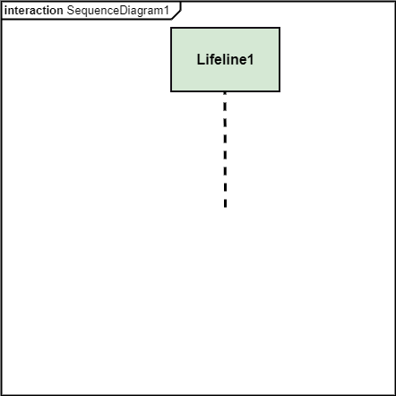

---

## Purpose of an Interaction Diagram

- The interaction diagram helps to envision the interactive (dynamic) behavior of any system. It portrays how objects residing in the system communicates and connects to each other. It also provides us with a context of communication between the lifelines inside the system.

---

## Purpose of an Interaction Diagram

- Following are the purpose of an interaction diagram given below:
  - To visualize the dynamic behavior of the system.
  - To envision the interaction and the message flow in the system.
  - To portray the structural aspects of the entities within the system.
  - To represent the order of the sequenced interaction in the system.
  - To visualize the real-time data and represent the architecture of an object-oriented system.

---

## How to draw an Interaction Diagram?

- Since the main purpose of an interaction diagram is to visualize the dynamic behavior of the system, it is important to understand what a dynamic aspect really is and how we can visualize it. The dynamic aspect is nothing but a screenshot of the system at the run time.

---

## How to draw an Interaction Diagram?

- Before drawing an interaction diagram, the first step is to discover the scenario for which the diagram will be made. Next, we will identify various lifelines that will be invoked in the communication, and then we will classify each lifeline. After that, the connections are investigated and how the lifelines are interrelated to each other.

---

## How to draw an Interaction Diagram?

- Following are some things that are needed:
  - A total no of lifeline which will take part in the communication.
  - The sequence of the message flow among several entities within the system.
  - No operators used to ease out the functionality of the diagram.
  - Several distinct messages that depict the interactions in a precise and clear way.
  - The organization and structure of a system.
  - The order of the sequence of the flow of messages.
  - Total no of time constructs of an object.

---

### Use of an Interaction Diagram

- The interaction diagram can be used for:
  - The sequence diagram is employed to investigate a new application.
  - The interaction diagram explores and compares the use of the collaboration diagram sequence diagram and the timing  diagram.
  - The interaction diagram represents the interactive (dynamic) behavior of the system.
  - The sequence diagram portrays the order of control flow from one element to the other elements inside the system, whereas the collaboration diagrams are employed to get an overview of the object architecture of the system.
  - The interaction diagram models the system as a time-ordered sequence of a system.
  - The interaction diagram models the system as a time-ordered sequence of a system.
  - The interaction diagram systemizes the structure of the interactive elements.

---

## **UML Use Case Diagram**

---

### UML Use Case Diagram

- A use case diagram is used to represent the dynamic behavior of a system. It encapsulates the system's functionality by incorporating use cases, actors, and their relationships. It models the tasks, services, and functions required by a system/subsystem of an application. It depicts the high-level functionality of a system and also tells how the user handles a system.

---

### Purpose of Use Case Diagrams

- The main purpose of a use case diagram is to portray the dynamic aspect of a system. It accumulates the system's requirement, which includes both internal as well as external influences. It invokes persons, use cases, and several things that invoke the actors and elements accountable for the implementation of use case diagrams. It represents how an entity from the external environment can interact with a part of the system.

---

### Purpose of Use Case Diagrams

Following are the purposes of a use case diagram given below:

- It gathers the system's needs.
- It depicts the external view of the system.
- It recognizes the internal as well as external factors that influence the system.
- It represents the interaction between the actors.

---

### How to draw a Use Case diagram?

It is essential to analyze the whole system before starting with drawing a use case diagram, and then the system's functionalities are found. And once every single functionality is identified, they are then transformed into the use cases to be used in the use case diagram.

---

### How to draw a Use Case diagram?

After that, we will enlist the actors that will interact with the system. The actors are the person or a thing that invokes the functionality of a system. It may be a system or a private entity, such that it requires an entity to be pertinent to the functionalities of the system to which it is going to interact.

---

### How to draw a Use Case diagram?

Once both the actors and use cases are enlisted, the relation between the actor and use case/ system is inspected. It identifies the no of times an actor communicates with the system. Basically, an actor can interact multiple times with a use case or system at a particular instance of time.

---

### How to draw a Use Case diagram?

- Following are some rules that must be followed while drawing a use case diagram:
  - A pertinent and meaningful name should be assigned to the actor or a use case of a system.
  - The communication of an actor with a use case must be defined in an understandable way.
  - Specified notations to be used as and when required.
  - The most significant interactions should be represented among the multiple no of interactions between the use case and actors.

---

### Example of a Use Case Diagram

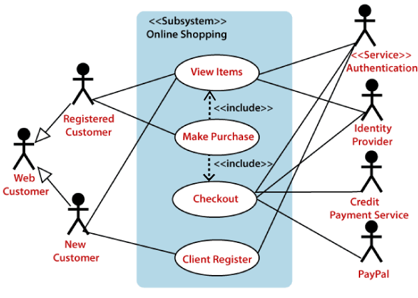

---

### Example of a Use Case Diagram

- A use case diagram depicting the Online Shopping website is given below.

- Here the Web Customer actor makes use of any online shopping website to purchase online. The top-level uses are as follows; View Items, Make Purchase, Checkout, Client Register. The View Items use case is utilized by the customer who searches and view products. The Client Register use case allows the customer to register itself with the website for availing gift vouchers, coupons, or getting a private sale invitation. It is to be noted that the Checkout is an included use case, which is part of Making Purchase, and it is not available by itself.

---

### Example of a Use Case Diagram

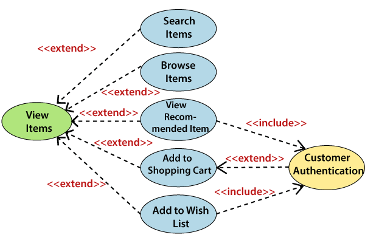

---

### Example of a Use Case Diagram

- The View Items is further extended by several use cases such as; Search Items, Browse Items, View Recommended Items, Add to Shopping Cart, Add to Wish list. All of these extended use cases provide some functions to customers, which allows them to search for an item. The View Items is further extended by several use cases such as; Search Items, Browse Items, View Recommended Items, Add to Shopping Cart, Add to Wish list. All of these extended use cases provide some functions to customers, which allows them to search for an item.

- Both View Recommended Item and Add to Wish List include the Customer Authentication use case, as they necessitate authenticated customers, and simultaneously item can be added to the shopping cart without any user authentication.

---

### Example of a Use Case Diagram

---

### Example of a Use Case Diagram

- Similarly, the Checkout use case also includes the following use cases, as shown below. It requires an authenticated Web Customer, which can be done by login page, user authentication cookie ("Remember me"), or Single Sign-On (SSO). SSO needs an external identity provider's participation, while Web site authentication service is utilized in all these use cases.

- The Checkout use case involves Payment use case that can be done either by the credit card and external credit payment services or with PayPal.

---

### Important tips for drawing a Use Case diagram

- Following are some important tips that are to be kept in mind while drawing a use case diagram:
  - A simple and complete use case diagram should be articulated.
  - A use case diagram should represent the most significant interaction among the multiple interactions.
  - At least one module of a system should be represented by the use case diagram.
  - If the use case diagram is large and more complex, then it should be drawn more generalized.

---

## **UML Sequence Diagram**

---

### UML Sequence Diagram

- The sequence diagram represents the flow of messages in the system and is also termed as an event diagram. It helps in envisioning several dynamic scenarios. It portrays the communication between any two lifelines as a time-ordered sequence of events, such that these lifelines took part at the run time. In UML, the lifeline is represented by a vertical bar, whereas the message flow is represented by a vertical dotted line that extends across the bottom of the page. It incorporates the iterations as well as branching.

---

### Purpose of a Sequence Diagram

- To model high-level interaction among active objects within a system.
- To model interaction among objects inside a collaboration realizing a use case.
- It either models generic interactions or some certain instances of interaction.

---

### Notations of a Sequence Diagram

---

#### Lifeline

- An individual participant in the sequence diagram is represented by a lifeline. It is positioned at the top of the diagram.

---

#### Actor

- A role played by an entity that interacts with the subject is called as an actor. It is out of the scope of the system. It represents the role, which involves human users and external hardware or subjects. An actor may or may not represent a physical entity, but it purely depicts the role of an entity. Several distinct roles can be played by an actor or vice versa.

---

#### Activation

- It is represented by a thin rectangle on the lifeline. It describes that time period in which an operation is performed by an element, such that the top and the bottom of the rectangle is associated with the initiation and the completion time, each respectively.

---

#### Messages

The messages depict the interaction between the objects and are represented by arrows. They are in the sequential order on the lifeline. The core of the sequence diagram is formed by messages and lifelines.

Following are types of messages enlisted below:

---

##### Call Message: 

- It defines a particular communication between the lifelines of an interaction, which represents that the target lifeline has invoked an operation.

---

##### Return Message: 

- It defines a particular communication between the lifelines of interaction that represent the flow of information from the receiver of the corresponding caller message.

---

##### Self Message: 

- It describes a communication, particularly between the lifelines of an interaction that represents a message of the same lifeline, has been invoked.

---

##### Recursive Message: 

- A self message sent for recursive purpose is called a recursive message. In other words, it can be said that the recursive message is a special case of the self message as it represents the recursive calls.

---

##### Create Message: 

- It describes a communication, particularly between the lifelines of an interaction describing that the target (lifeline) has been instantiated.

---

##### Destroy Message: 

- It describes a communication, particularly between the lifelines of an interaction that depicts a request to destroy the lifecycle of the target.

---

##### Duration Message: 

- It describes a communication particularly between the lifelines of an interaction, which portrays the time passage of the message while modeling a system.

---

##### Note

- A note is the capability of attaching several remarks to the element. It basically carries useful information for the modelers.

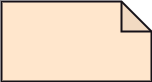

---

### Sequence Fragments

- Sequence fragments have been introduced by UML 2.0, which makes it quite easy for the creation and maintenance of an accurate sequence diagram.

- It is represented by a box called a combined fragment, encloses a part of interaction inside a sequence diagram.

- The type of fragment is shown by a fragment operator.

---

### Sequence Fragments

---

### Types of fragments
- Following are the types of fragments enlisted below;
  - **alt**	
    - Alternative multiple fragments: The only fragment for which the condition is true, will execute.
  - **opt**	Optional: 
    - If the supplied condition is true, only then the fragments will execute. It is similar to alt with only one trace.
  - **par**	Parallel: 
    - Parallel executes fragments.

---

### Types of fragments

  - **loop**	Loop: 
    - Fragments are run multiple times, and the basis of interaction is shown by the guard.
  - **region**	Critical region: 
    - Only one thread can execute a fragment at once.
  - **neg**	Negative: 
    - A worthless communication is shown by the fragment.

---

### Types of fragments

  - **ref**	Reference: 
    - An interaction portrayed in another diagram. In this, a frame is drawn so as to cover the lifelines involved in the communication. The parameter and return value can be explained.
  - **sd**	Sequence Diagram: 
    - It is used to surround the whole sequence diagram.

---

### Example of a Sequence Diagram

- An example of a high-level sequence diagram for online bookshop is given below.

- Any online customer can search for a book catalog, view a description of a particular book, add a book to its shopping cart, and do checkout.

---

### Benefits of a Sequence Diagram

- It explores the real-time application.
- It depicts the message flow between the different objects.
- It has easy maintenance.
- It is easy to generate.
- Implement both forward and reverse engineering.
- It can easily update as per the new change in the system.

---

### The drawback of a Sequence Diagram

- In the case of too many lifelines, the sequence diagram can get more complex.
- The incorrect result may be produced, if the order of the flow of messages changes.
- Since each sequence needs distinct notations for its representation, it may make the diagram more complex.
- The type of sequence is decided by the type of message.

---

## **UML Collaboration Diagram**

---

### UML Collaboration Diagram

- The collaboration diagram is used to show the relationship between the objects in a system. Both the sequence and the collaboration diagrams represent the same information but differently. Instead of showing the flow of messages, it depicts the architecture of the object residing in the system as it is based on object-oriented programming. An object consists of several features. Multiple objects present in the system are connected to each other. The collaboration diagram, which is also known as a communication diagram, is used to portray the object's architecture in the system.

---

### Notations of a Collaboration Diagram

- Following are the components of a component diagram that are enlisted below:

---

#### Objects: 

- The representation of an object is done by an object symbol with its name and class underlined, separated by a colon.
- In the collaboration diagram, objects are utilized in the following ways:
- The object is represented by specifying their name and class.
- It is not mandatory for every class to appear.
A class may constitute more than one object.
In the collaboration diagram, firstly, the object is created, and then its class is specified.
- To differentiate one object from another object, it is necessary to name them.

---

#### Actors: 

- In the collaboration diagram, the actor plays the main role as it invokes the interaction. Each actor has its respective role and name. In this, one actor initiates the use case.

---

#### Links: 

- The link is an instance of association, which associates the objects and actors. It portrays a relationship between the objects through which the messages are sent. It is represented by a solid line. The link helps an object to connect with or navigate to another object, such that the message flows are attached to links.

---

### Messages: 

- It is a communication between objects which carries information and includes a sequence number, so that the activity may take place. It is represented by a labeled arrow, which is placed near a link. The messages are sent from the sender to the receiver, and the direction must be navigable in that particular direction. The receiver must understand the message.

---

---

### When to use a Collaboration Diagram?

- The collaborations are used when it is essential to depict the relationship between the object. Both the sequence and collaboration diagrams represent the same information, but the way of portraying it quite different. The collaboration diagrams are best suited for analyzing use cases.

---

### When to use a Collaboration Diagram?

- Following are some of the use cases enlisted below for which the collaboration diagram is implemented:
  - To model collaboration among the objects or roles that carry the functionalities of use cases and operations.
  - To model the mechanism inside the architectural design of the system.
  - To capture the interactions that represent the flow of messages between the objects and the roles inside the collaboration.
...

---

### When to use a Collaboration Diagram?

- ...
  - To model different scenarios within the use case or operation, involving a collaboration of several objects and interactions.
  - To support the identification of objects participating in the use case.
  - In the collaboration diagram, each message constitutes a sequence number, such that the top-level message is marked as one and so on. The messages sent during the same call are denoted with the same decimal prefix, but with different suffixes of 1, 2, etc. as per their occurrence.

---

### Steps for creating a Collaboration Diagram

- Determine the behavior for which the realization and implementation are specified.
- Discover the structural elements that are class roles, objects, and subsystems for performing the functionality of collaboration.
- Choose the context of an interaction: system, subsystem, use case, and operation.
- Think through alternative situations that may be involved.
  - Implementation of a collaboration diagram at an instance level, if needed.
  - A specification level diagram may be made in the instance level sequence diagram for summarizing alternative situations.

---

### Example of a Collaboration Diagram

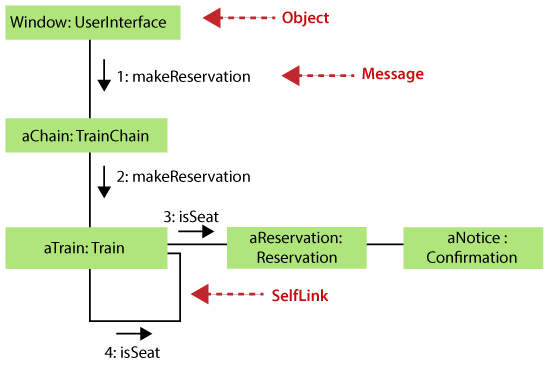

---

### Benefits of a Collaboration Diagram

- The collaboration diagram is also known as Communication Diagram.
- It mainly puts emphasis on the structural aspect of an interaction diagram, i.e., how lifelines are connected.
- The syntax of a collaboration diagram is similar to the sequence diagram; just the difference is that the lifeline does not consist of tails.
- The messages transmitted over sequencing is represented by numbering each individual message.
- The collaboration diagram is semantically weak in comparison to the sequence diagram.

---

### Benefits of a Collaboration Diagram

- The special case of a collaboration diagram is the object diagram.
- It focuses on the elements and not the message flow, like sequence diagrams.
- Since the collaboration diagrams are not that expensive, the sequence diagram can be directly converted to the collaboration diagram.
- There may be a chance of losing some amount of information while implementing a collaboration diagram with respect to the sequence diagram.

---

### The drawback of a Collaboration Diagram

- Multiple objects residing in the system can make a complex collaboration diagram, as it becomes quite hard to explore the objects.
- It is a time-consuming diagram.
- After the program terminates, the object is destroyed.
- As the object state changes momentarily, it becomes difficult to keep an eye on every single that has occurred inside the object of a system.

---

## **UML State Machine Diagram**

---

### UML State Machine Diagram

- The state machine diagram is also called the Statechart or State Transition diagram, which shows the order of states underwent by an object within the system. It captures the software system's behavior. It models the behavior of a class, a subsystem, a package, and a complete system.

- It tends out to be an efficient way of modeling the interactions and collaborations in the external entities and the system. It models event-based systems to handle the state of an object. It also defines several distinct states of a component within the system. Each object/component has a specific state.

---

### UML State Machine Diagram

- Following are the types of a state machine diagram that are given below:
  - **Behavioral state machine**
    - The behavioral state machine diagram records the behavior of an object within the system. It depicts an implementation of a particular entity. It models the behavior of the system.
  - **Protocol state machine**
    - It captures the behavior of the protocol. The protocol state machine depicts the change in the state of the protocol and parallel changes within the system. But it does not portray the implementation of a particular component.

---

### Why State Machine Diagram?

- Since it records the dynamic view of a system, it portrays the behavior of a software application. During a lifespan, an object underwent several states, such that the lifespan exist until the program is executing. Each state depicts some useful information about the object.

---

### Why State Machine Diagram?

- It blueprints an interactive system that response back to either the internal events or the external ones. The execution flow from one state to another is represented by a state machine diagram. It visualizes an object state from its creation to its termination.

---

### Why State Machine Diagram?

- The main purpose is to depict each state of an individual object. It represents an interactive system and the entities inside the system. It records the dynamic behavior of the system.

---

### Notation of a State Machine Diagram

Following are the notations of a state machine diagram enlisted below:

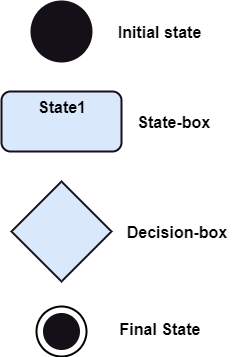

---

### Notation of a State Machine Diagram

- Initial state: 
  - It defines the initial state (beginning) of a system, and it is represented by a black filled circle.
Final state: It represents the final state (end) of a system. It is denoted by a filled circle present within a circle.
- Decision box: 
  - It is of diamond shape that represents the decisions to be made on the basis of an evaluated guard.
Transition: A change of control from one state to another due to the occurrence of some event is termed as a transition. It is represented by an arrow labeled with an event due to which the change has ensued.
- State box: 
  - It depicts the conditions or circumstances of a particular object of a class at a specific point of time. A rectangle with round corners is used to represent the state box.

---

### Types of State
- The UML consist of three states:
  - **Simple state:** 
    - It does not constitute any substructure.
  - **Composite state:** 
    - It consists of nested states (substates), such that it does not contain more than one initial state and one final state. It can be nested to any level.
  - **Submachine state:** 
    - The submachine state is semantically identical to the composite state, but it can be reused.

---

### How to Draw a State Machine Diagram?

- The state machine diagram is used to portray various states underwent by an object. The change in one state to another is due to the occurrence of some event. All of the possible states of a particular component must be identified before drawing a state machine diagram.

---

### How to Draw a State Machine Diagram?

- The primary focus of the state machine diagram is to depict the states of a system. These states are essential while drawing a state transition diagram. The objects, states, and events due to which the state transition occurs must be acknowledged before the implementation of a state machine diagram.

---

### How to Draw a State Machine Diagram?

- Following are the steps that are to be incorporated while drawing a state machine diagram:
  - A unique and understandable name should be assigned to the state transition that describes the behavior of the system.
  - Out of multiple objects, only the essential objects are implemented.
  - A proper name should be given to the events and the transitions.

---

### When to use a State Machine Diagram?

- The state machine diagram implements the real-world models as well as the object-oriented systems. It records the dynamic behavior of the system, which is used to differentiate between the dynamic and static behavior of a system.

- It portrays the changes underwent by an object from the start to the end. It basically envisions how triggering an event can cause a change within the system.

- State machine diagram is used for:
  - For modeling the object states of a system.
  - For modeling the reactive system as it consists of reactive objects.
  - For pinpointing the events responsible for state transitions.
  - For implementing forward and reverse engineering.

---

### Example of a State Machine Diagram

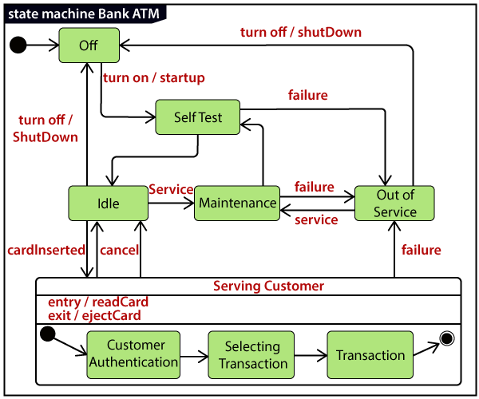

---

### Example of a State Machine Diagram

An example of a top-level state machine diagram showing Bank Automated Teller Machine (ATM) is given below.

Initially, the ATM is turned off. After the power supply is turned on, the ATM starts performing the startup action and enters into the Self Test state. If the test fails, the ATM will enter into the Out Of Service state, or it will undergo a triggerless transition to the Idle state. This is the state where the customer waits for the interaction. 

---

### Example of a State Machine Diagram

Whenever the customer inserts the bank or credit card in the ATM's card reader, the ATM state changes from Idle to Serving Customer, the entry action readCard is performed after entering into Serving Customer state. Since the customer can cancel the transaction at any instant, so the transition from Serving Customer state back to the Idle state could be triggered by cancel event.

---

### Example of a State Machine Diagram

Here the Serving Customer is a composite state with sequential substates that are Customer Authentication, Selecting Transaction, and Transaction.

---

### Example of a State Machine Diagram

Customer Authentication and Transaction are the composite states itself is displayed by a hidden decomposition indication icon. After the transaction is finished, the Serving Customer encompasses a triggerless transition back to the Idle state. On leaving the state, it undergoes the exit action ejectCard that discharges the customer card.

---

### Example of a State Machine Diagram

---

### State Machine vs. Flowchart

State Machine	$\Longleftrightarrow$ Flowchart
It portrays several states of a system.	$\Longleftrightarrow$ It demonstrates the execution flow of a program.
It encompasses the concept of WAIT, i.e., wait for an event or an action.	 $\Longleftrightarrow$ It does not constitute the concept of WAIT.
It is for real-world modeling systems. $\Longleftrightarrow$ 	It envisions the branching sequence of a system.
It is a modeling diagram.	$\Longleftrightarrow$ It is a data flow diagram (DFD)
It is concerned with several states of a system.	$\Longleftrightarrow$ It focuses on control flow and path.

---

## **UML Activity Diagram**

---

### UML Activity Diagram

- In UML, the activity diagram is used to demonstrate the flow of control within the system rather than the implementation. It models the concurrent and sequential activities.

- The activity diagram helps in envisioning the workflow from one activity to another. It put emphasis on the condition of flow and the order in which it occurs. The flow can be sequential, branched, or concurrent, and to deal with such kinds of flows, the activity diagram has come up with a fork, join, etc.

- It is also termed as an object-oriented flowchart. It encompasses activities composed of a set of actions or operations that are applied to model the behavioral diagram.

---

### Components of an Activity Diagram

- Following are the component of an activity diagram:
  - Activities
  - Activity partition /swimlane
  - Forks
  - Join Nodes
  - Pins

---

### Activities

- The categorization of behavior into one or more actions is termed as an activity. In other words, it can be said that an activity is a network of nodes that are connected by edges. The edges depict the flow of execution. It may contain action nodes, control nodes, or object nodes.

- The control flow of activity is represented by control nodes and object nodes that illustrates the objects used within an activity. The activities are initiated at the initial node and are terminated at the final node.

---

### Activity partition /swimlane

- The swimlane is used to cluster all the related activities in one column or one row. It can be either vertical or horizontal. It used to add modularity to the activity diagram. It is not necessary to incorporate swimlane in the activity diagram. But it is used to add more transparency to the activity diagram.

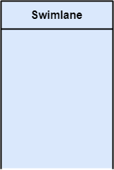

---

### Forks

- Forks and join nodes generate the concurrent flow inside the activity. A fork node consists of one inward edge and several outward edges. It is the same as that of various decision parameters. Whenever a data is received at an inward edge, it gets copied and split crossways various outward edges. It split a single inward flow into multiple parallel flows.

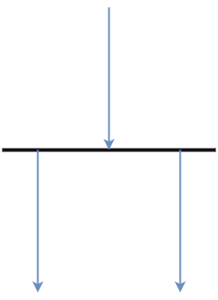

---

### Join Nodes

Join nodes are the opposite of fork nodes. A Logical AND operation is performed on all of the inward edges as it synchronizes the flow of input across one single output (outward) edge.

---

### Pins

- It is a small rectangle, which is attached to the action rectangle. It clears out all the messy and complicated thing to manage the execution flow of activities. It is an object node that precisely represents one input to or output from the action.

---

### Notation of an Activity diagram

- Activity diagram constitutes following notations:
  - **Initial State:** 
    - It depicts the initial stage or beginning of the set of actions.
  - **Final State:** 
    - It is the stage where all the control flows and object flows end.
  - **Decision Box:** 
    - It makes sure that the control flow or object flow will follow only one path.
  - **Action Box:** 
    - It represents the set of actions that are to be performed.

---

### Why use Activity Diagram?

- An event is created as an activity diagram encompassing a group of nodes associated with edges. To model the behavior of activities, they can be attached to any modeling element. It can model use cases, classes, interfaces, components, and collaborations.

---

### Why use Activity Diagram?

- It mainly models processes and workflows. It envisions the dynamic behavior of the system as well as constructs a runnable system that incorporates forward and reverse engineering. It does not include the message part, which means message flow is not represented in an activity diagram.

---

### Why use Activity Diagram?

- It is the same as that of a flowchart but not exactly a flowchart itself. It is used to depict the flow between several activities.

---

### How to draw an Activity Diagram?

- An activity diagram is a flowchart of activities, as it represents the workflow among various activities. They are identical to the flowcharts, but they themself are not exactly the flowchart. In other words, it can be said that an activity diagram is an enhancement of the flowchart, which encompasses several unique skills.

---

### How to draw an Activity Diagram?

- Since it incorporates swimlanes, branching, parallel flows, join nodes, control nodes, and forks, it supports exception handling. A system must be explored as a whole before drawing an activity diagram to provide a clearer view of the user. All of the activities are explored after they are properly analyzed for finding out the constraints applied to the activities. Each and every activity, condition, and association must be recognized.

---

### How to draw an Activity Diagram?

- After gathering all the essential information, an abstract or a prototype is built, which is then transformed into the actual diagram.

---

### How to draw an Activity Diagram?

- Following are the rules that are to be followed for drawing an activity diagram:
  - A meaningful name should be given to each and every activity.
  - Identify all of the constraints.
  - Acknowledge the activity associations.

---

### Example of an Activity Diagram

---

### Example of an Activity Diagram

- An example of an activity diagram showing the business flow activity of order processing is given below.

- Here the input parameter is the Requested order, and once the order is accepted, all of the required information is then filled, payment is also accepted, and then the order is shipped. It permits order shipment before an invoice is sent or payment is completed.

---

### When to use an Activity Diagram?

- An activity diagram can be used to portray business processes and workflows. Also, it used for modeling business as well as the software. An activity diagram is utilized for the followings:
  - To graphically model the workflow in an easier and understandable way.
  - To model the execution flow among several activities.
  - To model comprehensive information of a function or an algorithm employed within the system.
  - To model the business process and its workflow.
  - To envision the dynamic aspect of a system.
  - To generate the top-level flowcharts for representing the workflow of an application.
  - To represent a high-level view of a distributed or an object-oriented system.

---

## **UML Timing Diagram**

---

### UML Timing Diagram

- In UML, the timing diagrams are a part of Interaction diagrams that do not incorporate similar notations as that of sequence and collaboration diagram. It consists of a graph or waveform that depicts the state of a lifeline at a specific point of time. It illustrates how conditions are altered both inside and between lifelines alongside linear time axis.

- The timing diagram describes how an object underwent a change from one form to another. A waveform portrays the flow among the software programs at several instances of time.

---

### UML Timing Diagram

- Following are some important key points of a timing diagram:
  - It emphasizes at that particular time when the message has been sent among objects.
  - It explains the time processing of an object in detail.
  - It is employed with distributed and embedded systems.
  - It also explains how an object undergoes changes in its form throughout its lifeline.
  - As the lifelines are named on the left side of an edge, the timing diagrams are read from left to right.
  - It depicts a graphical representation of states of a lifeline per unit time.
  - In UML, the timing diagram has come up with several notations to simplify the transition state among two lifelines per unit time.

---

### Basic concepts of a Timing Diagram

- In UML, the timing diagram constitutes several major elements, which are as follows:
  - Lifeline
  - State or Condition Timeline
  - Duration Constraint
  - Time Constraint
  - Destruction Occurrence

---

### Lifeline

- As the name suggests, the lifeline portrays an individual element in the interaction. It represents a single entity, which is a part of the interaction. It is represented by the classifier's name that it depicts. A lifeline can be placed within a "swimlane" or a diagram frame.

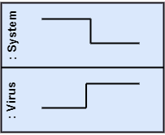

- Lifelines representing instances of a System and Virus

---

### State or Condition Timeline

- The timing diagram represents the state of a classifier or attributes that are participating, or some testable conditions, which is a discrete value of the classifier.

- In UML, the state or condition is continuous. It is mainly used to show the temperature and density where the entities endure a continuous state change.

- Timeline showing the change in the state of virus between dormant, Propagation, Triggering, Execution

---

### Duration Constraint

- The duration constraint is a constraint of an interval, which refers to duration interval. It is used to determine if the constraint is satisfied for a duration or not. The duration constraint semantics inherits from the constraints.

- The negative trace defines the violated constraints, which means the system is failed. A graphical association between duration interval and the construct, which it constrains, may represent a duration constraint.

- Ice should melt into the water in 1 to 6 mins.

---

### Time Constraint

- It is an interval constraint, which refers to the time interval. Since it is a time expression, it depicts if the constraint is satisfied or not. The constraints dispense its time constraints semantics.

---

### Time Constraint

- The negative trace defines the violated constraints, which means the system is failed. The time constraint is represented by a graphical association between the time interval and the construct which it constrains.

- The graphical association is mainly represented by a small line in between a time interval and an occurrence specification.

- A person should wakeup in between 5:40 am, and 6 am

---

### Destruction Occurrence

The destruction occurrence refers to the occurrence of a message that represents the destruction of an instance is defined by a lifeline. It may subsequently destruct other objects owned by the composition of this object, such that nothing occurs after the destruction event on a given lifeline. It is represented by a cross at the end of a timeline.

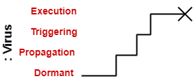

- Virus lifeline is terminated

---

### Example of a Timing Diagram

---

### Example of a Timing Diagram

- A timing diagram example of a medical domain that depicts different stages of Alzheimer's disease (AD) is explained below.

- Since Alzheimer's is a very progressive fatal brain disease, it leads to memory loss and intellectual abilities. The reason behind this disease is yet to be discovered. It cannot be cured as well as one of the main reasons for rising death rates in the United States.

---

### Example of a Timing Diagram

- The doctor may require a diagnostic framework with three to seven-stage, such that its evolution may last for about 8 to 10 years. Also, in some cases, it lasts up to 20years from the time neuron starts changing.

- The example given below constitutes timing for a seven-stage framework. The given example is just a UML diagram and should not be considered as a reference to medical research. The medical details are provided for you to better understand the UML diagram.

---

Following are the seven-stage Alzheimer disease framework explained below:

---

- **No Impairment, Normal State**
  - It is the stage where the memory and cognitive abilities look normal.
- **Normal Aged Forgetfulness**
  - It is mostly seen in people with an age group of 65 who experience subjective complaints of cognitive and/or functional difficulties, which means they face problems in recalling the name and past 5 to 10 years of history.

---

- **Early Confusional, Mild Cognitive Impairment**
 - It causes a problem in retrieving words, planning, organizing, objects misplacing as well as forgetting fresh learning, which in turn affects the surrounding.
- **Late Confusional, Mild Alzheimer's**
  - In this, a person forgets the most recent events and conversations. The person remembers himself and his family, but face problems while carrying out sequential tasks such as cooking, driving, etc. Its duration is about two years,

---

- **Early Dementia, Moderate Alzheimer's**
  - In this, the person cannot manage independently. He faces difficulty in recalling the past details and contact information. It lasts for about 1.5 years.
- **Middle Dementia, Moderately Severe Alzheimer's**
  - It leads to insufficient awareness about current events, and the person is unable to recall the past. It causes an inability in people to take a bath and dress up independently. It lasts for about 2.5 years approximately.

---

- **Late or Severe Dementia, Failure to Thrive**
  - It is severely limited intellectual ability. In this, a person either communicates through short words or cries, which leads health to decline as it shut down the body system. Its duration is 1 to 2.5 years.

---

### Benefits of Timing Diagram

- It depicts the state of an object at a particular point in time.

- It implements forward and reverses engineering.

- It keeps an eye on every single change that happens within the system.

---

### Drawbacks of Timing Diagram

- It is hard to maintain and understand.

---

## References

- [visual-paradigm-What is Unified Modeling Language (UML)?](https://www.visual-paradigm.com/guide/uml-unified-modeling-language/what-is-uml/)

- [javatpoint-UML Overview](https://www.javatpoint.com/uml)

- [javatpoint-UML Building Blocks](https://www.javatpoint.com/uml-building-blocks)

- [javatpoint-UML Architecture](https://www.javatpoint.com/uml-architecture)

- [javatpoint-UML Diagrams Overview](https://www.javatpoint.com/uml-diagrams)

- [javatpoint-UML Relationship](https://www.javatpoint.com/uml-relationship)

---

## References

- [uml-diagrams-org](https://www.uml-diagrams.org/)

- [javatpoint-UML Association vs. Aggregation vs. Composition](https://www.javatpoint.com/uml-association-vs-aggregation-vs-composition)

- [javatpoint-UML- Association](https://www.javatpoint.com/uml-association)

- [javatpoint-UML-Dependency](https://www.javatpoint.com/uml-dependency)

- [javatpoint-UML-Generalization](https://www.javatpoint.com/uml-generalization)

- [javatpoint-UML-Realization](https://www.javatpoint.com/uml-realization)

- [javatpoint-UML Class Diagram](https://www.javatpoint.com/uml-class-diagram)

- [javatpoint-UML Object Diagram](https://www.javatpoint.com/uml-object-diagram)

---

## References

- [javatpoint-UML Component Diagram](https://www.javatpoint.com/uml-component-diagram)

- [javatpoint-UML Deployment Diagram](https://www.javatpoint.com/uml-deployment-diagram)

- [javatpoint-UML Interaction Diagram](https://www.javatpoint.com/uml-interaction-diagram)

- [javatpoint-UML Use Case Diagram](https://www.javatpoint.com/uml-use-case-diagram)

- [javatpoint-UML Sequence Diagram](https://www.javatpoint.com/uml-sequence-diagram)

---

## References

- [javatpoint-UML Collaboration Diagram](https://www.javatpoint.com/uml-collaboration-diagram)

- [javatpoint-UML State Machine Diagram](https://www.javatpoint.com/uml-state-machine-diagram)

- [javatpoint-UML Activity Diagram](https://www.javatpoint.com/uml-activity-diagram)

- [javatpoint-UML Timing Diagram](https://www.javatpoint.com/uml-timing-diagram)

- [javatpoint-UML Tools](https://www.javatpoint.com/uml-tools)

---

$End-Of-Week-4-Module$
