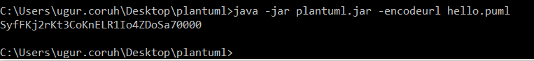

<!-- _backgroundColor: aquq -->

<!-- _color: orange -->

<!-- paginate: false -->

## CEN206 Object-Oriented Programming (formerly CE204)

### Week-5 (Plantuml)

#### Spring Semester, 2024-2025

Download [DOC-PDF](ce204-week-5.en.md_doc.pdf), [DOC-DOCX](ce204-week-5.en.md_word.docx), [SLIDE](ce204-week-5.en.md_slide.pdf), [PPTX](ce204-week-5.en.md_slide.pptx),

<iframe width=700, height=500 frameBorder=0 src="../ce204-week-5.en.md_slide.html"></iframe>

---

<!-- paginate: true -->

## Plantuml

### Outline

- Plantuml What is it?
- Plantuml When do you need it?
- Plantuml How to use it online?
- Plantuml How to use it offline? 

---

## Plantuml

### Outline

- Plantuml Integrations with other tools
  - Plantuml How to integrate with Doxygen?
  - Plantuml How to integrate with Eclipse?
  - Plantuml How to integrate with Visual Studio Code?
  - Plantuml How to integrate with Visual Studio?
  - and More ...

---

## Plantuml

### Outline

- Plantuml UML Diagrams
  - Sequence diagram
  - Usecase diagram
  - Class diagram
  - Object diagram
  - Activity diagram (here is the legacy syntax)
  - Component diagram
  - Deployment diagram
  - State diagram
  - Timing diagram

---

## Plantuml

### Outline

- Plantuml C4 Model Diagrams
  - Context Diagram
  - Container Diagram
  - Component Diagram
  - Class Diagram

---

## Plantuml

### Outline

- Plantuml None-UML Diagrams (1)
  - JSON data
  - YAML data
  - Network diagram (nwdiag)
  - Wireframe graphical interface or UI mockups (salt)
  - Archimate diagram
  - Specification and Description Language (SDL)

---

## Plantuml

### Outline

- Plantuml None-UML Diagrams (2)
  - Ditaa diagram
  - Gantt diagram
  - MindMap diagram
  - Work Breakdown Structure diagram (WBS)
  - Mathematic with AsciiMath or JLaTeXMath notation
  - Entity Relationship diagram (IE/ER)

---

## Plantuml

### Outline

- PlantUML Preprocessing

---

## Plantuml

### Outline

- Plantuml Icon Diagrams Support
  - PlantUML Stdlib
- Calling PlantUML from Java
  - PlantUML Java API

---

## **Plantuml What is it?**

---

<style scoped>section{ font-size: 25px; }</style>

## Plantuml What is it?

- PlantUML is an open-source tool allowing users to create diagrams from a plain text language, based on [UML](https://en.wikipedia.org/wiki/UML)

- 22 April, 2009: First public release.

- Webpage [PlantUML](https://plantuml.com/)

- Wiki [PlantUML](https://en.wikipedia.org/wiki/PlantUML)

- Github [PlantUML](https://github.com/plantuml)

---

<style scoped>section{ font-size: 25px; }</style>

## Plantuml What is it?

- Besides various UML diagrams, PlantUML has support for various other software development related formats such as 
  
  - Archimate, 
  - Block diagram, 
  - BPMN, 
  - C4, 
  - Computer network diagram, 
  - ERD, 
  - Gantt chart, 
  - Mind map, 
  - and WBD, 
  - as well as visualisation of JSON and YAML files.
  
  *Details in Next Slides...*

---

<style scoped>section{ font-size: 25px; }</style>

## Plantuml What is it?

```
@startuml
Bob->Alice : Hello!
@enduml
```


Demo Link

[PlantUML Web Server](https://www.plantuml.com/plantuml/uml/SyfFKj2rKt3CoKnELR1Io4ZDoSa70000)

---

<style scoped>section{ font-size: 20px; }</style>

## Plantuml What is it?

```
@startuml
skinparam style strictuml
class Façade {
 doSomething()
}
Façade .> package1.Class1
Façade .> package2.Class2
Façade .> package3.Class3
Client1 .> Façade : doSomething()
Client2 .> Façade : doSomething()
note as N2
doSomething() {
  Class1 c1 = newClass1();
  Class2 c2 = newClass2();
  Class3 c3 = newClass3();
  c1.doStuff(c2)
  c3.setX(c1.getX());
  return c3.getY();
}
end note
Façade .. N2
@enduml
```


Demo Link

[PlantUML Web Server](http://www.plantuml.com/plantuml/uml/VT31IiGm40RWUvvYZkqbaEIcA0iB7hruqUEGpjQoQRea4qHadyS7ySNCR2XMMRoqPBv_c4bscJ5ncOFAnocUCE4CcTy3rM-Q_4Lym9pX0Ry-SI3uK30iJyjC_3h5iUlLMQsax-64_eWZ6RsN9dE5R2DxXLmZf_PXeiX6Q4tT_9dQ8lQ_I5oO03CyMlKBv0hGzWDlu0uYlRLZrz-kPC7R3TaDEV1kGwwHDxfEuN8uTDxsKd0w4pzt5KRvzvTO8Yuf2jRYYxIU5SK1PDcV9z6ozAxMono-0G00)

---

## Plantuml What is it?

### PlantUML Status

[](https://github.com/sponsors/plantuml/)

[](https://github.com/plantuml/plantuml/stargazers/)

[](https://github.com/plantuml/plantuml/watchers/)

[](https://github.com/plantuml/plantuml/graphs/contributors)

[](https://github.com/plantuml/plantuml/network/)

---

## Plantuml What is it?

### PlantUML Status

[](https://github.com/plantuml/plantuml/releases)

[](https://www.plantuml.com/plantuml)

[](https://www.plantuml.com/plantuml)

[](https://www.plantuml.com/plantuml)

---

## Plantuml What is it?

### PlantUML Status

[](https://github.com/plantuml/plantuml/releases/latest)

[](https://github.com/plantuml/plantuml/releases/latest)

[](https://github.com/plantuml/plantuml/commits/)

---

## Plantuml What is it?

### PlantUML Status

[](https://github.com/plantuml/plantuml/releases/tag/snapshot)

[](https://github.com/plantuml/plantuml/releases/tag/snapshot)

[](https://github.com/plantuml/plantuml/commits/)

[](https://github.com/plantuml/plantuml/actions/workflows/ci.yml)

---

This badges are generated via 

https://shields.io/

---

<style scoped>section{ font-size: 25px; }</style>

## Plantuml What is it?

- **Diagram As Code**
  
  - Diagrams are defined using a simple and intuitive language. ([see PlantUML Language Reference Guide](https://plantuml.com/guide)).

- **Easy to use** 
  
  - New users can read the [quick start page](https://plantuml.com/starting). There is also a [F.A.Q. page](https://plantuml.com/faq). 

- **Easy to integrate**
  
  - PlantUML can be used within [many other tools](https://plantuml.com/running).

- **Several outputs** 
  
  - Images can be generated in PNG, [in SVG](https://plantuml.com/svg) or [in LaTeX](https://plantuml.com/latex) format. 
  - It is also possible to generate [ASCII art diagrams](https://plantuml.com/ascii-art) (only for sequence diagrams).

---

<style scoped>section{ font-size: 25px; }</style>

## Plantuml What is it?

**PlantUML** is a component that allows to quickly write:

- [Sequence diagram](https://plantuml.com/sequence-diagram)
- [Usecase diagram](https://plantuml.com/use-case-diagram)
- [Class diagram](https://plantuml.com/class-diagram)
- [Object diagram](https://plantuml.com/object-diagram)
- [Activity diagram](https://plantuml.com/activity-diagram-beta) (here is [the legacy syntax](https://plantuml.com/activity-diagram-legacy))
- [Component diagram](https://plantuml.com/component-diagram)
- [Deployment diagram](https://plantuml.com/deployment-diagram)
- [State diagram](https://plantuml.com/state-diagram)
- [Timing diagram](https://plantuml.com/timing-diagram)

---

<style scoped>section{ font-size: 25px; }</style>

## Plantuml What is it?

The following non-UML diagrams are also supported:

- [JSON data](https://plantuml.com/json)
- [YAML data](https://plantuml.com/yaml)
- [Network diagram (nwdiag)](https://plantuml.com/nwdiag)
- [Wireframe graphical interface or UI mockups (salt)](https://plantuml.com/salt)
- [Archimate diagram](https://plantuml.com/archimate-diagram)
- [Specification and Description Language (SDL)](https://plantuml.com/activity-diagram-beta#sdl)
- [Ditaa diagram](https://plantuml.com/ditaa)
- [Gantt diagram](https://plantuml.com/gantt-diagram)
- [MindMap diagram](https://plantuml.com/mindmap-diagram)
- [Work Breakdown Structure diagram (WBS)](https://plantuml.com/wbs-diagram)
- [Mathematic with AsciiMath or JLaTeXMath notation](https://plantuml.com/ascii-math)
- [Entity Relationship diagram (IE/ER)](https://plantuml.com/ie-diagram)

---

<style scoped>section{ font-size: 25px; }</style>

## Plantuml What is it?

Furthermore:

- [Hyperlinks and tooltips](https://plantuml.com/link)
- [Creole](https://plantuml.com/creole): rich text, emoticons, unicode, icons
- [OpenIconic icons](https://plantuml.com/openiconic)
- [Sprite icons](https://plantuml.com/sprite)
- [AsciiMath mathematical expressions](https://plantuml.com/ascii-math)

---

## **Plantuml When do you need it?**

---

## Plantuml When do you need it?

- Integrate application source code with its UML design
- Do not worry about visual design
- If you need something platform independent and portable
- If you need something that has lightweight diagramming features.
- If you do not want to pay for licences.
- If you do not need to install applications.
- If you need fast operations for diagraming models that you need to generate and share with others.

---

## Plantuml When do you need it?

- There are many applications that use PlantUML.
- There are many examples of PlantUML diagrams.maybe you can find your solutions. Do not forget to check the [examples](https://plantuml.com).

---

## **Before Start Lets Download & Install PlantUML**

---

## Download & Installation Options for Offline Usage

- Download from Direct Site and Use As *.jar File
- Install via Choco and use with Command Line

---

## Option-1 : Download Jar File and PDF Guide

- Visit [Download page](https://plantuml.com/download)

- Download Latest Version Always with GraphViz Support
  
  - PlantUML compiled Jar (Version 1.2022.4)
    - [From GitHub releases](https://github.com/plantuml/plantuml/releases/tag/v1.2022.4), you can download [plantuml.1.2022.4.jar](https://github.com/plantuml/plantuml/releases/download/v1.2022.4/plantuml-1.2022.4.jar)
    - Version without embedded GraphViz: [plantuml-nodot.1.2022.4.jar](http://sourceforge.net/projects/plantuml/files/plantuml-nodot.1.2022.4.jar/download)

- PlantUML Language Reference Guide
  
  -     **[English](https://plantuml.com/en/guide)**      [Deutsch](https://plantuml.com/de/guide)      [Español](https://plantuml.com/es/guide)      [Français](https://plantuml.com/fr/guide)      [日本語](https://plantuml.com/ja/guide)      [한국어](https://plantuml.com/ko/guide)      [Русский](https://plantuml.com/ru/guide)      [中文](https://plantuml.com/zh/guide)

---

## Option-2 : Install via Choco and use with Command Line

- Choco install
  - For windows users, majkinetor introduced a way to install plantuml and its dependencies easily. Run cmd.exe as Administrator, and run two commands as follows (the first command is not needed and will fail if you already have chocolatey installed).

```bash
@"%SystemRoot%\System32\WindowsPowerShell\v1.0\powershell.exe" -NoProfile -ExecutionPolicy Bypass -Command "iex ((New-Object System.Net.WebClient).DownloadString('https://chocolatey.org/install.ps1'))" && SET "PATH=%PATH%;%ALLUSERSPROFILE%\chocolatey\bin"
```

```bash
choco install plantuml
```

- If you've installed java, but still prompts "java not installed", please add java bin path to PATH environment variable.

---

## **Always Test Installation and Its Version**

---

## **Plantuml How to use it online?**

---

## Plantuml How to use it online?

- From PlantUML Web Page Select "Online Server"
- Default Online Server Link
  - https://www.plantuml.com/plantuml/uml/SyfFKj2rKt3CoKnELR1Io4ZDoSa70000
    

---

## Plantuml How to use it online?


---

## Plantuml How to use it online?

- You can download get shareable PNG, SVG links from server
  -
- You can access directly UML diagram via browser
- You can parse links from server to get editable diagram
- You can try several built-in themes
- You can seperate diagram window from code window to make easier to edit diagram

---

<style scoped>section{ font-size: 25px; }</style>

## Plantuml How to use it online?

- Everything stored on link, example

- Request URL

```
https://www.plantuml.com/plantuml/uml/SyfFKj2rKt3CoKnELR1Io4ZDoSa70000
```

---

<style scoped>section{ font-size: 25px; }</style>

## Plantuml How to use it online?

- Server Base URL

```
https://www.plantuml.com/plantuml/uml/
```

- Encoded PlantUML Script
  
  ```
  SyfFKj2rKt3CoKnELR1Io4ZDoSa70000
  ```

```
- Decoded PlantUML Script


---

<style scoped>section{ font-size: 25px; }</style>

## Plantuml How to use it online?

- If you plantuml text-encoding features https://plantuml.com/text-encoding
- They use
  - https://en.wikipedia.org/wiki/Deflate (LZ77 + Huffman)
  - https://en.wikipedia.org/wiki/Brotli (LZ77)

---

## Plantuml How to use it online?

### Plantuml.jar Console-Command

You can use `-encodeurl` or `-decodeurl` in the [command line](https://plantuml.com/command-line) flags to encode or decode the text.




- https://www.plantuml.com/plantuml/uml/SyfFKj2rKt3CoKnELR1Io4ZDoSa70000

---

<style scoped>section{ font-size: 25px; }</style>

## Plantuml How to use it online?

You will find here some implementation of this encoder:

- [Code in PHP](https://plantuml.com/code-php)
- [Code in Javascript](https://plantuml.com/code-javascript-synchronous)
- [Code in Python](https://github.com/dougn/python-plantuml)
- [Code in Swift](https://blog.eidinger.info/plantuml-text-encoding-in-swift)

---

<style scoped>section{ font-size: 25px; }</style>

## Plantuml How to use it online?

### Javascript Encoder & Decoder Library

- You can use following libraries to encode/decode URLs with you app.
  - https://github.com/markushedvall/plantuml-encoder
  - https://www.npmjs.com/package/plantuml-encoder-decoder

---

<style scoped>section{ font-size: 25px; }</style>

## Plantuml How to use it online?

### Javascript Encoder Example

```javascript
var plantumlEncoder = require('plantuml-encoder')

var encoded = plantumlEncoder.encode('A -> B: Hello')
console.log(encoded) // SrJGjLDmibBmICt9oGS0

var url = 'http://www.plantuml.com/plantuml/img/' + encoded

var decoded = plantumlEncoder.decode(encoded)
console.log(decoded)
```

---

<style scoped>section{ font-size: 25px; }</style>

## Plantuml How to use it online?

### Javascript Decoder Example

```javascript
var plantumlEncoder = require('plantuml-encoder')

var plain = plantumlEncoder.decode('UDfpLD2rKt2oKl18pSd91m0KGWDz')
console.log(plain) // A -> B: Hello
```

---

<style scoped>section{ font-size: 25px; }</style>

## Plantuml How to use it online?

### Simple HEX format

- If you find Deflate and Brotli too complex, you can try the HEX format. In that case, you just have to encode each character in hexadecimal format.

- For example :
  
  ```
  @startuml
  Alice->Bob : I am using hex
  @enduml
  ```

- will be turned into:
  
  ```
  407374617274756d6c0a416c6963652d3e426f62203a204920616d207573696e67206865780a40656e64756d6c
  ```

- To indicate the use of HEX format, you must add `~h` at the start of the data sent to PlantUML server.
  
  - [http://www.plantuml.com/plantuml/uml/~h4073...](http://www.plantuml.com/plantuml/uml/~h407374617274756d6c0a416c6963652d3e426f62203a204920616d207573696e67206865780a40656e64756d6c)

- Since there is no compression here, the URL will become very long as the diagram grows.

---

<style scoped>section{ font-size: 25px; }</style>

## Plantuml How to use it online?

### PNG service

To get a PNG file of a diagram, use the following URL scheme: [/plantuml/png/ENCODED](http://www.plantuml.com/plantuml/png/SyfFKj2rKt3CoKnELR1Io4ZDoSa70000)

---

<style scoped>section{ font-size: 25px; }</style>

## Plantuml How to use it online?

### SVG service

To get a SVG XML file of a diagram, use the following URL scheme: [/plantuml/svg/ENCODED](http://www.plantuml.com/plantuml/svg/SyfFKj2rKt3CoKnELR1Io4ZDoSa70000)

> Note that not all diagrams can be produced in [SVG](https://plantuml.com/svg). For example, [ditaa diagrams](https://plantuml.com/ditaa) are only available in PNG format.

---

<style scoped>section{ font-size: 25px; }</style>

## Plantuml How to use it online?

### ASCII Art Service

To get an ASCII Art representation of a diagram, encoded in UTF-8, use the following URL scheme: [/plantuml/txt/ENCODED](http://www.plantuml.com/plantuml/txt/SyfFKj2rKt3CoKnELR1Io4ZDoSa70000)

> Note that only sequence diagrams can be produced in ASCII Art.

---

<style scoped>section{ font-size: 25px; }</style>

## Plantuml How to use it online?

## Image Map service

To get the [client image map](http://en.wikipedia.org/wiki/Image_map#Pure_HTML) related to a previously generated PNG image, use the following URL scheme: [/plantuml/map/ENCODED](http://www.plantuml.com/plantuml/map/AqWiAibCpYn8p2jHSCfFKeYEpYWfAR3IroylBzSho04Ab-Rcw2NdvyR6Se7aTUqK77CoarCLh11AuSgAyqkBabFJyelIK_NoKajYOnKoKdDoyW40)

---

<style scoped>section{ font-size: 25px; }</style>

## Plantuml How to use it online?

## Image Map service

The output is a list of `<area>` tags, each line matching a link present in the diagram description.

For example, the following [diagram](http://www.plantuml.com/plantuml/uml/SoWkIImgAStDuIe0qfd9cGM9UIKAJlb92j7H6IKb1LRw-WKvG26W2hta_DpOM2wGdAwTWcDEPdAgWXL2MLf-KMck7bnnNcf9RAn2HcfEJZwNGsfU2iWA0000):

```
@startuml
participant Bob [[http://plantuml.com]]
Bob -> Alice : [[http://forum.plantuml.net]] hello
@enduml
```

produces the [following output](http://www.plantuml.com/plantuml/map/AqWiAibCpYn8p2jHSCfFKeYEpYWfAR3Iro_80GgLvkRe9UVdniPoWUHqxHGSSpAJKnMi4ChIyejAS_NWYlDIIs9Z5J9IStBo0G00):

```html
<map id="plantuml_map" name="plantuml_map">
<area shape="rect" id="id1" href="http://forum.plantuml.net" title="http://forum.plantuml.net" alt="" coords="38,50,199,65"/>
<area shape="rect" id="id2" href="http://plantuml.com" title="http://plantuml.com" alt="" coords="8,3,50,116"/>
</map>
```

---

<style scoped>section{ font-size: 25px; }</style>

## Plantuml How to use it online?

Note that you need to include these `<area...` tags inside a `<map...` html tag to make the complete image map.

```html
<!DOCTYPE html>
<html lang="en">
<head>
    <title>Plantuml Image Map</title>
    <meta charset="UTF-8" >
    <meta name="keywords" content="Plantuml,ImageMap">
    <meta name="description" content="Plantuml Image Map">
    <meta name="author" content="Uğur CORUH">
</head>
<body>
 <!-- -->
    <h1>Sample Image</h1>
    
    <map id="plantuml_map" name="plantuml_map">
    <area shape="rect" id="id1" href="http://forum.plantuml.net" title="http://forum.plantuml.net" alt="" coords="38,50,199,65"/>
    <area shape="rect" id="id2" href="http://plantuml.com" title="http://plantuml.com" alt="" coords="8,3,50,116"/>
    </map>
</body>
</html>
```

---

<style scoped>section{ font-size: 25px; }</style>

## Plantuml How to use it online?

### Proxy Service

With the proxy service, the source description of the diagram can be fetched by the PlantUML Server from a remote document.

The proxy service uses the following URL scheme: `/plantuml/proxy?src=RESOURCE&idx=INDEX&fmt=FORMAT`

- RESOURCE is the complete URL of the document which contains the diagram description (with the `@startxxx` and `@endxxx` tags), it could be a `.html` or a `.txt` file.
- INDEX is optional, it specifies the occurrence (starting at 0) of the diagram description that will be parsed when there are more than one diagram descriptions in the remote document. It defaults to zero.
- FORMAT is optional, it specifies the format to return. Supported values are: `png`, `svg`, `eps`, `epstext` and `txt`. Default is `png`,

---

<style scoped>section{ font-size: 25px; }</style>

## Plantuml How to use it online?

### Proxy Service

For example, try this link: http://www.plantuml.com/plantuml/proxy?src=https://raw.github.com/plantuml/plantuml-server/master/src/main/webapp/resource/test2diagrams.txt

> Note that the address of the remote document is specified as a parameter, so it is not necessary to [URL encode](http://en.wikipedia.org/wiki/Urlencode) the URL.

---

<style scoped>section{ font-size: 25px; }</style>

## Plantuml How to use it online?

- Checkout Integrations 
  - https://plantuml.com/running
    - Wikis and Forums
    - Text editors and IDE
    - Programming language
    - Generated Documentation
    - Online Editors
    - Other services

---

## **Plantuml How to use it offline?**

---

<style scoped>section{ font-size: 25px; }</style>

## Plantuml How to use it offline?

### PlantUML PicoWeb Server

- https://plantuml.com/picoweb

- Many plugins take advantage of the online web server to generate images.

- For some reasons (security, performance...) you may need to use your own local server instead. This is possible thanks to the PlantUML Server which is available here.

- However, installing and configuring a full webserver may be too complex for some users so we have decided to integrate a tiny webserver inside plantuml.jar.

- This means that you only need a Java Runtime Environment and plantuml.jar to run this very simple web server.

---

<style scoped>section{ font-size: 25px; }</style>

## Plantuml How to use it offline?

### PlantUML PicoWeb Server

- https://plantuml.com/picoweb
- Running the server
  - Running the server is pretty simple. You just have to launch:

```bash
java -jar plantuml.jar -picoweb
```

- Attention: By default, the server listens on all interfaces on port 8080. 

- To change the default behavior, you can specify a colon separated port (still listening on all interfaces) or, both, a port and a bind address:
  
  ```bash
  java -jar plantuml.jar -picoweb:8000
  java -jar plantuml.jar -picoweb:8000:127.0.0.1
  ```

---

<style scoped>section{ font-size: 25px; }</style>

## Plantuml How to use it offline?

### PlantUML PicoWeb Server

- https://plantuml.com/picoweb
- Running the server
  - The server is really basic. It only understands GET requests with following patterns: 

```
/plantuml/png/xyz....
/plantuml/svg/xyz....
```

- The server will return a PNG or SVG image.
- The server will return a 404 error if the request is not understood.
- The server will return a 500 error if the image cannot be generated.

---

<style scoped>section{ font-size: 25px; }</style>

## Plantuml How to use it offline?

### PlantUML PicoWeb Server

- Those GET requests are used by various PlantUML plugins. Once you have launched your server, you can simply test it. With any web browser, you just have to point to: http://127.0.0.1:8080.
- This way, you can very easily use any plugins which need some PlantUML HTTP server without the official online server.

---

<style scoped>section{ font-size: 25px; }</style>

## Plantuml How to use it offline?

### PlantUML Server

- You can use PlantUML using the online web service to generate images on-the-fly. A online demonstration is available at http://www.plantuml.com/plantuml, but you can also install it on your own JEE web application server.

- **Full featured server is available here:**
  
  - https://plantuml.com/server

---

<style scoped>section{ font-size: 25px; }</style>

## Plantuml How to use it offline?

### PlantUML Server

- To install PlantUML Server on your own JEE 5 web server, 
  - download the plantuml.war file and copy it on the webapp folder of your server.
- Because of the transition from javax.* to jakarta.*, the PlantUML Server does not work on Tomcat 6/7/8/9 anymore. You have to use Tomcat 10.

---

<style scoped>section{ font-size: 25px; }</style>

## Plantuml How to use it offline?

- Download and install Java Runtime Environment (JRE) or Java Development Kit (JDK) with JRE. 

- Download jar file from https://plantuml.com/download

- Select Latest version plantuml.jar with graphviz support.

- Prepare a batch file to launch on your computer as follow in the same folder with plantuml.jar

- for PNG image output run **run_plantuml_for_png_export.bat**
  
  ```bash
  java -DPLANTUML_LIMIT_SIZE=8192 -jar "plantuml.jar" -v "./**.(puml)"
  ```

- for SVG output run **run_plantuml_for_svg_export.bat**
  
  ```bash
  java -DPLANTUML_LIMIT_SIZE=8192 -jar "plantuml.jar" -svg -v "./**.(puml)"
  ```

- This scripts are look for folders and find *.puml files and generate PNG or SVG images.

---

<style scoped>section{ font-size: 25px; }</style>

## Plantuml How to use it offline?

- Other options

The most basic way to run it is:

```bash
java -jar plantuml.jar file1 file2 file3
```

This will look for `@startXYZ` into `file1`, `file2` and `file3`. For each diagram, a `.png` file will be created.

---

<style scoped>section{ font-size: 25px; }</style>

## Plantuml How to use it offline?

For processing a whole directory, you can use:

```
java -jar plantuml.jar "c:/directory1" "c:/directory2"
```

This command will search for `@startXYZ` and `@endXYZ` into `.txt`, `.tex`, `.java`, `.htm`, `.html`, `.c`, `.h`, `.cpp`, `.apt`, `.pu`, `.puml`, `.hpp`, `.hh` or `.md` files of the `c:/directory1` and `c:/directory2` directories.

---

<style scoped>section{ font-size: 25px; }</style>

## Plantuml How to use it offline?

### Configuration File

- You can also provide a configuration file which will be included before each diagram:

```
java -jar plantuml.jar -config "./config.cfg" dir1
```

---

<style scoped>section{ font-size: 25px; }</style>

## Plantuml How to use it offline?

### Configuration File

- Suppose you have the two following files:

**test1.txt:**

```
@startuml
Alice->Bob : hello
@enduml
```

**config.txt:**

```
skinparam handwritten true
```

- If you launch the following command:

```
java -jar plantuml.jar -config config.txt test1.txt
```

- File `config.txt` is automatically included at the very beginning of the diagram.

---

<style scoped>section{ font-size: 25px; }</style>

## Plantuml How to use it offline?

### Metadata

- PlantUML saves the diagram's source code in the generated PNG Metadata in the form of [encoded text](https://plantuml.com/text-encoding). 

- So it is possible to retrieve this source by using the query parameter `metadata`, giving it some image URL.

- For example, if you want to retrieve the diagram source of the image `http://i.stack.imgur.com/HJvKF.png` use the following server request: 
  
  - `http://www.plantuml.com/plantuml/?metadata=http://i.stack.imgur.com/HJvKF.png`.

- Sounds like magic! No, merely clever engineering :-)

---

<style scoped>section{ font-size: 25px; }</style>

## Plantuml How to use it offline?

### Metadata

After all preprocessing (includes etc), PlantUML saves the diagram's source code in the generated PNG Metadata in the form of [encoded text](https://plantuml.com/text-encoding).

- If you does not want plantuml to save the diagram's source code in the generated PNG Metadata, you can during generation use the option `-nometadata` to disable this functionality (To NOT export metadata in PNG/SVG generated files).
- It is possible to retrieve this source with the `-metadata` option. This means that the PNG is almost "editable": you can post it on a corporate wiki where you cannot install plugins, and someone in the future can update the diagram by getting the metadata, editing and re-uploading again. Also, the diagram is stand-alone.

---

<style scoped>section{ font-size: 25px; }</style>

## Plantuml How to use it offline?

### Metadata

- Conversely, the `-checkmetadata` option checks whether the target PNG has the same source and if there are no changes, doesn't regenerate the PNG, thus saving all processing time. This allows you to run PlantUML on a whole folder (or tree with the `-recursive` option) incrementally.

Sounds like magic! No, merely clever engineering :-)

Example:

```
  java -jar plantuml.jar -metadata diagram.png > diagram.puml
```

Unfortunately this option works only with local files. It doesn't work with `-pipe` so you cannot fetch a URL with eg `curl` and feed the PNG to PlantUML.

However, the Plantuml [server](https://plantuml.com/server#metadata) has a similar feature, where it can get a PNG from a URL and extract its metadata.

---

<style scoped>section{ font-size: 25px; }</style>

## Plantuml How to use it offline?

### Command line

You can run PlantUML using the command line. (See [running](https://plantuml.com/running) for ways to run PlantUML from various other tools and workflows).The most basic way to run it is:

```
java -jar plantuml.jar file1 file2 file3
```

This will look for `@startXYZ` into `file1`, `file2` and `file3`. For each diagram, a `.png` file will be created.For processing a whole directory, you can use:

```
java -jar plantuml.jar "c:/directory1" "c:/directory2"
```

This command will search for `@startXYZ` and `@endXYZ` into `.txt`, `.tex`, `.java`, `.htm`, `.html`, `.c`, `.h`, `.cpp`, `.apt`, `.pu`, `.puml`, `.hpp`, `.hh` or `.md` files of the `c:/directory1` and `c:/directory2` directories.

---

<style scoped>section{ font-size: 25px; }</style>

## Plantuml How to use it offline?

### Wildcards

You can also use wildcards :

- For a single character, use `?`
- For zero or more characters, use `*`
- For zero or more characters, (including `/` or `\`), use a double `**`

So to process any `.cpp` files in all directories starting by *dummy* :

```
java -jar plantuml.jar "dummy*/*.cpp"
```

And to process any `.cpp` files in all directories starting by *dummy*, and theirs subdirectories :

```
java -jar plantuml.jar "dummy*/**.cpp"
```

---

<style scoped>section{ font-size: 25px; }</style>

## Plantuml How to use it offline?

### Excluded files

You can exlude some files from the process using the `-x` option:

```
java -jar plantuml.jar -x "**/common/**" -x "**/test/Test*" "dummy*/**/*.cpp"
```

---

<style scoped>section{ font-size: 25px; }</style>

## Plantuml How to use it offline?

### Output Directory

You can specify an output directory for all images using the `-o` switch:

```
java -jar plantuml.jar -o "c:/outputPng" "c:/directory2"
```

If you recurse into several directory, there is a slight difference if you provide an absolute or a relative path for this output directory:

- An <u>absolute path</u> will ensure that all images are output to a single, specific, directory.

- If you provide a <u>relative path</u> then the images is placed in that directory relative to the location of the **input file**, not the current directory (note: this applies even if the path begins with a `.`). When Plantuml processes files from multiple directores then the corresponding directory structure is created under the computed output directory.

---

<style scoped>section{ font-size: 25px; }</style>

## Plantuml How to use it offline?

### Types of Output File

Images for your diagrams can be exported in a variety of different formats. By default the format will be a PNG file but another type can be selected using the following extensions:

Example:

```
java -jar plantuml.jar yourdiagram.txt -ttxt
```

---

<style scoped>section{ font-size: 25px; }</style>

## Plantuml How to use it offline?

### Types of Output File

| **Param name** | **Short param name** | **Output format** | **Comment**                                                   |
| -------------- | -------------------- | ----------------- | ------------------------------------------------------------- |
| `-tpng`        | `-png`               | PNG               | Default                                                       |
| `-tsvg`        | `-svg`               | SVG               | Further details can be found [here](https://plantuml.com/svg) |
| `-teps`        | `-eps`               | EPS               | Further details can be found [here](https://plantuml.com/eps) |

---

<style scoped>section{ font-size: 25px; }</style>

## Plantuml How to use it offline?

### Types of Output File

| Param Name   | Short Param Name | Output Format | Comment                                                       |
| ------------ | ---------------- | ------------- | ------------------------------------------------------------- |
| `-teps:text` | `-eps:text`      | EPS           | This option keeps text as text                                |
| `-tpdf`      | `-pdf`           | PDF           | Further details can be found [here](https://plantuml.com/pdf) |
| `-tvdx`      | `-vdx`           | VDX           | Microsoft Visio Document                                      |

---

<style scoped>section{ font-size: 25px; }</style>

## Plantuml How to use it offline?

### Types of Output File

| Param Name | Short Param Name | Output Format | Comment                                                       |
| ---------- | ---------------- | ------------- | ------------------------------------------------------------- |
| `-txmi`    | `-xmi`           | XMI           | Further details can be found [here](https://plantuml.com/xmi) |
| `-tscxml`  | `-scxml`         | SCXML         |                                                               |
| `-thtml`   | `-html`          | HTML          | Alpha feature: do not use                                     |

---

<style scoped>section{ font-size: 25px; }</style>

## Plantuml How to use it offline?

### Types of Output File

| Param Name | Short Param Name | Output Format | Comment                                                                        |
| ---------- | ---------------- | ------------- | ------------------------------------------------------------------------------ |
| `-ttxt`    | `-txt`           | ATXT          | ASCII art. Further details can be found [here](https://plantuml.com/ascii-art) |
| `-tutxt`   | `-utxt`          | UTXT          | ASCII art using Unicode characters                                             |
| `-tlatex`  | `-latex`         | LATEX         | Further details can be found [here](https://plantuml.com/latex)                |

---

<style scoped>section{ font-size: 25px; }</style>

## Plantuml How to use it offline?

### Types of Output File

| Param Name           | Short Param Name    | Output Format | Comment                                                                                              |
| -------------------- | ------------------- | ------------- | ---------------------------------------------------------------------------------------------------- |
| `-tlatex:nopreamble` | `-latex:nopreamble` | LATEX         | Contains no LaTeX preamble creating a document                                                       |
| `-tbraille`          | `-braille`          | PNG           | Braille image *[Ref. [QA-4752](https://forum.plantuml.net/4752/translate-class-diagram-to-braille)]* |

---

<style scoped>section{ font-size: 25px; }</style>

## Plantuml How to use it offline?

### Exit Code

- When there are some errors in diagrams the command returns an error (-1) exit code. But even if some diagrams contain some errors, **all** diagrams are generated, which can be time consuming for large project.

- You can use the `-failfast` flag to change this behavior to stop diagram generations as soon as one error occurs. In that case, some diagrams will be generated, and some will not.

- There is also a `-failfast2` flag that does a first checking pass. If some error is present, no diagram will be generated at all. In case of error, `-failfast2` runs even faster than `-failfast`, which may be useful for huge project.

---

<style scoped>section{ font-size: 25px; }</style>

## Plantuml How to use it offline?

### Standard report [stdrpt]

Using the `-stdrpt` (standard report) option, you can change the format of the error output of your PlantUML scripts.

With this option, a different error output of your diagram is possible:

- none: two lines
- `-stdrpt`: single line
- `-stdrpt:1`: verbose
- `-stdrpt:2`: single line

*[Ref. [Issue#155](https://github.com/plantuml/plantuml/issues/155) and [QA-11805](https://forum.plantuml.net/11805/)]*

---

<style scoped>section{ font-size: 25px; }</style>

## Plantuml How to use it offline?

### Standard report [stdrpt]

Examples, with the bad file `file1.pu`, where `as` is written `aass`:

```
@startuml
participant "Famous Bob" aass Bob
@enduml
```

---

<style scoped>section{ font-size: 25px; }</style>

## Plantuml How to use it offline?

### Standard report [stdrpt]

#### Without any option

```
java -jar plantuml.jar file1.pu
```

The error output is:

```
Error line 2 in file: file1.pu
Some diagram description contains errors
```

---

<style scoped>section{ font-size: 25px; }</style>

## Plantuml How to use it offline?

### Standard report [stdrpt]

#### -stdrpt option

```
java -jar plantuml.jar -stdrpt file1.pu
```

The error output is:

```
file1.pu:2:error:Syntax Error?
```

---

<style scoped>section{ font-size: 25px; }</style>

## Plantuml How to use it offline?

### Standard report [stdrpt]

#### -stdrpt:1 option

```
java -jar plantuml.jar -stdrpt:1 file1.pu
```

The error output is:

```
protocolVersion=1
status=ERROR
lineNumber=2
label=Syntax Error?
Error line 2 in file: file1.pu
Some diagram description contains errors
```

---

<style scoped>section{ font-size: 25px; }</style>

## Plantuml How to use it offline?

### Standard report [stdrpt]

#### -stdrpt:2 option (like -stdrpt)

```
java -jar plantuml.jar -stdrpt:2 file1.pu
```

The error output is:

```
file1.pu:2:error:Syntax Error?
```

---

<style scoped>section{ font-size: 25px; }</style>

## Plantuml How to use it offline?

### Command-Line Options and Help

You can have a help message by launching :

```bash
java -jar plantuml.jar -help
```

---

<style scoped>section{ font-size: 25px; }</style>

## Plantuml How to use it offline?

### Command-Line Options and Help

This will output:

```
Usage: java -jar plantuml.jar [options] -gui
        (to execute the GUI)
    or java -jar plantuml.jar [options] [file/dir] [file/dir] [file/dir]
        (to process files or directories)

You can use the following wildcards in files/dirs:
        *       means any characters but '\'
        ?       one and only one character but '\'
        **      means any characters (used to recurse through directories)
```

---

<style scoped>section{ font-size: 25px; }</style>

## Plantuml How to use it offline?

### Command-Line Options and Help

```
where options include:
    -gui                To run the graphical user interface
    -tpng               To generate images using PNG format (default)
    -tsvg               To generate images using SVG format
    -teps               To generate images using EPS format
    -tpdf               To generate images using PDF format
    -tvdx               To generate images using VDX format
    -txmi               To generate XMI file for class diagram
    -tscxml             To generate SCXML file for state diagram
    -thtml              To generate HTML file for class diagram
```

---

<style scoped>section{ font-size: 25px; }</style>

## Plantuml How to use it offline?

### Command-Line Options and Help

```
    -ttxt               To generate images with ASCII art
    -tutxt              To generate images with ASCII art using Unicode characters
    -tlatex             To generate images using LaTeX/Tikz format
    -tlatex:nopreamble  To generate images using LaTeX/Tikz format without preamble
    -o[utput] "dir"     To generate images in the specified directory
    -DVAR1=value        To set a preprocessing variable as if '!define VAR1 value' were used
    -Sparam1=value      To set a skin parameter as if 'skinparam param1 value' were used
```

---

<style scoped>section{ font-size: 25px; }</style>

## Plantuml How to use it offline?

### Command-Line Options and Help

```
    -Ppragma1=value     To set pragma as if '!pragma pragma1 value' were used
    -I\path\to\file     To include file as if '!include file' were used
    -I\path\to\*.puml   To include files with pattern
    -theme xxx          To use a specific theme
    -charset xxx        To use a specific charset (default is windows-1251)
    -e[x]clude pattern  To exclude files that match the provided pattern
    -metadata           To retrieve PlantUML sources from PNG images
    -nometadata         To NOT export metadata in PNG/SVG generated files
    -checkmetadata              Skip PNG files that don't need to be regenerated
    -version            To display information about PlantUML and Java versions
    -v[erbose]          To have log information
```

---

<style scoped>section{ font-size: 25px; }</style>

## Plantuml How to use it offline?

### Command-Line Options and Help

```
    -quiet              To NOT print error message into the console
    -debugsvek          To generate intermediate svek files
    -h[elp]             To display this help message
    -testdot            To test the installation of graphviz
    -graphvizdot "exe"  To specify dot executable
    -p[ipe]             To use stdin for PlantUML source and stdout for PNG/SVG/EPS generation
    -encodesprite 4|8|16[z] "file"      To encode a sprite at gray level (z for compression) from an image
    -computeurl|-encodeurl      To compute the encoded URL of a PlantUML source file
    -decodeurl          To retrieve the PlantUML source from an encoded URL
```

---

<style scoped>section{ font-size: 25px; }</style>

## Plantuml How to use it offline?

### Command-Line Options and Help

```
    -syntax             To report any syntax error from standard input without generating images
    -language           To print the list of PlantUML keywords
    -checkonly          To check the syntax of files without generating images
    -failfast           To stop processing as soon as a syntax error in diagram occurs
    -failfast2          To do a first syntax check before processing files, to fail even faster
    -noerror            To skip images when error in diagrams
    -duration           To print the duration of complete diagrams processing
    -nbthread N         To use (N) threads for processing
    -nbthread auto      To use 4 threads for processing
    -timeout N          Processing timeout in (N) seconds. Defaults to 15 minutes (900 seconds).
```

---

<style scoped>section{ font-size: 25px; }</style>

## Plantuml How to use it offline?

### Command-Line Options and Help

```
    -author[s]          To print information about PlantUML authors
    -overwrite          To allow to overwrite read only files
    -printfonts         To print fonts available on your system
    -enablestats        To enable statistics computation
    -disablestats       To disable statistics computation (default)
    -htmlstats          To output general statistics in file plantuml-stats.html
    -xmlstats           To output general statistics in file plantuml-stats.xml
    -realtimestats      To generate statistics on the fly rather than at the end
    -loopstats          To continuously print statistics about usage
    -splash             To display a splash screen with some progress bar
    -progress           To display a textual progress bar in console
```

---

<style scoped>section{ font-size: 25px; }</style>

## Plantuml How to use it offline?

### Command-Line Options and Help

```
    -pipeimageindex N   To generate the Nth image with pipe option
    -stdlib             To print standard library info
    -extractstdlib      To extract PlantUML Standard Library into stdlib folder
    -filedir xxx        To behave as if the PlantUML source is in this dir (only affects '-pipe' and PicoWeb 'POST /render')
    -filename "example.puml"    To override %filename% variable
    -preproc            To output preprocessor text of diagrams
    -cypher             To cypher texts of diagrams so that you can share them
    -picoweb            To start internal HTTP Server. See https://plantuml.com/picoweb
```

- If needed, you can setup the environment variable GRAPHVIZ_DOT

---

## **Plantuml Integrations with other tools**

---

<style scoped>section{ font-size: 25px; }</style>

## Plantuml Integrations with other tools

- PlantUML is integrated in a variety of external tools. See command-line for options to run it from the command line.
  - [Running PlantUML from Other Tools](https://plantuml.com/running)
  - [Plugins for PlantUML](https://plantuml.com/sitemap-plugins)

---

<style scoped>section{ font-size: 25px; }</style>

## Plantuml Integrations with other tools

### Wikis and Forums

[](https://github.com/danielyaa5/puml-for-markdown)[Make PlantUML diagrams easily accessible from markdown, GitHub flavored](https://github.com/danielyaa5/puml-for-markdown)

[](https://github.com/marketplace?query=plantuml)[Marketplace on GitHub](https://github.com/marketplace?query=plantuml)

[](https://blog.anoff.io/2018-07-31-diagrams-with-plantuml/)[GitLab or GitHub integration with Markdown](https://blog.anoff.io/2018-07-31-diagrams-with-plantuml/)

[](https://moinmo.in/ParserMarket/PlantUml)[Integrate it with MoinMoin](https://moinmo.in/ParserMarket/PlantUml)

[](https://wordpress.org/plugins/plantuml-renderer)[Integrate it with WordPress](https://wordpress.org/plugins/plantuml-renderer)

[](https://github.com/discourse/discourse-plantuml)[Integrate it with Discourse Forum](https://github.com/discourse/discourse-plantuml)

---

<style scoped>section{ font-size: 25px; }</style>

## Plantuml Integrations with other tools

### Wikis and Forums

[](https://www.npmjs.com/package/nodebb-plugin-plantuml)[Integrate it with NodeBB Forum](https://www.npmjs.com/package/nodebb-plugin-plantuml)

[](https://github.com/pjkersten/PlantUML)[Integrate it with MediaWiki](https://github.com/pjkersten/PlantUML)

[](https://github.com/luckval/wiki_external_filter)[Integrate it with Redmine](https://github.com/luckval/wiki_external_filter)

[](https://marketplace.atlassian.com/search?query=plantuml)[Integrate it with Confluence](https://marketplace.atlassian.com/search?query=plantuml)

[](https://marketplace.atlassian.com/search?hosting=cloud&query=plantuml)[Integrate it with Confluence Cloud](https://marketplace.atlassian.com/search?hosting=cloud&query=plantuml)

[](http://trac-hacks.org/wiki/PlantUmlMacro)[Integrate it with Trac](http://trac-hacks.org/wiki/PlantUmlMacro)

---

<style scoped>section{ font-size: 25px; }</style>

## Plantuml Integrations with other tools

### Wikis and Forums

[](https://github.com/vpsfreecz/dokuwiki-plugin-plantuml)[Integrate it with DokuWiki](http://www.dokuwiki.org/plugin:plantuml) (see [Weatherwax issue solved](http://forum.plantuml.net/1257/any-reason-the-new-release-would-stop-working-in-dokuwiki&show=1288#a1288))

[](http://extensions.xwiki.org/xwiki/bin/view/Extension/PlantUML+Macro)[Integrate it with XWiki](http://extensions.xwiki.org/xwiki/bin/view/Extension/PlantUML+Macro)

[](https://plantuml.com/pmwiki)[Integrate it with PmWiki](https://plantuml.com/pmwiki)

[](https://github.com/anibalch/tiddlywiki-plantuml)[Integrate it with TiddlyWiki](https://github.com/anibalch/tiddlywiki-plantuml)

[](https://github.com/robtaylor/ikiwiki-uml)[Integrate it with Ikiwiki](https://github.com/robtaylor/ikiwiki-uml)

[](https://github.com/yjpark/jekyll-plantuml)[Integrate it with Jekyll](https://rubygems.org/gems/jekyll-plantuml)

---

<style scoped>section{ font-size: 25px; }</style>

## Plantuml Integrations with other tools

### Wikis and Forums

[](https://github.com/eikek/publet-plantuml)[Integrate it with Publet](https://github.com/eikek/publet-plantuml)

[](https://github.com/rolfkleef/zim-plantuml)[Integrate it with Zim](https://gitlab.com/Voyvode/zim-umldiagrameditor)

[](https://github.com/sbellus/fitnesse-plantuml-plugin)[Integrate it with Fitnesse](https://github.com/sbellus/fitnesse-plantuml-plugin)

[](https://github.com/taichi/umlbot)[Integrate it with Slack](https://github.com/taichi/umlbot)

---

<style scoped>section{ font-size: 25px; }</style>

## Plantuml Integrations with other tools

### Text editors and IDE

[](https://github.com/qownnotes/scripts/tree/master/render-plantuml)[Render PlantUML Diagrams for QOwnNotes editor](https://github.com/qownnotes/scripts/tree/master/render-plantuml)

[](https://astahblog.com/2021/05/14/plantuml-plugin)[Connecting Astah and PlantUML](https://astahblog.com/2021/05/14/plantuml-plugin)

[](https://plantuml.com/tinymce)[Integrate it with TinyMCE Editor](https://plantuml.com/tinymce)

[](https://plantuml.com/ckeditordemo)[Integrate it with CKeditor](https://plantuml.com/ckeditordemo)

[](https://plantuml.com/eclipse)[Use the Eclipse Plugin](https://plantuml.com/eclipse)

[](http://plugins.netbeans.org/plugin/49069/plantuml)[Use a NetBeans Plugin](http://plugins.netbeans.org/plugin/49069/plantuml)

---

<style scoped>section{ font-size: 25px; }</style>

## Plantuml Integrations with other tools

### Text editors and IDE

[](http://randomthoughtsonjavaprogramming.blogspot.com/2012/02/plantuml-and-netbeans.html)[Use it with NetBeans](http://randomthoughtsonjavaprogramming.blogspot.com/2012/02/plantuml-and-netbeans.html)

[](http://plugins.intellij.net/plugin/?idea&id=7017)[Use it with Intellij idea](http://plugins.intellij.net/plugin/?idea&id=7017)

[](https://plantuml.com/word)[Run it directly from *Word*](https://plantuml.com/word)

[](https://code.google.com/p/plantuml-word-add-in-vsto/)[Use Gizmo to render PlantUML diagrams within *Word*](https://code.google.com/p/plantuml-word-add-in-vsto/)

[](http://sourceforge.net/projects/plantuml/files/plantuml.odt/download)[Run it directly from *Open Office*](http://sourceforge.net/projects/plantuml/files/plantuml.odt/download)

---

<style scoped>section{ font-size: 25px; }</style>

## Plantuml Integrations with other tools

### Text editors and IDE

[](https://plantuml.com/emacs)[Run it from Emacs](https://plantuml.com/emacs)

[](https://github.com/jvantuyl/sublime_diagram_plugin)[Run it from Sublime Text Editor](https://github.com/jvantuyl/sublime_diagram_plugin)

[](http://www.vim.org/scripts/script.php?script_id=3538)[Run it from VIM](http://www.vim.org/scripts/script.php?script_id=3538) (And use [F5 key](http://zbz5.net/sequence-diagrams-vim-and-plantuml), [Syntax](https://github.com/aklt/plantuml-syntax), or [PaperColor](https://github.com/NLKNguyen/papercolor-theme))

[](https://plantuml.com/latex)[Use it with LaTeX](https://plantuml.com/latex)

[](http://mbeddr.wordpress.com/2013/02/14/visualizations-reloaded/)[Use it with mbeddr](http://mbeddr.wordpress.com/2013/02/14/visualizations-reloaded/)

[](http://ruudbeukema.nl/gedit-plantuml-plugin)[Use it with GEdit](http://ruudbeukema.nl/gedit-plantuml-plugin)

---

<style scoped>section{ font-size: 25px; }</style>

## Plantuml Integrations with other tools

### Text editors and IDE

[](https://github.com/KyleKorndoerfer/BracketsUML)[Use it with Brackets](https://github.com/KyleKorndoerfer/BracketsUML)

[](https://atom.io/packages/plantuml)[Use it with Atom](https://atom.io/packages/plantuml)

[](https://atom.io/packages/language-plantuml)[PlantUML language package for Atom](https://atom.io/packages/language-plantuml)

[](https://github.com/brim4brim/PlantUML_Notepad-_UDL)[UDL for Notepad++ to support the PlantUML language syntax](https://github.com/brim4brim/PlantUML_Notepad-_UDL)

[](https://marketplace.visualstudio.com/items?itemName=okazuki.okazukiplantuml)[Visual Studio Code plugin](https://marketplace.visualstudio.com/items?itemName=okazuki.okazukiplantuml)

[](https://marketplace.visualstudio.com/items?itemName=jebbs.plantuml)[Another Visual Studio Code plugin](https://marketplace.visualstudio.com/items?itemName=jebbs.plantuml)

---

<style scoped>section{ font-size: 25px; }</style>

## Plantuml Integrations with other tools

### Text editors and IDE

[](https://marketplace.visualstudio.com/items?itemName=Yog.yog-plantuml-highlight)[PlantUML syntax highlighter](https://marketplace.visualstudio.com/items?itemName=Yog.yog-plantuml-highlight)

[](http://fr.mathworks.com/matlabcentral/fileexchange/59722-m2uml/content/html/m2uml_v11_hyperlinks_tooltips_publish.html)[Generates UML class diagrams from MATLAB m-code](http://fr.mathworks.com/matlabcentral/fileexchange/59722-m2uml/content/html/m2uml_v11_hyperlinks_tooltips_publish.html)

---

<style scoped>section{ font-size: 25px; }</style>

## Plantuml Integrations with other tools

### Programming language

[](https://github.com/mikitex70/plantuml-markdown)[Use it with Markdown](https://github.com/mikitex70/plantuml-markdown)

[](https://plantuml.com/jquery)[Use it from HTML code with JQuery](https://plantuml.com/jquery)

[](https://github.com/haroldiedema/joii-diagram)[JOII-based classes diagram generator](https://github.com/haroldiedema/joii-diagram)

[](https://plantuml.com/demophp.php)[Call it from PHP](https://plantuml.com/demophp.php)

[](https://plantuml.com/api)[Call it from Java](https://plantuml.com/api)

[](https://github.com/SamuelMarks/python-plantuml)[Call it from Python](https://github.com/SamuelMarks/python-plantuml)

---

<style scoped>section{ font-size: 25px; }</style>

## Plantuml Integrations with other tools

### Programming language

[](http://pythonhosted.org/plantuml/)[Another python remote client interface](http://pythonhosted.org/plantuml/)

[](http://nbviewer.ipython.org/gist/sberke/bb90ff09193a8888d7f7)[Integration with IPython](http://nbviewer.ipython.org/gist/sberke/bb90ff09193a8888d7f7)

[](https://github.com/deadbok/py-puml-tools)[Python tools for PlantUML](https://github.com/deadbok/py-puml-tools)

[](https://plantuml.com/code-groovy)[Call it from Groovy](https://plantuml.com/code-groovy)

[](https://bitbucket.org/novakmi/plantumlbuilder)[Use builder pattern with Groovy PlantUML builder](https://bitbucket.org/novakmi/plantumlbuilder)

[](https://plantuml.com/command-line)[Use command line](https://plantuml.com/command-line)

---

<style scoped>section{ font-size: 25px; }</style>

## Plantuml Integrations with other tools

### Programming language

[](https://plantuml.com/ant-task)[Write an ANT task](https://plantuml.com/ant-task)

[](http://mvnrepository.com/artifact/com.github.jeluard/maven-plantuml-plugin)[Use the Maven2 plugin](http://mvnrepository.com/artifact/com.github.jeluard/maven-plantuml-plugin)

[](https://github.com/janvolck/gradle-plantuml-plugin)[Use it with Gradle](https://github.com/janvolck/gradle-plantuml-plugin)

[](https://github.com/rsoesemann/plantuml4force)[Use it on Salesforce.com with Apex](https://github.com/rsoesemann/plantuml4force)

[](https://github.com/vbauer/lein-plantuml)[A Leiningen plugin for generating UML diagrams using PlantUML](https://github.com/vbauer/lein-plantuml)

[](https://github.com/tj64/puml)[Emacs Lisp DSL for PlantUML](https://github.com/tj64/puml)

[](https://github.com/mk-conn/plant2code)[Generate PHP classes from your PlantUML diagram](https://github.com/mk-conn/plant2code)

---

<style scoped>section{ font-size: 25px; }</style>

## Plantuml Integrations with other tools

### Generated Documentation

[](https://github.com/chippyash/db-plantuml)[Create logical and physical database diagrams and generate DDL files.](https://github.com/chippyash/db-plantuml)

[](https://artifacthub.io/packages/helm/stevehipwell/plantuml)[Helm chart for PlantUML.](https://artifacthub.io/packages/helm/stevehipwell/plantuml)

[](https://plugins.getnikola.com/v8/plantuml_markdown)[Markdown extension for PlantUML and Nikola.](https://plugins.getnikola.com/v8/plantuml_markdown)

[](https://plugins.getnikola.com/v8/plantuml)[Renders PlantUML files from Nikola.](https://plugins.getnikola.com/v8/plantuml)

[](https://github.com/trilobyte-berlin/jsdoc-plantuml)[JSDoc plugin to use PlantUML inside javascript documentation.](https://github.com/trilobyte-berlin/jsdoc-plantuml)

---

<style scoped>section{ font-size: 25px; }</style>

## Plantuml Integrations with other tools

### Generated Documentation

[](https://github.com/nrekretep/pikturr)[Simple tool to turn a swagger api spec into a uml class diagram.](https://github.com/nrekretep/pikturr)

[](https://github.com/nlohmann/swagger_to_uml)[Convert OpenAPI specifications to PlantUML diagrams.](https://github.com/nlohmann/swagger_to_uml)

[](https://github.com/kicksolutions/swagger2puml)[Generate UML Diagrams for Given Swagger Definition.](https://github.com/kicksolutions/swagger2puml)

[](http://rajendersaini.wordpress.com/2014/01/22/how-to-configure-lyx-to-include-plant-uml-diagrams/)[Use it with LyX.](http://rajendersaini.wordpress.com/2014/01/22/how-to-configure-lyx-to-include-plant-uml-diagrams/)

[](http://plantuml-depend.sourceforge.net/)[Reverse Engineering with PlantUML Dependency](http://plantuml-depend.sourceforge.net/)

---

<style scoped>section{ font-size: 25px; }</style>

## Plantuml Integrations with other tools

### Generated Documentation

[](http://maven.apache.org/doxia/references/apt-format.html)[Use it with *Almost Plain Text (APT)* files](http://maven.apache.org/doxia/references/apt-format.html)

[](https://plantuml.com/javadoc)[Generate diagrams with Javadoc](https://plantuml.com/javadoc)

[](https://mnlipp.github.io/jdrupes-taglets/plantuml-taglet/javadoc/overview-summary.html)[Generate diagrams with Javadoc and PlantUML Taglet](https://mnlipp.github.io/jdrupes-taglets/plantuml-taglet/javadoc/overview-summary.html)

[](https://plantuml.com/doxygen)[Use it with Doxygen](https://plantuml.com/doxygen)

[](https://plantuml.com/docutils)[Integrate it with docutils](https://plantuml.com/docutils)

[](https://github.com/stasberkov/asciidoc-plantuml)[Use it with AsciiDoc](http://code.google.com/p/asciidoc-plantuml/wiki/Usage)

---

<style scoped>section{ font-size: 25px; }</style>

## Plantuml Integrations with other tools

### Generated Documentation

[](http://asciidoctor.org/news/2014/02/18/plain-text-diagrams-in-asciidoctor)[Use it with Asciidoctor](http://asciidoctor.org/news/2014/02/18/plain-text-diagrams-in-asciidoctor/)

[](https://github.com/talsma-ict/umldoclet)[Generate UML description from Java sources using a doclet](https://github.com/talsma-ict/umldoclet)

[](https://github.com/Abnaxos/pegdown-doclet)[Use it with Pegdown](https://github.com/Abnaxos/pegdown-doclet)

[](https://github.com/gboersma/uml-java-doclet)[Use enhanced Doclet](https://github.com/gboersma/uml-java-doclet)

[](http://nplant.org/)[Generate UML from C# sources](http://nplant.org/)

---

<style scoped>section{ font-size: 25px; }</style>

## Plantuml Integrations with other tools

### Generated Documentation

[](https://github.com/pnerg/sbt-scaladoc-settings-plugin)[Generate UML from Scaladoc](https://github.com/pnerg/sbt-scaladoc-settings-plugin)

[](http://pypi.python.org/pypi/sphinxcontrib-plantuml)[Integrate it with Sphinx](http://pypi.python.org/pypi/sphinxcontrib-plantuml)

[](http://pypi.python.org/pypi/sadisplay)[Generate PlantUML diagrams from *SqlALchemy* models](http://pypi.python.org/pypi/sadisplay)

[](https://github.com/tysenmoore-xse/LDoc)[Generate PlantUML diagram for Lua with LDoc](https://github.com/tysenmoore-xse/LDoc)

[](https://github.com/david-w-millar/grails-plantuml-plugin)[Generate PlantUML diagrams from grails project sources](https://github.com/david-w-millar/grails-plantuml-plugin)

[](https://github.com/davidfuhr/php-plantumlwriter)[Create PlantUML class diagrams from your PHP source.](https://github.com/davidfuhr/php-plantumlwriter)

---

<style scoped>section{ font-size: 25px; }</style>

## Plantuml Integrations with other tools

### Generated Documentation

[](https://github.com/woudshoo/cl-robodoc)[Integrate PlantUML with ROBODoc.](https://github.com/woudshoo/cl-robodoc)

[](https://github.com/jgm/pandocfilters)[Integrate PlantUML with Pandoc.](https://github.com/jgm/pandocfilters)

[](https://github.com/Banno/sbt-plantuml-plugin)[Integrate PlantUML with Sbt, the interactive build tool.](https://github.com/Banno/sbt-plantuml-plugin)

[](https://www.npmjs.com/package/gulp-puml)[Gulp plugin for automated generation of diagrams.](https://www.npmjs.com/package/gulp-puml)

[](https://www.npmjs.com/package/esf-puml)[Node.Js module for processing PlantUML](https://www.npmjs.com/package/esf-puml)

[](https://www.npmjs.com/package/node-plantuml)[Another Node.js module and CLI](https://www.npmjs.com/package/node-plantuml)

---

<style scoped>section{ font-size: 25px; }</style>

## Plantuml Integrations with other tools

### Generated Documentation

[](https://www.npmjs.com/package/typedoc-plantuml)[Plugin for TypeDoc for TypeScript programs](https://www.npmjs.com/package/typedoc-plantuml)

[](https://github.com/juanmf/Java2PlantUML)[Maven plugin to inspect at compile time](https://github.com/juanmf/Java2PlantUML)

[](https://github.com/Alfresco/alfresco-anaxes-chartmap)[Show the recursive dependencies of a Helm Chart](https://github.com/Alfresco/alfresco-anaxes-chartmap)-

---

<style scoped>section{ font-size: 25px; }</style>

## Plantuml Integrations with other tools

### Online Editors

[](https://sites.google.com/site/plantumlgizmo/home)[Create and update UML diagrams inside of Google Docs](https://sites.google.com/site/plantumlgizmo/home),

[](http://www.plantuml.com/plantuml)[Use the online servlet](http://www.plantuml.com/plantuml), [(Explanation here)](https://plantuml.com/server)

[](http://www.codeuml.com/)[Codeuml - design UML diagrams as fast as you can code](http://www.codeuml.com/)

[](http://www.planttext.com/)[PlantText UML Editor](http://www.planttext.com/)

---

<style scoped>section{ font-size: 25px; }</style>

## Plantuml Integrations with other tools

### Online Editors

[](http://seeduml.com/)[Seeduml](http://seeduml.com/)

[](http://andresmrm.github.io/EtherPlant/src/etherplant.html)[EtherPlant on Etherpad](http://andresmrm.github.io/EtherPlant/src/etherplant.html)

[](http://sujoyu.github.io/plantuml-previewer/)[Emacs/vim online Editor](http://sujoyu.github.io/plantuml-previewer/)

[](http://www.texwriting.com/uml/new)[TexWriting online Editor](http://www.texwriting.com/uml/new)

---

<style scoped>section{ font-size: 25px; }</style>

## Plantuml Integrations with other tools

### Other

[](https://www.npmjs.com/package/water-plant-uml)[Node.js CLI tool that allows for live-reloading and exporting PlantUML.](https://www.npmjs.com/package/water-plant-uml)

[](https://github.com/kmierzeje/plantuml-powerpoint-addin)[Embed PlantUml diagrams in PowerPoint presentations.](https://github.com/kmierzeje/plantuml-powerpoint-addin)

[](https://github.com/WillBooster/plantuml-visualizer)[A Chrome / Firefox extension for visualizing PlantUML descriptions.](https://github.com/WillBooster/plantuml-visualizer)

[](https://hub.docker.com/r/plantuml/plantuml-server)[Use the Docker repository](https://hub.docker.com/r/plantuml/plantuml-server)

[](https://gitlab.com/gitlab-org/gitlab-ce/blob/master/doc/administration/integration/plantuml.md)[PlantUML with GitLab.org / GitLab Community Edition](https://gitlab.com/gitlab-org/gitlab-ce/blob/master/doc/administration/integration/plantuml.md)

[](https://github.com/linux-china/plantuml-gist)[PlantUML with Github Gist and Gitlab Support](https://github.com/linux-china/plantuml-gist)

---

<style scoped>section{ font-size: 25px; }</style>

## Plantuml Integrations with other tools

### Other

[](https://github.com/nus/gitbucket-plantuml-plugin)[A GitBucket plugin renders PlantUML sources](https://github.com/nus/gitbucket-plantuml-plugin)

[](http://scn.sap.com/community/abap/blog/2013/08/21/auto-generating-uml-diagrams-from-abap-code)[Auto generating UML diagrams from SAP/ABAP code](http://scn.sap.com/community/abap/blog/2013/08/21/auto-generating-uml-diagrams-from-abap-code)

[](http://eldemcan.github.io/Puse/)[Puse editor](http://eldemcan.github.io/Puse/)

[](https://chrome.google.com/webstore/detail/plantuml-viewer/legbfeljfbjgfifnkmpoajgpgejojooj)[PlantUML Chrome extension](https://chrome.google.com/webstore/detail/plantuml-viewer/legbfeljfbjgfifnkmpoajgpgejojooj)

[](http://renderist.herokuapp.com/)[Cloud version with Renderist on herokuapp.com](http://renderist.herokuapp.com/)

[](https://sourceforge.net/projects/plantumlqeditor)[PlantUML QEditor written in Qt4](https://sourceforge.net/projects/plantumlqeditor)

---

<style scoped>section{ font-size: 25px; }</style>

## Plantuml Integrations with other tools

### Other

[](http://www.youtube.com/watch?v=f9MvEiCgM3Q)[Sketchlet : a software designer's sketchbook](http://www.youtube.com/watch?v=f9MvEiCgM3Q)

[](https://plantuml.com/gui)[Double-click on the .jar to run it](https://plantuml.com/gui)

[](http://code.google.com/p/plantumleditor/)[PlantUML Editor: A fast and simple UML editor using WPF Dotnet](http://code.google.com/p/plantumleditor/)

[](https://plantuml.com/server)[Install your own server](https://plantuml.com/server)

[](https://github.com/mete0r/textcube-plantuml)[Use it with textcube](https://github.com/mete0r/textcube-plantuml)

[](http://www.gravizo.com/)[Gravizo.com](http://www.gravizo.com/)

---

<style scoped>section{ font-size: 25px; }</style>

## **Plantuml Integrations with other tools**

### Plantuml How to integrate with Doxygen?

- Plantuml search for @startuml and @enduml tags in your source code and generate the diagram.
- You need to specify the output directory for the generated images in the Doxygen configuration file with the environment variable **DOC_IMG_PATH_UML**.
- First plantuml runs the source code through the PlantUML compiler and generates the images.
- Then doxygen runs the source code through the Doxygen preprocessor and generates the documentation.

---

<style scoped>section{ font-size: 25px; }</style>

## **Plantuml Integrations with other tools**

### Plantuml How to integrate with Doxygen?

- Folder structure should be as follow
  - app
    - src
      - *main.cpp*
    - doxygen
      - Resouces
      - DoxyFile
      - doxy_run.bat
      - plantuml.jar
- **Example Application**
  - https://github.com/ucoruh/ce103-hw2-template/tree/f3e17bc466b4b4db50625ab6c8aee884fbe4345f/doxygen

---

<style scoped>section{ font-size: 25px; }</style>

## **Plantuml Integrations with other tools**

### Plantuml How to integrate with Doxygen?

- **Example Doxyfile**
  - https://github.com/ucoruh/ce103-hw2-template/blob/f3e17bc466b4b4db50625ab6c8aee884fbe4345f/doxygen/Doxyfile

---

<style scoped>section{ font-size: 25px; }</style>

## **Plantuml Integrations with other tools**

### Plantuml How to integrate with Doxygen?

- **Example Batch Script**
  
  ```bash
  SET GRAPHVIZ_DOT="C:\Program Files\Graphviz\bin\dot.exe"
  SET DOXYGEN_EXE="C:\Program Files\doxygen\bin\doxygen.exe"
  SET SOURCE_DIR=..\source
  SET DOCS_DIR=..\docs
  SET DOC_IMG_PATH_UML=..\doxygen-plantuml\resources
  SET DOC_IMG_PATH=../doxygen-plantuml/resources
  :: SET STRIP_PATH="C:xx"
  ```

IF NOT EXIST plantuml.jar (
    curl -o plantuml.jar "https://github.com/plantuml/plantuml/releases/download/v1.2021.14/plantuml-1.2021.14.jar"
)

java -jar "plantuml.jar" -v "%DOCS_DIR%/**.(puml)"
java -jar "plantuml.jar" -v -o "%DOC_IMG_PATH_UML%" "%SOURCE_DIR%/**.(c|cpp|doc|h|cs)"
doxygen Doxyfile
pause

```
---

<style scoped>section{ font-size: 25px; }</style>

## **Plantuml Integrations with other tools**
### Plantuml How to integrate with Doxygen?

``` c

  /**
   @name TestFunction(fnCE103HW2Lib)
   @brief \b Auto Generated Test Function
   Auto Generated Test Function Has Doxygen and Plantuml Integration
   Sample Web Page Link
   @see https://www.cplusplus.com/reference/cstring/strcpy/
   Sample Image AES Block Decryption Operation
   @image html aes_enc_dec.png
   @image rtf aes_enc_dec.png
   @image latex aes_enc_dec.png
   Sample Related Function Link
   @see TestFunction (fnCE103HW2Lib)
   <b> Plant UML Sample </b> <BR>
   @image html fnCE103HW2Lib.png
   @image rtf fnCE103HW2Lib.png
   @image latex fnCE103HW2Lib.png
   <!--
    @startuml fnCE103HW2Lib.png
    start
    if (multiprocessor?) then (yes)
      fork
        :Treatment 1;
      fork again
        :Treatment 2;
      end fork
    else (monoproc)
      :Treatment 1;
      :Treatment 2;
    endif
    @enduml
   -->
     @param [in] fia    [\b unsigned char*] Binary Data Input
     @param [in] fib    [\b int] Binary Data Input Length
     @param [out] fic    [\b char*] Hex String Output Array
      @retval [\b int] operation result success 0 fail 1
      Example Usage :
       @code
        #include <stdio.h>
        #include <string.h>
        int main (){
          unsigned char data[]="\x13\x13\x13x\13";
         int dataLength = 4;
          char dataHex[40];
          if(fnCE103HW2Lib(data,dataLength,dataHex)!=0)
         {
           printf("Operation Failed!");
           return -1;
         }
        printf("Converted Data [%s]",dataHex);
          return 0;
       }
      @endcode
  **/
int fnCE103HW2Lib(unsigned char* fia, int fib, char* fic)
{
    //Empty Body...
    return -1;
}
```

---

<style scoped>section{ font-size: 25px; }</style>

## **Plantuml Integrations with other tools**

### Plantuml How to integrate with Doxygen?

```c
...
   @image html fnCE103HW2Lib.png
   @image rtf fnCE103HW2Lib.png
   @image latex fnCE103HW2Lib.png
   <!--
    @startuml fnCE103HW2Lib.png
    start
    if (multiprocessor?) then (yes)
      fork
        :Treatment 1;
      fork again
        :Treatment 2;
      end fork
    else (monoproc)
      :Treatment 1;
      :Treatment 2;
    endif
    @enduml
   -->
...
```

---

<style scoped>section{ font-size: 25px; }</style>

## **Plantuml Integrations with other tools**

### Plantuml How to integrate with Doxygen?

#### Built-in Feature

- https://www.doxygen.nl/manual/commands.html#cmdstartuml

### \startuml ['{'option[,option]'}'] ["caption"] [<sizeindication>=<size>]

- Starts a text fragment which should contain a valid description of a PlantUML diagram. 
  - See [https://plantuml.com/](https://plantuml.com/) for examples. The text fragment ends with [\enduml](https://www.doxygen.nl/manual/commands.html#cmdenduml).

---

<style scoped>section{ font-size: 25px; }</style>

## **Plantuml Integrations with other tools**

### Plantuml How to integrate with Doxygen?

#### Built-in Feature

> Note

- You need to install Java and the PlantUML's jar file, if you want to use this command. When using PlantUML in  you have to download some more `jar` files, 
- for details see the PlantUML documentation. This also is valid for the `<engine>`s `latex` and `math`. 
- The location of the PlantUML file should be specified using [PLANTUML_JAR_PATH](https://www.doxygen.nl/manual/config.html#cfg_plantuml_jar_path). The other jar files should also reside in this directory.

---

<style scoped>section{ font-size: 25px; }</style>

## **Plantuml Integrations with other tools**

### Plantuml How to integrate with Doxygen?

#### Built-in Feature

- The use of the `<engine>` `ditaa` is not possible in  as PlantUML only supports the `png` format and doxygen requires, temporary, `eps` output.

- Not all diagrams can be created with the PlantUML `@startuml` command but need another PlantUML `@start...` command. 

- This will look like `@start<engine>` where currently supported are the following `<engine>`s: `uml`, `bpm`, `wire`, `dot`, `ditaa`, `salt`, `math`, `latex`, `gantt`, `mindmap`, `wbs`, `yaml`, `creole`, `json`, `flow`, `board` and `git`. By default the `<engine>` is `uml`. The `<engine>` can be specified as an option. 

- Also the file to write the resulting image to can be specified by means of an option, see the description of the first (optional) argument for details. Of course only one `<engine>` can be specified and also the filename can only be specified once.

---

<style scoped>section{ font-size: 25px; }</style>

## **Plantuml Integrations with other tools**

### Plantuml How to integrate with Doxygen?

#### Built-in Feature

- The first argument is optional and is for compatibility with running PlantUML as a preprocessing step before running doxygen, you can also add the name of the image file after `\startuml` and inside curly brackets as option, i.e.

```
  @startuml{myimage.png} "Image Caption" width=5cm
  Alice -> Bob : Hello
  @enduml
```

- When the name of the image is specified, doxygen will generate an image with that name. Without the name doxygen will choose a name automatically.

---

<style scoped>section{ font-size: 25px; }</style>

## **Plantuml Integrations with other tools**

### Plantuml How to integrate with Doxygen?

#### Built-in Feature

- The second argument is optional and can be used to specify the caption that is displayed below the image. This argument has to be specified between quotes even if it does not contain any spaces. The quotes are stripped before the caption is displayed.

- The third argument is also optional and can be used to specify the width or height of the image. For a description of the possibilities see the paragraph [Size indication](https://www.doxygen.nl/manual/commands.html#image_sizeindicator) with the [\image](https://www.doxygen.nl/manual/commands.html#cmdimage) command.

---

<style scoped>section{ font-size: 25px; }</style>

## **Plantuml Integrations with other tools**

### Plantuml How to integrate with Doxygen?

#### Built-in Feature

> Note

- doxygen creates a temporary file that is automatically removed unless the [DOT_CLEANUP](https://www.doxygen.nl/manual/config.html#cfg_dot_cleanup) tag is set to `NO`.

---

<style scoped>section{ font-size: 25px; }</style>

## **Plantuml Integrations with other tools**

### Plantuml How to integrate with Doxygen?

#### Built-in Feature

Here is an example of the use of the `\startuml` command.

```
/** Sender class. Can be used to send a command to the server.

* The receiver will acknowledge the command by calling Ack().

* \startuml

* Sender->Receiver : Command()

* Sender<--Receiver : Ack()

* \enduml

*/
```

---

<style scoped>section{ font-size: 25px; }</style>

## **Plantuml Integrations with other tools**

### Plantuml How to integrate with Doxygen?

#### Built-in Feature

```
class Sender

{

public:

/** Acknowledgment from server */

void Ack(bool ok);

};
```

---

<style scoped>section{ font-size: 25px; }</style>

## **Plantuml Integrations with other tools**

### Plantuml How to integrate with Doxygen?

#### Built-in Feature

```
/** Receiver class. Can be used to receive and execute commands.

* After execution of a command, the receiver will send an acknowledgment

* \startuml

* Receiver<-Sender : Command()

* Receiver-->Sender : Ack()

* \enduml

*/
```

---

<style scoped>section{ font-size: 25px; }</style>

## **Plantuml Integrations with other tools**

### Plantuml How to integrate with Doxygen?

#### Built-in Feature

```
class Receiver

{

public:

/** Executable a command on the server */

void Command(int commandId);

};
```

---

<style scoped>section{ font-size: 25px; }</style>

## **Plantuml Integrations with other tools**

### Plantuml How to integrate with Eclipse?

#### Information about the PlantUML Eclipse Plugin

- The Eclipse Plugin is developed and maintained by [Hallvard Trætteberg](http://www.ntnu.edu/employees/hal) (many thanks for his work!).

- Like the core library PlantUML itself, it is *open source* and the plugin is distributed under EPL license.

- The source code [is hosted on GitHub](https://github.com/hallvard/plantuml).

---

<style scoped>section{ font-size: 25px; }</style>

## **Plantuml Integrations with other tools**

### Plantuml How to integrate with Eclipse?

#### How to use it?

- First, you have to display the *PlantUML View* (click the *Window* menu):


---

<style scoped>section{ font-size: 25px; }</style>

## **Plantuml Integrations with other tools**

### Plantuml How to integrate with Eclipse?

#### How to use it?

This view displays automatically the class you are working on:


---

<style scoped>section{ font-size: 25px; }</style>

## **Plantuml Integrations with other tools**

### Plantuml How to integrate with Eclipse?

#### How to use it?

If you write some comment in *PlantUML language*, the corresponding diagram is automatically displayed. And if you have several comments with diagrams, it selects the one the cursor is in.


---

<style scoped>section{ font-size: 25px; }</style>

## **Plantuml Integrations with other tools**

### Plantuml How to integrate with Eclipse?

#### How to use it?

In the *Preferences* Windows, you can also set up [GraphViz path if needed](https://plantuml.com/graphviz-dot):


---

<style scoped>section{ font-size: 25px; }</style>

## **Plantuml Integrations with other tools**

### Plantuml How to integrate with Eclipse?

#### How to install it?

To install the plugin, you have to:

- Go to **Help/Software Update/Find and install...** or **Help/Install new software...**
- Create (if needed) or choose the following site as update site: `http://hallvard.github.io/plantuml/`  

---

<style scoped>section{ font-size: 25px; }</style>

## **Plantuml Integrations with other tools**

### Plantuml How to integrate with Eclipse?

#### How to install it?

- Add Repository `http://hallvard.github.io/plantuml/` to Eclipse
  
  

---

<style scoped>section{ font-size: 25px; }</style>

## **Plantuml Integrations with other tools**

### Plantuml How to integrate with Eclipse?

#### How to install it?

- Select PlantUML features:  
  
- Restart Eclipse

---

<style scoped>section{ font-size: 25px; }</style>

## **Plantuml Integrations with other tools**

### Plantuml How to integrate with Eclipse?

#### How to improve it?

The plugin is not limited to Java source file, it also works with *Ecore**/Xcore* files.

So that you can see the corresponding class diagram in a view side-by-side the *Ecore**/Xcore* editor :


---

<style scoped>section{ font-size: 25px; }</style>

## **Plantuml Integrations with other tools**

### Plantuml How to integrate with Eclipse?

#### How to improve it?

- If you want to support other file types, you can implement a new extension to do so. You can have a look at [the current xcore implementation](https://github.com/hallvard/plantuml/tree/master/net.sourceforge.plantuml.xcore).

---

## **Plantuml How to integrate with Visual Studio Code?**

---

## Plantuml How to integrate with Visual Studio Code?

  TBD

---

## **Plantuml How to integrate with Visual Studio?**

---

## Plantuml How to integrate with Visual Studio?

TBD

---

## **Plantuml UML Diagrams**

---

## Plantuml UML Diagrams

### Sequence diagram

TBD

- https://plantuml.com/sequence-diagram

---

## Plantuml UML Diagrams

### Usecase diagram

  TBD

- https://plantuml.com/use-case-diagram

---

## Plantuml UML Diagrams

### Class diagram

  TBD

- https://plantuml.com/class-diagram

---

## Plantuml UML Diagrams

### Object diagram

  TBD

- https://plantuml.com/object-diagram

---

## Plantuml UML Diagrams

### Activity diagram (here is the legacy syntax)

TBD

- https://plantuml.com/activity-diagram-beta
- https://plantuml.com/activity-diagram-legacy

---

## Plantuml UML Diagrams

### Component diagram

TBD

- https://plantuml.com/component-diagram

---

## Plantuml UML Diagrams

### Deployment diagram

TBD

- https://plantuml.com/deployment-diagram

---

## Plantuml UML Diagrams

### State diagram

TBD

- https://plantuml.com/state-diagram

---

## Plantuml UML Diagrams

### Timing diagram

TBD

- https://plantuml.com/timing-diagram

---

## **Plantuml C4 Model Diagrams**

---

## Plantuml C4 Model Diagrams

- Context Diagram
- Container Diagram
- Component Diagram
- Class Diagram

- https://crashedmind.github.io/PlantUMLHitchhikersGuide/C4/c4.html
- https://crashedmind.github.io/PlantUMLHitchhikersGuide/C4/C4Stdlib.html

---

## Plantuml C4 Model Diagrams

### Context Diagram

TBD

---

## Plantuml C4 Model Diagrams

### Container Diagram

TBD

---

## Plantuml C4 Model Diagrams

### Component Diagram

TBD

---

## Plantuml C4 Model Diagrams

### Class Diagram

TBD

---

## **Plantuml None-UML Diagrams**

---

## Plantuml None-UML Diagrams

### JSON data

TBD

- https://plantuml.com/json

---

## Plantuml None-UML Diagrams

### YAML data

TBD

- https://plantuml.com/yaml

---

## Plantuml None-UML Diagrams

### Network diagram (nwdiag)

TBD

- https://plantuml.com/nwdiag

---

## Plantuml None-UML Diagrams

### Wireframe graphical interface or UI mockups (salt)

TBD

- https://plantuml.com/salt

---

## Plantuml None-UML Diagrams

### Archimate diagram

TBD

- https://plantuml.com/archimate-diagram

---

## Plantuml None-UML Diagrams

### Specification and Description Language (SDL)

TBD

- https://plantuml.com/activity-diagram-beta#sdl

---

## Plantuml None-UML Diagrams

### Ditaa diagram

TBD

- https://plantuml.com/ditaa

---

## Plantuml None-UML Diagrams

### Gantt diagram

TBD

- https://plantuml.com/gantt-diagram

---

## Plantuml None-UML Diagrams

### MindMap diagram

TBD

- https://plantuml.com/mindmap-diagram

---

## Plantuml None-UML Diagrams

### Work Breakdown Structure diagram (WBS)

TBD

- https://plantuml.com/wbs-diagram

---

## Plantuml None-UML Diagrams

### Mathematic with AsciiMath or JLaTeXMath notation

TBD

- https://plantuml.com/ascii-math

---

## Plantuml None-UML Diagrams

### Entity Relationship diagram (IE/ER)

TBD

- https://plantuml.com/ie-diagram

---

## **PlantUML Preprocessing**

---

## PlantUML Preprocessing

TBD

- https://plantuml.com/preprocessing

---

## **Plantuml Icon Diagrams Support (PlantUML Stdlib)**

---

## Plantuml Icon Diagrams Support (PlantUML Stdlib)

TBD

- https://plantuml.com/stdlib
- https://crashedmind.github.io/PlantUMLHitchhikersGuide/NetworkUsersMachines/NetworkUsersMachines.html

---

<style scoped>section{ font-size: 25px; }</style>

## Calling PlantUML from Java


You can easily integrate **PlantUML** with your own code by adding *plantuml.jar* in your classpath.

---

<style scoped>section{ font-size: 25px; }</style>

## Calling PlantUML from Java
### PNG generation from a String


If your diagram description is stored in a `String`, you can use the `SourceStringReader` class to generate some PNG file.

``` java
import net.sourceforge.plantuml.SourceStringReader;
OutputStream png = ...;
String source = "@startuml\n";
source += "Bob -> Alice : hello\n";
source += "@enduml\n";

SourceStringReader reader = new SourceStringReader(source);
// Write the first image to "png"
String desc = reader.outputImage(png).getDescription();
// Return a null string if no generation
```

---

<style scoped>section{ font-size: 25px; }</style>

## Calling PlantUML from Java
### PNG generation from a File

If your diagram description is stored in a `File`, you can use the `SourceFileReader` class to generate some PNG file.

``` java
File source = ...;
SourceFileReader reader = new SourceFileReader(source);
List<GeneratedImage> list = reader.getGeneratedImages();
// Generated files
File png = list.get(0).getPngFile();
```

---

<style scoped>section{ font-size: 25px; }</style>

## Calling PlantUML from Java
### SVG generation from a String

If your diagram description is stored in a `String`, you can use the `SourceStringReader` class to generate some SVG file.

``` java
String source = "@startuml\n";
source += "Bob -> Alice : hello\n";
source += "@enduml\n";

SourceStringReader reader = new SourceStringReader(source);
final ByteArrayOutputStream os = new ByteArrayOutputStream();
// Write the first image to "os"
String desc = reader.generateImage(os, new FileFormatOption(FileFormat.SVG));
os.close();

// The XML is stored into svg
final String svg = new String(os.toByteArray(), Charset.forName("UTF-8"));
```

---

## References

- [Plantuml Official Web Site](https://plantuml.com/)
- [Plantuml Wikipedia](https://en.wikipedia.org/wiki/PlantUML)
- [Plantuml GitHub](https://github.com/plantuml)
- [Plantuml Online Server](https://www.plantuml.com/plantuml/uml/SyfFKj2rKt3CoKnELR1Io4ZDoSa70000)

---

## Plantuml Credits

- Original idea: Arnaud Roques 
- Word Macro: Alain Bertucat & Matthieu Sabatier 
- Word Add-in: Adriaan van den Brand 
- J2V8 & viz.js integration: Andreas Studer 
- Official Eclipse Plugin: Hallvard Trætteberg 
- Original Eclipse Plugin: Claude Durif & Anne Pecoil 

---

## Plantuml Credits

- Servlet & XWiki: Maxime Sinclair 
- Docker: David Ducatel 
- AWS lib: Chris Passarello 
- Stdlib Icons: tupadr3 
- Site design: Raphael Cotisson 
- Logo: Benjamin Croizet