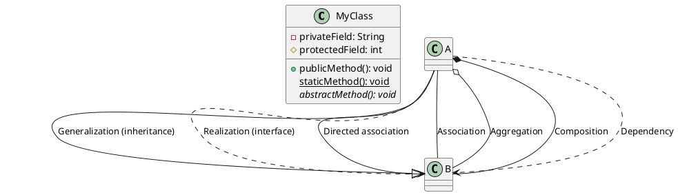

# CEN206 - Week 5: PlantUML Examples

This folder contains PlantUML (`.puml`) files demonstrating various UML diagram types.

## Files

| File | Diagram Type | Description |
|------|-------------|-------------|
| `class-diagram-example.puml` | Class Diagram | All relationship types (association, aggregation, composition, generalization, dependency, realization) |
| `sequence-diagram-example.puml` | Sequence Diagram | Login flow with `alt`, `loop`, and `opt` fragments |
| `usecase-diagram-example.puml` | Use Case Diagram | E-commerce system with actors, include, and extend |
| `state-diagram-example.puml` | State Diagram | Order lifecycle with nested states and guards |
| `activity-diagram-example.puml` | Activity Diagram | Checkout process with decisions, forks, and joins |
| `component-diagram-example.puml` | Component Diagram | Microservices architecture |
| `deployment-diagram-example.puml` | Deployment Diagram | Cloud deployment with Kubernetes and AWS |
| `object-diagram-example.puml` | Object Diagram | Runtime instances of a university system |
| `c4-model-example.puml` | C4 Model | Context diagram for an online bookstore |
| `er-diagram-example.puml` | ER Diagram | University enrollment database schema |

## How to Render

### Option 1: VS Code Extension (Recommended for Students)

1. Install **Visual Studio Code**.
2. Install the extension **PlantUML** by jebbs (`jebbs.plantuml`).
3. Open any `.puml` file.
4. Press `Alt + D` (or `Option + D` on macOS) to preview the diagram.
5. Right-click in the editor and select **PlantUML: Export Current Diagram** to save as PNG/SVG/PDF.

> **Note:** The VS Code extension requires either a local PlantUML server or Java + Graphviz installed.

### Option 2: Command Line with `plantuml.jar`

1. **Prerequisites:**
   - Java 8+ installed (`java -version` to check).
   - Download `plantuml.jar` from <https://plantuml.com/download>.
   - (Optional) Install Graphviz for certain diagram types: <https://graphviz.org/download/>.

2. **Generate a single diagram:**
   ```bash
   java -jar plantuml.jar class-diagram-example.puml
   ```
   This creates `class-diagram-example.png` in the same directory.

3. **Generate all diagrams at once:**
   ```bash
   java -jar plantuml.jar *.puml
   ```

4. **Generate SVG instead of PNG:**
   ```bash
   java -jar plantuml.jar -tsvg *.puml
   ```

5. **Generate PDF:**
   ```bash
   java -jar plantuml.jar -tpdf *.puml
   ```

### Option 3: Online Server

- Visit <https://www.plantuml.com/plantuml/uml> and paste the contents of any `.puml` file.
- The diagram renders instantly in the browser.

### Option 4: IntelliJ IDEA Plugin

1. Install the **PlantUML Integration** plugin from the JetBrains Marketplace.
2. Open a `.puml` file and the preview panel appears automatically.

## PlantUML Quick Reference



## Further Reading

- [PlantUML Official Documentation](https://plantuml.com/)
- [PlantUML Class Diagram Reference](https://plantuml.com/class-diagram)
- [PlantUML Sequence Diagram Reference](https://plantuml.com/sequence-diagram)
- [Real World PlantUML](https://real-world-plantuml.com/)
