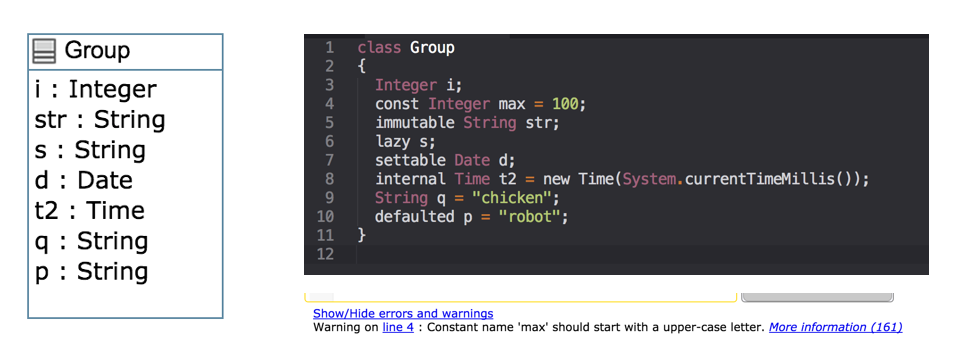
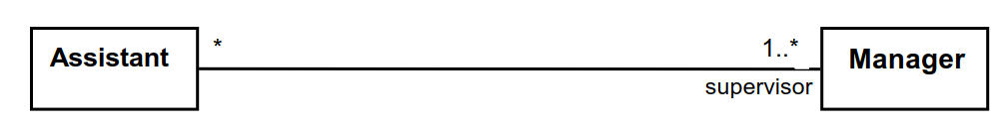
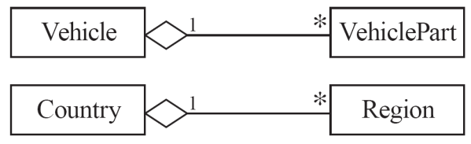

<!-- _backgroundColor: aquq -->

<!-- _color: orange -->

<!-- paginate: false -->

## CEN206 Object-Oriented Programming (formerly CE204)

## Week-6 (UMPLE - Part 1)

#### Spring Semester, 2024-2025

Download [DOC-PDF](ce204-week-6.en.md_doc.pdf), [DOC-DOCX](ce204-week-6.en.md_word.docx), [SLIDE](ce204-week-6.en.md_slide.pdf), [PPTX](ce204-week-6.en.md_slide.pptx),

<iframe width=700, height=500 frameBorder=0 src="../ce204-week-6.en.md_slide.html"></iframe>

---

<style scoped>section{ font-size: 25px; }</style>

<!-- paginate: true -->

## UMPLE

### Common Scope

- What is UMPLE?
- What is its purpose?
- How to create a UML model with UMPLE?
- What is philosophy of UMPLE?

---

<style scoped>section{ font-size: 25px; }</style>

### Common Scope

- How to use UMPLE?
  - UMPLE Online
  - Command-Line
  - Eclipse Plugin
  - Visual Studio Code Plugin

---

<style scoped>section{ font-size: 25px; }</style>

### Common Scope

- How to learn UMPLE?
  - Online Documentations
  - Video Tutorials
  - UMPLE Community

---

<style scoped>section{ font-size: 25px; }</style>

### Common Scope

- Overview of the basics of UMPLE
- Associations in UMPLE
- State machines in UMPLE
- Product lines in UMPLE: Mixins and Mixsets
- Other separation of concerns mechanisms: (Aspects and traits) and their code generation
- Other advanced features of UMPLE
- Hands-on exercise developing versions of a concurrent system using state machines and product lines.
- UMPLE as written in itself: A case study.

---

<style scoped>section{ font-size: 25px; }</style>

### Common Scope

- Introduction: 
- Overview of Model-Driven Development
  - Languages / Tools / Motivation for UMPLE
- Class Modeling
  - Tools / Attributes / Methods / Associations / Exercises / 
    Patterns
- Modeling with State Machines
  - Basics / Concurrency / Case study and exercises
- Separation of Concerns in Models
  - Mixins / Aspects / Traits
- More Case Studies and Hands-on Exercises
  - UMPLE in itself / Real-Time / Data Oriented
- Conclusion

---

### Outline - UMPLE Part 1

- Introduction to UMPLE
- Motivation for developing UMPLE
- Some key UMPLE innovations
- Using UMPLE
- UMPLE Philosophy
- UMPLE Class Modeling

---

### Outline - UMPLE Part 1

- UMPLE Online Usage
- UMPLE Attributes
- UMPLE Generalization and interfaces
- UMPLE Methods
- UMPLE Associations


---

## **Introduction to UMPLE**

--- 

<style scoped>section{ font-size: 25px; }</style>

### UMPLE: Si&mple&, A&mple&, &UM&L &P&rogramming &L&anguag&e&

- **Open source textual modelling tool set for 3 platforms**
  
  - Command line compiler
  
  - Web-based tool (UMPLEOnline) for demos and education
  
  - Eclipse plugin

- **Code generator for UML ++**
  
  - Infinitely nested state machines, with concurrency
  
  - Proper referential integrity and multiplicity constraints on  associations
  
  - Traits, mixins, aspects for modularity
  
  - Text generation templates, patterns, traits

- **Pre-processor to add UML, patterns and other features on top of 
  Java, PhP, C++ and other languages**

---

<style scoped>section{ font-size: 25px; }</style>

### UMPLE: Si&mple&, A&mple&, &UM&L &P&rogramming &L&anguag&e&

- Open source textual modeling tool and code generator
  - Adds modeling to Java,. C++, PHP
  - A sample of features
    - Referential integrity on associations
    - Code generation for patterns
    - Blending of conventional code with models
    - Infinitely nested state machines, with concurrency
    - Separation of concerns for models: mixins, traits, mixsets, aspects
- Tools
  - Command line compiler
  - Web-based tool (UMPLEOnline) for demos and education
  - Plugins for Eclipse and other tools

---

<style scoped>section{ font-size: 25px; }</style>

### What Are we Going to Learn About in This Tutorial? What Will You Be Able To Do?

- Modeling using **class diagrams**
  - Attributes, Associations, Methods, Patterns, Constraints
- Modeling using **state diagrams**
  - States, Events, Transitions, Guards, Nesting, Actions, Activities
  - Concurrency
- **Separation of Concerns** in Models
  - Mixins, Traits, Aspects, Mixsets
- Practice with a examples focusing on **state machines** and **product lines**
- Building a complete system in UMPLE

---

<style scoped>section{ font-size: 25px; }</style>

### What Technology Will You Need?

- As a minimum: Any web browser.
- For a richer command-line experience
  - A computer (laptop) with Java 8-14 JDK
  - Mac and Linux are the easiest platforms, but Windows also will work
  - Download UMPLE Jar at http://dl.UMPLE.org
- You can also run UMPLE in Docker: http://docker.UMPLE.org

---

<style scoped>section{ font-size: 25px; }</style>

### Key Websites

- Entry-point: https://www.UMPLE.org
  
  - Everything you need to get started with UMPLE

- Github: https://github.com/UMPLE/UMPLE
  
  - Source code and examples for UMPLE

- UMPLE Online: https://try.UMPLE.org
  
  - Online application for UMPLE

---

<style scoped>section{ font-size: 25px; }</style>

### Key Websites (Another way)

The UMPLEOnline web interface is at try.UMPLE.org

The user manual is at manual.UMPLE.org

The UMPLE home page is at www.UMPLE.org

UMPLE download page: dl.UMPLE.org

---

## **Motivation for developing UMPLE**

---

<style scoped>section{ font-size: 25px; }</style>

### Motivation for developing UMPLE (1)

Designers want the best combination of features: 

- <u>Textual editing</u> and blending with other languages 

- Ability to use in an <u>agile </u>process 
  
  - Write tests, continuous integration, versioning 
  
  - Combine the best of agility and modeling 

- Excellent <u>code generation</u> 
  
  - A complete generation of real systems (including itself) 

- <u>Multi-platform</u> (command line, Eclipse, VsCode, Web) 

- Practical and <u>easy to use</u> for developers 
  
  - Including great documentation 

- <u>Open source</u>

---

<style scoped>section{ font-size: 25px; }</style>

### Motivation for developing UMPLE (2)

Many existing tools: 

- Lacked in usability
  
  - Awkward to edit diagrams
  
  - Many steps to do a task
  
  - Lengthy learning process

- Lack in ongoing support

- Could be enhanced by us perhaps, but we would be tied to key decisions (e.g. Eclipse-only)

---

## **Some key UMPLE innovations**

---

<style scoped>section{ font-size: 25px; }</style>

## Some key UMPLE innovations

- Model is code
  
  - Traditional code is embedded in model

- No need to edit generated code
  
  - No *round-trip engineering*

---

## **Using UMPLE**

---

<style scoped>section{ font-size: 25px; }</style>

### Using UMPLE

- We will mostly be using
  
  - UMPLEonline
    
    - In a web browser: http://try.UMPLE.org
    
    - Or in Docker: http://docker.UMPLE.org
  
  - UMPLE on the command line: http://dl.UMPLE.org
    
    - Needs Java 8 JDK on the command line: 
      
      - http://bit.ly/1lO1FSV
        
        - Java 9 works well too

---

### Docker Container Experimental

```bash
mkdir ~/src && cd ~/src &&  git clone git@github.com:UMPLE/UMPLE.git
```

```bash
docker run -i -t -v `pwd`:/src UMPLE/UMPLE:0.4.0 bash
```

---

<style scoped>section{ font-size: 25px; }</style>

### Using UMPLE

- Optional:
  
  - UMPLE in Eclipse 
    
    - https://github.com/UMPLE/UMPLE/wiki/InstallEclipsePlugin
  
  - cmake and gcc for compiling C++ code

---

## **UMPLE Philosophy**

---

<style scoped>section{ font-size: 25px; }</style>

### UMPLE Philosophy 1-4

- P1. Modeling is programming and vice versa

- P2. An UMPLE programmer should never need to edit generated code to accomplish any task.

- P3. The UMPLE compiler can accept and generate code that uses nothing but UML abstractions. 
  
  - The above is the inverse of the following

- P4. A program without UMPLE features can be compiled by an UMPLE compiler.
  
  - e.g. input Java results in the same as output

---

<style scoped>section{ font-size: 25px; }</style>

### UMPLE Philosophy 5-8

- P5. A programmer can incrementally add UMPLE features to an existing program
  
  - Umplification

- P6. UMPLE extends the base language in a minimally invasive and safe way.

- P7. UMPLE features can be created and viewed diagrammatically or textually

- P8. UMPLE goes beyond UML

---

## **UMPLE Class Modeling**

---

<style scoped>section{ font-size: 25px; }</style>

### UMPLE Class Models - Quick Overview

- Key elements:
  
  - Classes
  
  - Attributes
  
  - Associations
  
  - Generalizations
  
  - Methods

- We will look at all these using examples via UMPLE ONLINE

- UMPLE code/models are stored in files with suffix **.ump**

---

<style scoped>section{ font-size: 25px; }</style>

### Exercise: Compiling and changing a model

- Look at the example at the bottom of  
  
  - http://helloworld.UMPLE.org (also on next slide)
    - Observe: attribute, association, class hierarchy, mixin

- Click on Load the above code into UMPLEOnline
  
  - Observe and modify the diagram
  - Add an attribute
  - Make a multiplicity error, then undo
  - Generate code and take a look
  - Download, compile and run if you want

---

<style scoped>section{ font-size: 25px; }</style>

### Hello World Example 2 in the User Manual

  

---

<style scoped>section{ font-size: 25px; }</style>

### **Key tools:**

- UMPLE Online
- Command-Line
- User Manual

---

<style scoped>section{ font-size: 25px; }</style>

### Hello World example 2 in UMPLEOnline


---

<style scoped>section{ font-size: 25px; }</style>

### Exploration of UMPLEOnline

- Explore class diagram examples
- Options
  - `T` or `Control-t` (**hide and show text**)
  - `D` or `Control-d` (**hide and show diagram**)
  - `A`, `M` to **hide and show attributes, methods**
  - Default diagram types
    - `G`/`Control-g` (**Graphviz**), `S`/`Control-s` (**State Diagram**)
    - `E`/`Control-e` (**Editable class diagram**)
- Generate code and look at the results
  - In UMPLE you never should modify generated code
  - It is designed to be readable for educational purposes

---

<style scoped>section{ font-size: 25px; }</style>

### Use of the UMPLEOnline Docker image

- UMPLE's server can handle `80,000` transactions per hour
  
  - Code generations, edits

- But needs a good Internet connection
  (sometimes hundreds of students have assignments due)

- To maximize speed of UMPLEOnline run it in your local machine:
  
  - Follow the instructions at http://docker.UMPLE.org

---

<style scoped>section{ font-size: 25px; }</style>

### Demo of compiling on the command line

- To compile on the command line you will need Java 8
- Download UMPLE from http://dl.UMPLE.org
- Basic compilation

```bash
java -jar UMPLE.jar model.ump
```

- Help for features and commands

```bash
java -jar UMPLE.jar --help
```

- To generate and compile the java to a final system

```bash
java –jar UMPLE.jar model.ump -c -
```

---

<style scoped>section{ font-size: 25px; }</style>

### Quick walkthrough of the user manual

- http://manual.UMPLE.org

**Note in particular**

- Key sections: 
  - attributes, 
  - associations, 
  - state machines
- Grammar
- Generated API
- Errors and warnings
- Editing pages in github

---

## **UMPLE Attributes**

- More than just variables
  - http://attributes.UMPLE.org

---

<style scoped>section{ font-size: 25px; }</style>

### Attributes



---

<style scoped>section{ font-size: 25px; }</style>

### Attributes Exercise #1


---

<style scoped>section{ font-size: 25px; }</style>

### Attributes

- "*Instance variables*"
  
  - Part of the state of an object
  - Simple data that will always be present in each instance

- Specified like a Java or C++ field or member variable

- But, intended to be more abstract!
  
  - **Example**, with an initial value

```java
a = "init value";
```

---

### Attributes

- As in UML, more abstract than instance variables
  
  - Always private by default
  
  - Should only be accessed get, set methods 
  
  - Can be stereotyped (upcoming slides) to affect code  generation
  
  - Can have aspects applied (discussed later)
  
  - Can be constrained (discussed later)

---

<style scoped>section{ font-size: 25px; }</style>

### Code generation from attributes

- Default code generation
  - Generates a `getName()` and `setName()` method for `name`
    - `public`
- Creates an arguments in the class constructor by default
- An attribute is `private` to the class by default
  - _Should only be accessed get, set methods_

---

### Code Generation (JavaDocs)


---

<style scoped>section{ font-size: 25px; }</style>

### Code Generation Patterns

- Attributes
  
  - Set/Get (UB = 1)
  - Add/Remove/NumberOf/IndexOf/Get (UB > 1)
  - Lazy immutability
  - Default values
  - Constants
  - Before / After cod
  
  UB = upper bound

---

<style scoped>section{ font-size: 25px; }</style>

### Code Generation Patterns

- Associations
  
  - Set/Get (UB = 1)
  - Add/Remove/NumberOf/IndexOf/Get (UB > 1)
  - Referential Integrity
  - Multiplicity Constraints
  - 42 different cases
  
  UB = upper bound

---

### Code Generation (Semantics)

- http://api.UMPLE.org/


---

<style scoped>section{ font-size: 25px; }</style>

### UMPLE builtin datatypes

```java
String // (default if none specified)
Integer
Float
Double
Boolean
Time
Date
```

- The above will generate appropriate code in Java, C++ etc.
  - e.g. Integer becomes int
- Other (native) types can be used but without guaranteed correctness

---

<style scoped>section{ font-size: 25px; }</style>

### Attribute stereotypes (1)

- Code generation can be controlled through stereotypes:
  - lazy - **don't add a constructor argument**

```java
lazy b; // sets it to null, 0, "" depending on type
```

- Defaulted – _can be reset_

```java
defaulted s = "def"; // resettable to the default
```

---

<style scoped>section{ font-size: 25px; }</style>

### Attribute stereotypes (2)

- autounique – provide a unique value to each instance

```java
autounique x; // sets attribute to 1, 2, 3 ...
```

- internal – don't generate any methods

```java
internal i; // doesn't generate any get/set either
```

---

<style scoped>section{ font-size: 25px; }</style>

### Immutability

- Useful for objects where you want to guarantee no possible change once created
  
  - e.g. a geometric point

- Generate a constructor argument and get method but no set method

```java
immutable String str;
```

- No constructor argument, but allows setting just once.

```java
lazy immutable z;
```

---

<style scoped>section{ font-size: 25px; }</style>

### Lets explore attributes by example

- Go to
  - http://attributes.UMPLE.org

---

<style scoped>section{ font-size: 25px; }</style>

### Derived attributes

- These generate a get method that is calculated.

```java
class Point
{
// Cartesian coordinates
Float x;
Float y;

// Polar coordinates
Float rho =
{Math.sqrt(Math.pow(getX(), 2) + Math.pow(getY(), 2))}
Float theta =
{Math.toDegrees(Math.atan2(getY(),getX()))}

}
```

---

<style scoped>section{ font-size: 25px; }</style>

### Multi-valued attributes

- Limit their use. Associations are generally better.

```java
class Office {
Integer number;
Phone[] installedTelephones;
}

class Phone {
String digits;
String callerID;
}
```

---

<style scoped>section{ font-size: 25px; }</style>

### Keys

- Enable UMPLE to generate an `equals()` and a `hashcode()` method

```java
class Student {
Integer id;
name;
key { id }
}
```

- The user manual has a sports team example showing keys on associations too
- Note how this feature is not inherited from UML

---

## **UMPLE Generalization and interfaces**

---

<style scoped>section{ font-size: 25px; }</style>

### Generalization in UMPLE

- UMPLE uses the `isA` keyword to indicate generalization
- Used to indicate `superclass`, used `trait`, implemented `interface`

```java
class Shape {
colour;
}
class Rectangle {
isA Shape;
}
```

---

<style scoped>section{ font-size: 25px; }</style>

### Avoiding unnecessary generalizations

[Open in UMPLE](https://cruise.UMPLE.org/UMPLEonline/?text=class%20Recording&#123;%20%20*%20--%201%20RecordingCategory%20category;&#125;class%20RecordingCategory&#123;%20%200..1%20--%20*%20RecordingCategory%20subcategory;&#125;//$?[End_of_model]$?class%20Recording&#123;%20%20position%20157%2030%20109%2045;%20%20position.association%20Recording__RecordingCategory%2062,46%2075,0;&#125;class%20RecordingCategory&#123;%20%20position%20149%20135%20133%2045;&#125;)

- Inappropriate hierarchy of Classes

- What should the model be?


---

<style scoped>section{ font-size: 25px; }</style>

### Interfaces

- Declare signatures of a group of methods that must be implemented by various classes

- Also declared using the keyword `isA`

- Essentially the same concept as in Java

- _Let's explore examples in the user manual …_

---

## **UMPLE Methods**

---

<style scoped>section{ font-size: 25px; }</style>

### User-written **Methods** in UMPLE

- Methods can be added to any UMPLE code.

- UMPLE parses the signature only; the rest is passed to the  generated code.

- You can specify different bodies in different languages

- _We will look at examples in the user manual …_

---

## **UMPLE Associations**

- [http://associations.UMPLE.org](http://associations.UMPLE.org)
  
  - Notice the inline and independent state machines

---

<style scoped>section{ font-size: 25px; }</style>

### Associations


---

<style scoped>section{ font-size: 25px; }</style>

### Associations Exercise #1


---

<style scoped>section{ font-size: 25px; }</style>

### Associations Exercise #2


---

<style scoped>section{ font-size: 25px; }</style>

### Associations

- Describe how instances of classes are linked at runtime 
  - Bidirectional `--` or 
  - Unidirectional `->`
- Multiplicity: 
  - Bounds on the number of linked instances
- `*` Or `0..*`  $\longrightarrow$ 0 or more
- `1..*`        $\longrightarrow$ 1 or more
- `1`           $\longrightarrow$ Exactly 1
- `2`           $\longrightarrow$ Exactly 2
- `1..3`        $\longrightarrow$ Between 1 and 3
- `0..2`        $\longrightarrow$ Up to 2

---

<style scoped>section{ font-size: 25px; }</style>

### Association Relationships


---

<style scoped>section{ font-size: 25px; }</style>

### Association Relationships

- Directional Associations

```bash
* -> 0..1, * -> 1, * -> *, * -> m..n, * - >n, *->m..* and*->0..n.
```

- Symmetric Reflexive

```bash
0..1, 0..n, *, 1, n, m..n,m..*
```

---

<style scoped>section{ font-size: 25px; }</style>

### Basic UML associations


---

<style scoped>section{ font-size: 25px; }</style>

### Many-to-one associations (1)

```java
class Employee {
id;
firstName;
lastName;
}

class Company {
name;
1 -- * Employee;
}
```

---

<style scoped>section{ font-size: 25px; }</style>

### Many-to-one associations (2)

- A company has many employees, 
- An employee can only work for one company.
  - This company will not store data about the  moonlighting activities of employees! 
- A company can have zero employees
  - E.g. a 'shell' company
- It is not possible to be an employee unless you work for a company
- Let's draw and write this in UMPLEOnline:


---

<style scoped>section{ font-size: 25px; }</style>

### Role names (optional, in most cases)

- Allow you to better label either end of an association

```java
class Person{
id;
firstName;
lastName;
}

class Company {
name;
1 employer -- * Person employee;
}
```

---

<style scoped>section{ font-size: 25px; }</style>

### Referential Integrity

- When an instance on one side of the association changes
  
  - The linked instances on the other side know …
  
  - And vice-versa

- This is standard in UMPLE associations, which are 
  bidirectional

---

<style scoped>section{ font-size: 25px; }</style>

### Many-to-Many Associations

- An assistant can work for many managers
- A manager can have many assistants
- Assistants can work in pools working for several  managers
- Managers can have a group of assistants
- Some managers might have zero assistants. 
- Is it possible for an assistant to have, perhaps  temporarily, zero managers?

[Open in UMPLE](https://cruise.UMPLE.org/UMPLEonline/?text=class%20Assistant%20&#123;&#125;class%20Manager%20&#123;%20%201..*%20supervisor%20--%20*%20Assistant;&#125;//$?[End_of_model]$?class%20Assistant&#123;%20%20position%2049%2030%20109%2045;&#125;class%20Manager&#123;%20%20position%2073%20127%20109%2045;&#125;)



---

<style scoped>section{ font-size: 25px; }</style>

### One-to-One Associations (Use cautiously)

- For each company, there is exactly one board of  directors
- A board is the board of only one company
- A company must always have a board
- A board must always be of some company

[Open in UMPLE](https://cruise.UMPLE.org/UMPLEonline/?text=class%20Company%20&#123;&#125;class%20BoardOfDirectors%20&#123;&#125;association%20&#123;%20%201%20Company%20--%201%20BoardOfDirectors;&#125;//$?[End_of_model]$?class%20Company&#123;%20%20position%2050%2030%20109%2045;&#125;class%20BoardOfDirectors&#123;%20%20position%2050%20130%20109%2045;&#125;)


---

<style scoped>section{ font-size: 25px; }</style>

### Typical erroneous use of one-to-one


---

<style scoped>section{ font-size: 25px; }</style>

### Unidirectional Associations

- Associations are by default bi-directional
- It is possible to limit the direction of an association by adding an arrow at one end
- In the following unidirectional association
  - A Day knows about its notes, but a Note does not know which Day is belongs to
  - Note remains 'uncoupled' and can be used in other contexts

```java
class Day {
* -> 1 Note;
}
class Note {}
```

[Open in UMPLE](https://cruise.UMPLE.org/UMPLEonline/?text=class%20Day%20&#123;%20%20*%20-%3E%201%20Note;&#125;class%20Note%20&#123;&#125;//$?[End_of_model]$?class%20Day&#123;%20%20position%2050%2031%20109%2045;%20%20position.association%20Day__Note%2030,46%2030,0;&#125;class%20Note&#123;%20%20position%2050%20131%20109%2045;&#125;)


---

<style scoped>section{ font-size: 25px; }</style>

### Association Classes

- Sometimes, an attribute that concerns two associated classes cannot be placed in either of the classes

[Open in UMPLE](https://cruise.UMPLE.org/UMPLEonline/?text=class%20Student%20&#123;&#125;class%20CourseSection%20&#123;&#125;class%20Registration%20&#123;%20%20*%20--%201%20Student;%20%20*%20--%201%20CourseSection;&#125;//$?[End_of_model]$?class%20Student&#123;%20%20position%2050%2030%20109%2045;&#125;class%20CourseSection&#123;%20%20position%2097%20203%20109%2045;&#125;class%20Registration&#123;%20%20position%2067%20123%20109%2045;%20%20position.association%20CourseSection__Registration%2084,45%2029,0;&#125;)

and [Extended Example](https://cruise.UMPLE.org/UMPLEonline/?text=class%20Student%20%7B%7D%0A%0Aclass%20CourseSection%20%7B%20%0A%0A%201%20--%20*%20Evaluation%3B%0A%7D%0A%0Aclass%20Registration%20%7B%0A%20%20finalGrade%3B%0A%20%20*%20--%201%20Student%3B%0A%20%20*%20--%201%20CourseSection%3B%0A%7D%0A%0Aclass%20ComponentGrade%0A%7B%0A%20%20Integer%20value%3B%0A%20%20*%20--%201%20Registration%3B%0A%20%20*%20--%201%20Evaluation%3B%0A%7D%0A%0Aclass%20Evaluation%0A%7B%0A%20%20description%3B%0A%20%20Float%20weight%3B%0A%7D%0A%0A%2F%2F%24%3F%5BEnd_of_model%5D%24%3F%0A%0Aclass%20Student%0A%7B%0A%20%20position%2050%2030%20109%2045%3B%0A%7D%0A%0Aclass%20CourseSection%0A%7B%0A%20%20position%2088%20229%20109%2045%3B%0A%20%20position.association%20CourseSection__Evaluation%20110%2C43%202%2C0%3B%0A%7D%0A%0Aclass%20Registration%0A%7B%0A%20%20position%2052%20123%20145%2063%3B%0A%20%20position.association%20CourseSection__Registration%2071%2C63%2029%2C0%3B%0A%20%20position.association%20Registration__Student%2030%2C0%2030%2C46%3B%0A%7D%0A%0Aclass%20ComponentGrade%0A%7B%0A%20%20position%20305%20124%20124%2046%3B%0A%20%20position.association%20ComponentGrade__Registration%200%2C27%20146%2C26%3B%0A%20%20position.association%20ComponentGrade__Evaluation%2064%2C63%20102%2C0%3B%0A%7D%0A%0Aclass%20Evaluation%0A%7B%0A%20%20position%20252%20293%20149%2063%3B%0A%7D)


- The following are nearly equivalent
  - The only difference:
    - in the association class there can be only a single registration of a given Student in a CourseSection


---

<style scoped>section{ font-size: 25px; }</style>

### Association classes (cont.)

- UMPLE code 

```java
class Student {}
class CourseSection {}
associationClass Registration {
*  Student;
*  CourseSection;
}
```

- Open in UMPLEOnline, and then generate code

---

<style scoped>section{ font-size: 25px; }</style>

### Reflexive Associations

- An association that connects a class to itself


[Open in UMPLE](https://cruise.UMPLE.org/UMPLEonline/?text=class%20Course%20&#123;%20%20%20*%20self%20isMutuallyExclusiveWith;&#125;association%20&#123;%20%20%20%20%20*%20Course%20successor%20--%20*%20Course%20prerequisite;&#125;//$?[End_of_model]$?class%20Course&#123;%20%20position%20122%2025%20109%2045;&#125;)

```java
class Course {
* self isMutuallyExclusiveWith; // Symmetric
}

association {
* Course successor -- * Course prerequisite;
} 
```

---

<style scoped>section{ font-size: 25px; }</style>

### Inline vs. Standalone associations

- The following are equivalent to allow flexibility:

```java
class X {}
class Y {
1 -- * X;

}
```

```java
class X {}
class Y {}
association {
1 Y -- * X;

}
```

---

<style scoped>section{ font-size: 25px; }</style>

### Aggregation

- Aggregations are ordinary associations that represent part-whole relationships. 
  - The 'whole' side is often called the assembly or the aggregate
  - This is a shorthand for association named `isPartOf`
  - UMPLE has no special syntax currently



```java
class Vehicle {
1 whole -- * VehiclePart part;
}
class VehiclePart{
}
```

---

<style scoped>section{ font-size: 25px; }</style>

### Composition

- A composition is a strong kind of aggregation 
  - If the aggregate is destroyed, then the parts are destroyed as well


```java
class Building {
1 <@>- * Room;
}
class Room{
}
```

---

<style scoped>section{ font-size: 25px; }</style>

### Sorted Associations

- Order objects in the association according to a specific key

```java
class Academy {
1 -- * Student registrants sorted {id};
}

class Student {
Integer id;
name;
}
```

- We will look at a more complete example in the User Manual

---

<style scoped>section{ font-size: 25px; }</style>

### A final word on associations

- More help and examples are in the user manual online at
  - http://associations.UMPLE.org

---

## References

- [UMPLE Tutorials](https://github.com/UMPLE/UMPLE/wiki/Tutorials)
- [UMPLE Github](https://github.com/UMPLE/UMPLE)
- [UMPLE Online](https://UMPLE.org)
- [UMPLE Documentation](https://cruise.UMPLE.org/UMPLE/)
- [UMPLE CSI5112– February 2018](http://www.site.uottawa.ca/~mgarz042/files/CSI5112-UMPLE.pdf)
- [UMPLE Tutorial: Models 2020 Web](https://cruise.UMPLE.org/presentations/UMPLEModels2020Tutorial/)
- [UMPLE Tutorial: Models 2020 Pdf](https://cruise.UMPLE.org/presentations/UMPLEModels2020Tutorial/UMPLETutForModels2020.pdf)

---

## References

- [Getting Started in UMPLE](https://cruise.UMPLE.org/UMPLE/GettingStarted.html)
- [Experiential Learning for Software Engineering Using Agile Modeling in UMPLE (Youtube)](https://www.youtube.com/watch?v=yif1clbrXnI&ab_channel=CSEETconf)
- [Experiential Learning for Software Engineering Using Agile Modeling in UMPLE (Slide)](https://cruise.UMPLE.org/presentations/UMPLETutorialCSEET2020.pdf)
- [Tomassetti Code Generation](https://tomassetti.me/code-generation/)

---

$End-Of-Week-6$