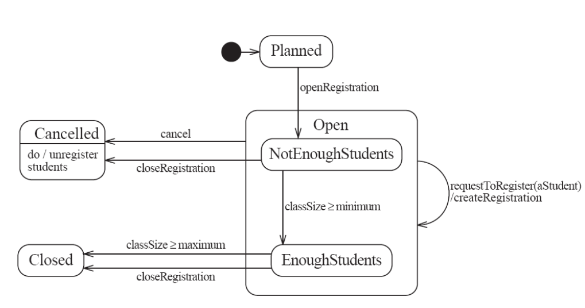
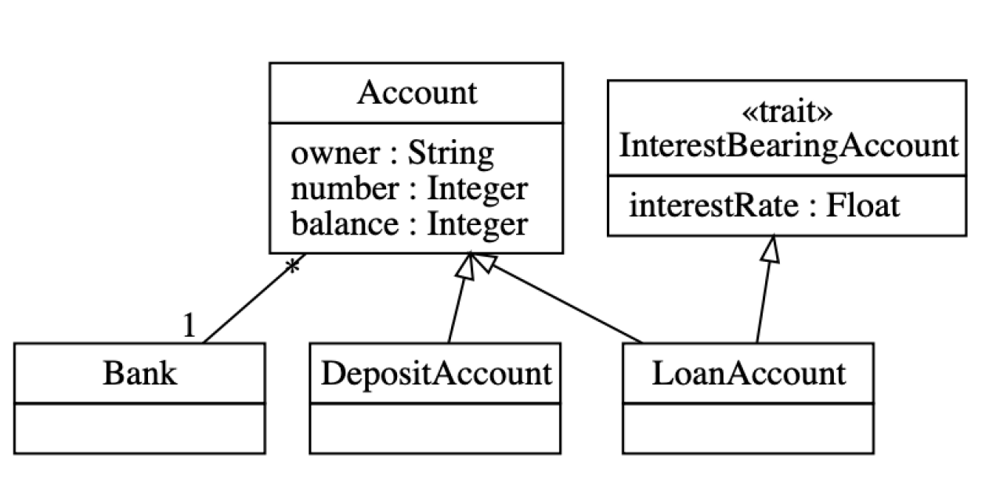
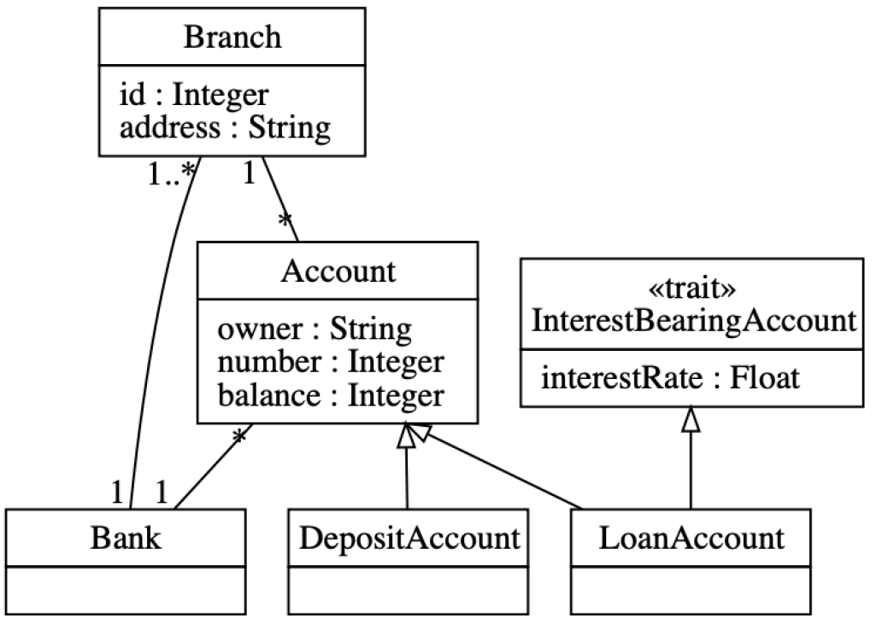
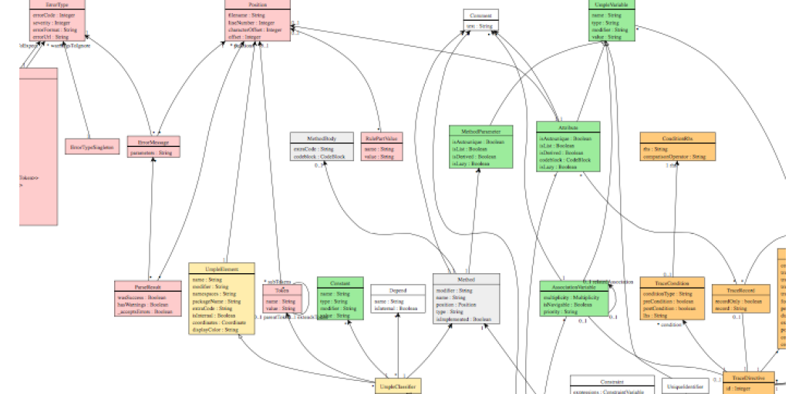
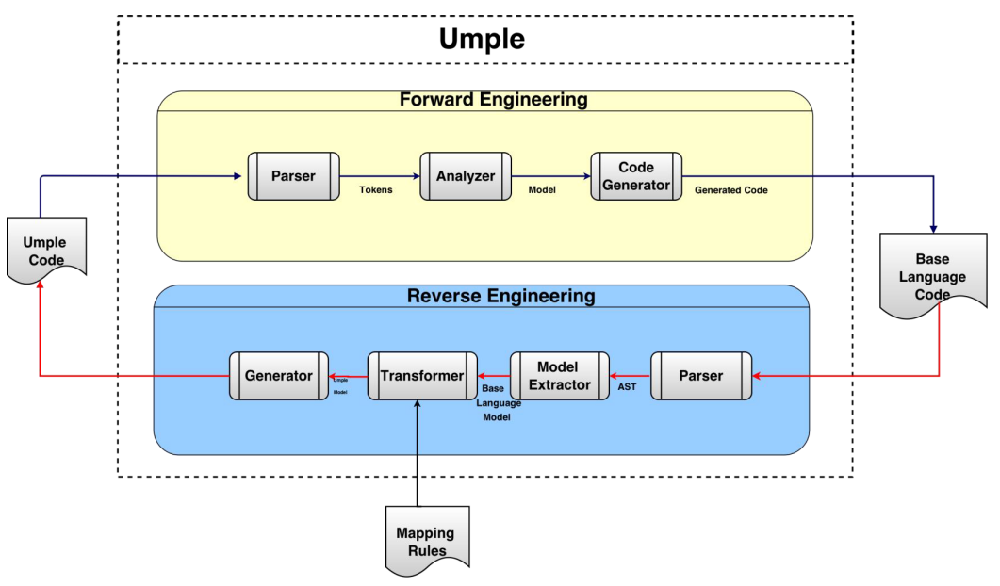
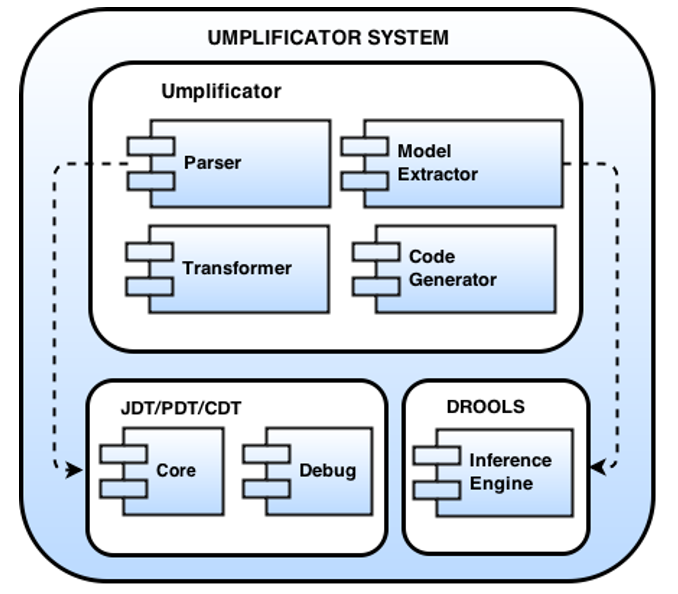
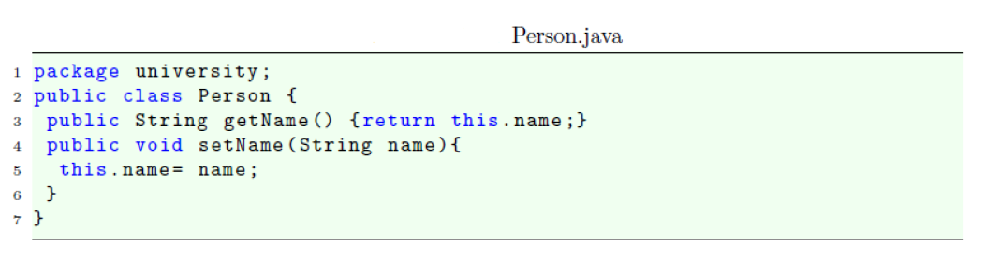
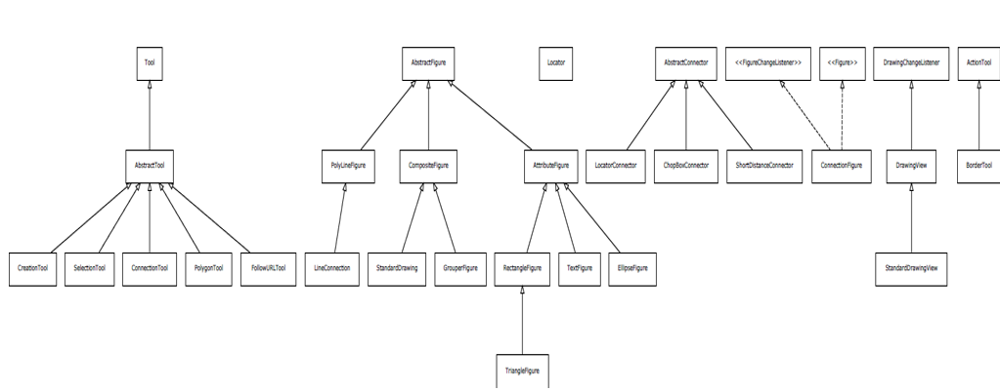
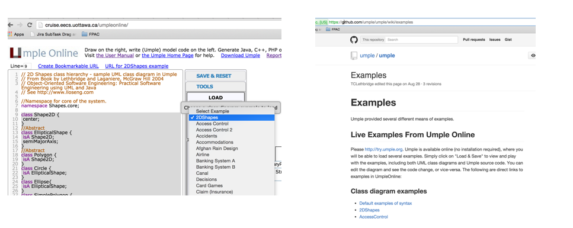

<!-- _backgroundColor: aquq -->

<!-- _color: orange -->

<!-- paginate: false -->

## CEN206 Object-Oriented Programming (formerly CE204)

## Week-7 (UMPLE - Part 2)

#### Spring Semester, 2024-2025

Download [DOC-PDF](ce204-week-7.tr.md_doc.pdf), [DOC-DOCX](ce204-week-7.tr.md_word.docx), [SLIDE](ce204-week-7.tr.md_slide.pdf), [PPTX](ce204-week-7.tr.md_slide.pptx),

<iframe width=700, height=500 frameBorder=0 src="../ce204-week-7.tr.md_slide.html"></iframe>

---

<style scoped>section{ font-size: 25px; }</style>

<!-- paginate: true -->

## UMPLE

### Common Scope

- What is UMPLE?
- What is its purpose?
- How to create a UML model with UMPLE?
- What is philosophy of UMPLE?

---

<style scoped>section{ font-size: 25px; }</style>

### Common Scope

- How to use UMPLE?
  - UMPLE Online
  - Command-Line
  - Eclipse Plugin
  - Visual Studio Code Plugin

---

<style scoped>section{ font-size: 25px; }</style>

### Common Scope

- How to learn UMPLE?
  - Online Documentations
  - Video Tutorials
  - UMPLE Community

---

<style scoped>section{ font-size: 25px; }</style>

### Common Scope

- Overview of the basics of Umple
- Associations in Umple
- State machines in Umple
- Product lines in Umple: Mixins and Mixsets
- Other separation of concerns mechanisms: (Aspects and traits) and their code generation
- Other advanced features of Umple
- Hands-on exercise developing versions of a concurrent system using state machines and product lines.
- Umple as written in itself: A case study.

---

<style scoped>section{ font-size: 25px; }</style>

### Common Scope

- Introduction: 
- Overview of Model-Driven Development
  - Languages / Tools / Motivation for Umple
- Class Modeling
  - Tools / Attributes / Methods / Associations / Exercises / 
    Patterns
- Modeling with State Machines
  - Basics / Concurrency / Case study and exercises
- Separation of Concerns in Models
  - Mixins / Aspects / Traits
- More Case Studies and Hands-on Exercises
  - Umple in itself / Real-Time / Data Oriented
- Conclusion

---

### Outline - Part 2

- Modeling exercises
- Simple patterns (if time)
- Basic state machines
- Analysing models
- Concurrency
- State machine case study
- Mixins
- Aspect orientation

---

### Outline - Part 2

- Traits
- Mixins and Traits together
- Mixsets
- Case Studies
- Unit Testing with UMPLE
- UMPLE issues list
- UMPLE's Architecture
- Umplification
- Conclusion

---

## **Modeling exercises**

---

<style scoped>section{ font-size: 25px; }</style>

### Modeling Exercise

- Build a class diagram for the following description. 

- If you think there are key requirements missing, then add them.
  
  - A football (soccer) team has players. Each player plays a  position. The team plays some games against other teams during each season. The system needs to record who scored goals, and the score of each game.

---

## **Simple patterns (if time)**

---

<style scoped>section{ font-size: 25px; }</style>

### Singleton pattern

- Standard pattern to enable only a single instance of a class to be created.
  
  - `private` constructor
  - `getInstance()` method

- Declaring in Umple

```java
class University {
singleton;
name;
} 
```

---

<style scoped>section{ font-size: 25px; }</style>

### Delegation pattern

- A class calls a method in its "**neighbour**"

```java
class RegularFlight {
flightNumber;
}

Class SpecificFlight {
* -- 1 RegularFlight;
flightNumber = {getRegularFlight().getFullNumber()}
}
```

- Full details of this example in the user manual

---

<style scoped>section{ font-size: 25px; }</style>

### Basic constraints

- Shown in square brackets
  - Code is added to the constructor and the set method

```java
class X {
Integer i;
[! (i == 10)]
}
```

- We will see constraints later in state machines

---

## **Basic state machines**

- http://statemachines.umple.org 

---

<style scoped>section{ font-size: 25px; }</style>

### Basics of state machines

- At any given point in time, the system is in one state.

- It will remain in this state until an event occurs that causes it to change state.

- A state is represented by a rounded rectangle containing the name of the state.

- Special states:
  
  - A black circle represents the _start state_
  - A circle with a ring around it represents an _end state_

---

<style scoped>section{ font-size: 25px; }</style>

### Garage door state machine

```java
class GarageDoor{
  status {
    Open {
      buttonOrObstacle -> Closing;
    }
    Closing {
      buttonOrObstacle -> Opening;
      reachBottom -> Closed;
    }
    Closed {
      buttonOrObstacle -> Opening;
    }
    Opening {
      buttonOrObstacle -> HalfOpen;
      reachTop -> Open;
    }
    HalfOpen {
      buttonOrObstacle -> Opening;
    }
  }
}
```

---

<style scoped>section{ font-size: 25px; }</style>

### Events

- An occurrence that may trigger a change of state
  - Modeled in Umple as generated methods that can be called
- Several states may be able to respond to the same event

---

<style scoped>section{ font-size: 25px; }</style>

### Transitions

- A change of state in response to an event.
  - It is considered to occur **instantaneously**.
- The label on each transition is the event that causes the change of state.

---

<style scoped>section{ font-size: 25px; }</style>

### State diagrams – an example with conditional transitions


---

<style scoped>section{ font-size: 25px; }</style>

### Actions in state diagrams

- An action is a block of code that must be executed effectively instantaneously
  - When a particular transition is taken,
  - Upon entry into a particular state, or
  - Upon exit from a particular state
- An action should consume no noticeable amount of time

---

<style scoped>section{ font-size: 25px; }</style>

### Nested substates and guard conditions

- A state diagram can be nested inside a state. 
  - The states of the inner diagram are called substates.


---

<style scoped>section{ font-size: 25px; }</style>

### Nested state diagram – Another example



---

<style scoped>section{ font-size: 25px; }</style>

### Auto-transitions

- A transition taken immediately upon entry into a state
  - Unless guarded
- We will look at an example in the user manual

---

<style scoped>section{ font-size: 25px; }</style>

### Events with parameters

- Parameters can be referenced in guards and actions.
- We will look at an example in the user manual.

---

## **Analysing models**

---

<style scoped>section{ font-size: 25px; }</style>

### Models can be analysed in several ways

- Visually
- Automatically generated errors and warnings
- State tables (next slide)\
- Metrics
- Formal methods (nuXMV)

---

<style scoped>section{ font-size: 25px; }</style>

### State tables and simulations

- Allow analysis of state machines statically without having to write code
- We will explore these in UmpleOnline by looking at state machine examples and generating tables and simulations

---

## **Concurrency**

---

<style scoped>section{ font-size: 25px; }</style>

### Do activities and concurrency

- A do activity executes
  - In a separate thread
  - Until
    - Its method terminates, or
    - The state needs to exit (killing the tread)
- Example uses:
  - Outputting a stream (e.g. playing music)
  - Monitoring something
  - Running a motor while in the state
  - Achieving concurrency, using multiple do activities

---

<style scoped>section{ font-size: 25px; }</style>

### Active objects

- These start in a separate thread as they are instantiated.

- Declared with the keyword

```java
active
```

---

<style scoped>section{ font-size: 25px; }</style>

### Default threading in state machines

- As discussed so far, code generated for state machines has the following behaviour:
  - A single thread:
    - Calls an event
    - Executes the event (running any actions)
    - Returns to the caller and continues
- This has two problems:
  - If another thread calls the event at the same time they will **interfere**
  - There can be **deadlocks** if an action itself triggers an event

---

<style scoped>section{ font-size: 25px; }</style>

### Queued state machines

- Solve the threading problem:
  
  - Callers can add events to a queue without blocking
  - A separate thread takes items off the queue ‘as fast as it can’ and processes them

- Umple syntax: `queued` before the state machine declaration

- *We will look at examples in the manual*

---

<style scoped>section{ font-size: 25px; }</style>

### Pooled state machines

- Default Umple Behavior (including with queued):
  - If an event is received but the system is not in a state that  can handle it, then the event is ignored.
- Alternative `pooled` stereotype:
  - Uses a queue (see previous slide)
  - Events that cannot be processed in the current state are  left at the head of the queue until a relevant state reached
  - The first relevant event nearest the head of the queue is processed
  - Events may hence be processed out of order, but not ignored

---

<style scoped>section{ font-size: 25px; }</style>

### **Unspecified** pseudo-event

- Matches any event that is not listed

- Can be in any state, e.g.

```java
unspecified -> error;
```

---

<style scoped>section{ font-size: 25px; }</style>

### Example using unspecified

```java
class AutomatedTellerMachine{
  queued sm {
    idle {
      cardInserted -> active; maintain -> maintenance;
      unspecified -> error1;
    }        
    maintenance { isMaintained -> idle; }
    active {
        entry /{addLog("Card is read");}
        exit /{addLog("Card is ejected");}
      validating {
        validated -> selecting;
        unspecified -> error2;
      }
      selecting {select -> processing; }
      processing {
        selectAnotherTransiction -> selecting;
        finish -> printing;
      }
      printing {receiptPrinted -> idle;}
      cancel -> idle;
    }
    error1 {entry / {printError1();} ->idle;}
    error2 {entry / {printError2();} ->validating;}
  }
}
```

---

<style scoped>section{ font-size: 25px; }</style>

### State machines in the user manual

- http://statemachines.umple.org

---

## **State machine case study**

---

<style scoped>section{ font-size: 25px; }</style>

### State machine for a phone line


---

<style scoped>section{ font-size: 25px; }</style>

### Umple for the phone line example

```java
class phone {
state {
onHook {
startDialing -> dialling;
incomingCall -> ringing;

}

ringing {
pickUp -> communicating;
otherPartyHangUp -> onHook;

}

communicating {
hangUp -> onHook;
otherPartyHangUp -> waitForHook;
putOnHold -> onHold;

}

onHold {
hangUp -> onHook;
otherPartyHangUp -> waitForHook;
takeOffHold -> communicating;

}
```

- next slide

---

<style scoped>section{ font-size: 25px; }</style>

### Umple for the phone line example

- con't. 

```java
dialing {
completeNumber -> 
waitingForConnection;
hangUp -> onHook;

}

waitingForConnection {
otherPartyPickUp -> communicating;
hangUp -> onHook;
timeOut -> onHook;

}

waitForHook {
hangUp -> onHook;

}

}

}
```

---

<style scoped>section{ font-size: 25px; }</style>

### In-class modeling exercise for state machines

- Microwave oven system state machine
  - Events include
    - pressing of buttons
    - door opening
    - door closing
    - timer ending
    - etc.

---

## **Mixins**

---

### Mixins : Motivation

- Product variants have long been important for
  
  - Product lines/families, whose members target different:
    
    - hardware, OS, feature sets, basic/pro versions
  
  - Feature-oriented development (separation of concerns)

---

<style scoped>section{ font-size: 25px; }</style>

### Separation of concerns by mixins in Umple

- Mixins allow including attributes, associations, state 
  machines, groups of states, stereotypes, etc

- Example:
  
  ```java
  class X { a; }
  class X { b; }
  ```
  
  - The result would be a class with both a and b.

- It doesn’t matter whether the mixins are
  
  - Both in the same file
  - One in one file, that includes the other in an other file
  - In two separate files, with a third file invoking them

---

<style scoped>section{ font-size: 25px; }</style>

### Typical ways of using mixins

- Separate groups of classes for 
  
  - model (classes, attributes, associations)
  
  - Methods operating on the model

- Allows a clearer view of the core model

- Another possibility
  
  - One feature per file

---

<style scoped>section{ font-size: 25px; }</style>

### Typical ways of using mixins

- Separate model files (classes, attributes associations)
- … from files for the same class containing methods
  - Allows a clearer view of the core model
- Separate system features, each into a separate file

---

<style scoped>section{ font-size: 25px; }</style>

### Advantages and disadvantages of mixins

- Advantages:
  
  - Smaller files that are easier to understand
  - Different versions of a class for different software versions (e.g. a professional version) can be built by using different mixins

- Disadvantage
  
  - Delocalization: 
    - Bits of functionality of a class in different files
    - The developer may not know that a mixin exists unless a tool helps show this

---

## **Aspect orientation**

---

<style scoped>section{ font-size: 25px; }</style>

### Aspects : Motivation

- We often don’t quite like the code as generated

Or

- We want to do a little more than what the generated code 
  does

Or

- We want to inject some feature (e.g. security checks) into 
  many places of generated or custom code

---

<style scoped>section{ font-size: 25px; }</style>

### Aspect orientation : General Concept

- Create a pointcut that specifies (advises) where to inject code at multiple points elsewhere in a system
  
  - The pointcut uses a pattern
  - Pieces of code that would otherwise be scattered are thus gathered into the aspect

- But: There is potentially acute sensitivity to change
  
  - If the code changes the aspect may need to change
  - Yet without tool support, developers wouldn’t know this

- Drawback : **Delocalization even stronger than for mixins**

---

<style scoped>section{ font-size: 25px; }</style>

### Aspect orientation in Umple

- It is common to limit a pointcuts a single class
  
  - Inject code before, after, or around execution of custom or generated methods and constructors

```java
class Person {
name;
before setName {
if (aName != null && aName.length() > 20) { return false;
}
}
}
```

- We have found these limited abilities nonetheless solve key  problems

---

## **Traits**

---

<style scoped>section{ font-size: 25px; }</style>

### Traits : Motivation

- We may want to inject similar elements into unrelated classes 
  
  - without complex multiple inheritance

- Elements can be
  
  - Methods
  
  - Attributes
  
  - Associations
  
  - States or state machines
  
  - .. Anything

---

<style scoped>section{ font-size: 25px; }</style>

### Separation of Concerns by Traits

- Allow modeling elements to be made available in multiple classes

```java
trait Identifiable {
firstName;
lastName;
address;
phoneNumber;
fullName = {firstName + " " + lastName}
Boolean isLongName() {return lastName.length() > 1;}  
}

class Person {
isA Identifiable;
}
```

- *See more complete version of this in the user manual*

---

<style scoped>section{ font-size: 25px; }</style>

### Another Trait example

```java
trait T1{
  abstract void method1(); /* required method */
  abstract void method2();
  void method4(){/*implementation – provided method*/ } 
}

trait T2{
  isA T1;
  void method3();
  void method1(){/*implementation*/ } 
  void method2(){/*implementation*/ } 
}

class C1{
  void method3(){/*implementation*/ }
} 

class C2{ isA C1; isA T2; 
  void method2(){/*implementation*/ }
}
```

---

<style scoped>section{ font-size: 25px; }</style>

### Traits With Parameters

```java
trait T1< TP isA I1 > {
abstract TP method2(TP data);
String method3(TP data){ /*implementation*/ } 
}
interface I1{ 
void method1(); 
} 
class C1{ isA I1;
isA T1<TP = C1>;
void method1(){/*implementation*/}
C1 method2(C1 data){ /*implementation*/ } 
}
class C2{ 
isA I1;
isA T1< TP = C2 >;
void method1(){/*implementation*/}
C2 method2(C2 data){ /*implementation*/ }
} 
```

---

<style scoped>section{ font-size: 25px; }</style>

### Trait Parameters in Methods

```java
trait T1 <TP>{ 
String method1();
String method2(){
#TP# instance = new #TP#();
return method1() +":"+instance.process();
}
}
class C1{
String process(){/*implementation*/}
}
class C2{
isA T1< TP = C1 >;
String method1(){/*implementation*/ }
}
```

---

<style scoped>section{ font-size: 25px; }</style>

### Selecting Subsets of Items in Traits

```java
trait T1{
abstract method1();
void method2(){/*implementation*/}
void method3(){/*implementation*/}
void method4(){/*implementation*/}
void method5(){/*implementation*/}
}
class C1{
isA T1<-method2() , -method3()>;
void method1() {/*implementation related to C1*/}
}
class C2{
isA T1<+method5()>;
void method1() {
/*implementation related to C2*/}
}
```

---

<style scoped>section{ font-size: 25px; }</style>

### Renaming Elements when Using Traits

```java
trait T1{
abstract method1();
void method2(){/*implementation*/}
void method3(){/*implementation*/}
void method4(){/*implementation*/}
void method5(Integer data){/* implementation*/}
}
class C1{
isA T1< method2() as function2 >;
void method1() {/*implementation related to C1*/}
}
class C2{
isA T1< method3() as private function3 >;
void method1() {/*implementation related to C2*/}
}
class C3{
isA T1< +method5(Integer) as function5 >;
void method1() {/*implementation related to C3*/}
}
```

---

<style scoped>section{ font-size: 25px; }</style>

### Associations in Traits: Observer Pattern

```java
class Dashboard{
void update (Sensor sensor){ /*implementation*/ }
}
class Sensor{
isA Subject< Observer = Dashboard >;
}
trait Subject <Observer>{
0..1 -> * Observer;
void notifyObservers() { /*implementation*/ }
}
```

---

<style scoped>section{ font-size: 25px; }</style>

### Using Traits to Reuse State Machines

```java
trait T1 {
sm1{
s0 {e1-> s1;}
s1 {e0-> s0;}
}
}
trait T2 {
isA T1;
sm2{
s0 {e1-> s1;}
s1 {e0-> s0;}
}
}
class C1 {
isA T2;
}
```

---

<style scoped>section{ font-size: 25px; }</style>

### Satisfaction of Required Methods Through State Machines

```java
trait T1{
Boolean m1(String input);
Boolean m2();
sm1{
s1{
e1(String data) -> /{ m1(data); } s2; }
s2{
e2 -> /{ m2(); } s1; }
}
}
class C1{
isA T1;
sm2{
s1{ m1(String str) -> s2;}
s2{ m2 -> s1;}
}
}
```

---

<style scoped>section{ font-size: 25px; }</style>

### Changing Name of a State Machine Region

```java
trait T1{
sm {
s1{
r1{ e1-> r11; }
r11{}
||
r2{ e2-> r21; }
r21{}
}
}
}
class C1{
isA T1<sm.s1.r1 as region1,sm.s1.r2 as region2>;
}
```

---

<style scoped>section{ font-size: 25px; }</style>

### Changing the Name of an Event

```java
trait T1 {
sm1{
s0 { e1(Integer index)-> s1;}
s1 {e0-> s0;}
}
sm2{
t0 {e1(Integer index)-> t1;}
t1 {e0-> t0;}
}
}
class C1 {
isA T1<sm1.e1(Integer) as event1, *.e0() as event0>;
}
```

---

<style scoped>section{ font-size: 25px; }</style>

## **Mixins and Traits together**

- Examples of mixins and traits combined in the user manual:
- Mixins with traits:
  - https://cruise.umple.org/umple/TraitsandUmpleMixins.html

---

<style scoped>section{ font-size: 30px; }</style>

## **Mixsets**

---

<style scoped>section{ font-size: 25px; }</style>

### Mixsets: Motivations

- A feature or variant needs to inject or alter code in many 
  places
  
  - Historically tools like the C Preprocessor were used
  - Now tools like "Pure: Variants"

- There is also a need to
  
  - Enable **model variants** in a very straightforward way
  - Blend variants with code/models in core compilers
    - With harmonious syntax + analysable semantics
    - Without the need for tools external to the compiler

---

<style scoped>section{ font-size: 25px; }</style>

### Mixsets: Top-Level Syntax

- Mixsets are named sets of mixins

```java
mixset Name {
// Anything valid in Umple at top level
}
```

- The following syntactic sugar works for top level elements  (class, trait, interface, association, etc.)

```java
mixset Name class Classname {
}
```

---

<style scoped>section{ font-size: 25px; }</style>

### Use Statements

- A use statement specifies inclusion of either
  - A file, or
  - A mixset

```java
use Name;
```

- A mixset is conceptually a `virtual file` that is composed of a 
  set of model/code elements
- The use statement for a mixset can appear
  - Before, after or among the definition of the mixset parts
  - In ``another mixset``
  - On the command line to generate a variant

---

<style scoped>section{ font-size: 25px; }</style>

### Mixsets and Mixins: Synergies

- The blocks defined by a mixset are mixins
  - Mixsets themselves can be composed using mixins 
    - e.g.

```java
mixset Name1 {class X { a; } }
```

- And somewhere else

```java
mixset Name1 {class X { b; } }
use Name1;
```

- Would be the same as:

```java
class X { a; b;}
```

---

<style scoped>section{ font-size: 25px; }</style>

### Mixset Definitions Internal to a Top-Level Element

```java
class X {
mixset Name2 {a;}
b;

}
```

- Is the same as,

```java
mixset Name2 class X {a;}
class X {b;}
```

- The above works for attributes, associations, state 
  machines, states, etc.

---

<style scoped>section{ font-size: 25px; }</style>

### Motivating Example: **Umple Model/Code for Basic Bank**


---

<style scoped>section{ font-size: 25px; }</style>

### Class Diagram of Basic Bank Example:



---

<style scoped>section{ font-size: 25px; }</style>

### Adding Optional Multi-branch Feature



---

<style scoped>section{ font-size: 25px; }</style>

### Example: Multi-branch Umple Model/Code


---

<style scoped>section{ font-size: 25px; }</style>

### Alternative Approach (same system)


---

<style scoped>section{ font-size: 25px; }</style>

### Constraints on Mixsets

```java
require [Mixset1 or Mixset2];
```

- Allowed operators
  
  - and, or, xor
  
  - not
  
  - n..m of {…}

- Parentheses allowed

`opt X (means 0..1 of {X})`

---

<style scoped>section{ font-size: 25px; }</style>

### Case Study and Exercise 1: **Modifying the banking example**

- I will give you the text of the banking example and set up a 
  task for you to:
  - Add the ability to have one or more account holders
  - Add the ability to have one or more co-signers

---

<style scoped>section{ font-size: 25px; }</style>

### Case Study and Exercise 2: **Dishwasher example**

- We will start with the Dishwasher example in UmpleOnline
- We will use UmpleOnline’s Task capability to ask you to split the Dishwasher example into two versions
  - A cheap version that only does normal wash and not fast wash
  - A full version that does everything
- Hint: Pull out the relevant state and transition for fast wash 
  and wrap it in a mixset

---

<style scoped>section{ font-size: 25px; }</style>

### Case Study 3: **Umple itself, written in Umple**

- We will look at:
  - Code in Github
  - Generated Architecture diagrams
  - Generated Javadoc
  - Sample master code
  - Sample test output
  - Sample code for generators (that replaced Jet)
  - UmpleParser (that replaced Antlr

---

## **Unit Testing with UMPLE**

---

<style scoped>section{ font-size: 25px; }</style>

### Unit Testing with Umple

- To see how to integrate Unit Testing with Umple, see the sample project at
  - https://github.com/umple/umple/tree/master/sandbox
- And the build script at
  - https://github.com/umple/umple/blob/master/build/build.sandbox.xml
- Command line from build directory

```bash
ant -f build.xml sandbox
```

---

<style scoped>section{ font-size: 25px; }</style>

### A Look at How Umple is Written in Itself

- Source:
  - https://github.com/umple/umple/tree/master/cruise.umple/src
- Umple’s own class diagram generated by itself from itself:
  - http://metamodel.umple.org
  - Colours represent key subsystems
  - Click on classes to see Javadoc, and then Umple Code



---

<style scoped>section{ font-size: 25px; }</style>

### Testing: TDD with100% pass always required

- Multiple levels:  https://cruise.eecs.uottawa.ca/qa/index.php
- **Parsing tests**: basic constructs
- **Metamodel tests**: ensure it is populated properly
- E.g.
  - https://github.com/umple/umple/blob/master/cruise.umple/test/cruise/umple/compiler/AssociationTest.java
- **Implementation template tests**: to ensure constructs generate code that looks as expected
- **Testbed semantic tests**: Generate code and make sure it 
  behaves the way it should 

---

## **UMPLE issues list**

---

<style scoped>section{ font-size: 25px; }</style>

### UMPLE issues list

- Tagged by
- Priority
- Perceived difficulty
- Scale (bug, project, research project)
- Milestone (slow release)

http://bugs.umple.org

---

## **Using Umple with Builds and Continuous Integration**

---

<style scoped>section{ font-size: 25px; }</style>

### Using Umple with Builds and Continuous Integration

- Example build scripts
- Example [travis.yml](https://github.com/umple/umple/blob/10e9b6a8124942b4f24b89e2d85dcc4260989cad/.travis.yml)
- Umple’s own [Travis](https://travis-ci.org/github/umple/umple) page


---

## **UMPLE's Architecture**

---

<style scoped>section{ font-size: 25px; }</style>

### Umple's Architecture



---


## **Umplification**

---

<style scoped>section{ font-size: 25px; }</style>

### Umplification

- Umplification: ‘amplication’ + converting into Umple.

- Produces a program with behavior identical to the original one but written in Umple.

- Eliminates the distinction between code and model. Proceeds incrementally until the desired level of abstraction is achieved.

---

<style scoped>section{ font-size: 25px; }</style>

### Umplification: The Transformation Steps

- **Transformation 0**: Initial transformation
- **Transformation 1**: Transformation of generalization, dependency, and namespace declarations.
- **Transformation 2**: Analysis and conversion of many instance
  variables, along with the methods that use the variables.
  - **Transformation 2a**: Transformation of variables to UML/Umple attributes.
  - **Transformation 2b**: Transformation of variables in one or more classes to UML/Umple associations.
  - **Transformation 2c**: Transformation of variables to UML/Umple state machines.

---

<style scoped>section{ font-size: 25px; }</style>

### Umplification Process


---

<style scoped>section{ font-size: 25px; }</style>

### Umplificator Architecture



---

<style scoped>section{ font-size: 25px; }</style>

### Umplification - Example



---

<style scoped>section{ font-size: 25px; }</style>

### Umplification - Example


---

<style scoped>section{ font-size: 25px; }</style>

### Systems umplified (JhotDraw 7.5.1)


---

<style scoped>section{ font-size: 25px; }</style>

### Systems umplified (JhotDraw 7.5.1)



---

<style scoped>section{ font-size: 25px; }</style>

### Systems umplified

- Weka
  
  - Associations umplified

- Args4J- Modernization
  
  - Original Args4j source code is composed of 61 classes and 2223 LOC.
  - Umplified Args4j source code is composed of 122 (2 per input class) umple files and 1980 LOC.

- \# LOC in files containing modeling constructs (X.ump) is 312.

- \# LOC in files with algorithmic/logic code (X code.ump) is 1668.

*The developer must then translate 1518 lines of code rather than 2223 lines of code.*

---

## **Conclusion**

---


<style scoped>section{ font-size: 25px; }</style>

### Conclusion

- Umple
  - Is simple but powerful modeling tool
  - Generates state-of-the-art code
  - Enables agility + model-driven development
- We call the overall approach model-based programming

---

<style scoped>section{ font-size: 25px; }</style>

### Umple Examples More ..

- http://try.umple.org
- https://github.com/umple/umple/wiki/examples
- http://umpr.a4word.com/
- http://code.umple.org
- http://metamodel.umple.org



---

## **References**

---

### References

- [UMPLE Tutorials](https://github.com/umple/umple/wiki/Tutorials)
- [UMPLE Github](https://github.com/umple/umple)
- [UMPLE Online](https://umple.org)
- [UMPLE Documentation](https://cruise.umple.org/umple/)
- [UMPLE CSI5112– February 2018](http://www.site.uottawa.ca/~mgarz042/files/CSI5112-Umple.pdf)
- [Umple Tutorial: Models 2020 Web](https://cruise.umple.org/presentations/umpleModels2020Tutorial/)
- [Umple Tutorial: Models 2020 Pdf](https://cruise.umple.org/presentations/umpleModels2020Tutorial/UmpleTutForModels2020.pdf)

---

### References

- [Getting Started in UMPLE](https://cruise.umple.org/umple/GettingStarted.html)
- [Experiential Learning for Software Engineering Using Agile Modeling in Umple (Youtube)](https://www.youtube.com/watch?v=yif1clbrXnI&ab_channel=CSEETconf)
- [Experiential Learning for Software Engineering Using Agile Modeling in Umple (Slide)](https://cruise.umple.org/presentations/UmpleTutorialCSEET2020.pdf)
- [Tomassetti Code Generation](https://tomassetti.me/code-generation/)

---

$End-Of-Week-7$