<!-- _backgroundColor: aqua -->

<!-- _color: orange -->

<!-- paginate: false -->

## CEN206 Nesne Yönelimli Programlama

## Hafta-9 (Tasarım Desenlerine Giriş ve Yaratımsal Desenler)

#### Bahar Dönemi, 2025-2026

İndir [DOC-PDF](ce204-week-9.tr.md_doc.pdf), [DOC-DOCX](ce204-week-9.tr.md_word.docx), [SLAYT](ce204-week-9.tr.md_slide.pdf)

<iframe width=700, height=500 frameBorder=0 src="../ce204-week-9.tr.md_slide.html"></iframe>

---

<!-- paginate: true -->

## **Hafta-9 Ana Hatlar**

### Modüller

- **Modül A:** Tasarım Desenleri (Design Patterns) Nedir?
- **Modül B:** Factory Method (Fabrika Yöntemi) Deseni
- **Modül C:** Abstract Factory (Soyut Fabrika) Deseni
- **Modül D:** Builder (İnşaatçı) Deseni
- **Modül E:** Prototype (Prototip) Deseni
- **Modül F:** Singleton (Tekil Nesne) Deseni

Her modül; amaç, problem, çözüm, yapı, sözde kod, uygulanabilirlik, uygulama adımları, artılar/eksiler, diğer desenlerle ilişkiler ve Java kod örneklerini kapsamlı şekilde içermektedir.

---

<!-- _backgroundColor: aqua -->

<!-- _color: orange -->

## Modül A: Tasarım Desenleri (Design Patterns) Nedir?

---

## Tasarım Desenleri (Design Patterns) Nedir?

- **Tasarım desenleri (Design Patterns)**, yazılım tasarımında sıkça karşılaşılan sorunlara yönelik tipik çözümlerdir.
- Kodunuzdaki tekrarlayan bir tasarım sorununu çözmek için özelleştirebileceğiniz hazır şablonlar gibidirler.
- Bir desen belirli bir kod parçası değil, belirli bir sorunu çözmek için genel bir kavramdır.
- Desen ayrıntılarını takip edebilir ve kendi programınızın gerçeklerine uygun bir çözüm uygulayabilirsiniz.
- Desenler genellikle algoritmalarla karıştırılır. Bir algoritma her zaman net bir eylem dizisi tanımlarken, bir desen bir çözümün daha üst düzey bir açıklamasıdır.
- Aynı desenin iki farklı programa uygulanmış kodu birbirinden farklı olabilir.

Referans: [RefactoringGuru - Design Patterns](https://refactoring.guru/design-patterns)

---

## Desenler ve Algoritmalar Karşılaştırması

| Özellik | Algoritma | Tasarım Deseni (Design Pattern) |
|---------|-----------|--------------------------------|
| **Düzey** | Düşük seviyeli, adım adım | Üst düzey, mimari |
| **Benzetme** | Bir yemek tarifi | Bir mimari plan |
| **Özgüllük** | Bir hedefe ulaşmak için net eylem dizisi | Bir sorunu çözmek için genel kavram |
| **Uygulama** | Aynı kod doğrudan yeniden kullanılabilir | Her programa uyarlanmalıdır |
| **Odak** | Veriyi nasıl işlenir | Kodu nasıl yapılandırılır |

- Bir algoritma bir yemek tarifi gibidir: her ikisinde de bir hedefe ulaşmak için net adımlar vardır.
- Bir desen daha çok bir mimari plan gibidir: sonucun ve özelliklerinin ne olduğunu görebilirsiniz, ancak kesin uygulama sırası size bağlıdır.

---

## Bir Desen Nelerden Oluşur?

Çoğu desen, birçok bağlamda yeniden üretilebilmeleri için biçimsel olarak tanımlanır. Bir desen açıklaması genellikle şunları içerir:

- **Amaç (Intent)**: hem sorunu hem de çözümü kısaca açıklar.
- **Motivasyon (Motivation)**: sorunu ve desenin mümkün kıldığı çözümü daha ayrıntılı açıklar.
- **Yapı (Structure)**: desenin her parçasını ve bunların birbirleriyle nasıl ilişkili olduğunu gösterir (sınıf diyagramları).
- **Sözde Kod/Kod Örneği (Pseudocode/Code example)**: desenin arkasındaki fikri kavramayı kolaylaştırır.
- **Uygulanabilirlik (Applicability)**: desenin ne zaman kullanılacağı.
- **Uygulama Adımları (Implementation steps)**: desenin nasıl uygulanacağı.
- **Diğer Desenlerle İlişkiler (Relations with other patterns)**: desenlerin birbirleriyle nasıl ilişkili olduğu.

Bazı desen katalogları ayrıca şunları listeler: artılar ve eksiler, bilinen kullanımlar ve alternatif isimler.

---

## Tasarım Desenlerinin Tarihçesi

- Desen kavramı ilk olarak **Christopher Alexander** tarafından *A Pattern Language: Towns, Buildings, Construction* (1977) adlı kitapta tanımlanmıştır.
  - Kitap, kentsel çevreyi tasarlamak için bir "dil" tanımlar.
- Bu fikir dört yazar tarafından benimsendi: **Erich Gamma**, **John Vlissides**, **Ralph Johnson** ve **Richard Helm**.
- 1994'te **"Design Patterns: Elements of Reusable Object-Oriented Software"** kitabını yayımladılar.
- Kitapta, nesne yönelimli tasarımın çeşitli sorunlarını çözen **23 desen** yer almaktadır.
- Kitabın uzun ismi nedeniyle insanlar ona **"Dörtlü Çete (Gang of Four - GoF) kitabı"** demeye başladı.
- O zamandan beri düzinelerce başka nesne yönelimli desen keşfedilmiştir.

---

## Dörtlü Çete (Gang of Four - GoF)

Bu çığır açan kitabın dört yazarı:

| Yazar | Katkı |
|-------|-------|
| **Erich Gamma** | Daha sonra IBM'de Eclipse platform geliştirmesini yönetti |
| **Richard Helm** | Avustralya'da yazılım mimarı |
| **Ralph Johnson** | Illinois Üniversitesi'nde profesör |
| **John Vlissides** | IBM'de araştırmacı (1961-2005) |

Kitapları, bugün hala NYP'nin (Nesne Yönelimli Programlama) temelini oluşturan 23 klasik tasarım desenini kataloglamıştır. Desenler, gerçek dünya yazılım geliştirme deneyimi yoluyla organik olarak gelişen çözümlerdir.

---

## Tasarım Desenlerinin Sınıflandırılması

Tasarım desenleri karmaşıklık, ayrıntı düzeyi ve uygulanabilirlik ölçeği bakımından farklılık gösterir. GoF bunları **üç kategoriye** sınıflandırmıştır:

| Kategori | Sayı | Amaç |
|----------|------|------|
| **Yaratımsal (Creational)** | 5 | Nesne oluşturma mekanizmaları |
| **Yapısal (Structural)** | 7 | Nesneleri ve sınıfları daha büyük yapılarda birleştirme |
| **Davranışsal (Behavioral)** | 10 | Nesneler arasındaki iletişim |
| **Toplam** | **22** | (GoF'ta 23, ancak biz 22 temel deseni kapsıyoruz) |

Desenler ayrıca kapsamlarına göre de sınıflandırılabilir:
- **Sınıf desenleri (Class patterns)**: sınıflar ve alt sınıflar arasındaki ilişkilerle ilgilenir (derleme zamanı)
- **Nesne desenleri (Object patterns)**: nesne ilişkileriyle ilgilenir (çalışma zamanı)

---

### GoF Desen Kategorileri - Genel Bakış

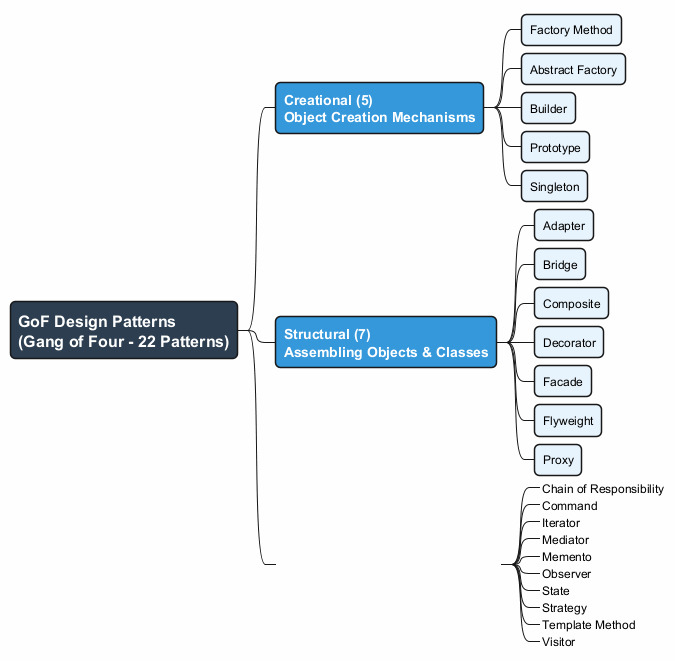

---

## Yaratımsal Desenler (Creational Patterns) (5)

Yaratımsal desenler (Creational Patterns), mevcut kodun esnekliğini ve yeniden kullanılabilirliğini artıran nesne oluşturma mekanizmaları sağlar.

| Desen | Amaç |
|-------|------|
| **Factory Method (Fabrika Yöntemi)** | Bir arayüz aracılığıyla nesne oluşturur; alt sınıflar türü belirler |
| **Abstract Factory (Soyut Fabrika)** | Somut sınıfları belirtmeden ilişkili nesne aileleri üretir |
| **Builder (İnşaatçı)** | Karmaşık nesneleri adım adım inşa eder |
| **Prototype (Prototip)** | Mevcut nesneleri sınıflarına bağımlı olmadan kopyalar |
| **Singleton (Tekil Nesne)** | Bir sınıfın yalnızca bir örneğe sahip olmasını global erişim noktasıyla sağlar |

---

## Yapısal Desenler (Structural Patterns) (7)

Yapısal desenler (Structural Patterns), nesneleri ve sınıfları esnek ve verimli tutarak daha büyük yapılara nasıl birleştirileceğini açıklar.

| Desen | Amaç |
|-------|------|
| **Adapter (Adaptör)** | Uyumsuz arayüzlere sahip nesnelerin birlikte çalışmasını sağlar |
| **Bridge (Köprü)** | Büyük bir sınıfı iki hiyerarşiye böler (soyutlama + uygulama) |
| **Composite (Bileşik)** | Nesneleri ağaç yapılarında oluşturur |
| **Decorator (Dekoratör)** | Nesneleri sarmalayarak yeni davranışlar ekler |
| **Facade (Cephe)** | Bir kütüphane veya çerçeveye basitleştirilmiş bir arayüz sağlar |
| **Flyweight (Sinek Siklet)** | Ortak durumu paylaşarak RAM'e daha fazla nesne sığdırır |
| **Proxy (Vekil)** | Başka bir nesne için bir vekil veya yer tutucu sağlar |

---

## Davranışsal Desenler (Behavioral Patterns) (10)

Davranışsal desenler (Behavioral Patterns), nesneler arasındaki etkili iletişimi ve sorumluluk dağılımını ele alır.

| Desen | Amaç |
|-------|------|
| **Chain of Responsibility (Sorumluluk Zinciri)** | İstekleri bir işleyiciler zinciri boyunca iletir |
| **Command (Komut)** | Bir isteği bağımsız bir nesneye dönüştürür |
| **Iterator (Yineleyici)** | Bir koleksiyonun elemanlarını sırayla dolaşır |
| **Mediator (Arabulucu)** | Nesneler arasındaki kaotik bağımlılıkları azaltır |
| **Memento (Hatıra)** | Bir nesnenin önceki durumunu kaydeder ve geri yükler |
| **Observer (Gözlemci)** | Olay bildirimi için bir abonelik mekanizması tanımlar |
| **State (Durum)** | İç durum değiştiğinde davranışı değiştirir |
| **Strategy (Strateji)** | Birbiriyle değiştirilebilir algoritma ailesi tanımlar |
| **Template Method (Şablon Yöntemi)** | Bir algoritmanın iskeletini tanımlar; alt sınıflar adımları doldurur |
| **Visitor (Ziyaretçi)** | Algoritmaları üzerinde çalıştıkları nesnelerden ayırır |

---

## Tasarım Desenlerini Neden Öğrenmeliyiz?

- **Kanıtlanmış çözümler**: Desenler, yaygın sorunlara yönelik denenmiş ve test edilmiş çözümlerdir. Bu sorunlarla hiç karşılaşmasanız bile, desenleri bilmek size NYP (Nesne Yönelimli Programlama) ilkelerini kullanarak sorunları nasıl çözeceğinizi öğretir.
- **Ortak dil**: Desenler paylaşılan bir kelime dağarcığı tanımlar. "Bunun için bir Singleton kullan" diyebilirsiniz ve herkes öneriyi hemen anlar.
- **Daha iyi iletişim**: Ekip üyeleri desenleri bildiğinde, tasarım hakkındaki iletişim daha hızlı ve daha kesin olur.
- **Çerçeveleri anlama**: Birçok çerçeve (framework) ve kütüphane tasarım desenleri kullanır. Desenleri anlamak, çerçevelerin nasıl çalıştığını kavramanıza yardımcı olur.
- **Daha iyi kod yazma**: Desenler daha esnek, yeniden kullanılabilir ve sürdürülebilir kod yazmanıza yardımcı olur.
- **Kariyer gelişimi**: Tasarım deseni bilgisi teknik mülakatlarda sıkça test edilir.

---

## Tasarım Desenlerinin Faydaları

- **Yeniden Kullanılabilirlik**: Desenler, projeler arasında uyarlanabilen yeniden kullanılabilir çözümler sağlar.
- **Sürdürülebilirlik**: Desenlerle yapılandırılmış kod, anlaşılması ve değiştirilmesi daha kolaydır.
- **Ölçeklenebilirlik**: Desenler, yönetilemez hale gelmeden büyüyebilen sistemler tasarlamaya yardımcı olur.
- **Esneklik**: Desenler genellikle uygulamaları değiştirmeyi veya yeni özellikler eklemeyi kolaylaştırır.
- **Belgeleme**: Desenler, tasarım kararları için bir belgeleme biçimi görevi görür.

## Tasarım Desenlerine Yönelik Eleştiriler

- **Aşırı mühendislik**: Basit kodun yeterli olduğu yerlerde desen kullanmak gereksiz karmaşıklık ekler.
- **Dil sınırlamaları**: Desenler genellikle eksik dil özelliklerini telafi eder (örn., birinci sınıf fonksiyonları olmayan dillerde Strategy).
- **Yanlış kullanım**: Bir soruna yanlış deseni uygulamak kodu iyileştirmek yerine kötüleştirebilir.
- **Öğrenme eğrisi**: Desenleri ne zaman ve nasıl uygulayacağınızı anlamak deneyim gerektirir.

---

## Modül A: Özet

- Tasarım desenleri, yazılım tasarımında sıkça karşılaşılan sorunlara yönelik **tipik çözümlerdir**.
- 1994'te **Dörtlü Çete (GoF)** kitabı ile **23 desen** içinde popülerleştirilmişlerdir.
- Desenler üç kategoriye ayrılır: **Yaratımsal (Creational)** (5), **Yapısal (Structural)** (7) ve **Davranışsal (Behavioral)** (10).
- Her desenin şunları vardır: **Amaç**, **Motivasyon**, **Yapı**, **Sözde Kod**, **Uygulanabilirlik**, **Uygulama** ve **İlişkiler**.
- Desenleri öğrenmek size **ortak bir kelime dağarcığı** kazandırır ve **daha iyi, daha sürdürülebilir kod** yazmanıza yardımcı olur.
- Desenler düşünceli bir şekilde uygulanmalıdır; **aşırı mühendislik** ve **yanlış kullanım** gerçek risklerdir.
- Bu haftada **5 Yaratımsal Desen**e odaklanıyoruz: Factory Method, Abstract Factory, Builder, Prototype ve Singleton.

---

<!-- _backgroundColor: aqua -->

<!-- _color: orange -->

## Modül B: Factory Method (Fabrika Yöntemi) Deseni

---

## Factory Method (Fabrika Yöntemi) Deseni - Genel Bakış

- **Diğer Adı**: Virtual Constructor (Sanal Yapıcı)
- **Kategori**: Yaratımsal Desen (Creational Pattern)
- **Karmaşıklık**: Düşük
- **Popülerlik**: Yüksek

**Amaç**: Factory Method (Fabrika Yöntemi), bir üst sınıfta nesne oluşturmak için bir arayüz sağlayan, ancak alt sınıfların oluşturulacak nesnelerin türünü değiştirmesine izin veren bir yaratımsal tasarım desenidir.

Referans: [RefactoringGuru - Factory Method](https://refactoring.guru/design-patterns/factory-method)

---

## Factory Method (Fabrika Yöntemi) - Problem

Bir lojistik yönetim uygulaması oluşturduğunuzu düşünün. Uygulamanızın ilk sürümü yalnızca kamyonla taşımacılığı destekleyebilir, bu nedenle kodunuzun büyük kısmı `Truck` sınıfının içinde bulunur.

Bir süre sonra uygulamanız oldukça popüler olur. Her gün deniz taşımacılığı şirketlerinden deniz lojistiğini uygulamaya dahil etme talepleri alırsınız.

**`Ship` sınıfını doğrudan eklerseniz ne olur?**

- Kodun geri kalanı zaten mevcut sınıflara bağlıysa yeni bir sınıf eklemek o kadar basit değildir.
- Kodunuzun büyük kısmı `Truck` sınıfına bağlıdır.
- `Ship` eklemek tüm kod tabanında değişiklik yapmayı gerektirir.
- Daha sonra başka bir taşıma türü eklemek, tüm bu değişiklikleri yeniden yapmayı gerektirir.
- Sonuç: taşıma nesnelerinin sınıfına göre davranışı değiştiren koşullarla dolu oldukça çirkin bir kod.

---

## Factory Method (Fabrika Yöntemi) - Çözüm

Factory Method deseni, doğrudan nesne oluşturma çağrılarını (`new` operatörü kullanarak) özel bir **fabrika yöntemine** yapılan çağrılarla değiştirmenizi önerir.

- Nesneler hala `new` operatörü ile oluşturulur, ancak bu işlem fabrika yöntemi içinden çağrılır.
- Bir fabrika yöntemi tarafından döndürülen nesneler genellikle **ürünler (products)** olarak adlandırılır.

**Temel içgörü**: Alt sınıflar, oluşturulan ürünlerin sınıfını değiştirmek için fabrika yöntemini geçersiz kılabilir (override).

- Küçük bir sınırlama vardır: alt sınıflar, yalnızca bu ürünlerin **ortak bir temel sınıfı veya arayüzü** varsa farklı türde ürünler döndürebilir.
- Ayrıca, temel sınıftaki fabrika yönteminin dönüş türü bu arayüz olarak bildirilmelidir.

---

## Factory Method (Fabrika Yöntemi) - Çözüm Diyagramı

```text
                    Creator
              ┌─────────────────┐
              │ someOperation() │
              │ createProduct() │──── Product p = createProduct()
              └────────┬────────┘
                       │
           ┌───────────┴───────────┐
           │                       │
  ConcreteCreatorA          ConcreteCreatorB
  ┌────────────────┐       ┌────────────────┐
  │createProduct() │       │createProduct() │
  │ return new     │       │ return new     │
  │ ConcreteA()    │       │ ConcreteB()    │
  └────────────────┘       └────────────────┘
```

- `Creator` sınıfı `createProduct()` fabrika yöntemine sahiptir.
- Her `ConcreteCreator` farklı bir ürün türü döndürmek için fabrika yöntemini geçersiz kılar.
- Tüm ürünler aynı arayüzü uygular.

---

## Factory Method (Fabrika Yöntemi) - Yapı

Factory Method deseninin dört temel katılımcısı vardır:

1. **Product (Ürün)** (Arayüz/Soyut Sınıf)
   - Fabrika yönteminin üretebileceği tüm nesneler için ortak arayüzü bildirir.

2. **Concrete Products (Somut Ürünler)**
   - Ürün arayüzünün farklı uygulamaları.

3. **Creator (Yaratıcı)** (Soyut Sınıf)
   - Yeni ürün nesneleri döndüren fabrika yöntemini bildirir. Dönüş türü ürün arayüzüyle eşleşmelidir.
   - Ürün nesnelerine dayanan bazı temel iş mantığı içerebilir.

4. **Concrete Creators (Somut Yaratıcılar)**
   - Farklı türde ürün döndürmek için temel fabrika yöntemini geçersiz kılar.
   - Fabrika yönteminin her zaman yeni örnekler oluşturması gerekmez; ayrıca bir önbellekten, nesne havuzundan veya başka bir kaynaktan mevcut nesneleri de döndürebilir.

---

### Factory Method - Sınıf Diyagramı

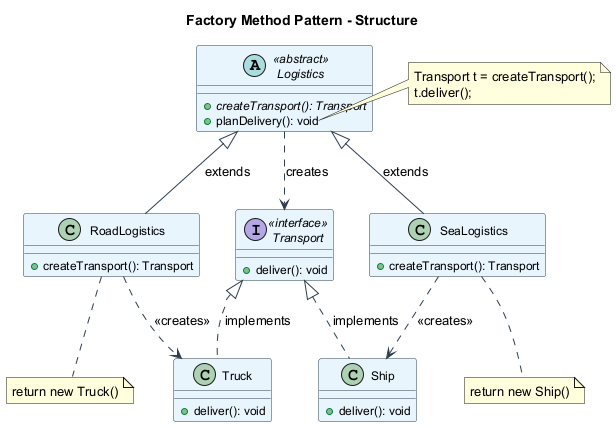

---

## Factory Method (Fabrika Yöntemi) - Sözde Kod

Bu örnek, Factory Method'un istemci kodunu somut UI sınıflarına bağlamadan çapraz platform UI elemanları oluşturmak için nasıl kullanılabileceğini göstermektedir.

```text
// The creator class declares the factory method
// that must return an object of a product class.
class Dialog is
    abstract method createButton(): Button

    method render() is
        Button okButton = createButton()
        okButton.onClick(closeDialog)
        okButton.render()

// Concrete creators override the factory method
class WindowsDialog extends Dialog is
    method createButton(): Button is
        return new WindowsButton()

class WebDialog extends Dialog is
    method createButton(): Button is
        return new HTMLButton()
```

---

## Factory Method (Fabrika Yöntemi) - Sözde Kod (devam)

```text
// The product interface declares the operations
// that all concrete products must implement.
interface Button is
    method render()
    method onClick(f)

// Concrete products provide various implementations.
class WindowsButton implements Button is
    method render(a, b) is
        // Render a button in Windows style.
    method onClick(f) is
        // Bind a native OS click event.

class HTMLButton implements Button is
    method render(a, b) is
        // Return an HTML representation of a button.
    method onClick(f) is
        // Bind a web browser click event.
```

---

## Factory Method (Fabrika Yöntemi) - Sözde Kod (devam)

```text
class Application is
    field dialog: Dialog

    // The application picks a creator's type depending
    // on the current configuration or environment.
    method initialize() is
        config = readApplicationConfigFile()
        if (config.OS == "Windows") then
            dialog = new WindowsDialog()
        else if (config.OS == "Web") then
            dialog = new WebDialog()
        else
            throw new Exception("Error! Unknown OS.")

    // The client code works with an instance of a
    // concrete creator, albeit through its base interface.
    method main() is
        this.initialize()
        dialog.render()
```

---

### Factory Method - Sıralama Diyagramı

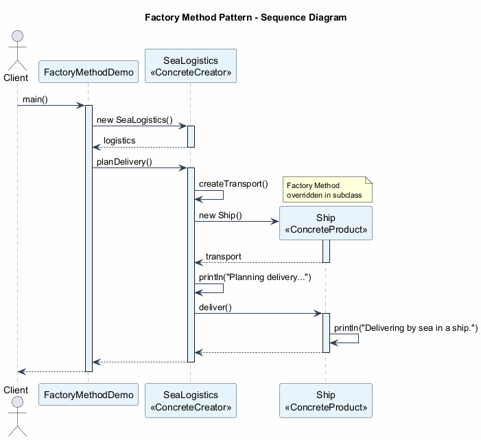

---

## Factory Method (Fabrika Yöntemi) - Uygulanabilirlik

Factory Method desenini şu durumlarda kullanın:

1. **Kodunuzun çalışması gereken nesnelerin kesin türlerini ve bağımlılıklarını önceden bilmediğinizde.**
   - Factory Method, ürün oluşturma kodunu ürünü gerçekten kullanan koddan ayırır. Bu nedenle ürün oluşturma kodunu, kodun geri kalanından bağımsız olarak genişletmek daha kolaydır.

2. **Kütüphanenizin veya çerçevenizin kullanıcılarına iç bileşenlerini genişletme yolu sağlamak istediğinizde.**
   - Kullanıcılar çerçeve sınıflarınızı alt sınıflayabilir ve kendi türleriyle genişletmek için fabrika yöntemlerini geçersiz kılabilir.

3. **Her seferinde yeniden oluşturmak yerine mevcut nesneleri yeniden kullanarak sistem kaynaklarını tasarruf etmek istediğinizde.**
   - Yeni nesneler oluşturmanın yanı sıra mevcut olanları yeniden kullanabilen düzenli bir yönteme ihtiyacınız var. Bu, tam da bir fabrika yöntemine benzer.

---

## Factory Method (Fabrika Yöntemi) - Nasıl Uygulanır

1. **Tüm ürünleri aynı arayüzü takip ettirin.** Bu arayüz, her üründe anlamlı olan yöntemleri bildirmelidir.

2. **Yaratıcı sınıfın içine boş bir fabrika yöntemi ekleyin.** Yöntemin dönüş türü ortak ürün arayüzüyle eşleşmelidir.

3. **Yaratıcının kodunda, ürün yapıcılarına yapılan tüm referansları bulun.** Bunları tek tek fabrika yöntemine yapılan çağrılarla değiştirin ve ürün oluşturma kodunu fabrika yöntemine çıkarın.

4. **Fabrika yönteminde listelenen her ürün türü için bir somut yaratıcı alt sınıf kümesi oluşturun.** Alt sınıflarda fabrika yöntemini geçersiz kılın ve temel yöntemden uygun oluşturma kodu parçalarını çıkarın.

5. **Çok fazla ürün türü varsa** ve hepsi için alt sınıf oluşturmak mantıklı değilse, alt sınıflarda temel sınıftaki kontrol parametresini yeniden kullanabilirsiniz.

6. **Tüm çıkarmalardan sonra temel fabrika yöntemi boş kaldıysa**, onu soyut yapabilirsiniz. Geriye kalan bir şey varsa, bunu yöntemin varsayılan davranışı yapabilirsiniz.

---

## Factory Method (Fabrika Yöntemi) - Artılar ve Eksiler

### Artılar

- **Sıkı bağımlılıktan kaçınır**: yaratıcı ile somut ürünler arasında.
- **Tek Sorumluluk İlkesi (SRP)**: Ürün oluşturma kodunu programda tek bir yere taşıyabilirsiniz, bu da kodun desteklenmesini kolaylaştırır.
- **Açık/Kapalı İlkesi (OCP)**: Mevcut istemci kodunu bozmadan programa yeni ürün türleri ekleyebilirsiniz.

### Eksiler

- **Kod karmaşıklığı artar**: Deseni uygulamak için birçok yeni alt sınıf tanıtmanız gerektiğinden kod daha karmaşık hale gelebilir. En iyi senaryo, deseni mevcut bir yaratıcı sınıf hiyerarşisine dahil ettiğiniz zamandır.

---

## Factory Method (Fabrika Yöntemi) - Diğer Desenlerle İlişkiler

- Birçok tasarım **Factory Method** ile başlar (daha az karmaşık, alt sınıflar aracılığıyla daha fazla özelleştirilebilir) ve **Abstract Factory**, **Prototype** veya **Builder**'a doğru evrilir (daha esnek, ancak daha karmaşık).

- **Abstract Factory** sınıfları genellikle bir dizi **Factory Method** üzerine kurulur, ancak bu sınıflardaki yöntemleri oluşturmak için **Prototype** da kullanabilirsiniz.

- Koleksiyon alt sınıflarının koleksiyonlarla uyumlu farklı türde yineleyiciler döndürmesini sağlamak için **Factory Method**'u **Iterator** ile birlikte kullanabilirsiniz.

- **Prototype** kalıtıma dayalı değildir, bu nedenle dezavantajları yoktur. Öte yandan, Prototype, klonlanan nesnenin karmaşık bir başlatılmasını gerektirir. **Factory Method** kalıtıma dayalıdır ancak bir başlatma adımı gerektirmez.

- **Factory Method**, **Template Method**'un bir özelleştirmesidir. Aynı zamanda, bir Factory Method büyük bir Template Method'da bir adım olarak hizmet edebilir.

---

## Factory Method (Fabrika Yöntemi) - Java Kod Örneği

```java
// Product interface
interface Transport {
    void deliver();
}

// Concrete Products
class Truck implements Transport {
    @Override
    public void deliver() {
        System.out.println("Delivering by land in a truck.");
    }
}

class Ship implements Transport {
    @Override
    public void deliver() {
        System.out.println("Delivering by sea in a ship.");
    }
}
```

---

## Factory Method (Fabrika Yöntemi) - Java Kod Örneği (devam)

```java
// Creator (abstract)
abstract class Logistics {
    // Factory Method
    public abstract Transport createTransport();

    // Business logic that uses the factory method
    public void planDelivery() {
        Transport transport = createTransport();
        System.out.println("Planning delivery...");
        transport.deliver();
    }
}

// Concrete Creators
class RoadLogistics extends Logistics {
    @Override
    public Transport createTransport() {
        return new Truck();
    }
}

class SeaLogistics extends Logistics {
    @Override
    public Transport createTransport() {
        return new Ship();
    }
}
```

---

## Factory Method (Fabrika Yöntemi) - Java Kod Örneği (devam)

```java
// Client code
public class FactoryMethodDemo {
    public static void main(String[] args) {
        Logistics logistics;

        // Configuration determines which factory to use
        String transportType = "sea"; // could come from config

        if (transportType.equals("road")) {
            logistics = new RoadLogistics();
        } else if (transportType.equals("sea")) {
            logistics = new SeaLogistics();
        } else {
            throw new IllegalArgumentException(
                "Unknown transport type: " + transportType
            );
        }

        // Client works with the abstract creator
        logistics.planDelivery();
        // Output: Planning delivery...
        //         Delivering by sea in a ship.
    }
}
```

---

## Modül B: Özet

- **Factory Method (Fabrika Yöntemi)**, bir üst sınıfta nesne oluşturmak için bir arayüz sağlar, ancak alt sınıfların oluşturulan nesnelerin türünü değiştirmesine izin verir.
- Yaratıcı kod ile somut ürün sınıfları arasındaki **sıkı bağımlılık** sorununu çözer.
- Desen **dört katılımcı** kullanır: Product (Ürün) arayüzü, Concrete Products (Somut Ürünler), Creator (Yaratıcı) sınıfı ve Concrete Creators (Somut Yaratıcılar).
- Factory Method, **Açık/Kapalı İlkesini** (mevcut kodu değiştirmeden yeni ürünler) ve **Tek Sorumluluk İlkesini** (merkezi oluşturma mantığı) destekler.
- Genellikle Abstract Factory veya Prototype gibi daha karmaşık desenler için **başlangıç noktasıdır**.
- Ana ödünleşim, kod tabanındaki **artan alt sınıf sayısıdır**.
- Factory Method, **Template Method** deseninin bir özelleştirmesidir.

---

<!-- _backgroundColor: aqua -->

<!-- _color: orange -->

## Modül C: Abstract Factory (Soyut Fabrika) Deseni

---

## Abstract Factory (Soyut Fabrika) Deseni - Genel Bakış

- **Kategori**: Yaratımsal Desen (Creational Pattern)
- **Karmaşıklık**: Orta
- **Popülerlik**: Yüksek

**Amaç**: Abstract Factory (Soyut Fabrika), somut sınıflarını belirtmeden **ilişkili nesne aileleri** üretmenizi sağlayan bir yaratımsal tasarım desenidir.

Referans: [RefactoringGuru - Abstract Factory](https://refactoring.guru/design-patterns/abstract-factory)

---

## Abstract Factory (Soyut Fabrika) - Problem

Bir mobilya mağazası simülatörü oluşturduğunuzu düşünün. Kodunuz şunları temsil eden sınıflardan oluşur:

- İlişkili ürünlerden oluşan bir aile, örneğin: `Chair` + `Sofa` + `CoffeeTable`.
- Bu ailenin birkaç varyantı. Örneğin, `Chair` + `Sofa` + `CoffeeTable` ürünleri şu varyantlarda mevcuttur: **Modern**, **Victorian**, **ArtDeco**.

Ürünlerin aynı ailedeki diğer nesnelerle eşleşmesi için bireysel mobilya nesneleri oluşturmanın bir yoluna ihtiyacınız var. Müşteriler uyumsuz mobilya aldıklarında oldukça kızarlar.

**Doğrudan oluşturmayla ilgili sorunlar:**

- Yeni ürünler veya ürün aileleri eklerken mevcut kodu değiştirmek istemezsiniz.
- Mobilya satıcıları kataloglarını çok sık günceller ve her seferinde çekirdek kodu değiştirmek istemezsiniz.

---

## Abstract Factory (Soyut Fabrika) - Çözüm

Abstract Factory deseni şunları önerir:

1. **Her farklı ürün için açıkça arayüzler bildirin** (örn., `Chair`, `Sofa`, `CoffeeTable`).

2. **Tüm ürün varyantlarını** bu arayüzleri takip ettirin. Örneğin, tüm sandalye varyantları `Chair` arayüzünü uygular; tüm sehpalar `CoffeeTable` arayüzünü uygular vb.

3. **Abstract Factory'yi bildirin** -- ürün ailesinin parçası olan tüm ürünler için oluşturma yöntemlerinin bir listesini içeren bir arayüz (örn., `createChair`, `createSofa`, `createCoffeeTable`).

4. **Her ürün ailesi varyantı için ayrı fabrika sınıfları oluşturun.** Bir fabrika, belirli bir türde ürünler döndüren bir sınıftır. Örneğin, `ModernFurnitureFactory` yalnızca `ModernChair`, `ModernSofa` ve `ModernCoffeeTable` nesneleri oluşturabilir.

---

## Abstract Factory (Soyut Fabrika) - Çözüm Diyagramı

```text
         AbstractFactory
    ┌──────────────────────┐
    │ createChair()        │
    │ createSofa()         │
    │ createCoffeeTable()  │
    └──────────┬───────────┘
               │
    ┌──────────┴──────────────────┐
    │                             │
ModernFactory              VictorianFactory
┌──────────────┐          ┌──────────────┐
│createChair() │          │createChair() │
│  → ModernCh  │          │  → VictorCh  │
│createSofa()  │          │createSofa()  │
│  → ModernSf  │          │  → VictorSf  │
└──────────────┘          └──────────────┘
```

İstemci kodu, fabrikalar ve ürünlerle yalnızca soyut arayüzleri aracılığıyla çalışır. Bu, istemci kodunu değiştirmeden fabrika türünü (ve dolayısıyla ürün varyantını) değiştirmenize olanak tanır.

---

## Abstract Factory (Soyut Fabrika) - Yapı

Abstract Factory deseninin beş temel katılımcısı vardır:

1. **Abstract Products (Soyut Ürünler)**: bir ürün ailesini oluşturan farklı ancak ilişkili ürün kümesi için arayüzler bildirir.

2. **Concrete Products (Somut Ürünler)**: soyut ürünlerin varyantlara göre gruplandırılmış çeşitli uygulamalarıdır. Her soyut ürün (sandalye/kanepe) tüm verilen varyantlarda (Victorian/Modern) uygulanmalıdır.

3. **Abstract Factory (Soyut Fabrika)** arayüzü: her bir soyut ürünü oluşturmak için bir dizi yöntem bildirir.

4. **Concrete Factories (Somut Fabrikalar)**: soyut fabrikanın oluşturma yöntemlerini uygular. Her somut fabrika belirli bir ürün varyantına karşılık gelir ve yalnızca bu ürün varyantlarını oluşturur.

5. **Client (İstemci)**: hem fabrikalar hem de ürünlerle soyut arayüzler aracılığıyla çalışır. Bu, istemcinin somut sınıflara bağlanmadan herhangi bir fabrika/ürün varyantıyla çalışmasına olanak tanır.

---

### Abstract Factory - Sınıf Diyagramı

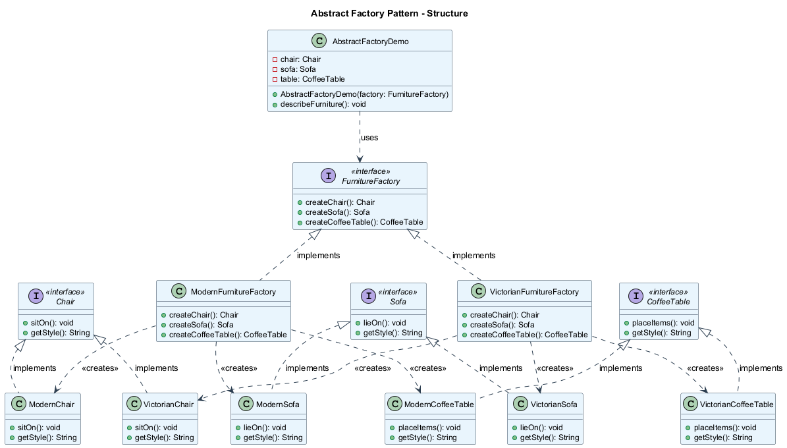

---

## Abstract Factory (Soyut Fabrika) - Sözde Kod

Bu örnek, Abstract Factory deseninin istemci kodunu somut UI sınıflarına bağlamadan çapraz platform UI elemanları oluşturmak için nasıl kullanılabileceğini göstermektedir.

```text
// The abstract factory interface declares a set of methods
// that return different abstract products.
interface GUIFactory is
    method createButton(): Button
    method createCheckbox(): Checkbox

// Concrete factories produce a family of products that
// belong to a single variant.
class WinFactory implements GUIFactory is
    method createButton(): Button is
        return new WinButton()
    method createCheckbox(): Checkbox is
        return new WinCheckbox()

class MacFactory implements GUIFactory is
    method createButton(): Button is
        return new MacButton()
    method createCheckbox(): Checkbox is
        return new MacCheckbox()
```

---

## Abstract Factory (Soyut Fabrika) - Sözde Kod (devam)

```text
// Each distinct product of a product family should
// have a base interface.
interface Button is
    method paint()

// Each concrete product is created in a corresponding
// concrete factory.
class WinButton implements Button is
    method paint() is
        // Render a button in Windows style.

class MacButton implements Button is
    method paint() is
        // Render a button in macOS style.

interface Checkbox is
    method paint()

class WinCheckbox implements Checkbox is
    method paint() is
        // Render a checkbox in Windows style.

class MacCheckbox implements Checkbox is
    method paint() is
        // Render a checkbox in macOS style.
```

---

## Abstract Factory (Soyut Fabrika) - Sözde Kod (devam)

```text
// The client code works with factories and products
// only through abstract types: GUIFactory, Button, Checkbox.
class Application is
    private field factory: GUIFactory
    private field button: Button

    constructor Application(factory: GUIFactory) is
        this.factory = factory

    method createUI() is
        this.button = factory.createButton()

    method paint() is
        button.paint()

// The application picks the factory type depending on
// the current configuration or environment settings.
class ApplicationConfigurator is
    method main() is
        config = readApplicationConfigFile()
        if (config.OS == "Windows") then
            factory = new WinFactory()
        else if (config.OS == "Mac") then
            factory = new MacFactory()
        else
            throw new Exception("Error! Unknown OS.")
        Application app = new Application(factory)
```

---

### Abstract Factory - Sıralama Diyagramı

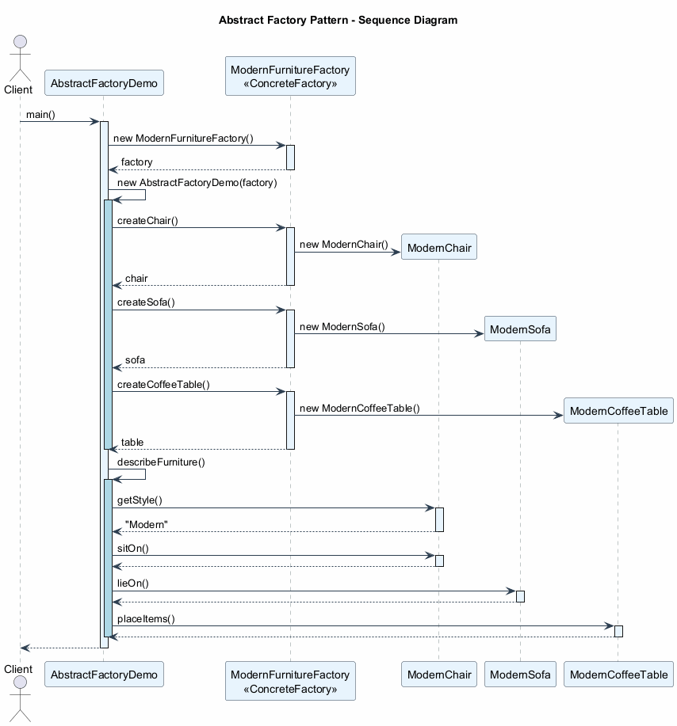

---

## Abstract Factory (Soyut Fabrika) - Uygulanabilirlik

Abstract Factory desenini şu durumlarda kullanın:

1. **Kodunuzun çeşitli ilişkili ürün aileleriyle çalışması gerektiğinde**, ancak bu ürünlerin somut sınıflarına bağımlı olmak istemediğinizde -- önceden bilinmeyebilirler veya gelecekteki genişletilebilirliğe izin vermek isteyebilirsiniz.
   - Abstract Factory, ürün ailesinin her sınıfından nesne oluşturmak için bir arayüz sağlar. Kodunuz nesneleri bu arayüz aracılığıyla oluşturduğu sürece, uygulamanız tarafından zaten oluşturulan ürünlerle eşleşmeyen yanlış bir ürün varyantı oluşturma konusunda endişelenmenize gerek yoktur.

2. **Bir sınıfın birincil sorumluluğunu bulanıklaştıran bir dizi Factory Method'a sahip olduğunuzda.**
   - İyi tasarlanmış bir programda, her sınıf yalnızca bir şeyden sorumludur (SRP). Bir sınıf birden fazla ürün türüyle ilgilendiğinde, fabrika yöntemlerini bağımsız bir fabrika sınıfına veya tam kapsamlı bir Abstract Factory uygulamasına çıkarmaya değer olabilir.

---

## Abstract Factory (Soyut Fabrika) - Nasıl Uygulanır

1. **Farklı ürün türleri ile bu ürünlerin varyantlarının bir matrisini çıkarın.**

2. **Tüm ürün türleri için soyut ürün arayüzleri bildirin.** Ardından tüm somut ürün sınıflarının bu arayüzleri uygulamasını sağlayın.

3. **Tüm soyut ürünler için bir dizi oluşturma yöntemi içeren soyut fabrika arayüzünü bildirin.**

4. **Her ürün varyantı için bir somut fabrika sınıfı kümesi uygulayın.**

5. **Uygulamada bir yerde fabrika başlatma kodu oluşturun.** Uygulama yapılandırmasına veya mevcut ortama bağlı olarak somut fabrika sınıflarından birini örneklemelidir. Bu fabrika nesnesini ürün oluşturan tüm sınıflara iletin.

6. **Kodu tarayın** ve ürün yapıcılarına yapılan tüm doğrudan çağrıları bulun. Bunları fabrika nesnesindeki uygun oluşturma yöntemi çağrılarıyla değiştirin.

---

## Abstract Factory (Soyut Fabrika) - Artılar ve Eksiler

### Artılar

- **Uyumluluk garantisi**: Bir fabrikadan aldığınız ürünlerin birbirleriyle uyumlu olduğundan emin olabilirsiniz.
- **Sıkı bağımlılıktan kaçınır**: somut ürünler ve istemci kodu arasında.
- **Tek Sorumluluk İlkesi (SRP)**: Ürün oluşturma kodunu tek bir yere çıkarabilirsiniz, bu da kodun desteklenmesini kolaylaştırır.
- **Açık/Kapalı İlkesi (OCP)**: Mevcut istemci kodunu bozmadan yeni ürün varyantları ekleyebilirsiniz.

### Eksiler

- **Artan karmaşıklık**: Desenle birlikte çok sayıda yeni arayüz ve sınıf tanıtıldığından kod olması gerekenden daha karmaşık hale gelebilir.

---

## Abstract Factory (Soyut Fabrika) - Diğer Desenlerle İlişkiler

- Birçok tasarım **Factory Method** ile başlar (daha az karmaşık, alt sınıflar aracılığıyla daha fazla özelleştirilebilir) ve **Abstract Factory**, **Prototype** veya **Builder**'a doğru evrilir (daha esnek, ancak daha karmaşık).

- **Builder** karmaşık nesneleri adım adım oluşturmaya odaklanır. **Abstract Factory** ilişkili nesne aileleri oluşturmada uzmanlaşır. Abstract Factory ürünü hemen döndürürken, Builder ürünü almadan önce bazı ek inşa adımları çalıştırmanıza izin verir.

- **Abstract Factory** sınıfları genellikle bir dizi **Factory Method** üzerine kurulur, ancak bu sınıflardaki yöntemleri oluşturmak için **Prototype** da kullanabilirsiniz.

- **Abstract Factory**, alt sistem nesnelerinin nasıl oluşturulduğunu istemci kodundan gizlemek istediğinizde **Facade**'a alternatif olarak hizmet edebilir.

- **Abstract Factory**'yi **Bridge** ile birlikte kullanabilirsiniz. Bu eşleştirme, Bridge tarafından tanımlanan bazı soyutlamaların yalnızca belirli uygulamalarla çalışabildiği durumlarda faydalıdır.

- **Abstract Factories**, **Builders** ve **Prototypes**'ın tümü **Singletons** olarak uygulanabilir.

---

## Abstract Factory (Soyut Fabrika) - Java Kod Örneği

```java
// Abstract Products
interface Chair {
    void sitOn();
    String getStyle();
}

interface Sofa {
    void lieOn();
    String getStyle();
}

interface CoffeeTable {
    void placeItems();
    String getStyle();
}
```

---

## Abstract Factory (Soyut Fabrika) - Java Kod Örneği (devam)

```java
// Concrete Products - Modern Family
class ModernChair implements Chair {
    public void sitOn() {
        System.out.println("Sitting on a modern chair.");
    }
    public String getStyle() { return "Modern"; }
}

class ModernSofa implements Sofa {
    public void lieOn() {
        System.out.println("Lying on a modern sofa.");
    }
    public String getStyle() { return "Modern"; }
}

class ModernCoffeeTable implements CoffeeTable {
    public void placeItems() {
        System.out.println("Placing items on modern table.");
    }
    public String getStyle() { return "Modern"; }
}
```

---

## Abstract Factory (Soyut Fabrika) - Java Kod Örneği (devam)

```java
// Concrete Products - Victorian Family
class VictorianChair implements Chair {
    public void sitOn() {
        System.out.println("Sitting on a Victorian chair.");
    }
    public String getStyle() { return "Victorian"; }
}

class VictorianSofa implements Sofa {
    public void lieOn() {
        System.out.println("Lying on a Victorian sofa.");
    }
    public String getStyle() { return "Victorian"; }
}

class VictorianCoffeeTable implements CoffeeTable {
    public void placeItems() {
        System.out.println("Placing items on Victorian table.");
    }
    public String getStyle() { return "Victorian"; }
}
```

---

## Abstract Factory (Soyut Fabrika) - Java Kod Örneği (devam)

```java
// Abstract Factory
interface FurnitureFactory {
    Chair createChair();
    Sofa createSofa();
    CoffeeTable createCoffeeTable();
}

// Concrete Factories
class ModernFurnitureFactory implements FurnitureFactory {
    public Chair createChair() { return new ModernChair(); }
    public Sofa createSofa() { return new ModernSofa(); }
    public CoffeeTable createCoffeeTable() {
        return new ModernCoffeeTable();
    }
}

class VictorianFurnitureFactory implements FurnitureFactory {
    public Chair createChair() { return new VictorianChair(); }
    public Sofa createSofa() { return new VictorianSofa(); }
    public CoffeeTable createCoffeeTable() {
        return new VictorianCoffeeTable();
    }
}
```

---

## Abstract Factory (Soyut Fabrika) - Java Kod Örneği (devam)

```java
// Client code
public class AbstractFactoryDemo {
    private Chair chair;
    private Sofa sofa;
    private CoffeeTable table;

    public AbstractFactoryDemo(FurnitureFactory factory) {
        chair = factory.createChair();
        sofa = factory.createSofa();
        table = factory.createCoffeeTable();
    }

    public void describeFurniture() {
        System.out.println("Style: " + chair.getStyle());
        chair.sitOn();
        sofa.lieOn();
        table.placeItems();
    }

    public static void main(String[] args) {
        // Use Modern furniture
        FurnitureFactory factory = new ModernFurnitureFactory();
        AbstractFactoryDemo room = new AbstractFactoryDemo(factory);
        room.describeFurniture();
        // Output: Style: Modern
        //         Sitting on a modern chair.
        //         Lying on a modern sofa.
        //         Placing items on modern table.
    }
}
```

---

## Modül C: Özet

- **Abstract Factory (Soyut Fabrika)**, somut sınıflarını belirtmeden ilişkili nesne aileleri üretmenizi sağlar.
- Bir aile içinde **ürün uyumluluğunu** sağlama sorununu çözer (örn., Modern sandalye + Modern kanepe, asla stilleri karıştırmamak).
- Desen **beş katılımcı** kullanır: Abstract Products (Soyut Ürünler), Concrete Products (Somut Ürünler), Abstract Factory (Soyut Fabrika), Concrete Factories (Somut Fabrikalar) ve Client (İstemci).
- **OCP**'yi (mevcut kodu değiştirmeden yeni aileler ekleme) ve **SRP**'yi (ürün oluşturma merkezileştirilmiş) destekler.
- Abstract Factory genellikle dahili olarak **Factory Methods** kullanılarak uygulanır ve oluşturma için **Prototype** da kullanılabilir.
- Ana ödünleşim **artan arayüz ve sınıf sayısıdır**.
- Abstract Factories, Builders ve Prototypes'ın tümü **Singletons** olarak uygulanabilir.

---

<!-- _backgroundColor: aqua -->

<!-- _color: orange -->

## Modül D: Builder (İnşaatçı) Deseni

---

## Builder (İnşaatçı) Deseni - Genel Bakış

- **Kategori**: Yaratımsal Desen (Creational Pattern)
- **Karmaşıklık**: Orta
- **Popülerlik**: Yüksek

**Amaç**: Builder (İnşaatçı), karmaşık nesneleri adım adım oluşturmanıza olanak tanıyan bir yaratımsal tasarım desenidir. Desen, aynı oluşturma kodunu kullanarak bir nesnenin farklı türlerini ve temsillerini üretmenize izin verir.

Referans: [RefactoringGuru - Builder](https://refactoring.guru/design-patterns/builder)

---

## Builder (İnşaatçı) - Problem (Alt Sınıf Patlaması)

Birçok alanın ve iç içe geçmiş nesnelerin zahmetli, adım adım başlatılmasını gerektiren karmaşık bir nesne düşünün. Bu tür başlatma kodu genellikle çok sayıda parametreli devasa bir yapıcının içine gömülür. Hatta daha kötüsü: istemci kodunun her yerine dağılmıştır.

**Örnek**: Bir `House` nesnesi oluşturmak.

- Basit bir evin duvarlara, zemine, kapıya, pencerelere ve çatıya ihtiyacı vardır.
- Peki ya arka bahçesi, yüzme havuzu, garajı ve diğer güzellikleri olan daha büyük, daha aydınlık bir ev istiyorsanız?

En basit çözüm, temel `House` sınıfını genişletmek ve her parametre kombinasyonu için alt sınıflar oluşturmaktır. Ancak sonunda **önemli sayıda alt sınıfla** karşı karşıya kalırsınız. Herhangi bir yeni parametre, bu hiyerarşiyi daha da büyütmeyi gerektirecektir.

---

## Builder (İnşaatçı) - Problem (Teleskopik Yapıcı)

Alt sınıf üretmeyi içermeyen başka bir yaklaşım da vardır. Ev nesnesini kontrol eden tüm olası parametrelerle doğrudan temel `House` sınıfında devasa bir yapıcı oluşturabilirsiniz.

```java
// Telescoping constructor anti-pattern
class House {
    House(int windows, int doors, int rooms,
          boolean hasGarage, boolean hasSwimPool,
          boolean hasStatues, boolean hasGarden,
          boolean hasYard, boolean hasFence) {
        // ...
    }
}

// Client code - very hard to read
new House(4, 2, 5, true, false, false, true, true, false);
```

Çoğu durumda, **parametrelerin büyük kısmı kullanılmayacak** ve yapıcı çağrıları oldukça çirkin olacaktır.

---

## Builder (İnşaatçı) - Çözüm

Builder deseni, nesne oluşturma kodunu kendi sınıfından çıkarıp **builder (inşaatçı)** adı verilen ayrı nesnelere taşımanızı önerir.

Desen, nesne oluşturmayı bir dizi adım halinde düzenler (`buildWalls`, `buildDoor` vb.). Bir nesne oluşturmak için bir builder nesnesi üzerinde bu adımlardan bir dizi çalıştırırsınız. Önemli olan şudur: **tüm adımları çağırmanız gerekmez**. Yalnızca bir nesnenin belirli bir yapılandırmasını üretmek için gerekli olan adımları çağırabilirsiniz.

**Director (Yönetici)** (isteğe bağlı): Builder adımlarına yapılan bir dizi çağrıyı **director** adı verilen ayrı bir sınıfa daha fazla çıkarabilirsiniz. Director, inşa adımlarının hangi sırayla çalıştırılacağını tanımlarken, builder bu adımların uygulamasını sağlar.

- Bir director sınıfına sahip olmak kesinlikle gerekli değildir.
- Ancak director sınıfı, çeşitli oluşturma rutinlerini koyarak programınız genelinde yeniden kullanabilmeniz için iyi bir yer olabilir.

---

## Builder (İnşaatçı) - Yapı

Builder deseninin beş temel katılımcısı vardır:

1. **Builder Interface (İnşaatçı Arayüzü)**: tüm builder türleri için ortak olan ürün oluşturma adımlarını bildirir.

2. **Concrete Builders (Somut İnşaatçılar)**: oluşturma adımlarının farklı uygulamalarını sağlar. Somut builder'lar ortak arayüzü takip etmeyen ürünler üretebilir.

3. **Products (Ürünler)**: elde edilen nesnelerdir. Farklı builder'lar tarafından oluşturulan ürünlerin aynı sınıf hiyerarşisine veya arayüze ait olması gerekmez.

4. **Director (Yönetici)** (isteğe bağlı): oluşturma adımlarının hangi sırayla çağrılacağını tanımlar, böylece belirli ürün yapılandırmalarını oluşturabilir ve yeniden kullanabilirsiniz.

5. **Client (İstemci)**: builder nesnelerinden birini director ile ilişkilendirmelidir (veya builder'ı doğrudan kullanır). Genellikle bu işlem, director'ın yapıcısının parametreleri aracılığıyla yalnızca bir kez yapılır.

---

### Builder - Sınıf Diyagramı

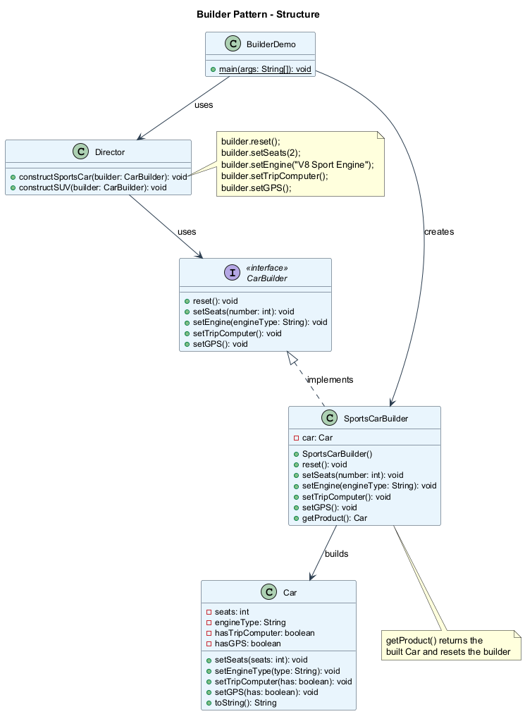

---

## Builder (İnşaatçı) - Sözde Kod

Bu örnek, Builder deseninin aynı inşa adımlarını kullanarak farklı ürün türleri (Car ve Manual) oluşturmak için nasıl kullanılabileceğini göstermektedir.

```text
// The builder interface specifies methods for creating
// the different parts of the product objects.
interface Builder is
    method reset()
    method setSeats(number)
    method setEngine(engine: Engine)
    method setTripComputer()
    method setGPS()

// Concrete builders implement the builder interface
// and provide specific implementations of building steps.
class CarBuilder implements Builder is
    private field car: Car
    method reset() is
        this.car = new Car()
    method setSeats(number) is
        // Set the number of seats in the car.
    method setEngine(engine: Engine) is
        // Install a given engine.
    method setTripComputer() is
        // Install a trip computer.
    method setGPS() is
        // Install a GPS.
    method getProduct(): Car is
        product = this.car
        this.reset()
        return product
```

---

## Builder (İnşaatçı) - Sözde Kod (devam)

```text
// Unlike other creational patterns, Builder lets you
// construct unrelated products with the same process.
class CarManualBuilder implements Builder is
    private field manual: Manual
    method reset() is
        this.manual = new Manual()
    method setSeats(number) is
        // Document car seat features.
    method setEngine(engine: Engine) is
        // Add engine instructions.
    method setTripComputer() is
        // Add trip computer instructions.
    method setGPS() is
        // Add GPS instructions.
    method getProduct(): Manual is
        // Return the manual and reset the builder.

// The director is only responsible for executing the
// building steps in a particular sequence.
class Director is
    method constructSportsCar(builder: Builder) is
        builder.reset()
        builder.setSeats(2)
        builder.setEngine(new SportEngine())
        builder.setTripComputer()
        builder.setGPS()
    method constructSUV(builder: Builder) is
        builder.reset()
        builder.setSeats(4)
        builder.setEngine(new SUVEngine())
        builder.setGPS()
```

---

## Builder (İnşaatçı) - Sözde Kod (devam)

```text
// The client code creates a builder object, passes it
// to the director and then initiates the construction.
class Application is
    method makeCar() is
        director = new Director()

        // Get a car
        CarBuilder builder = new CarBuilder()
        director.constructSportsCar(builder)
        Car car = builder.getProduct()

        // Get a car manual for the same config
        CarManualBuilder manualBuilder = new CarManualBuilder()
        director.constructSportsCar(manualBuilder)
        Manual manual = manualBuilder.getProduct()
        // The final product is retrieved from the builder
        // because the director is not aware of and not
        // dependent on concrete builders and products.
```

---

### Builder - Sıralama Diyagramı

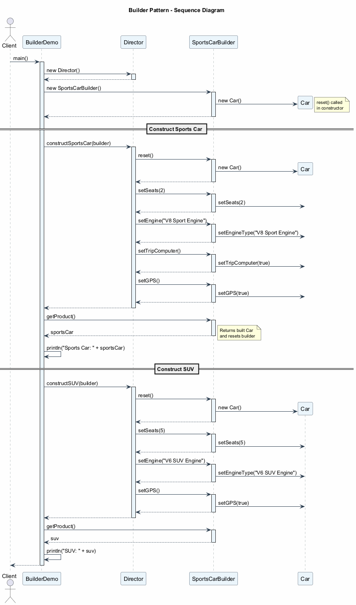

---

## Builder (İnşaatçı) - Uygulanabilirlik

Builder desenini şu durumlarda kullanın:

1. **"Teleskopik yapıcı"dan kurtulmak istediğinizde.**
   - Builder deseni, nesneleri adım adım, yalnızca gerçekten ihtiyaç duyduğunuz adımları kullanarak oluşturmanıza olanak tanır. Deseni uyguladıktan sonra yapıcılarınıza düzinelerce parametre tıkıştırmanız gerekmez.

2. **Kodunuzun bir ürünün farklı temsillerini oluşturabilmesini istediğinizde** (örn., taş ve ahşap evler).
   - Builder deseni, ürünün çeşitli temsillerinin oluşturulması yalnızca ayrıntılarda farklılık gösteren benzer adımları içerdiğinde uygulanabilir.
   - Temel builder arayüzü tüm olası oluşturma adımlarını tanımlar ve somut builder'lar ürünün belirli temsillerini oluşturmak için bu adımları uygular.

3. **Composite (Bileşik) ağaçları veya diğer karmaşık nesneleri oluşturmak istediğinizde.**
   - Builder deseni, ürünleri adım adım oluşturmanıza olanak tanır. Son ürünü bozmadan bazı adımların çalıştırılmasını erteleyebilirsiniz. Hatta adımları özyinelemeli olarak bile çağırabilirsiniz, bu da bir nesne ağacı oluşturmanız gerektiğinde kullanışlı olur.

---

## Builder (İnşaatçı) - Nasıl Uygulanır

1. **Mevcut tüm ürün temsilleri için ortak oluşturma adımlarını net bir şekilde tanımlayabildiğinizden emin olun.** Aksi takdirde deseni uygulamaya devam edemezsiniz.

2. **Bu adımları** temel builder arayüzünde bildirin.

3. **Her ürün temsili için bir somut builder sınıfı oluşturun** ve oluşturma adımlarını uygulayın.
   - Oluşturma sonucunu almak için bir yöntem uygulamayı unutmayın. Bu yöntem, çeşitli builder'lar ortak bir arayüze sahip olmayan ürünler oluşturabileceğinden, builder arayüzünde bildirilemez.

4. **Bir director sınıfı oluşturmayı düşünün.** Aynı builder nesnesini kullanarak bir ürünü oluşturmanın çeşitli yollarını kapsülleyebilir.

5. **İstemci kodu hem builder hem de director nesnelerini oluşturur.** Oluşturma başlamadan önce, istemci director'a bir builder nesnesi iletmelidir. Genellikle istemci bunu, director'ın yapıcısının parametreleri veya bir setter yöntemi aracılığıyla yalnızca bir kez yapar.

6. **Oluşturma sonucu, yalnızca tüm ürünler aynı arayüzü takip ediyorsa doğrudan builder'dan alınabilir.** Aksi takdirde istemci sonucu builder'dan almalıdır.

---

## Builder (İnşaatçı) - Artılar ve Eksiler

### Artılar

- **Adım adım oluşturma**: Nesneleri adım adım oluşturabilir, oluşturma adımlarını erteleyebilir veya adımları özyinelemeli olarak çalıştırabilirsiniz.
- **Yeniden kullanılabilir oluşturma kodu**: Ürünlerin çeşitli temsillerini oluştururken aynı oluşturma kodunu yeniden kullanabilirsiniz.
- **Tek Sorumluluk İlkesi (SRP)**: Karmaşık oluşturma kodunu ürünün iş mantığından izole edebilirsiniz.

### Eksiler

- **Artan karmaşıklık**: Desen birden fazla yeni sınıf oluşturmayı gerektirdiğinden kodun genel karmaşıklığı artar.

---

## Builder (İnşaatçı) - Diğer Desenlerle İlişkiler

- Birçok tasarım **Factory Method** ile başlar (daha az karmaşık, alt sınıflar aracılığıyla daha fazla özelleştirilebilir) ve **Abstract Factory**, **Prototype** veya **Builder**'a doğru evrilir (daha esnek, ancak daha karmaşık).

- **Builder** karmaşık nesneleri adım adım oluşturmaya odaklanır. **Abstract Factory** ilişkili nesne aileleri oluşturmada uzmanlaşır. Abstract Factory ürünü hemen döndürürken, Builder ürünü almadan önce bazı ek inşa adımları çalıştırmanıza izin verir.

- Karmaşık **Composite** ağaçları oluştururken **Builder** kullanabilirsiniz çünkü oluşturma adımlarını özyinelemeli çalışacak şekilde programlayabilirsiniz.

- **Builder**'ı **Bridge** ile birleştirebilirsiniz: director sınıfı soyutlama rolünü oynarken, farklı builder'lar uygulama rolünü üstlenir.

- **Abstract Factories**, **Builders** ve **Prototypes**'ın tümü **Singletons** olarak uygulanabilir.

---

## Builder (İnşaatçı) - Java Kod Örneği

```java
// Product class
class Car {
    private int seats;
    private String engineType;
    private boolean hasTripComputer;
    private boolean hasGPS;

    public void setSeats(int seats) { this.seats = seats; }
    public void setEngineType(String type) {
        this.engineType = type;
    }
    public void setTripComputer(boolean has) {
        this.hasTripComputer = has;
    }
    public void setGPS(boolean has) { this.hasGPS = has; }

    @Override
    public String toString() {
        return "Car{seats=" + seats
            + ", engine='" + engineType + "'"
            + ", tripComputer=" + hasTripComputer
            + ", GPS=" + hasGPS + "}";
    }
}
```

---

## Builder (İnşaatçı) - Java Kod Örneği (devam)

```java
// Builder interface
interface CarBuilder {
    void reset();
    void setSeats(int number);
    void setEngine(String engineType);
    void setTripComputer();
    void setGPS();
}

// Concrete Builder
class SportsCarBuilder implements CarBuilder {
    private Car car;

    public SportsCarBuilder() { this.reset(); }

    public void reset() { this.car = new Car(); }

    public void setSeats(int number) {
        car.setSeats(number);
    }
    public void setEngine(String engineType) {
        car.setEngineType(engineType);
    }
    public void setTripComputer() {
        car.setTripComputer(true);
    }
    public void setGPS() { car.setGPS(true); }

    public Car getProduct() {
        Car product = this.car;
        this.reset();
        return product;
    }
}
```

---

## Builder (İnşaatçı) - Java Kod Örneği (devam)

```java
// Director
class Director {
    public void constructSportsCar(CarBuilder builder) {
        builder.reset();
        builder.setSeats(2);
        builder.setEngine("V8 Sport Engine");
        builder.setTripComputer();
        builder.setGPS();
    }

    public void constructSUV(CarBuilder builder) {
        builder.reset();
        builder.setSeats(5);
        builder.setEngine("V6 SUV Engine");
        builder.setGPS();
    }
}

// Client code
public class BuilderDemo {
    public static void main(String[] args) {
        Director director = new Director();
        SportsCarBuilder builder = new SportsCarBuilder();

        director.constructSportsCar(builder);
        Car sportsCar = builder.getProduct();
        System.out.println("Sports Car: " + sportsCar);

        director.constructSUV(builder);
        Car suv = builder.getProduct();
        System.out.println("SUV: " + suv);
    }
}
```

---

## Modül D: Özet

- **Builder (İnşaatçı)**, karmaşık nesneleri adım adım, yalnızca ihtiyaç duyduğunuz adımları kullanarak oluşturmanıza olanak tanır.
- **Teleskopik yapıcı** sorununu ve **alt sınıf patlaması** sorununu çözer.
- Desen **beş katılımcı** kullanır: Builder Interface (İnşaatçı Arayüzü), Concrete Builders (Somut İnşaatçılar), Products (Ürünler), Director (Yönetici) ve Client (İstemci).
- **Director** isteğe bağlıdır ancak yaygın oluşturma rutinlerini kapsüllemek için faydalıdır.
- Builder, oluşturma mantığını iş mantığından izole ederek **Tek Sorumluluk İlkesini** destekler.
- Ana ödünleşim, birden fazla yeni sınıf nedeniyle **artan kod karmaşıklığıdır**.
- Builder, **Composite** (ağaç yapıları oluşturma için), **Bridge** ile birleştirilebilir ve **Singleton** olarak uygulanabilir.

---

<!-- _backgroundColor: aqua -->

<!-- _color: orange -->

## Modül E: Prototype (Prototip) Deseni

---

## Prototype (Prototip) Deseni - Genel Bakış

- **Diğer Adı**: Clone (Klon)
- **Kategori**: Yaratımsal Desen (Creational Pattern)
- **Karmaşıklık**: Düşük
- **Popülerlik**: Orta

**Amaç**: Prototype (Prototip), kodunuzu sınıflarına bağımlı kılmadan mevcut nesneleri kopyalamanıza olanak tanıyan bir yaratımsal tasarım desenidir.

Referans: [RefactoringGuru - Prototype](https://refactoring.guru/design-patterns/prototype)

---

## Prototype (Prototip) - Problem

Diyelim ki bir nesneniz var ve onun tam bir kopyasını oluşturmak istiyorsunuz. Bunu nasıl yapardınız?

1. **İlk olarak**, aynı sınıftan yeni bir nesne oluşturmanız gerekir.
2. **Ardından**, orijinal nesnenin tüm alanlarına gidip değerlerini yeni nesneye kopyalamanız gerekir.

**Ancak sorunlar var:**

- **Tüm nesneler bu şekilde kopyalanamaz** çünkü nesnenin bazı alanları özel (private) olabilir ve nesnenin dışından görünmez.
- **Kodunuz kopyalanan nesnenin sınıfına bağımlı hale gelir.** Bir kopya oluşturmak için nesnenin sınıfını bilmeniz gerekir, bu da kodunuzu o sınıfa bağımlı kılar.
- **Bazen yalnızca nesnenin takip ettiği arayüzü bilirsiniz**, somut sınıfını değil. Örneğin, bir yöntem bazı arayüzü takip eden herhangi bir nesneyi kabul ettiğinde, bu nesnelerin somut sınıflarını bilemezsiniz.
- **Karmaşık yapılandırmalar**: Bir nesne karmaşık iç duruma (bağlantılar, referanslar, önbellekler) sahip olduğunda, yalnızca sınıfını bilmek onu düzgün bir şekilde kopyalamak için yeterli değildir.

---

## Prototype (Prototip) - Çözüm

Prototype deseni, klonlama sürecini klonlanan gerçek nesnelere devreder. Desen, klonlamayı destekleyen tüm nesneler için ortak bir arayüz bildirir. Bu arayüz, kodunuzu o nesnenin sınıfına bağlamadan bir nesneyi klonlamanıza olanak tanır. Genellikle bu tür bir arayüz yalnızca tek bir `clone` yöntemi içerir.

**Nasıl çalışır:**

- Klonlamayı destekleyen bir nesneye **prototip** denir.
- Nesnelerinizin düzinelerce alanı ve yüzlerce olası yapılandırması olduğunda, onları klonlamak alt sınıflamaya alternatif olabilir.
- Çeşitli şekillerde yapılandırılmış bir dizi nesne oluşturursunuz. Yapılandırdığınız gibi bir nesneye ihtiyaç duyduğunuzda, sıfırdan yeni bir nesne oluşturmak yerine bir prototipi klonlarsınız.

**Önceden oluşturulmuş prototipler**: Desen, önceden oluşturulmuş prototip nesneler oluşturmanın bir yolunu sağlar. Bunu bir katalog benzeri olarak düşünebilirsiniz. Bu prototipler zaten yapılandırılmış karmaşık duruma sahip olabilir.

---

## Prototype (Prototip) - Çözüm (devam)

**Prototype Registry (Prototip Kayıt Defteri) (Önbellek)**:

Desene isteğe bağlı bir ekleme, sık kullanılan prototiplere kolay erişim sağlayan bir **Prototype Registry**'dir. Kopyalanmaya hazır önceden oluşturulmuş nesneler kümesini depolar.

En basit prototip kayıt defteri bir **isim -> prototip** hash haritasıdır. Ancak basit bir isimden daha iyi arama kriterlerine ihtiyacınız varsa, kayıt defterinin çok daha güçlü bir sürümünü oluşturabilirsiniz.

```text
PrototypeRegistry
┌─────────────────────────────────┐
│  items: Map<String, Prototype>  │
│                                 │
│  addItem(id, prototype)         │
│  getById(id): Prototype         │
│  getByColor(color): Prototype   │
└─────────────────────────────────┘
```

---

## Prototype (Prototip) - Yapı

**Temel Uygulama:**

1. **Prototype Interface (Prototip Arayüzü)**: klonlama yöntemlerini bildirir. Çoğu durumda tek bir `clone` yöntemidir.

2. **Concrete Prototype (Somut Prototip)** sınıfı: klonlama yöntemini uygular. Orijinal nesnenin verilerini klona kopyalamanın yanı sıra, bu yöntem bağlantılı nesnelerin klonlanması, özyinelemeli bağımlılıkların çözülmesi vb. ile ilgili klonlama sürecinin bazı uç durumlarını da ele alabilir.

3. **Client (İstemci)**: prototip arayüzünü takip eden herhangi bir nesnenin bir kopyasını üretebilir.

**Kayıt Defteri Uygulaması (varyant):**

4. **Prototype Registry (Prototip Kayıt Defteri)**: sık kullanılan prototiplere kolay erişim sağlar. Kopyalanmaya hazır önceden oluşturulmuş nesneler kümesini depolar. En basit kayıt defteri bir `isim -> prototip` hash haritasıdır.

---

### Prototype - Sınıf Diyagramı

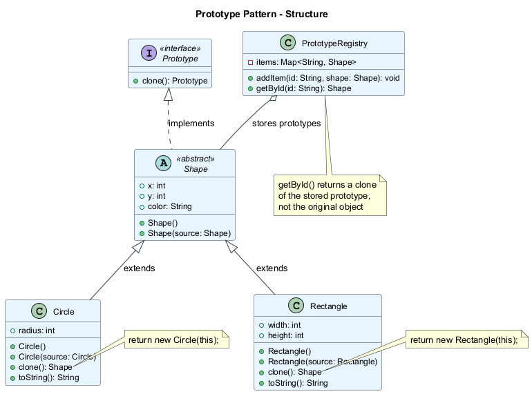

---

## Prototype (Prototip) - Sözde Kod

Bu örnekte, Prototype deseni kodu sınıflarına bağlamadan geometrik nesnelerin tam kopyalarını üretmenize olanak tanır.

```text
// Base prototype
abstract class Shape is
    field X: int
    field Y: int
    field color: string

    // A regular constructor
    constructor Shape() is
        // ...

    // The prototype constructor. A fresh object is
    // initialized with values from the existing object.
    constructor Shape(source: Shape) is
        this()
        this.X = source.X
        this.Y = source.Y
        this.color = source.color

    // The clone operation returns one of the Shape
    // subclasses.
    abstract method clone(): Shape
```

---

## Prototype (Prototip) - Sözde Kod (devam)

```text
class Rectangle extends Shape is
    field width: int
    field height: int

    constructor Rectangle(source: Rectangle) is
        super(source)
        this.width = source.width
        this.height = source.height

    method clone(): Shape is
        return new Rectangle(this)

class Circle extends Shape is
    field radius: int

    constructor Circle(source: Circle) is
        super(source)
        this.radius = source.radius

    method clone(): Shape is
        return new Circle(this)
```

---

## Prototype (Prototip) - Sözde Kod (devam)

```text
// Somewhere in the client code.
class Application is
    field shapes: array of Shape

    constructor Application() is
        Circle circle = new Circle()
        circle.X = 10
        circle.Y = 10
        circle.radius = 20
        shapes.add(circle)

        Circle anotherCircle = circle.clone()
        shapes.add(anotherCircle)
        // anotherCircle is an exact copy of circle

        Rectangle rect = new Rectangle()
        rect.width = 10
        rect.height = 20
        shapes.add(rect)

    method businessLogic() is
        // Prototype rocks because it lets you produce
        // a copy of an object without knowing anything
        // about its type.
        Array shapesCopy = new Array of Shapes

        foreach (s in shapes) do
            shapesCopy.add(s.clone())
        // shapesCopy contains exact copies of shapes
```

---

### Prototype - Sıralama Diyagramı

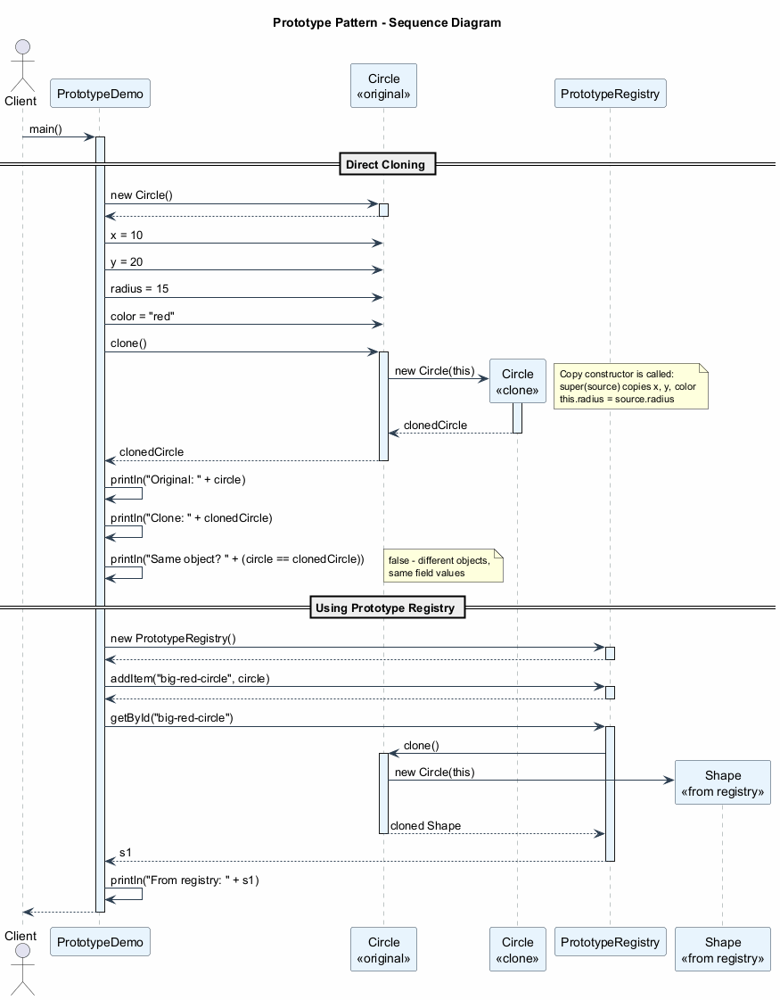

---

## Prototype (Prototip) - Uygulanabilirlik

Prototype desenini şu durumlarda kullanın:

1. **Kodunuzun kopyalaması gereken nesnelerin somut sınıflarına bağımlı olmaması gerektiğinde.**
   - Bu durum, kodunuz 3. taraf kodundan bazı arayüzler aracılığıyla iletilen nesnelerle çalıştığında sıkça yaşanır. Bu nesnelerin somut sınıfları bilinmez ve istesaniz bile onlara bağımlı olamazsınız.
   - Prototype deseni, istemci koduna klonlamayı destekleyen tüm nesnelerle çalışmak için genel bir arayüz sağlar. Bu arayüz, istemci kodunu klonladığı nesnelerin somut sınıflarından bağımsız kılar.

2. **Yalnızca ilgili nesnelerini başlatma şekillerinde farklılık gösteren alt sınıf sayısını azaltmak istediğinizde.**
   - Birisi, belirli bir yapılandırmaya sahip nesneler oluşturabilmek için bu alt sınıfları oluşturmuş olabilir.
   - Prototype deseni, çeşitli şekillerde yapılandırılmış önceden oluşturulmuş nesneler kümesini prototip olarak kullanmanıza olanak tanır. Bazı yapılandırmayla eşleşen bir alt sınıf örneklemek yerine, istemci uygun bir prototipi arayıp klonlayabilir.

---

## Prototype (Prototip) - Nasıl Uygulanır

1. **Prototip arayüzünü oluşturun** ve `clone` yöntemini bildirin. Veya mevcut bir sınıf hiyerarşiniz varsa, yöntemi tüm sınıflara ekleyin.

2. **Bir prototip sınıfı, o sınıfın bir nesnesini argüman olarak kabul eden alternatif yapıcıyı tanımlamalıdır.** Yapıcı, iletilen nesneden sınıfta tanımlanan tüm alanların değerlerini yeni oluşturulan örneğe kopyalamalıdır. Bir alt sınıfı değiştiriyorsanız, üst sınıfın özel alanlarının klonlanmasını ele almasına izin vermek için üst yapıcıyı çağırmalısınız.

3. **Klonlama yöntemi genellikle tek bir satırdan oluşur**: yapıcının prototipsel sürümüyle bir `new` operatörü çalıştırmak. Not: her sınıf klonlama yöntemini açıkça geçersiz kılmalı ve `new` operatörüyle birlikte kendi sınıf adını kullanmalıdır. Aksi takdirde, klonlama yöntemi bir üst sınıf nesnesi üretebilir.

4. **İsteğe bağlı olarak, sık kullanılan prototiplerin bir kataloğunu depolamak için merkezi bir prototip kayıt defteri oluşturun.**

5. **Kayıt defterini yeni bir fabrika sınıfı olarak uygulayabilir** veya prototipi almak için statik bir yönteme sahip temel prototip sınıfına koyabilirsiniz. Bu yöntem, istemci kodunun yönteme ilettiği arama kriterlerine dayalı olarak bir prototip aramalıdır.

---

## Prototype (Prototip) - Artılar ve Eksiler

### Artılar

- **Somut sınıflarına bağlanmadan nesneleri klonlayın.**
- **Önceden oluşturulmuş prototipleri klonlama lehine tekrarlayan başlatma kodundan kurtulun.**
- **Karmaşık nesneleri daha rahat üretin**: nesneler karmaşık iç duruma sahip olduğunda, klonlama sıfırdan oluşturmaktan daha hızlı ve kolaydır.
- **Kalıtıma alternatif**: Karmaşık nesneler için yapılandırma ön ayarlarıyla başa çıkmak için bir alternatif elde edersiniz. Her yapılandırma için alt sınıflar oluşturmak yerine, farklı yapılandırmalara sahip prototipler oluşturabilir ve onları klonlayabilirsiniz.

### Eksiler

- **Dairesel referanslara sahip karmaşık nesneleri klonlamak** çok zor olabilir. Diğer nesnelere referanslar içeren nesnelerin derin klonlanması, dairesel bağımlılıkların dikkatli bir şekilde ele alınmasını gerektirir.

---

## Prototype (Prototip) - Diğer Desenlerle İlişkiler

- Birçok tasarım **Factory Method** ile başlar (daha az karmaşık, alt sınıflar aracılığıyla daha fazla özelleştirilebilir) ve **Abstract Factory**, **Prototype** veya **Builder**'a doğru evrilir (daha esnek, ancak daha karmaşık).

- **Abstract Factory** sınıfları genellikle bir dizi **Factory Method** üzerine kurulur, ancak bu sınıflardaki yöntemleri oluşturmak için **Prototype** da kullanabilirsiniz.

- **Prototype**, **Commands**'ın kopyalarını geçmişe kaydetmeniz gerektiğinde yardımcı olabilir (Memento deseni alternatifi).

- **Composite** ve **Decorator**'ı yoğun kullanan tasarımlar genellikle **Prototype** kullanmaktan fayda görebilir. Deseni uygulamak, karmaşık yapıları sıfırdan yeniden oluşturmak yerine klonlamanıza olanak tanır.

- **Prototype** kalıtıma dayalı değildir, bu nedenle dezavantajları yoktur. Öte yandan, Prototype klonlanan nesnenin karmaşık bir başlatılmasını gerektirir. **Factory Method** kalıtıma dayalıdır ancak bir başlatma adımı gerektirmez.

- Bazen **Prototype**, **Memento**'ya daha basit bir alternatif olabilir. Bu, durumunu geçmişte saklamak istediğiniz nesne oldukça basitse ve dış kaynaklara bağlantıları yoksa veya bağlantılar kolayca yeniden kurulabiliyorsa işe yarar.

- **Abstract Factories**, **Builders** ve **Prototypes**'ın tümü **Singletons** olarak uygulanabilir.

---

## Prototype (Prototip) - Java Kod Örneği

```java
// Prototype interface
interface Prototype {
    Prototype clone();
}

// Abstract base class
abstract class Shape implements Prototype {
    public int x;
    public int y;
    public String color;

    public Shape() {}

    // Copy constructor
    public Shape(Shape source) {
        this.x = source.x;
        this.y = source.y;
        this.color = source.color;
    }
}
```

---

## Prototype (Prototip) - Java Kod Örneği (devam)

```java
// Concrete Prototype - Circle
class Circle extends Shape {
    public int radius;

    public Circle() {}

    public Circle(Circle source) {
        super(source);
        this.radius = source.radius;
    }

    @Override
    public Shape clone() {
        return new Circle(this);
    }

    @Override
    public String toString() {
        return "Circle{x=" + x + ", y=" + y
            + ", color='" + color + "'"
            + ", radius=" + radius + "}";
    }
}
```

---

## Prototype (Prototip) - Java Kod Örneği (devam)

```java
// Concrete Prototype - Rectangle
class Rectangle extends Shape {
    public int width;
    public int height;

    public Rectangle() {}

    public Rectangle(Rectangle source) {
        super(source);
        this.width = source.width;
        this.height = source.height;
    }

    @Override
    public Shape clone() {
        return new Rectangle(this);
    }

    @Override
    public String toString() {
        return "Rectangle{x=" + x + ", y=" + y
            + ", color='" + color + "'"
            + ", width=" + width
            + ", height=" + height + "}";
    }
}
```

---

## Prototype (Prototip) - Java Kod Örneği (devam)

```java
// Prototype Registry
import java.util.HashMap;
import java.util.Map;

class PrototypeRegistry {
    private Map<String, Shape> items = new HashMap<>();

    public void addItem(String id, Shape shape) {
        items.put(id, shape);
    }

    public Shape getById(String id) {
        return (Shape) items.get(id).clone();
    }
}
```

---

## Prototype (Prototip) - Java Kod Örneği (devam)

```java
// Client code
public class PrototypeDemo {
    public static void main(String[] args) {
        // Create original shapes
        Circle circle = new Circle();
        circle.x = 10;
        circle.y = 20;
        circle.radius = 15;
        circle.color = "red";

        // Clone the circle
        Circle clonedCircle = (Circle) circle.clone();
        System.out.println("Original: " + circle);
        System.out.println("Clone:    " + clonedCircle);
        System.out.println("Same object? " +
            (circle == clonedCircle)); // false

        // Use prototype registry
        PrototypeRegistry registry = new PrototypeRegistry();
        registry.addItem("big-red-circle", circle);

        Rectangle rect = new Rectangle();
        rect.x = 0; rect.y = 0;
        rect.width = 100; rect.height = 50;
        rect.color = "blue";
        registry.addItem("blue-rect", rect);

        // Get clones from registry
        Shape s1 = registry.getById("big-red-circle");
        Shape s2 = registry.getById("blue-rect");
        System.out.println("From registry: " + s1);
        System.out.println("From registry: " + s2);
    }
}
```

---

## Modül E: Özet

- **Prototype (Prototip)** (**Clone/Klon** olarak da bilinir) kodunuzu sınıflarına bağımlı kılmadan mevcut nesneleri kopyalamanıza olanak tanır.
- Nesneleri kopyalarken **sınıf bağımlılığı** sorununu çözer ve dışarıdan erişilemeyen **özel alanlar** sorununu ele alır.
- Desen bir **clone arayüzü**, kopya yapıcılara sahip **somut prototipler** ve isteğe bağlı bir **Prototype Registry (Prototip Kayıt Defteri)** kullanır.
- Prototype, yapılandırma ön ayarlarıyla başa çıkmak için **kalıtıma alternatiftir**: alt sınıflar yerine, önceden yapılandırılmış prototipleri kullanın ve klonlayın.
- Ana zorluk, derin klonlama sırasında **dairesel referansları** ele almaktır.
- Prototype, karmaşık yapıları klonlamak için **Composite** ve **Decorator** desenleriyle birleştirilebilir.
- **Factory Method**'dan farklı olarak, Prototype **kalıtıma dayalı değildir** ancak klonlanan nesnenin uygun şekilde başlatılmasını gerektirir.

---

<!-- _backgroundColor: aqua -->

<!-- _color: orange -->

## Modül F: Singleton (Tekil Nesne) Deseni

---

## Singleton (Tekil Nesne) Deseni - Genel Bakış

- **Kategori**: Yaratımsal Desen (Creational Pattern)
- **Karmaşıklık**: Düşük
- **Popülerlik**: Çok Yüksek (aynı zamanda tartışmalı)

**Amaç**: Singleton (Tekil Nesne), bir sınıfın yalnızca bir örneğe sahip olmasını sağlarken, bu örneğe global bir erişim noktası sunan bir yaratımsal tasarım desenidir.

Referans: [RefactoringGuru - Singleton](https://refactoring.guru/design-patterns/singleton)

---

## Singleton (Tekil Nesne) - Problem

Singleton deseni aynı anda iki sorunu çözer (Tek Sorumluluk İlkesini ihlal eder):

**1. Bir sınıfın yalnızca tek bir örneğe sahip olmasını sağlamak.**

- Neden birisi bir sınıfın kaç örneğe sahip olduğunu kontrol etmek istesin? En yaygın neden, paylaşılan bir kaynağa **erişimi kontrol etmektir** -- örneğin, bir veritabanı veya bir dosya.
- Şöyle çalışır: bir nesne oluşturduğunuzu, ancak bir süre sonra yeni bir tane oluşturmaya karar verdiğinizi düşünün. Taze bir nesne almak yerine, zaten oluşturulmuş olanı alırsınız.
- Bu davranışın normal bir yapıcı ile uygulanmasının imkansız olduğunu unutmayın çünkü bir yapıcı çağrısı tasarım gereği her zaman yeni bir nesne döndürmelidir.

**2. Bu örneğe global bir erişim noktası sağlamak.**

- Global değişkenleri hatırlıyor musunuz? Çok kullanışlı olmalarına rağmen, çok güvensizlerdir çünkü herhangi bir kod potansiyel olarak bu değişkenlerin içeriğini üzerine yazabilir ve uygulamayı çökertebilir.
- Tıpkı bir global değişken gibi, Singleton deseni programın herhangi bir yerinden bir nesneye erişmenizi sağlar. Ancak ayrıca **o örneğin başka kod tarafından üzerine yazılmasını da korur**.

---

## Singleton (Tekil Nesne) - Çözüm

Singleton'un tüm uygulamalarında iki ortak adım vardır:

1. **Varsayılan yapıcıyı özel (private) yapın**, diğer nesnelerin Singleton sınıfıyla `new` operatörünü kullanmasını önlemek için.

2. **Yapıcı görevi gören statik bir oluşturma yöntemi oluşturun.** Bu yöntem, perde arkasında bir nesne oluşturmak için özel yapıcıyı çağırır ve onu statik bir alana kaydeder. Bu yönteme yapılan sonraki tüm çağrılar önbelleğe alınmış nesneyi döndürür.

Kodunuz Singleton sınıfına erişebiliyorsa, Singleton'un statik yöntemini çağırabilir. Böylece bu yöntem her çağrıldığında, her zaman aynı nesne döndürülür.

```text
Singleton
┌──────────────────────────────────┐
│ - instance: Singleton (static)   │
│ - Singleton() (private)          │
│                                  │
│ + getInstance(): Singleton       │
│ + businessLogic()                │
└──────────────────────────────────┘
```

---

## Singleton (Tekil Nesne) - Yapı

**Singleton** sınıfı, kendi sınıfının aynı örneğini döndüren statik `getInstance` yöntemini bildirir.

- Singleton'un yapıcısı istemci kodundan gizlenmelidir.
- `getInstance` yöntemini çağırmak, Singleton nesnesini almanın tek yolu olmalıdır.

**Temel yapısal elemanlar:**

| Eleman | Açıklama |
|--------|----------|
| `- instance: Singleton` | Tekil örneği tutan statik alan |
| `- Singleton()` | Dışarıdan örneklemeyi engelleyen özel yapıcı |
| `+ getInstance()` | Tekil örneği döndüren genel statik yöntem |
| İş yöntemleri | Singleton sınıfının sağlaması gereken herhangi bir yöntem |

---

### Singleton - Sınıf Diyagramı

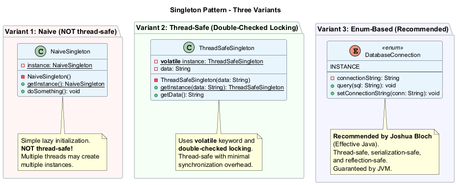

---

## Singleton (Tekil Nesne) - Sözde Kod

Bu örnekte, veritabanı bağlantı sınıfı bir Singleton olarak hareket eder. Bu sınıfın genel bir yapıcısı yoktur, bu nedenle nesnesini almanın tek yolu `getInstance` yöntemini çağırmaktır. Bu yöntem ilk oluşturulan nesneyi önbelleğe alır ve sonraki tüm çağrılarda onu döndürür.

```text
class Database is
    // The field for storing the singleton instance
    // should be declared static.
    private static field instance: Database

    // The singleton's constructor should always be
    // private to prevent direct construction calls
    // with the `new` operator.
    private constructor Database() is
        // Some initialization code, such as the actual
        // connection to a database server.

    // The static method that controls the access to
    // the singleton instance.
    public static method getInstance() is
        if (Database.instance == null) then
            acquireThreadLock() and then
                // Ensure that the instance has not yet been
                // initialized by another thread.
                if (Database.instance == null) then
                    Database.instance = new Database()
        return Database.instance

    public method query(sql) is
        // All database queries go through this method.
```

---

### Singleton - Sıralama Diyagramı

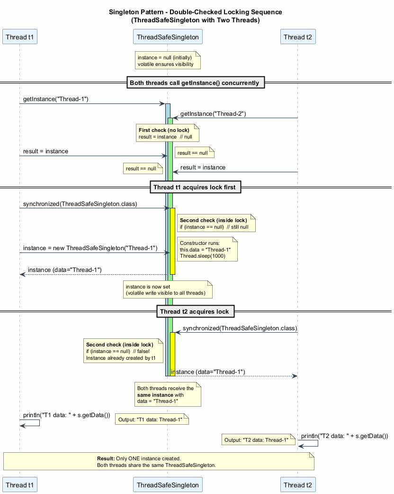

---

## Singleton (Tekil Nesne) - İş Parçacığı Güvenliği Sorunu

**Basit uygulama iş parçacığı güvenli DEĞİLDİR:**

```text
// BROKEN: Race condition possible
public static Singleton getInstance() {
    if (instance == null) {          // Thread A checks
        // Thread B also checks - both see null!
        instance = new Singleton();  // Both create instances!
    }
    return instance;
}
```

**Yarış koşulunun zaman çizelgesi:**

| Zaman | İş Parçacığı A | İş Parçacığı B |
|-------|----------------|----------------|
| T1 | `instance == null` kontrol eder (true) | -- |
| T2 | -- | `instance == null` kontrol eder (true) |
| T3 | Yeni örnek oluşturur | -- |
| T4 | -- | BAŞKA bir yeni örnek oluşturur |
| T5 | İki farklı örnek mevcut! | Singleton ihlal edildi! |

---

## Singleton (Tekil Nesne) - Uygulanabilirlik

Singleton desenini şu durumlarda kullanın:

1. **Programınızdaki bir sınıfın tüm istemciler için yalnızca tek bir örneği olması gerektiğinde**; örneğin, programın farklı bölümleri tarafından paylaşılan tek bir veritabanı nesnesi.
   - Singleton deseni, özel oluşturma yöntemi dışında bir sınıfın nesnelerini oluşturmanın diğer tüm yollarını devre dışı bırakır. Bu yöntem ya yeni bir nesne oluşturur ya da zaten oluşturulmuşsa mevcut olanı döndürür.

2. **Global değişkenler üzerinde daha sıkı kontrol ihtiyacınız olduğunda.**
   - Global değişkenlerin aksine, Singleton deseni bir sınıfın yalnızca bir örneği olduğunu garanti eder. Singleton sınıfının kendisi dışında hiçbir şey önbelleğe alınmış örneği değiştiremez.
   - Bu sınırlamayı her zaman ayarlayabileceğinizi ve herhangi bir sayıda Singleton örneği oluşturmaya izin verebileceğinizi unutmayın. Değiştirilmesi gereken tek kod parçası `getInstance` yönteminin gövdesidir.

---

## Singleton (Tekil Nesne) - Nasıl Uygulanır

1. **Singleton örneğini depolamak için sınıfa özel bir statik alan ekleyin.**

2. **Singleton örneğini almak için genel bir statik oluşturma yöntemi bildirin.**

3. **Statik yöntemin içinde "tembel başlatma" uygulayın.** İlk çağrısında yeni bir nesne oluşturmalı ve onu statik alana koymalıdır. Yöntem, sonraki tüm çağrılarda her zaman bu örneği döndürmelidir.

4. **Sınıfın yapıcısını özel yapın.** Sınıfın statik yöntemi hala yapıcıyı çağırabilecek, ancak diğer nesneler çağıramayacaktır.

5. **İstemci kodunu gözden geçirin** ve singleton'un yapıcısına yapılan tüm doğrudan çağrıları statik oluşturma yöntemi çağrılarıyla değiştirin.

---

## Singleton (Tekil Nesne) - Artılar ve Eksiler

### Artılar

- **Tekil örnek garantisi**: Bir sınıfın yalnızca tek bir örneği olduğundan emin olabilirsiniz.
- **Global erişim noktası**: Bu örneğe global bir erişim noktası elde edersiniz.
- **Tembel başlatma (Lazy initialization)**: Singleton nesnesi yalnızca ilk kez talep edildiğinde başlatılır, hiç kullanılmazsa kaynaklar tasarruf edilir.

### Eksiler

- **Tek Sorumluluk İlkesini (SRP) ihlal eder**: Desen aynı anda iki sorunu çözer (tekil örnek + global erişim).
- **Kötü tasarımı maskeleyebilir**: Örneğin, programın bileşenlerinin birbirleri hakkında çok fazla bilgi sahibi olduğu durumlarda.
- **Çok iş parçacıklı ortamda özel işlem gerektirir**: böylece birden fazla iş parçacığı singleton nesnesini birkaç kez oluşturmaz.
- **Birim test etmesi zor**: Singleton'un yapıcısı özeldir ve statik yöntemleri geçersiz kılmak çoğu dilde imkansızdır. Singleton'u taklit etmek için yaratıcı bir yol düşünmeniz gerekir. Ya da testleri yazmayın. Ya da Singleton desenini kullanmayın.

---

## Singleton (Tekil Nesne) - Diğer Desenlerle İlişkiler

- Bir **Facade** sınıfı genellikle bir **Singleton**'a dönüştürülebilir çünkü çoğu durumda tek bir facade nesnesi yeterlidir.

- Tüm nesnelerin paylaşılan durumlarını tek bir flyweight nesnesine indirgemeyi başarırsanız, **Flyweight** **Singleton**'a benzeyecektir. Ancak iki temel fark vardır:
  1. Yalnızca bir Singleton örneği olmalıdır, oysa bir Flyweight sınıfı farklı iç durumlara sahip birden fazla örneğe sahip olabilir.
  2. Singleton nesnesi değiştirilebilir (mutable). Flyweight nesneleri değiştirilemez (immutable).

- **Abstract Factories**, **Builders** ve **Prototypes**'ın tümü **Singletons** olarak uygulanabilir.

---

## Singleton (Tekil Nesne) - Java Kod Örneği (Basit)

```java
// Simple but NOT thread-safe Singleton
public class NaiveSingleton {
    private static NaiveSingleton instance;

    // Private constructor
    private NaiveSingleton() {
        // Initialization code
        System.out.println("Singleton instance created.");
    }

    // Static accessor method
    public static NaiveSingleton getInstance() {
        if (instance == null) {
            instance = new NaiveSingleton();
        }
        return instance;
    }

    public void doSomething() {
        System.out.println("Singleton is working.");
    }
}
```

**Uyarı**: Bu uygulama iş parçacığı güvenli DEĞİLDİR. Birden fazla iş parçacığı birden fazla örnek oluşturabilir.

---

## Singleton (Tekil Nesne) - Java Kod Örneği (İş Parçacığı Güvenli)

```java
// Thread-safe Singleton with double-checked locking
public class ThreadSafeSingleton {
    // volatile ensures visibility across threads
    private static volatile ThreadSafeSingleton instance;

    private String data;

    private ThreadSafeSingleton(String data) {
        this.data = data;
        // Simulate slow initialization
        try {
            Thread.sleep(1000);
        } catch (InterruptedException e) {
            e.printStackTrace();
        }
    }

    // Double-checked locking
    public static ThreadSafeSingleton getInstance(String data) {
        ThreadSafeSingleton result = instance;
        if (result != null) {
            return result;  // Fast path: no locking needed
        }
        synchronized (ThreadSafeSingleton.class) {
            if (instance == null) {
                instance = new ThreadSafeSingleton(data);
            }
            return instance;
        }
    }

    public String getData() { return data; }
}
```

---

## Singleton (Tekil Nesne) - Java Kod Örneği (Enum Tabanlı)

```java
// The simplest and most effective Singleton in Java
// Joshua Bloch recommends this approach in Effective Java
public enum DatabaseConnection {
    INSTANCE;

    private String connectionString;

    DatabaseConnection() {
        // Initialization happens once, guaranteed by JVM
        this.connectionString = "jdbc:mysql://localhost:3306/mydb";
        System.out.println("Database connection initialized.");
    }

    public void query(String sql) {
        System.out.println("Executing query: " + sql
            + " on " + connectionString);
    }

    public void setConnectionString(String conn) {
        this.connectionString = conn;
    }
}

// Usage
class EnumSingletonDemo {
    public static void main(String[] args) {
        DatabaseConnection db = DatabaseConnection.INSTANCE;
        db.query("SELECT * FROM users");

        // Same instance everywhere
        DatabaseConnection db2 = DatabaseConnection.INSTANCE;
        System.out.println("Same? " + (db == db2)); // true
    }
}
```

---

## Singleton (Tekil Nesne) - Java Kod Örneği (Kapsamlı Demo)

```java
// Comprehensive Singleton demonstration
public class SingletonDemo {
    public static void main(String[] args) {
        // Test thread-safe singleton
        System.out.println("--- Thread-Safe Singleton ---");

        Thread t1 = new Thread(() -> {
            ThreadSafeSingleton s =
                ThreadSafeSingleton.getInstance("Thread-1");
            System.out.println("T1 data: " + s.getData());
        });

        Thread t2 = new Thread(() -> {
            ThreadSafeSingleton s =
                ThreadSafeSingleton.getInstance("Thread-2");
            System.out.println("T2 data: " + s.getData());
        });

        t1.start();
        t2.start();

        // Both threads get the SAME instance
        // Only one of "Thread-1" or "Thread-2" will be
        // the data value, depending on which thread
        // created the instance first.

        System.out.println("\n--- Enum Singleton ---");
        DatabaseConnection.INSTANCE.query("SELECT 1");
    }
}
```

---

## Singleton (Tekil Nesne) - Uygulama Karşılaştırması

| Yaklaşım | İş Parçacığı Güvenli | Tembel Başlatma | Serileştirme Güvenli | Yansıma Güvenli |
|-----------|:--------------------:|:---------------:|:--------------------:|:---------------:|
| Basit (Naive) | Hayır | Evet | Hayır | Hayır |
| Synchronized yöntem | Evet | Evet | Hayır | Hayır |
| Çift kontrollü kilitleme | Evet | Evet | Hayır | Hayır |
| Bill Pugh (İç sınıf) | Evet | Evet | Hayır | Hayır |
| **Enum** | **Evet** | **Hayır** | **Evet** | **Evet** |

- **Enum tabanlı** yaklaşım Java'da önerilen yoldur (Joshua Bloch'un Effective Java kitabı).
- Serileştirme güvenliği (JVM tarafından ele alınır) ve yansıma güvenliği (yansıma aracılığıyla enum örnekleri oluşturulamaz) sağlar.
- Tek dezavantajı tembel başlatmayı desteklememesidir (enum örnekleri enum sınıfı yüklendiğinde oluşturulur).

---

## Modül F: Özet

- **Singleton (Tekil Nesne)**, bir sınıfın yalnızca bir örneğe sahip olmasını sağlar ve ona global bir erişim noktası sunar.
- **İki sorunu** çözer: örnek sayısını kontrol etme ve global erişim sağlama.
- Desen bir **özel yapıcı** ve bir **statik getInstance() yöntemi** gerektirir.
- **İş parçacığı güvenliği** kritik bir endişedir; basit uygulamalar eşzamanlı erişim altında bozulabilir.
- Java birden fazla Singleton uygulaması sunar: basit, synchronized, çift kontrollü kilitleme, iç sınıf (Bill Pugh) ve **enum** (önerilen).
- Singleton **tartışmalıdır**: SRP'yi ihlal eder, kötü tasarımı maskeleyebilir ve test etmeyi zorlaştırır.
- Abstract Factories, Builders ve Prototypes'ın tümü **Singletons** olarak uygulanabilir.
- **Enum tabanlı Singleton**, Java'daki altın standarttır: iş parçacığı güvenli, serileştirme güvenli ve yansıma güvenli.

---

<!-- _backgroundColor: aqua -->

<!-- _color: orange -->

## Kaynaklar

---

## Kaynaklar

1. [RefactoringGuru - Design Patterns](https://refactoring.guru/design-patterns) - Birden fazla dilde örneklerle tasarım desenleri için kapsamlı rehber.

2. [RefactoringGuru - Factory Method](https://refactoring.guru/design-patterns/factory-method) - Factory Method deseni: amaç, yapı, sözde kod, uygulanabilirlik ve uygulama.

3. [RefactoringGuru - Abstract Factory](https://refactoring.guru/design-patterns/abstract-factory) - Abstract Factory deseni: ilişkili nesne aileleri üretme.

4. [RefactoringGuru - Builder](https://refactoring.guru/design-patterns/builder) - Builder deseni: karmaşık nesneleri adım adım oluşturma.

5. [RefactoringGuru - Prototype](https://refactoring.guru/design-patterns/prototype) - Prototype deseni: sınıf bağımlılığı olmadan mevcut nesneleri kopyalama.

6. [RefactoringGuru - Singleton](https://refactoring.guru/design-patterns/singleton) - Singleton deseni: global erişimle tekil örnek sağlama.

7. Gamma, E., Helm, R., Johnson, R., & Vlissides, J. (1994). *Design Patterns: Elements of Reusable Object-Oriented Software*. Addison-Wesley.

8. Bloch, J. (2018). *Effective Java* (3. baskı). Addison-Wesley. - Enum kullanarak önerilen Singleton uygulaması.

---

$End-Of-Week-9-Module$
